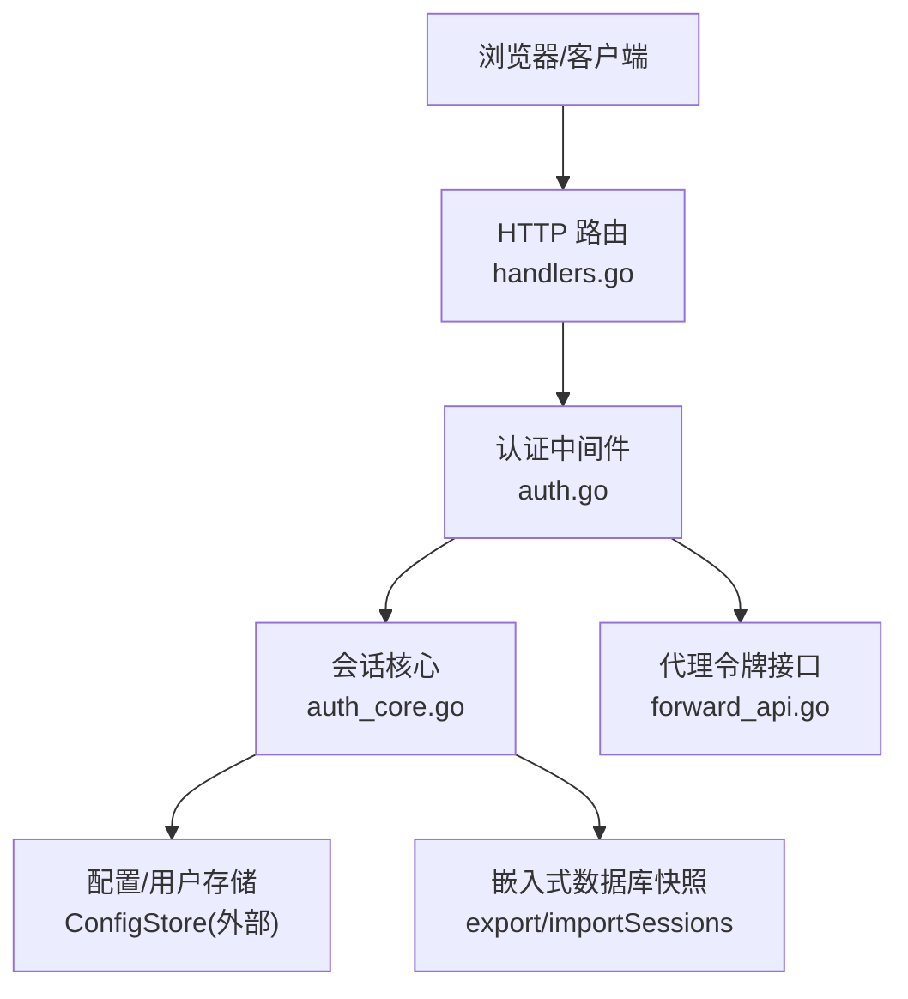
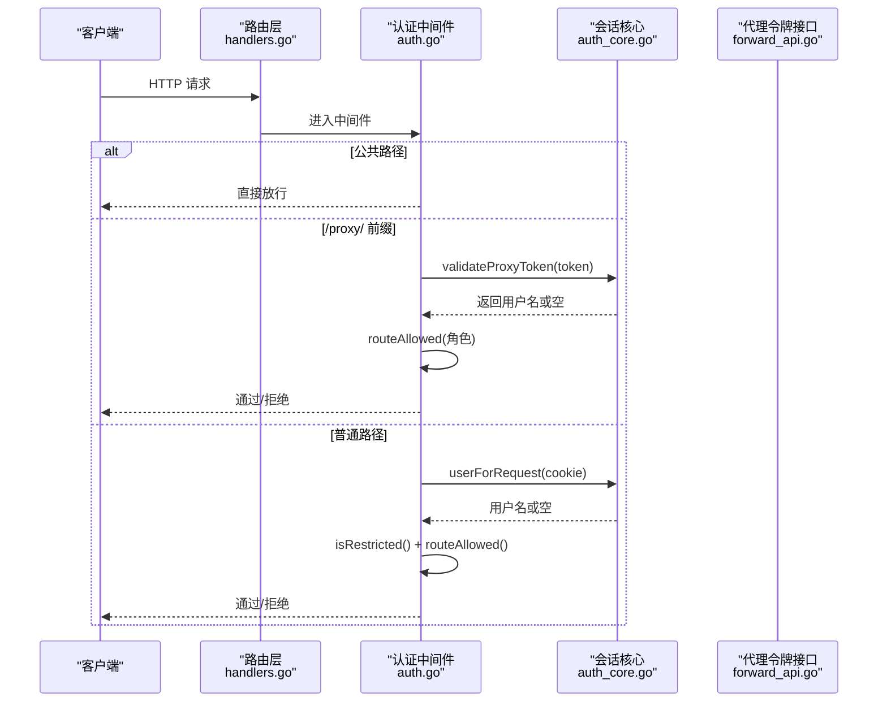
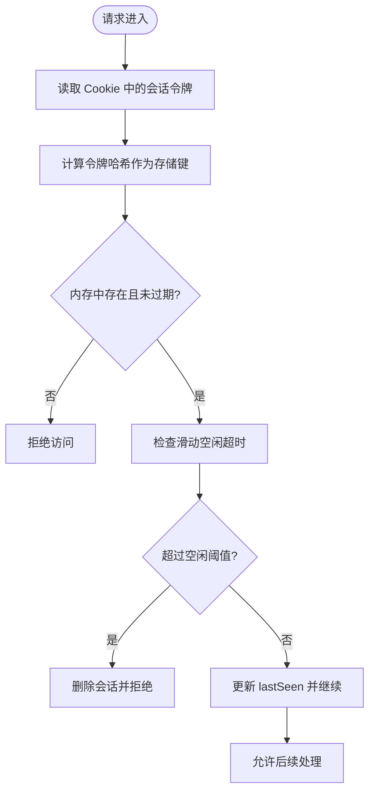
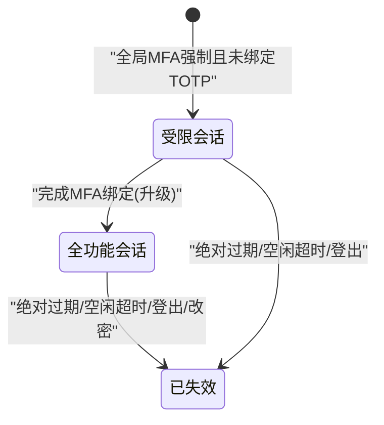
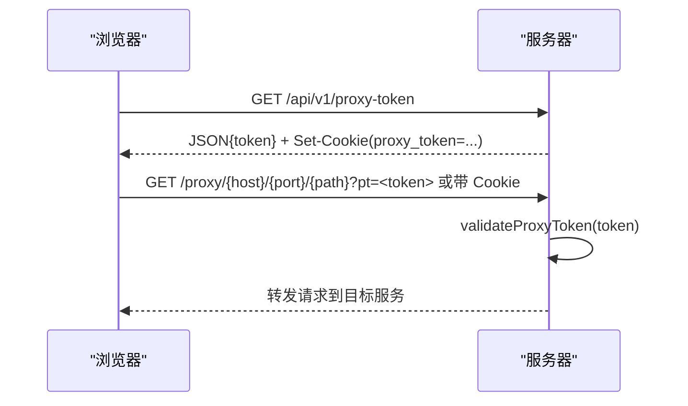
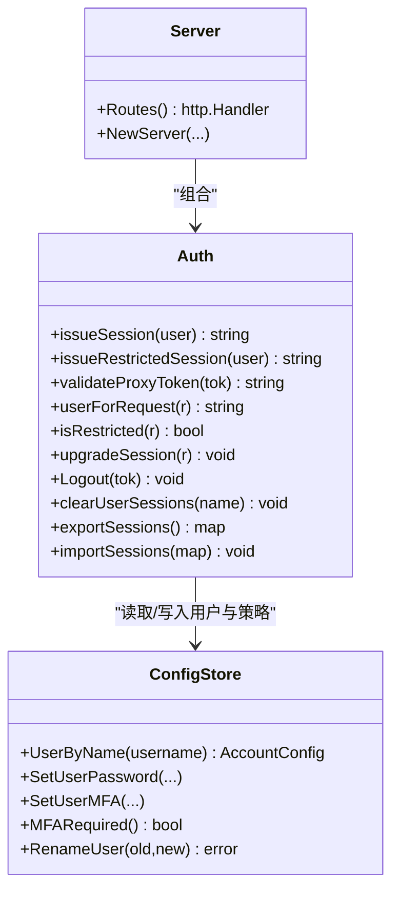

# 会话管理

<cite>
**本文引用的文件**   
- [auth.go](file://cmd/server/auth.go)
- [auth_core.go](file://cmd/server/auth_core.go)
- [handlers.go](file://cmd/server/handlers.go)
- [forward_api.go](file://cmd/server/forward_api.go)
- [terminal_auth.go](file://cmd/server/terminal_auth.go)
</cite>

## 目录
1. [简介](#简介)
2. [项目结构](#项目结构)
3. [核心组件](#核心组件)
4. [架构总览](#架构总览)
5. [详细组件分析](#详细组件分析)
6. [依赖关系分析](#依赖关系分析)
7. [性能考量](#性能考量)
8. [故障排查指南](#故障排查指南)
9. [结论](#结论)
10. [附录](#附录)

## 简介
本文件面向 AIOps Monitor 的“会话管理”子系统，系统性阐述以下主题：
- 会话令牌生成、存储与验证机制
- Cookie 安全配置与跨域访问支持
- 受限会话概念、会话升级流程与会话失效策略
- 代理令牌机制（HTTP 反向代理场景）
- 并发登录控制与速率限制
- 会话清理策略与持久化桥接
- 会话安全最佳实践与性能优化建议

## 项目结构
与“会话管理”直接相关的后端代码集中在 cmd/server 目录下：
- auth.go：认证中间件、登录/登出、MFA、全局 MFA 策略、路由权限控制等
- auth_core.go：会话数据结构、令牌生成与校验、代理令牌、速率限制、会话持久化桥接等
- handlers.go：HTTP 路由注册与静态资源处理
- forward_api.go：HTTP 代理快捷方式与代理令牌发放接口
- terminal_auth.go：终端二次认证相关校验逻辑

图表来源
- [handlers.go:100-350](file://cmd/server/handlers.go#L100-L350)
- [auth.go:110-172](file://cmd/server/auth.go#L110-L172)
- [auth_core.go:178-180](file://cmd/server/auth_core.go#L178-L180)
- [forward_api.go:369-392](file://cmd/server/forward_api.go#L369-L392)

章节来源
- [handlers.go:100-350](file://cmd/server/handlers.go#L100-L350)
- [auth.go:110-172](file://cmd/server/auth.go#L110-L172)
- [auth_core.go:178-180](file://cmd/server/auth_core.go#L178-L180)
- [forward_api.go:369-392](file://cmd/server/forward_api.go#L369-L392)

## 核心组件
- 会话模型与会话表
  - 会话对象包含：用户名、绝对过期时间、是否受限、终端二次验证标记、最近活动时间（滑动空闲超时）
  - 内存中按“令牌哈希”索引，避免泄露可重放
- 认证与授权
  - 统一中间件：公共路径放行、代理令牌优先、Cookie 会话校验、受限会话检查、RBAC 路由权限
- 代理令牌
  - 短生命周期、单次使用，用于 window.open 新标签页场景下的跨上下文鉴权
- 速率限制
  - IP 维度与账号维度的登录失败计数窗口
  - 终端密码验证次数限制与锁定
- TOTP 单用保护
  - 基于时间步长的去重，防止同一时段内重用验证码
- 会话持久化桥接
  - 仅导出未过期会话到嵌入式数据库；重启后导入并恢复活跃会话

章节来源
- [auth_core.go:96-105](file://cmd/server/auth_core.go#L96-L105)
- [auth_core.go:323-354](file://cmd/server/auth_core.go#L323-L354)
- [auth_core.go:380-402](file://cmd/server/auth_core.go#L380-L402)
- [auth_core.go:419-432](file://cmd/server/auth_core.go#L419-L432)
- [auth_core.go:477-505](file://cmd/server/auth_core.go#L477-L505)
- [auth.go:110-172](file://cmd/server/auth.go#L110-L172)
- [auth.go:176-307](file://cmd/server/auth.go#L176-L307)
- [auth.go:582-585](file://cmd/server/auth.go#L582-L585)
- [forward_api.go:369-392](file://cmd/server/forward_api.go#L369-L392)

## 架构总览
下图展示了从请求进入、认证中间件、会话校验、受限会话与 RBAC 判定，以及代理令牌的完整链路。

图表来源
- [handlers.go:100-350](file://cmd/server/handlers.go#L100-L350)
- [auth.go:110-172](file://cmd/server/auth.go#L110-L172)
- [auth_core.go:434-448](file://cmd/server/auth_core.go#L434-L448)
- [auth_core.go:404-417](file://cmd/server/auth_core.go#L404-L417)
- [auth_core.go:166-176](file://cmd/server/auth_core.go#L166-L176)
- [forward_api.go:369-392](file://cmd/server/forward_api.go#L369-L392)

## 详细组件分析

### 会话令牌生成、存储与验证
- 令牌生成
  - 使用加密安全的随机源生成高熵令牌
  - 会话以“令牌哈希”为键存储在内存表中，避免泄露后可重放
- 会话存储
  - 内存表维护所有活跃会话；每次变更标记 dirty，供持久化桥接使用
  - 仅导出未过期会话至嵌入式数据库，重启时导入并恢复
- 会话验证
  - 校验 Cookie 中的会话令牌，计算哈希查找
  - 双重失效条件：绝对过期时间与滑动空闲超时（任一触发即失效）
  - 活动请求会更新 lastSeen，实现滑动空闲超时

图表来源
- [auth_core.go:323-354](file://cmd/server/auth_core.go#L323-L354)
- [auth_core.go:477-505](file://cmd/server/auth_core.go#L477-L505)

章节来源
- [auth_core.go:287-295](file://cmd/server/auth_core.go#L287-L295)
- [auth_core.go:323-354](file://cmd/server/auth_core.go#L323-L354)
- [auth_core.go:477-505](file://cmd/server/auth_core.go#L477-L505)

### Cookie 安全配置与跨域访问支持
- Cookie 属性
  - HttpOnly：禁止前端脚本读取，降低 XSS 窃取风险
  - Secure：仅在 HTTPS 下发送，需部署 TLS 反代
  - SameSite=Lax：默认跨站携带行为受控，适合常规跳转场景
  - MaxAge：会话 TTL（绝对有效期）
- 跨域与 window.open 场景
  - 通过代理令牌机制解决新标签页无法自动携带 Cookie 的问题
  - 代理令牌短期有效、单次使用，并在响应中设置同名 Cookie 供后续请求携带

章节来源
- [auth.go:283-299](file://cmd/server/auth.go#L283-L299)
- [auth.go:458-466](file://cmd/server/auth.go#L458-L466)
- [forward_api.go:369-392](file://cmd/server/forward_api.go#L369-L392)

### 受限会话、会话升级与失效策略
- 受限会话
  - 当启用全局 MFA 强制策略且用户尚未绑定 TOTP 时，系统签发受限会话
  - 受限会话仅允许访问 MFA 设置/启用与登出端点
- 会话升级
  - 完成 MFA 绑定后，将当前受限会话升级为全功能会话
- 失效策略
  - 绝对过期：固定 TTL（例如一周）
  - 滑动空闲：在一段时间无活动则失效（例如 24 小时）
  - 主动注销：登出接口立即失效当前会话
  - 密码修改：清除该用户全部会话，强制重新登录

图表来源
- [auth.go:279-307](file://cmd/server/auth.go#L279-L307)
- [auth.go:582-585](file://cmd/server/auth.go#L582-L585)
- [auth_core.go:391-432](file://cmd/server/auth_core.go#L391-L432)
- [auth_core.go:331-354](file://cmd/server/auth_core.go#L331-L354)

章节来源
- [auth.go:279-307](file://cmd/server/auth.go#L279-L307)
- [auth.go:582-585](file://cmd/server/auth.go#L582-L585)
- [auth_core.go:391-432](file://cmd/server/auth_core.go#L391-L432)
- [auth_core.go:331-354](file://cmd/server/auth_core.go#L331-L354)

### 代理令牌机制（HTTP 反向代理）
- 适用场景
  - 通过 window.open 打开新标签页时，浏览器可能不携带原上下文 Cookie
- 工作流程
  - 先调用代理令牌接口获取一次性令牌，服务端同时设置同名 Cookie
  - 后续对 /proxy/ 的请求优先校验代理令牌（支持 Cookie 或查询参数回退）
  - 校验通过后仍进行 RBAC 复核，确保权限一致
- 安全性
  - 短生命周期、单次使用，避免长期持有
  - 建议配合 HttpOnly 与 Secure 属性，减少泄露风险

图表来源
- [forward_api.go:369-392](file://cmd/server/forward_api.go#L369-L392)
- [auth.go:130-152](file://cmd/server/auth.go#L130-L152)
- [auth_core.go:157-176](file://cmd/server/auth_core.go#L157-L176)

章节来源
- [forward_api.go:369-392](file://cmd/server/forward_api.go#L369-L392)
- [auth.go:130-152](file://cmd/server/auth.go#L130-L152)
- [auth_core.go:157-176](file://cmd/server/auth_core.go#L157-L176)

### 并发登录控制与速率限制
- IP 维度登录失败限制
  - 滑动时间窗内累计失败超过阈值则拒绝
- 账号维度登录失败限制
  - 独立于 IP，抵御分布式撞库
- 终端二次验证限制
  - 连续失败达到上限后短时锁定
- TOTP 单用保护
  - 同一时间步长内的验证码不可重复使用

章节来源
- [auth_core.go:182-260](file://cmd/server/auth_core.go#L182-L260)
- [auth_core.go:262-285](file://cmd/server/auth_core.go#L262-L285)
- [auth_core.go:555-585](file://cmd/server/auth_core.go#L555-L585)

### 会话清理策略与持久化桥接
- 清理时机
  - 绝对过期与空闲超时会话在验证时被删除
  - 登出、改密、管理员重置等操作主动清理
- 持久化桥接
  - exportSessions：仅导出未过期会话
  - importSessions：启动时导入未过期会话，lastSeen 初始化为当前时间

章节来源
- [auth_core.go:331-354](file://cmd/server/auth_core.go#L331-L354)
- [auth_core.go:364-378](file://cmd/server/auth_core.go#L364-L378)
- [auth_core.go:477-505](file://cmd/server/auth_core.go#L477-L505)

### 终端二次认证与会话状态
- 终端二次认证要求
  - 协议同意 + 终端密码设置 + 每会话一次验证（缓存于会话）
- 会话字段
  - terminalVerified：记录本次会话是否已通过终端二次验证

章节来源
- [terminal_auth.go:1-45](file://cmd/server/terminal_auth.go#L1-L45)
- [auth_core.go:96-105](file://cmd/server/auth_core.go#L96-L105)
- [auth_core.go:515-553](file://cmd/server/auth_core.go#L515-L553)

## 依赖关系分析
- 组件耦合
  - Server 组合了 Auth、ConfigStore、Store 等，负责路由与业务编排
  - Auth 依赖 ConfigStore 进行用户信息读写，并通过 export/import 与嵌入式数据库交互
- 关键依赖链
  - 路由 -> 认证中间件 -> 会话核心 -> 配置存储
  - 代理令牌接口 -> 会话核心（生成/校验）

图表来源
- [handlers.go:17-45](file://cmd/server/handlers.go#L17-L45)
- [auth_core.go:110-135](file://cmd/server/auth_core.go#L110-L135)
- [auth_core.go:380-402](file://cmd/server/auth_core.go#L380-L402)
- [auth_core.go:477-505](file://cmd/server/auth_core.go#L477-L505)

章节来源
- [handlers.go:17-45](file://cmd/server/handlers.go#L17-L45)
- [auth_core.go:110-135](file://cmd/server/auth_core.go#L110-L135)
- [auth_core.go:380-402](file://cmd/server/auth_core.go#L380-L402)
- [auth_core.go:477-505](file://cmd/server/auth_core.go#L477-L505)

## 性能考量
- 令牌哈希索引
  - 使用 SHA-256 哈希作为存储键，避免泄露可重放，但增加一次哈希计算开销
- 滑动空闲超时
  - 每次活动请求更新 lastSeen，带来额外写操作；可通过合理调整空闲阈值平衡体验与安全
- 速率限制
  - 滑动窗口清理与大小上限保护，避免内存无限增长
- 代理令牌
  - 短生命周期与单次使用，降低长期持有带来的安全风险，同时减少令牌表规模
- 持久化桥接
  - 仅导出未过期会话，减少 I/O 压力；导入时跳过过期项，提升恢复效率

[本节为通用性能讨论，无需具体文件引用]

## 故障排查指南
- 常见问题
  - 登录后频繁被踢出：检查空闲超时与绝对过期配置；确认客户端是否持续活动
  - 新标签页无法访问代理：确认代理令牌是否成功下发并携带 Cookie；必要时检查 SameSite 与跨域策略
  - 终端二次验证失败锁定：查看终端密码验证失败次数与锁定时间
  - 全局 MFA 强制导致受限会话：引导用户完成 MFA 绑定以升级会话
- 定位方法
  - 观察认证中间件的日志输出（登录成功/失败、TOTP 错误、受限会话提示等）
  - 核对代理令牌接口返回与响应头 Set-Cookie 是否正确
  - 检查会话表是否因过期或空闲超时被清理

章节来源
- [auth.go:176-307](file://cmd/server/auth.go#L176-L307)
- [auth.go:582-585](file://cmd/server/auth.go#L582-L585)
- [auth_core.go:331-354](file://cmd/server/auth_core.go#L331-L354)
- [auth_core.go:555-585](file://cmd/server/auth_core.go#L555-L585)

## 结论
AIOps Monitor 的会话管理采用“令牌哈希索引 + 双失效策略（绝对过期与滑动空闲）+ 受限会话 + 代理令牌”的综合方案，兼顾安全性与可用性。通过严格的速率限制与 TOTP 单用保护，有效抵御暴力破解与重放攻击。结合合理的 Cookie 安全配置与跨域支持，可在多标签页与反向代理场景中提供稳定一致的鉴权体验。

[本节为总结性内容，无需具体文件引用]

## 附录

### 会话安全最佳实践
- 强制 HTTPS 与 Secure Cookie，避免明文传输
- 保持 HttpOnly 与 SameSite=Lax（或 Strict，视业务需要）
- 定期轮换密钥与最小化敏感数据暴露
- 对高风险操作（如终端访问、端口转发）实施二次验证与 RBAC 复核
- 监控与审计：记录登录、MFA、代理令牌、会话失效等关键事件

[本节为通用安全建议，无需具体文件引用]

### 性能优化建议
- 根据业务活跃度调优空闲超时与绝对过期时间
- 评估并发量与内存占用，必要时引入外部会话存储（如 Redis）替代内存表
- 对代理令牌与速率限制表进行定期清理与容量上限保护
- 利用异步持久化与批量导出，降低主路径延迟

[本节为通用优化建议，无需具体文件引用]