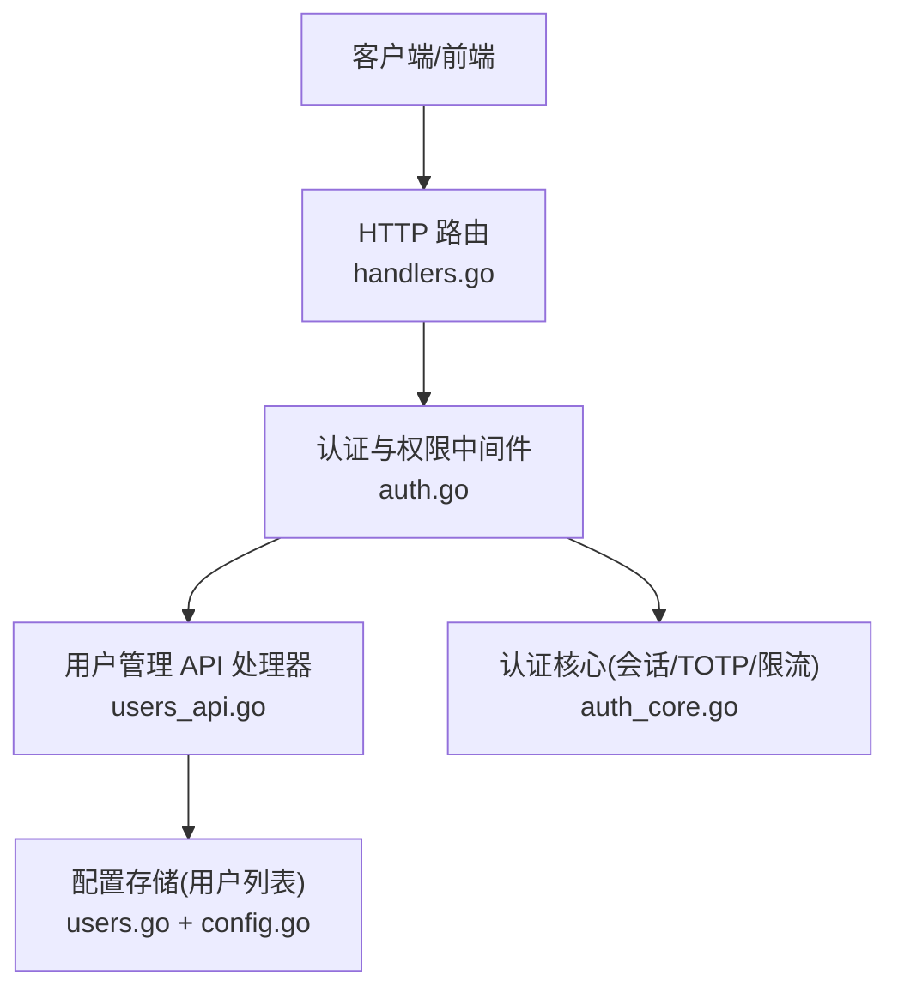
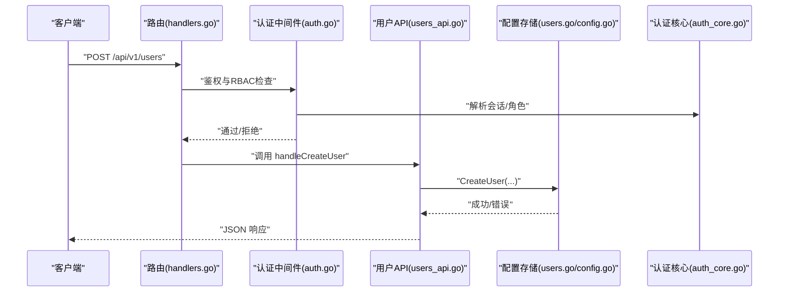
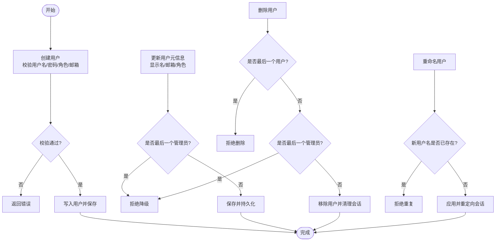
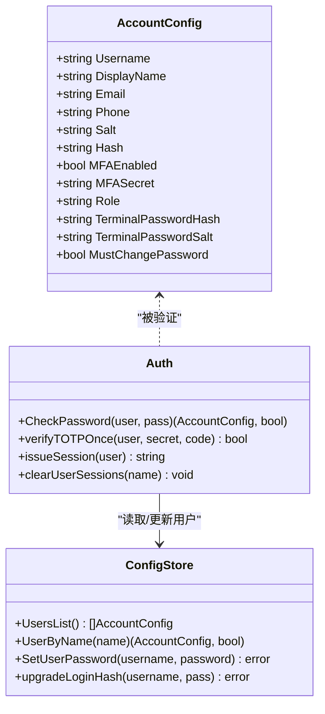
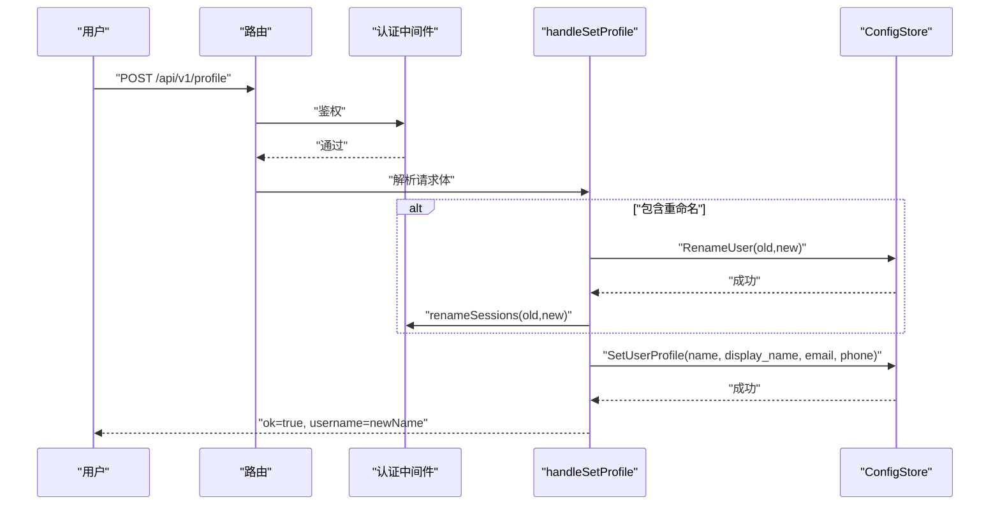
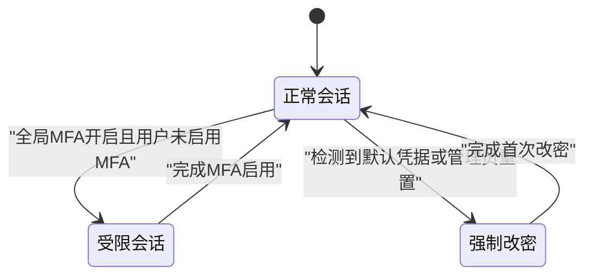
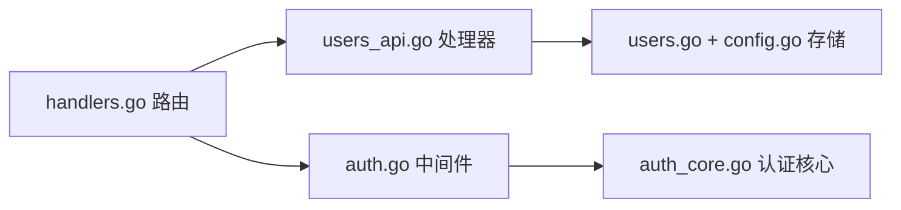

# 用户管理

<cite>
**本文引用的文件**
- [handlers.go](file://cmd/server/handlers.go)
- [users_api.go](file://cmd/server/users_api.go)
- [users.go](file://cmd/server/users.go)
- [auth.go](file://cmd/server/auth.go)
- [auth_core.go](file://cmd/server/auth_core.go)
- [config.go](file://cmd/server/config.go)
</cite>

## 目录
1. [简介](#简介)
2. [项目结构](#项目结构)
3. [核心组件](#核心组件)
4. [架构总览](#架构总览)
5. [详细组件分析](#详细组件分析)
6. [依赖关系分析](#依赖关系分析)
7. [性能与安全考量](#性能与安全考量)
8. [故障排查指南](#故障排查指南)
9. [结论](#结论)
10. [附录：API 参考](#附录api-参考)

## 简介
本文件为 AIOps Monitor 的用户管理系统提供完整文档，覆盖用户生命周期（创建、修改、删除、重命名）、用户配置文件结构、密码策略与验证、个人资料更新、状态管理（含强制改密标志）、MFA 与全局策略、登录与会话控制。同时说明搜索与过滤能力边界、批量操作现状与扩展建议，并给出用户管理 API 的完整参考（请求参数、响应格式、错误处理）。

## 项目结构
用户管理相关代码主要分布在以下模块：
- HTTP 路由注册与中间件鉴权：handlers.go、auth.go
- 用户管理 API 处理器：users_api.go
- 用户数据模型与持久化访问器：users.go、config.go
- 认证与会话、密码哈希、TOTP 等安全能力：auth.go、auth_core.go

图表来源
- [handlers.go:100-175](file://cmd/server/handlers.go#L100-L175)
- [auth.go:110-172](file://cmd/server/auth.go#L110-L172)
- [users_api.go:19-140](file://cmd/server/users_api.go#L19-L140)
- [users.go:78-171](file://cmd/server/users.go#L78-L171)
- [auth_core.go:178-205](file://cmd/server/auth_core.go#L178-L205)

章节来源
- [handlers.go:100-175](file://cmd/server/handlers.go#L100-L175)
- [auth.go:110-172](file://cmd/server/auth.go#L110-L172)

## 核心组件
- 角色与权限
  - 角色：admin、operator、viewer；通过等级进行授权判定。
  - 路由级 RBAC：用户管理接口仅 admin 可访问；其余写操作需 operator+；读操作 viewer+。
- 用户配置结构
  - 用户名、显示名、邮箱、手机号、角色、MFA 开关与密钥、终端二次密码、强制改密标志等。
- 密码策略
  - 最小长度、大小写字母、数字、特殊字符组合要求；默认管理员账户首次登录强制改密。
- 会话与 MFA
  - 基于 Cookie 的会话，支持受限会话（仅允许 MFA 设置）；TOTP 单码防重放；全局 MFA 策略。
- 用户数据访问
  - 线程安全的读写锁保护；按用户名/邮箱/手机号查找；增删改查与元信息更新。

章节来源
- [users.go:19-41](file://cmd/server/users.go#L19-L41)
- [config.go:320-342](file://cmd/server/config.go#L320-L342)
- [auth.go:60-81](file://cmd/server/auth.go#L60-L81)
- [auth.go:83-108](file://cmd/server/auth.go#L83-L108)
- [auth.go:250-307](file://cmd/server/auth.go#L250-L307)
- [auth_core.go:96-150](file://cmd/server/auth_core.go#L96-L150)

## 架构总览
下图展示了用户管理的端到端流程：客户端发起请求 → 路由分发 → 认证与权限校验 → 业务处理器 → 配置存储层。

图表来源
- [handlers.go:155-161](file://cmd/server/handlers.go#L155-L161)
- [auth.go:110-172](file://cmd/server/auth.go#L110-L172)
- [users_api.go:28-64](file://cmd/server/users_api.go#L28-L64)
- [users.go:157-171](file://cmd/server/users.go#L157-L171)
- [auth_core.go:331-354](file://cmd/server/auth_core.go#L331-L354)

## 详细组件分析

### 用户数据模型与生命周期
- 数据结构
  - 账号字段包含用户名、显示名、邮箱、手机号、角色、MFA 开关与密钥、终端二次密码、强制改密标志等。
- 生命周期操作
  - 创建：校验用户名唯一性、密码强度、角色合法性、邮箱格式；生成盐值并计算哈希后持久化。
  - 修改：更新显示名、邮箱、角色；禁止将最后一个管理员降级。
  - 删除：禁止删除最后一个用户或最后一个管理员；删除后清理该用户所有会话。
  - 重命名：支持自服务重命名，成功后同步更新会话绑定。
  - 密码重置：管理员可重置用户密码并强制下次登录更改；用户可自助修改旧密码为新密码。
  - 资料更新：用户可更新自己的显示名、邮箱、手机号。
  - 状态管理：MustChangePassword 标志用于强制首次改密；MFA 启用/禁用受全局策略约束。

图表来源
- [users_api.go:28-64](file://cmd/server/users_api.go#L28-L64)
- [users_api.go:66-92](file://cmd/server/users_api.go#L66-L92)
- [users_api.go:94-107](file://cmd/server/users_api.go#L94-L107)
- [auth.go:332-367](file://cmd/server/auth.go#L332-L367)
- [users.go:157-171](file://cmd/server/users.go#L157-L171)
- [users.go:173-191](file://cmd/server/users.go#L173-L191)
- [users.go:352-371](file://cmd/server/users.go#L352-L371)
- [users.go:317-332](file://cmd/server/users.go#L317-L332)

章节来源
- [config.go:320-342](file://cmd/server/config.go#L320-L342)
- [users.go:157-171](file://cmd/server/users.go#L157-L171)
- [users.go:173-191](file://cmd/server/users.go#L173-L191)
- [users.go:352-371](file://cmd/server/users.go#L352-L371)
- [users.go:317-332](file://cmd/server/users.go#L317-L332)
- [auth.go:332-367](file://cmd/server/auth.go#L332-L367)

### 密码策略与验证
- 策略规则
  - 至少 8 个字符，包含大写字母、小写字母、数字和特殊字符。
- 实现要点
  - 使用 PBKDF2-HMAC-SHA256 高迭代次数进行哈希；兼容旧版 SHA-256 并在首次成功登录后自动升级。
  - 登录失败时记录 IP 与账号维度的尝试次数，触发限流。
  - 默认管理员账户首次登录检测到默认凭据时强制改密。

图表来源
- [config.go:320-342](file://cmd/server/config.go#L320-L342)
- [auth_core.go:297-321](file://cmd/server/auth_core.go#L297-L321)
- [auth_core.go:262-285](file://cmd/server/auth_core.go#L262-L285)
- [auth_core.go:380-389](file://cmd/server/auth_core.go#L380-L389)
- [auth_core.go:450-461](file://cmd/server/auth_core.go#L450-L461)
- [users.go:193-208](file://cmd/server/users.go#L193-L208)
- [users.go:214-228](file://cmd/server/users.go#L214-L228)

章节来源
- [auth.go:60-81](file://cmd/server/auth.go#L60-L81)
- [auth_core.go:22-88](file://cmd/server/auth_core.go#L22-L88)
- [auth_core.go:297-321](file://cmd/server/auth_core.go#L297-L321)
- [auth.go:250-307](file://cmd/server/auth.go#L250-L307)

### 用户资料更新与重命名
- 自服务资料更新
  - 支持更新显示名、邮箱、手机号；可选在更新时重命名用户名，成功后刷新会话绑定。
- 管理员修改用户元信息
  - 可更新显示名、邮箱、角色；禁止将最后一个管理员降级。

图表来源
- [auth.go:332-367](file://cmd/server/auth.go#L332-L367)
- [auth_core.go:463-475](file://cmd/server/auth_core.go#L463-L475)
- [users.go:317-332](file://cmd/server/users.go#L317-L332)
- [users.go:255-268](file://cmd/server/users.go#L255-L268)

章节来源
- [auth.go:332-367](file://cmd/server/auth.go#L332-L367)
- [users.go:255-268](file://cmd/server/users.go#L255-L268)
- [users.go:317-332](file://cmd/server/users.go#L317-L332)

### 用户状态管理与 MFA
- 强制改密
  - 默认管理员/admin 首次登录检测并设置 MustChangePassword；管理员重置密码也会设置该标志。
- 全局 MFA 策略
  - 管理员可开启全局 MFA 强制；未启用 MFA 的用户将被发放受限会话，仅允许 MFA 设置与登出。
- TOTP 单码防重放
  - 同一时间步长的验证码在窗口内不可重用。

图表来源
- [auth.go:250-307](file://cmd/server/auth.go#L250-L307)
- [auth.go:587-615](file://cmd/server/auth.go#L587-L615)
- [auth_core.go:262-285](file://cmd/server/auth_core.go#L262-L285)
- [users.go:230-253](file://cmd/server/users.go#L230-L253)

章节来源
- [auth.go:250-307](file://cmd/server/auth.go#L250-L307)
- [auth.go:587-615](file://cmd/server/auth.go#L587-L615)
- [auth_core.go:262-285](file://cmd/server/auth_core.go#L262-L285)
- [users.go:230-253](file://cmd/server/users.go#L230-L253)

### 用户搜索与过滤
- 当前能力
  - 提供按用户名精确查询、按邮箱（忽略大小写）匹配、按手机号精确匹配的查找方法。
  - 用户列表接口返回所有用户的浏览器安全视图（不含敏感字段）。
- 限制与建议
  - 未提供分页、模糊搜索、多条件组合过滤的 API。
  - 如需增强，可在现有 UsersList 基础上增加服务端过滤参数（如 role、mfa_enabled），并返回分页元信息。

章节来源
- [users.go:90-124](file://cmd/server/users.go#L90-L124)
- [users_api.go:19-26](file://cmd/server/users_api.go#L19-L26)

### 批量操作与导入导出
- 现状
  - 当前用户管理 API 以单条操作为主，未提供批量创建、批量更新、批量删除、批量重置密码、批量重置 MFA 的接口。
  - 未提供用户导入/导出接口。
- 建议扩展
  - 新增批量接口：POST /api/v1/users/batch-create、PUT /api/v1/users/batch-update、DELETE /api/v1/users/batch-delete。
  - 新增导入/导出：GET /api/v1/users/export、POST /api/v1/users/import（CSV/JSON），并进行幂等与冲突处理。

[本节为概念性建议，不直接分析具体文件]

## 依赖关系分析
- 路由到处理器
  - handlers.go 注册 /api/v1/users* 系列路由，指向 users_api.go 中的处理器。
- 处理器到存储
  - users_api.go 调用 ConfigStore 的 CreateUser、UpdateUserMeta、DeleteUser、SetUserPassword、SetUserMFA 等方法。
- 认证与权限
  - auth.go 的 routeAllowed 对 /api/v1/users 路径强制 admin 角色；currentUser 从会话中解析用户并获取角色。
- 安全能力
  - auth_core.go 提供 CheckPassword、TOTP 验证、会话管理、限流等。

图表来源
- [handlers.go:155-161](file://cmd/server/handlers.go#L155-L161)
- [users_api.go:19-140](file://cmd/server/users_api.go#L19-L140)
- [auth.go:83-108](file://cmd/server/auth.go#L83-L108)
- [auth_core.go:331-354](file://cmd/server/auth_core.go#L331-L354)

章节来源
- [handlers.go:155-161](file://cmd/server/handlers.go#L155-L161)
- [users_api.go:19-140](file://cmd/server/users_api.go#L19-L140)
- [auth.go:83-108](file://cmd/server/auth.go#L83-L108)
- [auth_core.go:331-354](file://cmd/server/auth_core.go#L331-L354)

## 性能与安全考量
- 性能
  - 用户列表与查找为内存 O(n) 扫描，适用于中小规模用户数；若用户量增长，建议引入索引或数据库存储。
  - 会话表采用内存映射加持久化快照，重启后可恢复有效会话；滑动空闲超时避免长期占用。
- 安全
  - 密码哈希使用 PBKDF2 高迭代次数，兼容旧哈希并自动升级。
  - 登录失败限流：IP 维度与账号维度双重保护，防止分布式暴力破解。
  - TOTP 单码防重放，避免验证码泄露后被复用。
  - 全局 MFA 策略与受限会话确保关键功能的安全基线。
  - 终端二次密码独立于登录密码，具备独立的速率限制与锁定机制。

章节来源
- [auth_core.go:137-150](file://cmd/server/auth_core.go#L137-L150)
- [auth_core.go:182-204](file://cmd/server/auth_core.go#L182-L204)
- [auth_core.go:214-241](file://cmd/server/auth_core.go#L214-L241)
- [auth_core.go:262-285](file://cmd/server/auth_core.go#L262-L285)
- [auth_core.go:515-585](file://cmd/server/auth_core.go#L515-L585)

## 故障排查指南
- 常见错误
  - 用户名已存在：创建或重命名时返回“用户名已存在”。
  - 找不到用户：更新或删除不存在用户时返回“用户不存在”。
  - 必须保留一个管理员：尝试将最后一个管理员降级或删除时返回“必须保留一个管理员”。
  - 必须保留一个用户：尝试删除最后一个用户时返回“必须保留一个用户”。
  - 密码策略不满足：创建或重置密码时返回“密码策略不满足”。
  - 非法角色或邮箱格式：返回对应错误提示。
  - 未授权或权限不足：非 admin 访问用户管理接口返回“未授权”或“权限不足”。
- 定位步骤
  - 确认当前会话与角色：调用 /api/v1/me 查看当前用户与角色。
  - 检查 RBAC：确认请求路径是否需要 admin 权限。
  - 查看审计日志：用户管理操作会记录操作人、IP 与消息。
  - 检查限流：若频繁失败，可能被 IP 或账号维度限流。

章节来源
- [users_api.go:28-64](file://cmd/server/users_api.go#L28-L64)
- [users_api.go:66-92](file://cmd/server/users_api.go#L66-L92)
- [users_api.go:94-107](file://cmd/server/users_api.go#L94-L107)
- [auth.go:110-172](file://cmd/server/auth.go#L110-L172)
- [auth.go:319-330](file://cmd/server/auth.go#L319-L330)

## 结论
AIOps Monitor 的用户管理实现了完整的 RBAC、强密码策略、MFA 与全局策略、会话与限流防护，并提供基础的 CRUD 与资料更新能力。当前版本未提供批量操作与导入导出接口，建议在后续版本中补充以满足大规模运维场景需求。

[本节为总结性内容，不直接分析具体文件]

## 附录：API 参考

### 通用约定
- 鉴权：除公开接口外，均需携带有效会话 Cookie；用户管理接口需要 admin 角色。
- 请求体：均为 JSON；错误响应统一包含 error 字段。
- 成功响应：通常返回 {"ok": true} 或包含必要数据的对象。

### 用户管理接口

- 列出用户
  - 方法：GET
  - 路径：/api/v1/users
  - 权限：admin
  - 请求体：无
  - 响应：数组，每项包含 username、display_name、email、phone、role、mfa_enabled
  - 错误：未授权、权限不足

- 创建用户
  - 方法：POST
  - 路径：/api/v1/users
  - 权限：admin
  - 请求体：username、password、display_name、email、role
  - 校验：用户名唯一、密码策略、角色合法、邮箱格式
  - 响应：{"ok": true}
  - 错误：用户名已存在、密码策略不满足、非法角色、非法邮箱

- 更新用户
  - 方法：POST
  - 路径：/api/v1/users/{username}
  - 权限：admin
  - 请求体：display_name、email、role
  - 校验：角色合法、邮箱格式、不能将最后一个管理员降级
  - 响应：{"ok": true}
  - 错误：用户不存在、非法角色、非法邮箱、必须保留一个管理员

- 删除用户
  - 方法：DELETE
  - 路径：/api/v1/users/{username}
  - 权限：admin
  - 请求体：无
  - 校验：不能删除自己、不能删除最后一个用户、不能删除最后一个管理员
  - 行为：删除后清除该用户所有会话
  - 响应：{"ok": true}
  - 错误：用户不存在、必须保留一个用户、必须保留一个管理员、不能删除自己

- 重置用户密码
  - 方法：POST
  - 路径：/api/v1/users/{username}/reset-password
  - 权限：admin
  - 请求体：password
  - 校验：密码策略
  - 行为：清除该用户所有会话，强制下次登录使用新密码
  - 响应：{"ok": true}
  - 错误：用户不存在、密码策略不满足

- 重置用户 MFA
  - 方法：POST
  - 路径：/api/v1/users/{username}/reset-mfa
  - 权限：admin
  - 请求体：无
  - 行为：关闭用户 MFA 并清空密钥
  - 响应：{"ok": true}
  - 错误：用户不存在

### 个人账号接口（与用户管理密切相关）

- 获取当前用户
  - 方法：GET
  - 路径：/api/v1/me
  - 权限：任意登录用户
  - 响应：username、display_name、email、phone、mfa_enabled、role、must_change_password
  - 错误：未授权

- 更新个人资料
  - 方法：POST
  - 路径：/api/v1/profile
  - 权限：任意登录用户
  - 请求体：username（可选，用于自服务重命名）、display_name、email、phone
  - 行为：可选重命名并刷新会话绑定；更新资料
  - 响应：{"ok": true, "username": newName}
  - 错误：未授权、非法用户名格式、重命名冲突

- 修改密码
  - 方法：POST
  - 路径：/api/v1/password
  - 权限：任意登录用户
  - 请求体：old、new
  - 校验：旧密码正确、新密码策略
  - 行为：清除其他会话并重新签发当前会话；清除强制改密标志
  - 响应：{"ok": true}
  - 错误：未授权、旧密码错误、密码策略不满足

- 首次强制初始化（改密+可选重命名）
  - 方法：POST
  - 路径：/api/v1/account/init
  - 权限：任意登录用户（仅在 must_change_password 为真时可用）
  - 请求体：username（可选）、password
  - 校验：密码策略、可选重命名
  - 行为：设置新密码并清除强制改密标志；强制重新登录
  - 响应：{"ok": true, "username": newName, "relogin": true}
  - 错误：未授权、无需强制初始化、非法用户名格式、密码策略不满足

- 全局 MFA 策略
  - 获取：GET /api/v1/mfa/global → {"mfa_required": bool}
  - 设置：POST /api/v1/mfa/global → {"required": bool}
  - 权限：admin
  - 行为：影响未启用 MFA 用户的会话类型（受限会话）

章节来源
- [handlers.go:155-161](file://cmd/server/handlers.go#L155-L161)
- [users_api.go:19-140](file://cmd/server/users_api.go#L19-L140)
- [auth.go:319-330](file://cmd/server/auth.go#L319-L330)
- [auth.go:332-367](file://cmd/server/auth.go#L332-L367)
- [auth.go:432-467](file://cmd/server/auth.go#L432-L467)
- [auth.go:469-529](file://cmd/server/auth.go#L469-L529)
- [auth.go:587-615](file://cmd/server/auth.go#L587-L615)