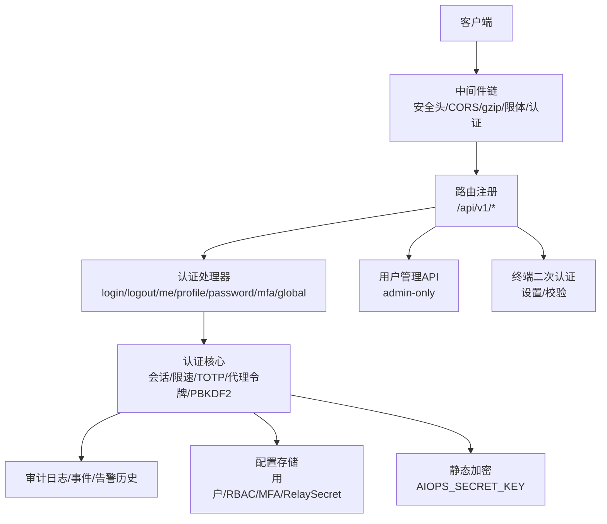
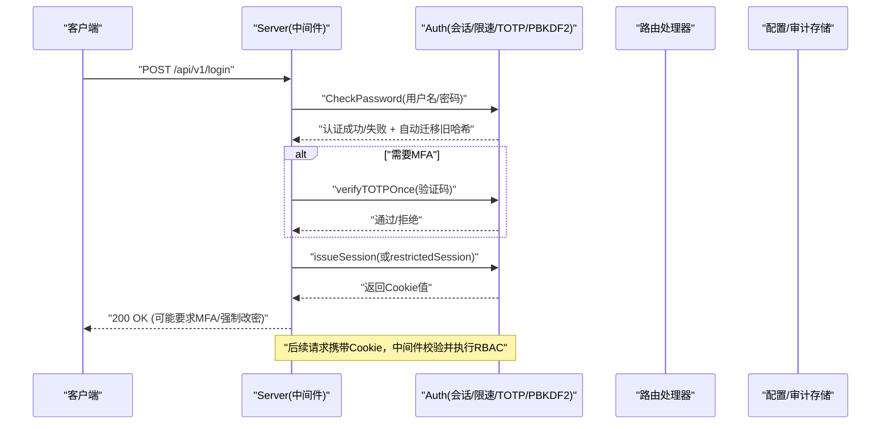
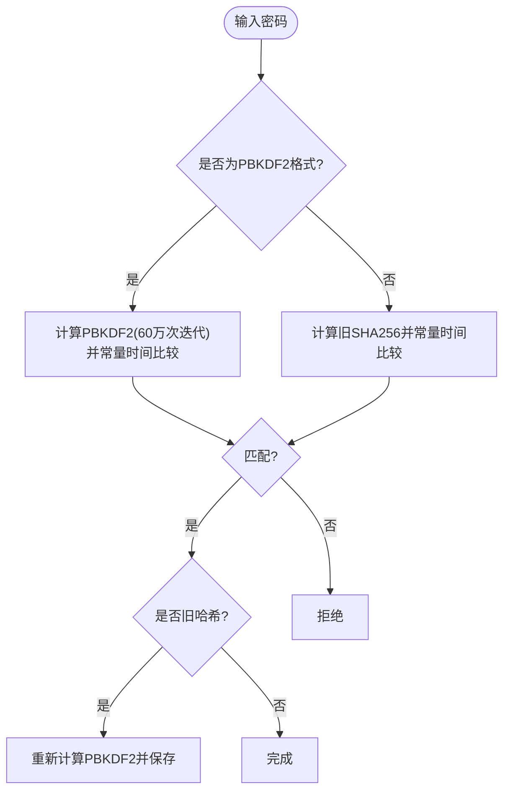
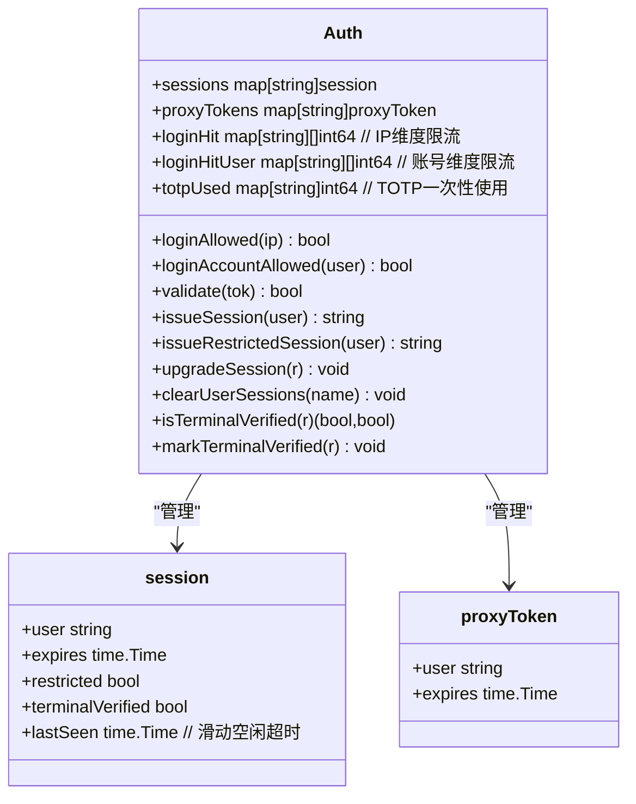
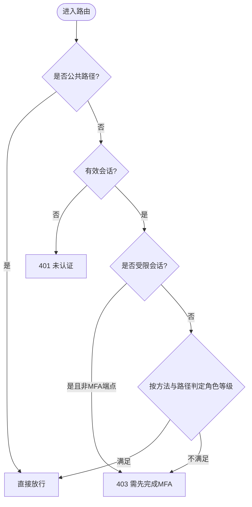
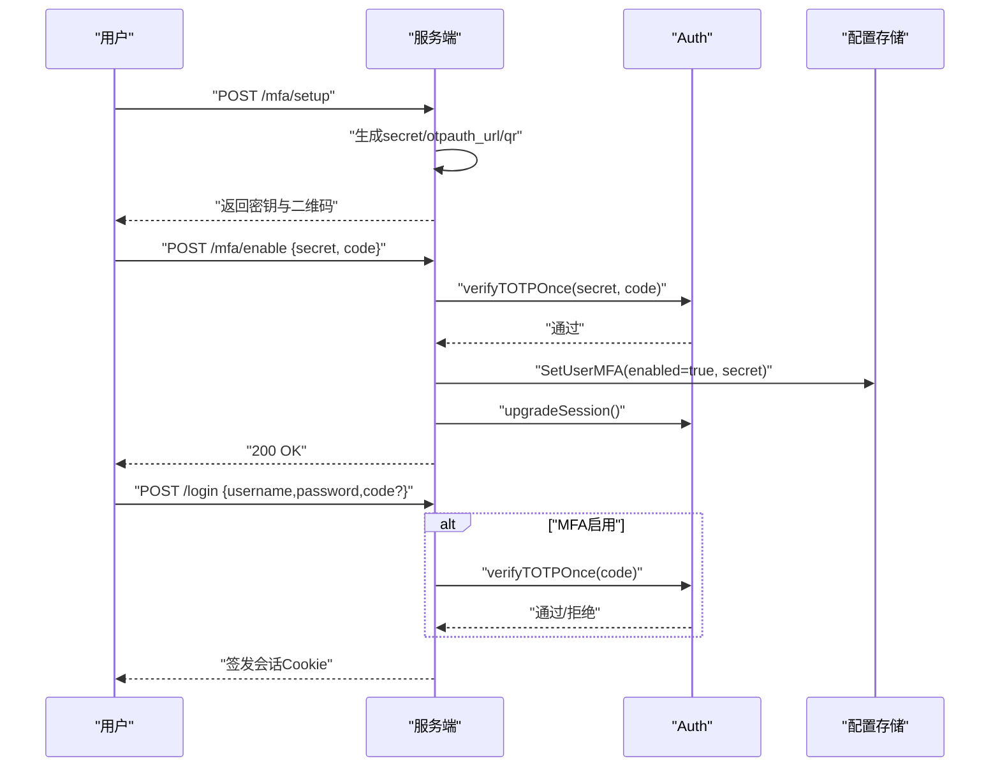
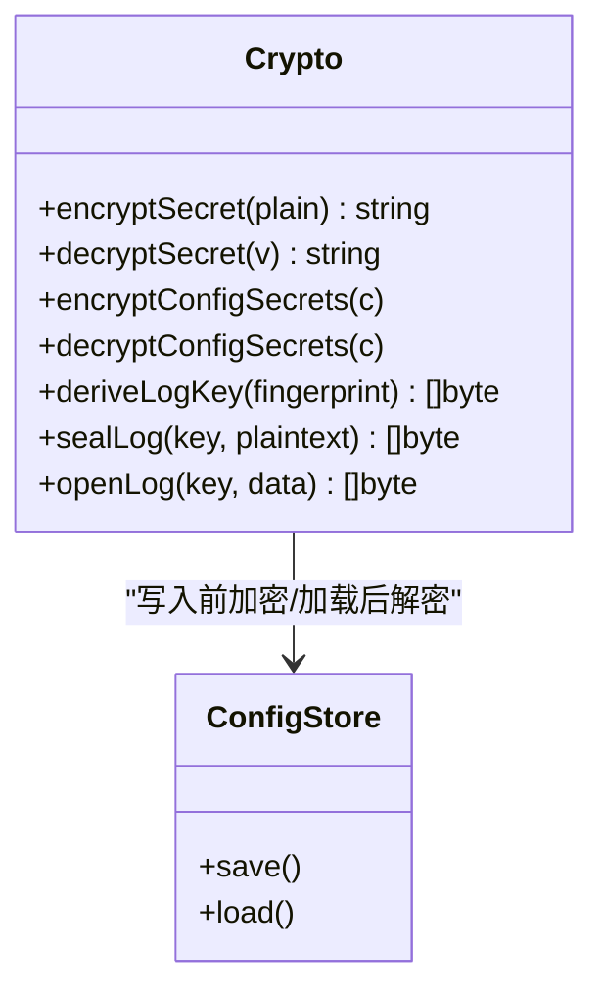
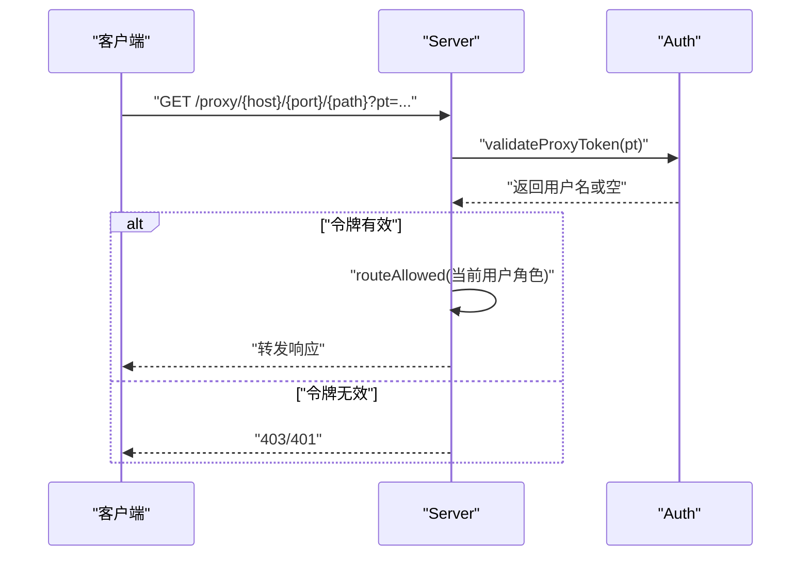
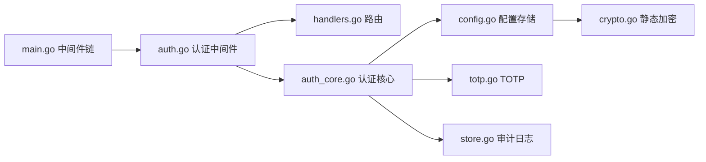

# 认证授权系统

<cite>
**本文引用的文件列表**
- [auth.go](file://cmd/server/auth.go)
- [auth_core.go](file://cmd/server/auth_core.go)
- [totp.go](file://cmd/server/totp.go)
- [users.go](file://cmd/server/users.go)
- [crypto.go](file://cmd/server/crypto.go)
- [handlers.go](file://cmd/server/handlers.go)
- [main.go](file://cmd/server/main.go)
- [config.go](file://cmd/server/config.go)
- [store.go](file://cmd/server/store.go)
- [users_api.go](file://cmd/server/users_api.go)
- [terminal_auth.go](file://cmd/server/terminal_auth.go)
</cite>

## 更新摘要
**变更内容**
- 核心认证逻辑重构，实现PBKDF2-HMAC-SHA256密码哈希算法（60万次迭代）
- 新增向后兼容机制，自动迁移旧格式哈希到安全的新格式
- 增强会话管理，实现滑动空闲超时和双重登录限流机制
- 优化认证中间件架构，提升安全性和性能

## 目录
1. [简介](#简介)
2. [项目结构](#项目结构)
3. [核心组件](#核心组件)
4. [架构总览](#架构总览)
5. [详细组件分析](#详细组件分析)
6. [依赖关系分析](#依赖关系分析)
7. [性能与安全特性](#性能与安全特性)
8. [故障排查指南](#故障排查指南)
9. [结论](#结论)
10. [附录：API与流程示例](#附录api与流程示例)

## 简介
本文件面向 AIOps Monitor 的认证与授权子系统，系统性阐述以下能力与设计：
- RBAC 权限模型与角色继承机制
- 用户会话管理（含滑动空闲超时、受限会话）
- MFA 两步验证（TOTP）与全局强制策略
- 密码加密存储（PBKDF2-HMAC-SHA256，60万次迭代，兼容旧哈希）
- API 密钥管理与配置静态加密（AES-256-GCM）
- 认证中间件实现、权限检查逻辑与安全令牌处理
- 用户生命周期管理、密码策略、登录审计日志与安全最佳实践

## 项目结构
认证授权相关代码集中在 cmd/server 下，关键文件职责如下：
- auth.go：HTTP 认证入口、路由级 RBAC 判定、登录/登出/MFA/账户初始化等处理器
- auth_core.go：**核心认证引擎** - 会话管理、速率限制、代理令牌、TOTP 一次性校验、终端二次认证状态、PBKDF2密码哈希
- totp.go：TOTP 算法实现与二维码生成
- users.go：多用户与 RBAC 角色定义、用户元数据与密码操作、迁移与默认账号
- crypto.go：配置项静态加密（AIOPS_SECRET_KEY）、日志传输加密
- handlers.go：HTTP 路由注册与 Server 组装
- main.go：中间件链（安全头、CORS、gzip、限体、认证中间件）与服务启动
- config.go：配置结构、环境变量覆盖、MFA 全局策略、Relay Secret 等
- store.go：活动审计日志、事件环、告警历史等持久化
- users_api.go：管理员用户管理接口
- terminal_auth.go：远程终端二次认证（协议同意 + 独立口令）

**图表来源**
- [handlers.go:100-350](file://cmd/server/handlers.go#L100-L350)
- [main.go:294-304](file://cmd/server/main.go#L294-L304)
- [auth.go:112-172](file://cmd/server/auth.go#L112-L172)
- [auth_core.go:107-180](file://cmd/server/auth_core.go#L107-L180)
- [config.go:476-490](file://cmd/server/config.go#L476-L490)
- [crypto.go:175-205](file://cmd/server/crypto.go#L175-L205)

**章节来源**
- [handlers.go:100-350](file://cmd/server/handlers.go#L100-L350)
- [main.go:294-304](file://cmd/server/main.go#L294-L304)

## 核心组件
- 认证中间件与路由守卫：统一鉴权、公共路径放行、代理令牌校验、受限会话拦截、RBAC 判定
- 会话管理器：基于 Cookie 的短期会话，支持绝对过期与滑动空闲超时、受限会话、按用户失效、重命名映射
- TOTP 二要素：RFC 6238 兼容，支持 ±1 步时钟偏差，一次性使用防重放
- **密码策略与升级**：强密码校验、PBKDF2 60万次迭代高强度哈希、旧哈希无缝升级
- 配置静态加密：可选 AES-256-GCM 对可逆敏感字段落库加密
- 审计日志：登录成功/失败、MFA 启用/禁用、用户管理等操作记录

**章节来源**
- [auth.go:112-172](file://cmd/server/auth.go#L112-L172)
- [auth_core.go:107-180](file://cmd/server/auth_core.go#L107-L180)
- [totp.go:16-109](file://cmd/server/totp.go#L16-L109)
- [auth_core.go:22-88](file://cmd/server/auth_core.go#L22-L88)
- [crypto.go:175-205](file://cmd/server/crypto.go#L175-L205)
- [store.go:687-718](file://cmd/server/store.go#L687-L718)

## 架构总览
认证授权在 HTTP 请求进入时由中间件链统一处理，随后进入具体业务处理器。认证中间件负责：
- 公共路径快速放行
- 代理令牌（/proxy/）单用校验与二次 RBAC
- 会话有效性校验与受限会话限制
- 路由级 RBAC 判定（按方法+路径+角色）

**图表来源**
- [auth.go:176-307](file://cmd/server/auth.go#L176-L307)
- [auth_core.go:297-321](file://cmd/server/auth_core.go#L297-321)
- [auth_core.go:380-402](file://cmd/server/auth_core.go#L380-L402)
- [auth.go:112-172](file://cmd/server/auth.go#L112-L172)

## 详细组件分析

### PBKDF2-HMAC-SHA256 密码哈希与安全升级
**新增** 核心密码哈希算法已升级为 PBKDF2-HMAC-SHA256，采用60万次迭代，符合OWASP 2023安全指导原则。

- **新格式**：`pbkdf2$sha256$600000$<hex>` - 自描述格式便于未来迭代次数升级
- **向后兼容**：单轮盐值 SHA-256 旧格式仍可验证，并在下次登录时透明升级
- **安全强度**：60万次迭代有效抵御GPU暴力破解攻击
- **常量时间比较**：防止时序攻击

**图表来源**
- [auth_core.go:22-88](file://cmd/server/auth_core.go#L22-L88)
- [auth_core.go:301-321](file://cmd/server/auth_core.go#L301-L321)
- [auth.go:60-81](file://cmd/server/auth.go#L60-L81)

**章节来源**
- [auth_core.go:22-88](file://cmd/server/auth_core.go#L22-L88)
- [auth_core.go:301-321](file://cmd/server/auth_core.go#L301-L321)
- [auth.go:60-81](file://cmd/server/auth.go#L60-L81)

### 增强的会话管理与登录限流
**新增** 会话管理现已支持滑动空闲超时和双重登录限流机制。

- **滑动空闲超时**：24小时空闲超时，基于最近活动时间驱动，避免频繁重登
- **IP维度限流**：5分钟窗口内最多8次失败尝试
- **账号维度限流**：15分钟窗口内最多10次失败尝试（防分布式暴力破解）
- **会话哈希存储**：会话令牌以SHA-256哈希形式存储，防止数据库泄露后重放攻击

**图表来源**
- [auth_core.go:96-155](file://cmd/server/auth_core.go#L96-L155)
- [auth_core.go:331-354](file://cmd/server/auth_core.go#L331-L354)
- [auth_core.go:380-432](file://cmd/server/auth_core.go#L380-L432)
- [auth_core.go:157-176](file://cmd/server/auth_core.go#L157-L176)

**章节来源**
- [auth_core.go:107-180](file://cmd/server/auth_core.go#L107-L180)
- [auth_core.go:331-354](file://cmd/server/auth_core.go#L331-L354)
- [auth_core.go:380-432](file://cmd/server/auth_core.go#L380-L432)

### RBAC 权限模型与角色继承
- 角色定义与等级：admin > operator > viewer；未知角色视为无权限
- 路由级判定规则：
  - 自身账户服务（登出、改密、资料、MFA 设置/开关）：任意已登录角色
  - 用户管理与全局 MFA：仅 admin
  - 远程终端/端口转发/代理：operator+
  - GET 读操作：viewer+
  - 其他写/动作：operator+
- 角色继承：通过 rank 比较实现"大于等于"的继承语义

**图表来源**
- [auth.go:18-49](file://cmd/server/auth.go#L18-L49)
- [auth.go:86-108](file://cmd/server/auth.go#L86-L108)
- [auth.go:112-172](file://cmd/server/auth.go#L112-L172)

**章节来源**
- [users.go:19-41](file://cmd/server/users.go#L19-L41)
- [auth.go:86-108](file://cmd/server/auth.go#L86-L108)

### MFA 两步验证（TOTP）
- 标准：RFC 6238，6 位数字，30s 时间步长，Base32 密钥
- 容错：±1 步时钟偏差校验
- 一次性：同一时间步对用户唯一，防止重放
- 流程：
  - 首次设置：生成密钥与 otpauth URL/QR，客户端扫码
  - 启用：提交一次当前码，成功后开启 MFA 并升级受限会话
  - 登录：若启用则要求提供验证码
  - 全局策略：管理员可强制所有未绑定用户必须完成 MFA

**图表来源**
- [auth.go:536-585](file://cmd/server/auth.go#L536-L585)
- [auth.go:252-307](file://cmd/server/auth.go#L252-L307)
- [auth_core.go:262-285](file://cmd/server/auth_core.go#L262-L285)
- [totp.go:41-90](file://cmd/server/totp.go#L41-L90)

**章节来源**
- [totp.go:16-109](file://cmd/server/totp.go#L16-L109)
- [auth.go:536-585](file://cmd/server/auth.go#L536-L585)
- [auth_core.go:262-285](file://cmd/server/auth_core.go#L262-L285)

### API 密钥管理与配置静态加密
- 静态加密：当设置 AIOPS_SECRET_KEY 时，对可逆敏感字段（如 SMTP 密码、AI API Key、DingTalk Secret、Relay Secret、MFA 密钥等）进行 AES-256-GCM 加密后再落库
- 解密：读取时自动解密到内存明文供运行时使用；无法解密时返回空串并记录错误
- 日志传输加密：基于主密钥派生 per-agent 密钥，gzip + AES-GCM 加密上报日志

**图表来源**
- [crypto.go:44-103](file://cmd/server/crypto.go#L44-L103)
- [crypto.go:175-205](file://cmd/server/crypto.go#L175-L205)
- [crypto.go:120-173](file://cmd/server/crypto.go#L120-173)

**章节来源**
- [crypto.go:44-103](file://cmd/server/crypto.go#L44-L103)
- [crypto.go:175-205](file://cmd/server/crypto.go#L175-L205)

### 认证中间件与代理令牌
- 中间件顺序：安全头 → CORS → gzip → 限体 → 认证中间件 → 路由
- 公共路径：登录、健康检查、静态资源、安装脚本、Agent 注册/上报/日志等
- 代理令牌：/proxy/ 路径优先从 Cookie 取 pt，否则从查询参数 pt 获取；令牌为单次使用，校验后仍按用户当前角色做 RBAC
- Relay 共享密钥：当配置了 relay_secret，带 X-Relay-Secret 的请求必须一致，否则拒绝

**图表来源**
- [auth.go:133-152](file://cmd/server/auth.go#L133-L152)
- [auth_core.go:157-176](file://cmd/server/auth_core.go#L157-L176)
- [auth.go:117-125](file://cmd/server/auth.go#L117-L125)

**章节来源**
- [auth.go:112-172](file://cmd/server/auth.go#L112-L172)
- [auth_core.go:157-176](file://cmd/server/auth_core.go#L157-L176)

### 用户生命周期管理
- 创建用户：校验用户名格式、密码强度、角色合法性、邮箱格式；创建后记录审计日志
- 更新元信息：显示名、邮箱、角色；禁止将最后一个管理员降级
- 删除用户：禁止删除最后一个用户或最后一个管理员；同时踢出该用户所有会话
- 重置密码：强制要求强密码，重置后清除该用户所有会话
- 重置 MFA：管理员可关闭用户 MFA
- 迁移：首次运行将旧单账号迁移至 Users 列表并确保至少一个 admin

**章节来源**
- [users_api.go:19-140](file://cmd/server/users_api.go#L19-L140)
- [users.go:157-208](file://cmd/server/users.go#L157-L208)
- [users.go:352-402](file://cmd/server/users.go#L352-L402)
- [users.go:43-76](file://cmd/server/users.go#L43-L76)

### 远程终端二次认证
- 目的：终端具备完整 Shell 权限，需在登录会话基础上二次确认
- 流程：
  - 设置终端口令：首次设置无需二次验证；变更时需 MFA 或登录密码校验
  - 校验口令：失败有限速与锁定；通过后标记会话已验证
  - 状态查询：返回是否已设置口令以及当前会话是否已通过验证

**章节来源**
- [terminal_auth.go:17-40](file://cmd/server/terminal_auth.go#L17-L40)
- [terminal_auth.go:50-122](file://cmd/server/terminal_auth.go#L50-L122)
- [terminal_auth.go:124-172](file://cmd/server/terminal_auth.go#L124-L172)
- [auth_core.go:515-585](file://cmd/server/auth_core.go#L515-L585)

## 依赖关系分析
- 中间件链依赖：安全头、CORS、gzip、限体、认证中间件
- 认证中间件依赖：公共路径判断、代理令牌、受限会话、RBAC 判定
- 认证核心依赖：配置存储（用户/角色/MFA/RelaySecret）、审计日志、TOTP 工具、PBKDF2哈希
- 配置存储依赖：静态加密（可选）、环境变量覆盖、迁移与默认值填充
- 审计日志依赖：PostgreSQL 持久化（可选），内存环形缓冲兜底

**图表来源**
- [main.go:294-304](file://cmd/server/main.go#L294-L304)
- [auth.go:112-172](file://cmd/server/auth.go#L112-L172)
- [handlers.go:100-350](file://cmd/server/handlers.go#L100-L350)
- [auth_core.go:107-180](file://cmd/server/auth_core.go#L107-L180)
- [config.go:476-490](file://cmd/server/config.go#L476-L490)
- [crypto.go:175-205](file://cmd/server/crypto.go#L175-L205)

**章节来源**
- [main.go:294-304](file://cmd/server/main.go#L294-L304)
- [auth.go:112-172](file://cmd/server/auth.go#L112-L172)
- [handlers.go:100-350](file://cmd/server/handlers.go#L100-L350)
- [auth_core.go:107-180](file://cmd/server/auth_core.go#L107-L180)
- [config.go:476-490](file://cmd/server/config.go#L476-L490)
- [crypto.go:175-205](file://cmd/server/crypto.go#L175-L205)

## 性能与安全特性
- **性能**
  - 会话校验采用哈希键索引，避免泄露重放
  - 滑动空闲超时减少频繁重登，提升用户体验
  - 代理令牌单次使用，降低长期持有风险
  - PBKDF2 60万次迭代确保密码安全性
- **安全**
  - **密码策略与 PBKDF2 高强度哈希**，兼容旧哈希平滑升级
  - TOTP 一次性校验，防重放
  - **双重登录速率限制**（IP 维度 + 账号维度），终端口令尝试限速与锁定
  - 全局 MFA 强制策略，受限会话引导完成绑定
  - 配置静态加密（AIOPS_SECRET_KEY），缓解数据库泄露风险
  - 安全响应头（CSP、X-Frame-Options、Referrer-Policy）
  - 中继共享密钥校验，防止非法中继接入

## 故障排查指南
- **登录失败**
  - 检查 IP 与账号维度的失败计数是否超限
  - 确认密码是否符合策略，旧哈希用户会在下次登录自动升级
  - 查看PBKDF2哈希升级日志
- **MFA 问题**
  - 确认客户端时间与服务器偏差不超过 ±1 步
  - 若全局强制 MFA，未完成绑定的用户将被限制在非 MFA 端点
- **代理令牌不可用**
  - 确认令牌未被重复使用（单次使用）
  - 检查用户当前角色是否满足目标路径的 RBAC
- **配置静态加密异常**
  - 确认 AIOPS_SECRET_KEY 已正确设置
  - 查看解密失败的日志提示，必要时恢复明文或重新设置密钥

**章节来源**
- [auth_core.go:182-260](file://cmd/server/auth_core.go#L182-L260)
- [auth.go:252-307](file://cmd/server/auth.go#L252-L307)
- [auth.go:133-152](file://cmd/server/auth.go#L133-L152)
- [crypto.go:73-103](file://cmd/server/crypto.go#L73-L103)

## 结论
本认证授权系统以中间件为核心，结合 RBAC、会话管理、TOTP 二要素与静态加密，提供了端到端的安全保障。**最新的PBKDF2-HMAC-SHA256密码哈希实现（60万次迭代）和增强的会话管理机制进一步提升了系统的安全性**。通过严格的速率限制、受限会话与审计日志，系统在易用性与安全性之间取得平衡。建议在生产环境启用 TLS、配置 AIOPS_SECRET_KEY 并开启全局 MFA 强制策略，以获得最佳安全基线。

## 附录：API与流程示例

### 登录流程（含 MFA）
- POST /api/v1/login
  - 请求体：username、password、login_type（可选）、code（MFA 时必填）
  - 响应：
    - mfa_required: true（需要二次验证码）
    - require_mfa_setup: true（全局强制 MFA，需先完成绑定）
    - must_change_password: true（首次登录强制改密）
    - ok: true（登录成功）

**章节来源**
- [auth.go:176-307](file://cmd/server/auth.go#L176-L307)

### 会话与权限
- 认证中间件对所有非公共路径生效
- 公共路径包括：/healthz、静态资源、安装脚本、登录/我的信息、Agent 注册/上报/日志、/dl/ 下载等
- 代理令牌：/proxy/ 路径支持 Cookie 或查询参数 pt

**章节来源**
- [auth.go:18-49](file://cmd/server/auth.go#L18-L49)
- [auth.go:133-152](file://cmd/server/auth.go#L133-L152)

### 用户管理（管理员）
- GET /api/v1/users
- POST /api/v1/users
- POST /api/v1/users/{username}
- DELETE /api/v1/users/{username}
- POST /api/v1/users/{username}/reset-password
- POST /api/v1/users/{username}/reset-mfa

**章节来源**
- [users_api.go:19-140](file://cmd/server/users_api.go#L19-L140)

### 终端二次认证
- GET /api/user/terminal-password/status
- POST /api/user/terminal-password/set
- POST /api/user/terminal-password/verify

**章节来源**
- [terminal_auth.go:50-172](file://cmd/server/terminal_auth.go#L50-L172)

### 全局 MFA 策略
- GET /api/v1/mfa/global
- POST /api/v1/mfa/global

**章节来源**
- [auth.go:589-615](file://cmd/server/auth.go#L589-L615)