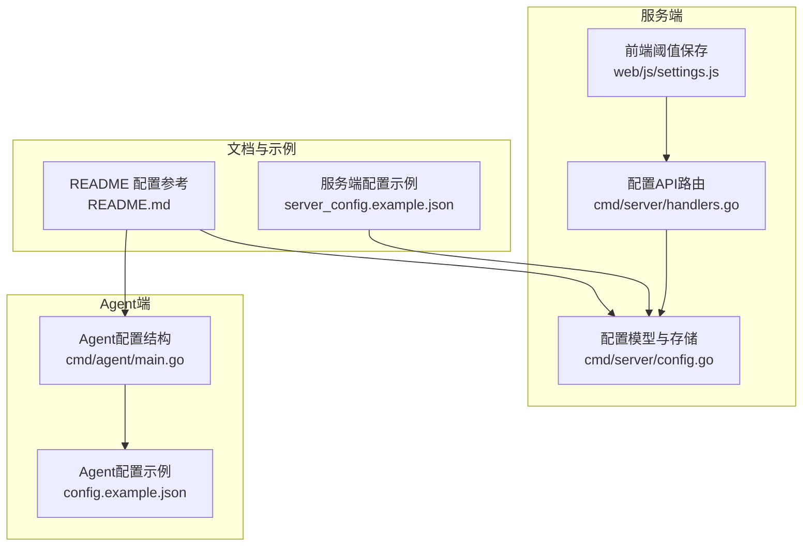
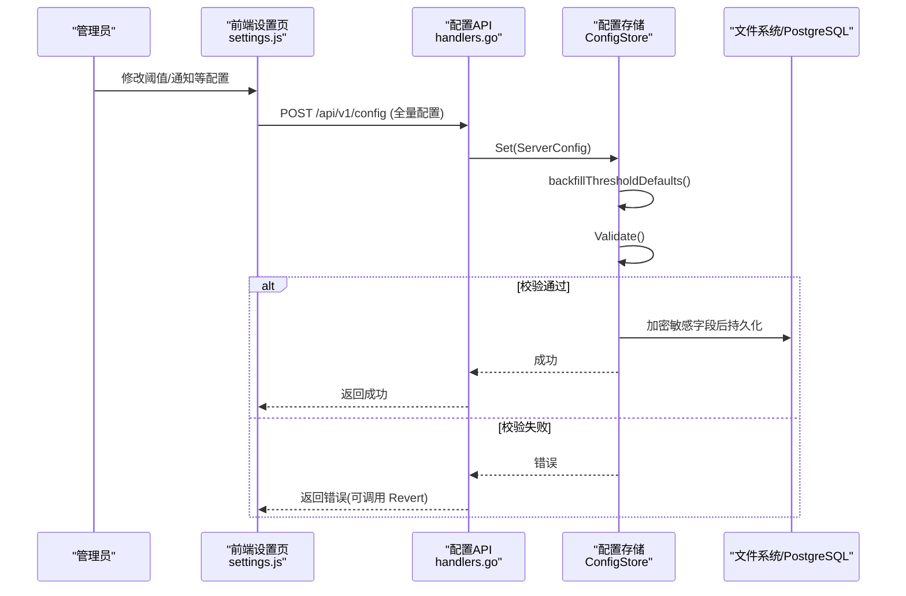
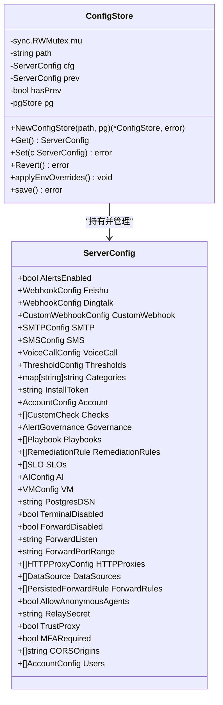
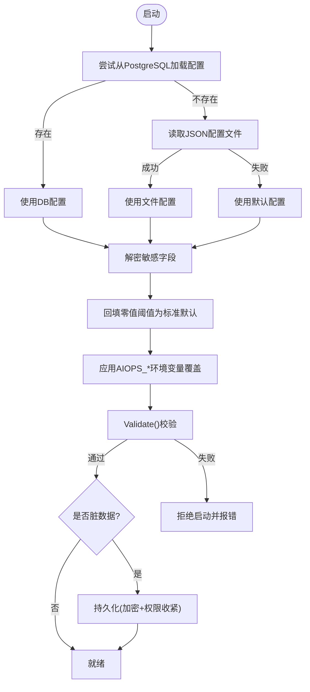
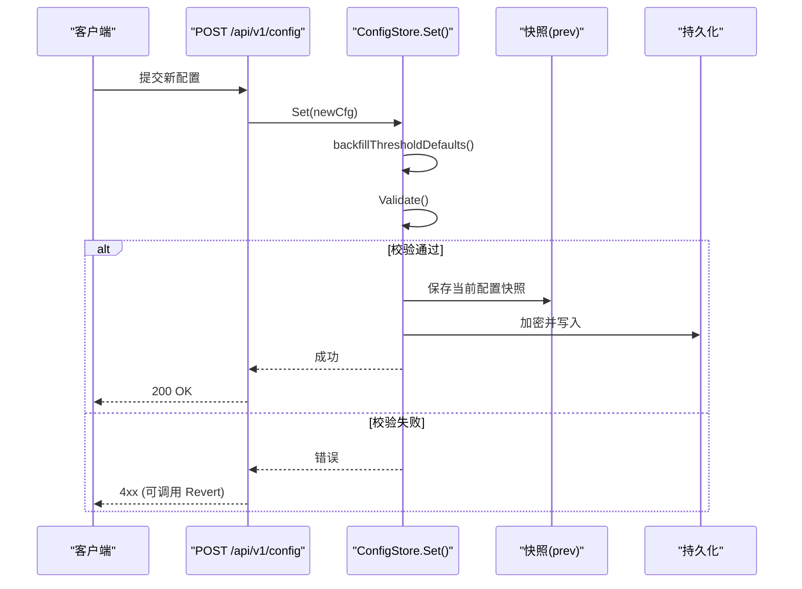
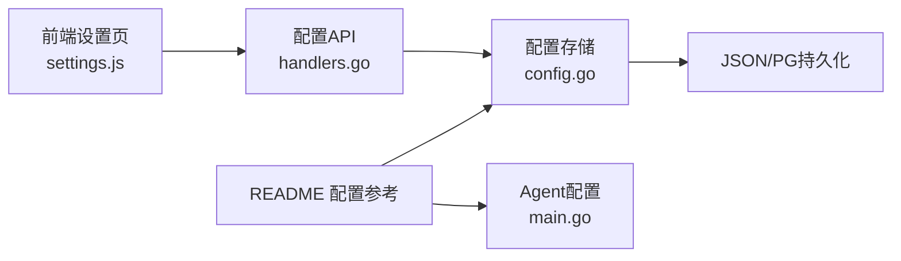

# 配置管理系统

<cite>
**本文引用的文件**   
- [README.md](file://README.md)
- [config.example.json](file://config.example.json)
- [server_config.example.json](file://server_config.example.json)
- [cmd/server/config.go](file://cmd/server/config.go)
- [cmd/agent/main.go](file://cmd/agent/main.go)
- [cmd/server/handlers.go](file://cmd/server/handlers.go)
- [cmd/server/web/js/settings.js](file://cmd/server/web/js/settings.js)
</cite>

## 目录
1. [简介](#简介)
2. [项目结构](#项目结构)
3. [核心组件](#核心组件)
4. [架构总览](#架构总览)
5. [详细组件分析](#详细组件分析)
6. [依赖关系分析](#依赖关系分析)
7. [性能与一致性考虑](#性能与一致性考虑)
8. [故障排查指南](#故障排查指南)
9. [结论](#结论)
10. [附录：配置模板与迁移策略](#附录配置模板与迁移策略)

## 简介
本文件面向 AIOps Monitor 的配置管理系统，系统性说明服务端与 Agent 的配置文件结构、环境变量覆盖优先级、动态配置热更新流程、配置校验与回滚机制、数据库连接与安全密钥管理，并提供配置迁移策略、默认值设置、配置模板与测试方法。文档同时给出代码级实现路径，便于读者对照源码理解加载、验证与更新的完整链路。

## 项目结构
与配置管理直接相关的核心位置如下：
- 服务端配置模型与持久化：cmd/server/config.go
- 服务端配置 API 路由：cmd/server/handlers.go
- Agent 配置结构与命令行参数：cmd/agent/main.go
- 示例配置文件：config.example.json（Agent）、server_config.example.json（服务端）
- 前端阈值保存逻辑：cmd/server/web/js/settings.js
- 用户手册与环境变量说明：README.md

图表来源
- [cmd/server/config.go:412-492](file://cmd/server/config.go#L412-L492)
- [cmd/server/handlers.go:120-140](file://cmd/server/handlers.go#L120-L140)
- [cmd/agent/main.go:24-42](file://cmd/agent/main.go#L24-L42)
- [config.example.json:1-16](file://config.example.json#L1-L16)
- [server_config.example.json:1-36](file://server_config.example.json#L1-L36)
- [README.md:383-576](file://README.md#L383-L576)

章节来源
- [cmd/server/config.go:412-492](file://cmd/server/config.go#L412-L492)
- [cmd/server/handlers.go:120-140](file://cmd/server/handlers.go#L120-L140)
- [cmd/agent/main.go:24-42](file://cmd/agent/main.go#L24-L42)
- [config.example.json:1-16](file://config.example.json#L1-L16)
- [server_config.example.json:1-36](file://server_config.example.json#L1-L36)
- [README.md:383-576](file://README.md#L383-L576)

## 核心组件
- 服务端配置模型 ServerConfig：包含告警通道、阈值、账户、转发、代理、AI、外部存储等字段，提供 Validate() 校验与 Set()/Revert() 原子更新与回滚能力。
- 配置存储 ConfigStore：线程安全封装，负责从 JSON 文件或 PostgreSQL 加载、解密、回填默认值、应用环境变量覆盖、校验并持久化。
- Agent 配置结构：支持单服务端与多服务端推送，含插件周期、日志采集、TLS 信任等选项。
- 配置 API：通过 HTTP 接口读取与更新配置，前端在「告警设置」页面提交阈值变更。
- 环境变量覆盖：AIOPS_* 系列变量可覆盖 server_config.json 对应字段，优先级高于文件。

章节来源
- [cmd/server/config.go:504-534](file://cmd/server/config.go#L504-L534)
- [cmd/server/config.go:537-602](file://cmd/server/config.go#L537-L602)
- [cmd/server/config.go:619-654](file://cmd/server/config.go#L619-L654)
- [cmd/server/config.go:952-1009](file://cmd/server/config.go#L952-L1009)
- [cmd/server/config.go:1014-1025](file://cmd/server/config.go#L1014-L1025)
- [cmd/agent/main.go:24-42](file://cmd/agent/main.go#L24-L42)
- [cmd/server/handlers.go:120-140](file://cmd/server/handlers.go#L120-L140)
- [cmd/server/web/js/settings.js:140-159](file://cmd/server/web/js/settings.js#L140-L159)
- [README.md:556-576](file://README.md#L556-L576)

## 架构总览
配置系统围绕“加载 → 校验 → 覆盖 → 应用 → 持久化 → 回滚”的闭环设计，支持运行时热更新与失败回滚，确保配置变更的安全性与可恢复性。

图表来源
- [cmd/server/web/js/settings.js:140-159](file://cmd/server/web/js/settings.js#L140-L159)
- [cmd/server/handlers.go:120-140](file://cmd/server/handlers.go#L120-L140)
- [cmd/server/config.go:952-1009](file://cmd/server/config.go#L952-L1009)
- [cmd/server/config.go:504-534](file://cmd/server/config.go#L504-L534)
- [cmd/server/config.go:1049-1079](file://cmd/server/config.go#L1049-L1079)

## 详细组件分析

### 服务端配置模型与存储
- ServerConfig 字段涵盖告警通道（飞书/钉钉/自定义Webhook/SMTP/短信/语音）、阈值、账户、转发、代理、AI、外部存储（VM/PG）、CORS、MFA 强制策略、中继密钥、匿名 Agent 策略等。
- ConfigStore 负责：
  - 启动时优先从 PostgreSQL 或 JSON 文件加载；
  - 解密落库密文为明文供内存使用；
  - 自动回填零值阈值为标准默认；
  - 应用 AIOPS_* 环境变量覆盖；
  - 执行 Validate() 校验；
  - 提供 Set()/Revert() 原子更新与回滚；
  - 持久化时对敏感字段进行 AES-256-GCM 加密，并以 0o600 权限写入。

图表来源
- [cmd/server/config.go:412-492](file://cmd/server/config.go#L412-L492)
- [cmd/server/config.go:537-544](file://cmd/server/config.go#L537-L544)
- [cmd/server/config.go:546-602](file://cmd/server/config.go#L546-L602)
- [cmd/server/config.go:952-1009](file://cmd/server/config.go#L952-L1009)
- [cmd/server/config.go:1014-1025](file://cmd/server/config.go#L1014-L1025)
- [cmd/server/config.go:1049-1079](file://cmd/server/config.go#L1049-L1079)

章节来源
- [cmd/server/config.go:412-492](file://cmd/server/config.go#L412-L492)
- [cmd/server/config.go:537-602](file://cmd/server/config.go#L537-L602)
- [cmd/server/config.go:952-1009](file://cmd/server/config.go#L952-L1009)
- [cmd/server/config.go:1014-1025](file://cmd/server/config.go#L1014-L1025)
- [cmd/server/config.go:1049-1079](file://cmd/server/config.go#L1049-L1079)

### 配置加载与默认值回填
- 加载顺序：PostgreSQL（若启用）→ JSON 文件 → 默认值。
- 自动回填：对任何为零的阈值字段，按标准默认值填充，避免误报。
- 首次运行：自动生成安装 Token，必要时迁移旧账户到多用户列表。

图表来源
- [cmd/server/config.go:546-602](file://cmd/server/config.go#L546-L602)
- [cmd/server/config.go:183-280](file://cmd/server/config.go#L183-L280)
- [cmd/server/config.go:619-654](file://cmd/server/config.go#L619-L654)
- [cmd/server/config.go:504-534](file://cmd/server/config.go#L504-L534)
- [cmd/server/config.go:1049-1079](file://cmd/server/config.go#L1049-L1079)

章节来源
- [cmd/server/config.go:546-602](file://cmd/server/config.go#L546-L602)
- [cmd/server/config.go:183-280](file://cmd/server/config.go#L183-L280)
- [cmd/server/config.go:619-654](file://cmd/server/config.go#L619-L654)
- [cmd/server/config.go:504-534](file://cmd/server/config.go#L504-L534)
- [cmd/server/config.go:1049-1079](file://cmd/server/config.go#L1049-L1079)

### 环境变量覆盖与优先级
- 优先级：环境变量 > server_config.json 文件。
- 支持覆盖项包括：VM 地址、PG DSN、转发监听地址与端口范围、中继密钥、全局开关（终端/转发/匿名Agent/信任代理/强制Token）。
- 布尔类型支持 true/false 或 1/0。

章节来源
- [README.md:556-576](file://README.md#L556-L576)
- [cmd/server/config.go:619-654](file://cmd/server/config.go#L619-L654)

### 动态配置热更新与回滚
- 热更新入口：POST /api/v1/config 提交全量配置。
- 更新流程：
  - 先回填零值阈值；
  - 执行 Validate()；
  - 保存前快照（prev），再替换当前配置；
  - 持久化成功后生效；
  - 失败时可调用 Revert() 恢复到上次成功版本。
- 保护字段：部分字段（如 RequireToken、ForwardListen、Users 等）由专用端点管理，表单保存不会覆盖，防止误操作。

图表来源
- [cmd/server/handlers.go:120-140](file://cmd/server/handlers.go#L120-L140)
- [cmd/server/config.go:952-1009](file://cmd/server/config.go#L952-L1009)
- [cmd/server/config.go:1014-1025](file://cmd/server/config.go#L1014-L1025)
- [cmd/server/config.go:1049-1079](file://cmd/server/config.go#L1049-L1079)

章节来源
- [cmd/server/handlers.go:120-140](file://cmd/server/handlers.go#L120-L140)
- [cmd/server/config.go:952-1009](file://cmd/server/config.go#L952-L1009)
- [cmd/server/config.go:1014-1025](file://cmd/server/config.go#L1014-L1025)
- [cmd/server/config.go:1049-1079](file://cmd/server/config.go#L1049-L1079)

### 配置验证机制
- 阈值范围校验：百分比类阈值必须在 0–100。
- 离线判定必须为正数。
- SMTP 启用时端口需在 1–65535，且密码长度至少 4。
- 校验失败将阻止配置应用，并可触发回滚。

章节来源
- [cmd/server/config.go:504-534](file://cmd/server/config.go#L504-L534)

### 数据库连接配置
- 关系数据统一落 PostgreSQL，时序数据统一落 VictoriaMetrics。
- 通过环境变量 AIOPS_POSTGRES_DSN 与 AIOPS_VM_URL 启用外部存储；未配置将拒绝启动。
- 配置持久化在双库模式下以 JSONB 行存储于 PG。

章节来源
- [README.md:556-576](file://README.md#L556-L576)
- [cmd/server/config.go:619-654](file://cmd/server/config.go#L619-L654)
- [cmd/server/config.go:1067-1069](file://cmd/server/config.go#L1067-L1069)

### 安全密钥管理与静态加密
- 主密钥：AIOPS_SECRET_KEY 用于对 MFA/SMTP/AI/webhook/relay/短信与语音电话等敏感字段进行 AES-256-GCM 静态加密。
- 落盘权限：配置文件以 0o600 写入，避免被其他用户读取。
- 传输加密：可选 HTTPS/TLS（AIOPS_TLS_CERT/AIOPS_TLS_KEY）。

章节来源
- [README.md:556-576](file://README.md#L556-L576)
- [cmd/server/config.go:1049-1079](file://cmd/server/config.go#L1049-L1079)

### Agent 配置参数与优先级
- 配置文件：config.example.json，支持单服务端与多服务端（servers 数组非空时优先）。
- 命令行参数覆盖配置文件与默认值，例如 --server、--interval、--plugin-interval、--plugins-dir、--python、--disk-path、--token、--relay、--listen、--config、--log-paths、--log-encrypt、--tls-skip-verify、--ca-cert、--security-mode。
- 安全环境检测：启动时输出安全模块状态与建议修复命令，支持 permissive/enforcing/auto 模式。

章节来源
- [config.example.json:1-16](file://config.example.json#L1-L16)
- [cmd/agent/main.go:24-42](file://cmd/agent/main.go#L24-L42)
- [cmd/agent/main.go:74-120](file://cmd/agent/main.go#L74-L120)
- [cmd/agent/main.go:142-208](file://cmd/agent/main.go#L142-L208)

### 前端阈值保存与回存策略
- 前端获取全量配置（密钥已脱敏），编辑阈值后回存；后端在保存时保留原密钥值（当为空或脱敏标记时），避免意外覆盖。

章节来源
- [cmd/server/web/js/settings.js:140-159](file://cmd/server/web/js/settings.js#L140-L159)
- [cmd/server/config.go:978-993](file://cmd/server/config.go#L978-L993)

## 依赖关系分析
- handlers.go 暴露配置 API，调用 config.go 中的 ConfigStore 完成读写。
- settings.js 在前端聚合阈值并提交至 /api/v1/config。
- README.md 提供配置参考与环境变量说明，指导部署与运维。

图表来源
- [cmd/server/web/js/settings.js:140-159](file://cmd/server/web/js/settings.js#L140-L159)
- [cmd/server/handlers.go:120-140](file://cmd/server/handlers.go#L120-L140)
- [cmd/server/config.go:537-602](file://cmd/server/config.go#L537-L602)
- [README.md:383-576](file://README.md#L383-L576)
- [cmd/agent/main.go:24-42](file://cmd/agent/main.go#L24-L42)

章节来源
- [cmd/server/web/js/settings.js:140-159](file://cmd/server/web/js/settings.js#L140-L159)
- [cmd/server/handlers.go:120-140](file://cmd/server/handlers.go#L120-L140)
- [cmd/server/config.go:537-602](file://cmd/server/config.go#L537-L602)
- [README.md:383-576](file://README.md#L383-L576)
- [cmd/agent/main.go:24-42](file://cmd/agent/main.go#L24-L42)

## 性能与一致性考虑
- 并发安全：ConfigStore 使用 RWMutex 保护读多写少场景，提高读取吞吐。
- 幂等与回滚：Set() 前快照，失败可 Revert()，避免脏配置影响运行。
- 零值兜底：阈值零值自动回填标准默认，减少误报风险。
- 持久化优化：仅当 dirty 时写入，减少不必要的磁盘 I/O。

章节来源
- [cmd/server/config.go:537-544](file://cmd/server/config.go#L537-L544)
- [cmd/server/config.go:952-1009](file://cmd/server/config.go#L952-L1009)
- [cmd/server/config.go:183-280](file://cmd/server/config.go#L183-L280)
- [cmd/server/config.go:598-601](file://cmd/server/config.go#L598-L601)

## 故障排查指南
- 启动失败：检查 AIOPS_POSTGRES_DSN 与 AIOPS_VM_URL 是否配置；查看 Validate() 错误信息（阈值范围、SMTP 端口/密码长度等）。
- 配置不生效：确认环境变量覆盖是否正确；检查 Set() 是否返回错误；必要时调用 Revert() 恢复。
- 密钥丢失：AIOPS_SECRET_KEY 丢失会导致无法解密已加密字段，需从备份恢复。
- 转发不可达：Docker 部署需设置 AIOPS_FORWARD_LISTEN=0.0.0.0 并确保端口范围映射一致。

章节来源
- [README.md:556-576](file://README.md#L556-L576)
- [cmd/server/config.go:504-534](file://cmd/server/config.go#L504-L534)
- [cmd/server/config.go:1014-1025](file://cmd/server/config.go#L1014-L1025)
- [cmd/server/config.go:619-654](file://cmd/server/config.go#L619-L654)

## 结论
AIOps Monitor 的配置管理系统以强校验、原子更新与回滚为核心，结合环境变量覆盖与静态加密，提供了生产可用的配置治理能力。通过清晰的加载顺序、默认值回填与零值兜底，系统在易用性与安全性之间取得平衡。建议在生产环境中始终启用外部存储（PG+VM）与主密钥（AIOPS_SECRET_KEY），并通过环境变量集中管理敏感配置。

## 附录：配置模板与迁移策略

### 配置模板
- Agent 配置模板：config.example.json
- 服务端配置模板：server_config.example.json

章节来源
- [config.example.json:1-16](file://config.example.json#L1-L16)
- [server_config.example.json:1-36](file://server_config.example.json#L1-L36)

### 迁移策略
- 旧账户迁移：启动时自动将单账户迁移为多用户列表，并确保至少一个 admin 存在。
- 阈值回填：历史配置中缺失或为零的阈值自动回填为标准默认，并在需要时持久化修正后的值。
- 令牌轮换：ResetToken() 生成新安装令牌，旧令牌在宽限期内继续有效，避免 Agent 批量掉线。

章节来源
- [cmd/server/config.go:586-590](file://cmd/server/config.go#L586-L590)
- [cmd/server/config.go:580-585](file://cmd/server/config.go#L580-L585)
- [cmd/server/config.go:814-825](file://cmd/server/config.go#L814-L825)

### 配置测试工具与方法
- 前端阈值保存：通过「告警设置」页面提交阈值，后端保存后立即生效；可在页面点击发送测试消息验证通知通道。
- 向量化连通性自检：「AI 配置」页提供测试向量化配置接口，校验端点/密钥/模型可用性并回显向量维度。
- 手动校验：可通过 GET /api/v1/config 拉取当前配置（密钥脱敏），对比预期值；必要时调用 Revert 恢复。

章节来源
- [cmd/server/web/js/settings.js:140-159](file://cmd/server/web/js/settings.js#L140-L159)
- [README.md:775-788](file://README.md#L775-L788)
- [cmd/server/handlers.go:120-140](file://cmd/server/handlers.go#L120-L140)