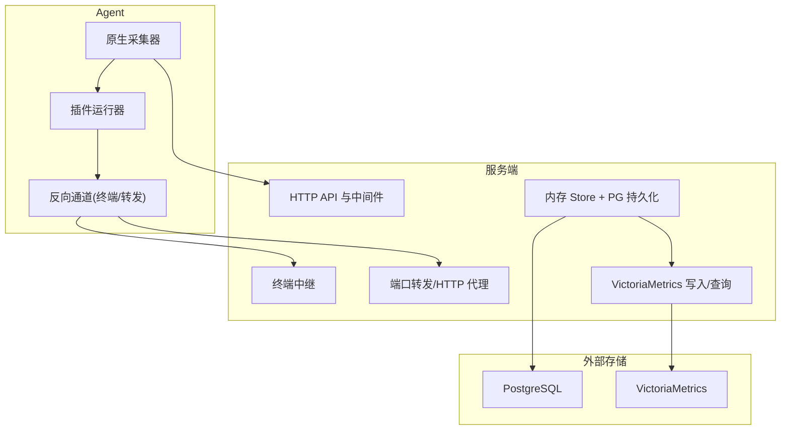
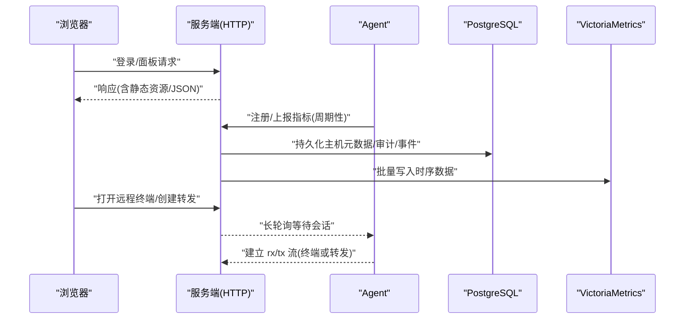
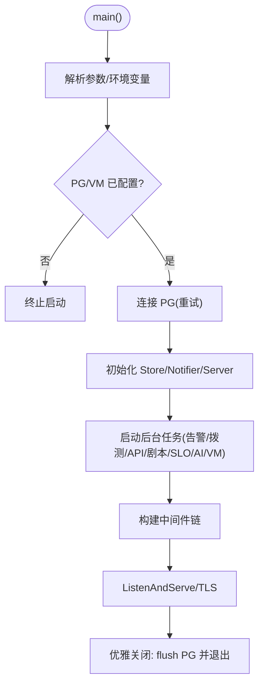
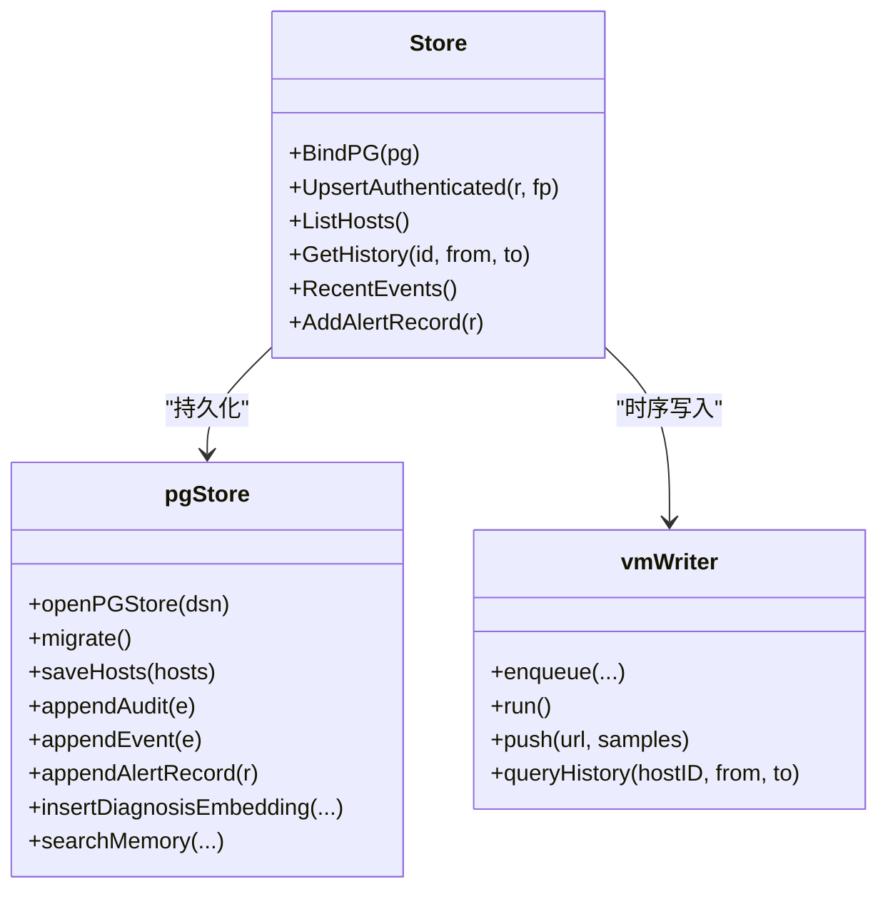
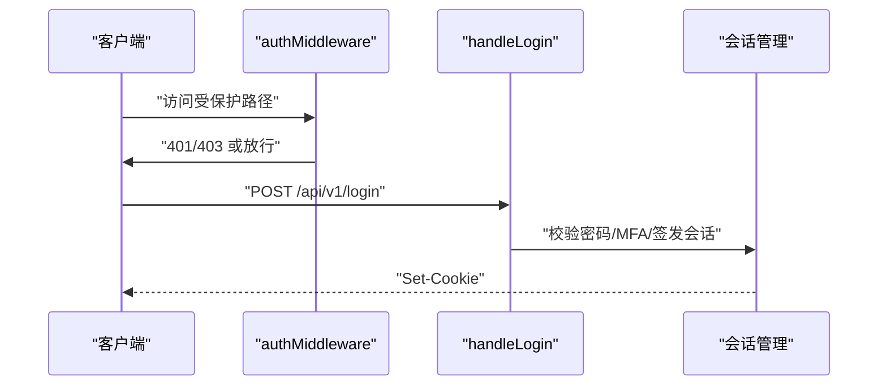
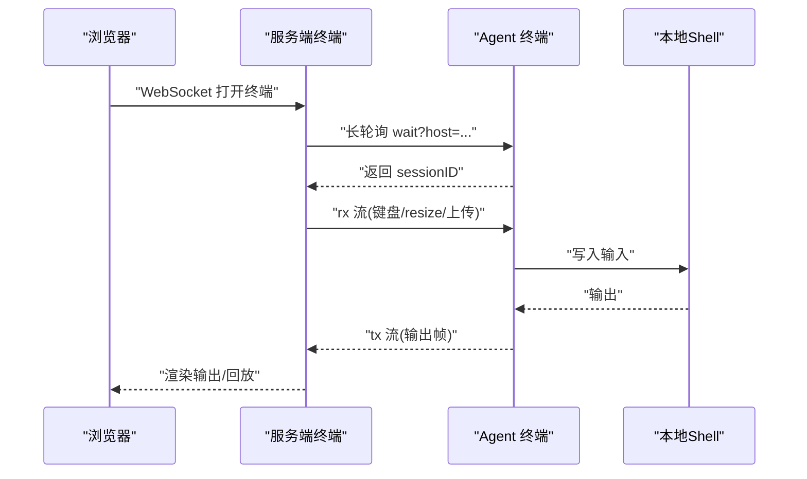
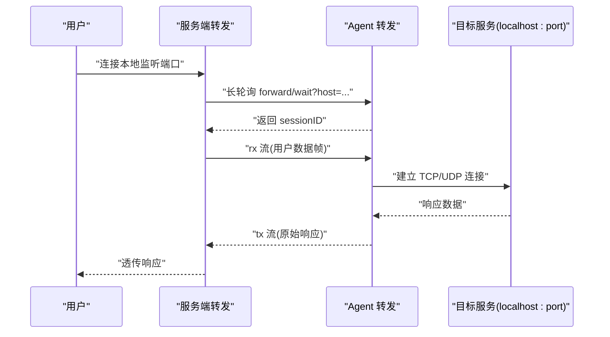
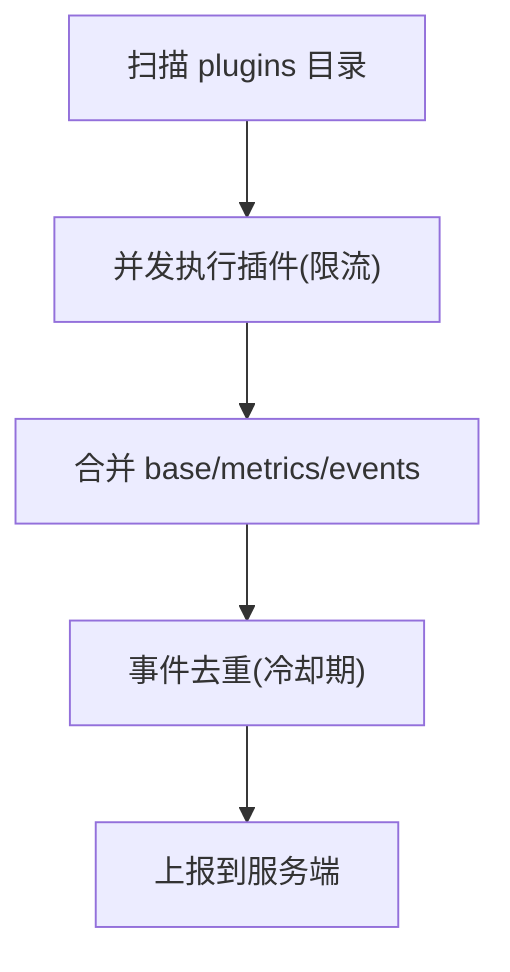
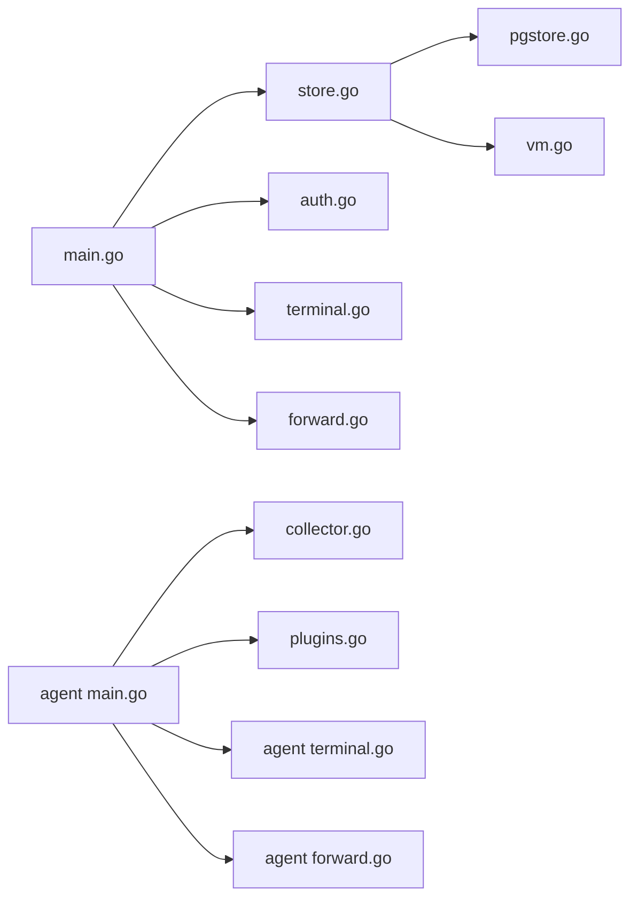

# 架构设计

<cite>
**本文引用的文件**   
- [README.md](file://README.md)
- [cmd/server/main.go](file://cmd/server/main.go)
- [cmd/agent/main.go](file://cmd/agent/main.go)
- [config.example.json](file://config.example.json)
- [server_config.example.json](file://server_config.example.json)
- [cmd/server/store.go](file://cmd/server/store.go)
- [cmd/server/pgstore.go](file://cmd/server/pgstore.go)
- [cmd/server/vm.go](file://cmd/server/vm.go)
- [cmd/server/auth.go](file://cmd/server/auth.go)
- [cmd/server/terminal.go](file://cmd/server/terminal.go)
- [cmd/agent/collector.go](file://cmd/agent/collector.go)
- [cmd/agent/plugins.go](file://cmd/agent/plugins.go)
- [cmd/agent/terminal.go](file://cmd/agent/terminal.go)
- [cmd/server/forward.go](file://cmd/server/forward.go)
- [cmd/agent/forward.go](file://cmd/agent/forward.go)
</cite>

## 目录
1. [引言](#引言)
2. [项目结构](#项目结构)
3. [核心组件](#核心组件)
4. [架构总览](#架构总览)
5. [详细组件分析](#详细组件分析)
6. [依赖关系分析](#依赖关系分析)
7. [性能与可扩展性](#性能与可扩展性)
8. [安全架构](#安全架构)
9. [故障排查指南](#故障排查指南)
10. [结论](#结论)

## 引言
AIOps Monitor 采用 Server-Agent 分离架构：Agent 负责主机指标采集、插件执行与终端/转发代理；服务端提供 HTTP API、业务编排、告警治理、SRE 中枢与统一消息中心，并将关系数据持久化到 PostgreSQL，时序数据写入 VictoriaMetrics。系统支持多 Agent 向多服务端推送、反向通道（免开端口）的远程终端与端口转发、RBAC+MFA 认证、TLS 传输加密与 SSRF 出站防护等关键能力。

## 项目结构
- 服务端（Go 单二进制）
  - HTTP 路由与中间件（CORS、限体、压缩、鉴权）
  - 存储层：PostgreSQL（关系数据）、VictoriaMetrics（时序数据）
  - 功能模块：告警、拨测、API 监控、剧本调度、SLO、终端、转发、AI 助手
- Agent 客户端（跨平台）
  - 原生采集器（Linux/Windows/macOS）
  - Python 插件运行器（并发、隔离、超时）
  - 反向通道：远程终端、端口转发（TCP/UDP/HTTP）
- 配置与示例
  - Agent 配置（单/多服务端、上报周期、日志路径等）
  - 服务端配置（阈值、通知渠道、转发策略、账户与安全）

图表来源
- [cmd/server/main.go:227-355](file://cmd/server/main.go#L227-L355)
- [cmd/server/store.go:91-146](file://cmd/server/store.go#L91-L146)
- [cmd/server/vm.go:19-77](file://cmd/server/vm.go#L19-L77)
- [cmd/agent/main.go:74-136](file://cmd/agent/main.go#L74-L136)
- [cmd/agent/collector.go:1-32](file://cmd/agent/collector.go#L1-L32)
- [cmd/agent/plugins.go:36-100](file://cmd/agent/plugins.go#L36-L100)

章节来源
- [README.md:1-176](file://README.md#L1-L176)
- [cmd/server/main.go:227-355](file://cmd/server/main.go#L227-L355)
- [cmd/agent/main.go:74-136](file://cmd/agent/main.go#L74-L136)

## 核心组件
- 服务端
  - HTTP 服务与中间件：CORS、安全头、请求体限制、gzip 压缩、鉴权
  - 运行时任务：告警评估、自定义拨测、API 监控、剧本调度、SLO 评估、AI 巡检、VM 写入泵
  - 存储绑定：PG 初始化与重试、配置加载、审计与事件落库
- Agent
  - 采集器：按平台实现 CPU/内存/磁盘/网络/负载/进程/GPU 等指标
  - 插件运行器：并发执行 .py/.sh，合并输出并去重降噪
  - 反向通道：终端会话与端口转发，基于指纹鉴权，指数退避重连
- 存储层
  - PostgreSQL：用户/配置/审计/事件/工单/会话/规则等关系数据
  - VictoriaMetrics：所有时序数据（主机指标、拨测、API 监控），Prometheus 文本导入

章节来源
- [cmd/server/main.go:227-355](file://cmd/server/main.go#L227-L355)
- [cmd/server/store.go:91-146](file://cmd/server/store.go#L91-L146)
- [cmd/server/vm.go:19-77](file://cmd/server/vm.go#L19-L77)
- [cmd/agent/collector.go:1-32](file://cmd/agent/collector.go#L1-L32)
- [cmd/agent/plugins.go:36-100](file://cmd/agent/plugins.go#L36-L100)

## 架构总览
Server-Agent 通过“反向通道”建立连接，避免在受控端开放入站端口。Agent 定时上报指标，同时等待服务端下发终端/转发会话；服务端将关系数据落 PG，时序数据批量推送到 VM。

图表来源
- [cmd/server/main.go:227-355](file://cmd/server/main.go#L227-L355)
- [cmd/server/store.go:91-146](file://cmd/server/store.go#L91-L146)
- [cmd/server/vm.go:125-172](file://cmd/server/vm.go#L125-L172)
- [cmd/agent/main.go:210-237](file://cmd/agent/main.go#L210-L237)
- [cmd/server/terminal.go:438-516](file://cmd/server/terminal.go#L438-L516)
- [cmd/agent/terminal.go:206-231](file://cmd/agent/terminal.go#L206-L231)

## 详细组件分析

### 服务端启动与中间件链
- 启动流程
  - 解析参数与环境变量，强制要求 AIOPS_POSTGRES_DSN 与 AIOPS_VM_URL
  - 连接 PG（带重试窗口），加载配置，初始化 Store、Notifier、Server
  - 启动后台任务：告警、拨测、API 监控、剧本调度、SLO、AI 巡检、VM 写入
  - 组装中间件链：安全头 → CORS → gzip → 限体 → 鉴权 → 路由
  - 可选 TLS 监听；优雅关闭时 flush PG 并退出
- 中间件要点
  - 安全头：X-Content-Type-Options、X-Frame-Options、Referrer-Policy、CSP（排除 /proxy/）
  - 限体：MaxBytesReader 防 OOM
  - gzip：对非 WS/非代理/非转发的响应压缩，复用 Writer 池
  - CORS：可配置白名单或回退为 *

图表来源
- [cmd/server/main.go:227-355](file://cmd/server/main.go#L227-L355)

章节来源
- [cmd/server/main.go:227-355](file://cmd/server/main.go#L227-L355)

### 数据存储与时间序列
- 关系数据（PG）
  - 表族：incidents/tickets/app_config/audit_log/events/hosts/kv_state/terminal_recordings/diagnosis_embeddings/ai_memory_embeddings/experience_rules/hermes_* 等
  - 迁移：自动建表/索引，兼容旧字段
  - 读写：JSONB 存储，事务批量更新 hosts/incidents/tickets
- 时序数据（VM）
  - 写入：批量聚合后以 Prometheus text 格式 POST /api/v1/import/prometheus
  - 读取：/api/v1/export 拉取并按时间戳重组 Sample（含 GPU/分区/连接计数重建）
  - 专用指标：aiops_check_*/aiops_api_* 用于拨测与 API 监控

图表来源
- [cmd/server/store.go:91-146](file://cmd/server/store.go#L91-L146)
- [cmd/server/pgstore.go:47-212](file://cmd/server/pgstore.go#L47-L212)
- [cmd/server/vm.go:125-172](file://cmd/server/vm.go#L125-L172)

章节来源
- [cmd/server/store.go:91-146](file://cmd/server/store.go#L91-L146)
- [cmd/server/pgstore.go:47-212](file://cmd/server/pgstore.go#L47-L212)
- [cmd/server/vm.go:125-172](file://cmd/server/vm.go#L125-L172)

### 认证、授权与 MFA
- 认证
  - 用户名/手机号登录，失败计数与账号级限流
  - 首次登录强制修改默认凭据
  - 全局 MFA 策略：未启用 MFA 的用户进入受限会话
- 授权（RBAC）
  - 角色：admin/operator/viewer
  - 路由级权限拦截：读/写/管理/终端/转发/代理等
- 会话与令牌
  - Cookie 会话（HttpOnly、Secure、SameSite）
  - /proxy/ 临时令牌二次校验，仍复核当前角色

图表来源
- [cmd/server/auth.go:112-172](file://cmd/server/auth.go#L112-L172)
- [cmd/server/auth.go:176-307](file://cmd/server/auth.go#L176-L307)

章节来源
- [cmd/server/auth.go:112-172](file://cmd/server/auth.go#L112-L172)
- [cmd/server/auth.go:176-307](file://cmd/server/auth.go#L176-L307)

### 远程终端（反向通道）
- 服务端
  - WebSocket 接入，二次验证（可选密码）
  - 长轮询等待 Agent 接入，支持 pendingSessions 队列修复竞态
  - 录制回放、旁观者、命令审计（过滤敏感输入）
- Agent
  - 长轮询 wait，建立 rx/tx 两条流
  - PTY 或管道回退，ZMODEM 文件传输，会话超时控制

图表来源
- [cmd/server/terminal.go:438-516](file://cmd/server/terminal.go#L438-L516)
- [cmd/agent/terminal.go:206-231](file://cmd/agent/terminal.go#L206-L231)
- [cmd/agent/terminal.go:338-423](file://cmd/agent/terminal.go#L338-L423)

章节来源
- [cmd/server/terminal.go:438-516](file://cmd/server/terminal.go#L438-L516)
- [cmd/agent/terminal.go:206-231](file://cmd/agent/terminal.go#L206-L231)
- [cmd/agent/terminal.go:338-423](file://cmd/agent/terminal.go#L338-L423)

### 端口转发与 HTTP 代理
- 模式
  - TCP/UDP 端口映射：服务端监听本地端口，经 Agent 隧道转发至目标主机 localhost:port
  - HTTP 反向代理：/proxy/{hostID}/{port}/... 无状态透传，支持 WebSocket
- 机制
  - 服务端：规则管理、空闲清理、统计、pendingSessions 队列
  - Agent：长轮询获取会话，建立 rx/tx 流，会话超时控制
  - 安全：指纹鉴权、最大会话数、请求体上限、带宽/延迟统计

图表来源
- [cmd/server/forward.go:234-258](file://cmd/server/forward.go#L234-L258)
- [cmd/agent/forward.go:54-75](file://cmd/agent/forward.go#L54-L75)
- [cmd/agent/forward.go:97-185](file://cmd/agent/forward.go#L97-L185)

章节来源
- [cmd/server/forward.go:234-258](file://cmd/server/forward.go#L234-L258)
- [cmd/agent/forward.go:54-75](file://cmd/agent/forward.go#L54-L75)
- [cmd/agent/forward.go:97-185](file://cmd/agent/forward.go#L97-L185)

### 指标采集与插件执行
- 采集器
  - 平台差异实现（Linux procfs/syscall、Windows Win32、macOS sysctl）
  - 速率计算、四舍五入等通用工具
- 插件运行器
  - 发现与缓存、并发执行（信号量限流）、超时隔离
  - 输出合并（base/custom metrics/events），噪声抑制

图表来源
- [cmd/agent/collector.go:1-32](file://cmd/agent/collector.go#L1-L32)
- [cmd/agent/plugins.go:62-147](file://cmd/agent/plugins.go#L62-L147)
- [cmd/server/store.go:309-340](file://cmd/server/store.go#L309-L340)

章节来源
- [cmd/agent/collector.go:1-32](file://cmd/agent/collector.go#L1-L32)
- [cmd/agent/plugins.go:62-147](file://cmd/agent/plugins.go#L62-L147)
- [cmd/server/store.go:309-340](file://cmd/server/store.go#L309-L340)

## 依赖关系分析
- 组件耦合
  - 服务端：Store 依赖 PG 与 VM；Terminal/Forward 依赖 Store 与 Config；Auth 依赖 Config 与 Store
  - Agent：Collector/PluginRunner 独立；Terminal/Forward 共享身份（指纹）与 HTTP 客户端
- 外部依赖
  - PostgreSQL：驱动 lib/pq，pgvector 扩展
  - VictoriaMetrics：标准 HTTP 接口（import/export/query）
- 潜在环路与风险
  - 无循环依赖；注意并发锁顺序（如 idleChecker 与 session.mu）

图表来源
- [cmd/server/main.go:227-355](file://cmd/server/main.go#L227-L355)
- [cmd/server/store.go:91-146](file://cmd/server/store.go#L91-L146)
- [cmd/server/pgstore.go:47-212](file://cmd/server/pgstore.go#L47-L212)
- [cmd/server/vm.go:125-172](file://cmd/server/vm.go#L125-L172)
- [cmd/agent/main.go:74-136](file://cmd/agent/main.go#L74-L136)

章节来源
- [cmd/server/main.go:227-355](file://cmd/server/main.go#L227-L355)
- [cmd/server/store.go:91-146](file://cmd/server/store.go#L91-L146)
- [cmd/server/pgstore.go:47-212](file://cmd/server/pgstore.go#L47-L212)
- [cmd/server/vm.go:125-172](file://cmd/server/vm.go#L125-L172)
- [cmd/agent/main.go:74-136](file://cmd/agent/main.go#L74-L136)

## 性能与可扩展性
- 高吞吐
  - gzip 压缩降低带宽（~8-10x）
  - VM 批量写入（5s 周期、缓冲队列、丢弃策略）
  - 插件并发限流（最多 4 个并行子进程）
- 高可用
  - PG 连接重试窗口，冷启动不中断
  - 优雅关闭：停止接受新连接、flush 状态、退出
  - 反向通道指数退避与深度退避，避免雪崩
- 可扩展
  - 多 Agent 广播到多服务端（一次采集，多次上报）
  - 端口范围批量转发、HTTP 代理无状态扩展
  - 插件目录热发现（重启生效）

章节来源
- [cmd/server/main.go:186-205](file://cmd/server/main.go#L186-L205)
- [cmd/server/vm.go:125-172](file://cmd/server/vm.go#L125-L172)
- [cmd/agent/plugins.go:102-147](file://cmd/agent/plugins.go#L102-L147)
- [cmd/agent/terminal.go:75-108](file://cmd/agent/terminal.go#L75-L108)

## 安全架构
- 传输安全
  - 可选 TLS（AIOPS_TLS_CERT/AIOPS_TLS_KEY），否则明文 HTTP（建议置于 HTTPS 终止代理之后）
  - Agent 侧支持跳过证书校验（仅自签/内网）与自定义 CA 信任
- 认证与授权
  - RBAC：admin/operator/viewer，路由级拦截
  - MFA：TOTP 两步验证，全局强制策略
  - 终端二次验证（可选密码）
- 网络安全
  - SSRF 出站防护：AI/Webhook 等出站守卫，默认拒绝云元数据/链路本地，严格模式拒私网
  - 端口转发暴露面告警（非回环地址监听）
- 数据安全
  - AES-256-GCM 静态加密（AIOPS_SECRET_KEY）
  - 终端输入不记录（仅输出与命令审计）
  - 安全头与 CSP 加固（排除 /proxy/）

章节来源
- [cmd/server/main.go:335-351](file://cmd/server/main.go#L335-L351)
- [cmd/agent/main.go:122-136](file://cmd/agent/main.go#L122-L136)
- [cmd/server/auth.go:112-172](file://cmd/server/auth.go#L112-L172)
- [cmd/server/terminal.go:543-558](file://cmd/server/terminal.go#L543-L558)
- [cmd/server/forward.go:615-620](file://cmd/server/forward.go#L615-L620)
- [README.md:174-176](file://README.md#L174-L176)

## 故障排查指南
- 启动失败
  - 检查 AIOPS_POSTGRES_DSN 与 AIOPS_VM_URL 是否配置
  - 查看 PG 连接重试日志与错误
- 终端无法连接
  - 确认 Agent 已上报且指纹绑定成功
  - 检查 pendingSessions 队列与长轮询超时
- 转发异常
  - 检查监听地址是否为 0.0.0.0（Docker 部署）
  - 查看会话超时与空闲清理日志
- VM 写入失败
  - 检查 VM URL 与网络连通性
  - 关注批量写入日志与错误码

章节来源
- [cmd/server/main.go:255-272](file://cmd/server/main.go#L255-L272)
- [cmd/server/terminal.go:492-508](file://cmd/server/terminal.go#L492-L508)
- [cmd/server/forward.go:281-308](file://cmd/server/forward.go#L281-L308)
- [cmd/server/vm.go:560-571](file://cmd/server/vm.go#L560-L571)

## 结论
本架构以“反向通道 + 双存储”为核心：Agent 零入站端口、服务端集中管控；PG 承载关系数据与审计，VM 承载海量时序数据。配合 RBAC+MFA、TLS、SSRF 防护与完善的中间件链，系统在安全性、可靠性与可扩展性方面具备生产就绪能力。未来可在多集群联邦、边缘中继与更细粒度的租户隔离方向持续演进。