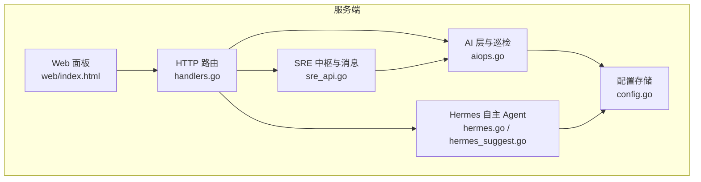
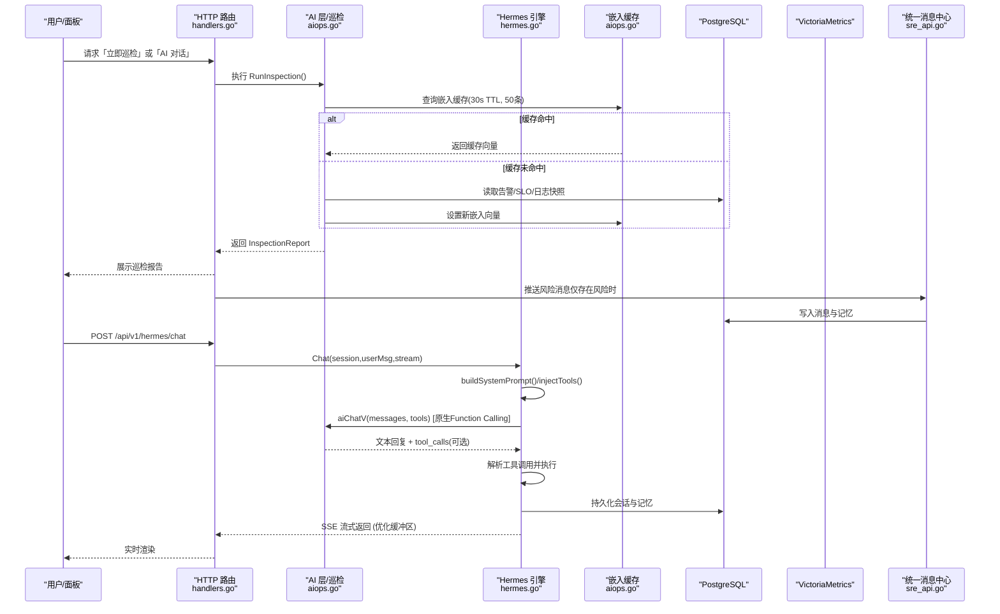
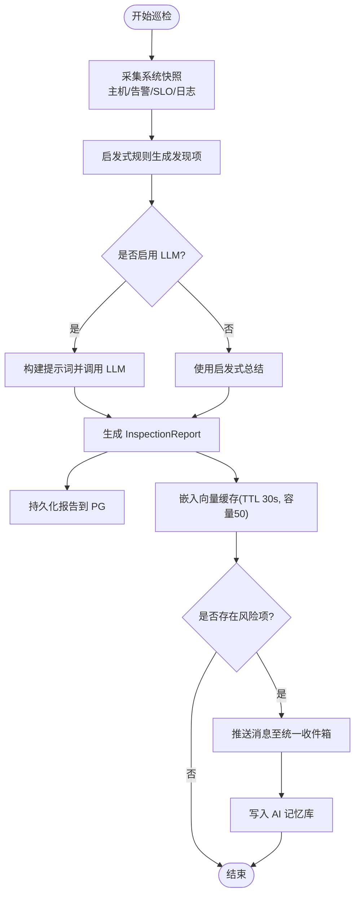
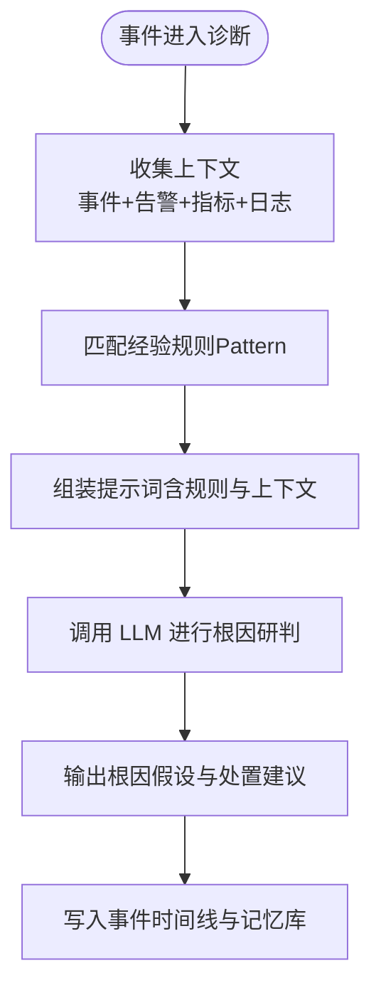
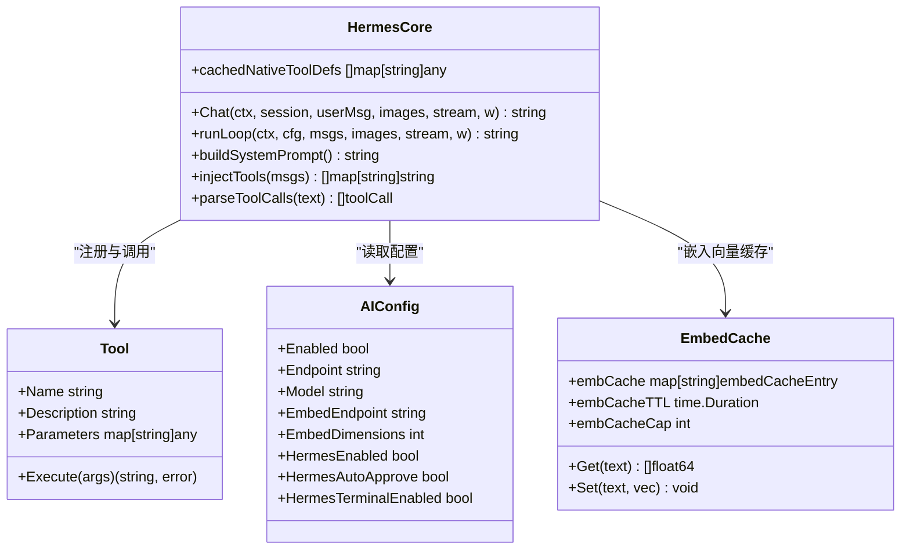
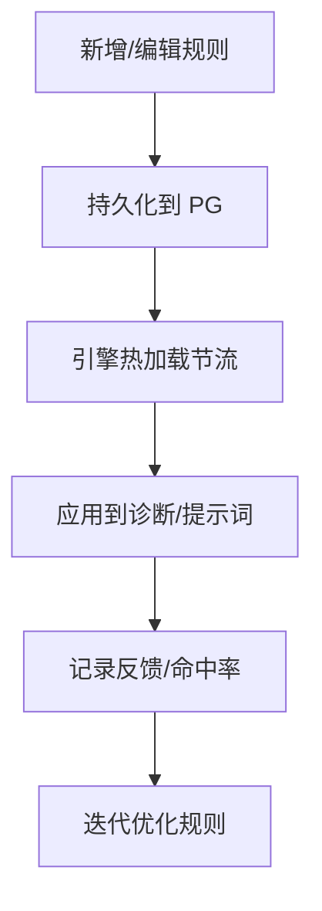
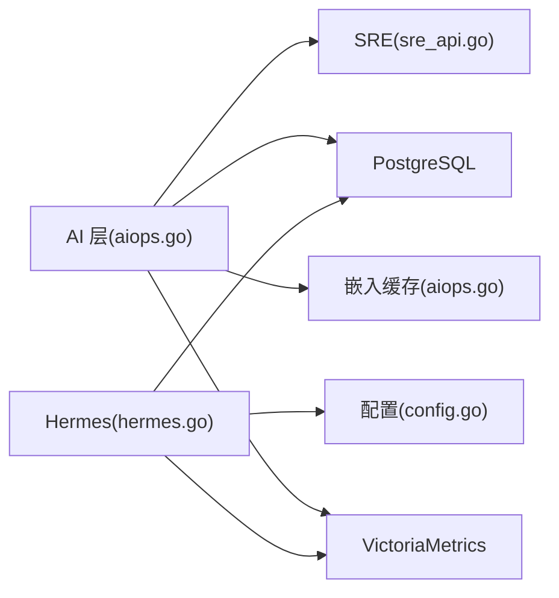

# AI 增强功能

<cite>
**本文引用的文件**   
- [README.md](file://README.md)
- [aiops.go](file://cmd/server/aiops.go)
- [hermes.go](file://cmd/server/hermes.go)
- [hermes_suggest.go](file://cmd/server/hermes_suggest.go)
- [handlers.go](file://cmd/server/handlers.go)
- [sre_api.go](file://cmd/server/sre_api.go)
- [config.go](file://cmd/server/config.go)
- [index.html](file://cmd/server/web/index.html)
</cite>

## 更新摘要
**变更内容**   
- 新增原生Function Calling支持，提升工具调用可靠性
- 优化流式响应性能，减少内存占用
- 引入嵌入向量本地缓存机制，提高RAG检索效率
- 增强对话助手的工具链集成能力

## 目录
1. [简介](#简介)
2. [项目结构](#项目结构)
3. [核心组件](#核心组件)
4. [架构总览](#架构总览)
5. [详细组件分析](#详细组件分析)
6. [依赖关系分析](#依赖关系分析)
7. [性能与调优](#性能与调优)
8. [故障排查指南](#故障排查指南)
9. [结论](#结论)
10. [附录：API 参考](#附录api-参考)

## 简介
本章节面向 AIOps Monitor 的"AI 增强"能力，系统性说明以下四大模块：
- 健康巡检：自动化的系统健康检查、性能瓶颈识别、潜在风险预警。
- 事件根因分析：多维度数据分析、关联关系挖掘、根因定位算法（含启发式与 LLM 增强）。
- 对话助手（Hermes）：自然语言查询、智能问答、操作建议生成与 Function Calling 工具链。
- 经验规则库：规则定义、版本控制、效果评估机制。

同时提供 AI 模型配置示例与最佳实践，涵盖性能调优与安全考虑。

## 项目结构
围绕 AI 增强的关键后端实现集中在服务端代码中，主要涉及：
- AI 层与巡检引擎：aiops.go
- 自主运维 Agent（Hermes）：hermes.go、hermes_suggest.go
- 路由与前端入口：handlers.go、web/index.html
- SRE 中枢集成与消息推送：sre_api.go
- 配置存取与密钥保护：config.go

**图表来源**
- [handlers.go:213-232](file://cmd/server/handlers.go#L213-L232)
- [aiops.go:586-776](file://cmd/server/aiops.go#L586-L776)
- [hermes.go:46-196](file://cmd/server/hermes.go#L46-L196)
- [sre_api.go:62-85](file://cmd/server/sre_api.go#L62-L85)
- [config.go:1222-1264](file://cmd/server/config.go#L1222-L1264)
- [index.html:574-582](file://cmd/server/web/index.html#L574-L582)

**章节来源**
- [handlers.go:213-232](file://cmd/server/handlers.go#L213-L232)
- [aiops.go:586-776](file://cmd/server/aiops.go#L586-L776)
- [hermes.go:46-196](file://cmd/server/hermes.go#L46-L196)
- [sre_api.go:62-85](file://cmd/server/sre_api.go#L62-L85)
- [config.go:1222-1264](file://cmd/server/config.go#L1222-L1264)
- [index.html:574-582](file://cmd/server/web/index.html#L574-L582)

## 核心组件
- AI 层与巡检（aiops.go）
  - 支持 OpenAI 兼容与 Anthropic 两种 Provider；未配置 LLM 时启用内置启发式兜底，保证开箱即用。
  - 定时/手动触发健康巡检，聚合在线/离线主机、活跃告警、SLO 突破、近时段错误日志，输出结构化发现项与总结。
  - 将巡检报告写入记忆库，供后续 RAG 检索复用。
  - **新增** 嵌入向量本地缓存机制，TTL 30秒，容量50条，显著提升RAG检索性能。
- 对话助手 Hermes（hermes.go, hermes_suggest.go）
  - 三层解耦：引擎核心 + 规则/模板热加载 + Python 动作插件。
  - 多轮对话（SSE 流式）、**原生 Function Calling 工具调用**（指标查询、日志检索、告警列表、相似案例检索、只读诊断命令、外部数据源查询等）。
  - Token 预算管理与历史摘要，避免上下文爆炸。
  - **优化** SSE 流式响应缓冲区大小，降低内存占用。
- SRE 中枢集成（sre_api.go）
  - 将 AI 巡检结果转化为统一消息中心条目，并沉淀为记忆内容。
- 配置管理（config.go）
  - AI 配置（Endpoint、模型、嵌入端点、维度、Hermes 开关）经 AES-256-GCM 静态加密落库，支持环境变量覆盖。

**章节来源**
- [aiops.go:27-45](file://cmd/server/aiops.go#L27-L45)
- [aiops.go:586-776](file://cmd/server/aiops.go#L586-L776)
- [aiops.go:838-930](file://cmd/server/aiops.go#L838-930)
- [hermes.go:18-28](file://cmd/server/hermes.go#L18-L28)
- [hermes.go:30-196](file://cmd/server/hermes.go#L30-196)
- [hermes.go:789-997](file://cmd/server/hermes.go#L789-L997)
- [hermes.go:1027-1053](file://cmd/server/hermes.go#L1027-L1053)
- [hermes_suggest.go:9-74](file://cmd/server/hermes_suggest.go#L9-L74)
- [sre_api.go:62-85](file://cmd/server/sre_api.go#L62-L85)
- [config.go:1222-1264](file://cmd/server/config.go#L1222-L1264)

## 架构总览
AI 增强在整体系统中的位置与交互如下：

**图表来源**
- [handlers.go:213-232](file://cmd/server/handlers.go#L213-L232)
- [aiops.go:689-776](file://cmd/server/aiops.go#L689-L776)
- [aiops.go:838-930](file://cmd/server/aiops.go#L838-930)
- [hermes.go:789-997](file://cmd/server/hermes.go#L789-L997)
- [hermes.go:907-924](file://cmd/server/hermes.go#L907-L924)
- [sre_api.go:62-85](file://cmd/server/sre_api.go#L62-L85)

## 详细组件分析

### 健康巡检（自动化健康检查、瓶颈识别、风险预警）
- 触发方式
  - 定时循环：按配置的间隔分钟数周期性执行。
  - 手动触发：通过 API 或面板按钮立即执行一次。
- 输入上下文
  - 在线/离线主机、活跃告警、SLO 未达标项、资源高位项、近期错误/警告日志。
- 处理逻辑
  - 先以启发式规则生成结构化发现项与总结。
  - 若已配置 LLM，则基于相同上下文生成更深入的研判与建议。
- 输出与联动
  - 保存最近 N 条巡检报告（内存缓存 + PG 持久化）。
  - 当存在风险项时，向统一消息中心推送通知，并将报告沉淀为记忆，供后续 RAG 检索。
  - **新增** 嵌入向量缓存机制，对相同文本的向量计算进行缓存，TTL 30秒，容量50条。

**图表来源**
- [aiops.go:586-776](file://cmd/server/aiops.go#L586-L776)
- [aiops.go:838-930](file://cmd/server/aiops.go#L838-930)
- [sre_api.go:62-85](file://cmd/server/sre_api.go#L62-L85)

**章节来源**
- [aiops.go:586-776](file://cmd/server/aiops.go#L586-L776)
- [aiops.go:838-930](file://cmd/server/aiops.go#L838-930)
- [sre_api.go:62-85](file://cmd/server/sre_api.go#L62-L85)

### 事件根因分析（多维度分析、关联挖掘、根因定位）
- 数据来源
  - 事件标题/类型、活跃告警、主机指标、错误日志、经验规则匹配。
- 算法路径
  - 启发式：基于阈值与规则快速给出处置方向。
  - LLM 增强：结合上下文与经验规则，输出可执行的排查步骤与根因假设。
- 经验规则匹配
  - 根据模式（Pattern）对事件标题/类型进行匹配，命中后附加结论与严重级别，辅助快速定位。

**图表来源**
- [sre_api.go:1509-1536](file://cmd/server/sre_api.go#L1509-L1536)
- [aiops.go:639-677](file://cmd/server/aiops.go#L639-L677)

**章节来源**
- [sre_api.go:1509-1536](file://cmd/server/sre_api.go#L1509-L1536)
- [aiops.go:639-677](file://cmd/server/aiops.go#L639-L677)

### 对话助手（自然语言查询、智能问答、操作建议）
- 能力概览
  - 多轮对话（SSE 流式），自动注入系统提示词、纳管主机清单、生效模板与规则。
  - **原生 Function Calling**：OpenAI 兼容提供商原生支持工具调用，提供更可靠的工具执行机制。
  - 指标查询、日志检索、告警列表、相似案例检索、只读诊断命令、外部数据源查询等工具链。
  - Token 预算与历史摘要，避免上下文膨胀。
  - **优化** SSE 流式响应缓冲区大小从默认值调整为4KB初始/1MB最大，降低内存占用。
- 安全门控
  - 只读诊断命令白名单与敏感路径黑名单，防止越权与注入。
  - 写操作（如 Python 动作）默认需人工确认，除非显式开启自动审批。
- 快捷建议
  - 根据当前状态动态生成推荐问题，提升上手效率。

**图表来源**
- [hermes.go:46-196](file://cmd/server/hermes.go#L46-L196)
- [hermes.go:789-997](file://cmd/server/hermes.go#L789-L997)
- [hermes.go:1005-1047](file://cmd/server/hermes.go#L1005-L1047)
- [hermes.go:1177-1244](file://cmd/server/hermes.go#L1177-L1244)
- [hermes.go:1027-1053](file://cmd/server/hermes.go#L1027-L1053)
- [aiops.go:27-45](file://cmd/server/aiops.go#L27-L45)
- [aiops.go:838-930](file://cmd/server/aiops.go#L838-930)

**章节来源**
- [hermes.go:46-196](file://cmd/server/hermes.go#L46-L196)
- [hermes.go:789-997](file://cmd/server/hermes.go#L789-L997)
- [hermes.go:1005-1047](file://cmd/server/hermes.go#L1005-L1047)
- [hermes.go:1177-1244](file://cmd/server/hermes.go#L1177-L1244)
- [hermes.go:1027-1053](file://cmd/server/hermes.go#L1027-L1053)
- [hermes_suggest.go:9-74](file://cmd/server/hermes_suggest.go#L9-L74)
- [aiops.go:27-45](file://cmd/server/aiops.go#L27-L45)
- [aiops.go:838-930](file://cmd/server/aiops.go#L838-930)

### 经验规则库（定义、版本控制、效果评估）
- 规则定义
  - 包含模式（Pattern）、严重级别（Severity）、结论（Conclusion）等字段，用于快速匹配事件标题/类型。
- 版本控制
  - 规则存储在 PostgreSQL，支持启用/停用与优先级排序；Hermes 引擎定期热加载，无需重启服务。
- 效果评估
  - 通过匹配命中数量与反馈（如帮助性标记）评估规则有效性，持续优化。

**图表来源**
- [sre_api.go:1509-1536](file://cmd/server/sre_api.go#L1509-L1536)
- [hermes.go:1177-1204](file://cmd/server/hermes.go#L1177-L1204)

**章节来源**
- [sre_api.go:1509-1536](file://cmd/server/sre_api.go#L1509-L1536)
- [hermes.go:1177-1204](file://cmd/server/hermes.go#L1177-L1204)

## 依赖关系分析
- 组件耦合
  - AI 层与 SRE 中枢松耦合：通过回调 onReport 推送消息，避免强依赖。
  - Hermes 引擎依赖配置存储与数据库（PG/VM），并通过工具抽象访问指标、日志、告警与外部数据源。
  - **新增** 嵌入向量缓存组件，独立于主流程，提供高性能的向量检索支持。
- 外部依赖
  - LLM Provider：OpenAI 兼容或 Anthropic Messages API。
  - 向量检索：PostgreSQL + pgvector（RAG 诊断与记忆）。
  - 时序数据：VictoriaMetrics（历史趋势与指标查询）。
- 潜在环路与风险
  - 无直接循环依赖；但需注意 LLM 超时与工具执行超时的边界条件，避免 goroutine 泄漏。

**图表来源**
- [aiops.go:586-776](file://cmd/server/aiops.go#L586-L776)
- [aiops.go:838-930](file://cmd/server/aiops.go#L838-930)
- [hermes.go:789-997](file://cmd/server/hermes.go#L789-L997)
- [config.go:1222-1264](file://cmd/server/config.go#L1222-L1264)

**章节来源**
- [aiops.go:586-776](file://cmd/server/aiops.go#L586-L776)
- [aiops.go:838-930](file://cmd/server/aiops.go#L838-930)
- [hermes.go:789-997](file://cmd/server/hermes.go#L789-L997)
- [config.go:1222-1264](file://cmd/server/config.go#L1222-L1264)

## 性能与调优
- 模型与连接
  - 合理选择模型大小与并发度；优先使用本地或低延迟 Endpoint。
  - 使用 Embedding 专用轻量模型，降低 RAG 成本与延迟。
- 上下文与 Token 预算
  - 限制历史轮次与工具结果长度，避免 prompt 过大导致响应缓慢。
  - 对长输出进行截断与摘要，减少网络与解析开销。
- 超时与重试
  - 设置合理的 LLM 请求超时（默认约 120s），客户端断开及时中止。
  - 工具执行增加超时保护，避免长时间阻塞。
- **嵌入缓存优化**
  - 本地嵌入向量缓存：TTL 30秒，容量50条，适合对话场景下同一用户的连续请求复用。
  - 缓存淘汰策略：过期清理 + 随机淘汰一半，平衡内存使用与命中率。
- **流式响应优化**
  - SSE 扫描器缓冲区优化：初始4KB，最大1MB，降低大响应时的内存占用。
  - 减少不必要的缓冲分配，提升流式传输性能。
- 安全与合规
  - 出站请求守卫（SSRF 防护），拒绝访问云元数据与链路本地地址。
  - 只读诊断命令白名单与敏感路径黑名单，防止越权与注入。
  - 配置密钥 AES-256-GCM 静态加密，支持环境变量覆盖。

**章节来源**
- [aiops.go:838-930](file://cmd/server/aiops.go#L838-930)
- [aiops.go:445-446](file://cmd/server/aiops.go#L445-L446)

## 故障排查指南
- AI 未配置或未启用
  - 现象：对话或巡检返回"AI 未配置"。
  - 处理：在「AI 设置」中填写 Endpoint 与模型并保存；必要时测试连通性。
- 模型不存在或非对话模型
  - 现象：HTTP 404 或参数错误。
  - 处理：确认模型是否为对话模型，Endpoint 是否正确（百炼兼容模式需正确路径）。
- 认证失败
  - 现象：HTTP 401/403。
  - 处理：检查 API Key 权限与开通情况。
- 响应超时
  - 现象：超过 120s 无响应。
  - 处理：更换更快模型或优化网络；检查 Provider 限流策略。
- 工具执行失败或超时
  - 现象：工具返回错误或超时。
  - 处理：检查目标主机在线状态、命令白名单与权限；缩短查询范围。
- **嵌入缓存相关问题**
  - 现象：RAG 检索性能下降或向量不一致。
  - 处理：检查嵌入模型配置，确认向量维度与pgvector列一致；监控缓存命中率。
- **Function Calling 异常**
  - 现象：工具调用解析失败或执行异常。
  - 处理：确认Provider支持原生Function Calling；检查工具定义格式；查看工具执行日志。

**章节来源**
- [aiops.go:82-116](file://cmd/server/aiops.go#L82-L116)
- [aiops.go:838-930](file://cmd/server/aiops.go#L838-930)
- [hermes.go:498-549](file://cmd/server/hermes.go#L498-L549)
- [hermes.go:551-581](file://cmd/server/hermes.go#L551-L581)

## 结论
AIOps Monitor 的 AI 增强以"可插拔 LLM + 启发式兜底"为核心，提供开箱即用的健康巡检、事件根因分析与对话助手能力。**最新增强包括原生 Function Calling 支持、流式响应优化和嵌入向量缓存机制**，显著提升了系统的可靠性、性能和用户体验。通过经验规则库与 RAG 记忆，系统具备持续进化的潜力。在生产环境中，应重视模型选型、Token 预算、超时与 SSRF 防护，确保稳定与安全。

## 附录：API 参考
- AI 相关
  - GET /api/v1/ai/config：获取 AI Provider 配置
  - POST /api/v1/ai/config：保存 AI Provider 配置
  - POST /api/v1/ai/test：测试 AI 连通性
  - POST /api/v1/ai/test-embed：测试向量化配置
  - POST /api/v1/ai/terminal-access：申请 AI 终端只读巡检权限
  - POST /api/v1/ai/chat：AI 对话（SSE 流式）
  - GET /api/v1/ai/models：列出可用模型
  - GET /api/v1/ai/inspections：巡检报告列表
  - POST /api/v1/ai/inspect：立即执行一次巡检
- 事件诊断
  - POST /api/v1/incidents/{id}/diagnose：AI/启发式根因诊断
  - POST /api/v1/incidents/{id}/diagnose-chat：事件诊断对话
  - GET /api/v1/incidents/{id}/diagnose-chat：诊断对话历史
  - POST /api/v1/incidents/{id}/diagnosis-feedback：反馈诊断结果
- 经验规则库
  - GET /api/v1/experience-rules：规则列表
  - POST /api/v1/experience-rules：创建规则
  - DELETE /api/v1/experience-rules/{id}：删除规则
- Hermes 自主 Agent
  - POST /api/v1/hermes/chat：Hermes 对话（SSE 流式，支持原生 Function Calling）
  - GET /api/v1/hermes/suggestions：快捷问题/推荐 Prompt

**章节来源**
- [handlers.go:213-232](file://cmd/server/handlers.go#L213-L232)
- [README.md:1253-1278](file://README.md#L1253-L1278)