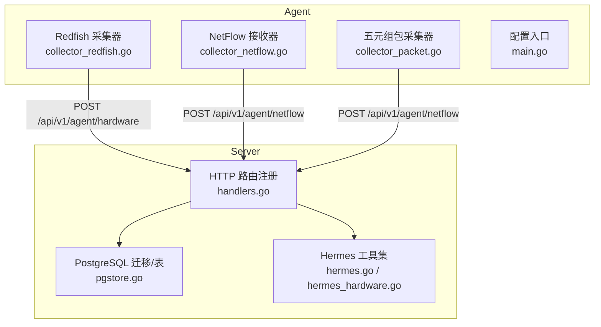
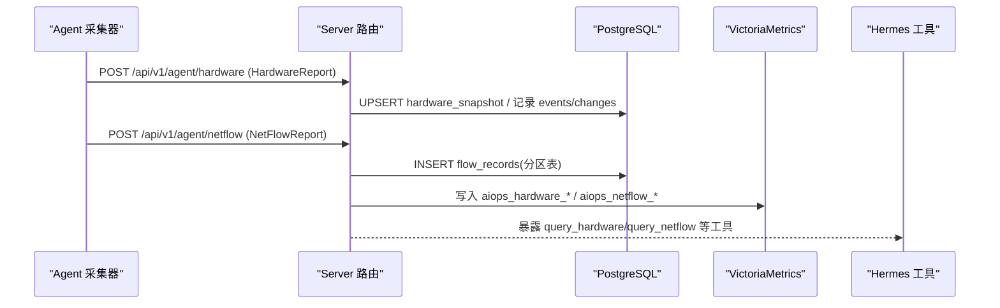
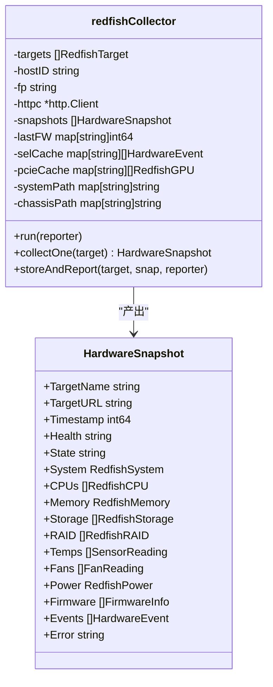
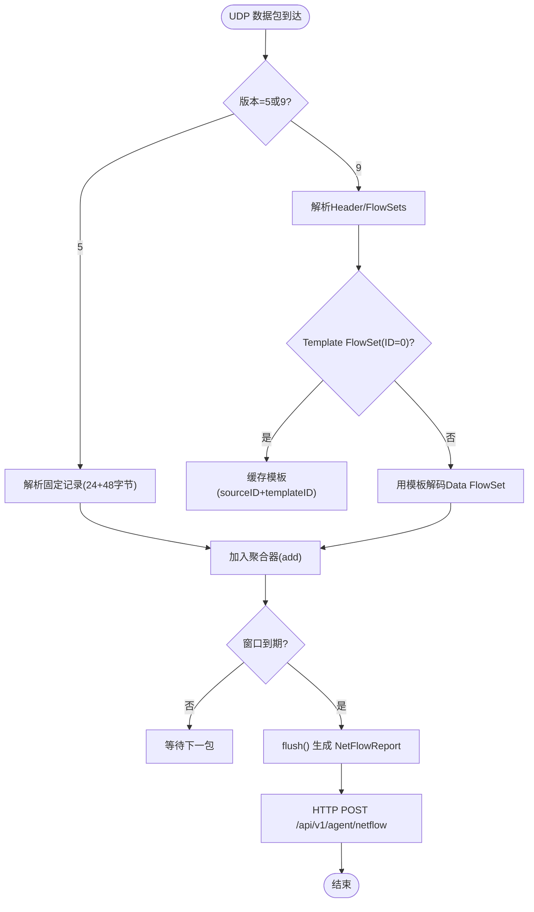
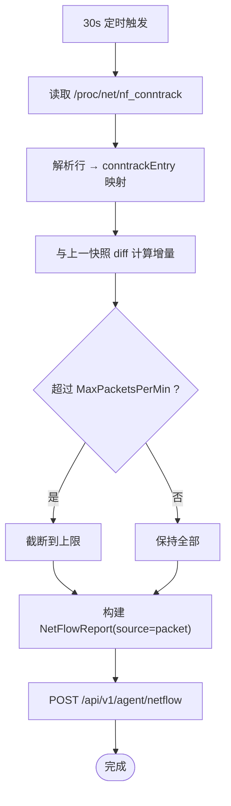
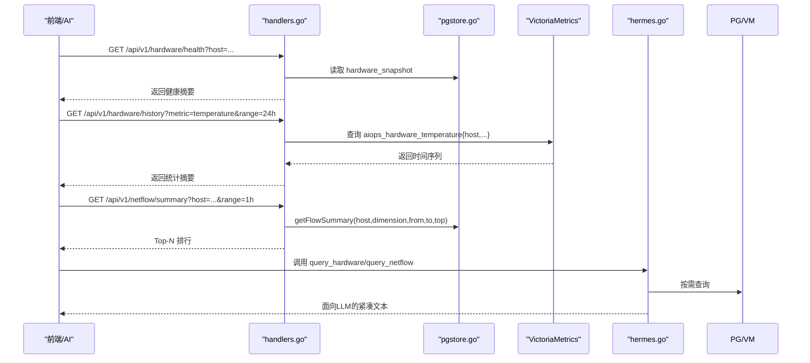
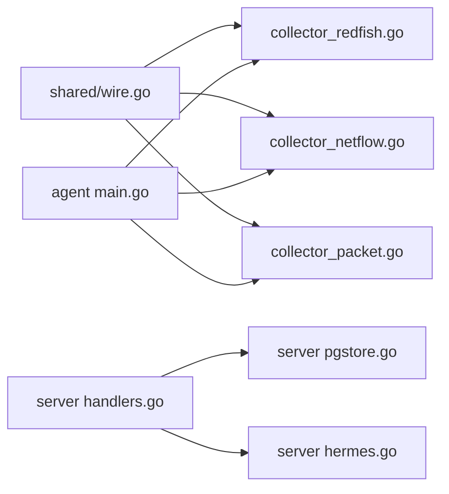

# Hermes AI硬件诊断工具

<cite>
**本文引用的文件**   
- [cmd/agent/main.go](file://cmd/agent/main.go)
- [shared/wire.go](file://shared/wire.go)
- [cmd/agent/collector_redfish.go](file://cmd/agent/collector_redfish.go)
- [cmd/agent/collector_netflow.go](file://cmd/agent/collector_netflow.go)
- [cmd/agent/collector_packet.go](file://cmd/agent/collector_packet.go)
- [cmd/server/main.go](file://cmd/server/main.go)
- [cmd/server/handlers.go](file://cmd/server/handlers.go)
- [cmd/server/pgstore.go](file://cmd/server/pgstore.go)
- [cmd/server/hermes.go](file://cmd/server/hermes.go)
- [cmd/server/hermes_hardware.go](file://cmd/server/hermes_hardware.go)
</cite>

## 目录
1. [简介](#简介)
2. [项目结构](#项目结构)
3. [核心组件](#核心组件)
4. [架构总览](#架构总览)
5. [详细组件分析](#详细组件分析)
6. [依赖关系分析](#依赖关系分析)
7. [性能与容量规划](#性能与容量规划)
8. [故障排查指南](#故障排查指南)
9. [结论](#结论)
10. [附录：API与存储设计](#附录api与存储设计)

## 简介
本文件围绕“Hermes AI硬件诊断工具”在现有 AIOps 平台中的实现进行系统化说明。该能力由三类采集器（Redfish 硬件状态、NetFlow 网络流量、五元组包报文）与 Server 端查询分析组成，并通过 Hermes 引擎将硬件与流量数据接入 AI 对话与自动化流程，形成“观察→推理→行动”的闭环。

## 项目结构
- Agent 侧新增三类采集器与上报通道，复用既有 HTTP 上报通道与指纹认证。
- Server 侧新增硬件/流量接收与查询 API，持久化到 PostgreSQL 与时序库（VictoriaMetrics），并暴露给前端与 Hermes 工具。

**图表来源** 
- [cmd/agent/collector_redfish.go:1-200](file://cmd/agent/collector_redfish.go#L1-L200)
- [cmd/agent/collector_netflow.go:1-120](file://cmd/agent/collector_netflow.go#L1-L120)
- [cmd/agent/collector_packet.go:1-120](file://cmd/agent/collector_packet.go#L1-L120)
- [cmd/server/handlers.go:295-304](file://cmd/server/handlers.go#L295-L304)
- [cmd/server/pgstore.go:219-277](file://cmd/server/pgstore.go#L219-L277)
- [cmd/server/hermes.go:197-279](file://cmd/server/hermes.go#L197-L279)
- [cmd/server/hermes_hardware.go:1-120](file://cmd/server/hermes_hardware.go#L1-L120)

**章节来源**
- [cmd/agent/main.go:24-48](file://cmd/agent/main.go#L24-L48)
- [cmd/server/handlers.go:295-304](file://cmd/server/handlers.go#L295-L304)

## 核心组件
- 共享数据结构：HardwareSnapshot、FlowRecord、NetFlowReport 等定义于 shared/wire.go，确保 Agent 与 Server 契约一致。
- Redfish 采集器：按目标独立 goroutine + 定时器轮询 BMC/iDRAC/iBMC，兼容多厂商路径差异，缓存固件/事件/PCIe GPU 降频采集。
- NetFlow 接收器：UDP 监听 v5/v9，模板解析与聚合窗口，内存上限保护与丢弃计数。
- 五元组包采集：Linux 下读取 /proc/net/nf_conntrack，快照差分生成增量 Flow；非 Linux 跳过。
- Server 接收与查询：统一 POST 入口，PG 持久化最新快照与变更历史，VM 写入数值指标，提供健康/历史/事件/汇总/明细查询。
- Hermes 工具：query_hardware/query_hardware_events/query_hardware_history/query_hardware_changes/query_netflow 等，面向 LLM 输出紧凑文本。

**章节来源**
- [shared/wire.go:140-390](file://shared/wire.go#L140-L390)
- [cmd/agent/collector_redfish.go:95-222](file://cmd/agent/collector_redfish.go#L95-L222)
- [cmd/agent/collector_netflow.go:55-165](file://cmd/agent/collector_netflow.go#L55-L165)
- [cmd/agent/collector_packet.go:26-113](file://cmd/agent/collector_packet.go#L26-L113)
- [cmd/server/handlers.go:295-304](file://cmd/server/handlers.go#L295-L304)
- [cmd/server/pgstore.go:219-277](file://cmd/server/pgstore.go#L219-L277)
- [cmd/server/hermes.go:197-279](file://cmd/server/hermes.go#L197-L279)
- [cmd/server/hermes_hardware.go:162-203](file://cmd/server/hermes_hardware.go#L162-L203)

## 架构总览
Agent 通过三类采集器产出结构化数据，经 HTTP 上报至 Server；Server 将硬件快照与事件落 PG，数值指标写 VM，并提供查询接口供前端与 Hermes 使用。

**图表来源** 
- [cmd/server/handlers.go:295-304](file://cmd/server/handlers.go#L295-L304)
- [cmd/server/pgstore.go:219-277](file://cmd/server/pgstore.go#L219-L277)
- [cmd/server/hermes.go:197-279](file://cmd/server/hermes.go#L197-L279)

## 详细组件分析

### Redfish 硬件采集器
- 运行模型：每个 target 独立 goroutine + 定时器，最小间隔 30s，连续失败退避 5 分钟。
- 兼容性：自动发现 System/Chassis 路径，兼容 Dell/HP/Supermicro/Lenovo/Huawei 等差异；PowerSupplies 字段名修正避免全空。
- 缓存策略：固件清单、SEL/事件日志、PCIe GPU 列表降频采集并缓存，避免整份快照被清空。
- 错误处理：TLS/证书/连接/超时/认证失败分类提示，便于快速定位。

**图表来源** 
- [cmd/agent/collector_redfish.go:95-222](file://cmd/agent/collector_redfish.go#L95-L222)
- [shared/wire.go:140-342](file://shared/wire.go#L140-L342)

**章节来源**
- [cmd/agent/collector_redfish.go:152-197](file://cmd/agent/collector_redfish.go#L152-L197)
- [cmd/agent/collector_redfish.go:381-776](file://cmd/agent/collector_redfish.go#L381-L776)
- [shared/wire.go:140-342](file://shared/wire.go#L140-L342)

### NetFlow 接收器
- 双模式：被动接收（UDP 监听 v5/v9）为主，主动采集（SNMP/REST）为扩展。
- 解析流程：v5 固定记录长度；v9 先缓存 Template FlowSet，再解码 Data FlowSet。
- 聚合窗口：可配 window_sec，默认 5 分钟；内存上限 100K flows，超量淘汰最小流量条目并计数 dropped。
- 背压：UDP 读缓冲可配，flush 未完成时丢弃计数用于观测。

**图表来源** 
- [cmd/agent/collector_netflow.go:202-263](file://cmd/agent/collector_netflow.go#L202-L263)
- [cmd/agent/collector_netflow.go:265-340](file://cmd/agent/collector_netflow.go#L265-L340)
- [cmd/agent/collector_netflow.go:342-464](file://cmd/agent/collector_netflow.go#L342-L464)
- [cmd/agent/collector_netflow.go:125-165](file://cmd/agent/collector_netflow.go#L125-L165)

**章节来源**
- [cmd/agent/collector_netflow.go:14-31](file://cmd/agent/collector_netflow.go#L14-L31)
- [cmd/agent/collector_netflow.go:55-165](file://cmd/agent/collector_netflow.go#L55-L165)
- [cmd/agent/collector_netflow.go:202-263](file://cmd/agent/collector_netflow.go#L202-L263)

### 五元组包采集器
- 平台限制：仅 Linux 生效，其他平台直接跳过。
- 数据源：/proc/net/nf_conntrack，每 30s 扫描一次，与上次快照做差得到增量 Flow。
- 限速：MaxPacketsPerMin 控制输出规模，默认 6000。
- 输出：复用 NetFlowReport 结构，source="packet"。

**图表来源** 
- [cmd/agent/collector_packet.go:58-113](file://cmd/agent/collector_packet.go#L58-L113)
- [cmd/agent/collector_packet.go:115-216](file://cmd/agent/collector_packet.go#L115-L216)
- [cmd/agent/collector_packet.go:222-270](file://cmd/agent/collector_packet.go#L222-L270)

**章节来源**
- [cmd/agent/collector_packet.go:17-24](file://cmd/agent/collector_packet.go#L17-L24)
- [cmd/agent/collector_packet.go:58-113](file://cmd/agent/collector_packet.go#L58-L113)

### Server 端接收与查询
- 路由注册：新增硬件与流量上报及查询端点。
- 存储：hardware_snapshot（UPSERT）、hardware_events、hardware_changes、flow_records（按月分区）。
- 时序：aiops_hardware_*、aiops_netflow_* 指标写入 VictoriaMetrics。
- Hermes 工具：query_hardware/query_hardware_events/query_hardware_history/query_hardware_changes/query_netflow。

**图表来源** 
- [cmd/server/handlers.go:295-304](file://cmd/server/handlers.go#L295-L304)
- [cmd/server/pgstore.go:219-277](file://cmd/server/pgstore.go#L219-L277)
- [cmd/server/hermes.go:197-279](file://cmd/server/hermes.go#L197-L279)
- [cmd/server/hermes_hardware.go:323-394](file://cmd/server/hermes_hardware.go#L323-L394)

**章节来源**
- [cmd/server/handlers.go:295-304](file://cmd/server/handlers.go#L295-L304)
- [cmd/server/pgstore.go:219-277](file://cmd/server/pgstore.go#L219-L277)
- [cmd/server/hermes.go:197-279](file://cmd/server/hermes.go#L197-L279)
- [cmd/server/hermes_hardware.go:162-203](file://cmd/server/hermes_hardware.go#L162-L203)

## 依赖关系分析
- Agent 与 Server 通过 shared/wire.go 共享数据结构，保证协议一致性。
- Agent 主进程加载配置后启动各采集器 goroutine，分别上报不同端点。
- Server 启动时初始化存储、路由、后台任务（含清理与分区维护）。

**图表来源** 
- [shared/wire.go:140-390](file://shared/wire.go#L140-L390)
- [cmd/agent/main.go:24-48](file://cmd/agent/main.go#L24-L48)
- [cmd/server/handlers.go:295-304](file://cmd/server/handlers.go#L295-L304)
- [cmd/server/pgstore.go:219-277](file://cmd/server/pgstore.go#L219-L277)
- [cmd/server/hermes.go:197-279](file://cmd/server/hermes.go#L197-L279)

**章节来源**
- [cmd/agent/main.go:24-48](file://cmd/agent/main.go#L24-L48)
- [cmd/server/main.go:227-356](file://cmd/server/main.go#L227-L356)

## 性能与容量规划
- Redfish：建议 60s 起采，固件/事件/PCIe GPU 降频；单 target 失败退避 5 分钟，不影响其他 target。
- NetFlow：聚合窗口 5min，内存上限 100K flows；UDP 读缓冲可配；max_flows_per_sec 阈值可启用采样。
- 包采集：Linux 专用，30s 周期，MaxPacketsPerMin 限流。
- 存储：flow_records 按月分区，DEFAULT 兜底；hardware_snapshot 主键 host_id+target_name；hardware_changes 永久保留变更。
- 时序：温度/风扇/功耗/健康分等指标写入 VM，支持范围聚合与 Top-N 查询。

[本节为通用指导，不直接分析具体文件]

## 故障排查指南
- Redfish TLS/证书/连接问题：采集器已对常见错误进行分类提示（TLS 握手失败、证书错误、连接拒绝、DNS 失败、超时、认证失败）。
- 密码为空：优先从环境变量读取，若为空会记录告警与建议修复步骤。
- NetFlow 无数据：检查 UDP 监听端口、设备推送地址/协议、模板是否下发成功、聚合器是否因内存上限丢弃过多。
- 包采集无数据：确认 Linux 内核 nf_conntrack 可用且未被安全模块拦截。
- 查询无结果：核对 host_id、时间范围、维度参数；确认 PG/VM 是否连通。

**章节来源**
- [cmd/agent/collector_redfish.go:347-379](file://cmd/agent/collector_redfish.go#L347-L379)
- [cmd/agent/collector_redfish.go:69-93](file://cmd/agent/collector_redfish.go#L69-L93)
- [cmd/agent/collector_netflow.go:202-263](file://cmd/agent/collector_netflow.go#L202-L263)
- [cmd/agent/collector_packet.go:58-113](file://cmd/agent/collector_packet.go#L58-L113)

## 结论
Hermes AI 硬件诊断工具以三类采集器为基础，结合 Server 端的结构化存储与时序指标，打通了从带外硬件到网络流量的全链路观测，并通过 Hermes 工具将数据转化为可操作的诊断知识，显著提升排障效率与准确性。

[本节为总结性内容，不直接分析具体文件]

## 附录：API与存储设计

### API 端点
- Agent 上报
  - POST /api/v1/agent/hardware
  - POST /api/v1/agent/netflow
- 前端查询
  - GET /api/v1/hardware/health
  - GET /api/v1/hardware/history
  - GET /api/v1/hardware/events
  - GET /api/v1/netflow/summary
  - GET /api/v1/netflow/flows
  - GET /api/v1/netflow/packets

**章节来源**
- [cmd/server/handlers.go:295-304](file://cmd/server/handlers.go#L295-L304)

### PostgreSQL 表设计
- hardware_snapshot：主机+目标最新快照（JSONB），健康冗余列
- hardware_events：状态变更/故障/固件升级事件
- hardware_changes：部件增删换/变更历史（永久保留）
- flow_records：按月分区，DEFAULT 兜底，索引 host_id+created_at

**章节来源**
- [cmd/server/pgstore.go:219-277](file://cmd/server/pgstore.go#L219-L277)

### VictoriaMetrics 指标名
- aiops_hardware_temperature{host,target,sensor}
- aiops_hardware_fan_rpm{host,target,fan_name}
- aiops_hardware_power_watts{host,target,psu}
- aiops_hardware_health_score{host,target}
- aiops_netflow_bytes{host,src_ip,dst_ip,src_port,dst_port,proto}
- aiops_netflow_packets{host,src_ip,dst_ip,src_port,dst_port,proto}
- aiops_netflow_dropped{host}

[本节为概念性说明，不直接分析具体文件]