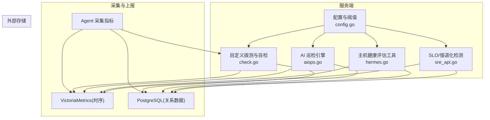
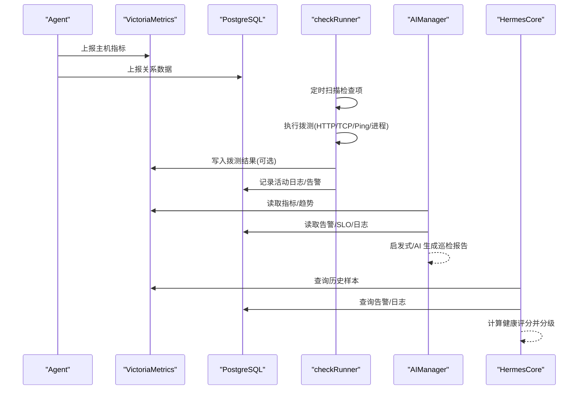
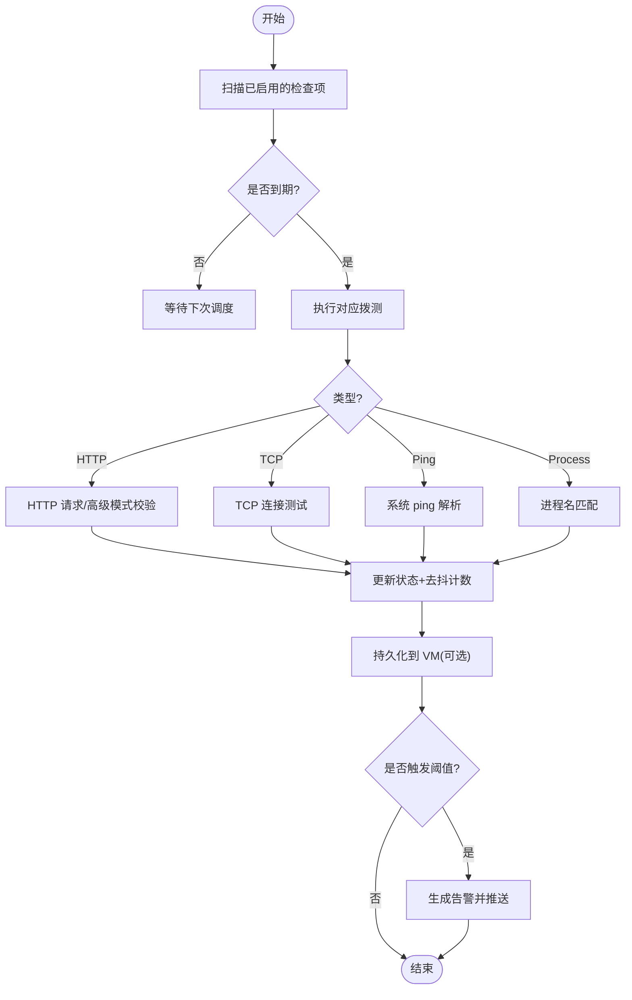
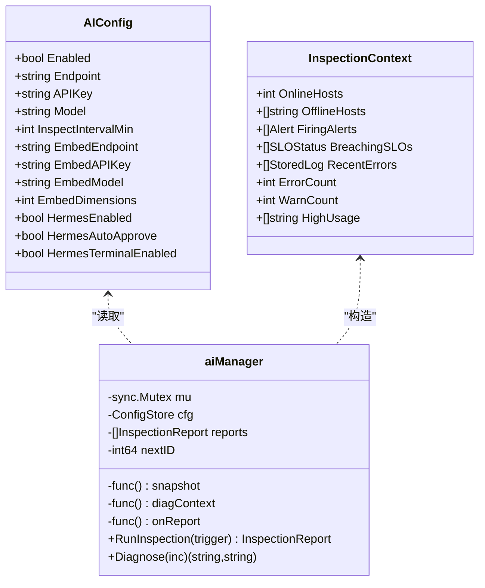
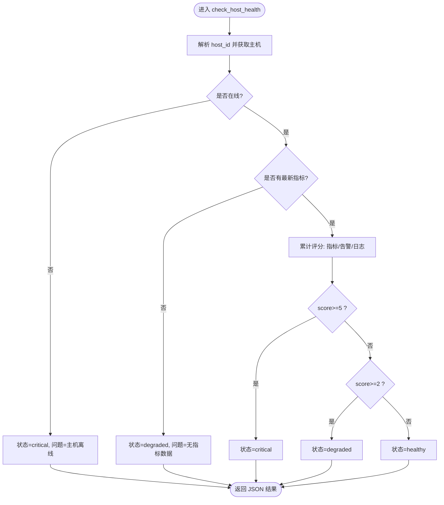
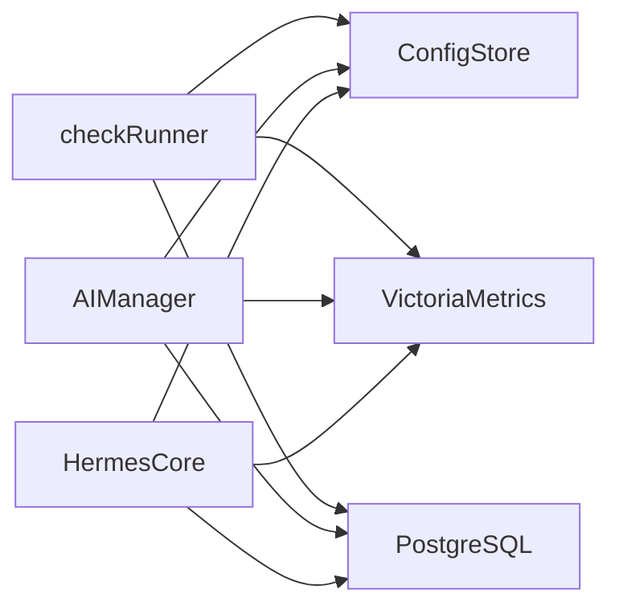

# 健康巡检功能

<cite>
**本文引用的文件列表**
- [check.go](file://cmd/server/check.go)
- [check_api.go](file://cmd/server/check_api.go)
- [aiops.go](file://cmd/server/aiops.go)
- [hermes.go](file://cmd/server/hermes.go)
- [config.go](file://cmd/server/config.go)
- [sre_api.go](file://cmd/server/sre_api.go)
</cite>

## 目录
1. [简介](#简介)
2. [项目结构](#项目结构)
3. [核心组件](#核心组件)
4. [架构总览](#架构总览)
5. [详细组件分析](#详细组件分析)
6. [依赖关系分析](#依赖关系分析)
7. [性能与容量特性](#性能与容量特性)
8. [配置与最佳实践](#配置与最佳实践)
9. [故障排查指南](#故障排查指南)
10. [结论](#结论)

## 简介
本文件面向 AIOps Monitor 的“健康巡检”能力，系统性阐述从数据采集、阈值评估、问题识别到报告生成的完整链路。内容覆盖：
- 主机在线状态检测
- 拨测（HTTP/TCP/Ping/进程）与健康自检
- 资源使用率监控与告警阈值
- 健康评分算法（多维度加权、严重级别判定 healthy/degraded/critical）
- AI 巡检与启发式兜底
- 执行流程、配置示例与最佳实践
- 实际使用场景与排障建议

## 项目结构
健康巡检相关代码集中在服务端模块中，关键文件如下：
- 拨测与自检：check.go、check_api.go
- AI 巡检与诊断：aiops.go
- 主机健康综合评估工具：hermes.go
- 配置与阈值：config.go
- SLO 与慢退化检测：sre_api.go

图表来源
- [check.go:118-137](file://cmd/server/check.go#L118-L137)
- [aiops.go:689-726](file://cmd/server/aiops.go#L689-L726)
- [hermes.go:669-783](file://cmd/server/hermes.go#L669-L783)
- [config.go:1224-1256](file://cmd/server/config.go#L1224-L1256)
- [sre_api.go:243-281](file://cmd/server/sre_api.go#L243-L281)

章节来源
- [check.go:118-137](file://cmd/server/check.go#L118-L137)
- [aiops.go:689-726](file://cmd/server/aiops.go#L689-L726)
- [hermes.go:669-783](file://cmd/server/hermes.go#L669-L783)
- [config.go:1224-1256](file://cmd/server/config.go#L1224-L1256)
- [sre_api.go:243-281](file://cmd/server/sre_api.go#L243-L281)

## 核心组件
- 自定义拨测与自检（check.go）
  - 内置自检：定时探测服务自身 /healthz，避免容器内 127.0.0.1 路由问题
  - 拨测类型：HTTP（含高级模式分段计时）、TCP、Ping、进程存活
  - 去抖机制：连续两次失败才标记 down，连续两次成功才恢复 up
  - 结果持久化：可选写入 VictoriaMetrics，支持历史曲线回看
  - 阈值告警：对 Ping 丢包/延迟、TCP 超时、HTTP 响应时间/状态码、进程失败次数等生成告警
- AI 巡检（aiops.go）
  - 周期运行：可配置间隔；未配置 LLM 时启用启发式规则
  - 输入上下文：在线/离线主机、活跃告警、SLO 超标、近期错误日志、资源高位项
  - 输出：摘要 + 结构化发现（critical/warning/info），并持久化
- 主机健康评估（hermes.go）
  - 工具 check_host_health：聚合当前指标、活跃告警、日志异常，给出 healthy/degraded/critical 分级
  - 安全只读诊断：run_diagnostic 白名单命令 + 敏感路径黑名单
- 配置与阈值（config.go）
  - AI 配置读写、Hermes 终端权限开关
  - 阈值默认值与零值回退策略（见 README 中的阈值说明）
- SLO 与慢退化（sre_api.go）
  - 基于最近样本趋势检测 CPU/内存/磁盘缓慢上升并接近阈值，提前预警

章节来源
- [check.go:139-194](file://cmd/server/check.go#L139-L194)
- [check.go:249-328](file://cmd/server/check.go#L249-L328)
- [check.go:684-805](file://cmd/server/check.go#L684-L805)
- [aiops.go:599-637](file://cmd/server/aiops.go#L599-L637)
- [aiops.go:689-726](file://cmd/server/aiops.go#L689-L726)
- [hermes.go:669-783](file://cmd/server/hermes.go#L669-L783)
- [config.go:1224-1256](file://cmd/server/config.go#L1224-L1256)
- [sre_api.go:243-281](file://cmd/server/sre_api.go#L243-L281)

## 架构总览
健康巡检由“采集→评估→决策→报告”四段组成：
- 采集层：Agent 上报主机指标；checkRunner 执行拨测；VM/PG 持久化
- 评估层：阈值比较、趋势检测、AI 推理或启发式规则
- 决策层：生成告警、事件、统一消息中心推送
- 报告层：AI 巡检报告、主机健康评估结果、历史趋势图

图表来源
- [check.go:118-137](file://cmd/server/check.go#L118-L137)
- [check.go:315-328](file://cmd/server/check.go#L315-L328)
- [aiops.go:689-726](file://cmd/server/aiops.go#L689-L726)
- [hermes.go:669-783](file://cmd/server/hermes.go#L669-L783)

## 详细组件分析

### 组件一：自定义拨测与自检（check.go）
- 内置自检
  - 每 30 秒探测服务自身 /healthz，避免 Docker 环境 127.0.0.1 路由问题
  - 结果写入内存环与 VM，用于趋势展示
- 拨测类型与逻辑
  - HTTP：基础模式返回状态码与证书剩余天数；高级模式支持方法/头/体、关键字/JSONPath 断言、分段计时（DNS/TCP/TLS/TTFB/总耗时）
  - TCP：连接建立是否成功
  - Ping：跨平台解析 time= 行统计丢包率与平均 RTT
  - 进程：按 hostID/processName 子串匹配
- 去抖与状态机
  - 连续 2 次失败才标记 down，连续 2 次成功才恢复 up，避免抖动
- 阈值告警
  - 针对 Ping 丢包/延迟、TCP 超时、HTTP 响应时间/非 2xx、进程失败次数，结合阈值配置生成告警

图表来源
- [check.go:118-137](file://cmd/server/check.go#L118-L137)
- [check.go:249-328](file://cmd/server/check.go#L249-L328)
- [check.go:684-805](file://cmd/server/check.go#L684-L805)

章节来源
- [check.go:139-194](file://cmd/server/check.go#L139-L194)
- [check.go:249-328](file://cmd/server/check.go#L249-L328)
- [check.go:351-375](file://cmd/server/check.go#L351-L375)
- [check.go:402-521](file://cmd/server/check.go#L402-L521)
- [check.go:562-605](file://cmd/server/check.go#L562-L605)
- [check.go:641-666](file://cmd/server/check.go#L641-L666)
- [check.go:684-805](file://cmd/server/check.go#L684-L805)

### 组件二：AI 巡检（aiops.go）
- 运行方式
  - 定时循环：默认 30 分钟一次，可通过配置调整
  - 快照构建：在线/离线主机、firing 告警、SLO 超标、近 30 分钟 error/warn 日志、资源高位项
- 启发式引擎
  - 离线主机 → critical
  - 告警级别映射为 severity
  - 错误日志量级阈值决定 info/warning/critical
- AI 增强
  - 当配置了 LLM 时，将快照文本化后调用对话模型，输出简洁中文研判与建议
- 报告持久化
  - 报告 ID 自增、限制条数、导出/导入以支持重启恢复

图表来源
- [aiops.go:27-45](file://cmd/server/aiops.go#L27-L45)
- [aiops.go:572-582](file://cmd/server/aiops.go#L572-L582)
- [aiops.go:689-726](file://cmd/server/aiops.go#L689-L726)

章节来源
- [aiops.go:599-637](file://cmd/server/aiops.go#L599-L637)
- [aiops.go:689-726](file://cmd/server/aiops.go#L689-L726)
- [aiops.go:800-826](file://cmd/server/aiops.go#L800-L826)

### 组件三：主机健康评估（hermes.go）
- 工具 check_host_health
  - 输入：host_id
  - 处理：
    - 在线判定：根据 LastSeen 与 offline_after_sec 阈值
    - 指标阈值：CPU/Mem/Disk 分别判断 warn/crit，Load 相对核数判断
    - 活跃告警计数：累加权重
    - 近期错误日志：超过阈值加分
  - 输出：healthy/degraded/critical 及问题清单
- 安全只读诊断 run_diagnostic
  - 白名单命令 + 管道过滤，禁止敏感路径访问
  - 通过 Playbook 一次性执行，返回输出

图表来源
- [hermes.go:669-783](file://cmd/server/hermes.go#L669-L783)

章节来源
- [hermes.go:669-783](file://cmd/server/hermes.go#L669-L783)
- [hermes.go:498-549](file://cmd/server/hermes.go#L498-L549)

### 组件四：SLO 与慢退化检测（sre_api.go）
- 慢退化检测
  - 取最近 3 个样本，若 CPU/Mem/Disk 持续上升且接近阈值（≥阈值的 85%），则产生 warning 事件并附带 AI 分析提示
- 与巡检联动
  - 作为“资源高位”和“SLO 未达标”输入，影响 AI 巡检报告

章节来源
- [sre_api.go:243-281](file://cmd/server/sre_api.go#L243-L281)

## 依赖关系分析
- checkRunner 依赖：
  - 配置：Checks()/Thresholds()
  - 存储：VM 写入、PG 写活动日志
  - 通知：告警通道推送
- AIManager 依赖：
  - 配置：AIConfig()
  - 数据源：VM/PG 指标、告警、SLO、日志
- HermesCore 依赖：
  - 数据源：VM/PG 指标、告警、日志
  - 配置：阈值、AI 开关（终端权限）

图表来源
- [check.go:118-137](file://cmd/server/check.go#L118-L137)
- [aiops.go:689-726](file://cmd/server/aiops.go#L689-L726)
- [hermes.go:669-783](file://cmd/server/hermes.go#L669-L783)
- [config.go:1224-1256](file://cmd/server/config.go#L1224-L1256)

章节来源
- [check.go:118-137](file://cmd/server/check.go#L118-L137)
- [aiops.go:689-726](file://cmd/server/aiops.go#L689-L726)
- [hermes.go:669-783](file://cmd/server/hermes.go#L669-L783)
- [config.go:1224-1256](file://cmd/server/config.go#L1224-L1256)

## 性能与容量特性
- 拨测历史环：单检查项最多保留约 2880 个点（默认 30s 间隔 ≈ 24h）
- 自检频率：30s 一次，降低高频探测开销
- 去抖：2 次连续结果才切换 down/up，减少抖动导致的告警风暴
- VM 持久化：重启后可回溯历史曲线，减轻内存压力
- AI 巡检：默认 30 分钟一次，可配置；RAG 嵌入缓存 TTL 30s，上限 50 条

章节来源
- [check.go:35-37](file://cmd/server/check.go#L35-L37)
- [check.go:122-137](file://cmd/server/check.go#L122-L137)
- [check.go:291-312](file://cmd/server/check.go#L291-L312)
- [aiops.go:769-779](file://cmd/server/aiops.go#L769-L779)
- [aiops.go:831-877](file://cmd/server/aiops.go#L831-L877)

## 配置与最佳实践
- 阈值调优
  - 主机资源维度提供保守/标准/宽松三档预设，可按业务敏感度选择
  - 零值自动回退默认值，避免误报
- 巡检频率设置
  - AI 巡检间隔可在 AI 配置中设置；默认 30 分钟
  - 拨测最小间隔 5s，低于 5s 会回退到 30s
- 告警规则配置
  - 在「告警设置」中接入飞书/钉钉/邮件/短信/语音电话
  - 告警治理：静默/抑制/路由，抑制衍生告警风暴
- 推荐实践
  - 生产环境优先使用标准档位，逐步微调
  - 对关键接口开启 HTTP 高级模式，配置期望状态码与关键字断言
  - 结合 SLO 与慢退化检测，提前发现资源缓慢恶化

章节来源
- [config.go:1224-1256](file://cmd/server/config.go#L1224-L1256)
- [check.go:204-226](file://cmd/server/check.go#L204-L226)

## 故障排查指南
- 自检不通过
  - 确认服务监听地址与端口，确保 /healthz 可达
  - 查看自检历史记录与延迟
- 拨测频繁抖动
  - 检查网络波动与目标服务稳定性
  - 适当提高拨测间隔或放宽阈值
- AI 巡检未产出报告
  - 检查 AI 配置（Endpoint/Model/API Key）
  - 确认 PG/VM 可用，指标与日志正常上报
- 主机健康评估异常
  - 核对 offline_after_sec 阈值与主机最后上报时间
  - 检查阈值配置与指标数据是否缺失

章节来源
- [check.go:139-194](file://cmd/server/check.go#L139-L194)
- [aiops.go:689-726](file://cmd/server/aiops.go#L689-L726)
- [hermes.go:669-783](file://cmd/server/hermes.go#L669-L783)

## 结论
AIOps Monitor 的健康巡检以“拨测+指标+日志+SLO”的多维数据为基础，结合启发式规则与可选 AI 增强，形成从数据采集、阈值评估、问题识别到报告输出的闭环。通过灵活的阈值与告警治理、稳定的去抖与持久化机制，既保证准确性又兼顾可用性，适合在生产环境中规模化部署与持续优化。