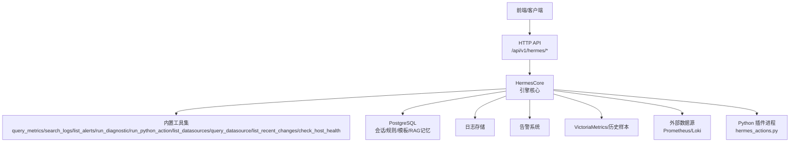
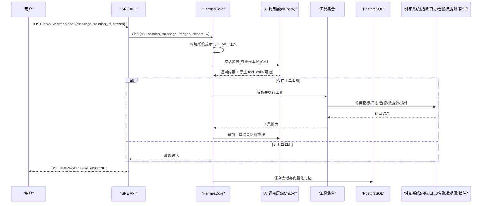
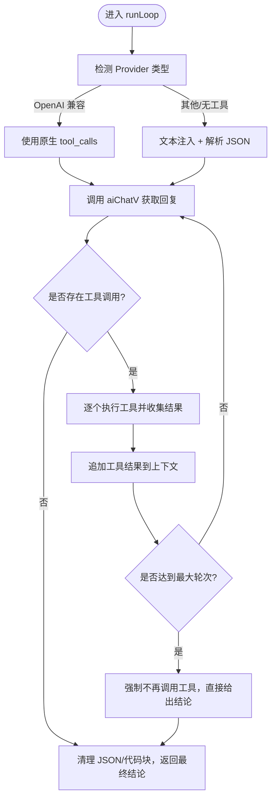
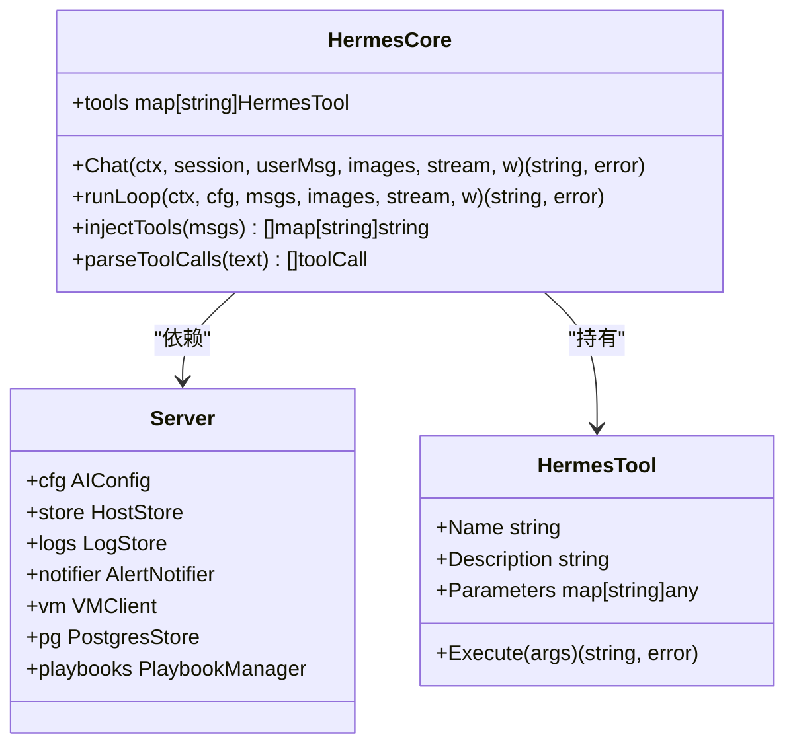

# 对话助手功能

<cite>
**本文引用的文件**
- [hermes.go](file://cmd/server/hermes.go)
- [hermes_suggest.go](file://cmd/server/hermes_suggest.go)
- [sre_api.go](file://cmd/server/sre_api.go)
- [aiops.go](file://cmd/server/aiops.go)
- [config.go](file://cmd/server/config.go)
- [hermes_actions.py](file://plugins/hermes_actions.py)
</cite>

## 目录
1. [简介](#简介)
2. [项目结构](#项目结构)
3. [核心组件](#核心组件)
4. [架构总览](#架构总览)
5. [详细组件分析](#详细组件分析)
6. [依赖关系分析](#依赖关系分析)
7. [性能与容量规划](#性能与容量规划)
8. [故障排查指南](#故障排查指南)
9. [结论](#结论)
10. [附录：API 参考与最佳实践](#附录api-参考与最佳实践)

## 简介
本章节面向 AIOps Monitor 的“对话助手”能力，聚焦自然语言查询接口、Function Calling 机制、内置工具清单、会话管理与安全特性，并提供集成示例与最佳实践。该功能以“观察→推理→行动”循环为核心，通过 Function Calling 将 LLM 与系统内指标、日志、告警、诊断命令、外部数据源及 Python 插件动作打通，形成可自主排障的智能运维 Agent。

## 项目结构
对话助手相关代码主要分布在服务端模块中：
- 引擎与工具注册：hermes.go
- 建议 Prompt 生成：hermes_suggest.go
- HTTP API 路由与 SSE 流式响应：sre_api.go
- AI 调用封装（OpenAI 兼容）：aiops.go
- 配置项定义（含 AI 开关、模型、嵌入等）：config.go
- 自定义动作插件（Python）：plugins/hermes_actions.py

图表来源
- [hermes.go:31-60](file://cmd/server/hermes.go#L31-L60)
- [sre_api.go:2062-2155](file://cmd/server/sre_api.go#L2062-L2155)
- [aiops.go:179-360](file://cmd/server/aiops.go#L179-L360)

章节来源
- [hermes.go:1-1382](file://cmd/server/hermes.go#L1-L1382)
- [hermes_suggest.go:1-74](file://cmd/server/hermes_suggest.go#L1-L74)
- [sre_api.go:2062-2352](file://cmd/server/sre_api.go#L2062-L2352)
- [aiops.go:1-360](file://cmd/server/aiops.go#L1-L360)
- [config.go:428-444](file://cmd/server/config.go#L428-L444)
- [hermes_actions.py:1-171](file://plugins/hermes_actions.py#L1-L171)

## 核心组件
- HermesTool：工具描述与执行函数绑定，包含名称、描述、参数 Schema 与 Execute 回调。
- HermesSession：单轮或多轮对话会话，承载消息历史与关联事件 ID。
- HermesCore：引擎核心，负责系统提示词构建、RAG 注入、Function Calling 调度、工具执行、结果回灌与收敛控制。
- AI 调用层：aiChatV/streamChat 等封装，支持 OpenAI 兼容原生 tool_calls 或文本解析回退。
- 插件动作：通过子进程调用 Python 脚本实现扩展动作。

章节来源
- [hermes.go:31-60](file://cmd/server/hermes.go#L31-L60)
- [hermes.go:62-67](file://cmd/server/hermes.go#L62-L67)
- [hermes.go:787-868](file://cmd/server/hermes.go#L787-L868)
- [aiops.go:179-360](file://cmd/server/aiops.go#L179-L360)

## 架构总览
对话助手采用三层解耦设计：
- 引擎层（hermes.go）：观察→推理→行动循环 + Function Calling
- 持久化与热加载（PG）：规则库 + 提示模板 + 会话 + RAG 记忆
- 插件层（Python）：动态扩展动作，上传即生效

图表来源
- [sre_api.go:2062-2155](file://cmd/server/sre_api.go#L2062-L2155)
- [hermes.go:787-1018](file://cmd/server/hermes.go#L787-L1018)
- [aiops.go:195-360](file://cmd/server/aiops.go#L195-L360)

## 详细组件分析

### 自然语言查询接口与交互模式
- 入口 API：POST /api/v1/hermes/chat
- 请求体字段：
  - message：自然语言问题
  - session_id：会话 ID（用于多轮记忆恢复）
  - incident_id：关联事件 ID（可选）
  - history：前端兜底历史（当 PG 不可用时使用）
  - images：图片数组（base64，最多 4 张）
  - files：文本文件内容（自动注入上下文，限制长度）
  - stream：是否启用 SSE 流式
- 响应模式：
  - 统一走 SSE，delta 帧推送思考文字，tool 帧推送工具状态，最后 session_id 与 [DONE] 结束。
- 多轮对话管理：
  - resolveSession 优先从 PG 加载完整历史；若失败则用前端 history 兜底。
  - 每轮结束后持久化到 PG，并向量化沉淀为 RAG 记忆，跨会话复用知识。
  - 历史轮次上限与摘要策略：超过最大轮数时旧轮次被摘要压缩，避免上下文爆炸。

章节来源
- [sre_api.go:2062-2155](file://cmd/server/sre_api.go#L2062-L2155)
- [hermes.go:1331-1365](file://cmd/server/hermes.go#L1331-L1365)
- [hermes.go:820-868](file://cmd/server/hermes.go#L820-L868)

### Function Calling 机制实现原理
- 工具注册：registerTools 集中注册所有内置工具，每个工具包含 Name、Description、Parameters 与 Execute。
- 工具定义缓存：首次构建后缓存 JSON 与原生 Function Calling 格式，避免每轮重建。
- Provider 适配：
  - OpenAI 兼容 Provider：使用原生 tool_calls，更可靠。
  - Anthropic 或其他：回退到文本注入，LLM 按约定输出 JSON 块，由 parseToolCalls 解析。
- 执行调度：runLoop 维护最多 5 轮工具调用，逐条执行工具并将结果回灌至上下文，直至收敛或达到上限。
- 思维链展示：将模型的“思考文字”作为 delta 下发，工具执行状态以独立 tool 帧下发，不暴露内部 JSON。

图表来源
- [hermes.go:870-1018](file://cmd/server/hermes.go#L870-L1018)
- [hermes.go:1026-1068](file://cmd/server/hermes.go#L1026-L1068)
- [hermes.go:1070-1128](file://cmd/server/hermes.go#L1070-L1128)
- [aiops.go:195-360](file://cmd/server/aiops.go#L195-L360)

章节来源
- [hermes.go:70-196](file://cmd/server/hermes.go#L70-L196)
- [hermes.go:1026-1068](file://cmd/server/hermes.go#L1026-L1068)
- [hermes.go:1070-1128](file://cmd/server/hermes.go#L1070-L1128)
- [aiops.go:195-360](file://cmd/server/aiops.go#L195-L360)

### 内置工具清单与功能说明
- query_metrics：查询主机实时性能指标（CPU/内存/磁盘/负载/网络/IO/all），需 host_id。
- search_logs：搜索主机日志，支持级别与关键词过滤，最近 N 分钟。
- list_alerts：获取当前活跃告警列表，可按主机筛选。
- search_similar_cases：在历史案例库中进行向量检索，返回相似诊断案例与记忆。
- run_diagnostic：登录目标主机执行只读诊断命令（白名单 + 敏感路径黑名单），需开启“AI 终端巡检”权限。
- run_python_action：执行 Python 插件中的自定义动作（写操作需显式开启自动执行）。
- list_datasources：列出已接入的外部数据源（Loki/Prometheus）。
- query_datasource：直接查询外部数据源（PromQL/LogQL）。
- list_recent_changes：计算主机近期指标趋势（上升/下降/稳定）。
- check_host_health：综合评估主机健康状态（healthy/degraded/critical）。

章节来源
- [hermes.go:70-196](file://cmd/server/hermes.go#L70-L196)
- [hermes.go:252-783](file://cmd/server/hermes.go#L252-L783)

### 会话管理机制与安全特性
- 会话持久化：每次对话结束后将消息序列保存到 PG，刷新页面或切换会话后可恢复。
- 历史裁剪与摘要：超过最大轮次时旧轮次被摘要压缩，保留关键信息。
- RAG 记忆：每轮对话与上传文件内容异步向量化入库，后续对话可检索复用。
- 权限控制：
  - run_diagnostic 需要显式开启“AI 终端巡检”，且仅允许只读命令与管道过滤，严格白名单与敏感路径黑名单。
  - run_python_action 属于高风险写操作，默认阻止自动执行，需在设置中开启“自动执行”。
- 上下文保持：系统提示词注入当前纳管主机清单，帮助 AI 将用户提到的主机名/IP 映射到 host_id。

章节来源
- [hermes.go:1227-1329](file://cmd/server/hermes.go#L1227-L1329)
- [hermes.go:498-549](file://cmd/server/hermes.go#L498-L549)
- [hermes.go:551-581](file://cmd/server/hermes.go#L551-L581)
- [hermes.go:820-868](file://cmd/server/hermes.go#L820-L868)

### 快捷建议与动态推荐
- handleHermesSuggestions 根据当前状态（在线主机、活跃告警、错误日志）生成动态建议，并附带精选能力示例，供前端空态展示与一键提问。

章节来源
- [hermes_suggest.go:1-74](file://cmd/server/hermes_suggest.go#L1-L74)

### Python 插件动作扩展
- 插件脚本 hermes_actions.py 提供可被调用的动作函数，如重启服务、清理缓存、Kubernetes Pod 扩缩容、检查服务状态等。
- 引擎通过子进程调用脚本，传入 action_name、host_id、args_json，读取 stdout 作为结果。
- 动作应快速返回，异常会被捕获并返回给 LLM。

章节来源
- [hermes_actions.py:1-171](file://plugins/hermes_actions.py#L1-L171)
- [hermes.go:551-581](file://cmd/server/hermes.go#L551-L581)

## 依赖关系分析
- 引擎与外部系统耦合点：
  - 指标与历史样本：VM 或本地 store
  - 日志：logStore
  - 告警：notifier
  - 外部数据源：Prometheus/Loki
  - 向量检索与记忆：PostgreSQL（pgvector）
  - 插件动作：Python 子进程
- 工具定义与 Provider 适配：
  - OpenAI 兼容 Provider 使用原生 tool_calls
  - 其他 Provider 回退到文本注入与 JSON 解析

图表来源
- [hermes.go:31-60](file://cmd/server/hermes.go#L31-L60)
- [hermes.go:47-60](file://cmd/server/hermes.go#L47-L60)

章节来源
- [hermes.go:31-60](file://cmd/server/hermes.go#L31-L60)
- [hermes.go:47-60](file://cmd/server/hermes.go#L47-L60)

## 性能与容量规划
- Token 预算管理：
  - 系统提示词与 RAG 记忆总 token 预算约 8000，超出时截断 RAG 文本，确保最低 500 token 留给 RAG。
  - estimateTokens 对中英文混合文本进行近似估算，避免上下文过大。
- 历史轮次限制：
  - 最大保留 20 轮，超出的旧轮次以摘要形式注入，减少上下文膨胀。
- 工具结果截断：
  - 工具结果过长时截断为 4000 字符，避免污染上下文。
- 并发与超时：
  - 插件动作执行设置 30 秒超时，防止阻塞 goroutine。
  - 诊断命令执行设置 15 秒超时，避免长时间占用资源。
- SSE 流式优化：
  - 立即 Flush 响应头，使前端能显示“思考中”动画，RAG 检索不阻塞首屏。

章节来源
- [hermes.go:801-818](file://cmd/server/hermes.go#L801-L818)
- [hermes.go:820-840](file://cmd/server/hermes.go#L820-L840)
- [hermes.go:990-996](file://cmd/server/hermes.go#L990-L996)
- [hermes.go:569-581](file://cmd/server/hermes.go#L569-L581)
- [hermes.go:519-549](file://cmd/server/hermes.go#L519-L549)
- [sre_api.go:2132-2137](file://cmd/server/sre_api.go#L2132-L2137)

## 故障排查指南
- AI 未启用或未配置：
  - 现象：SSE 返回 error 帧并 [DONE]。
  - 处理：在「AI 设置」填写 Endpoint、Key、模型并勾选启用。
- 工具不存在或执行失败：
  - 现象：tool 帧 state=err，或工具结果包含错误信息。
  - 处理：检查工具注册与参数校验，查看日志与插件输出。
- 诊断命令被拒绝：
  - 现象：返回“含被禁止字符”或“非白名单命令”。
  - 处理：仅使用只读命令与管道过滤，避免敏感路径。
- 插件动作被阻止：
  - 现象：返回“需人工确认”或“未开启自动执行”。
  - 处理：在「AI 设置」开启“自动执行”后再试。
- 会话无法恢复：
  - 现象：刷新后对话丢失。
  - 处理：检查 PostgreSQL 连接与会话表，必要时使用前端 history 兜底。

章节来源
- [sre_api.go:2092-2098](file://cmd/server/sre_api.go#L2092-L2098)
- [hermes.go:962-996](file://cmd/server/hermes.go#L962-L996)
- [hermes.go:453-496](file://cmd/server/hermes.go#L453-L496)
- [hermes.go:558-563](file://cmd/server/hermes.go#L558-L563)
- [hermes.go:1331-1365](file://cmd/server/hermes.go#L1331-L1365)

## 结论
对话助手通过 Function Calling 将 LLM 与 AIOps 监控体系深度整合，形成可自主排障的智能运维 Agent。其具备完善的工具生态、严格的权限控制、高效的上下文管理与可扩展的插件机制，适合在生产环境中用于日常巡检、根因分析与处置建议。

## 附录：API 参考与最佳实践

### API 参考
- POST /api/v1/hermes/chat
  - 请求体：message、session_id、incident_id、history、images、files、stream
  - 响应：SSE（delta/tool/session_id/[DONE]）
- GET /api/v1/hermes/sessions
  - 返回最近会话列表
- GET /api/v1/hermes/sessions/{id}
  - 返回指定会话的消息历史
- POST /api/v1/hermes/sessions/{id}/undo
  - 撤销最后一轮问答
- GET /api/v1/hermes/rules
  - 返回规则列表
- POST /api/v1/hermes/rules
  - 新增或更新规则
- DELETE /api/v1/hermes/rules/{id}
  - 删除规则
- GET /api/v1/hermes/templates
  - 返回模板列表
- POST /api/v1/hermes/templates
  - 新增或更新模板
- DELETE /api/v1/hermes/templates/{id}
  - 删除模板

章节来源
- [sre_api.go:2062-2352](file://cmd/server/sre_api.go#L2062-L2352)

### 最佳实践
- 错误处理：
  - 始终监听 SSE error 帧，友好提示用户重试或检查配置。
  - 对工具执行失败进行二次推理，引导用户提供更多信息。
- 性能优化：
  - 合理设置 max_tokens 与历史轮次上限，避免上下文过大。
  - 使用流式响应提升用户体验，避免长轮询阻塞。
- 安全配置：
  - 谨慎开启“自动执行”，仅在受控环境使用。
  - 严格遵循只读诊断命令白名单，避免敏感路径访问。
  - 定期审查插件动作，确保最小权限原则。

章节来源
- [config.go:428-444](file://cmd/server/config.go#L428-L444)
- [hermes.go:453-496](file://cmd/server/hermes.go#L453-L496)
- [hermes.go:558-563](file://cmd/server/hermes.go#L558-L563)