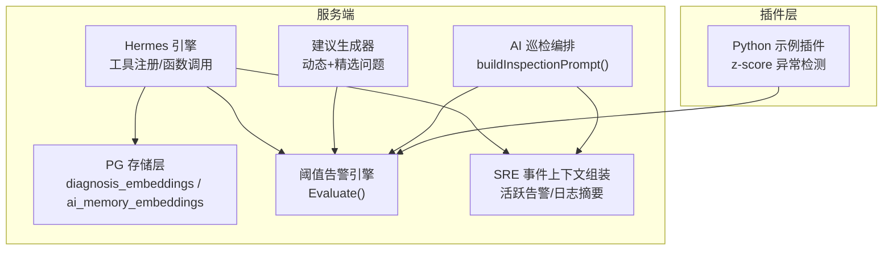
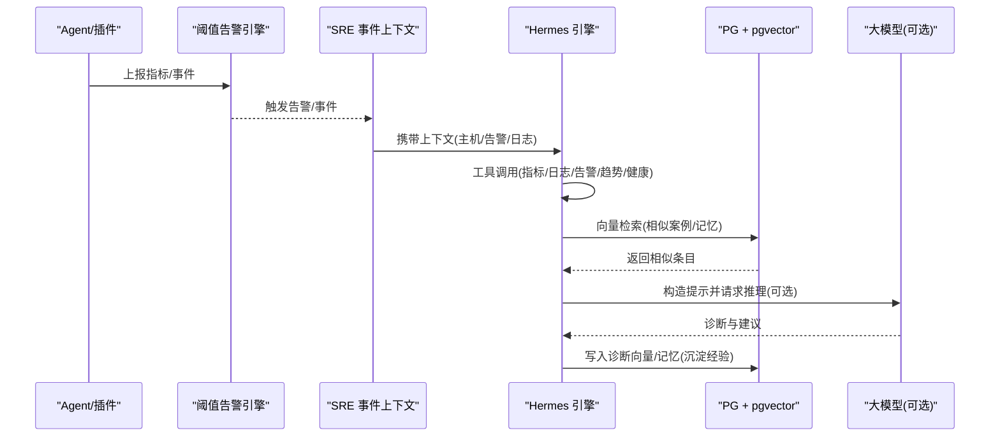
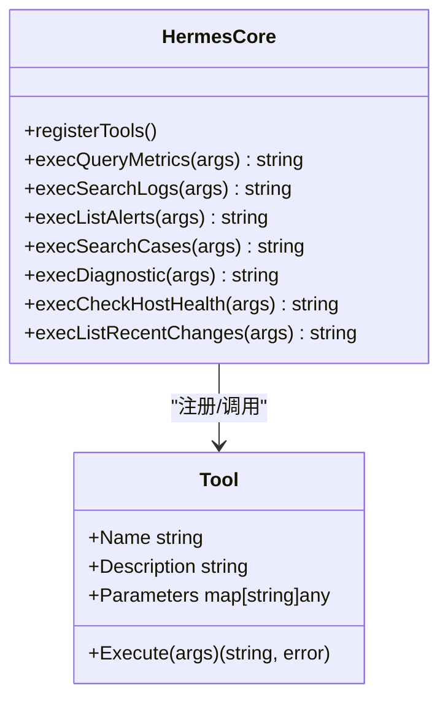
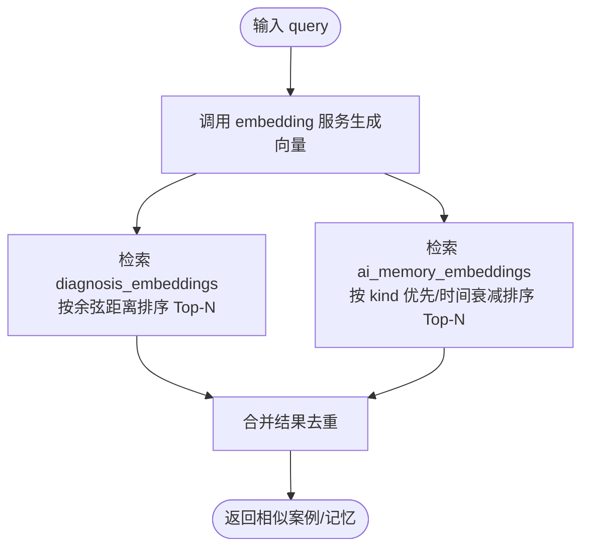
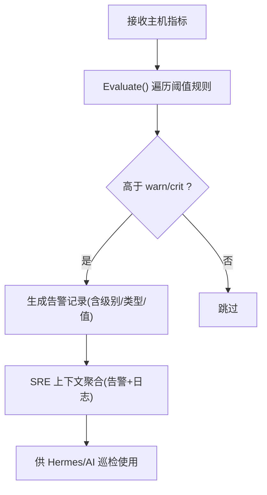
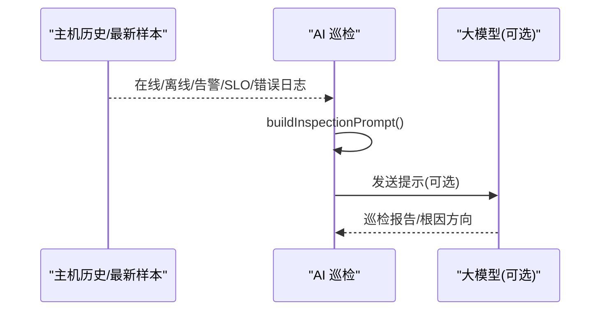
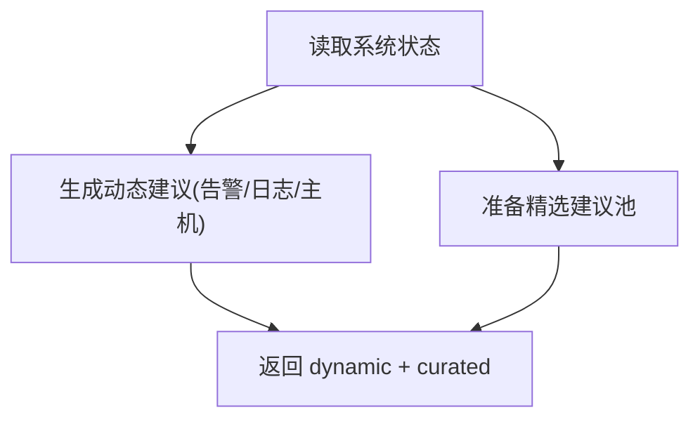
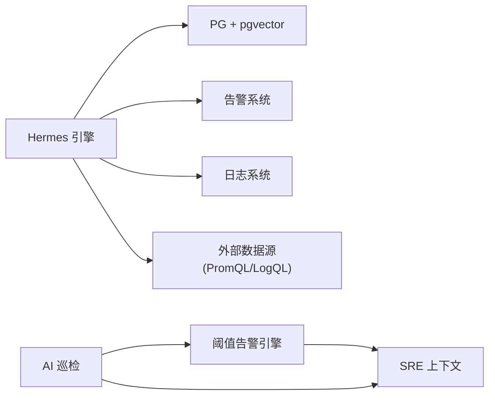

# 根因分析功能

<cite>
**本文引用的文件**   
- [README.md](file://README.md)
- [hermes.go](file://cmd/server/hermes.go)
- [hermes_suggest.go](file://cmd/server/hermes_suggest.go)
- [pgstore.go](file://cmd/server/pgstore.go)
- [alerts.go](file://cmd/server/alerts.go)
- [aiops.go](file://cmd/server/aiops.go)
- [sre_api.go](file://cmd/server/sre_api.go)
- [example_ai_anomaly.py](file://plugins/example_ai_anomaly.py)
</cite>

## 目录
1. [简介](#简介)
2. [项目结构](#项目结构)
3. [核心组件](#核心组件)
4. [架构总览](#架构总览)
5. [详细组件分析](#详细组件分析)
6. [依赖关系分析](#依赖关系分析)
7. [性能与可扩展性](#性能与可扩展性)
8. [故障排查指南](#故障排查指南)
9. [结论](#结论)
10. [附录：配置与最佳实践](#附录配置与最佳实践)

## 简介
本章节面向 AIOps Monitor 的“根因分析”能力，系统性阐述多维度数据分析、异常检测、相似案例检索（RAG）、智能建议生成等关键机制。文档聚焦于以下目标：
- 指标关联挖掘、日志模式识别、告警相关性分析的实现思路与落地方式
- 根因定位的时间序列分析、异常检测算法、影响范围评估
- 相似案例检索的向量嵌入、相似度计算、历史经验复用
- 智能建议生成的诊断思路推荐、修复方案建议、预防措施制定
- 根因分析的配置示例、模型参数调优、知识库维护与分析效果评估的最佳实践

## 项目结构
根因分析相关代码主要位于服务端模块中，围绕“自主运维 Agent（Hermes）”、“存储与 RAG（PostgreSQL + pgvector）”、“阈值告警与事件聚合”、“AI 巡检与提示构建”四大方向组织。

图示来源
- [hermes.go:1-196](file://cmd/server/hermes.go#L1-L196)
- [hermes_suggest.go:1-74](file://cmd/server/hermes_suggest.go#L1-L74)
- [pgstore.go:128-212](file://cmd/server/pgstore.go#L128-L212)
- [alerts.go:165-372](file://cmd/server/alerts.go#L165-L372)
- [aiops.go:647-776](file://cmd/server/aiops.go#L647-L776)
- [sre_api.go:1482-1507](file://cmd/server/sre_api.go#L1482-L1507)
- [example_ai_anomaly.py:1-70](file://plugins/example_ai_anomaly.py#L1-L70)

章节来源
- [README.md:775-795](file://README.md#L775-L795)
- [hermes.go:1-196](file://cmd/server/hermes.go#L1-L196)
- [pgstore.go:128-212](file://cmd/server/pgstore.go#L128-L212)
- [alerts.go:165-372](file://cmd/server/alerts.go#L165-L372)
- [aiops.go:647-776](file://cmd/server/aiops.go#L647-L776)
- [sre_api.go:1482-1507](file://cmd/server/sre_api.go#L1482-L1507)
- [example_ai_anomaly.py:1-70](file://plugins/example_ai_anomaly.py#L1-L70)

## 核心组件
- Hermes 自主运维引擎
  - 提供 Function Calling 工具集：查询指标、搜索日志、列出告警、相似案例检索、只读诊断命令执行、外部数据源查询、主机健康检查、近期趋势变化等
  - 通过规则库与提示模板热加载，结合现有基础设施（LLM、PG、Playbook、日志、告警）完成观察→推理→行动循环
- PostgreSQL + pgvector 存储层
  - diagnosis_embeddings：诊断向量记忆，用于相似案例检索
  - ai_memory_embeddings：通用 AI 记忆库，支持对话/文件/URL/历史等多模态知识沉淀与衰减策略
- 阈值告警引擎
  - 基于配置的 warn/crit 阈值对 CPU/内存/磁盘/IO/IOPS/进程数/连接数等进行分级告警
- AI 巡检与提示构建
  - 将在线/离线主机、触发告警、SLO 突破、资源高位、错误日志等汇总为结构化提示，驱动 LLM 进行健康巡检与根因研判
- 智能建议生成
  - 根据当前系统状态（主机在线情况、活跃告警、错误日志）动态生成快捷问题，并配合精选示例覆盖各能力面

章节来源
- [hermes.go:30-196](file://cmd/server/hermes.go#L30-L196)
- [pgstore.go:128-212](file://cmd/server/pgstore.go#L128-L212)
- [alerts.go:165-372](file://cmd/server/alerts.go#L165-L372)
- [aiops.go:647-776](file://cmd/server/aiops.go#L647-L776)
- [hermes_suggest.go:1-74](file://cmd/server/hermes_suggest.go#L1-L74)

## 架构总览
根因分析的整体流程如下：采集与告警产生事件 → 事件进入 SRE 中枢并聚合上下文 → Hermes 引擎调用工具收集证据 → 使用 RAG 检索相似案例 → 结合 LLM 生成诊断与建议 → 结果持久化到向量库形成可复用经验。

图示来源
- [alerts.go:165-372](file://cmd/server/alerts.go#L165-L372)
- [sre_api.go:1482-1507](file://cmd/server/sre_api.go#L1482-L1507)
- [hermes.go:394-445](file://cmd/server/hermes.go#L394-L445)
- [pgstore.go:554-591](file://cmd/server/pgstore.go#L554-L591)
- [aiops.go:647-776](file://cmd/server/aiops.go#L647-L776)

## 详细组件分析

### 组件一：Hermes 自主运维引擎（Function Calling 与工具链）
- 工具注册与执行
  - 内置工具包括：query_metrics、search_logs、list_alerts、search_similar_cases、run_diagnostic、run_python_action、list_datasources、query_datasource、list_recent_changes、check_host_health
  - 工具参数严格定义，执行路径包含安全校验（如只读诊断命令白名单与敏感路径黑名单）
- 主机与健康评估
  - resolveHostRef 支持按 host_id/主机名/IP 模糊匹配
  - check_host_health 综合指标、告警、日志评分输出 healthy/degraded/critical
- 相似案例检索（RAG）
  - search_similar_cases 先向量化 query，再在 diagnosis_embeddings 与 ai_memory_embeddings 中检索 Top-N
- 外部数据源集成
  - list_datasources/query_datasource 支持 Prometheus/Loki 查询，便于跨系统取证

图示来源
- [hermes.go:30-196](file://cmd/server/hermes.go#L30-L196)
- [hermes.go:252-581](file://cmd/server/hermes.go#L252-L581)
- [hermes.go:594-783](file://cmd/server/hermes.go#L594-L783)

章节来源
- [hermes.go:30-196](file://cmd/server/hermes.go#L30-L196)
- [hermes.go:252-581](file://cmd/server/hermes.go#L252-L581)
- [hermes.go:594-783](file://cmd/server/hermes.go#L594-L783)

### 组件二：RAG 相似案例检索（向量嵌入与相似度计算）
- 向量表设计
  - diagnosis_embeddings：incident_id、embedding(vector)、summary、severity、tags、feedback
  - ai_memory_embeddings：kind/source/content/embedding/priority/时间戳/命中时间
- 相似度检索
  - 使用余弦距离 <=> 排序，Top-N 召回；支持按 kind 优先检索与时间衰减加权
- 记忆生命周期管理
  - 重复检测（相似度阈值合并）、命中更新 last_hit_at、旧记忆优先级衰减、过期清理

图示来源
- [pgstore.go:554-591](file://cmd/server/pgstore.go#L554-L591)
- [pgstore.go:612-723](file://cmd/server/pgstore.go#L612-L723)
- [pgstore.go:725-800](file://cmd/server/pgstore.go#L725-L800)
- [hermes.go:394-445](file://cmd/server/hermes.go#L394-L445)

章节来源
- [pgstore.go:554-591](file://cmd/server/pgstore.go#L554-L591)
- [pgstore.go:612-723](file://cmd/server/pgstore.go#L612-L723)
- [pgstore.go:725-800](file://cmd/server/pgstore.go#L725-L800)
- [hermes.go:394-445](file://cmd/server/hermes.go#L394-L445)

### 组件三：阈值告警与事件聚合（多维指标与相关性）
- 指标维度
  - CPU/内存/磁盘/IO/IOPS/负载/进程数/连接数/API 监控/任务/转发等
- 判定逻辑
  - classify/classifyLow 统一高低阈值判定；process 数量相对基线变化检测；连接数多协议求和兼容旧字段
- 事件聚合
  - SRE 上下文组装时拉取活跃告警与近段时间错误日志，作为根因分析的输入上下文

图示来源
- [alerts.go:165-372](file://cmd/server/alerts.go#L165-L372)
- [sre_api.go:1482-1507](file://cmd/server/sre_api.go#L1482-L1507)

章节来源
- [alerts.go:165-372](file://cmd/server/alerts.go#L165-L372)
- [sre_api.go:1482-1507](file://cmd/server/sre_api.go#L1482-L1507)

### 组件四：AI 巡检与提示构建（时间序列与异常检测）
- 巡检上下文
  - 在线/离线主机、触发告警、SLO 未达标、资源高位、近期错误日志
- 提示构建
  - buildInspectionPrompt 将上述信息渲染为文本，驱动 LLM 进行健康巡检与根因研判
- 插件侧轻量异常检测
  - example_ai_anomaly.py 使用滚动窗口均值/标准差与 z-score 判定 CPU 异常，产出事件与指标，可作为启发式兜底或扩展点

图示来源
- [aiops.go:647-776](file://cmd/server/aiops.go#L647-L776)
- [example_ai_anomaly.py:1-70](file://plugins/example_ai_anomaly.py#L1-L70)

章节来源
- [aiops.go:647-776](file://cmd/server/aiops.go#L647-L776)
- [example_ai_anomaly.py:1-70](file://plugins/example_ai_anomaly.py#L1-L70)

### 组件五：智能建议生成（动态+精选）
- 动态建议
  - 基于当前纳管主机在线情况、活跃告警数量、错误日志数量生成即时建议
- 精选建议
  - 覆盖主机/指标/日志/告警/诊断/巡检等能力的常用问题，前端随机抽取展示并可换一批

图示来源
- [hermes_suggest.go:1-74](file://cmd/server/hermes_suggest.go#L1-L74)

章节来源
- [hermes_suggest.go:1-74](file://cmd/server/hermes_suggest.go#L1-L74)

## 依赖关系分析
- Hermes 引擎依赖
  - 存储层：PG（diagnosis_embeddings、ai_memory_embeddings）
  - 告警系统：ActiveAlerts()
  - 日志系统：logs.search/recentErrors
  - 外部数据源：Prometheus/Loki
- 存储层依赖
  - pgvector 扩展、索引优化（余弦距离排序）
- 告警引擎依赖
  - 阈值配置、主机历史样本（用于进程数基线对比）
- AI 巡检依赖
  - 告警、SLO、日志、主机历史/最新样本

图示来源
- [hermes.go:30-196](file://cmd/server/hermes.go#L30-L196)
- [pgstore.go:128-212](file://cmd/server/pgstore.go#L128-L212)
- [alerts.go:165-372](file://cmd/server/alerts.go#L165-L372)
- [aiops.go:647-776](file://cmd/server/aiops.go#L647-L776)

章节来源
- [hermes.go:30-196](file://cmd/server/hermes.go#L30-L196)
- [pgstore.go:128-212](file://cmd/server/pgstore.go#L128-L212)
- [alerts.go:165-372](file://cmd/server/alerts.go#L165-L372)
- [aiops.go:647-776](file://cmd/server/aiops.go#L647-L776)

## 性能与可扩展性
- 向量检索
  - 使用 pgvector 的余弦距离排序，建议为 embedding 列建立索引以提升 Top-N 检索性能
  - 记忆检索引入时间衰减与优先级权重，避免陈旧知识干扰
- 告警评估
  - Evaluate() 对主机集合进行线性扫描，适合中小规模；大规模场景可考虑分片/增量评估
- 插件扩展
  - Python 插件可替换为更复杂的异常检测模型（Prophet/statsmodels/sklearn），并通过事件/指标接入系统

[本节为通用指导，不直接分析具体文件]

## 故障排查指南
- RAG 不可用
  - 现象：相似案例检索返回“RAG 向量存储不可用”或“AI 未启用”
  - 排查要点：确认 PostgreSQL 已启用 vector 扩展、diagnosis_embeddings/ai_memory_embeddings 表存在、AI 配置已开启且 API Key 有效
- 向量维度不一致
  - 现象：写入失败或检索异常
  - 排查要点：ai.embed_dimensions 必须与数据库 vector(N) 列维度一致；可使用“测试向量化配置”接口验证端点/密钥/模型并回显实际维度
- 只读诊断命令被拦截
  - 现象：执行诊断命令返回“非白名单命令/含敏感路径”
  - 排查要点：仅允许白名单命令与管道过滤；禁止访问敏感路径（如 /etc/shadow、.ssh 等）
- 告警风暴
  - 现象：大量衍生告警刷屏
  - 排查要点：利用静默/抑制/路由策略收敛噪音；关注主因告警（如主机离线）抑制衍生告警

章节来源
- [hermes.go:394-445](file://cmd/server/hermes.go#L394-L445)
- [hermes.go:447-549](file://cmd/server/hermes.go#L447-L549)
- [README.md:775-795](file://README.md#L775-L795)

## 结论
AIOps Monitor 的根因分析以“阈值告警+SRE 上下文+Hermes 工具链+RAG 记忆库”为核心，形成从数据采集、异常发现、证据收集、相似案例检索到智能建议生成的闭环。通过可插拔的 Python 插件与解耦的 embedding 模型，系统既具备即开即用的启发式能力，也支持在生产环境按需引入更复杂的机器学习与本地模型栈。

[本节为总结性内容，不直接分析具体文件]

## 附录：配置与最佳实践

### 向量化模型（RAG）配置
- 字段说明
  - ai.embed_endpoint：向量化端点，留空时回退复用主对话模型 Endpoint
  - ai.embed_api_key：向量化 API Key，留空时回退复用主 API Key
  - ai.embed_model：向量化模型名（如 text-embedding-3-small、text-embedding-v2、bge-large-zh）
  - ai.embed_dimensions：目标向量维度，必须与 PostgreSQL vector(N) 列维度一致
- 连通性自检
  - 使用“测试向量化配置”接口（POST /api/v1/ai/test-embed）校验端点/密钥/模型，并回显实际维度

章节来源
- [README.md:775-795](file://README.md#L775-L795)

### 模型参数调优
- 向量维度
  - 确保 embed_dimensions 与数据库列维度一致，避免写入失败
- 相似度阈值
  - 重复检测阈值默认 0.12（相似度 > 88%），可按业务语义等价程度调整
- 记忆衰减与清理
  - 90 天未命中记忆降低优先级；365 天且低优先级记忆可清理释放空间

章节来源
- [pgstore.go:725-800](file://cmd/server/pgstore.go#L725-L800)

### 知识库维护
- 诊断向量记忆
  - 每次诊断后写入 diagnosis_embeddings，附带 summary/severity/tags/feedback，持续积累
- 通用 AI 记忆
  - 对话/文件/URL/历史沉淀至 ai_memory_embeddings，支持按 kind 优先检索与时间衰减

章节来源
- [pgstore.go:554-591](file://cmd/server/pgstore.go#L554-L591)
- [pgstore.go:612-723](file://cmd/server/pgstore.go#L612-L723)

### 分析效果评估
- 指标建议
  - 相似案例命中率、平均距离、反馈标记分布（helpful/unhelpful）
  - 巡检报告质量（人工抽检）、建议采纳率
- 过程建议
  - 定期回顾高价值记忆，合并重复条目，提升检索精度

[本节为通用指导，不直接分析具体文件]