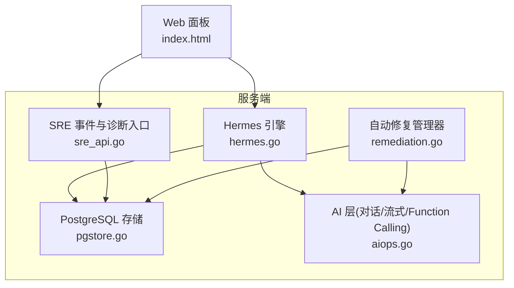
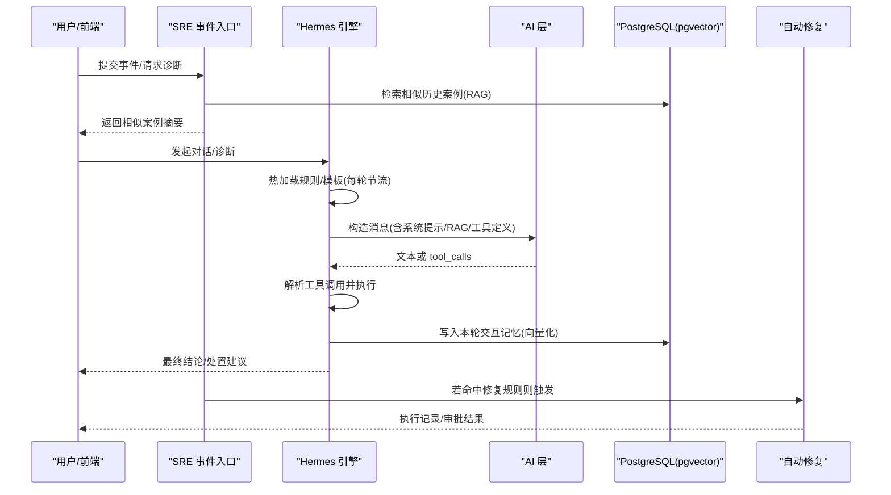
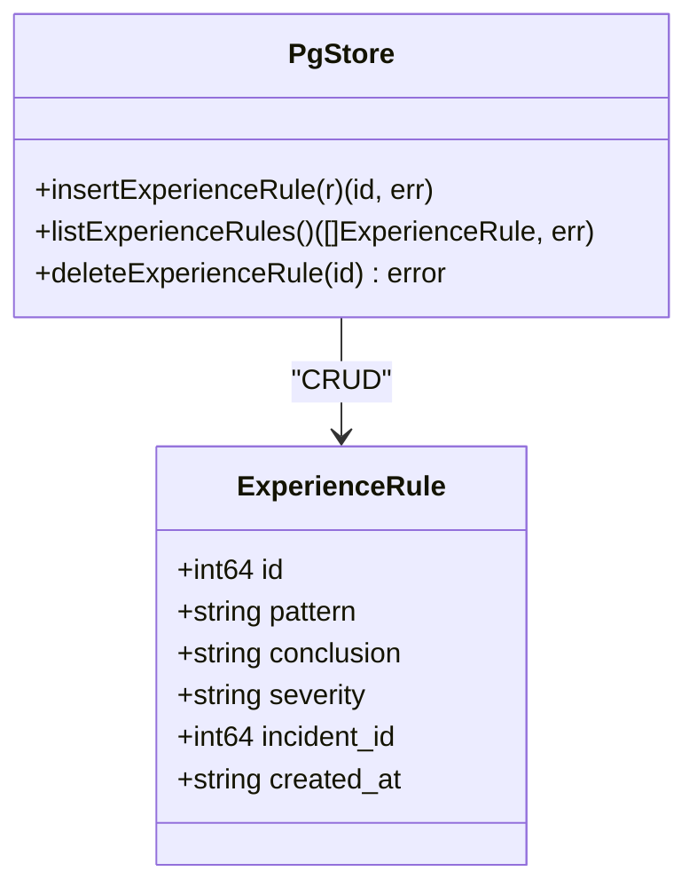
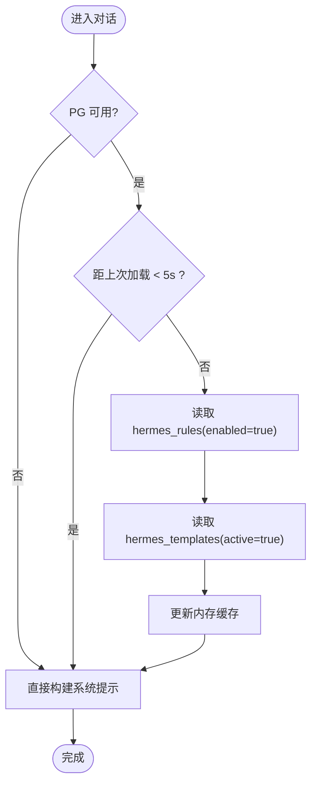
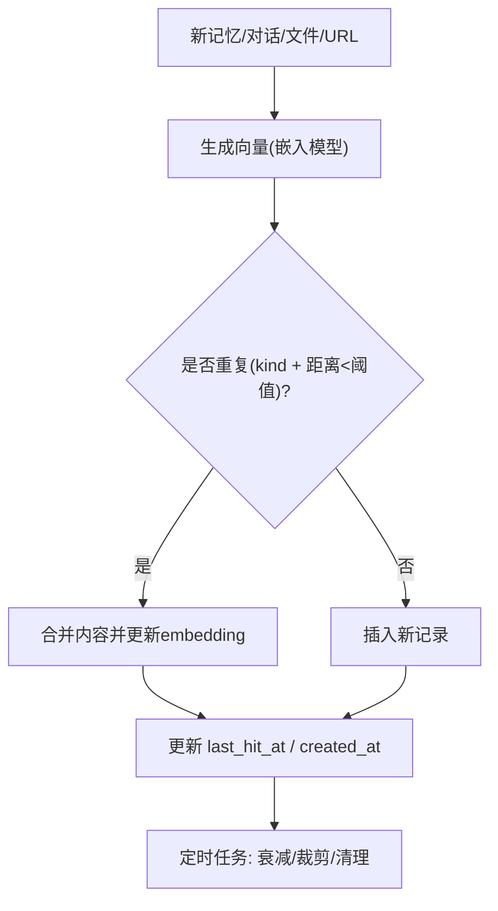
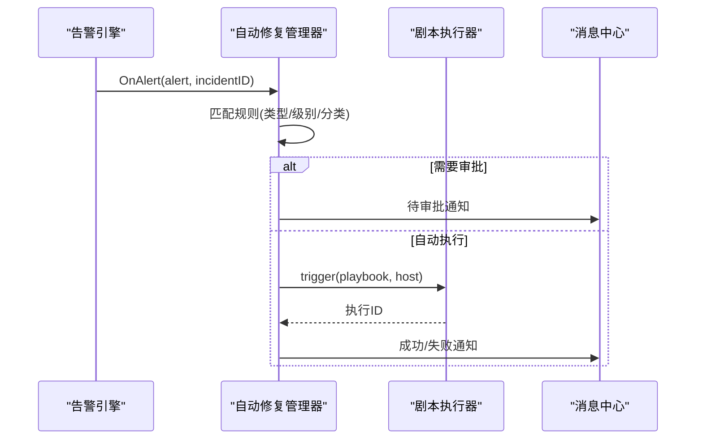
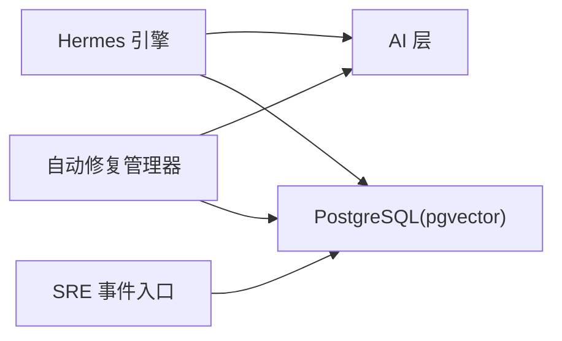

# 经验规则库

<cite>
**本文引用的文件列表**   
- [pgstore.go](file://cmd/server/pgstore.go)
- [hermes.go](file://cmd/server/hermes.go)
- [aiops.go](file://cmd/server/aiops.go)
- [remediation.go](file://cmd/server/remediation.go)
- [sre_api.go](file://cmd/server/sre_api.go)
- [index.html](file://cmd/server/web/index.html)
- [README.md](file://README.md)
</cite>

## 目录
1. [引言](#引言)
2. [项目结构](#项目结构)
3. [核心组件](#核心组件)
4. [架构总览](#架构总览)
5. [详细组件分析](#详细组件分析)
6. [依赖关系分析](#依赖关系分析)
7. [性能与可扩展性](#性能与可扩展性)
8. [故障排查指南](#故障排查指南)
9. [结论](#结论)
10. [附录：维护指南与最佳实践](#附录维护指南与最佳实践)

## 引言
本文件面向 AIOps Monitor 的“经验规则库”能力，系统性说明以下方面：
- 规则定义与管理机制（诊断规则、模板配置、版本控制）
- 向量数据库使用方式（知识条目索引、相似度检索、动态更新）
- 规则库热加载机制（配置变更生效、缓存更新策略、服务无中断升级）
- 规则效果评估体系（准确率统计、用户反馈收集、优化建议）
- 维护指南与最佳实践（编写规范、测试验证、性能调优）

## 项目结构
经验规则库相关实现集中在服务端模块中，关键文件如下：
- 持久化与 RAG 存储：PostgreSQL + pgvector，包含经验规则表、Hermes 规则/模板/会话、诊断记忆等
- 规则引擎与提示模板：Hermes Agent 引擎负责系统提示构建、工具注入、RAG 注入与热加载
- AI 层：对话/流式/Function Calling 与向量化端点解耦配置
- 自动修复闭环：将告警与剧本联动，形成可观测的规则执行记录

图表来源
- [hermes.go:1198-1265](file://cmd/server/hermes.go#L1198-L1265)
- [pgstore.go:157-212](file://cmd/server/pgstore.go#L157-L212)
- [aiops.go:27-45](file://cmd/server/aiops.go#L27-L45)
- [remediation.go:21-36](file://cmd/server/remediation.go#L21-L36)
- [sre_api.go:1522-1551](file://cmd/server/sre_api.go#L1522-L1551)
- [index.html:551-556](file://cmd/server/web/index.html#L551-L556)

章节来源
- [hermes.go:1198-1265](file://cmd/server/hermes.go#L1198-L1265)
- [pgstore.go:157-212](file://cmd/server/pgstore.go#L157-L212)
- [aiops.go:27-45](file://cmd/server/aiops.go#L27-L45)
- [remediation.go:21-36](file://cmd/server/remediation.go#L21-L36)
- [sre_api.go:1522-1551](file://cmd/server/sre_api.go#L1522-L1551)
- [index.html:551-556](file://cmd/server/web/index.html#L551-L556)

## 核心组件
- 经验规则库（experience_rules）：用于沉淀高频问题最佳实践，支持模式、结论、严重级别、关联事件等字段。
- Hermes 规则库（hermes_rules）：诊断规则与行动策略，含优先级、启用状态、JSON 配置等。
- 提示模板库（hermes_templates）：系统提示与场景模板，支持分类、版本号、激活态。
- 诊断记忆（diagnosis_embeddings）：基于 pgvector 的历史案例向量索引，支持相似度检索与反馈标记。
- 通用 AI 记忆（ai_memory_embeddings）：对话/文件/URL/历史等多模态知识的统一向量库，支持去重、衰减、裁剪与过期清理。
- 自动修复（Remediation）：将告警匹配到修复规则并触发剧本，具备冷却、限频、审批等护栏。

章节来源
- [pgstore.go:157-212](file://cmd/server/pgstore.go#L157-L212)
- [pgstore.go:855-900](file://cmd/server/pgstore.go#L855-L900)
- [pgstore.go:901-1013](file://cmd/server/pgstore.go#L901-L1013)
- [pgstore.go:536-611](file://cmd/server/pgstore.go#L536-L611)
- [pgstore.go:612-759](file://cmd/server/pgstore.go#L612-L759)
- [remediation.go:21-36](file://cmd/server/remediation.go#L21-L36)

## 架构总览
经验规则库在系统中承担“知识+策略”的双重角色：
- 知识侧：通过向量化模型将历史案例与通用知识入库，提供相似检索以增强诊断与对话质量。
- 策略侧：Hermes 规则与模板作为系统提示的一部分，驱动 Agent 行为与动作选择；经验规则为快速定位与处置提供参考。

图表来源
- [sre_api.go:1522-1551](file://cmd/server/sre_api.go#L1522-L1551)
- [hermes.go:1198-1265](file://cmd/server/hermes.go#L1198-L1265)
- [hermes.go:800-868](file://cmd/server/hermes.go#L800-L868)
- [aiops.go:180-361](file://cmd/server/aiops.go#L180-L361)
- [pgstore.go:536-611](file://cmd/server/pgstore.go#L536-L611)
- [remediation.go:135-205](file://cmd/server/remediation.go#L135-L205)

## 详细组件分析

### 经验规则库（experience_rules）
- 数据模型：pattern/conclusion/severity/incident_id/created_at
- 操作接口：插入、列出、删除
- 使用场景：在事件诊断时作为“经验参考”，辅助快速定位与处置

图表来源
- [pgstore.go:855-900](file://cmd/server/pgstore.go#L855-L900)

章节来源
- [pgstore.go:855-900](file://cmd/server/pgstore.go#L855-L900)

### Hermes 规则库（hermes_rules）与提示模板库（hermes_templates）
- 规则：name/description/priority/enabled/config/时间戳
- 模板：name/description/content/category/version/active/时间戳
- 热加载：每轮对话前尝试从 PG 拉取，5 秒节流，仅缓存已启用规则与激活模板
- 版本控制：模板 upsert 时 version 自增，active 标志控制生效范围

图表来源
- [hermes.go:1198-1265](file://cmd/server/hermes.go#L1198-L1265)
- [pgstore.go:901-1013](file://cmd/server/pgstore.go#L901-L1013)

章节来源
- [hermes.go:1198-1265](file://cmd/server/hermes.go#L1198-L1265)
- [pgstore.go:901-1013](file://cmd/server/pgstore.go#L901-L1013)

### 向量数据库与 RAG 实现
- 诊断记忆（diagnosis_embeddings）：incident_id/embedding(vector)/summary/severity/tags/feedback
- 通用 AI 记忆（ai_memory_embeddings）：kind/source/content/embedding(created_at/last_hit_at/priority)
- 相似度检索：cosine distance 排序，Top-N 召回
- 动态更新：
  - 去重合并：按 kind 与余弦距离阈值判定重复，追加内容并更新 embedding
  - 命中追踪：批量更新 last_hit_at
  - 衰减策略：超期未命中降低 priority
  - 容量裁剪：按 kind 上限裁剪最旧且低优先级条目
  - 过期清理：超长期且低优先级条目删除

图表来源
- [pgstore.go:536-611](file://cmd/server/pgstore.go#L536-L611)
- [pgstore.go:612-759](file://cmd/server/pgstore.go#L612-L759)
- [pgstore.go:775-853](file://cmd/server/pgstore.go#L775-L853)

章节来源
- [pgstore.go:536-611](file://cmd/server/pgstore.go#L536-L611)
- [pgstore.go:612-759](file://cmd/server/pgstore.go#L612-L759)
- [pgstore.go:775-853](file://cmd/server/pgstore.go#L775-L853)

### 向量化模型配置（与对话模型解耦）
- 独立配置项：embed_endpoint/embed_api_key/embed_model/embed_dimensions
- 回退策略：留空时复用主对话 Endpoint/API Key
- 维度一致性：必须与 pgvector 列维度一致（默认 1536）
- 连通性自检：提供测试向量化配置的 API（见 README）

章节来源
- [aiops.go:27-45](file://cmd/server/aiops.go#L27-L45)
- [README.md:775-789](file://README.md#L775-L789)

### 规则库的热加载机制
- 触发时机：每次对话前尝试热加载
- 节流策略：至少 5 秒内不重复加载，避免频繁 IO
- 缓存结构：仅缓存 enabled 的规则与 active 的模板
- 安全原则：系统提示中的安全限制为硬编码，不受外部配置影响

章节来源
- [hermes.go:1198-1265](file://cmd/server/hermes.go#L1198-L1265)

### 规则效果评估体系
- 用户反馈：对相似历史案例进行 helpful/unhelpful 标记，便于后续排序与优化
- 命中率与热度：last_hit_at 与 priority 共同影响检索排名
- 准确率统计：可通过反馈比例与人工抽检结合评估
- 优化建议：
  - 提升摘要质量（更精准描述现象/根因/处置）
  - 调整嵌入模型与维度，改善相似度区分度
  - 定期清理低价值条目，保持知识库精炼

章节来源
- [pgstore.go:536-611](file://cmd/server/pgstore.go#L536-L611)
- [pgstore.go:612-759](file://cmd/server/pgstore.go#L612-L759)

### 自动修复与规则联动
- 规则匹配：按类型、级别、主机分类过滤
- 护栏机制：冷却时间、每小时限频、人工审批
- 执行记录：运行状态、原因、执行 ID、关联事件等
- 通知与审计：消息中心推送、事件时间线记录

图表来源
- [remediation.go:135-205](file://cmd/server/remediation.go#L135-L205)
- [remediation.go:206-262](file://cmd/server/remediation.go#L206-L262)

章节来源
- [remediation.go:135-205](file://cmd/server/remediation.go#L135-L205)
- [remediation.go:206-262](file://cmd/server/remediation.go#L206-L262)

## 依赖关系分析
- 组件耦合
  - Hermes 引擎依赖 AI 层进行 LLM 调用，依赖 PG 进行规则/模板/记忆存取
  - SRE 事件入口依赖 PG 进行相似案例检索与经验规则展示
  - 自动修复管理器依赖 AI 层与 PG 进行执行记录与通知
- 外部依赖
  - PostgreSQL + pgvector 扩展
  - OpenAI 兼容或 Anthropic 兼容的对话/嵌入端点

图表来源
- [hermes.go:1198-1265](file://cmd/server/hermes.go#L1198-L1265)
- [aiops.go:180-361](file://cmd/server/aiops.go#L180-L361)
- [pgstore.go:536-611](file://cmd/server/pgstore.go#L536-L611)
- [remediation.go:135-205](file://cmd/server/remediation.go#L135-L205)

章节来源
- [hermes.go:1198-1265](file://cmd/server/hermes.go#L1198-L1265)
- [aiops.go:180-361](file://cmd/server/aiops.go#L180-L361)
- [pgstore.go:536-611](file://cmd/server/pgstore.go#L536-L611)
- [remediation.go:135-205](file://cmd/server/remediation.go#L135-L205)

## 性能与可扩展性
- 热加载节流：5 秒最小间隔，避免频繁 DB 查询
- 向量检索优化：pgvector 索引与 cosine distance 排序，Top-N 限制
- 记忆管理：
  - 去重合并减少冗余
  - 衰减与裁剪控制规模
  - 过期清理释放空间
- Token 预算：系统提示与 RAG 注入采用 token 估算与截断策略，确保不超过上下文窗口
- 并发与锁：规则/模板缓存读写分离，避免竞争

章节来源
- [hermes.go:1198-1265](file://cmd/server/hermes.go#L1198-L1265)
- [pgstore.go:612-759](file://cmd/server/pgstore.go#L612-L759)
- [pgstore.go:775-853](file://cmd/server/pgstore.go#L775-L853)
- [hermes.go:800-868](file://cmd/server/hermes.go#L800-L868)

## 故障排查指南
- 向量化配置不可用
  - 检查 embed_endpoint/embed_api_key/embed_model 是否正确
  - 确认 embed_dimensions 与 pgvector 列维度一致
  - 使用“测试向量化配置”接口校验连通性与维度
- 规则/模板未生效
  - 确认 hermes_rules.enabled 与 hermes_templates.active 标志
  - 查看热加载日志与节流间隔
- 相似案例为空
  - 检查是否存在诊断记忆或通用记忆
  - 确认嵌入模型返回向量长度与数据库一致
- 自动修复未触发
  - 检查规则匹配条件（类型/级别/分类）
  - 查看冷却时间与限频计数
  - 确认审批流程与剧本存在性

章节来源
- [README.md:775-789](file://README.md#L775-L789)
- [hermes.go:1198-1265](file://cmd/server/hermes.go#L1198-L1265)
- [pgstore.go:536-611](file://cmd/server/pgstore.go#L536-L611)
- [remediation.go:135-205](file://cmd/server/remediation.go#L135-L205)

## 结论
经验规则库通过“结构化规则 + 向量化知识”的双通道，为 AIOps 的诊断与处置提供了高效、可演进的能力支撑。热加载与生命周期管理保障了系统的稳定性与可维护性；自动修复闭环提升了运维自动化水平。建议持续优化嵌入模型与摘要质量，完善反馈与评估指标，推动知识库自我进化。

## 附录：维护指南与最佳实践

### 规则编写规范
- 经验规则
  - pattern 应明确现象特征（如指标阈值、错误关键字）
  - conclusion 需给出可操作的处置步骤与风险提示
  - severity 与 incident_id 有助于排序与溯源
- Hermes 规则
  - name/description 清晰表达意图与适用范围
  - priority 合理设置，避免冲突
  - config 使用 JSON 结构化参数，便于解析与校验
- 提示模板
  - category 分类明确（system/scenario）
  - content 简洁聚焦，避免冗长
  - version 随修改递增，active 控制生效范围

章节来源
- [pgstore.go:855-900](file://cmd/server/pgstore.go#L855-L900)
- [pgstore.go:901-1013](file://cmd/server/pgstore.go#L901-L1013)

### 测试验证方法
- 单元测试
  - 规则匹配逻辑（类型/级别/分类）
  - 模板注入顺序与内容完整性
  - 向量检索 Top-N 与距离计算
- 集成测试
  - 端到端事件诊断流程（相似案例 + 经验规则 + 最终结论）
  - 自动修复审批与执行链路
- 回归测试
  - 热加载节流与缓存一致性
  - 记忆去重与合并正确性

章节来源
- [remediation.go:135-205](file://cmd/server/remediation.go#L135-L205)
- [hermes.go:1198-1265](file://cmd/server/hermes.go#L1198-L1265)
- [pgstore.go:612-759](file://cmd/server/pgstore.go#L612-L759)

### 性能调优技巧
- 向量检索
  - 合理设置 limit，避免过大开销
  - 调整去重阈值与衰减周期，平衡精度与规模
- 提示词工程
  - 控制 system prompt 长度，优先保留关键信息
  - 使用 RAG 截断策略，确保 token 预算
- 数据库层面
  - 为向量列创建合适索引
  - 定期清理过期与低优先级条目

章节来源
- [hermes.go:800-868](file://cmd/server/hermes.go#L800-L868)
- [pgstore.go:775-853](file://cmd/server/pgstore.go#L775-L853)