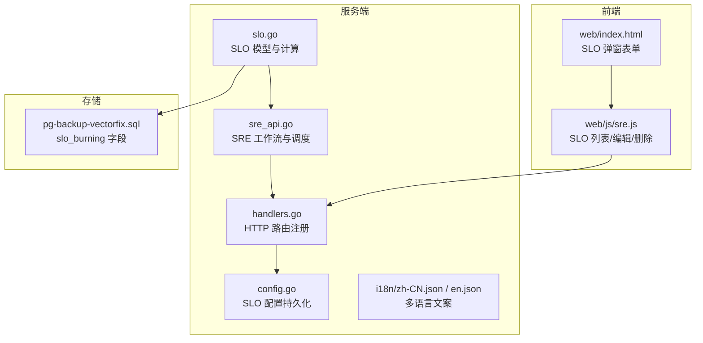
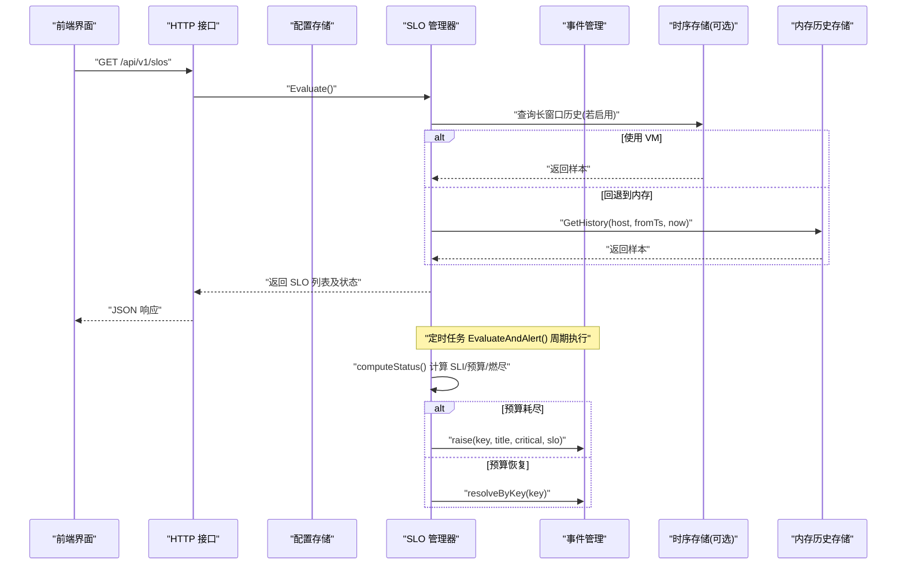
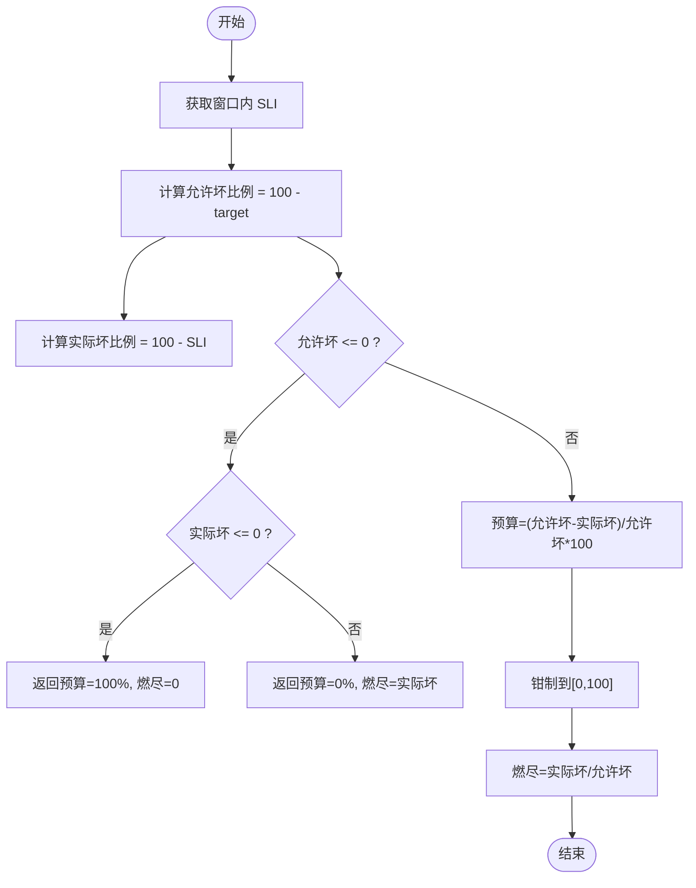
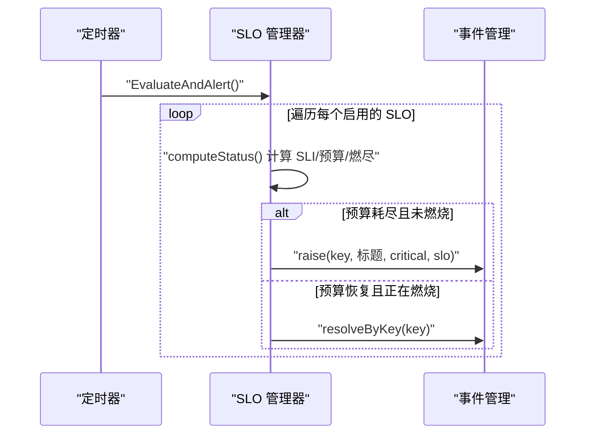
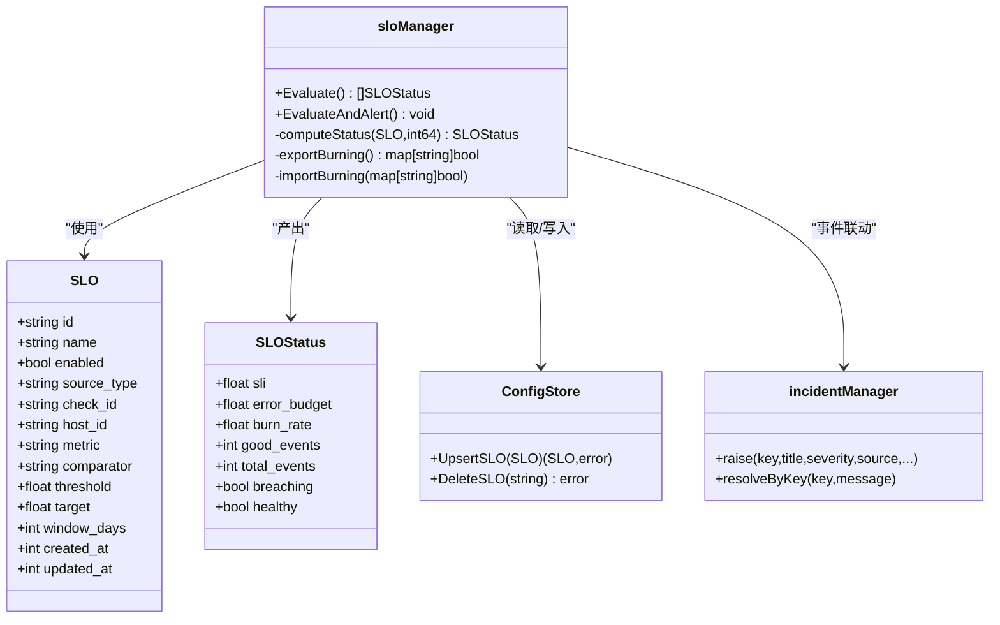

# SLO 评估

<cite>
**本文引用的文件**   
- [slo.go](file://cmd/server/slo.go)
- [sre_api.go](file://cmd/server/sre_api.go)
- [handlers.go](file://cmd/server/handlers.go)
- [config.go](file://cmd/server/config.go)
- [main.go](file://cmd/server/main.go)
- [index.html](file://cmd/server/web/index.html)
- [sre.js](file://cmd/server/web/js/sre.js)
- [zh-CN.json](file://cmd/server/i18n/zh-CN.json)
- [en.json](file://cmd/server/i18n/en.json)
- [pg-backup-vectorfix.sql](file://pg-backup-vectorfix.sql)
</cite>

## 目录
1. [简介](#简介)
2. [项目结构](#项目结构)
3. [核心组件](#核心组件)
4. [架构总览](#架构总览)
5. [详细组件分析](#详细组件分析)
6. [依赖关系分析](#依赖关系分析)
7. [性能考量](#性能考量)
8. [故障排查指南](#故障排查指南)
9. [结论](#结论)
10. [附录](#附录)

## 简介
本章节面向 AIOps Monitor 的 SLO（服务等级目标）评估能力，系统性阐述：
- SLO、SLI、SLA 的概念与关系
- SLO 目标的设定方法（可用性、延迟、错误率等）
- 错误预算（Error Budget）的计算与消耗监控
- 燃烧检测机制与事件联动
- 评估结果解读与健康状态判断
- 实际业务场景配置示例与最佳实践

SLO 在本系统中的实现以“滚动窗口 + 指标/拨测 SLI + 错误预算 + 燃尽告警”为核心，提供开箱即用的可观测性与稳定性保障能力。

## 项目结构
SLO 功能主要分布在服务端模块中，涉及数据结构定义、计算引擎、HTTP API、持久化、前端展示与国际化文案等。

图表来源
- [slo.go:24-51](file://cmd/server/slo.go#L24-L51)
- [sre_api.go:87-101](file://cmd/server/sre_api.go#L87-L101)
- [handlers.go:194-196](file://cmd/server/handlers.go#L194-L196)
- [config.go:1182-1220](file://cmd/server/config.go#L1182-L1220)
- [index.html:1420-1434](file://cmd/server/web/index.html#L1420-L1434)
- [sre.js:830-851](file://cmd/server/web/js/sre.js#L830-L851)
- [pg-backup-vectorfix.sql:328-330](file://pg-backup-vectorfix.sql#L328-L330)

章节来源
- [slo.go:24-51](file://cmd/server/slo.go#L24-L51)
- [sre_api.go:87-101](file://cmd/server/sre_api.go#L87-L101)
- [handlers.go:194-196](file://cmd/server/handlers.go#L194-L196)
- [config.go:1182-1220](file://cmd/server/config.go#L1182-L1220)
- [index.html:1420-1434](file://cmd/server/web/index.html#L1420-L1434)
- [sre.js:830-851](file://cmd/server/web/js/sre.js#L830-L851)
- [pg-backup-vectorfix.sql:328-330](file://pg-backup-vectorfix.sql#L328-L330)

## 核心组件
- SLO 数据模型与状态
  - SLO：描述一个目标，包含名称、启用开关、SLI 来源类型（拨测或主机指标）、目标值、滚动窗口天数等。
  - SLOStatus：在 SLO 基础上附加计算结果，包括 SLI、剩余错误预算、燃尽速率、达标/不达标与健康状态等。
- 计算与评估
  - computeStatus：按窗口拉取样本或拨测点，统计“好样本数/总样本数”得到 SLI，再计算错误预算与燃尽速率。
  - sloBudget：基于 SLI 与目标推导剩余预算百分比与燃尽速率。
- 事件联动
  - EvaluateAndAlert：周期性执行，当错误预算耗尽时自动创建严重级别事件；恢复后自动关闭。
- 配置与持久化
  - UpsertSLO/DeleteSLO：新增/更新/删除 SLO 并落盘。
- HTTP API
  - GET/POST/DELETE /api/v1/slos：列出、新增/更新、删除 SLO。
- 前端交互
  - index.html：SLO 新建/编辑弹窗，支持选择拨测源或主机指标。
  - sre.js：加载 SLO 列表、渲染错误预算条、触发编辑/删除操作。

章节来源
- [slo.go:24-51](file://cmd/server/slo.go#L24-L51)
- [slo.go:133-179](file://cmd/server/slo.go#L133-L179)
- [slo.go:196-224](file://cmd/server/slo.go#L196-L224)
- [config.go:1182-1220](file://cmd/server/config.go#L1182-L1220)
- [handlers.go:194-196](file://cmd/server/handlers.go#L194-L196)
- [index.html:1420-1434](file://cmd/server/web/index.html#L1420-L1434)
- [sre.js:830-851](file://cmd/server/web/js/sre.js#L830-L851)

## 架构总览
下图展示了 SLO 从配置到评估、再到事件联动的整体流程，以及前后端交互路径。

图表来源
- [handlers.go:194-196](file://cmd/server/handlers.go#L194-L196)
- [sre_api.go:87-101](file://cmd/server/sre_api.go#L87-L101)
- [sre_api.go:322-330](file://cmd/server/sre_api.go#L322-L330)
- [slo.go:133-179](file://cmd/server/slo.go#L133-L179)
- [slo.go:196-224](file://cmd/server/slo.go#L196-L224)

## 详细组件分析

### 概念与关系：SLO、SLI、SLA
- SLI（服务等级指标）：衡量“好”的比例，例如拨测 up 率或主机指标处于“良好区间”的样本占比。
- SLO（服务等级目标）：对 SLI 的目标值与时间窗口的约定，如“过去 30 天 SLI ≥ 99.9%”。
- SLA（服务等级协议）：对外承诺的服务水平契约，通常由多个 SLO 组成，并与业务影响挂钩。

在本系统中，SLI 来源于两类数据：
- 拨测（check）：OK 点数 / 总点数
- 主机指标（metric）：满足比较符与阈值的样本占比

章节来源
- [slo.go:12-22](file://cmd/server/slo.go#L12-L22)
- [slo.go:24-51](file://cmd/server/slo.go#L24-L51)

### SLO 目标设定方法
- 可用性目标：通过拨测 up 率作为 SLI，设置目标（如 99.9%），窗口（如 30 天）。
- 延迟目标：可通过自定义拨测项采集 P95/P99 延迟，并以“是否低于阈值”判定为“好样本”，从而构成 SLI。
- 错误率目标：将错误率转换为“成功比例”作为 SLI（例如 1 - 错误率），再与目标对比。
- 指标达标率：选择主机指标（CPU/内存/磁盘/Load/IO/网络等），定义“良好区间”（比较符+阈值），计算达标样本占比作为 SLI。

配置要点
- source_type：选择 check 或 metric
- target：目标百分比（0 < target ≤ 100）
- window_days：滚动窗口（默认 30 天）
- metric/comparator/threshold：仅 metric 模式需要

章节来源
- [slo.go:24-51](file://cmd/server/slo.go#L24-L51)
- [slo.go:247-283](file://cmd/server/slo.go#L247-L283)
- [index.html:1420-1434](file://cmd/server/web/index.html#L1420-L1434)

### 错误预算与燃烧监控
- 错误预算：允许的最大“坏样本比例”= 100 - target。
- 实际坏样本比例 = 100 - SLI。
- 剩余预算百分比 = (允许坏 - 实际坏) / 允许坏 × 100，边界钳制在 [0, 100]。
- 燃尽速率 = 实际坏 / 允许坏；>1 表示超预算消耗速度。

图表来源
- [slo.go:95-116](file://cmd/server/slo.go#L95-L116)

章节来源
- [slo.go:95-116](file://cmd/server/slo.go#L95-L116)

### 燃烧检测与事件联动
- 短期燃烧：当前窗口内错误预算耗尽（≤0）即视为燃烧，立即创建严重级别事件。
- 长期燃烧：系统未内置多窗口双阈值算法，但可通过增大窗口与降低目标来体现长期趋势；同时结合 AI 巡检与慢退化检测辅助识别。
- 去重与恢复：同一 SLO 的燃烧状态去重，避免重复创建事件；预算恢复后自动关闭对应事件。

图表来源
- [sre_api.go:322-330](file://cmd/server/sre_api.go#L322-L330)
- [slo.go:196-224](file://cmd/server/slo.go#L196-L224)

章节来源
- [sre_api.go:322-330](file://cmd/server/sre_api.go#L322-L330)
- [slo.go:196-224](file://cmd/server/slo.go#L196-L224)

### 评估结果解读与健康状态
- SLI：窗口内“好样本占比”，用于与目标对比。
- ErrorBudget：剩余预算百分比，越接近 0 越危险。
- BurnRate：燃尽速率，>1 表示超预算消耗。
- Breaching：SLI < target 时为真，表示当前不达标。
- Healthy：无样本或 SLI ≥ target 时为真，表示健康。

前端可视化
- 错误预算进度条：直观展示剩余预算百分比。
- 达标计数：good_events / total_events 便于快速定位问题规模。

章节来源
- [slo.go:41-51](file://cmd/server/slo.go#L41-L51)
- [sre.js:830-851](file://cmd/server/web/js/sre.js#L830-L851)

### 数据源与历史读取策略
- 优先从向量时序存储（VM）读取长窗口历史，若不可用则回退到内存历史存储。
- 拨测数据通过 HistoryOf 接口获取。

章节来源
- [sre_api.go:87-101](file://cmd/server/sre_api.go#L87-L101)

### 配置与持久化
- UpsertSLO：新增或更新 SLO，自动生成 ID 与时间戳，保存至配置存储。
- DeleteSLO：按 ID 删除 SLO。
- 验证规则：名称必填、目标范围合法、窗口至少 1 天、source_type 与必要字段校验。

章节来源
- [config.go:1182-1220](file://cmd/server/config.go#L1182-L1220)
- [slo.go:247-283](file://cmd/server/slo.go#L247-L283)

### HTTP API 与路由
- GET /api/v1/slos：列出所有 SLO 及其评估状态。
- POST /api/v1/slos：新增/更新 SLO。
- DELETE /api/v1/slos/{id}：删除指定 SLO。

章节来源
- [handlers.go:194-196](file://cmd/server/handlers.go#L194-L196)
- [sre_api.go:533-559](file://cmd/server/sre_api.go#L533-L559)

### 前端交互
- 弹窗表单：支持选择 SLI 来源（拨测/指标）、主机与指标、比较符与阈值、目标与窗口。
- 列表页：展示错误预算条、燃尽倍数、达标计数，支持编辑与删除。

章节来源
- [index.html:1420-1434](file://cmd/server/web/index.html#L1420-L1434)
- [sre.js:830-851](file://cmd/server/web/js/sre.js#L830-L851)

### 多语言与提示
- 中文/英文文案覆盖 SLO 校验错误、事件标题与恢复消息等。

章节来源
- [zh-CN.json:235-249](file://cmd/server/i18n/zh-CN.json#L235-L249)
- [en.json:235-249](file://cmd/server/i18n/en.json#L235-L249)

### 燃烧状态持久化
- 燃烧状态映射导出/导入，配合数据库中的 slo_burning 字段进行跨进程/重启恢复。

章节来源
- [slo.go:226-244](file://cmd/server/slo.go#L226-L244)
- [pg-backup-vectorfix.sql:328-330](file://pg-backup-vectorfix.sql#L328-L330)

## 依赖关系分析
- 组件耦合
  - SLO 管理器依赖配置存储、事件管理、历史数据源（VM/内存）、拨测历史。
  - 前端通过 HTTP API 与后端交互，渲染 SLO 列表与弹窗表单。
- 外部依赖
  - 可选的向量时序存储（VM）用于长窗口历史查询。
  - 数据库持久化配置与燃烧状态。

图表来源
- [slo.go:24-51](file://cmd/server/slo.go#L24-L51)
- [slo.go:118-131](file://cmd/server/slo.go#L118-L131)
- [config.go:1182-1220](file://cmd/server/config.go#L1182-L1220)

章节来源
- [slo.go:24-51](file://cmd/server/slo.go#L24-L51)
- [slo.go:118-131](file://cmd/server/slo.go#L118-L131)
- [config.go:1182-1220](file://cmd/server/config.go#L1182-L1220)

## 性能考量
- 长窗口历史读取：优先从向量时序存储（VM）读取，避免内存占用过大；不可用时回退到内存历史。
- 批量评估：Evaluate() 一次性计算所有 SLO 的状态，适合前端轮询展示。
- 压缩传输：全局 gzip 中间件可降低 JSON 响应体积，提升大屏刷新效率。
- 并发安全：燃烧状态使用互斥锁保护，避免竞态条件。

章节来源
- [sre_api.go:87-101](file://cmd/server/sre_api.go#L87-L101)
- [main.go:186-200](file://cmd/server/main.go#L186-L200)
- [slo.go:118-131](file://cmd/server/slo.go#L118-L131)

## 故障排查指南
- 常见校验错误
  - 名称为空、目标不在合法范围、窗口小于 1 天、source_type 未知、缺少必要字段（如拨测 ID 或主机/指标）。
- 事件未创建/未恢复
  - 检查 SLO 是否启用、窗口与数据源是否正确、VM 是否可用、燃烧状态是否被正确导出/导入。
- 前端显示异常
  - 确认 /api/v1/slos 返回字段完整（error_budget、burn_rate、good_events、total_events）。
- 日志与审计
  - 保存 SLO 操作会记录审计日志，便于追踪变更。

章节来源
- [slo.go:247-283](file://cmd/server/slo.go#L247-L283)
- [sre_api.go:533-559](file://cmd/server/sre_api.go#L533-L559)
- [zh-CN.json:235-249](file://cmd/server/i18n/zh-CN.json#L235-L249)
- [en.json:235-249](file://cmd/server/i18n/en.json#L235-L249)

## 结论
AIOps Monitor 的 SLO 评估以简洁的数据模型与清晰的计算逻辑为基础，结合错误预算与燃尽速率，实现了从指标到事件的闭环自动化。通过灵活的 SLI 来源（拨测/指标）、可配置的窗口与目标、以及与事件系统的深度集成，用户可以在不同业务场景下快速落地稳定性治理。建议在生产环境中结合长窗口历史存储与 AI 巡检，进一步提升对缓慢退化与长期燃烧的识别能力。

## 附录

### 实际业务场景配置示例
- API 可用性 SLO
  - source_type: check
  - target: 99.9
  - window_days: 30
  - 说明：以拨测 up 率为 SLI，目标 99.9%，窗口 30 天。
- CPU 资源健康 SLO
  - source_type: metric
  - host_id: 目标主机
  - metric: cpu_percent
  - comparator: "<"
  - threshold: 90
  - target: 99
  - window_days: 30
  - 说明：CPU 低于 90% 视为“好样本”，目标 99%。
- 磁盘 IO 利用率 SLO
  - source_type: metric
  - metric: diskio_util
  - comparator: "<="
  - threshold: 80
  - target: 99.5
  - window_days: 14
  - 说明：磁盘 IO 利用率不超过 80% 视为“好样本”，目标 99.5%。

章节来源
- [slo.go:24-51](file://cmd/server/slo.go#L24-L51)
- [index.html:1420-1434](file://cmd/server/web/index.html#L1420-L1434)

### 最佳实践建议
- 合理设置窗口：短窗口（7-14 天）用于快速发现突发问题；长窗口（30-90 天）用于把握长期趋势。
- 目标与预算平衡：目标越高，预算越小，需更谨慎处理异常；必要时引入多级目标与预警阈值。
- 指标选择：优先选择与用户体验强相关的指标（如请求成功率、P95 延迟、关键资源利用率）。
- 事件联动：确保燃烧事件能自动升级并通知相关团队，缩短 MTTR。
- 数据源可靠性：长窗口尽量使用向量时序存储，避免内存压力与数据丢失。

[本节为通用指导，无需代码来源]