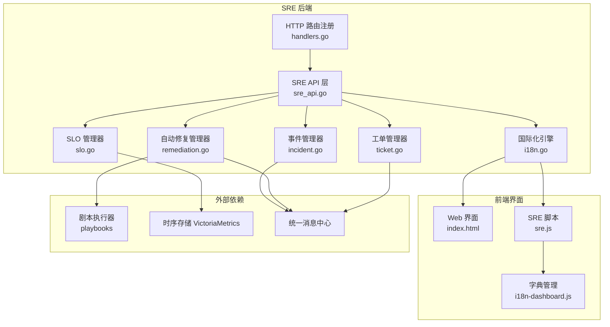
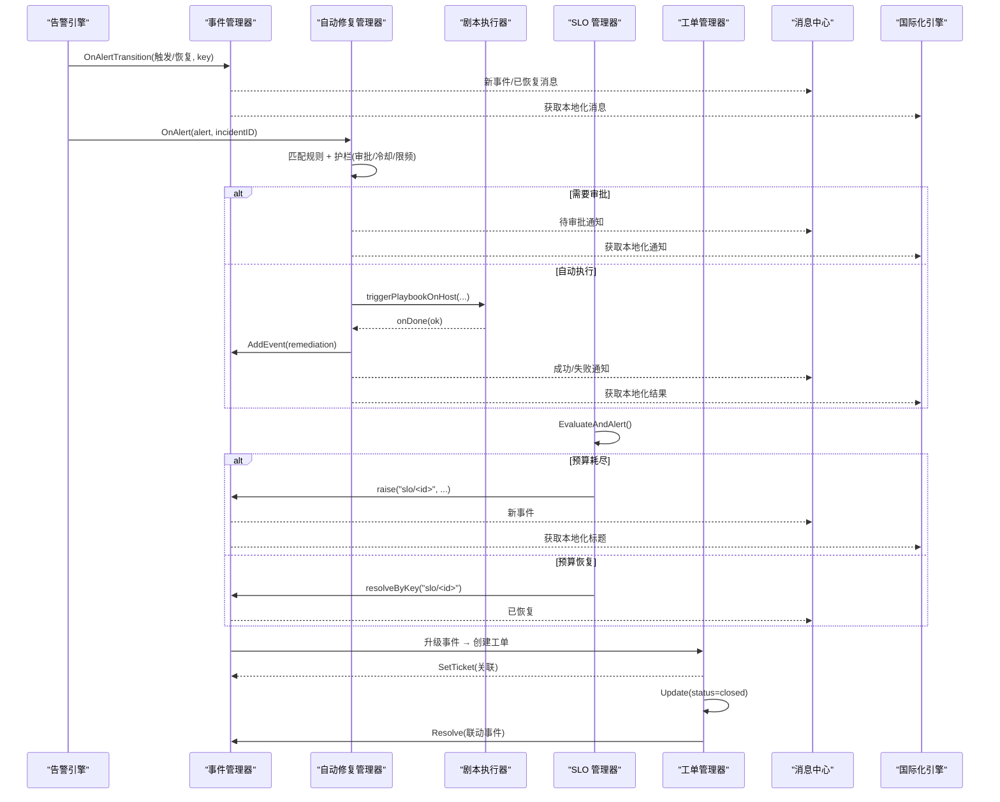
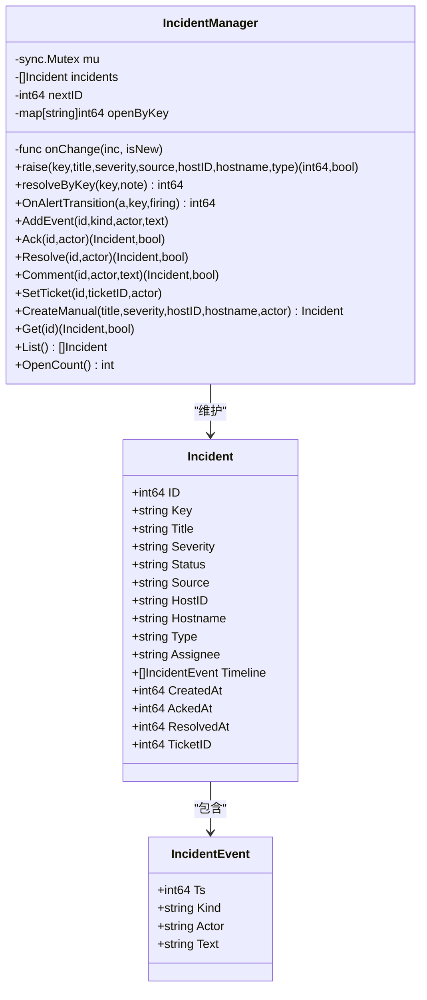
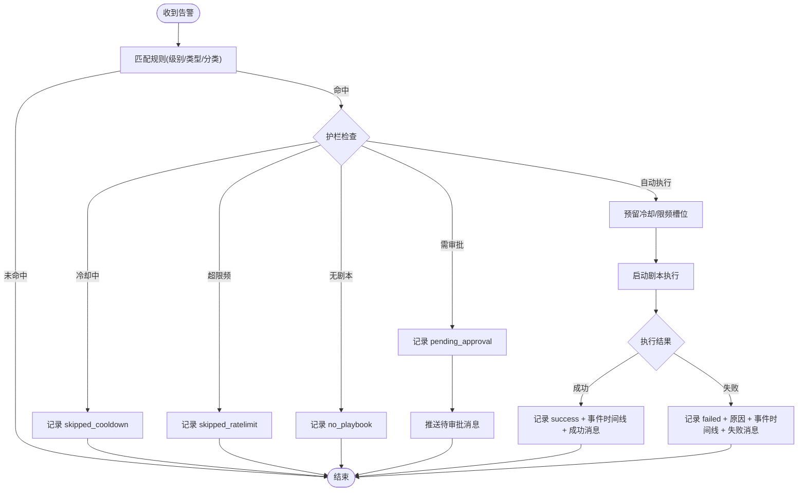
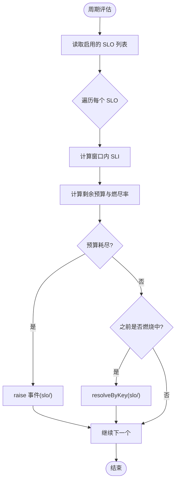
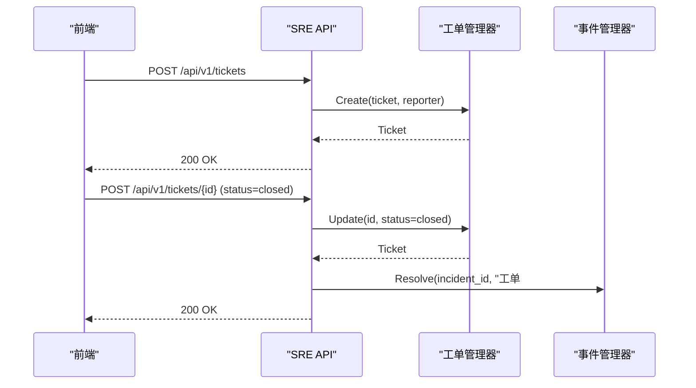
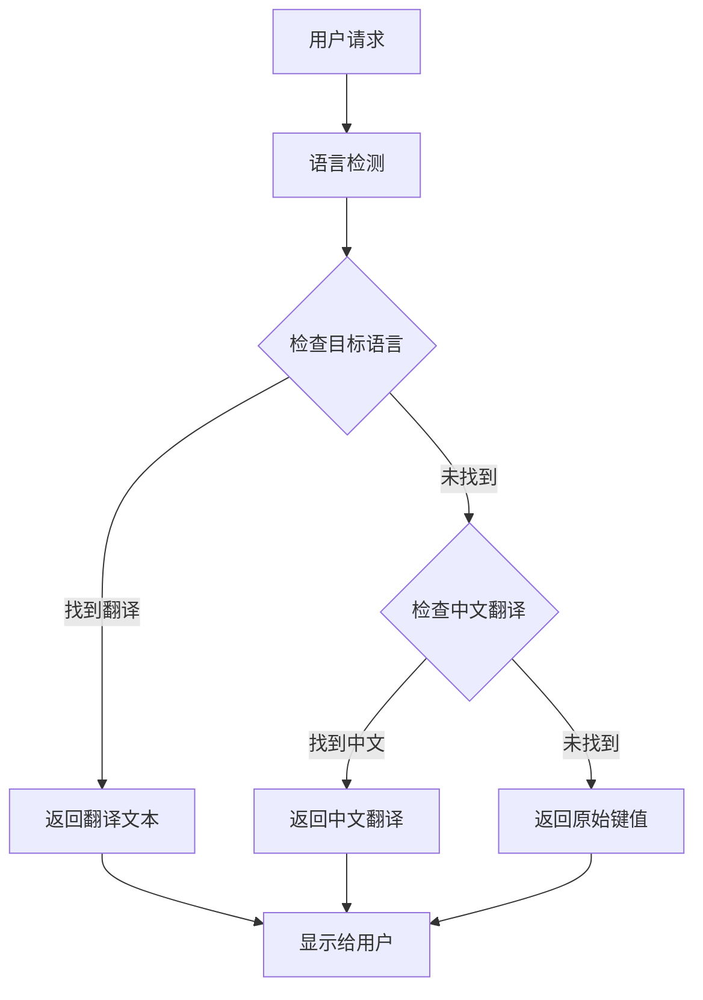
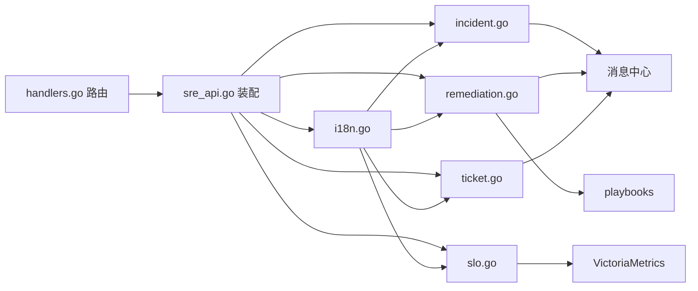

# SRE 工作流

<cite>
**本文引用的文件**   
- [incident.go](file://cmd/server/incident.go)
- [remediation.go](file://cmd/server/remediation.go)
- [slo.go](file://cmd/server/slo.go)
- [ticket.go](file://cmd/server/ticket.go)
- [sre_api.go](file://cmd/server/sre_api.go)
- [handlers.go](file://cmd/server/handlers.go)
- [i18n.go](file://cmd/server/i18n.go)
- [i18n/zh-CN.json](file://cmd/server/i18n/zh-CN.json)
- [i18n/en.json](file://cmd/server/i18n/en.json)
- [web/index.html](file://cmd/server/web/index.html)
- [web/js/sre.js](file://cmd/server/web/js/sre.js)
- [web/i18n-dashboard.js](file://cmd/server/web/i18n-dashboard.js)
</cite>

## 更新摘要
**所做更改**   
- 更新了国际化处理机制说明，新增日志搜索界面的国际化边缘情况修复
- 补充了前端国际化回退机制的详细技术实现
- 增强了SRE工作流中用户界面文本处理的健壮性说明

## 目录
1. [简介](#简介)
2. [项目结构](#项目结构)
3. [核心组件](#核心组件)
4. [架构总览](#架构总览)
5. [详细组件分析](#详细组件分析)
6. [依赖关系分析](#依赖关系分析)
7. [性能与扩展性](#性能与扩展性)
8. [故障排查指南](#故障排查指南)
9. [结论](#结论)
10. [附录：配置示例与最佳实践](#附录配置示例与最佳实践)

## 简介
本文件面向 AIOps Monitor 的 SRE 工作流能力，围绕事件管理、自动修复闭环、SLO 错误预算与燃尽、工单流转四大模块进行系统化说明。文档覆盖从告警触发到事件创建、确认、解决、关闭的全生命周期；自动修复规则的匹配、护栏（审批/冷却/限频）、执行与结果反馈；SLO 的 SLI 定义、错误预算计算与自动开事件；以及工单的创建、指派、处理与关闭联动。文末提供可落地的配置建议与最佳实践。

**更新** 新增了国际化边缘情况的处理机制，确保在缺少英文翻译时正确回退到中文文本，防止向用户显示原始翻译键值。

## 项目结构
SRE 工作流由服务端多个管理器协同实现，并通过 HTTP API 暴露给前端与外部系统。关键文件职责如下：
- 事件管理：事件模型、时间线、去重与状态机
- 自动修复：规则匹配、护栏、执行编排与结果回写
- SLO：SLI 来源（拨测/指标）、错误预算与燃尽率、自动事件
- 工单：轻量任务跟踪、状态流转、评论与事件联动
- 路由与装配：API 路由注册、管理器间连线、通知中心集成
- 前端页面与交互：SRE 面板入口、操作按钮与列表渲染
- 国际化支持：多语言字典管理、回退机制、前端本地化

**图表来源**
- [sre_api.go:26-106](file://cmd/server/sre_api.go#L26-L106)
- [handlers.go:175-214](file://cmd/server/handlers.go#L175-L214)
- [i18n.go:93-129](file://cmd/server/i18n.go#L93-L129)

章节来源
- [handlers.go:175-214](file://cmd/server/handlers.go#L175-L214)
- [web/index.html:532-575](file://cmd/server/web/index.html#L532-L575)

## 核心组件
- 事件管理器：维护事件对象、时间线与去重索引，支持手动/告警/SLO 来源，提供确认、解决、评论、升级工单等能力。
- 自动修复管理器：将告警映射到剧本执行，内置"人工审批""主机级冷却""规则级小时限频"三大护栏，记录运行历史并回写事件时间线与消息中心。
- SLO 管理器：基于拨测 up 率或主机指标达标率计算 SLI，推导剩余错误预算与燃尽率，预算耗尽自动开事件，恢复后自动关事件。
- 工单管理器：轻量任务跟踪，支持优先级、状态流转、指派与评论，可从事件一键升级生成，并在关闭时联动事件自动解决。
- 国际化引擎：提供多语言文本翻译服务，支持语言检测、字典加载、回退机制，确保用户界面文本的正确显示。

**更新** 国际化引擎现在具备更强的容错能力，当某个语言的翻译缺失时，会自动回退到中文版本，避免显示原始键值。

章节来源
- [incident.go:18-43](file://cmd/server/incident.go#L18-L43)
- [remediation.go:21-57](file://cmd/server/remediation.go#L21-L57)
- [slo.go:24-51](file://cmd/server/slo.go#L24-L51)
- [ticket.go:26-39](file://cmd/server/ticket.go#L26-L39)
- [i18n.go:93-129](file://cmd/server/i18n.go#L93-L129)

## 架构总览
SRE 工作流以"事件"为中心，串联告警、自动修复、SLO 与工单。事件在告警触发时创建或复用，SLO 预算耗尽时也会创建事件；自动修复通过规则匹配触发剧本执行，结果写入事件时间线；工单可从事件升级，关闭后可联动事件自动解决。

**图表来源**
- [sre_api.go:26-106](file://cmd/server/sre_api.go#L26-L106)
- [sre_api.go:322-330](file://cmd/server/sre_api.go#L322-L330)
- [sre_api.go:430-465](file://cmd/server/sre_api.go#L430-L465)
- [sre_api.go:533-559](file://cmd/server/sre_api.go#L533-L559)
- [sre_api.go:626-661](file://cmd/server/sre_api.go#L626-L661)
- [incident.go:150-163](file://cmd/server/incident.go#L150-L163)
- [slo.go:195-224](file://cmd/server/slo.go#L195-L224)
- [remediation.go:135-205](file://cmd/server/remediation.go#L135-205)
- [i18n.go:93-129](file://cmd/server/i18n.go#L93-L129)

## 详细组件分析

### 事件管理（Incident）
- 生命周期：open → acknowledged → resolved；支持 comment、escalated 等时间线事件。
- 去重机制：按 key（如 alertKey 或 slo/id）复用已有 open 事件，避免抖动重复。
- 自动恢复：当底层告警恢复时，按 key 自动 resolve。
- 与 AI 联动：新 critical 事件自动触发诊断，结果追加至时间线并推送消息。
- **国际化增强**：事件标题和消息内容现在支持多语言显示，当目标语言翻译缺失时自动回退到中文。

**图表来源**
- [incident.go:18-43](file://cmd/server/incident.go#L18-L43)
- [incident.go:47-119](file://cmd/server/incident.go#L47-L119)
- [incident.go:150-207](file://cmd/server/incident.go#L150-L207)

章节来源
- [incident.go:18-43](file://cmd/server/incident.go#L18-L43)
- [incident.go:85-119](file://cmd/server/incident.go#L85-L119)
- [incident.go:150-207](file://cmd/server/incident.go#L150-L207)
- [sre_api.go:341-428](file://cmd/server/sre_api.go#L341-L428)

### 自动修复（Remediation）
- 规则匹配：按级别、类型、主机分类过滤，空值表示任意。
- 护栏策略：
  - 人工审批：RequireApproval=true 时进入 pending_approval，需人工 Approve/Reject。
  - 主机级冷却：同一规则+主机在 CooldownSec 内不重复触发。
  - 规则级限频：每小时最多 MaxPerHour 次，防止风暴。
- 执行链路：匹配成功后，解析目标主机与剧本，异步执行，回调完成状态并更新运行记录。
- 结果反馈：成功/失败均追加事件时间线，同时推送消息中心。
- **国际化增强**：自动修复的通知消息和执行结果现在支持多语言显示，确保不同语言用户都能正确理解修复状态。

**图表来源**
- [remediation.go:103-147](file://cmd/server/remediation.go#L103-L147)
- [remediation.go:149-205](file://cmd/server/remediation.go#L149-L205)
- [remediation.go:207-262](file://cmd/server/remediation.go#L207-L262)
- [remediation.go:264-311](file://cmd/server/remediation.go#L264-L311)

章节来源
- [remediation.go:21-57](file://cmd/server/remediation.go#L21-L57)
- [remediation.go:103-147](file://cmd/server/remediation.go#L103-L147)
- [remediation.go:149-205](file://cmd/server/remediation.go#L149-L205)
- [remediation.go:207-262](file://cmd/server/remediation.go#L207-L262)
- [remediation.go:264-311](file://cmd/server/remediation.go#L264-L311)
- [sre_api.go:471-527](file://cmd/server/sre_api.go#L471-L527)

### SLO（服务等级目标）
- SLI 来源：
  - check：拨测 up 率（OK 点数 / 总点数）。
  - metric：主机指标满足"好区间"的比例（如 cpu_percent < 90）。
- 错误预算与燃尽率：
  - 允许坏比例 = 100 - target
  - 实际坏比例 = 100 - sli
  - 剩余预算 = (允许坏 - 实际坏) / 允许坏 × 100%
  - 燃尽率 = 实际坏 / 允许坏（>1 表示超预算速率）
- 自动事件：预算耗尽时 raise 事件，恢复时 resolveByKey。
- 数据源：长窗口优先走 VictoriaMetrics，否则回退本地历史。
- **国际化增强**：SLO 事件的标题和描述现在支持多语言显示，确保不同语言用户都能理解服务等级目标的违反情况。

**图表来源**
- [slo.go:95-116](file://cmd/server/slo.go#L95-L116)
- [slo.go:133-179](file://cmd/server/slo.go#L133-L179)
- [slo.go:195-224](file://cmd/server/slo.go#L195-L224)
- [sre_api.go:87-101](file://cmd/server/sre_api.go#L87-L101)

章节来源
- [slo.go:24-51](file://cmd/server/slo.go#L24-L51)
- [slo.go:95-116](file://cmd/server/slo.go#L95-L116)
- [slo.go:133-179](file://cmd/server/slo.go#L133-L179)
- [slo.go:195-224](file://cmd/server/slo.go#L195-L224)
- [sre_api.go:533-559](file://cmd/server/sre_api.go#L533-L559)

### 工单（Ticket）
- 生命周期：open → in_progress → resolved → closed。
- 功能：创建、更新（标题/描述/优先级/状态/指派人）、评论、删除。
- 联动：
  - 从事件升级：自动设置优先级（critical→p1），并回填来源信息。
  - 工单关闭：自动将关联事件标记为已解决，并追加时间线备注。
- **国际化增强**：工单的状态变更通知和评论消息现在支持多语言显示。

**图表来源**
- [sre_api.go:609-661](file://cmd/server/sre_api.go#L609-L661)
- [ticket.go:64-118](file://cmd/server/ticket.go#L64-L118)

章节来源
- [ticket.go:26-39](file://cmd/server/ticket.go#L26-L39)
- [ticket.go:64-118](file://cmd/server/ticket.go#L64-L118)
- [sre_api.go:609-661](file://cmd/server/sre_api.go#L609-L661)

### 国际化引擎（i18n）
**新增组件** 国际化引擎负责管理系统中的所有用户可见文本的多语言支持。

- 语言检测优先级：URL 参数 `?lang=` > Cookie `aiops_lang` > `Accept-Language` 头 > 默认 `zh-CN`
- 字典管理：通过 `//go:embed i18n/*.json` 内嵌三语字典（zh-CN、zh-TW、en）
- 翻译函数：
  - `T(lang, key, args...)`：指定语言的翻译，支持格式化参数
  - `Tr(r, key, args...)`：从请求中检测语言的翻译
  - `Tz(key, args...)`：使用默认语言的翻译（用于内部日志）
- **边缘情况处理**：当目标语言的翻译缺失时，自动回退到中文版本，如果中文也缺失则返回原始键值
- 前端集成：前端通过 `I18N.t(key)` 函数获取本地化文本，支持动态语言切换

**图表来源**
- [i18n.go:93-129](file://cmd/server/i18n.go#L93-L129)
- [i18n.go:68-91](file://cmd/server/i18n.go#L68-L91)

章节来源
- [i18n.go:93-129](file://cmd/server/i18n.go#L93-L129)
- [i18n.go:68-91](file://cmd/server/i18n.go#L68-L91)
- [i18n.go:26-37](file://cmd/server/i18n.go#L26-L37)

## 依赖关系分析
- 管理器耦合：
  - 自动修复依赖剧本执行器、主机查询、分类函数、事件时间线写入与消息中心。
  - SLO 依赖指标/拨测历史与事件管理器。
  - 事件管理器被自动修复与 SLO 共同使用，作为统一上下文。
  - 工单与事件双向联动（升级与关闭）。
  - **国际化依赖**：所有管理器都可以通过国际化引擎获取本地化的消息文本。
- 外部依赖：
  - VictoriaMetrics：用于长窗口 SLO 指标采样。
  - 消息中心：统一推送事件、自动修复、工单等通知。
- 路由与装配：
  - handlers.go 注册所有 SRE 相关 API。
  - sre_api.go 完成各管理器之间的连线与回调注入。

**图表来源**
- [handlers.go:175-214](file://cmd/server/handlers.go#L175-L214)
- [sre_api.go:26-106](file://cmd/server/sre_api.go#L26-L106)
- [i18n.go:93-129](file://cmd/server/i18n.go#L93-L129)

章节来源
- [handlers.go:175-214](file://cmd/server/handlers.go#L175-L214)
- [sre_api.go:26-106](file://cmd/server/sre_api.go#L26-L106)

## 性能与扩展性
- 内存管理与容量限制：
  - 事件历史上限与时间线长度裁剪，避免无限增长。
  - 自动修复运行记录上限，保持最近 N 条。
- 并发安全：
  - 各管理器内部使用互斥锁保护共享状态。
- 数据源选择：
  - SLO 长窗口优先走 VictoriaMetrics，降低内存压力与提升准确性。
- 可扩展点：
  - 自动修复的触发与执行通过回调注入，便于替换执行器或增加审计。
  - SLO 的 SLI 来源可扩展更多指标族。
- **国际化性能优化**：
  - 字典文件通过 `//go:embed` 编译时嵌入，避免运行时文件 IO。
  - 翻译查找使用内存中的 map 结构，O(1) 时间复杂度。
  - 支持语言检测缓存，减少重复的语言解析开销。

## 故障排查指南
- 自动修复未触发：
  - 检查规则是否启用、匹配条件（级别/类型/分类）是否正确。
  - 查看冷却与限频是否拦截（reason 字段会提示）。
  - 确认关联剧本存在且目标主机在线。
- 自动修复待审批积压：
  - 在"自动修复"页批量批准或拒绝，关注消息中心提醒。
- SLO 未产生事件：
  - 确认窗口天数与数据源（拨测/指标）有足够样本。
  - 检查目标阈值与比较符是否符合预期。
- 工单无法关闭联动事件：
  - 确认工单确实关联了事件 ID，且事件尚未处于 resolved。
- **国际化问题排查**：
  - 检查目标语言的翻译键是否存在于对应的 JSON 文件中。
  - 验证语言检测逻辑是否正确识别用户的语言偏好。
  - 确认前端是否正确调用了 `I18N.t()` 函数获取本地化文本。
  - 检查浏览器控制台是否有翻译键未找到的警告信息。

章节来源
- [i18n/zh-CN.json:215-249](file://cmd/server/i18n/zh-CN.json#L215-L249)
- [remediation.go:399-418](file://cmd/server/remediation.go#L399-L418)
- [slo.go:246-283](file://cmd/server/slo.go#L246-L283)
- [i18n.go:93-129](file://cmd/server/i18n.go#L93-L129)

## 结论
AIOps Monitor 的 SRE 工作流以事件为核心，将告警、自动修复、SLO 与工单有机串联，形成"发现—处置—复盘—改进"的闭环。通过护栏与限频保障自动化安全，通过错误预算驱动质量治理，通过工单沉淀后续改进项。配合统一消息中心与 AI 辅助诊断，显著提升排障效率与稳定性。

**更新** 新增的国际化边缘情况处理机制确保了系统的健壮性，即使在翻译缺失的情况下也能为用户提供良好的用户体验，避免了显示原始键值的技术缺陷。

## 附录：配置示例与最佳实践

### 事件管理最佳实践
- 合理设置事件去重 key，避免抖动导致重复事件。
- 对 critical 事件开启自动诊断，缩短平均定位时间。
- 及时确认与评论，完善时间线以便复盘。
- **国际化最佳实践**：为所有事件标题和消息提供多语言翻译，确保全球用户都能理解事件内容。

章节来源
- [incident.go:85-119](file://cmd/server/incident.go#L85-L119)
- [sre_api.go:341-428](file://cmd/server/sre_api.go#L341-L428)

### 自动修复规则配置建议
- 先启用 RequireApproval，逐步放开自动执行。
- 设置合理的 CooldownSec 与 MaxPerHour，抑制风暴。
- 明确匹配范围（类型/级别/分类），避免误触。
- 定期审查执行记录，优化剧本与规则。
- **国际化最佳实践**：为自动修复的通知消息提供多语言版本，确保不同语言用户都能理解修复状态。

章节来源
- [remediation.go:103-147](file://cmd/server/remediation.go#L103-L147)
- [remediation.go:149-205](file://cmd/server/remediation.go#L149-L205)
- [sre_api.go:471-527](file://cmd/server/sre_api.go#L471-L527)

### SLO 设定与评估方法
- 选择贴近业务的 SLI 来源（拨测 up 率更贴近用户体验）。
- 目标值与窗口天数结合业务容忍度设定。
- 关注错误预算与燃尽率，预算耗尽即开事件，快速响应。
- **国际化最佳实践**：为 SLO 事件标题提供多语言翻译，确保用户能理解服务等级目标的违反情况。

章节来源
- [slo.go:95-116](file://cmd/server/slo.go#L95-L116)
- [slo.go:133-179](file://cmd/server/slo.go#L133-L179)
- [slo.go:195-224](file://cmd/server/slo.go#L195-L224)

### 工单流转管理建议
- 从事件升级自动生成工单，保证问题可追踪。
- 规范状态流转与指派，确保责任到人。
- 工单关闭联动事件自动解决，减少遗漏。
- **国际化最佳实践**：为工单状态变更和评论提供多语言支持，确保团队协作的顺畅沟通。

章节来源
- [sre_api.go:430-465](file://cmd/server/sre_api.go#L430-L465)
- [sre_api.go:609-661](file://cmd/server/sre_api.go#L609-L661)
- [ticket.go:64-118](file://cmd/server/ticket.go#L64-L118)

### 国际化配置与管理
**新增章节** 国际化功能的配置和管理最佳实践。

- 字典文件组织：
  - 按语言分文件存放：`zh-CN.json`、`zh-TW.json`、`en.json`
  - 保持所有语言的键完全一致，避免翻译缺失
  - 使用有意义的键名，采用点分命名空间（如 `incident.title_required`）
- 前端集成：
  - 使用 `I18N.t(key)` 函数获取本地化文本
  - 支持格式化参数：`I18N.t("alert.cpu_high", [value])`
  - 动态语言切换：通过 Cookie `aiops_lang` 持久化用户偏好
- **边缘情况处理**：
  - 翻译缺失时自动回退到中文版本
  - 中文也缺失时返回原始键值，便于开发调试
  - 前端显示时避免直接显示键值，提供更好的用户体验

章节来源
- [i18n.go:93-129](file://cmd/server/i18n.go#L93-L129)
- [web/i18n-dashboard.js:993-1043](file://cmd/server/web/i18n-dashboard.js#L993-L1043)
- [web/js/sre.js:975-976](file://cmd/server/web/js/sre.js#L975-L976)

### 前端入口与交互
- SRE 面板入口位于主界面导航，包含事件、自动修复、SLO、工单等子页签。
- 自动修复页支持新建规则、编辑、删除与执行记录审批。
- SLO 页展示 SLI、错误预算与燃尽率，直观反映健康度。
- **国际化增强**：所有界面文本现在支持多语言显示，用户可以根据偏好切换语言。

章节来源
- [web/index.html:532-575](file://cmd/server/web/index.html#L532-L575)
- [web/js/sre.js:726-742](file://cmd/server/web/js/sre.js#L726-L742)
- [web/js/sre.js:772-786](file://cmd/server/web/js/sre.js#L772-L786)