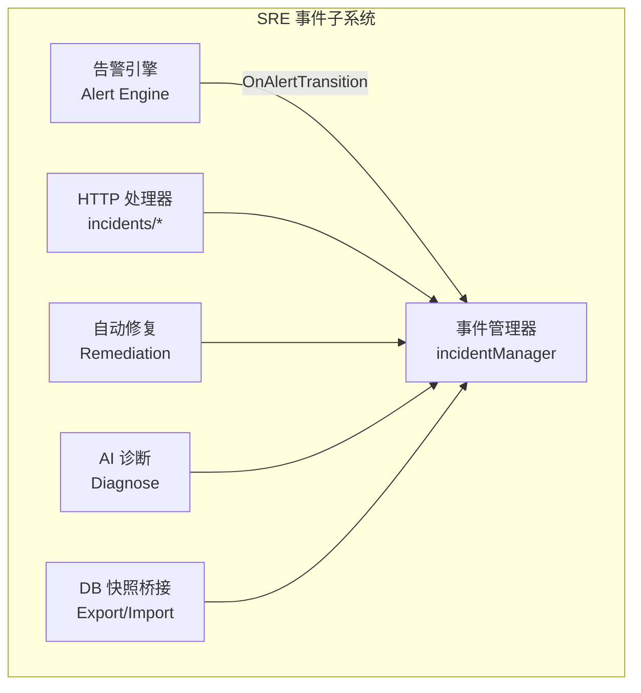
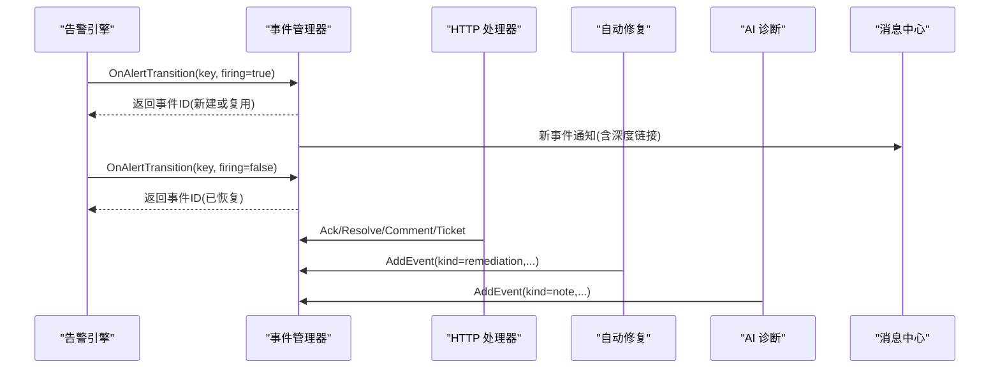
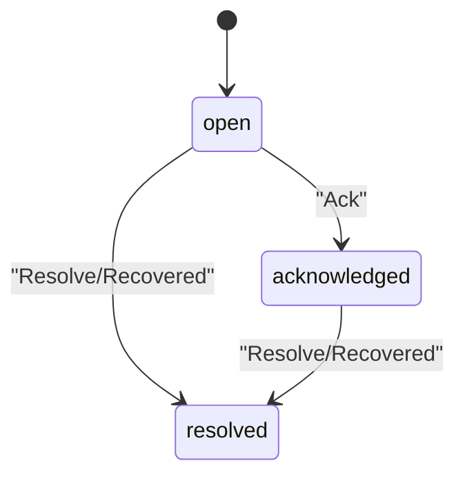
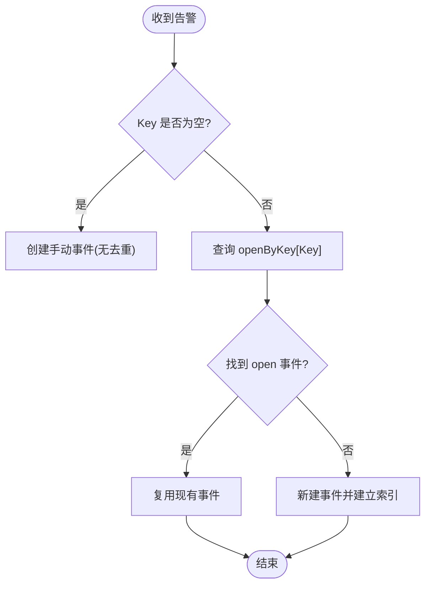
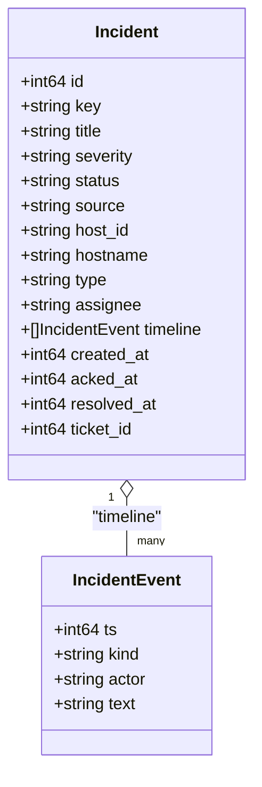
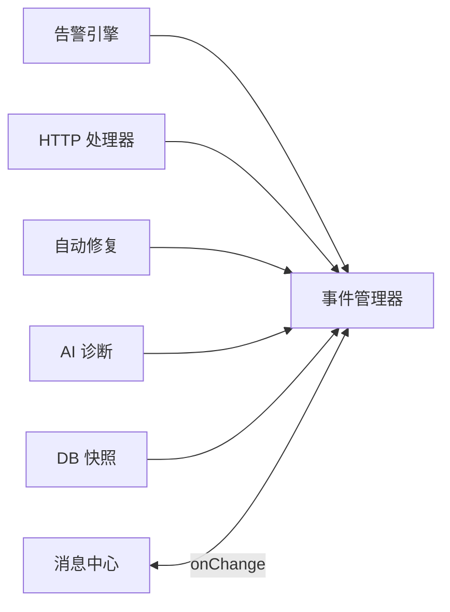

# 事件管理

<cite>
**本文引用的文件**   
- [incident.go](file://cmd/server/incident.go)
- [sre_api.go](file://cmd/server/sre_api.go)
- [handlers.go](file://cmd/server/handlers.go)
- [alerts.go](file://cmd/server/alerts.go)
- [remediation.go](file://cmd/server/remediation.go)
- [aiops.go](file://cmd/server/aiops.go)
- [db.go](file://cmd/server/db.go)
- [sre_test.go](file://cmd/server/sre_test.go)
- [README.md](file://README.md)
</cite>

## 目录
1. [简介](#简介)
2. [项目结构](#项目结构)
3. [核心组件](#核心组件)
4. [架构总览](#架构总览)
5. [详细组件分析](#详细组件分析)
6. [依赖关系分析](#依赖关系分析)
7. [性能与容量特性](#性能与容量特性)
8. [故障排查指南](#故障排查指南)
9. [结论](#结论)
10. [附录：API 使用示例与最佳实践](#附录api-使用示例与最佳实践)

## 简介
本章节面向 AIOps Monitor 的事件管理能力，围绕事件的完整生命周期、去重策略、时间线审计、以及与主机/告警/SLO/工单的关联进行系统化说明。读者可据此理解从“告警触发”到“自动修复尝试”，再到“人工确认/解决”的全链路闭环，并掌握 API 调用方式与配置建议。

## 项目结构
事件管理位于服务端 SRE 工作流层，核心由以下模块协作完成：
- 事件模型与内存管理器：定义事件实体、状态机、时间线与去重索引
- HTTP 路由与处理器：提供事件 CRUD、认领、解决、评论、升级工单等接口
- 告警引擎钩子：将告警的 firing/recover 转换为事件 raise/resolve
- 自动修复（Remediation）：在事件上追加自动化执行记录
- AI 诊断：对严重事件自动或手动根因分析，结果写入时间线
- 持久化桥接：通过 DB 快照导出/导入事件列表，保证重启恢复

图表来源
- [incident.go:1-120](file://cmd/server/incident.go#L1-L120)
- [sre_api.go:170-230](file://cmd/server/sre_api.go#L170-L230)
- [handlers.go:180-200](file://cmd/server/handlers.go#L180-L200)
- [remediation.go:188-229](file://cmd/server/remediation.go#L188-L229)
- [aiops.go:812-830](file://cmd/server/aiops.go#L812-L830)
- [db.go:74-80](file://cmd/server/db.go#L74-L80)

章节来源
- [incident.go:1-120](file://cmd/server/incident.go#L1-L120)
- [handlers.go:180-200](file://cmd/server/handlers.go#L180-L200)
- [sre_api.go:170-230](file://cmd/server/sre_api.go#L170-L230)
- [remediation.go:188-229](file://cmd/server/remediation.go#L188-L229)
- [aiops.go:812-830](file://cmd/server/aiops.go#L812-L830)
- [db.go:74-80](file://cmd/server/db.go#L74-L80)

## 核心组件
- Incident 事件实体：包含 ID、去重键 Key、标题、级别、状态、来源、主机信息、类型、处理人、时间线、创建/确认/解决时间、关联工单等字段
- IncidentEvent 时间线条目：记录时间戳、事件种类（created/fired/recovered/acked/resolved/remediation/comment/escalated/note 等）、操作者、文本
- incidentManager 事件管理器：维护事件列表、openByKey 去重索引、并发安全、变更回调 onChange、历史裁剪与导出/导入

关键要点
- 状态机：open → acknowledged → resolved；支持自动 recovered 直接置为 resolved
- 去重键 Key：来自告警 key 或 SLO 标识（如 slo/<id>），空值表示手动事件
- 时间线上限：最近 200 条保留；已解决事件总数超过阈值时裁剪最旧已解决项
- 变更回调：新事件/恢复事件会推送消息中心，critical 事件自动触发 AI 诊断

章节来源
- [incident.go:26-43](file://cmd/server/incident.go#L26-L43)
- [incident.go:18-24](file://cmd/server/incident.go#L18-L24)
- [incident.go:47-63](file://cmd/server/incident.go#L47-L63)
- [incident.go:75-83](file://cmd/server/incident.go#L75-L83)
- [incident.go:85-119](file://cmd/server/incident.go#L85-L119)
- [incident.go:121-148](file://cmd/server/incident.go#L121-L148)
- [incident.go:174-207](file://cmd/server/incident.go#L174-L207)
- [incident.go:282-297](file://cmd/server/incident.go#L282-L297)
- [incident.go:299-325](file://cmd/server/incident.go#L299-L325)

## 架构总览
事件管理的端到端流程如下：
- 告警触发：告警引擎根据阈值判定产生 Alert，调用 incidentManager.OnAlertTransition(firing=true)，按 Key 复用或新建事件
- 告警恢复：firing=false 时按 Key 查找并 resolve 对应事件
- 手动创建：通过 API 创建事件（Key 为空）
- 确认/解决：ack/resolve 更新状态并追加时间线
- 自动修复：匹配规则后执行剧本，向事件追加 remediation 记录
- AI 诊断：critical 事件自动诊断，或手动触发，结果以 note 写入时间线
- 持久化：服务启动时 Import 快照，运行期 Export 快照落库

图表来源
- [incident.go:150-163](file://cmd/server/incident.go#L150-L163)
- [sre_api.go:378-428](file://cmd/server/sre_api.go#L378-L428)
- [sre_api.go:430-465](file://cmd/server/sre_api.go#L430-L465)
- [remediation.go:188-229](file://cmd/server/remediation.go#L188-L229)
- [aiops.go:812-830](file://cmd/server/aiops.go#L812-L830)

章节来源
- [incident.go:150-163](file://cmd/server/incident.go#L150-L163)
- [sre_api.go:378-428](file://cmd/server/sre_api.go#L378-L428)
- [sre_api.go:430-465](file://cmd/server/sre_api.go#L430-L465)
- [remediation.go:188-229](file://cmd/server/remediation.go#L188-L229)
- [aiops.go:812-830](file://cmd/server/aiops.go#L812-L830)

## 详细组件分析

### 事件模型与状态机
- 字段与含义
  - Key：去重键，用于同一问题合并（告警 key 或 slo/<id>），手动事件为空
  - Status：open / acknowledged / resolved
  - Source：alert / slo / manual
  - HostID/Hostname：关联主机
  - Timeline：时间线数组，记录所有变更
  - TicketID：关联工单
- 状态转换
  - open → acknowledged：Ack
  - open/acknowledged → resolved：Resolve 或 Recovered
  - 任何状态均可追加 comment、remediation、note、escalated 等时间线

图表来源
- [incident.go:26-43](file://cmd/server/incident.go#L26-L43)
- [incident.go:174-207](file://cmd/server/incident.go#L174-L207)
- [incident.go:121-148](file://cmd/server/incident.go#L121-L148)

章节来源
- [incident.go:26-43](file://cmd/server/incident.go#L26-L43)
- [incident.go:174-207](file://cmd/server/incident.go#L174-L207)
- [incident.go:121-148](file://cmd/server/incident.go#L121-L148)

### 事件去重与抖动抑制
- 去重键 Key 的来源
  - 告警：由告警引擎生成（例如 host/type/scope 组合）
  - SLO：采用 slo/<id> 形式
  - 手动：Key 为空，不参与去重
- 去重逻辑
  - 当 Key 非空且存在相同 Key 的 open 事件，则复用该事件，避免抖动重复
  - 若索引失效（找不到对应事件），则降级为新建
- 恢复机制
  - 告警 recover 时按 Key 定位并 resolve 对应事件

图表来源
- [incident.go:85-119](file://cmd/server/incident.go#L85-L119)
- [incident.go:121-148](file://cmd/server/incident.go#L121-L148)

章节来源
- [incident.go:85-119](file://cmd/server/incident.go#L85-L119)
- [incident.go:121-148](file://cmd/server/incident.go#L121-L148)

### 时间线（Timeline）系统
- 时间线条目包含：时间戳、事件种类、操作者、文本
- 写入时机
  - created：事件创建
  - fired/recovered：告警触发/恢复
  - acked/resolved：人工确认/解决
  - remediation：自动修复尝试
  - comment：人工评论
  - escalated：升级为工单
  - note：AI 诊断结果等系统备注
- 容量控制
  - 单事件时间线最多保留最近 200 条
  - 全局已解决事件超过阈值时裁剪最旧项

图表来源
- [incident.go:26-43](file://cmd/server/incident.go#L26-L43)
- [incident.go:18-24](file://cmd/server/incident.go#L18-L24)
- [incident.go:75-83](file://cmd/server/incident.go#L75-L83)
- [incident.go:282-297](file://cmd/server/incident.go#L282-L297)

章节来源
- [incident.go:18-24](file://cmd/server/incident.go#L18-L24)
- [incident.go:75-83](file://cmd/server/incident.go#L75-L83)
- [incident.go:282-297](file://cmd/server/incident.go#L282-L297)

### 事件与主机、告警、SLO、工单的关联
- 主机
  - 事件携带 HostID/Hostname，便于快速定位资源
- 告警
  - 通过 OnAlertTransition 驱动事件开/关
- SLO
  - 燃尽预算耗尽时按 slo/<id> 作为 Key 创建事件
- 工单
  - 事件可升级为工单，工单解决/关闭时可反向自动解决事件

章节来源
- [incident.go:26-43](file://cmd/server/incident.go#L26-L43)
- [incident.go:150-163](file://cmd/server/incident.go#L150-L163)
- [sre_api.go:430-465](file://cmd/server/sre_api.go#L430-L465)

### API 接口与前端交互
- 路由注册
  - GET /api/v1/incidents
  - POST /api/v1/incidents
  - GET /api/v1/incidents/{id}
  - POST /api/v1/incidents/{id}/ack
  - POST /api/v1/incidents/{id}/resolve
  - POST /api/v1/incidents/{id}/comment
  - POST /api/v1/incidents/{id}/ticket
  - POST /api/v1/incidents/{id}/diagnose
- 处理器实现
  - 参数校验、Actor 提取、调用事件管理器方法、标记脏数据、返回 JSON
- 前端交互
  - 事件列表、详情、时间线展示
  - 一键评论、升级工单、AI 诊断（SSE 流式）

章节来源
- [handlers.go:180-200](file://cmd/server/handlers.go#L180-L200)
- [sre_api.go:341-428](file://cmd/server/sre_api.go#L341-L428)
- [sre_api.go:430-465](file://cmd/server/sre_api.go#L430-L465)

### 自动修复与事件联动
- 触发条件：告警触发时匹配修复规则
- 执行流程：排队审批或直接执行（受冷却/限频保护）
- 事件联动：执行开始/成功/失败均追加 remediation 时间线条目
- 通知：待审批/执行结果推送消息中心

章节来源
- [remediation.go:188-229](file://cmd/server/remediation.go#L188-L229)

### AI 诊断与事件联动
- 自动诊断：critical 事件创建时异步触发，结果以 note 写入时间线
- 手动诊断：通过 diagnose 接口触发，支持 SSE 流式输出
- 上下文：聚合事件元数据、主机指标、近期错误日志等

章节来源
- [sre_api.go:213-231](file://cmd/server/sre_api.go#L213-L231)
- [aiops.go:812-830](file://cmd/server/aiops.go#L812-L830)

## 依赖关系分析
- 组件耦合
  - incidentManager 被告警引擎、HTTP 处理器、自动修复、AI 诊断共同依赖
  - onChange 回调连接消息中心与 AI 诊断
- 外部依赖
  - DB 快照：Import/Export 用于持久化恢复
  - VM/Store：SLO 评估读取时序历史
- 潜在循环依赖
  - 通过回调函数注入依赖，避免直接强耦合

图表来源
- [incident.go:47-63](file://cmd/server/incident.go#L47-L63)
- [sre_api.go:26-52](file://cmd/server/sre_api.go#L26-L52)
- [db.go:74-80](file://cmd/server/db.go#L74-L80)

章节来源
- [incident.go:47-63](file://cmd/server/incident.go#L47-L63)
- [sre_api.go:26-52](file://cmd/server/sre_api.go#L26-L52)
- [db.go:74-80](file://cmd/server/db.go#L74-L80)

## 性能与容量特性
- 去重索引 O(1) 查找，避免抖动导致事件爆炸
- 时间线限制 200 条，防止大事件膨胀
- 已解决事件总量裁剪，保持内存占用稳定
- 变更回调异步执行（AI 诊断、消息推送），不阻塞主路径

章节来源
- [incident.go:75-83](file://cmd/server/incident.go#L75-L83)
- [incident.go:282-297](file://cmd/server/incident.go#L282-L297)
- [sre_api.go:213-231](file://cmd/server/sre_api.go#L213-L231)

## 故障排查指南
- 现象：同一告警反复产生多个事件
  - 检查 Key 是否一致（host/type/scope）
  - 确认未发生索引失效（openByKey 中找不到对应 ID）
- 现象：事件无法恢复
  - 检查告警恢复是否传入正确 Key
  - 确认事件未被手动 resolve 过
- 现象：时间线缺失
  - 确认各阶段调用 AddEvent 是否成功
  - 查看是否达到 200 条上限被裁剪
- 现象：AI 诊断未触发
  - 仅 critical 事件自动诊断，确认级别
  - 检查 onChange 回调是否注册

章节来源
- [incident.go:85-119](file://cmd/server/incident.go#L85-L119)
- [incident.go:121-148](file://cmd/server/incident.go#L121-L148)
- [incident.go:75-83](file://cmd/server/incident.go#L75-L83)
- [sre_api.go:213-231](file://cmd/server/sre_api.go#L213-L231)

## 结论
AIOps Monitor 的事件管理以 incidentManager 为核心，结合告警引擎、自动修复与 AI 诊断，形成“发现—确认—解决—复盘”的闭环。通过 Key 去重与时间线审计，有效抑制抖动噪音并提供完整的排障依据。配合统一的 API 与消息中心，运维团队可在统一入口高效协同。

## 附录：API 使用示例与最佳实践

- 事件列表
  - GET /api/v1/incidents
- 手动创建事件
  - POST /api/v1/incidents
  - 请求体：{title, severity?, host_id?}
- 获取事件详情
  - GET /api/v1/incidents/{id}
- 认领事件
  - POST /api/v1/incidents/{id}/ack
- 解决事件
  - POST /api/v1/incidents/{id}/resolve
- 追加评论
  - POST /api/v1/incidents/{id}/comment
  - 请求体：{text}
- 升级为工单
  - POST /api/v1/incidents/{id}/ticket
- AI 诊断
  - POST /api/v1/incidents/{id}/diagnose
  - 可选 stream=true，返回 SSE 流

最佳实践
- 合理设计 Key：确保同一问题在同一主机/类型/范围下复用事件
- 及时确认与解决：减少 open 事件数量，提升响应效率
- 善用评论与工单：沉淀排障过程，形成可追溯闭环
- 利用 AI 诊断：critical 事件自动诊断，必要时手动触发补充上下文
- 关注时间线：通过时间线回溯自动化修复与人工操作轨迹

章节来源
- [README.md:1223-1231](file://README.md#L1223-L1231)
- [sre_api.go:341-428](file://cmd/server/sre_api.go#L341-L428)
- [sre_api.go:430-465](file://cmd/server/sre_api.go#L430-L465)