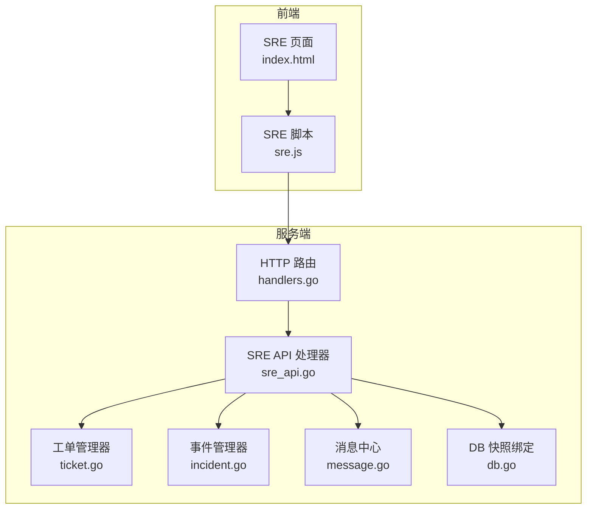
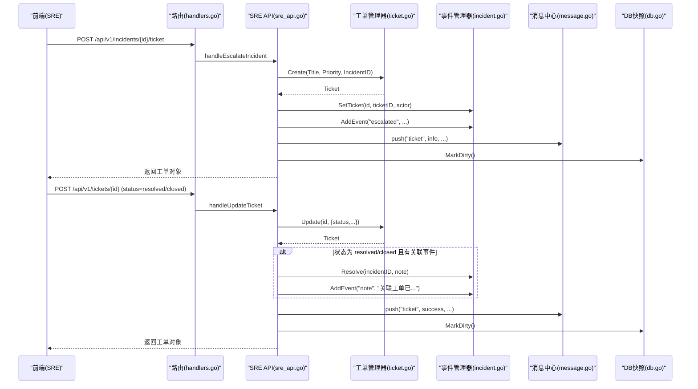
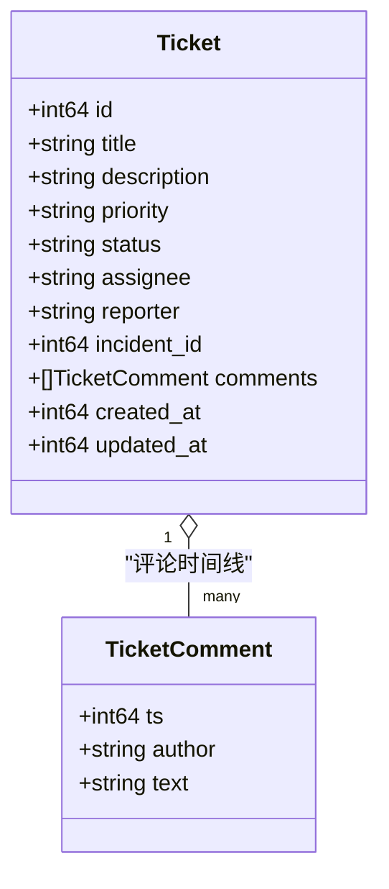
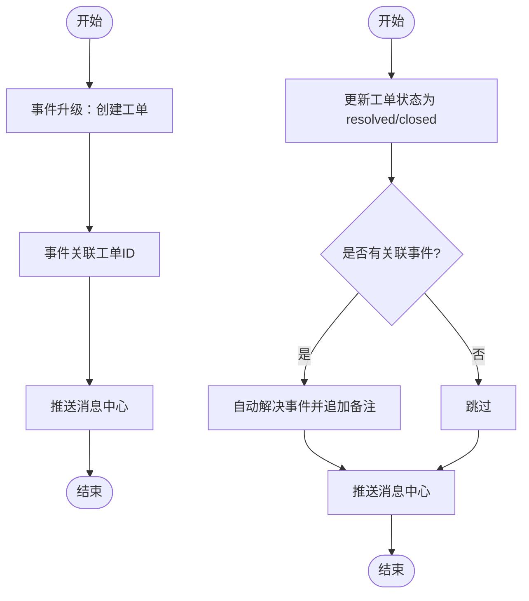
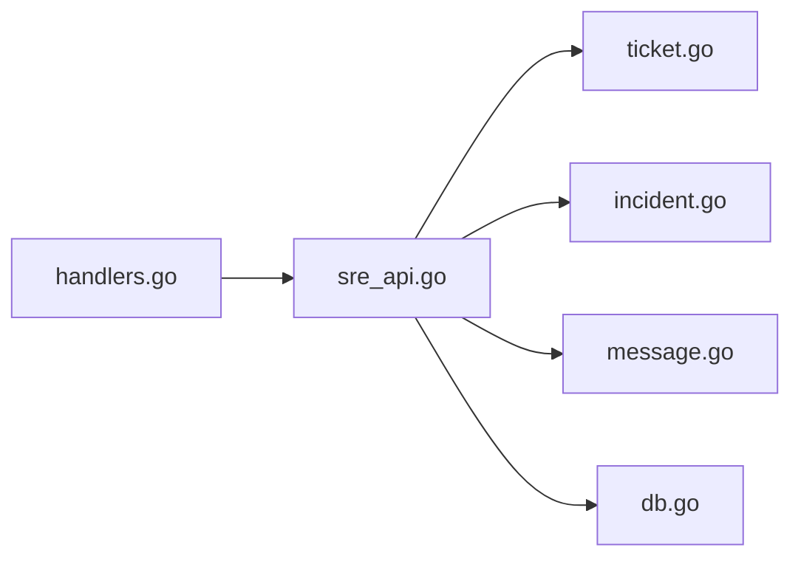

# 工单流转

<cite>
**本文引用的文件列表**
- [cmd/server/ticket.go](file://cmd/server/ticket.go)
- [cmd/server/incident.go](file://cmd/server/incident.go)
- [cmd/server/sre_api.go](file://cmd/server/sre_api.go)
- [cmd/server/handlers.go](file://cmd/server/handlers.go)
- [cmd/server/db.go](file://cmd/server/db.go)
- [cmd/server/message.go](file://cmd/server/message.go)
- [cmd/server/web/index.html](file://cmd/server/web/index.html)
- [cmd/server/web/js/sre.js](file://cmd/server/web/js/sre.js)
- [cmd/server/i18n/zh-CN.json](file://cmd/server/i18n/zh-CN.json)
</cite>

## 目录
1. [简介](#简介)
2. [项目结构](#项目结构)
3. [核心组件](#核心组件)
4. [架构总览](#架构总览)
5. [详细组件分析](#详细组件分析)
6. [依赖关系分析](#依赖关系分析)
7. [性能与扩展性](#性能与扩展性)
8. [故障排查指南](#故障排查指南)
9. [结论](#结论)
10. [附录](#附录)

## 简介
本文件面向 AIOps Monitor 的“工单流转”子系统，围绕工单的完整生命周期（创建、分配、处理、升级、关闭）进行系统化说明。重点覆盖：
- 工单与事件的关联机制：事件升级自动生成工单；工单解决后同步事件状态。
- 工单处理流程：状态跟踪、评论记录、附件上传能力现状与建议。
- 工单模板与自定义字段：当前实现与可扩展建议。
- 与其他系统的集成：Jira、ServiceNow 等第三方系统对接思路与落地路径。
- 最佳实践与性能优化建议。

## 项目结构
与工单流转直接相关的后端代码集中在 server 模块中，前端通过内嵌静态资源提供操作界面。关键文件如下：
- 数据模型与管理器：ticket.go、incident.go
- API 路由与处理器：handlers.go、sre_api.go
- 持久化绑定：db.go
- 消息中心：message.go
- 前端页面与交互：web/index.html、web/js/sre.js
- 国际化文案：i18n/*.json

图表来源
- [cmd/server/handlers.go:197-203](file://cmd/server/handlers.go#L197-L203)
- [cmd/server/sre_api.go:564-694](file://cmd/server/sre_api.go#L564-L694)
- [cmd/server/ticket.go:26-49](file://cmd/server/ticket.go#L26-L49)
- [cmd/server/incident.go:26-43](file://cmd/server/incident.go#L26-L43)
- [cmd/server/message.go:26-26](file://cmd/server/message.go#L26-L26)
- [cmd/server/db.go:74-75](file://cmd/server/db.go#L74-L75)

章节来源
- [cmd/server/handlers.go:197-203](file://cmd/server/handlers.go#L197-L203)
- [cmd/server/sre_api.go:564-694](file://cmd/server/sre_api.go#L564-L694)
- [cmd/server/ticket.go:26-49](file://cmd/server/ticket.go#L26-L49)
- [cmd/server/incident.go:26-43](file://cmd/server/incident.go#L26-L43)
- [cmd/server/message.go:26-26](file://cmd/server/message.go#L26-L26)
- [cmd/server/db.go:74-75](file://cmd/server/db.go#L74-L75)

## 核心组件
- 工单模型与生命周期
  - 字段：ID、标题、描述、优先级（p1-p4）、状态（open/in_progress/resolved/closed）、负责人、报告人、关联事件 ID、评论时间线、创建/更新时间。
  - 状态机：open → in_progress → resolved → closed（支持回退更新）。
  - 评论：每次状态变更或指派变更自动写入系统评论；用户可追加普通评论。
- 事件模型与生命周期
  - 字段：ID、去重键、标题、严重级别、状态（open/acknowledged/resolved）、来源、主机信息、时间线、关联工单 ID。
  - 生命周期：告警触发→事件创建/复用→确认→解决；恢复时自动解决。
- 关联机制
  - 事件升级：POST /api/v1/incidents/{id}/ticket 将事件升级为工单，并回填事件的时间线与消息中心通知。
  - 工单解决联动：当工单状态变为 resolved/closed，且存在关联事件，则自动将事件标记为已解决，并在事件时间线追加备注。

章节来源
- [cmd/server/ticket.go:26-49](file://cmd/server/ticket.go#L26-L49)
- [cmd/server/incident.go:26-43](file://cmd/server/incident.go#L26-L43)
- [cmd/server/sre_api.go:440-465](file://cmd/server/sre_api.go#L440-L465)
- [cmd/server/sre_api.go:640-660](file://cmd/server/sre_api.go#L640-L660)

## 架构总览
从请求到落库的整体调用链如下：

图表来源
- [cmd/server/handlers.go:187-203](file://cmd/server/handlers.go#L187-L203)
- [cmd/server/sre_api.go:440-465](file://cmd/server/sre_api.go#L440-L465)
- [cmd/server/sre_api.go:625-660](file://cmd/server/sre_api.go#L625-L660)
- [cmd/server/ticket.go:64-118](file://cmd/server/ticket.go#L64-L118)
- [cmd/server/incident.go:221-229](file://cmd/server/incident.go#L221-L229)
- [cmd/server/message.go:26-26](file://cmd/server/message.go#L26-L26)
- [cmd/server/db.go:74-75](file://cmd/server/db.go#L74-L75)

## 详细组件分析

### 工单数据模型与状态机
- 数据结构
  - 工单包含基础元数据、优先级、状态、负责人、报告人、关联事件 ID、评论时间线、时间戳。
- 状态与优先级
  - 优先级：p1/p2/p3/p4，默认 p3；无效值会被规范化。
  - 状态：open/in_progress/resolved/closed，非法值会被拒绝。
- 评论与审计
  - 状态变更与指派变更均会生成系统评论，便于追踪。
  - 用户评论独立追加，不改变状态。

图表来源
- [cmd/server/ticket.go:26-39](file://cmd/server/ticket.go#L26-L39)
- [cmd/server/ticket.go:19-24](file://cmd/server/ticket.go#L19-L24)

章节来源
- [cmd/server/ticket.go:26-49](file://cmd/server/ticket.go#L26-L49)
- [cmd/server/ticket.go:64-118](file://cmd/server/ticket.go#L64-L118)

### 事件与工单的关联与联动
- 事件升级生成工单
  - 入口：POST /api/v1/incidents/{id}/ticket
  - 行为：根据事件严重级别映射优先级（critical→p1），创建工单并设置描述来源；在事件时间线追加“已升级”条目；推送消息中心通知。
- 工单解决联动事件
  - 入口：POST /api/v1/tickets/{id}（status=resolved/closed）
  - 行为：若工单状态为 resolved/closed 且存在关联事件，则自动将事件标记为已解决，并在事件时间线追加备注。

图表来源
- [cmd/server/sre_api.go:440-465](file://cmd/server/sre_api.go#L440-L465)
- [cmd/server/sre_api.go:640-660](file://cmd/server/sre_api.go#L640-L660)
- [cmd/server/incident.go:221-229](file://cmd/server/incident.go#L221-L229)

章节来源
- [cmd/server/sre_api.go:440-465](file://cmd/server/sre_api.go#L440-L465)
- [cmd/server/sre_api.go:640-660](file://cmd/server/sre_api.go#L640-L660)
- [cmd/server/incident.go:221-229](file://cmd/server/incident.go#L221-L229)

### 工单处理流程（状态跟踪、评论、附件、超时提醒）
- 状态跟踪
  - 通过 GET /api/v1/tickets/{id} 获取工单详情，响应中包含关联事件摘要，便于追溯。
- 评论记录
  - 通过 POST /api/v1/tickets/{id}/comment 追加评论；状态/指派变更会自动生成系统评论。
- 附件上传
  - 当前工单模型未定义附件字段，API 也未暴露附件上传接口。可在后续扩展 Comment 或新增 Attachment 表以支持。
- 超时提醒
  - 当前未内置基于时间的超时策略。可通过外部调度器扫描 open/in_progress 工单，结合阈值配置发送消息中心或邮件提醒。

章节来源
- [cmd/server/sre_api.go:568-607](file://cmd/server/sre_api.go#L568-L607)
- [cmd/server/sre_api.go:662-683](file://cmd/server/sre_api.go#L662-L683)
- [cmd/server/ticket.go:120-135](file://cmd/server/ticket.go#L120-L135)

### 工单模板与自定义字段
- 当前实现
  - 工单字段固定（标题、描述、优先级、状态、负责人、报告人、关联事件、评论、时间戳）。
  - 前端弹窗提供标题、优先级、状态选择，无模板与自定义字段配置项。
- 可扩展方案
  - 在 Ticket 结构中增加 JSONB 字段（如 custom_fields）用于存储动态字段。
  - 在前端增加模板管理（名称、默认字段集、必填校验规则），在创建工单时按模板填充。
  - 在 API 层对自定义字段进行白名单校验与类型约束。

章节来源
- [cmd/server/ticket.go:26-39](file://cmd/server/ticket.go#L26-L39)
- [cmd/server/web/index.html:1453-1463](file://cmd/server/web/index.html#L1453-L1463)

### 与其他系统的集成（Jira、ServiceNow 等）
- 现状
  - 当前未内置 Jira/ServiceNow 等第三方工单系统的直连逻辑。
- 推荐集成模式
  - 双向同步：本地工单与第三方工单建立映射表（local_ticket_id ↔ external_ticket_id），在本地工单状态变化时调用第三方 API 同步；第三方回调或轮询拉取状态变更。
  - 事件联动：事件升级时同时创建第三方工单，并将外部工单号回填至本地工单描述或自定义字段。
  - 安全与重试：使用密钥管理、签名校验、幂等键与重试队列，确保跨系统一致性。
  - 错误处理：失败进入死信队列，提供人工补偿与重试面板。

[本节为概念性内容，无需源码引用]

## 依赖关系分析
- 组件耦合
  - sre_api.go 作为编排层，协调 ticketManager 与 incidentManager，并通过 message.go 推送统一消息。
  - db.go 负责将 incidentManager 与 ticketManager 的状态导出/导入到数据库快照，保证重启后可恢复。
- 外部依赖
  - 前端通过 handlers.go 暴露的 REST API 与后端交互。
  - 消息中心聚合工单、事件、AI 诊断等通知，供仪表盘展示。

图表来源
- [cmd/server/handlers.go:197-203](file://cmd/server/handlers.go#L197-L203)
- [cmd/server/sre_api.go:564-694](file://cmd/server/sre_api.go#L564-L694)
- [cmd/server/db.go:74-75](file://cmd/server/db.go#L74-L75)

章节来源
- [cmd/server/handlers.go:197-203](file://cmd/server/handlers.go#L197-L203)
- [cmd/server/sre_api.go:564-694](file://cmd/server/sre_api.go#L564-L694)
- [cmd/server/db.go:74-75](file://cmd/server/db.go#L74-L75)

## 性能与扩展性
- 内存管理与持久化
  - 工单与事件均为内存结构，通过 Export/Import 与 DB 快照桥接，重启后恢复。
  - 建议在大规模场景下引入分页查询与增量同步，避免一次性加载全量数据。
- 并发与锁
  - 管理器内部使用互斥锁保护共享状态，注意在高并发写场景下的热点竞争。
- 消息中心
  - 工单状态变更仅对终端状态（resolved/closed）推送成功通知，降低噪音。
- 可扩展点
  - 插件化集成：为第三方系统对接提供插件钩子，统一事件驱动。
  - 异步任务：将耗时操作（如第三方 API 调用）放入后台任务队列，提升主流程吞吐。

章节来源
- [cmd/server/ticket.go:182-202](file://cmd/server/ticket.go#L182-L202)
- [cmd/server/incident.go:299-324](file://cmd/server/incident.go#L299-L324)
- [cmd/server/sre_api.go:640-660](file://cmd/server/sre_api.go#L640-L660)

## 故障排查指南
- 常见问题
  - 工单不存在：GET/UPDATE/COMMENT/DELETE 时若 ID 无效，返回未找到错误。
  - 参数校验失败：创建/更新时若 JSON 解析错误或字段非法，返回相应错误。
  - 关联事件未解决：检查事件是否已被其他流程解决，避免重复解决。
- 定位方法
  - 查看事件时间线：确认是否存在“已升级”、“已解决”等条目。
  - 查看消息中心：确认是否有新工单、工单状态变更的通知。
  - 检查 DB 快照：确认工单与事件数据是否正确导出/导入。

章节来源
- [cmd/server/sre_api.go:568-579](file://cmd/server/sre_api.go#L568-L579)
- [cmd/server/sre_api.go:608-624](file://cmd/server/sre_api.go#L608-L624)
- [cmd/server/sre_api.go:625-641](file://cmd/server/sre_api.go#L625-L641)
- [cmd/server/sre_api.go:662-683](file://cmd/server/sre_api.go#L662-L683)
- [cmd/server/sre_api.go:684-694](file://cmd/server/sre_api.go#L684-L694)

## 结论
AIOps Monitor 的工单流转子系统提供了轻量但完整的工单管理能力，并与事件体系紧密联动：事件升级自动生成工单，工单解决自动联动事件状态。当前版本聚焦于核心闭环，尚未内置第三方系统集成、附件上传与超时策略。建议在此基础上逐步扩展模板与自定义字段、插件化集成与异步任务队列，以满足企业级运维需求。

[本节为总结性内容，无需源码引用]

## 附录

### API 清单（与工单相关）
- 列表：GET /api/v1/tickets
- 创建：POST /api/v1/tickets
- 详情：GET /api/v1/tickets/{id}
- 更新：POST /api/v1/tickets/{id}
- 评论：POST /api/v1/tickets/{id}/comment
- 删除：DELETE /api/v1/tickets/{id}
- 事件升级：POST /api/v1/incidents/{id}/ticket

章节来源
- [cmd/server/handlers.go:197-203](file://cmd/server/handlers.go#L197-L203)
- [cmd/server/handlers.go:187-187](file://cmd/server/handlers.go#L187-L187)

### 前端交互要点
- 新建工单弹窗：提供标题、优先级、状态选择，支持从事件上下文快速创建。
- 事件详情页：提供“升级工单”按钮，点击后调用事件升级接口。

章节来源
- [cmd/server/web/index.html:1453-1463](file://cmd/server/web/index.html#L1453-L1463)
- [cmd/server/web/js/sre.js:517-517](file://cmd/server/web/js/sre.js#L517-L517)

### 国际化文案示例
- “由事件 #X 升级生成”
- “新工单：...”
- “工单已解决/已关闭”

章节来源
- [cmd/server/i18n/zh-CN.json:248-248](file://cmd/server/i18n/zh-CN.json#L248-L248)
- [cmd/server/sre_api.go:440-465](file://cmd/server/sre_api.go#L440-L465)
- [cmd/server/sre_api.go:640-660](file://cmd/server/sre_api.go#L640-L660)