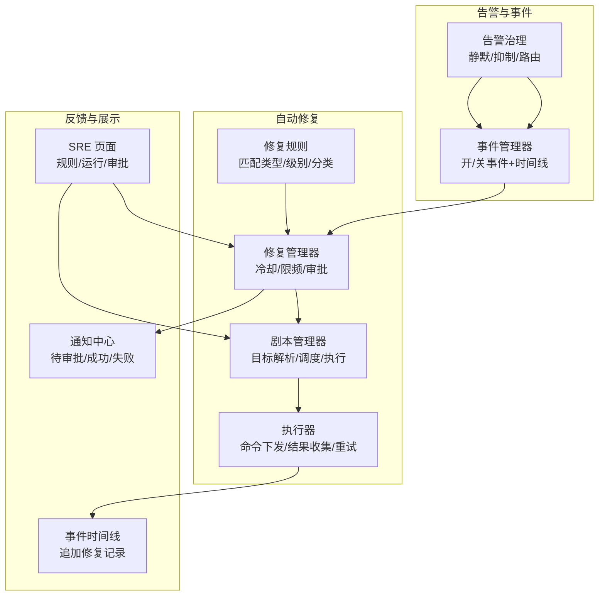
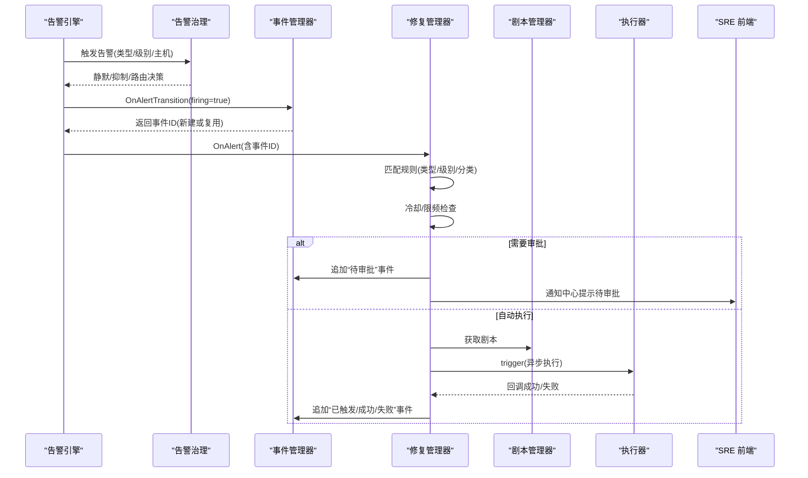
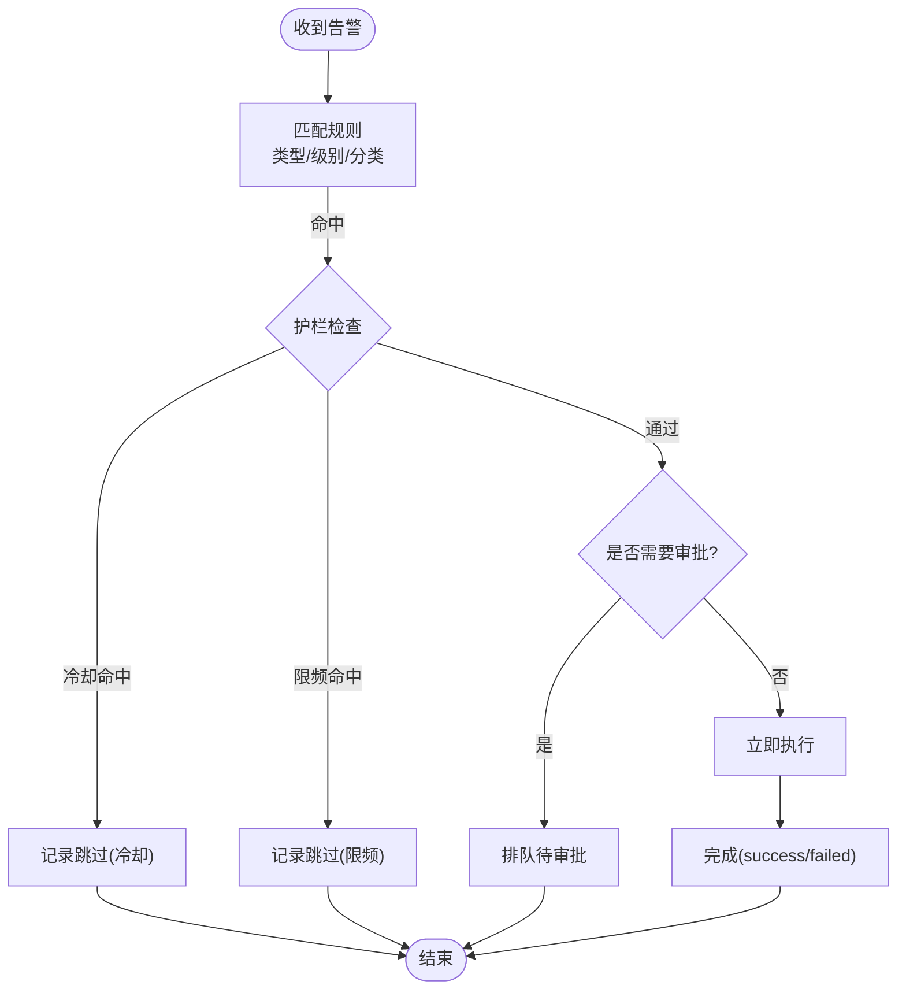
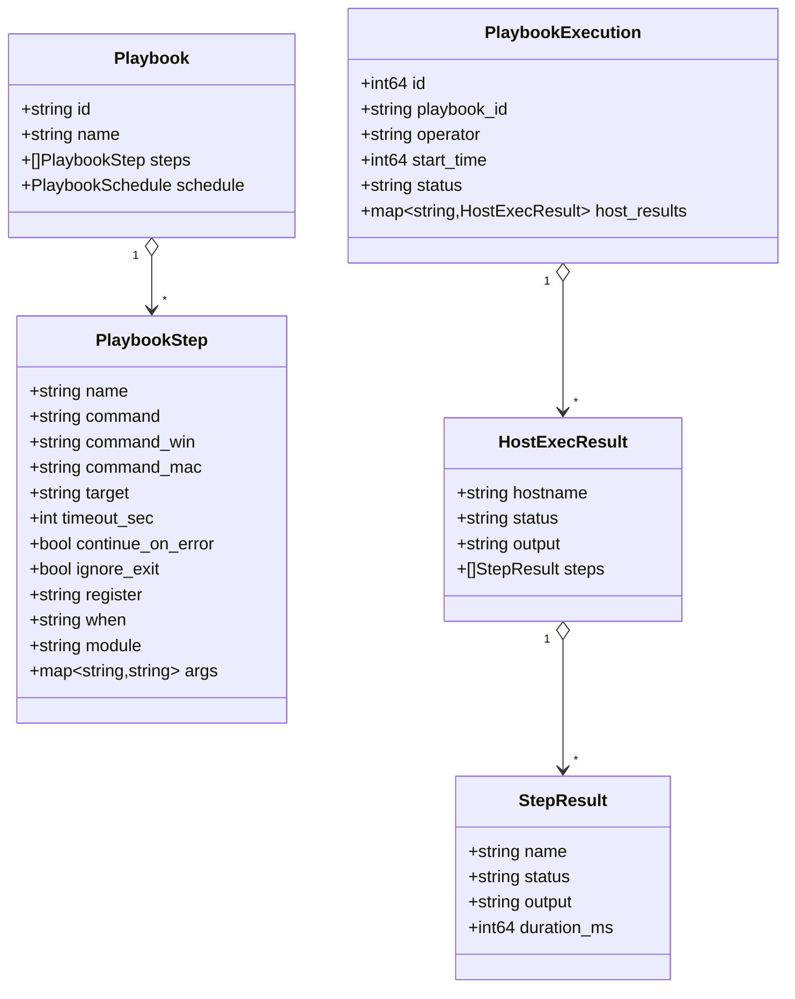
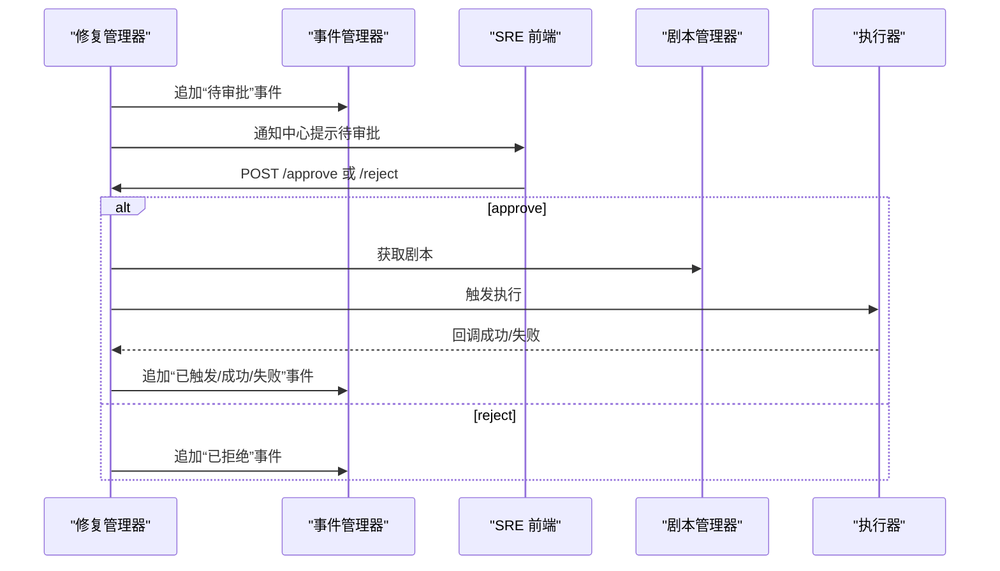
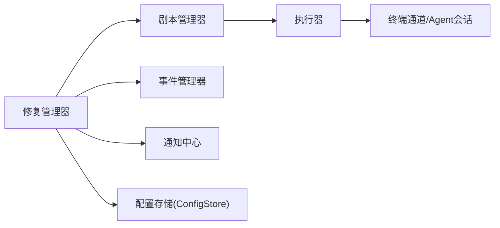

# 自动修复

<cite>
**本文引用的文件列表**
- [remediation.go](file://cmd/server/remediation.go)
- [playbook.go](file://cmd/server/playbook.go)
- [playbook_api.go](file://cmd/server/playbook_api.go)
- [alertgov.go](file://cmd/server/alertgov.go)
- [incident.go](file://cmd/server/incident.go)
- [config.go](file://cmd/server/config.go)
- [index.html](file://cmd/server/web/index.html)
- [sre.js](file://cmd/server/web/js/sre.js)
- [i18n zh-CN.json](file://cmd/server/i18n/zh-CN.json)
</cite>

## 目录
1. [简介](#简介)
2. [项目结构](#项目结构)
3. [核心组件](#核心组件)
4. [架构总览](#架构总览)
5. [详细组件分析](#详细组件分析)
6. [依赖关系分析](#依赖关系分析)
7. [性能与稳定性](#性能与稳定性)
8. [故障排查指南](#故障排查指南)
9. [结论](#结论)
10. [附录：配置示例与最佳实践](#附录配置示例与最佳实践)

## 简介
本章节面向 AIOps Monitor 的“自动修复”能力，系统性说明以下主题：
- 自动修复规则的触发条件：基于事件类型、严重级别、主机分类等匹配逻辑（当前实现未包含持续时间维度）。
- 修复剧本执行机制：命令下发、脚本执行、结果收集、错误处理与重试。
- 人工审批流程：二次确认开关、待审批队列与操作界面。
- 执行结果反馈：成功/失败状态更新、事件时间线记录、通知中心推送。
- 失败重试策略：内置按基础设施类失败的线性退避重试；Agent 侧提供指数退避重连。
- 回滚策略：当前版本未内置自动回滚，建议通过剧本步骤或外部系统实现。
- 实际规则配置示例与常见问题排查路径。

## 项目结构
自动修复功能由“告警治理 → 事件聚合 → 规则匹配 → 审批/限频/冷却 → 剧本执行 → 结果反馈”构成闭环。关键代码位于服务端模块中，前端提供规则管理、执行历史与审批操作入口。

图表来源
- [alertgov.go:147-194](file://cmd/server/alertgov.go#L147-L194)
- [incident.go:150-163](file://cmd/server/incident.go#L150-L163)
- [remediation.go:103-147](file://cmd/server/remediation.go#L103-L147)
- [playbook.go:255-304](file://cmd/server/playbook.go#L255-L304)
- [playbook_api.go:206-312](file://cmd/server/playbook_api.go#L206-L312)
- [index.html:547-556](file://cmd/server/web/index.html#L547-L556)

章节来源
- [alertgov.go:147-194](file://cmd/server/alertgov.go#L147-L194)
- [incident.go:150-163](file://cmd/server/incident.go#L150-L163)
- [remediation.go:103-147](file://cmd/server/remediation.go#L103-L147)
- [playbook.go:255-304](file://cmd/server/playbook.go#L255-L304)
- [playbook_api.go:206-312](file://cmd/server/playbook_api.go#L206-L312)
- [index.html:547-556](file://cmd/server/web/index.html#L547-L556)

## 核心组件
- 修复规则（RemediationRule）：定义匹配条件与护栏（是否需审批、冷却秒数、每小时上限），并关联一个剧本 ID。
- 修复管理器（remediationManager）：维护运行记录、冷却与限频计数，负责审批流与触发执行。
- 剧本管理器（playbookManager）：存储与校验剧本、解析目标主机、定时触发、执行历史。
- 执行器（Server.runPlaybookExecution/execCommandOnHost）：并行执行步骤、变量替换、when 条件、忽略退出码、重试与结果汇总。
- 事件管理器（incidentManager）：统一事件生命周期与时间线，自动修复过程会追加事件条目。
- 告警治理（AlertGovernance）：静默、抑制、路由，影响后续通知与事件生成。

章节来源
- [remediation.go:21-36](file://cmd/server/remediation.go#L21-L36)
- [remediation.go:72-93](file://cmd/server/remediation.go#L72-L93)
- [playbook.go:12-20](file://cmd/server/playbook.go#L12-L20)
- [playbook.go:82-92](file://cmd/server/playbook.go#L82-L92)
- [playbook_api.go:206-312](file://cmd/server/playbook_api.go#L206-L312)
- [incident.go:26-43](file://cmd/server/incident.go#L26-L43)
- [alertgov.go:84-89](file://cmd/server/alertgov.go#L84-L89)

## 架构总览
自动修复从“告警触发”到“事件时间线”的全链路如下：

图表来源
- [alertgov.go:147-194](file://cmd/server/alertgov.go#L147-L194)
- [incident.go:150-163](file://cmd/server/incident.go#L150-L163)
- [remediation.go:135-229](file://cmd/server/remediation.go#L135-L229)
- [playbook_api.go:206-312](file://cmd/server/playbook_api.go#L206-L312)

## 详细组件分析

### 自动修复规则与触发条件
- 匹配维度
  - 事件类型：支持按类型集合匹配，空表示任意类型。
  - 严重级别：支持最小级别过滤（warning/critical）。
  - 主机分类：可按主机分类过滤。
  - 持续时长：当前实现未包含持续时间维度。
- 护栏
  - 人工审批：开启后进入待审批队列，不直接执行。
  - 冷却：同一规则+主机的最小间隔秒数。
  - 限频：同一规则每小时最大次数（0=不限）。
- 状态机
  - pending_approval / running / success / failed / skipped_cooldown / skipped_ratelimit / rejected / no_playbook

图表来源
- [remediation.go:103-147](file://cmd/server/remediation.go#L103-L147)
- [remediation.go:149-205](file://cmd/server/remediation.go#L149-L205)

章节来源
- [remediation.go:21-36](file://cmd/server/remediation.go#L21-L36)
- [remediation.go:103-147](file://cmd/server/remediation.go#L103-L147)
- [remediation.go:149-205](file://cmd/server/remediation.go#L149-L205)
- [i18n zh-CN.json:218-232](file://cmd/server/i18n/zh-CN.json#L218-L232)

### 修复剧本的执行机制
- 剧本模型
  - 步骤列表：每步可指定命令、跨平台覆盖命令、超时、继续错误、忽略非零退出码、register 变量、when 条件、内置模块调用。
  - 目标选择：all、category:xxx、system:os、host:ID。
  - 定时触发：interval/daily/weekly。
- 执行流程
  - 并行度限制：并发主机数上限。
  - 变量替换：{{var}} 注入主机事实与 register 累积变量。
  - when 条件：满足才执行该步。
  - 命令解析：模块 > 分系统覆盖 > 默认命令。
  - 执行与重试：对“基础设施类失败”进行最多 N 次重试（线性退避）；真实命令非零退出码不重试。
  - 结果收集：每步输出、耗时、状态；整台主机结果汇总；整体执行状态 completed/failed。
- 错误处理
  - 无 Agent 接单：标记为“未接单”，可重试。
  - 执行超时：保留部分输出，标记超时，可重试。
  - 异常结束：会话异常结束，可重试。
  - 非零退出码：视为真实失败，不重试（除非设置忽略退出码）。

图表来源
- [playbook.go:12-52](file://cmd/server/playbook.go#L12-L52)
- [playbook.go:54-80](file://cmd/server/playbook.go#L54-L80)
- [playbook_api.go:206-312](file://cmd/server/playbook_api.go#L206-L312)

章节来源
- [playbook.go:12-52](file://cmd/server/playbook.go#L12-L52)
- [playbook.go:255-304](file://cmd/server/playbook.go#L255-L304)
- [playbook_api.go:206-312](file://cmd/server/playbook_api.go#L206-L312)
- [playbook_api.go:339-423](file://cmd/server/playbook_api.go#L339-L423)

### 人工审批流程与二次确认
- 审批开关：规则中的 require_approval 字段控制是否进入待审批队列。
- 待审批事件：在事件时间线追加“待审批”事件，并通过通知中心提醒。
- 审批操作：SRE 页面提供批准/拒绝按钮，批准后占用冷却/限频配额并触发执行；拒绝则记录拒绝事件。
- 界面入口：SRE · 自动修复 页显示规则与运行记录，并提供审批操作。

图表来源
- [remediation.go:182-205](file://cmd/server/remediation.go#L182-L205)
- [remediation.go:264-311](file://cmd/server/remediation.go#L264-L311)
- [index.html:547-556](file://cmd/server/web/index.html#L547-L556)
- [sre.js:731-740](file://cmd/server/web/js/sre.js#L731-L740)

章节来源
- [remediation.go:182-205](file://cmd/server/remediation.go#L182-L205)
- [remediation.go:264-311](file://cmd/server/remediation.go#L264-L311)
- [index.html:547-556](file://cmd/server/web/index.html#L547-L556)
- [sre.js:731-740](file://cmd/server/web/js/sre.js#L731-L740)

### 执行结果的反馈机制
- 状态更新：修复运行记录状态包括 pending_approval、running、success、failed、skipped_cooldown、skipped_ratelimit、rejected、no_playbook。
- 事件时间线：每次关键状态变更都会追加事件条目（如“已触发”“成功”“失败”“被拒绝”）。
- 通知中心：待审批、成功、失败均会推送消息，便于快速响应。
- 前端展示：SRE 页面列出规则与运行记录，支持查看原因与审批操作。

章节来源
- [remediation.go:39-57](file://cmd/server/remediation.go#L39-L57)
- [remediation.go:231-262](file://cmd/server/remediation.go#L231-L262)
- [i18n zh-CN.json:218-232](file://cmd/server/i18n/zh-CN.json#L218-L232)
- [index.html:547-556](file://cmd/server/web/index.html#L547-L556)

### 失败重试策略与回滚策略
- 剧本层重试
  - 仅对基础设施类失败（未接单、超时、异常结束）进行重试，真实命令非零退出码不重试。
  - 最大尝试次数与线性退避间隔可参考常量（例如最大尝试次数与每次退避秒数）。
- Agent 层重连
  - Agent 侧使用带抖动的指数退避算法进行连接重试，避免雪崩。
- 回滚策略
  - 当前版本未内置自动回滚。建议在剧本中显式编写回滚步骤，或在外部系统中实现幂等与补偿。

章节来源
- [playbook_api.go:190-204](file://cmd/server/playbook_api.go#L190-L204)
- [playbook_api.go:240-270](file://cmd/server/playbook_api.go#L240-L270)
- [playbook_api.go:314-333](file://cmd/server/playbook_api.go#L314-L333)
- [terminal.go:75-108](file://cmd/agent/terminal.go#L75-L108)
- [infra.go:160-176](file://cmd/agent/infra.go#L160-L176)

## 依赖关系分析
- 组件耦合
  - 修复管理器依赖剧本管理器（获取剧本）、事件管理器（追加事件）、通知中心（推送消息）。
  - 执行器依赖终端通道与 Agent 会话，具备并发控制与重试逻辑。
- 外部依赖
  - 持久化：配置与执行历史通过 ConfigStore 与数据库快照桥接。
  - 国际化：所有用户可见文本通过 Tz/Tr 函数加载本地化文案。

图表来源
- [remediation.go:72-93](file://cmd/server/remediation.go#L72-L93)
- [playbook_api.go:206-312](file://cmd/server/playbook_api.go#L206-L312)
- [config.go:407-489](file://cmd/server/config.go#L407-L489)

章节来源
- [remediation.go:72-93](file://cmd/server/remediation.go#L72-L93)
- [playbook_api.go:206-312](file://cmd/server/playbook_api.go#L206-L312)
- [config.go:407-489](file://cmd/server/config.go#L407-L489)

## 性能与稳定性
- 并发控制：执行器限制并发主机数量，避免“惊群效应”。
- 去抖与限频：修复管理器对同规则+主机设置冷却，对规则设置每小时上限，防止风暴。
- 重试与退避：对基础设施类失败进行有限次重试；Agent 端指数退避重连，降低瞬时抖动影响。
- 资源保护：执行输出大小限制、历史记录裁剪、任务繁忙标志防堆积。

[本节为通用指导，无需源码引用]

## 故障排查指南
- 规则未触发
  - 检查规则是否启用、类型/级别/分类是否匹配。
  - 检查冷却与限频是否命中。
- 待审批未执行
  - 在 SRE 页面查看待审批列表并进行批准/拒绝。
- 执行失败
  - 查看运行记录的 reason 与步骤输出，区分“基础设施失败”与“真实命令失败”。
  - 若为“未接单/超时/异常结束”，可等待自动重试或调整超时与重试参数。
- 目标主机不可达
  - 检查主机在线状态与 Agent 连通性。
- 通知缺失
  - 检查通知渠道配置与告警治理（静默/抑制/路由）是否命中。

章节来源
- [remediation.go:149-205](file://cmd/server/remediation.go#L149-L205)
- [remediation.go:207-229](file://cmd/server/remediation.go#L207-L229)
- [playbook_api.go:240-270](file://cmd/server/playbook_api.go#L240-L270)
- [alertgov.go:147-194](file://cmd/server/alertgov.go#L147-L194)

## 结论
AIOps Monitor 的自动修复以“规则匹配 + 护栏 + 剧本执行 + 事件反馈”为核心，提供了安全可控的自动化闭环。通过人工审批、冷却与限频，有效避免了误触与风暴；通过重试与退避提升了大规模执行的鲁棒性。对于复杂场景，建议结合剧本内回滚步骤与外部系统进行补偿与审计。

[本节为总结，无需源码引用]

## 附录：配置示例与最佳实践

### 自动修复规则配置要点
- 必填项：名称、关联剧本 ID。
- 可选匹配：类型集合、最小级别、主机分类。
- 护栏：是否需审批、冷却秒数、每小时上限。
- 验证：级别必须为 warning 或 critical；冷却与上限不得为负。

章节来源
- [remediation.go:399-418](file://cmd/server/remediation.go#L399-L418)
- [i18n zh-CN.json:218-232](file://cmd/server/i18n/zh-CN.json#L218-L232)

### 修复剧本配置要点
- 步骤：至少一个步骤；每个步骤建议设置合理超时。
- 目标：优先使用 category/system/host 精确选择，避免全量主机。
- 变量：利用 {{host_id}}、{{hostname}}、{{ip}}、{{os}}、{{category}} 与 register 变量传递上下文。
- 条件：使用 when 控制分支执行。
- 模块：优先使用内置模块（gather_facts/service/package/copy）提升可移植性。
- 定时：interval/daily/weekly 按需启用，注意服务器时区与去重。

章节来源
- [playbook.go:12-52](file://cmd/server/playbook.go#L12-L52)
- [playbook.go:255-304](file://cmd/server/playbook.go#L255-L304)
- [playbook_api.go:53-85](file://cmd/server/playbook_api.go#L53-L85)

### 人工审批与界面操作
- 在 SRE · 自动修复 页面创建规则并勾选“需审批”。
- 待审批出现后，点击“批准”或“拒绝”完成二次确认。
- 查看运行记录与原因，必要时调整规则或剧本。

章节来源
- [index.html:547-556](file://cmd/server/web/index.html#L547-L556)
- [sre.js:710-742](file://cmd/server/web/js/sre.js#L710-L742)

### 失败重试与回滚建议
- 重试：对“未接单/超时/异常结束”自动重试；真实命令失败不建议重试。
- 回滚：在剧本中显式编写回滚步骤，或使用外部编排系统实现幂等与补偿。

章节来源
- [playbook_api.go:240-270](file://cmd/server/playbook_api.go#L240-L270)
- [playbook_api.go:314-333](file://cmd/server/playbook_api.go#L314-L333)