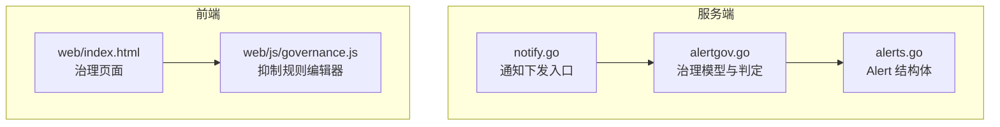
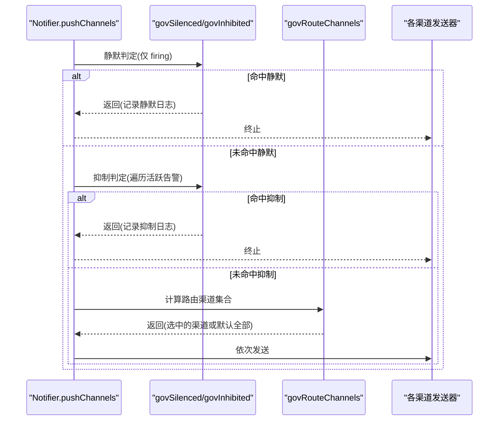
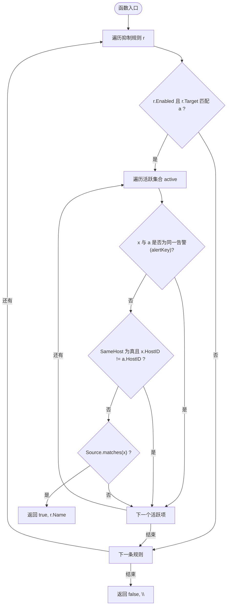

# 告警抑制机制

<cite>
**本文引用的文件**   
- [alertgov.go](file://cmd/server/alertgov.go)
- [notify.go](file://cmd/server/notify.go)
- [alerts.go](file://cmd/server/alerts.go)
- [alertgov_test.go](file://cmd/server/alertgov_test.go)
- [governance.js](file://cmd/server/web/js/governance.js)
- [index.html](file://cmd/server/web/index.html)
</cite>

## 目录
1. [简介](#简介)
2. [项目结构](#项目结构)
3. [核心组件](#核心组件)
4. [架构总览](#架构总览)
5. [详细组件分析](#详细组件分析)
6. [依赖关系分析](#依赖关系分析)
7. [性能考量](#性能考量)
8. [故障排查指南](#故障排查指南)
9. [结论](#结论)
10. [附录：常见抑制场景配置示例](#附录常见抑制场景配置示例)

## 简介
本文件聚焦 AIOps Monitor 的“告警抑制”机制，围绕 InhibitRule 结构设计、SameHost 字段语义、govInhibited 判断流程与活跃告警集合交互进行深度解析，并给出典型基础设施级联告警抑制的配置思路。同时对比“抑制规则”与“静默规则”的差异与适用场景，帮助读者在复杂运维环境中有效降噪、避免告警风暴。

## 项目结构
与告警抑制相关的代码主要位于服务端模块中：
- 治理模型与判定逻辑集中在 alertgov.go
- 通知下发前调用治理决策（静默/抑制/路由）在 notify.go
- 告警数据结构定义在 alerts.go
- 前端治理页面与交互在 web 目录下（index.html、governance.js）
- 行为验证与用例在 alertgov_test.go

图表来源
- [alertgov.go:64-89](file://cmd/server/alertgov.go#L64-L89)
- [notify.go:196-210](file://cmd/server/notify.go#L196-L210)
- [alerts.go:170-182](file://cmd/server/alerts.go#L170-L182)
- [index.html:491-507](file://cmd/server/web/index.html#L491-L507)
- [governance.js:64-66](file://cmd/server/web/js/governance.js#L64-L66)

章节来源
- [alertgov.go:1-226](file://cmd/server/alertgov.go#L1-L226)
- [notify.go:196-276](file://cmd/server/notify.go#L196-L276)
- [alerts.go:170-182](file://cmd/server/alerts.go#L170-L182)
- [index.html:491-507](file://cmd/server/web/index.html#L491-L507)
- [governance.js:64-66](file://cmd/server/web/js/governance.js#L64-L66)

## 核心组件
- AlertMatch：三类规则共用的匹配条件，支持主机名/IP 子串匹配、类型集合、级别集合；任一留空表示不限。
- SilenceRule：静默规则，命中后不推送通知（仍记录、UI 可见），可带生效时段与星期。
- InhibitRule：抑制规则，当存在匹配 Source 的其它活跃告警时，抑制匹配 Target 的告警通知；SameHost 用于限定同主机场景。
- NotifyRoute：通知路由，按匹配条件选择渠道集合，未命中则回退默认全部渠道。
- AlertGovernance：治理配置总集，包含静默、抑制、路由三组规则。
- Alert：告警实体，包含 HostID、Type、Level、Scope 等关键字段，用于去重与匹配。

章节来源
- [alertgov.go:20-89](file://cmd/server/alertgov.go#L20-L89)
- [alerts.go:170-182](file://cmd/server/alerts.go#L170-L182)

## 架构总览
通知下发前的治理决策流程如下：
- 仅对“触发(firing)”通知执行静默与抑制；“恢复”通知一律照发，避免“永远告警”错觉。
- 先检查静默规则，命中则直接返回，不再进入抑制与路由。
- 再检查抑制规则，若命中则记录日志并返回，不再进入路由与发送。
- 最后根据路由规则决定渠道集合；无路由命中时回退到全部启用渠道。

图表来源
- [notify.go:196-210](file://cmd/server/notify.go#L196-L210)
- [alertgov.go:147-176](file://cmd/server/alertgov.go#L147-L176)
- [alertgov.go:178-194](file://cmd/server/alertgov.go#L178-L194)

## 详细组件分析

### InhibitRule 结构设计
- 字段说明
  - ID/Name/Enabled：规则标识、名称、是否启用。
  - Source：源告警匹配条件，用于描述“根因告警”的特征（如类型=offline）。
  - Target：目标告警匹配条件，用于描述“被抑制的衍生告警”特征（如类型=cpu/memory）。
  - SameHost：是否要求源与目标同主机。开启后，只有当源和目标 HostID 一致时才考虑抑制，常用于“主机离线→抑制其自身指标告警”。
- 设计要点
  - Source 与 Target 分离，使“根因→衍生”的关系清晰可配，便于组合多种根因与多类衍生告警。
  - SameHost 提供强约束，避免跨主机的误抑制，提升抑制精度。

章节来源
- [alertgov.go:64-72](file://cmd/server/alertgov.go#L64-L72)
- [governance.js:64-66](file://cmd/server/web/js/governance.js#L64-L66)

### govInhibited 抑制判断逻辑
- 输入：治理配置 g、待判定的告警 a、当前活跃告警集合 active。
- 关键步骤
  1) 遍历所有抑制规则 r，跳过未启用或 Target 不匹配的项。
  2) 遍历活跃集合 active，排除自身（通过 alertKey 比较，避免自我抑制）。
  3) 若 SameHost 为真且 x.HostID != a.HostID，则跳过该活跃项。
  4) 若 Source.matches(x) 为真，则判定抑制命中，返回规则名。
- 输出：是否抑制及命中的规则名。

图表来源
- [alertgov.go:157-176](file://cmd/server/alertgov.go#L157-L176)
- [notify.go:54-54](file://cmd/server/notify.go#L54-L54)

章节来源
- [alertgov.go:157-176](file://cmd/server/alertgov.go#L157-L176)
- [notify.go:54-54](file://cmd/server/notify.go#L54-L54)

### 与通知下发的集成点
- pushChannels 在 firing 分支内先调用 govSilenced，再调用 govInhibited，二者任一命中即提前返回，并记录系统日志。
- 未被抑制的告警继续进入路由选择，最终发送到飞书、钉钉、邮件、Webhook、短信、语音等渠道。

章节来源
- [notify.go:196-210](file://cmd/server/notify.go#L196-L210)
- [notify.go:212-276](file://cmd/server/notify.go#L212-L276)

### 与 Alert 结构的关联
- Alert 的 HostID、Type、Level、Scope 等字段参与匹配与去重。
- alertKey 使用 HostID/Type/Scope 作为唯一键，确保“不被自己抑制”的判断准确。

章节来源
- [alerts.go:170-182](file://cmd/server/alerts.go#L170-L182)
- [notify.go:54-54](file://cmd/server/notify.go#L54-L54)

### 前端交互与 SameHost 开关
- 治理页面提供“抑制规则”编辑区，其中 SameHost 以复选框呈现，提示“仅同主机抑制”，推荐用于“主机离线时抑制其自身 CPU/内存告警”的场景。

章节来源
- [index.html:491-507](file://cmd/server/web/index.html#L491-L507)
- [governance.js:64-66](file://cmd/server/web/js/governance.js#L64-L66)

## 依赖关系分析
- 模块耦合
  - notify.go 依赖 alertgov.go 的 govSilenced/govInhibited/govRouteChannels。
  - alertgov.go 依赖 alerts.go 的 Alert 结构以及内部 alertKey 工具。
- 外部依赖
  - 通知渠道（飞书、钉钉、邮件、Webhook、短信、语音）由 ServerConfig 控制，不在本节展开。
- 潜在循环
  - 当前实现未见循环依赖；治理逻辑单向作用于通知路径。

图表来源
- [notify.go:196-210](file://cmd/server/notify.go#L196-L210)
- [alertgov.go:147-194](file://cmd/server/alertgov.go#L147-L194)
- [alerts.go:170-182](file://cmd/server/alerts.go#L170-L182)

章节来源
- [notify.go:196-210](file://cmd/server/notify.go#L196-L210)
- [alertgov.go:147-194](file://cmd/server/alertgov.go#L147-L194)
- [alerts.go:170-182](file://cmd/server/alerts.go#L170-L182)

## 性能考量
- 抑制判定复杂度
  - govInhibited 的时间复杂度约为 O(R × A)，其中 R 为抑制规则数量，A 为活跃告警数量。
  - 建议将高频触发的根因告警（如 offline）放在靠前的规则位置，以便尽早短路。
- 匹配优化
  - AlertMatch 的匹配为字符串子串与集合包含，尽量缩小 Types/Levels 列表规模，减少不必要的匹配开销。
- 路由选择
  - govRouteChannels 在未被抑制后才执行，通常代价较低；如无路由命中，回退到全渠道，注意渠道数量对发送时延的影响。

[本节为通用性能讨论，无需特定文件引用]

## 故障排查指南
- 现象：某告警未按预期被抑制
  - 检查 SameHost 是否开启，确认源与目标的 HostID 一致。
  - 检查 Source 与 Target 的匹配条件是否正确（类型、级别、主机模式）。
  - 确认激活的活跃集合中确实存在匹配的源告警。
- 现象：抑制后仍收到通知
  - 确认 gating 顺序：静默优先于抑制，若被静默则不会进入抑制；反之亦然。
  - 查看系统日志中是否记录了“抑制规则已抑制通知”的信息。
- 现象：不同主机也被抑制
  - 关闭 SameHost 或将 SameHost 设为真，确保只允许同主机抑制。
- 现象：自身被抑制
  - 系统已通过 alertKey 排除自身，若出现异常，请检查 Scope 是否导致 key 不一致。

章节来源
- [alertgov.go:157-176](file://cmd/server/alertgov.go#L157-L176)
- [notify.go:196-210](file://cmd/server/notify.go#L196-L210)

## 结论
- InhibitRule 通过 Source/Target 分离表达“根因→衍生”的抑制关系，SameHost 提供同主机强约束，适合处理基础设施故障引发的级联告警。
- govInhibited 的实现简洁高效，结合活跃告警集合与自身排除，保证抑制精准且不自我影响。
- 抑制与静默各司其职：抑制基于“其他活跃告警”的动态上下文，静默基于“时间窗/星期”的静态策略；两者配合可实现更精细的告警治理。

[本节为总结性内容，无需特定文件引用]

## 附录：常见抑制场景配置示例
以下为典型场景的配置思路（字段含义见上文）：
- 主机离线 → 抑制同主机的 CPU/内存告警
  - Source.Types = ["offline"]
  - Target.Types = ["cpu", "memory"]
  - SameHost = true
- 数据库节点不可用 → 抑制该节点上的 API 超时与任务失败告警
  - Source.Types = ["check"], Source.HostPattern = "db-*"
  - Target.Types = ["api", "task"], Target.HostPattern = "db-*"
  - SameHost = true
- 机房网络中断 → 抑制该机房下所有主机的磁盘 IO 告警
  - Source.Types = ["offline"], Source.HostPattern = "dc-a-"
  - Target.Types = ["diskio"], Target.HostPattern = "dc-a-"
  - SameHost = false（跨主机但同机房范围）

章节来源
- [alertgov_test.go:79-108](file://cmd/server/alertgov_test.go#L79-L108)
- [alertgov.go:64-72](file://cmd/server/alertgov.go#L64-L72)