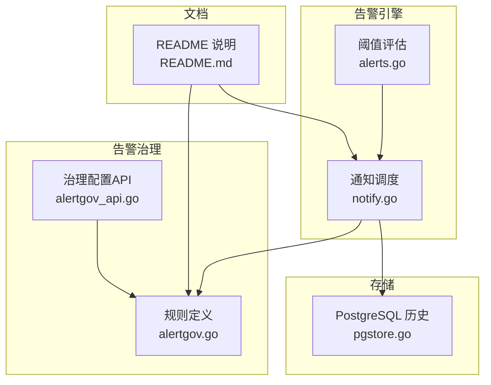
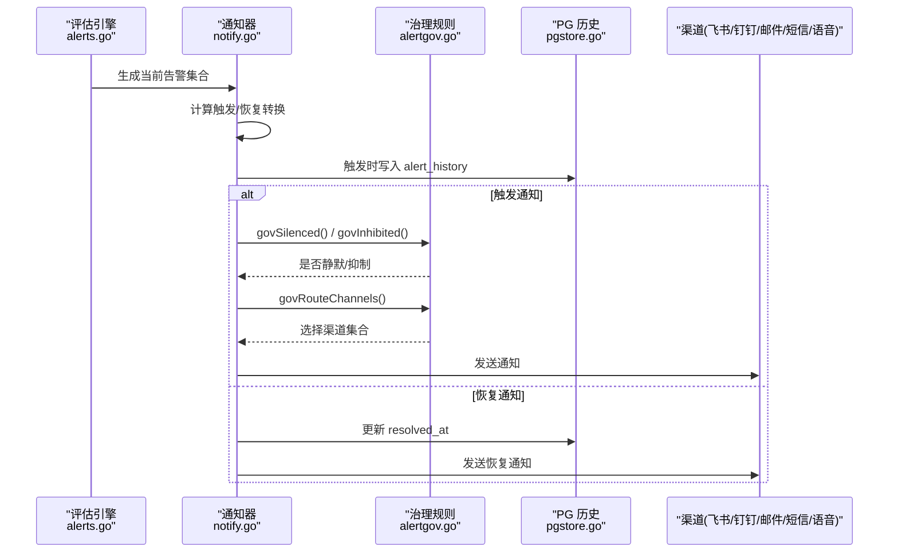
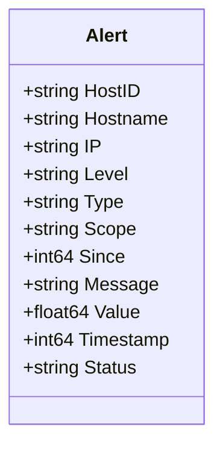
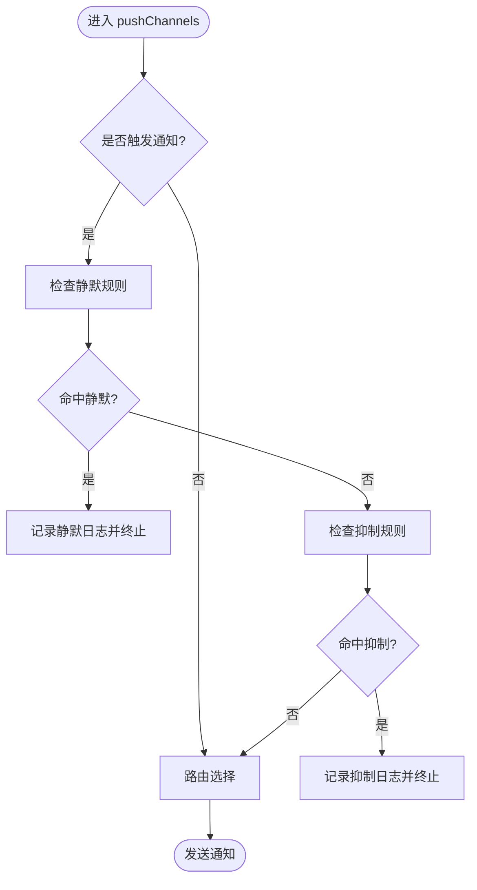
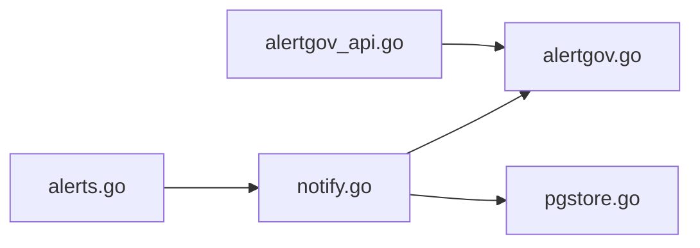

# 告警治理机制

<cite>
**本文引用的文件**   
- [alertgov.go](file://cmd/server/alertgov.go)
- [alertgov_api.go](file://cmd/server/alertgov_api.go)
- [alerts.go](file://cmd/server/alerts.go)
- [notify.go](file://cmd/server/notify.go)
- [pgstore.go](file://cmd/server/pgstore.go)
- [README.md](file://README.md)
</cite>

## 目录
1. [简介](#简介)
2. [项目结构](#项目结构)
3. [核心组件](#核心组件)
4. [架构总览](#架构总览)
5. [详细组件分析](#详细组件分析)
6. [依赖关系分析](#依赖关系分析)
7. [性能与可扩展性](#性能与可扩展性)
8. [故障排查指南](#故障排查指南)
9. [结论](#结论)
10. [附录：最佳实践](#附录最佳实践)

## 简介
本文件面向 AIOps Monitor 的“告警治理”能力，系统性阐述以下机制：
- 告警抑制：基于主机、类型、时间段的智能抑制策略，避免告警风暴与重复通知。
- 告警去重：通过 Scope 字段实现细粒度合并，防止同一问题多次告警。
- 告警升级：支持基于持续时间的自动升级与手动升级操作（概念说明）。
- 状态管理：确认（acknowledged）、静默（silenced）、恢复等状态转换。
- 历史记录查询与分析：按时间范围、主机、类型等多维度筛选。
- 最佳实践与性能优化建议。

## 项目结构
与告警治理相关的核心代码位于服务端模块中，关键文件如下：
- 规则定义与匹配：alertgov.go
- 治理配置 API：alertgov_api.go
- 阈值评估与告警生成：alerts.go
- 通知调度与渠道推送：notify.go
- 历史持久化与读取：pgstore.go
- 用户文档与入口说明：README.md

图表来源
- [alertgov.go:1-226](file://cmd/server/alertgov.go#L1-L226)
- [alertgov_api.go:1-56](file://cmd/server/alertgov_api.go#L1-L56)
- [alerts.go:166-178](file://cmd/server/alerts.go#L166-L178)
- [notify.go:160-276](file://cmd/server/notify.go#L160-L276)
- [pgstore.go:411-448](file://cmd/server/pgstore.go#L411-L448)
- [README.md:745-755](file://README.md#L745-L755)

章节来源
- [alertgov.go:1-226](file://cmd/server/alertgov.go#L1-L226)
- [alertgov_api.go:1-56](file://cmd/server/alertgov_api.go#L1-L56)
- [alerts.go:166-178](file://cmd/server/alerts.go#L166-L178)
- [notify.go:160-276](file://cmd/server/notify.go#L160-L276)
- [pgstore.go:411-448](file://cmd/server/pgstore.go#L411-L448)
- [README.md:745-755](file://README.md#L745-L755)

## 核心组件
- 告警对象 Alert：包含主机标识、级别、类型、Scope、消息、时间戳、状态等字段，是治理与通知的最小单元。
- 治理配置 AlertGovernance：包含三类规则——静默（SilenceRule）、抑制（InhibitRule）、路由（NotifyRoute）。
- 通知器 Notifier：周期性评估告警、计算触发/恢复转换、执行治理决策、写入历史并推送至各渠道。
- 历史存储：在 PostgreSQL 中记录告警生命周期事件（触发/恢复），并提供最近记录加载接口。

章节来源
- [alerts.go:166-178](file://cmd/server/alerts.go#L166-L178)
- [alertgov.go:85-89](file://cmd/server/alertgov.go#L85-L89)
- [notify.go:26-52](file://cmd/server/notify.go#L26-L52)
- [pgstore.go:411-448](file://cmd/server/pgstore.go#L411-L448)

## 架构总览
下图展示从指标评估到通知下发的完整链路，以及治理层在通知前的介入点。

图表来源
- [notify.go:102-192](file://cmd/server/notify.go#L102-L192)
- [alertgov.go:147-194](file://cmd/server/alertgov.go#L147-L194)
- [pgstore.go:411-448](file://cmd/server/pgstore.go#L411-L448)

## 详细组件分析

### 1) 告警模型与去重键
- Alert 关键字段：HostID、Type、Scope、Level、Message、Timestamp、Status。
- 去重键：由 HostID + Type + Scope 组成，用于判定是否为同一问题的不同实例。
- Scope 的作用：对磁盘路径、GPU 子项、API 指标子项等进行细粒度区分，避免跨目标的误合并。

图表来源
- [alerts.go:166-178](file://cmd/server/alerts.go#L166-L178)

章节来源
- [alerts.go:166-178](file://cmd/server/alerts.go#L166-L178)
- [notify.go:54](file://cmd/server/notify.go#L54)

### 2) 告警抑制与静默
- 静默规则（SilenceRule）：按主机模式、类型、级别匹配，支持时段（HH:MM，可跨天）与星期，命中则不推送通知（仍记录与展示）。
- 抑制规则（InhibitRule）：当存在匹配的 Source 活跃告警时，抑制 Target 的通知；可选 SameHost 限定同主机场景（如主机离线抑制其 CPU/内存告警）。
- 生效判断：activeNow 根据星期与时段计算当前是否命中；govSilenced/govInhibited 返回命中的规则名以便日志追踪。

图表来源
- [notify.go:196-276](file://cmd/server/notify.go#L196-L276)
- [alertgov.go:121-176](file://cmd/server/alertgov.go#L121-L176)

章节来源
- [alertgov.go:53-89](file://cmd/server/alertgov.go#L53-L89)
- [alertgov.go:121-176](file://cmd/server/alertgov.go#L121-L176)
- [notify.go:196-276](file://cmd/server/notify.go#L196-L276)

### 3) 通知路由
- NotifyRoute：按匹配条件决定仅发往指定渠道（如 feishu/dingtalk/smtp/webhook/sms/voicecall）。
- Continue 语义：命中后是否继续匹配后续路由；未命中任何路由时回退为默认全部启用渠道。
- 路由选择函数 govRouteChannels 返回选定的渠道集合与是否命中标志。

章节来源
- [alertgov.go:74-89](file://cmd/server/alertgov.go#L74-L89)
- [alertgov.go:178-194](file://cmd/server/alertgov.go#L178-L194)
- [notify.go:208-211](file://cmd/server/notify.go#L208-L211)

### 4) 治理配置 API
- GET /api/v1/alert-governance：返回当前治理配置（静默/抑制/路由）。
- POST /api/v1/alert-governance：整体替换治理配置；服务端清洗无名规则并为缺 ID 的规则补稳定 ID。

章节来源
- [alertgov_api.go:11-56](file://cmd/server/alertgov_api.go#L11-L56)
- [alertgov.go:198-226](file://cmd/server/alertgov.go#L198-L226)

### 5) 告警评估与 Scope 使用
- Evaluate/EvaluateForward：根据主机最新指标与转发快照生成告警列表。
- Scope 的典型用法：
  - 磁盘告警：以磁盘路径作为 Scope，避免多盘告警互相覆盖。
  - GPU 告警：分别用 name、name/temp、name/mem 作为 Scope，避免同一 GPU 的多指标冲突。
  - API/任务/转发：以指标子项作为 Scope，确保细粒度独立跟踪。

章节来源
- [alerts.go:205-464](file://cmd/server/alerts.go#L205-L464)
- [alerts.go:466-516](file://cmd/server/alerts.go#L466-L516)

### 6) 通知调度与去重
- Notifier.tick：周期评估，计算触发/恢复转换；仅在状态变化时推送，避免持续条件刷屏。
- active/since/recordIDs：维护当前活跃告警、首次触发时间与 PG 记录 ID，支撑时长显示与恢复更新。
- dispatch：触发时写入 alert_history，恢复时更新 resolved_at；随后调用 pushChannels 进行治理与推送。

章节来源
- [notify.go:56-158](file://cmd/server/notify.go#L56-L158)
- [notify.go:160-192](file://cmd/server/notify.go#L160-L192)
- [pgstore.go:411-448](file://cmd/server/pgstore.go#L411-L448)

### 7) 告警状态管理
- Alert.Status 字段支持 acknowledged、silenced 等状态标记，便于 UI 展示与人工干预。
- 注意：当前通知流程中，静默/抑制仅影响“是否推送”，不影响 Alert 对象的 Status 字段；恢复通知不受静默影响，确保故障解除可知。

章节来源
- [alerts.go:166-178](file://cmd/server/alerts.go#L166-L178)
- [notify.go:196-276](file://cmd/server/notify.go#L196-L276)

### 8) 告警升级策略
- 自动升级（概念）：可根据持续时间或连续次数将 warning 升级为 critical。当前代码未内置该逻辑，可在 Notifier 的 tick 阶段结合 since 时间戳扩展实现。
- 手动升级（概念）：通过 API 修改 Alert.Status 或创建事件/工单，驱动升级流程。当前代码提供 Alert.Status 字段与事件/工单体系的基础设施，可作为扩展点。

[本节为概念性说明，不直接分析具体文件]

### 9) 历史记录查询与分析
- 触发/恢复事件持久化于 PostgreSQL 表 alert_history，包含 key、fired_at、resolved_at 及数据体。
- 提供最近 N 条记录的加载接口，可用于面板“最近告警”展示与导出。
- 前端侧提供时间范围、主机、类型等筛选能力（参考 README 中“告警治理”与“最近活动”相关描述）。

章节来源
- [pgstore.go:411-448](file://cmd/server/pgstore.go#L411-L448)
- [README.md:745-755](file://README.md#L745-L755)

## 依赖关系分析
- 评估引擎（alerts.go）产出告警列表，供通知器消费。
- 通知器（notify.go）在推送前调用治理规则（alertgov.go）进行静默/抑制/路由决策。
- 通知器与存储（pgstore.go）交互，记录触发与恢复事件。
- 治理配置 API（alertgov_api.go）读写治理配置，影响通知器的决策结果。

图表来源
- [alerts.go:166-178](file://cmd/server/alerts.go#L166-L178)
- [notify.go:102-192](file://cmd/server/notify.go#L102-L192)
- [alertgov.go:147-194](file://cmd/server/alertgov.go#L147-L194)
- [alertgov_api.go:11-56](file://cmd/server/alertgov_api.go#L11-L56)
- [pgstore.go:411-448](file://cmd/server/pgstore.go#L411-L448)

章节来源
- [alerts.go:166-178](file://cmd/server/alerts.go#L166-L178)
- [notify.go:102-192](file://cmd/server/notify.go#L102-L192)
- [alertgov.go:147-194](file://cmd/server/alertgov.go#L147-L194)
- [alertgov_api.go:11-56](file://cmd/server/alertgov_api.go#L11-L56)
- [pgstore.go:411-448](file://cmd/server/pgstore.go#L411-L448)

## 性能与可扩展性
- 去重键设计：HostID+Type+Scope 保证细粒度合并，降低通道压力与用户噪音。
- 状态转换推送：仅在 fire/resolve 时推送，避免持续条件刷屏。
- 治理规则匹配：字符串匹配与时间计算开销低，适合高频评估。
- 可扩展点：
  - 自动升级：在 tick 中依据 since 与阈值策略动态提升级别。
  - 更丰富的路由：结合业务标签、租户、SLA 等级进行分流。
  - 历史归档：对 alert_history 增加分区或 TTL，控制存储增长。

[本节提供通用指导，不直接分析具体文件]

## 故障排查指南
- 通知未送达：
  - 检查是否被静默规则命中：查看系统日志中“静默规则已抑制通知”的记录。
  - 检查是否被抑制规则命中：查看“抑制规则已抑制通知”的记录。
  - 检查路由选择：确认是否命中路由且渠道开启。
- 告警重复：
  - 核对 Scope 是否正确设置，避免不同目标被合并。
  - 确认去重键是否与预期一致（HostID/Type/Scope）。
- 恢复通知缺失：
  - 恢复通知不受静默影响，若未收到，检查渠道配置与网络连通性。
- 历史查询异常：
  - 确认 PG 连接与表结构正常，最近记录加载接口可用。

章节来源
- [notify.go:196-276](file://cmd/server/notify.go#L196-L276)
- [pgstore.go:411-448](file://cmd/server/pgstore.go#L411-L448)

## 结论
AIOps Monitor 的告警治理机制在通知下发前引入静默、抑制与路由三层决策，配合基于 Scope 的去重键与仅在状态转换时推送的策略，有效抑制告警风暴与重复通知。治理配置通过 API 集中管理，历史事件持久化于 PostgreSQL，便于审计与回溯。未来可在自动升级、精细化路由与历史归档方面进一步扩展，以满足更大规模与更复杂的运维场景。

[本节为总结性内容，不直接分析具体文件]

## 附录：最佳实践
- 合理设置 Scope：为磁盘、GPU、API 等子项明确 Scope，避免误合并。
- 夜间静默：配置时段与星期的静默规则，减少非工作时间打扰。
- 主因抑制：为主机离线等根因告警配置抑制规则，屏蔽衍生告警。
- 路由分流：严重走电话/钉钉，警告走飞书/邮件，保持信息分层。
- 定期审查：清理无效规则，关注静默/抑制命中日志，优化策略。
- 容量规划：对 alert_history 实施分区或保留策略，避免无限增长。

[本节为通用建议，不直接分析具体文件]