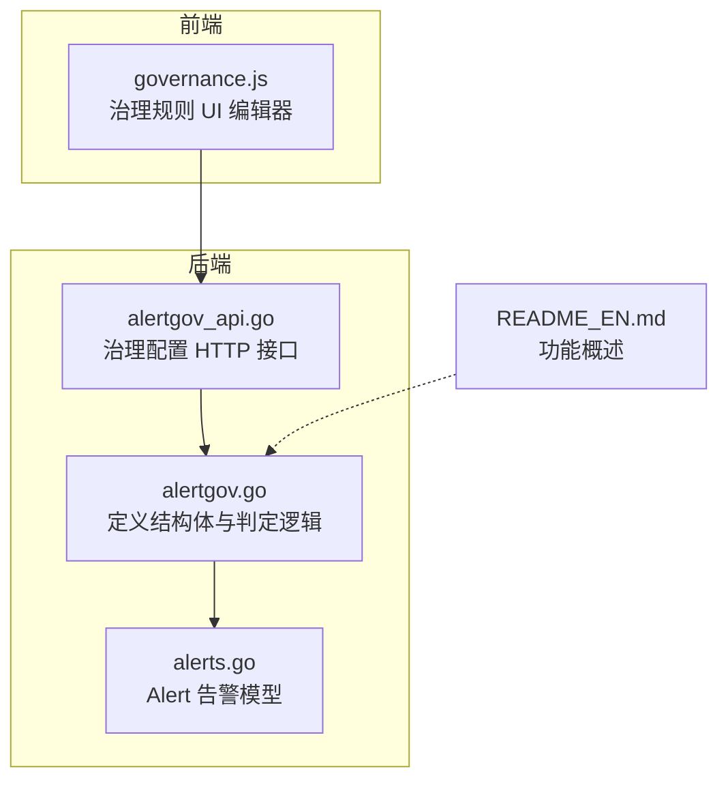
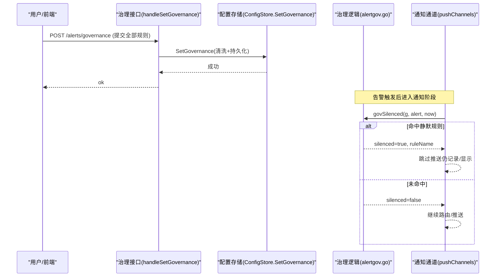
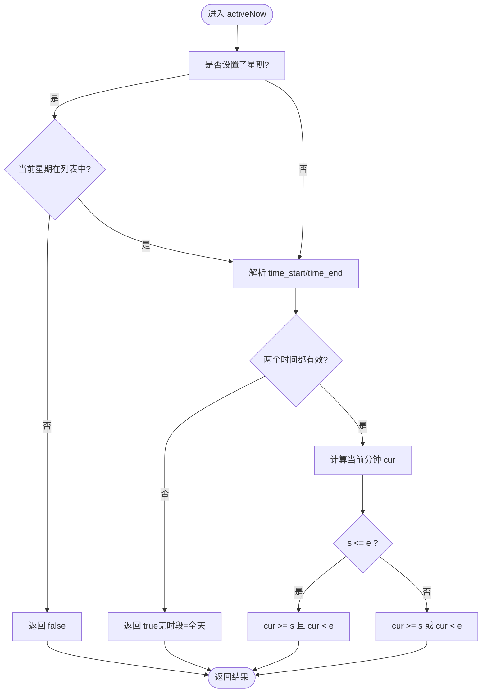
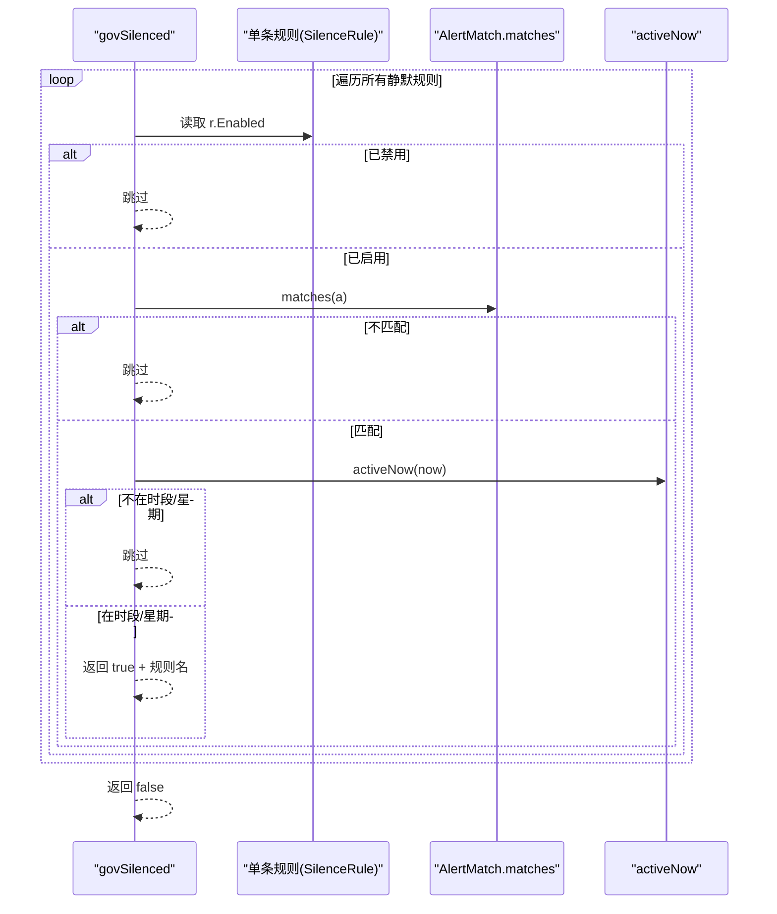
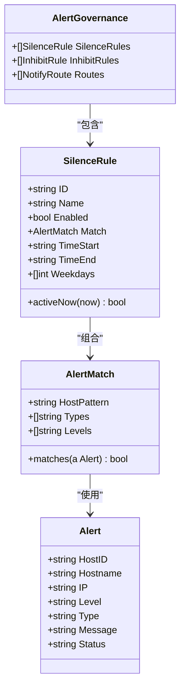

# 告警静默规则

<cite>
**本文引用的文件**
- [alertgov.go](file://cmd/server/alertgov.go)
- [alertgov_test.go](file://cmd/server/alertgov_test.go)
- [alertgov_api.go](file://cmd/server/alertgov_api.go)
- [alerts.go](file://cmd/server/alerts.go)
- [governance.js](file://cmd/server/web/js/governance.js)
- [README_EN.md](file://README_EN.md)
</cite>

## 目录
1. [简介](#简介)
2. [项目结构](#项目结构)
3. [核心组件](#核心组件)
4. [架构总览](#架构总览)
5. [详细组件分析](#详细组件分析)
6. [依赖关系分析](#依赖关系分析)
7. [性能与复杂度](#性能与复杂度)
8. [配置示例与最佳实践](#配置示例与最佳实践)
9. [故障排查指南](#故障排查指南)
10. [结论](#结论)

## 简介
本章节面向 AIOps Monitor 的“告警治理”能力中的“静默规则”功能，聚焦以下目标：
- 解释 SilenceRule 结构体的配置项（ID、Name、Enabled、Match、TimeStart/TimeEnd、Weekdays）
- 说明 AlertMatch 匹配条件（HostPattern 子串匹配、Types 类型过滤、Levels 级别筛选）
- 详解时间窗口与星期选择（HH:MM 格式、跨天支持、0=周日到6=周六）
- 阐述生效逻辑（activeNow 判断流程）
- 提供实际配置示例与最佳实践建议

## 项目结构
与“静默规则”相关的代码主要位于服务端模块中，包含数据结构定义、匹配与时间判定逻辑、HTTP 接口以及前端可视化编辑界面。

图表来源
- [alertgov.go:53-62](file://cmd/server/alertgov.go#L53-L62)
- [alertgov_api.go:12-55](file://cmd/server/alertgov_api.go#L12-L55)
- [alerts.go:169-182](file://cmd/server/alerts.go#L169-L182)
- [governance.js:11-17](file://cmd/server/web/js/governance.js#L11-L17)
- [README_EN.md:664-674](file://README_EN.md#L664-L674)

章节来源
- [alertgov.go:1-226](file://cmd/server/alertgov.go#L1-L226)
- [alertgov_api.go:1-56](file://cmd/server/alertgov_api.go#L1-L56)
- [alerts.go:169-182](file://cmd/server/alerts.go#L169-L182)
- [governance.js:1-169](file://cmd/server/web/js/governance.js#L1-L169)
- [README_EN.md:664-674](file://README_EN.md#L664-L674)

## 核心组件
本节从数据模型与关键方法入手，梳理静默规则的核心组成。

- 告警模型 Alert
  - 关键字段：主机标识（Hostname/IP）、级别（Level）、类型（Type）、消息（Message）、状态（Status）等
  - 作用：作为匹配条件的输入对象，供 AlertMatch.matches 进行匹配

- 匹配条件 AlertMatch
  - HostPattern：主机名或 IP 的子串匹配，大小写不敏感
  - Types：告警类型集合（如 cpu/memory/disk/offline/load/gpu/check/api），留空表示不限
  - Levels：告警级别集合（warning/critical），留空表示不限
  - matches(a)：对一条告警执行“与”语义的多条件匹配

- 静默规则 SilenceRule
  - ID：唯一标识（未提供时由系统生成稳定短 ID）
  - Name：规则名称（用于展示与审计日志）
  - Enabled：启用开关
  - Match：继承 AlertMatch 的匹配条件
  - TimeStart/TimeEnd：HH:MM 格式的时间窗；留空表示全天；支持跨天（如 22:00-08:00）
  - Weekdays：星期列表（0=周日..6=周六），留空表示每天
  - activeNow(now)：判断当前时刻是否处于该规则的生效时段与星期范围内

- 治理入口 govSilenced(g, a, now)
  - 遍历所有静默规则，按顺序检查：Enabled && Match.matches(a) && activeNow(now)
  - 命中即返回 true 并附带命中的规则名

章节来源
- [alerts.go:169-182](file://cmd/server/alerts.go#L169-L182)
- [alertgov.go:20-51](file://cmd/server/alertgov.go#L20-L51)
- [alertgov.go:53-62](file://cmd/server/alertgov.go#L53-L62)
- [alertgov.go:121-145](file://cmd/server/alertgov.go#L121-L145)
- [alertgov.go:147-155](file://cmd/server/alertgov.go#L147-L155)

## 架构总览
静默规则在通知下发前介入，决定某条触发态告警是否推送通知（仍记录并在 UI 可见）。整体流程如下：

图表来源
- [alertgov_api.go:16-55](file://cmd/server/alertgov_api.go#L16-L55)
- [alertgov.go:147-155](file://cmd/server/alertgov.go#L147-L155)

## 详细组件分析

### 数据结构与字段说明
- AlertMatch
  - host_pattern：字符串，留空表示不限；匹配 Hostname 或 IP 的子串，大小写不敏感
  - types：字符串数组，留空表示不限
  - levels：字符串数组，留空表示不限
- SilenceRule
  - id：字符串，若为空则在保存时自动生成稳定短 ID
  - name：字符串，用于展示与审计
  - enabled：布尔值，控制规则是否参与匹配
  - match：继承 AlertMatch
  - time_start/time_end：HH:MM 字符串，留空表示全天；支持跨天（start > end）
  - weekdays：整数数组，取值范围 0-6（0=周日，6=周六），留空表示每天

章节来源
- [alertgov.go:20-51](file://cmd/server/alertgov.go#L20-L51)
- [alertgov.go:53-62](file://cmd/server/alertgov.go#L53-L62)
- [alertgov.go:204-225](file://cmd/server/alertgov.go#L204-L225)

### 匹配条件实现细节
- containsFold(list, v)：忽略大小写比较元素是否在列表中
- AlertMatch.matches(a)
  - 若指定 host_pattern，则同时与 Hostname 和 IP 做子串匹配（均转为小写）
  - 若指定 types，则要求 a.Type 在集合中（忽略大小写）
  - 若指定 levels，则要求 a.Level 在集合中（忽略大小写）
  - 三者为“与”关系，任一不满足即不匹配

章节来源
- [alertgov.go:27-51](file://cmd/server/alertgov.go#L27-L51)

### 时间窗口与星期判定
- govHHMM(s)：将 HH:MM 解析为当天分钟数（0-1439），非法返回 -1
- SilenceRule.activeNow(now)
  - 若设置 weekdays，先判断当前星期是否在列表中
  - 若 time_start/time_end 无效或未设置，视为全天生效
  - 否则计算当前分钟 cur，分两种情况：
    - 同一天窗口（s <= e）：cur >= s 且 cur < e
    - 跨天窗口（s > e）：cur >= s 或 cur < e

图表来源
- [alertgov.go:91-104](file://cmd/server/alertgov.go#L91-L104)
- [alertgov.go:121-145](file://cmd/server/alertgov.go#L121-L145)

章节来源
- [alertgov.go:91-104](file://cmd/server/alertgov.go#L91-L104)
- [alertgov.go:121-145](file://cmd/server/alertgov.go#L121-L145)

### 静默规则生效流程
- govSilenced(g, a, now)
  - 遍历 g.SilenceRules
  - 依次检查：r.Enabled 为真、r.Match.matches(a) 为真、r.activeNow(now) 为真
  - 首次命中即返回 true 及规则名

图表来源
- [alertgov.go:147-155](file://cmd/server/alertgov.go#L147-L155)
- [alertgov.go:36-51](file://cmd/server/alertgov.go#L36-L51)
- [alertgov.go:121-145](file://cmd/server/alertgov.go#L121-L145)

章节来源
- [alertgov.go:147-155](file://cmd/server/alertgov.go#L147-L155)

### 配置存取与校验
- handleGetGovernance：返回当前治理配置（含静默/抑制/路由）
- handleSetGovernance：接收整体配置，清洗规则名，丢弃无名空规则，再调用 ConfigStore.SetGovernance
- SetGovernance：为缺失 ID 的规则补稳定短 ID，并持久化

章节来源
- [alertgov_api.go:12-55](file://cmd/server/alertgov_api.go#L12-L55)
- [alertgov.go:198-225](file://cmd/server/alertgov.go#L198-L225)

### 前端可视化编辑
- governance.js 提供三类规则的卡片式编辑界面
- 加载：GET /alerts/governance
- 保存：POST /alerts/governance（整体提交）
- 静默规则卡片包含：名称、启用开关、匹配条件（主机子串/类型/级别）、生效时段（time_start/time_end）、星期多选

章节来源
- [governance.js:11-17](file://cmd/server/web/js/governance.js#L11-L17)
- [governance.js:44-58](file://cmd/server/web/js/governance.js#L44-L58)
- [governance.js:116-153](file://cmd/server/web/js/governance.js#L116-L153)

## 依赖关系分析
- 模块内依赖
  - alertgov.go 定义了 AlertMatch、SilenceRule 及其判定逻辑
  - alertgov_api.go 通过 HTTP 暴露治理配置的读写接口
  - alerts.go 提供 Alert 模型，作为匹配输入
  - governance.js 负责前端交互与数据收集/提交

图表来源
- [alerts.go:169-182](file://cmd/server/alerts.go#L169-L182)
- [alertgov.go:20-51](file://cmd/server/alertgov.go#L20-L51)
- [alertgov.go:53-62](file://cmd/server/alertgov.go#L53-L62)
- [alertgov.go:84-89](file://cmd/server/alertgov.go#L84-L89)

章节来源
- [alertgov.go:20-89](file://cmd/server/alertgov.go#L20-L89)
- [alerts.go:169-182](file://cmd/server/alerts.go#L169-L182)

## 性能与复杂度
- 匹配复杂度
  - AlertMatch.matches：O(1) 主机子串匹配；O(T) 类型集合查找；O(L) 级别集合查找（T、L 为集合长度）
- 时间判定复杂度
  - activeNow：O(W) 星期匹配（W 为 weekdays 长度）；时间解析 O(1)
- 总体评估
  - 单次告警的静默判定为线性于规则数量 N，内部匹配均为常数或小集合扫描，整体开销低，适合高频路径

[本节为通用性能讨论，无需具体文件引用]

## 配置示例与最佳实践

### 配置示例（基于测试与前端行为）
- 夜间静默（跨天）
  - 启用：true
  - 匹配：留空（全量）或限定类型/级别
  - 时段：time_start="22:00", time_end="08:00"
  - 星期：留空（每天）
  - 预期：23:00、02:30 命中；12:00、08:00 不命中（右开边界）
- 工作日白天静默
  - 时段：time_start="09:00", time_end="18:00"
  - 星期：[1,2,3,4,5]（周一至周五）
- 仅特定主机与级别
  - host_pattern="test-"
  - levels=["warning"]
  - 时段：留空（全天）
  - 星期：留空（每天）

章节来源
- [alertgov_test.go:33-63](file://cmd/server/alertgov_test.go#L33-L63)
- [alertgov_test.go:65-77](file://cmd/server/alertgov_test.go#L65-L77)
- [governance.js:44-58](file://cmd/server/web/js/governance.js#L44-L58)

### 最佳实践建议
- 明确命名与启用策略
  - 为每条规则填写有意义的 Name，便于审计与排障
  - 新增规则默认启用，但可先以窄匹配验证后再放开
- 精确匹配减少误伤
  - 优先使用 host_pattern 限定环境（如 test-/staging-）
  - 结合 Types/Levels 缩小范围，避免“全量静默”
- 合理设置时间窗
  - 夜间静默建议使用跨天（22:00-08:00）
  - 注意右开边界：结束时间点不包含在内（例如 08:00 不命中）
- 利用星期限制
  - 针对工作日/周末差异化策略，减少非工作时间的噪音
- 保持最小必要原则
  - 规则粒度尽量细，避免过度聚合导致难以定位问题
- 定期审查与清理
  - 删除长期不再使用的规则，避免规则膨胀影响可读性与维护成本

[本节为通用指导，无需具体文件引用]

## 故障排查指南
- 规则未生效
  - 检查 Enabled 是否为 true
  - 确认 Match 条件是否正确（host_pattern 大小写不敏感，需确保子串存在）
  - 核对 time_start/time_end 是否合法（HH:MM），跨天场景 start > end
  - 检查 Weekdays 是否包含当前星期（0=周日）
- 边界时间问题
  - 结束时间为右开边界，例如 08:00 不命中
- 规则覆盖顺序
  - govSilenced 按顺序匹配，首个命中即生效；必要时调整规则顺序
- 前端保存失败
  - 确认 JSON 格式正确，Name 不为空（后端会丢弃无名规则）
  - 查看浏览器控制台与服务端日志

章节来源
- [alertgov.go:121-145](file://cmd/server/alertgov.go#L121-L145)
- [alertgov_api.go:23-47](file://cmd/server/alertgov_api.go#L23-L47)
- [alertgov_test.go:33-63](file://cmd/server/alertgov_test.go#L33-L63)

## 结论
静默规则通过在通知下发前插入决策层，实现对触发态告警的精准降噪。其核心在于：
- 灵活的匹配条件（主机子串、类型、级别）
- 直观的时间窗与星期控制（支持跨天）
- 简单高效的判定流程（activeNow 与 govSilenced）
配合前端可视化编辑与稳定的配置持久化机制，可在保障运维效率的同时，显著降低告警风暴与夜间噪音。

[本节为总结性内容，无需具体文件引用]