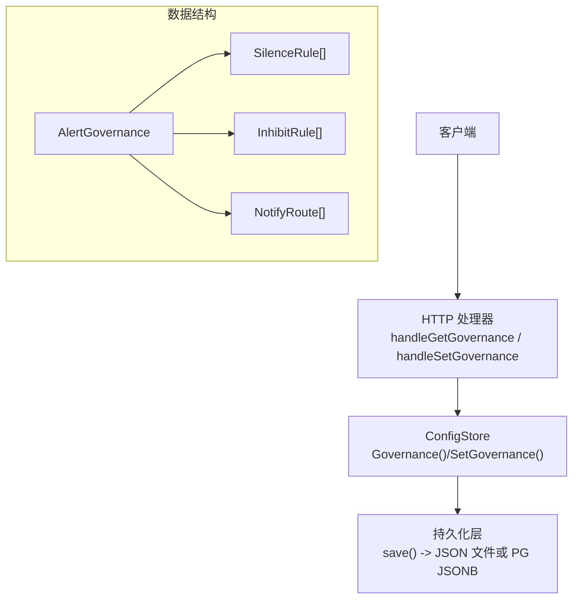
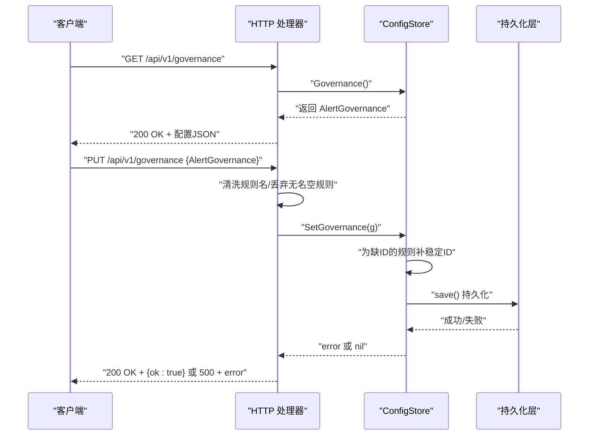
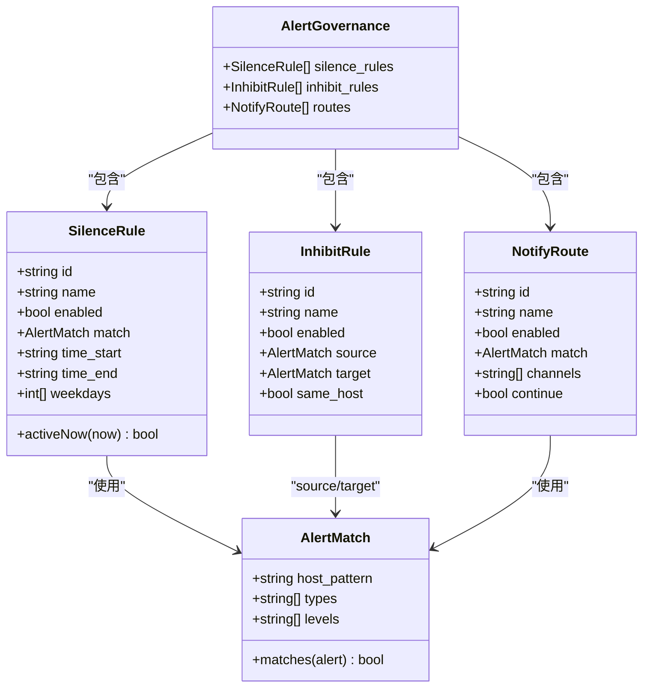
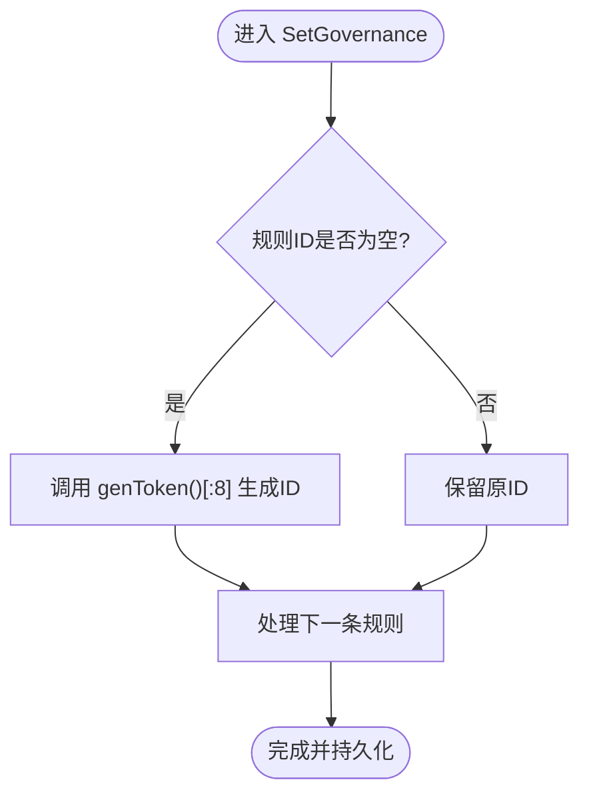
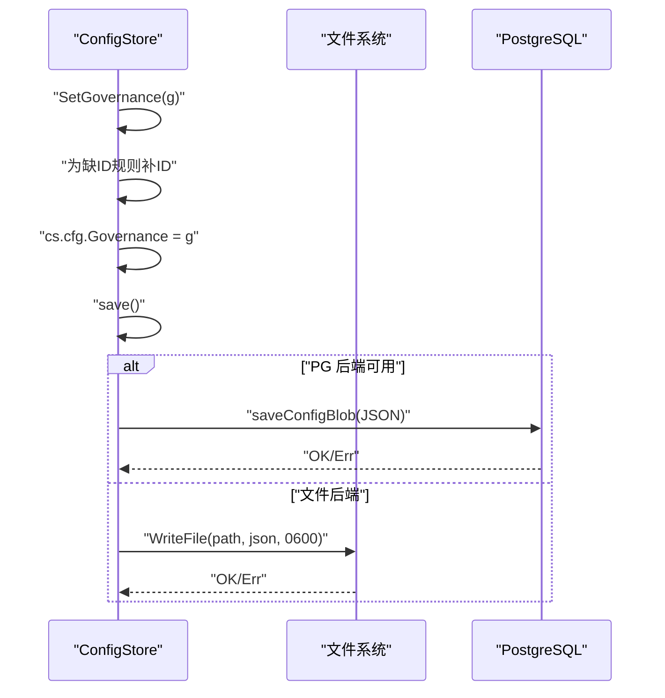
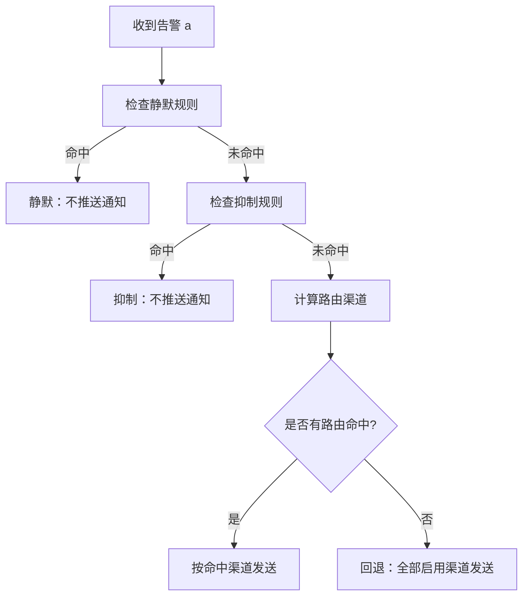
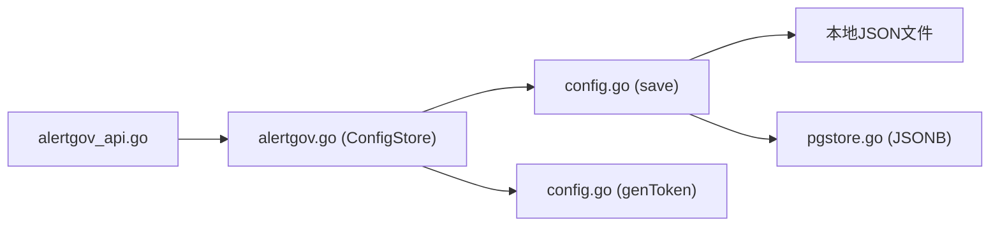

# 治理配置管理API

<cite>
**本文引用的文件**   
- [alertgov.go](file://cmd/server/alertgov.go)
- [alertgov_api.go](file://cmd/server/alertgov_api.go)
- [config.go](file://cmd/server/config.go)
- [pgstore.go](file://cmd/server/pgstore.go)
- [governance.js](file://cmd/server/web/js/governance.js)
</cite>

## 目录
1. [简介](#简介)
2. [项目结构](#项目结构)
3. [核心组件](#核心组件)
4. [架构总览](#架构总览)
5. [详细组件分析](#详细组件分析)
6. [依赖关系分析](#依赖关系分析)
7. [性能与并发安全](#性能与并发安全)
8. [故障排查指南](#故障排查指南)
9. [结论](#结论)
10. [附录：RESTful API 规范与示例](#附录restful-api-规范与示例)

## 简介
本文件面向 AIOps Monitor 的“告警治理配置管理”能力，围绕 AlertGovernance 总集结构体及其三类规则集合（静默规则、抑制规则、通知路由）的管理接口进行系统化说明。文档覆盖以下要点：
- AlertGovernance 总集结构与三类规则的字段语义与匹配逻辑
- ConfigStore 中 Governance() 与 SetGovernance() 的实现细节（读取、写入、持久化）
- 规则 ID 自动生成机制（当配置中缺少 ID 时系统自动分配稳定标识符）
- RESTful API 接口规范（GET/PUT /api/v1/governance）
- 配置验证规则、错误处理机制与并发安全考虑
- 实际 API 调用示例与集成指南

## 项目结构
与治理配置相关的核心代码位于 server 模块中：
- alertgov.go：定义 AlertGovernance 及三类规则的数据结构、匹配与决策逻辑，以及 ConfigStore 对治理配置的读写方法
- alertgov_api.go：实现治理配置的 HTTP 端点（获取与整体更新）
- config.go：ConfigStore 的通用实现，包含 save() 持久化、genToken() 随机令牌生成等
- pgstore.go：PostgreSQL 后端持久化实现（JSONB 存储整份配置）
- governance.js：前端治理页面脚本，演示了 GET/POST 调用治理配置的方式（注意：前端使用 /alerts/governance，但服务端对外暴露的是 /api/v1/governance）

图表来源
- [alertgov_api.go:11-56](file://cmd/server/alertgov_api.go#L11-L56)
- [alertgov.go:84-89](file://cmd/server/alertgov.go#L84-L89)
- [config.go:1050-1080](file://cmd/server/config.go#L1050-L1080)
- [pgstore.go:296-300](file://cmd/server/pgstore.go#L296-L300)

章节来源
- [alertgov.go:1-226](file://cmd/server/alertgov.go#L1-L226)
- [alertgov_api.go:1-56](file://cmd/server/alertgov_api.go#L1-L56)
- [config.go:1040-1086](file://cmd/server/config.go#L1040-L1086)
- [pgstore.go:276-312](file://cmd/server/pgstore.go#L276-L312)

## 核心组件
- AlertMatch：三类规则共用的匹配条件，支持主机名/IP 子串匹配、类型集合、级别集合；任一留空表示不限。
- SilenceRule：静默规则，命中后不推送通知（仍记录与展示），可带时间窗（HH:MM，支持跨天）与星期限定。
- InhibitRule：抑制规则，当存在匹配 Source 的其它活跃告警时，抑制匹配 Target 的告警通知；可选 SameHost 要求源与目标同主机。
- NotifyRoute：通知路由，按匹配条件决定发往哪些渠道（feishu/dingtalk/smtp/webhook/sms/voicecall 等），支持 Continue 链式继续匹配。
- AlertGovernance：治理配置总集，包含 SilenceRules、InhibitRules、Routes 三个规则集合。

关键行为与复杂度：
- 匹配 matches(a)：O(1) 到 O(n)（n 为 Types/Levels 长度），字符串比较为主
- govSilenced：遍历所有静默规则，O(S)
- govInhibited：遍历抑制规则并扫描活跃告警列表，O(I*A)，A 为活跃告警数量
- govRouteChannels：遍历路由规则，O(R)

章节来源
- [alertgov.go:20-89](file://cmd/server/alertgov.go#L20-L89)
- [alertgov.go:147-194](file://cmd/server/alertgov.go#L147-L194)

## 架构总览
治理配置在通知下发前作为决策层插入，流程如下：
- 读取当前治理配置（AlertGovernance）
- 判断是否被静默规则命中（含时间窗与星期）
- 判断是否被抑制规则命中（基于活跃告警集合）
- 根据路由规则选择目标渠道（未命中则回退默认全部启用渠道）
- 恢复类通知不受上述规则影响，一律发送

图表来源
- [alertgov_api.go:11-56](file://cmd/server/alertgov_api.go#L11-L56)
- [alertgov.go:198-225](file://cmd/server/alertgov.go#L198-L225)
- [config.go:1050-1080](file://cmd/server/config.go#L1050-L1080)

## 详细组件分析

### AlertGovernance 总集与规则模型
- AlertGovernance 聚合三类规则集合，分别用于静默、抑制与路由决策
- 每条规则均具备 id、name、enabled 字段，其中 id 若为空则在写入时由系统自动生成稳定标识符（见下文）
- AlertMatch 提供统一的匹配条件，支持大小写不敏感的主机名/IP 子串匹配、类型与级别的集合匹配

图表来源
- [alertgov.go:20-89](file://cmd/server/alertgov.go#L20-L89)

章节来源
- [alertgov.go:20-89](file://cmd/server/alertgov.go#L20-L89)

### 规则 ID 自动生成机制
- 当配置中某条规则的 ID 为空或仅空白字符时，系统在写入阶段为其分配一个稳定的短标识符
- 生成策略：复用全局 genToken() 生成的随机令牌的前 8 个字符，保证唯一性与稳定性
- 适用范围：SilenceRules、InhibitRules、Routes 三组规则均生效

图表来源
- [alertgov.go:204-225](file://cmd/server/alertgov.go#L204-L225)
- [config.go:657-663](file://cmd/server/config.go#L657-L663)

章节来源
- [alertgov.go:204-225](file://cmd/server/alertgov.go#L204-L225)
- [config.go:657-663](file://cmd/server/config.go#L657-L663)

### ConfigStore 中的 Governance() 与 SetGovernance()
- Governance()：以读锁保护，返回内存中的 AlertGovernance 快照
- SetGovernance()：以写锁保护，执行以下操作：
  - 为缺失 ID 的规则补全稳定 ID
  - 将新配置赋值到内存
  - 释放锁后调用 save() 进行持久化
- save()：
  - 深拷贝配置以避免并发修改
  - 对可逆密文进行落盘加密（受环境变量控制）
  - 优先写入 PostgreSQL JSONB（若启用），否则写入本地 JSON 文件（权限 0o600）

图表来源
- [alertgov.go:198-225](file://cmd/server/alertgov.go#L198-L225)
- [config.go:1050-1080](file://cmd/server/config.go#L1050-L1080)
- [pgstore.go:296-300](file://cmd/server/pgstore.go#L296-L300)

章节来源
- [alertgov.go:198-225](file://cmd/server/alertgov.go#L198-L225)
- [config.go:1050-1080](file://cmd/server/config.go#L1050-L1080)
- [pgstore.go:296-300](file://cmd/server/pgstore.go#L296-L300)

### 规则匹配与决策逻辑
- 静默规则：
  - 支持时间窗 HH:MM（支持跨天，如 22:00-08:00）
  - 支持星期限定（0=周日..6=周六）
  - activeNow(now) 计算当前分钟数并与窗口比较
- 抑制规则：
  - 遍历活跃告警集合，排除自身，必要时要求 SameHost
  - 命中即抑制目标告警的通知
- 路由规则：
  - 顺序匹配，命中后将渠道加入选择集合
  - Continue=false 时命中即停止后续匹配；Continue=true 时可继续追加渠道
  - 无路由命中时，routed=false，调用方回退默认全部启用渠道

图表来源
- [alertgov.go:121-194](file://cmd/server/alertgov.go#L121-L194)

章节来源
- [alertgov.go:121-194](file://cmd/server/alertgov.go#L121-L194)

## 依赖关系分析
- HTTP 处理器依赖 ConfigStore 提供的 Governance()/SetGovernance()
- ConfigStore.save() 依赖底层持久化实现：
  - 若启用 PostgreSQL，则通过 pgstore.saveConfigBlob() 写入 JSONB
  - 否则写入本地 JSON 文件，并强制设置 0o600 权限
- 规则 ID 生成依赖全局 genToken()

图表来源
- [alertgov_api.go:11-56](file://cmd/server/alertgov_api.go#L11-L56)
- [alertgov.go:198-225](file://cmd/server/alertgov.go#L198-L225)
- [config.go:1050-1080](file://cmd/server/config.go#L1050-L1080)
- [pgstore.go:296-300](file://cmd/server/pgstore.go#L296-L300)
- [config.go:657-663](file://cmd/server/config.go#L657-L663)

章节来源
- [alertgov_api.go:11-56](file://cmd/server/alertgov_api.go#L11-L56)
- [alertgov.go:198-225](file://cmd/server/alertgov.go#L198-L225)
- [config.go:1050-1080](file://cmd/server/config.go#L1050-L1080)
- [pgstore.go:296-300](file://cmd/server/pgstore.go#L296-L300)
- [config.go:657-663](file://cmd/server/config.go#L657-L663)

## 性能与并发安全
- 并发安全：
  - Governance() 使用读锁（RLock）保护，允许多读
  - SetGovernance() 使用写锁（Lock）保护，确保写入原子性
  - save() 内部先复制配置再落盘，避免并发修改导致不一致
- 性能特征：
  - 读取配置为 O(1)
  - 写入配置为 O(N)（N 为规则总数），主要开销在 JSON 序列化与持久化 IO
  - 运行时决策（静默/抑制/路由）在通知路径中执行，复杂度与规则数量和活跃告警规模相关

[本节为通用指导，无需特定文件引用]

## 故障排查指南
- 常见错误与定位：
  - 请求体非合法 JSON：处理器返回 400 Bad Request，错误消息来自国际化键
  - 持久化失败：处理器返回 500 Internal Server Error，错误信息为底层 save() 返回的错误文本
  - 规则未生效：确认规则已启用且名称不为空（处理器会丢弃无名空规则）
- 日志与审计：
  - 成功更新治理配置后，会写入一条操作日志（Kind=Operation，Level=info）
- 持久化介质差异：
  - 文件模式：检查配置文件权限（应为 0o600）与磁盘空间
  - PG 模式：检查数据库连接与 app_config 表状态

章节来源
- [alertgov_api.go:17-56](file://cmd/server/alertgov_api.go#L17-L56)
- [config.go:1050-1080](file://cmd/server/config.go#L1050-L1080)

## 结论
治理配置管理 API 提供了对静默、抑制与路由三类规则的集中管理能力。通过统一的 AlertGovernance 总集结构体与 ConfigStore 的线程安全存取，结合稳健的 ID 自动生成与持久化策略，系统在保证一致性的同时具备良好的可扩展性与运维友好性。建议在生产环境开启 PostgreSQL 后端以提升高可用与一致性保障。

[本节为总结性内容，无需特定文件引用]

## 附录：RESTful API 规范与示例

### 接口概览
- 获取治理配置
  - 方法：GET
  - 路径：/api/v1/governance
  - 响应：200 OK，主体为 AlertGovernance JSON
- 更新治理配置
  - 方法：PUT
  - 路径：/api/v1/governance
  - 请求体：AlertGovernance JSON
  - 响应：
    - 200 OK，主体：{ "ok": true }
    - 400 Bad Request，主体：{ "error": "..." }（JSON 解析失败）
    - 500 Internal Server Error，主体：{ "error": "..." }（持久化失败）

### 请求/响应数据模型
- AlertGovernance
  - silence_rules: SilenceRule[]
  - inhibit_rules: InhibitRule[]
  - routes: NotifyRoute[]
- SilenceRule
  - id: string（可选，缺失时自动生成）
  - name: string（必填，空将被丢弃）
  - enabled: boolean
  - match: AlertMatch
  - time_start: string（HH:MM，可选）
  - time_end: string（HH:MM，可选）
  - weekdays: int[]（0=周日..6=周六，可选）
- InhibitRule
  - id: string（可选，缺失时自动生成）
  - name: string（必填，空将被丢弃）
  - enabled: boolean
  - source: AlertMatch
  - target: AlertMatch
  - same_host: boolean
- NotifyRoute
  - id: string（可选，缺失时自动生成）
  - name: string（必填，空将被丢弃）
  - enabled: boolean
  - match: AlertMatch
  - channels: string[]（如 feishu/dingtalk/email/webhook/sms/voicecall）
  - continue: boolean（是否继续匹配后续路由）
- AlertMatch
  - host_pattern: string（主机名/IP 子串匹配，大小写不敏感）
  - types: string[]（如 cpu/memory/disk/offline/load/gpu/check/api）
  - levels: string[]（warning/critical）

### 校验与清理规则
- 服务器会在更新前清洗规则：
  - 去除 name 为空白的规则条目
  - 对 name 进行 trim 处理
- 规则 ID 自动生成：
  - 若 id 为空或仅空白，系统将用 genToken()[:8] 填充

### 错误处理
- 400：请求体无法解析为 JSON
- 500：保存配置失败（文件/数据库写入异常）
- 其他：遵循标准 HTTP 语义

### 并发与安全
- 读取使用读锁，写入使用写锁
- 落盘前深拷贝配置，避免并发修改
- 文件模式强制 0o600 权限，防止越权访问

### 实际调用示例
- 获取配置
  - curl -s http://localhost:PORT/api/v1/governance | jq .
- 更新配置
  - curl -s -X PUT http://localhost:PORT/api/v1/governance \
    -H "Content-Type: application/json" \
    -d '{
      "silence_rules": [
        {"name":"夜间静默","enabled":true,"match":{"host_pattern":"prod-"},"time_start":"22:00","time_end":"08:00"}
      ],
      "inhibit_rules": [
        {"name":"离线抑制指标","enabled":true,"same_host":true,"source":{"types":["offline"]},"target":{"types":["cpu","memory"]}}
      ],
      "routes": [
        {"name":"严重全发","enabled":true,"match":{"levels":["critical"]},"channels":["feishu","dingtalk","email"]}
      ]
    }'

### 前端集成提示
- 前端治理页面脚本通过 /alerts/governance 加载与提交配置（该路径可能由反向代理映射至 /api/v1/governance）
- 建议在网关层统一将 /alerts/governance 转发到 /api/v1/governance，保持前后端解耦

章节来源
- [alertgov_api.go:11-56](file://cmd/server/alertgov_api.go#L11-L56)
- [alertgov.go:84-89](file://cmd/server/alertgov.go#L84-L89)
- [governance.js:1-17](file://cmd/server/web/js/governance.js#L1-L17)