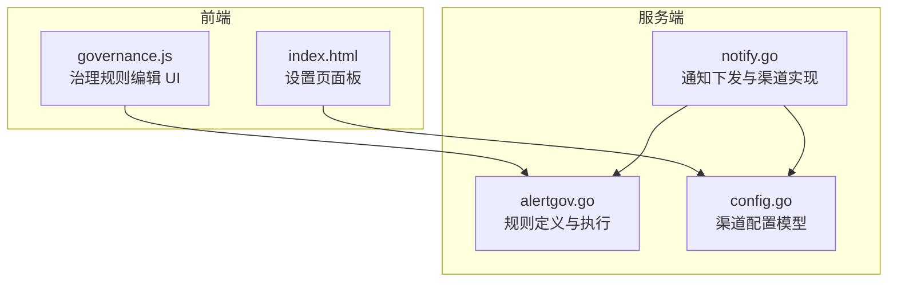
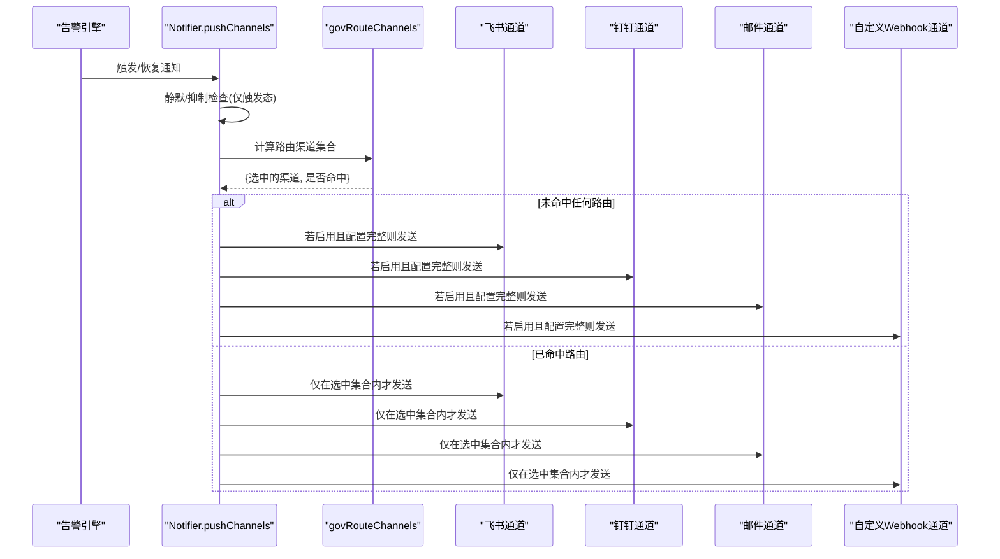
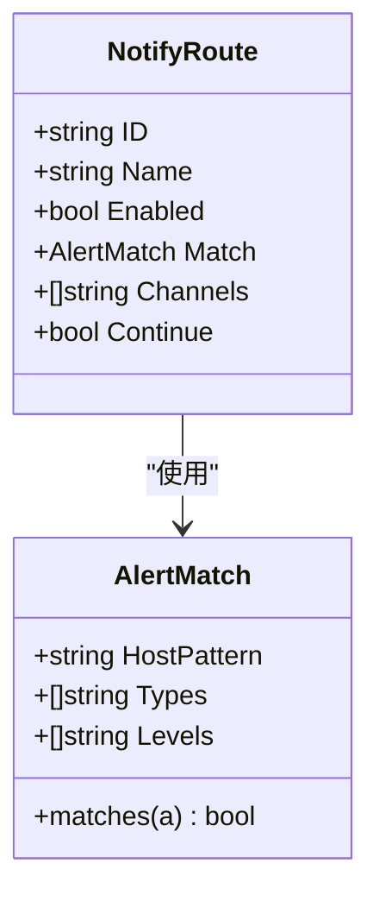
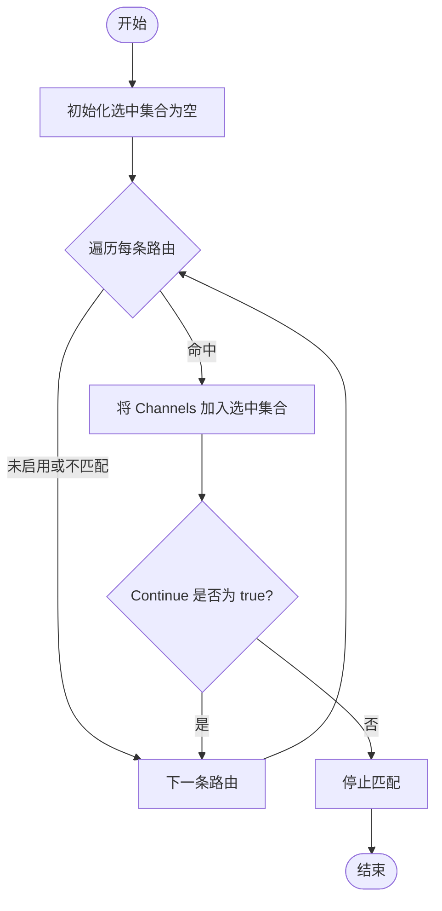
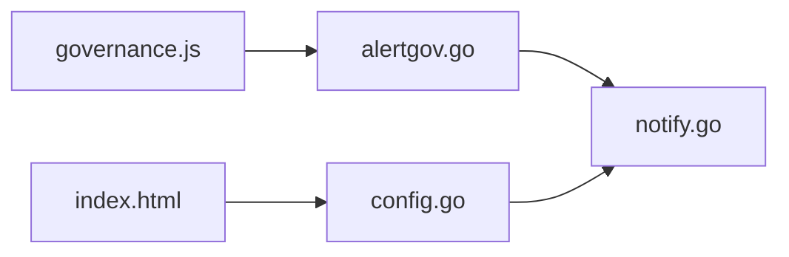

# 通知路由策略

<cite>
**本文引用的文件**   
- [alertgov.go](file://cmd/server/alertgov.go)
- [notify.go](file://cmd/server/notify.go)
- [config.go](file://cmd/server/config.go)
- [governance.js](file://cmd/server/web/js/governance.js)
- [index.html](file://cmd/server/web/index.html)
</cite>

## 目录
1. [简介](#简介)
2. [项目结构](#项目结构)
3. [核心组件](#核心组件)
4. [架构总览](#架构总览)
5. [详细组件分析](#详细组件分析)
6. [依赖关系分析](#依赖关系分析)
7. [性能考虑](#性能考虑)
8. [故障排查指南](#故障排查指南)
9. [结论](#结论)
10. [附录：多级路由配置示例](#附录多级路由配置示例)

## 简介
本文件面向 AIOps Monitor 的通知路由策略，围绕 NotifyRoute 结构体与相关治理逻辑展开，解释匹配条件、渠道列表、继续匹配标志等关键字段；说明支持的渠道类型（飞书、钉钉、邮件、自定义 Webhook 等）；阐述路由匹配的执行顺序与 Continue 字段的行为差异；提供按告警级别、主机分组等多级路由配置思路；并说明未命中任何路由时的默认行为与设计模式、性能考量。

## 项目结构
通知路由属于“告警治理”能力的一部分，位于服务端模块中，主要涉及以下文件：
- 规则定义与执行：alertgov.go
- 通知下发流程与渠道实现：notify.go
- 渠道配置模型：config.go
- 前端治理界面交互：web/js/governance.js、web/index.html

图表来源
- [alertgov.go:74-89](file://cmd/server/alertgov.go#L74-L89)
- [notify.go:196-276](file://cmd/server/notify.go#L196-L276)
- [config.go:35-44](file://cmd/server/config.go#L35-L44)
- [governance.js:68-77](file://cmd/server/web/js/governance.js#L68-L77)
- [index.html:831-857](file://cmd/server/web/index.html#L831-L857)

章节来源
- [alertgov.go:74-89](file://cmd/server/alertgov.go#L74-L89)
- [notify.go:196-276](file://cmd/server/notify.go#L196-L276)
- [config.go:35-44](file://cmd/server/config.go#L35-L44)
- [governance.js:68-77](file://cmd/server/web/js/governance.js#L68-L77)
- [index.html:831-857](file://cmd/server/web/index.html#L831-L857)

## 核心组件
- AlertMatch：三类规则共用的匹配条件，支持主机名/IP 子串匹配、告警类型集合、告警级别集合。留空表示不限。
- NotifyRoute：通知路由规则，包含启用开关、匹配条件、目标渠道列表、是否继续匹配后续规则。
- govRouteChannels：根据路由规则计算本次告警应发送的渠道集合；若未命中任何路由，则回退为“全部启用渠道”。

关键要点
- Match 字段用于筛选告警，支持大小写不敏感的主机子串匹配、类型与级别的集合匹配。
- Channels 指定命中的告警仅发往这些渠道，支持 feishu、dingtalk、email、webhook 等键名。
- Continue 控制是否继续匹配后续路由：默认 false 表示命中即停止；true 表示继续累积后续路由的渠道。

章节来源
- [alertgov.go:20-51](file://cmd/server/alertgov.go#L20-L51)
- [alertgov.go:74-89](file://cmd/server/alertgov.go#L74-L89)
- [alertgov.go:178-194](file://cmd/server/alertgov.go#L178-L194)

## 架构总览
通知下发的整体流程在 pushChannels 中完成：先进行静默与抑制判断（仅对触发态生效），再进入路由选择，最后依次调用各渠道发送。

图表来源
- [notify.go:196-276](file://cmd/server/notify.go#L196-L276)
- [alertgov.go:178-194](file://cmd/server/alertgov.go#L178-L194)

## 详细组件分析

### NotifyRoute 结构体与匹配语义
- ID/Name/Enabled：标识与启用状态。
- Match：继承自 AlertMatch，支持：
  - HostPattern：主机名或 IP 的子串匹配（大小写不敏感）。
  - Types：告警类型集合，如 cpu/memory/disk/offline/load/gpu/check/api 等。
  - Levels：告警级别集合，如 warning/critical。
- Channels：目标渠道键名集合，常见包括 feishu、dingtalk、email、webhook。
- Continue：是否继续匹配后续路由。默认 false 表示命中即停；true 表示继续累积后续路由的渠道。

图表来源
- [alertgov.go:20-51](file://cmd/server/alertgov.go#L20-L51)
- [alertgov.go:74-89](file://cmd/server/alertgov.go#L74-L89)

章节来源
- [alertgov.go:20-51](file://cmd/server/alertgov.go#L20-L51)
- [alertgov.go:74-89](file://cmd/server/alertgov.go#L74-L89)

### 路由匹配执行顺序与 Continue 行为
- 顺序：按 Routes 列表顺序从上到下逐一评估。
- 命中判定：需满足 Enabled=true 且 Match.matches(a)=true。
- 渠道累积：将命中规则的 Channels 加入候选集合（键名统一小写并去空白）。
- Continue=false：一旦命中，立即停止后续规则匹配。
- Continue=true：继续尝试后续规则，最终集合为所有命中规则的渠道并集。
- 未命中任何路由：routed=false，调用方回退到“全部启用渠道”。

图表来源
- [alertgov.go:178-194](file://cmd/server/alertgov.go#L178-L194)

章节来源
- [alertgov.go:178-194](file://cmd/server/alertgov.go#L178-L194)

### 渠道类型与实现要点
- 飞书（feishu）：通过 Webhook 推送文本消息，失败记录日志。
- 钉钉（dingtalk）：支持可选加签 Secret，自动拼接签名参数后推送。
- 邮件（email）：SMTP 配置有效时，向绑定的收件人列表发送 HTML 告警邮件。
- 自定义 Webhook（webhook）：支持 GET/POST、可配 Content-Type、自定义 Header、Go 模板请求体；默认 JSON 体包含 text、level、type、hostname、message、value、timestamp、firing 等字段。

注意
- 渠道键名在路由 Channels 中使用小写字符串，如 feishu、dingtalk、email、webhook。
- 实际发送前会检查对应渠道是否启用且配置完整（URL/Host/Secret 等）。

章节来源
- [notify.go:214-276](file://cmd/server/notify.go#L214-L276)
- [notify.go:405-464](file://cmd/server/notify.go#L405-L464)
- [notify.go:1134-1216](file://cmd/server/notify.go#L1134-L1216)
- [config.go:15-20](file://cmd/server/config.go#L15-L20)
- [config.go:35-44](file://cmd/server/config.go#L35-L44)

### 未命中路由的默认行为
- 当没有任何路由命中时，routed=false，调用方将“全部启用渠道”作为发送目标，保持向后兼容。
- 该行为确保在未配置路由或规则过于严格导致无命中时，系统仍能将告警推送到所有已启用的渠道。

章节来源
- [notify.go:208-210](file://cmd/server/notify.go#L208-L210)
- [alertgov.go:178-194](file://cmd/server/alertgov.go#L178-L194)

### 前端治理界面与字段映射
- 治理规则编辑页面提供“命中后继续匹配后续路由”的开关，对应 Continue 字段。
- 渠道多选框展示 GOV_CHANNELS 常量定义的渠道选项，与后端 Channels 键名一致。

章节来源
- [governance.js:68-77](file://cmd/server/web/js/governance.js#L68-L77)
- [index.html:831-857](file://cmd/server/web/index.html#L831-L857)

## 依赖关系分析
- alertgov.go 定义了 AlertMatch、NotifyRoute 及 govRouteChannels 等核心逻辑。
- notify.go 在 pushChannels 中调用 govRouteChannels 决定发送渠道，并依次调用各渠道发送函数。
- config.go 定义了 WebhookConfig、CustomWebhookConfig、SMTPConfig 等渠道配置结构。
- 前端 governance.js 与 index.html 负责治理规则与渠道配置的可视化编辑。

图表来源
- [alertgov.go:178-194](file://cmd/server/alertgov.go#L178-L194)
- [notify.go:196-276](file://cmd/server/notify.go#L196-L276)
- [config.go:35-44](file://cmd/server/config.go#L35-L44)
- [governance.js:68-77](file://cmd/server/web/js/governance.js#L68-L77)
- [index.html:831-857](file://cmd/server/web/index.html#L831-L857)

章节来源
- [alertgov.go:178-194](file://cmd/server/alertgov.go#L178-L194)
- [notify.go:196-276](file://cmd/server/notify.go#L196-L276)
- [config.go:35-44](file://cmd/server/config.go#L35-L44)
- [governance.js:68-77](file://cmd/server/web/js/governance.js#L68-L77)
- [index.html:831-857](file://cmd/server/web/index.html#L831-L857)

## 性能考虑
- 匹配复杂度：每条路由的匹配为 O(1) 级别（主机子串匹配、类型/级别集合查找），整体为 O(R)，R 为路由数量。
- Continue=false 可提前终止匹配，减少不必要的规则评估。
- 渠道发送为 I/O 操作，建议合理控制并发与超时；当前实现使用带保护的 HTTP 客户端，避免 SSRF。
- 未命中路由的回退路径会遍历所有启用渠道，建议在大规模部署下优先使用路由收敛发送范围，降低网络开销。

[本节为通用指导，无需具体文件引用]

## 故障排查指南
- 渠道发送失败：查看系统日志中对应渠道的错误信息（如飞书/钉钉/邮件/自定义 Webhook 失败日志）。
- 路由未生效：确认规则是否启用、Match 条件是否正确、Channels 键名是否与后端一致（小写）、Continue 是否符合预期。
- 未命中路由却全量发送：检查是否存在任意一条路由命中；若无命中，系统将回退到全部启用渠道。
- 自定义 Webhook 模板错误：检查 BodyTemplate 语法与可用占位符，确认请求方法与 Content-Type 配置正确。

章节来源
- [notify.go:214-276](file://cmd/server/notify.go#L214-L276)
- [notify.go:1134-1216](file://cmd/server/notify.go#L1134-L1216)

## 结论
AIOps Monitor 的通知路由策略以 NotifyRoute 为核心，结合 AlertMatch 的多维匹配条件与 Continue 的灵活控制，实现了从粗粒度到细粒度的渠道分发能力。未命中路由时回退到全部启用渠道的设计保证了系统的鲁棒性与兼容性。配合前端治理界面，用户可按告警级别、主机分组等维度构建多级路由，满足不同团队与场景的分发需求。

[本节为总结性内容，无需具体文件引用]

## 附录：多级路由配置示例
以下为基于现有能力的配置思路示例（概念性说明，非代码片段）：
- 按告警级别路由
  - 规则1：Levels=[critical]，Channels=[feishu,dingtalk]，Continue=false
  - 规则2：Levels=[warning]，Channels=[email,webhook]，Continue=false
- 按主机分组路由
  - 规则1：HostPattern=prod，Channels=[feishu,dingtalk,email]，Continue=false
  - 规则2：HostPattern=test，Channels=[webhook,email]，Continue=false
- 组合条件与继续匹配
  - 规则1：Types=[cpu,memory], Levels=[critical], Channels=[feishu,dingtalk], Continue=true
  - 规则2：HostPattern=db*, Channels=[email], Continue=false
  - 效果：严重 CPU/内存告警同时发送到即时渠道与邮件；数据库主机额外追加邮件渠道。

[本节为概念性示例，无需具体文件引用]