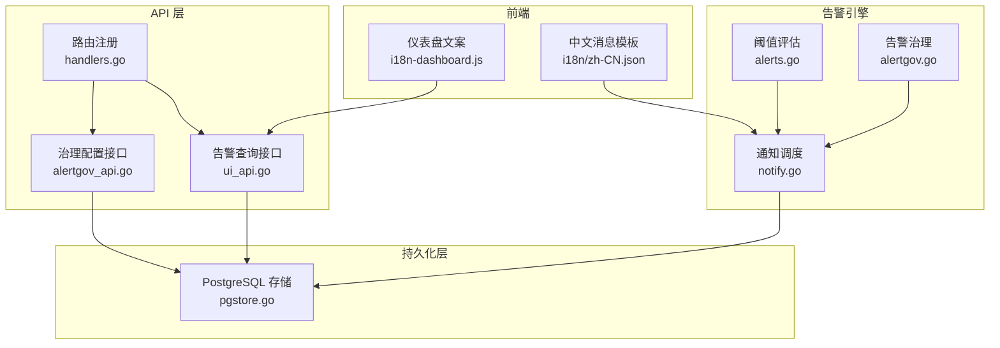
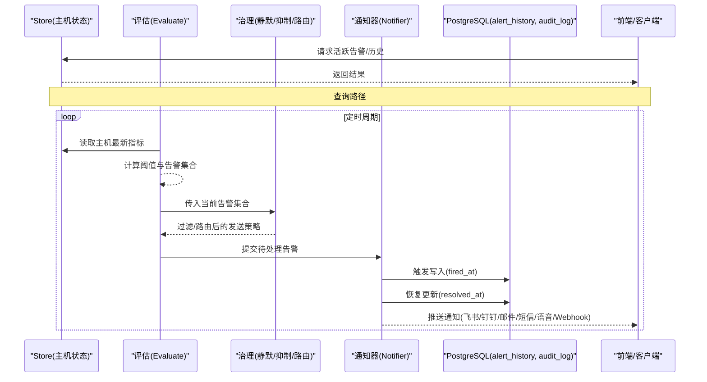
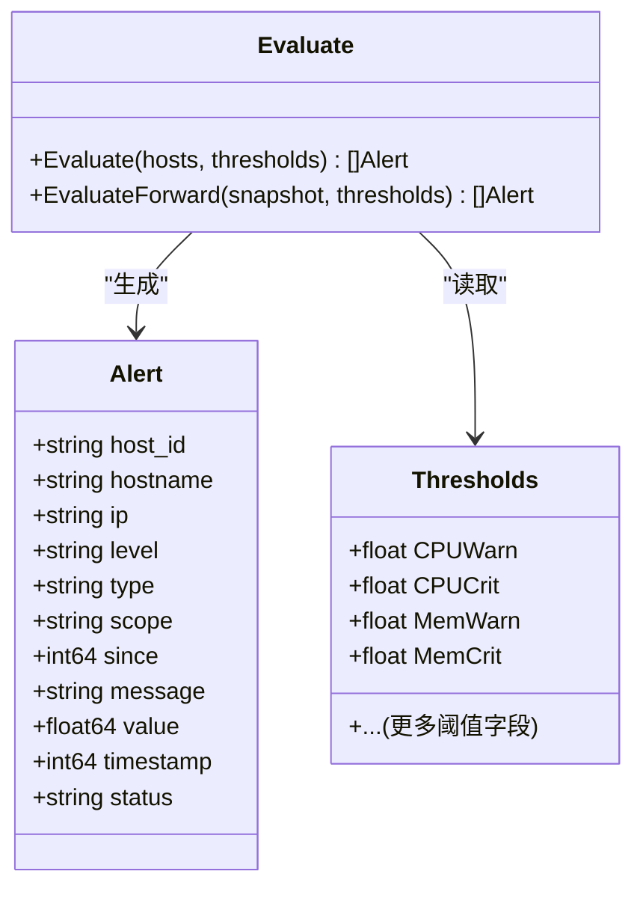
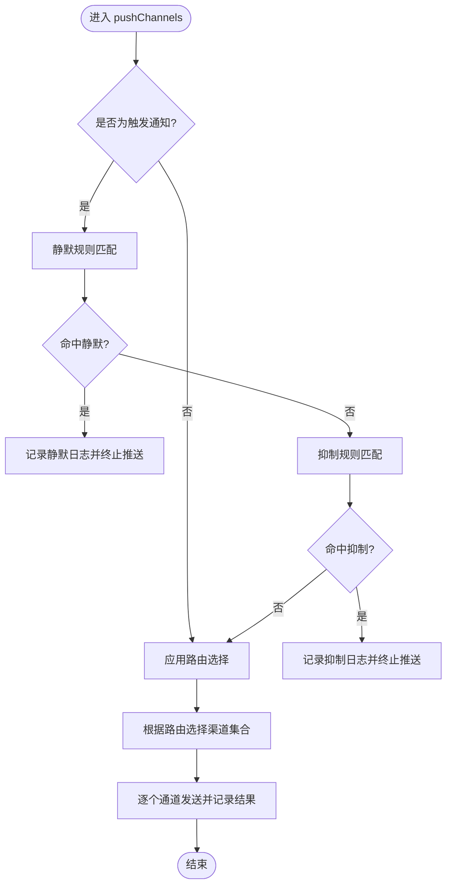
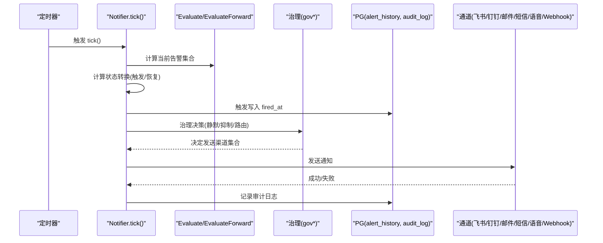
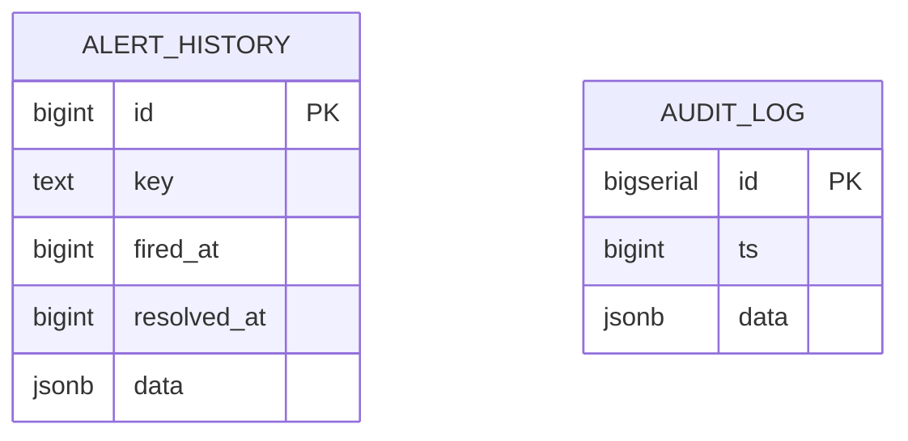
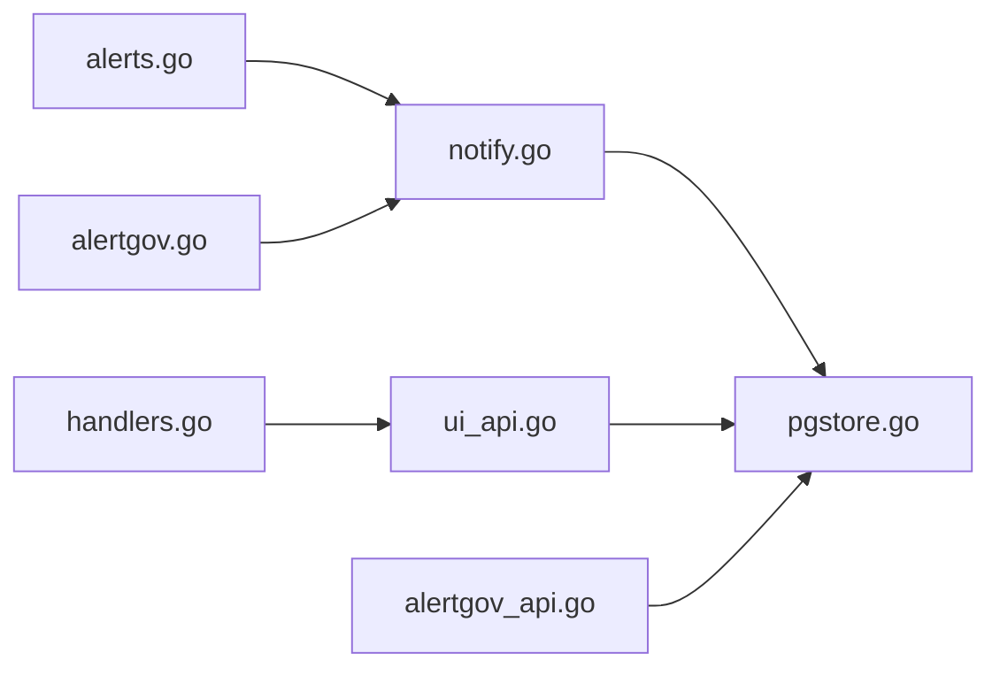

# 告警监控与审计

<cite>
**本文引用的文件**   
- [cmd/server/alerts.go](file://cmd/server/alerts.go)
- [cmd/server/alertgov.go](file://cmd/server/alertgov.go)
- [cmd/server/alertgov_api.go](file://cmd/server/alertgov_api.go)
- [cmd/server/notify.go](file://cmd/server/notify.go)
- [cmd/server/pgstore.go](file://cmd/server/pgstore.go)
- [cmd/server/handlers.go](file://cmd/server/handlers.go)
- [cmd/server/ui_api.go](file://cmd/server/ui_api.go)
- [cmd/server/web/i18n-dashboard.js](file://cmd/server/web/i18n-dashboard.js)
- [cmd/server/i18n/zh-CN.json](file://cmd/server/i18n/zh-CN.json)
</cite>

## 目录
1. [简介](#简介)
2. [项目结构](#项目结构)
3. [核心组件](#核心组件)
4. [架构总览](#架构总览)
5. [详细组件分析](#详细组件分析)
6. [依赖关系分析](#依赖关系分析)
7. [性能考量](#性能考量)
8. [故障排查指南](#故障排查指南)
9. [结论](#结论)
10. [附录](#附录)

## 简介
本章节面向 AIOps Monitor 的“告警监控与审计”能力，围绕以下目标展开：
- 告警历史记录的存储结构与查询接口
- 多维度检索（时间范围、主机、类型、级别）
- 告警统计分析与报表生成（趋势、TOP 排名、响应时间）
- 告警审计日志（生命周期变化与人工操作记录）
- 告警系统健康检查与关键指标（生成速率、通知成功率、延迟）
- 数据保留策略与归档机制
- 健康检查与故障诊断工具使用方法

## 项目结构
与告警监控与审计相关的核心代码位于服务端模块中，主要涉及：
- 阈值评估与告警模型定义
- 告警治理（静默/抑制/路由）
- 通知推送与通道集成
- PostgreSQL 持久化（告警历史、审计日志等）
- HTTP 接口暴露（告警列表、治理配置）
- 前端国际化文案与界面提示

图表来源
- [cmd/server/alerts.go:169-206](file://cmd/server/alerts.go#L169-L206)
- [cmd/server/alertgov.go:84-194](file://cmd/server/alertgov.go#L84-L194)
- [cmd/server/notify.go:102-192](file://cmd/server/notify.go#L102-L192)
- [cmd/server/pgstore.go:200-212](file://cmd/server/pgstore.go#L200-L212)
- [cmd/server/handlers.go:118-118](file://cmd/server/handlers.go#L118-L118)
- [cmd/server/ui_api.go:141-141](file://cmd/server/ui_api.go#L141-L141)
- [cmd/server/alertgov_api.go:11-55](file://cmd/server/alertgov_api.go#L11-L55)
- [cmd/server/web/i18n-dashboard.js:475-503](file://cmd/server/web/i18n-dashboard.js#L475-L503)
- [cmd/server/i18n/zh-CN.json:52-94](file://cmd/server/i18n/zh-CN.json#L52-L94)

章节来源
- [cmd/server/alerts.go:169-206](file://cmd/server/alerts.go#L169-L206)
- [cmd/server/alertgov.go:84-194](file://cmd/server/alertgov.go#L84-L194)
- [cmd/server/notify.go:102-192](file://cmd/server/notify.go#L102-L192)
- [cmd/server/pgstore.go:200-212](file://cmd/server/pgstore.go#L200-L212)
- [cmd/server/handlers.go:118-118](file://cmd/server/handlers.go#L118-L118)
- [cmd/server/ui_api.go:141-141](file://cmd/server/ui_api.go#L141-L141)
- [cmd/server/alertgov_api.go:11-55](file://cmd/server/alertgov_api.go#L11-L55)
- [cmd/server/web/i18n-dashboard.js:475-503](file://cmd/server/web/i18n-dashboard.js#L475-L503)
- [cmd/server/i18n/zh-CN.json:52-94](file://cmd/server/i18n/zh-CN.json#L52-L94)

## 核心组件
- 阈值评估与告警模型
  - 定义告警数据结构与分类函数，支持多种指标维度（CPU/内存/磁盘/IO/IOPS/GPU/负载/进程/连接/API/任务/转发等）。
  - 提供多套阈值预设（保守/标准/宽松），并支持“越低越差”类指标（可用率、吞吐量）判定。
- 告警治理
  - 静默规则：按主机/类型/级别匹配，支持时段与星期生效。
  - 抑制规则：主因告警活跃时抑制衍生告警，可限定同主机。
  - 通知路由：命中后仅发指定渠道，支持继续匹配后续规则。
- 通知调度与推送
  - 周期性评估，仅在状态转换（触发/恢复）时推送，避免刷屏。
  - 写入告警历史（触发插入、恢复更新 resolved_at），并记录审计日志。
  - 支持飞书、钉钉、邮件、自定义 Webhook、短信、语音电话等多通道。
- 持久化与查询
  - 使用 PostgreSQL 表 alert_history 持久化告警历史；提供最近 N 条读取接口。
  - 审计日志表 audit_log 用于操作与系统事件留存。
- API 暴露
  - 告警列表查询接口 GET /api/v1/alerts。
  - 告警治理配置接口：获取/设置整体规则集。

章节来源
- [cmd/server/alerts.go:169-206](file://cmd/server/alerts.go#L169-L206)
- [cmd/server/alertgov.go:84-194](file://cmd/server/alertgov.go#L84-L194)
- [cmd/server/notify.go:102-192](file://cmd/server/notify.go#L102-L192)
- [cmd/server/pgstore.go:411-448](file://cmd/server/pgstore.go#L411-L448)
- [cmd/server/handlers.go:118-118](file://cmd/server/handlers.go#L118-L118)
- [cmd/server/ui_api.go:141-141](file://cmd/server/ui_api.go#L141-L141)
- [cmd/server/alertgov_api.go:11-55](file://cmd/server/alertgov_api.go#L11-L55)

## 架构总览
下图展示从指标采集到告警判定、治理、推送与持久化的完整链路。

图表来源
- [cmd/server/alerts.go:208-468](file://cmd/server/alerts.go#L208-L468)
- [cmd/server/alertgov.go:147-194](file://cmd/server/alertgov.go#L147-L194)
- [cmd/server/notify.go:102-192](file://cmd/server/notify.go#L102-L192)
- [cmd/server/pgstore.go:411-448](file://cmd/server/pgstore.go#L411-L448)

## 详细组件分析

### 告警模型与阈值评估
- 告警模型字段包括主机标识、级别、类型、作用域、首次触发时间、消息、数值与时间戳等。
- 评估流程遍历主机最新指标，逐项判断是否超过阈值或低于阈值（如可用率、吞吐量），并构造告警对象。
- 对 GPU、磁盘 IO、IOPS、进程数异常、连接数、API 业务指标、编排任务、端口转发等均提供独立告警类型。

图表来源
- [cmd/server/alerts.go:169-206](file://cmd/server/alerts.go#L169-L206)
- [cmd/server/alerts.go:208-468](file://cmd/server/alerts.go#L208-L468)
- [cmd/server/alerts.go:470-520](file://cmd/server/alerts.go#L470-L520)

章节来源
- [cmd/server/alerts.go:169-206](file://cmd/server/alerts.go#L169-L206)
- [cmd/server/alerts.go:208-468](file://cmd/server/alerts.go#L208-L468)
- [cmd/server/alerts.go:470-520](file://cmd/server/alerts.go#L470-L520)

### 告警治理（静默/抑制/路由）
- 静默规则：支持按主机名/IP 子串、类型集合、级别集合匹配，并可配置生效时段（含跨天）与星期。
- 抑制规则：当源告警活跃时，抑制目标告警的通知；可要求同主机。
- 通知路由：命中后选择指定渠道；未命中则回退默认全部启用渠道；支持 Continue 继续匹配。

图表来源
- [cmd/server/notify.go:196-276](file://cmd/server/notify.go#L196-L276)
- [cmd/server/alertgov.go:147-194](file://cmd/server/alertgov.go#L147-L194)

章节来源
- [cmd/server/alertgov.go:84-194](file://cmd/server/alertgov.go#L84-L194)
- [cmd/server/notify.go:196-276](file://cmd/server/notify.go#L196-L276)

### 通知调度与推送
- 周期性 tick：比较当前评估结果与上次活跃集合，计算触发/恢复的转换。
- 触发时写入 alert_history（fired_at），恢复时更新 resolved_at；同时记录系统审计日志。
- 推送前执行治理决策；推送成功后记录已推送通道与消息摘要。

图表来源
- [cmd/server/notify.go:102-192](file://cmd/server/notify.go#L102-L192)
- [cmd/server/pgstore.go:411-448](file://cmd/server/pgstore.go#L411-L448)
- [cmd/server/alertgov.go:147-194](file://cmd/server/alertgov.go#L147-L194)

章节来源
- [cmd/server/notify.go:102-192](file://cmd/server/notify.go#L102-L192)
- [cmd/server/pgstore.go:411-448](file://cmd/server/pgstore.go#L411-L448)

### 告警历史存储结构与查询接口
- 存储结构
  - 表 alert_history：包含 id、key、fired_at、resolved_at、data(JSONB)。
  - 索引：按 key 与 fired_at 排序优化查询。
- 写入与恢复
  - 触发时 INSERT（记录 key、fired_at、data）。
  - 恢复时 UPDATE（设置 resolved_at）。
- 查询接口
  - GET /api/v1/alerts：返回最近 N 条告警历史（按 id 倒序取 Top-N，再正序输出）。
  - 前端通过该接口渲染“近期告警”面板。

图表来源
- [cmd/server/pgstore.go:200-212](file://cmd/server/pgstore.go#L200-L212)
- [cmd/server/pgstore.go:411-448](file://cmd/server/pgstore.go#L411-L448)
- [cmd/server/handlers.go:118-118](file://cmd/server/handlers.go#L118-L118)
- [cmd/server/ui_api.go:141-141](file://cmd/server/ui_api.go#L141-L141)

章节来源
- [cmd/server/pgstore.go:200-212](file://cmd/server/pgstore.go#L200-L212)
- [cmd/server/pgstore.go:411-448](file://cmd/server/pgstore.go#L411-L448)
- [cmd/server/handlers.go:118-118](file://cmd/server/handlers.go#L118-L118)
- [cmd/server/ui_api.go:141-141](file://cmd/server/ui_api.go#L141-L141)

### 告警统计分析与报表生成
- 趋势分析
  - 基于 alert_history 的 fired_at/resolved_at 序列，可计算单位时间内的触发次数、持续时间分布、恢复时长等。
- TOP 告警排名
  - 按 type/host/level 聚合计数，结合 data JSONB 中的 message/value 进行二次加工，得到 TOP 告警类型与主机。
- 告警响应时间统计
  - 利用 resolved_at - fired_at 计算单条告警的平均响应时长，并按级别/类型分组统计。
- 实现建议
  - 在数据库侧创建视图或物化视图，定期汇总统计指标，供前端报表展示。
  - 注意分页与时间窗口参数，避免全表扫描。

[本节为概念性说明，不直接分析具体文件]

### 告警审计日志记录
- 审计内容
  - 系统事件：告警触发/恢复、通道发送结果、治理决策（静默/抑制）等。
  - 人工操作：更新告警治理规则等操作记录。
- 存储与查询
  - 表 audit_log：ts、data(JSONB)，按时间倒序加载最近 N 条。
  - 前端“操作与介入日志”页面展示。

章节来源
- [cmd/server/pgstore.go:302-332](file://cmd/server/pgstore.go#L302-L332)
- [cmd/server/alertgov_api.go:53-55](file://cmd/server/alertgov_api.go#L53-L55)
- [cmd/server/web/i18n-dashboard.js:511-522](file://cmd/server/web/i18n-dashboard.js#L511-L522)

### 告警性能监控指标
- 告警生成速率
  - 单位时间内 Evaluate 产生的告警数量（可通过审计日志或外部计数器统计）。
- 通知发送成功率
  - 各通道发送成功/失败比例，来源于 pushChannels 的记录。
- 延迟统计
  - 评估周期间隔、网络调用耗时（HTTP 超时、签名计算）、PG 写入耗时。
- 建议
  - 在 Notifier.tick 与 pushChannels 中加入埋点，统计 P50/P95/P99 延迟。
  - 将关键指标导出至 VictoriaMetrics 或 Prometheus，便于可视化。

[本节为通用指导，不直接分析具体文件]

### 告警数据保留策略与归档机制
- 现状
  - alert_history 与 audit_log 在 PG 中无内置清理逻辑，属于“无限增长”。
- 建议策略
  - 按月/季度分区或分表，便于归档与删除。
  - 设定保留期（如 90 天），对过期数据进行冷备与清理。
  - 对高频查询的近期数据建立索引与缓存，降低长尾查询成本。

[本节为通用指导，不直接分析具体文件]

### 健康检查与故障诊断工具
- 健康检查
  - 查看“统计与健康”面板（在线率、系统状态、活跃告警、待处理告警）。
  - 通过治理配置接口校验规则有效性（获取/设置）。
- 故障诊断
  - 审计日志：定位静默/抑制命中原因、通道发送失败详情。
  - 告警历史：核对 fired_at/resolved_at 是否符合预期。
  - 通道连通性测试：使用 SendTest 功能验证飞书/钉钉/邮件/短信/语音。

章节来源
- [cmd/server/web/i18n-dashboard.js:475-503](file://cmd/server/web/i18n-dashboard.js#L475-L503)
- [cmd/server/alertgov_api.go:11-55](file://cmd/server/alertgov_api.go#L11-L55)
- [cmd/server/notify.go:307-355](file://cmd/server/notify.go#L307-L355)

## 依赖关系分析
- 组件耦合
  - 评估模块与治理模块解耦，通过函数式输入输出协作。
  - 通知器依赖配置存储与持久化层，负责状态机与通道发送。
  - API 层仅暴露查询与配置接口，不直接参与评估与推送。
- 外部依赖
  - PostgreSQL：告警历史与审计日志持久化。
  - 第三方通道：飞书/钉钉/邮件/短信/语音电话。

图表来源
- [cmd/server/alerts.go:208-468](file://cmd/server/alerts.go#L208-L468)
- [cmd/server/alertgov.go:147-194](file://cmd/server/alertgov.go#L147-L194)
- [cmd/server/notify.go:102-192](file://cmd/server/notify.go#L102-L192)
- [cmd/server/pgstore.go:411-448](file://cmd/server/pgstore.go#L411-L448)
- [cmd/server/handlers.go:118-118](file://cmd/server/handlers.go#L118-L118)
- [cmd/server/ui_api.go:141-141](file://cmd/server/ui_api.go#L141-L141)
- [cmd/server/alertgov_api.go:11-55](file://cmd/server/alertgov_api.go#L11-L55)

章节来源
- [cmd/server/alerts.go:208-468](file://cmd/server/alerts.go#L208-L468)
- [cmd/server/alertgov.go:147-194](file://cmd/server/alertgov.go#L147-L194)
- [cmd/server/notify.go:102-192](file://cmd/server/notify.go#L102-L192)
- [cmd/server/pgstore.go:411-448](file://cmd/server/pgstore.go#L411-L448)
- [cmd/server/handlers.go:118-118](file://cmd/server/handlers.go#L118-L118)
- [cmd/server/ui_api.go:141-141](file://cmd/server/ui_api.go#L141-L141)
- [cmd/server/alertgov_api.go:11-55](file://cmd/server/alertgov_api.go#L11-L55)

## 性能考量
- 评估频率与批量大小
  - 合理设置 tick 间隔，避免频繁全量评估；对主机规模较大的场景考虑分批评估。
- 通知去重与节流
  - 仅状态转换推送，避免刷屏；对同一主机/类型的密集告警可叠加抑制规则。
- 数据库查询优化
  - 使用 LIMIT 与索引（key、fired_at）限制返回量；报表统计采用预聚合视图。
- 通道发送可靠性
  - 设置合理的 HTTP 超时与重试策略；失败记录审计日志以便追踪。

[本节为通用指导，不直接分析具体文件]

## 故障排查指南
- 常见问题
  - 通道发送失败：检查飞书/钉钉签名、SMTP 配置、短信/语音凭证与模板参数。
  - 静默/抑制误判：核对规则匹配条件与时段设置。
  - 告警未恢复：确认 resolved_at 是否正确更新，检查恢复条件是否满足。
- 定位步骤
  - 查看审计日志，确认静默/抑制命中与通道发送结果。
  - 查询告警历史，核对 fired_at/resolved_at 与消息内容。
  - 使用治理配置接口获取/设置规则，确保命名与启用状态正确。

章节来源
- [cmd/server/notify.go:196-276](file://cmd/server/notify.go#L196-L276)
- [cmd/server/pgstore.go:411-448](file://cmd/server/pgstore.go#L411-L448)
- [cmd/server/alertgov_api.go:11-55](file://cmd/server/alertgov_api.go#L11-L55)

## 结论
AIOps Monitor 的告警监控与审计体系以“阈值评估 + 治理决策 + 多通道推送 + PG 持久化”为核心，具备高扩展性与可观测性。通过完善的审计日志与治理规则，可有效抑制告警风暴、提升运维效率。建议在大规模部署中引入统计视图与保留策略，并结合外部指标平台完善性能监控与容量规划。

[本节为总结性内容，不直接分析具体文件]

## 附录
- 相关前端文案与消息模板
  - 仪表盘文案：“统计与健康”、“近期告警”、“操作与介入日志”等。
  - 中文消息模板：告警标题、级别、类型、时间与详情等。

章节来源
- [cmd/server/web/i18n-dashboard.js:475-503](file://cmd/server/web/i18n-dashboard.js#L475-L503)
- [cmd/server/i18n/zh-CN.json:52-94](file://cmd/server/i18n/zh-CN.json#L52-L94)