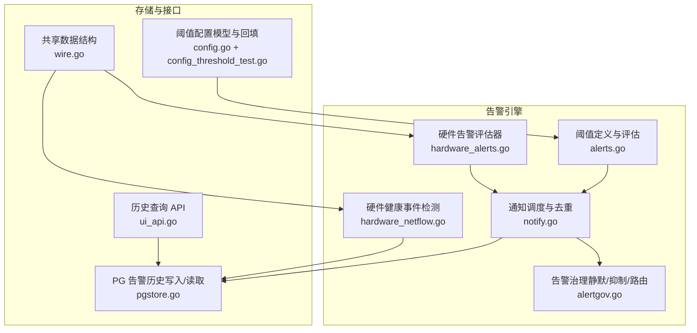
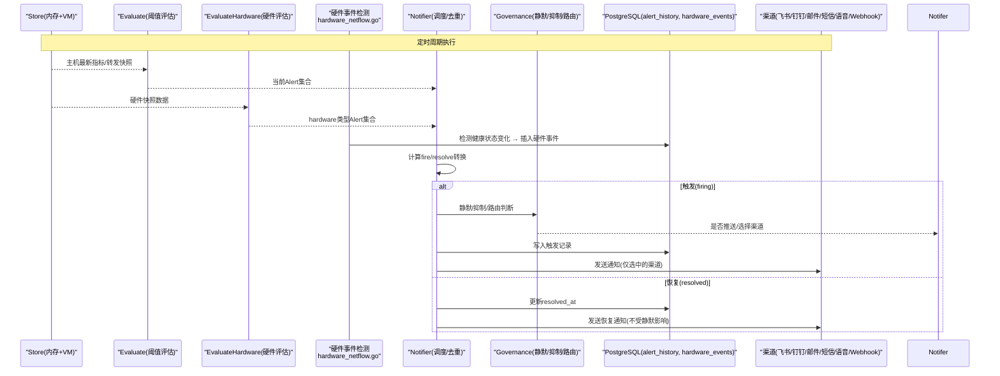
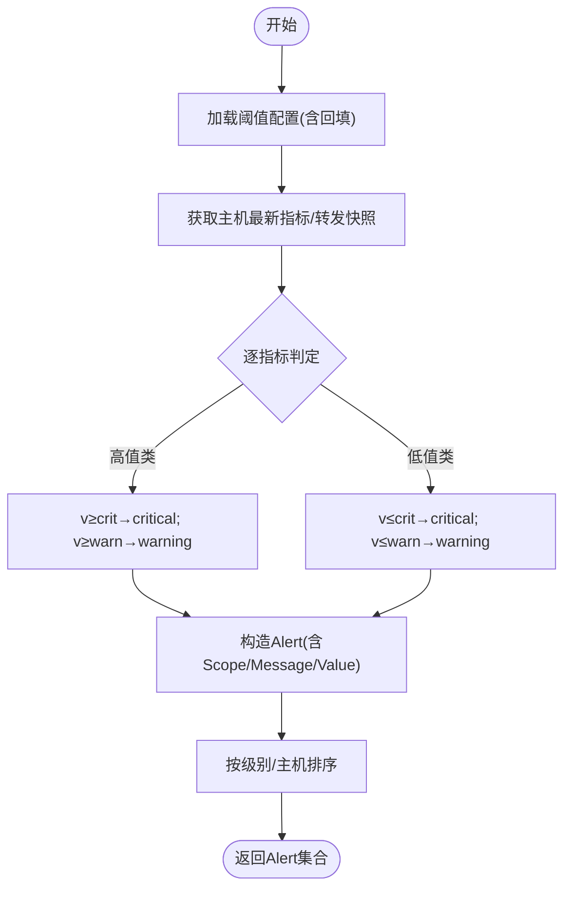
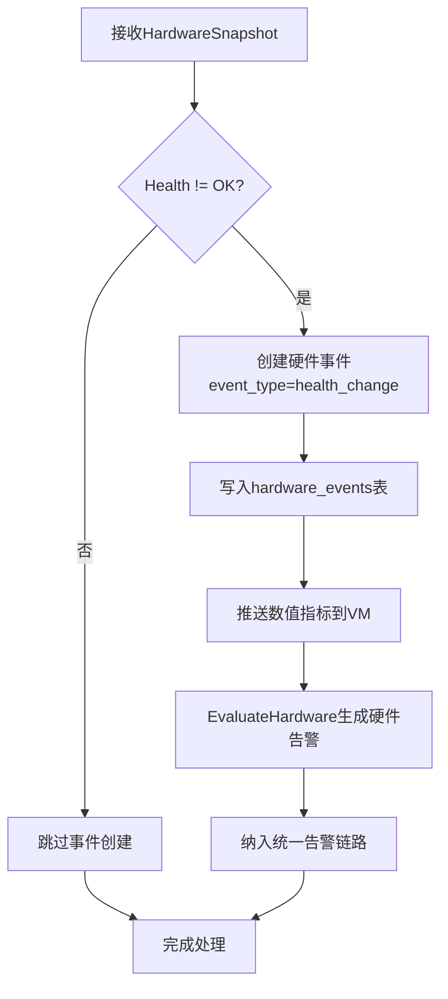
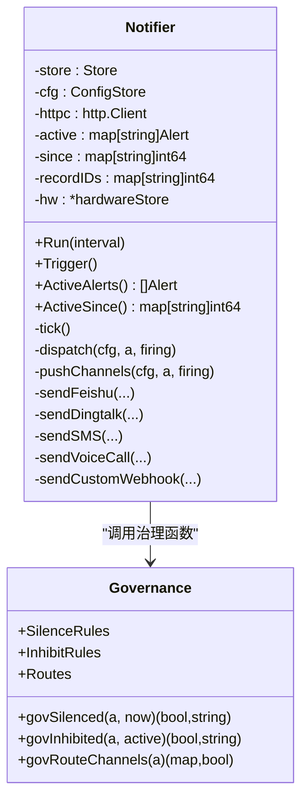
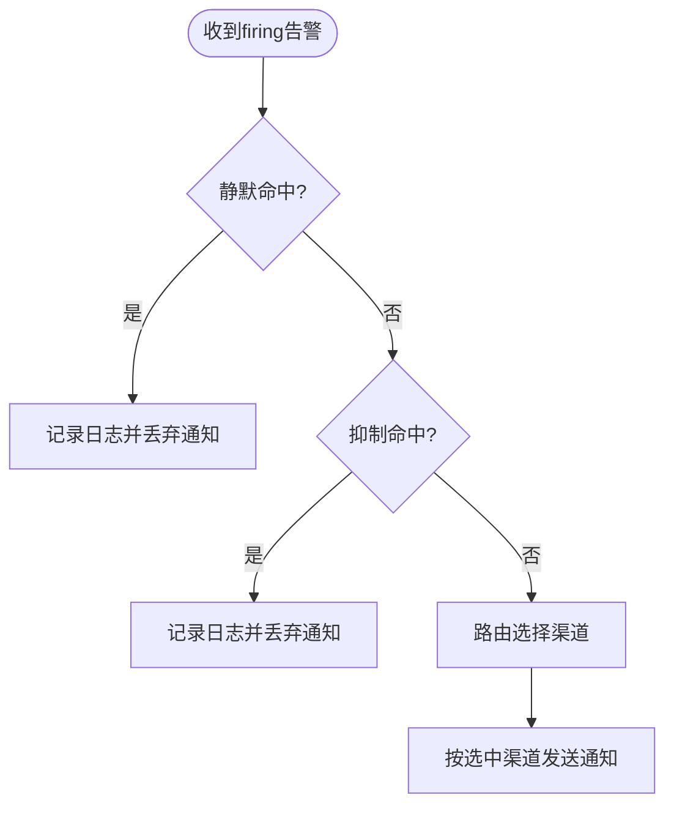
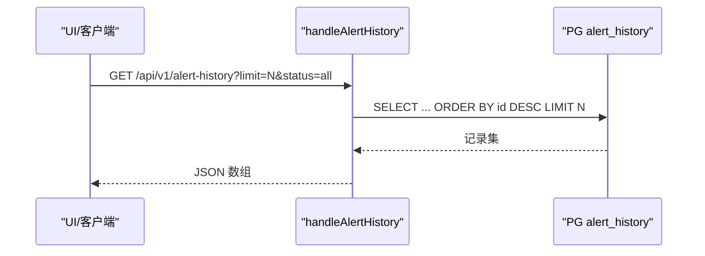
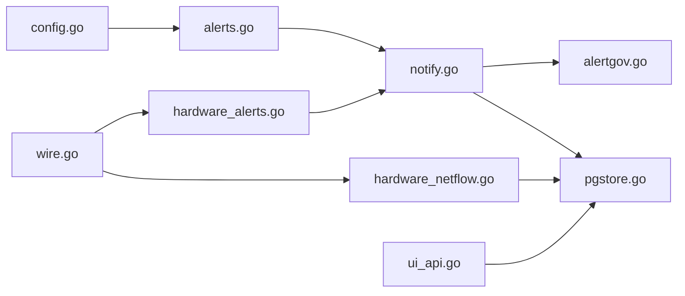

# 告警系统

<cite>
**本文引用的文件列表**
- [cmd/server/alerts.go](file://cmd/server/alerts.go)
- [cmd/server/notify.go](file://cmd/server/notify.go)
- [cmd/server/alertgov.go](file://cmd/server/alertgov.go)
- [cmd/server/alertgov_api.go](file://cmd/server/alertgov_api.go)
- [cmd/server/pgstore.go](file://cmd/server/pgstore.go)
- [cmd/server/ui_api.go](file://cmd/server/ui_api.go)
- [cmd/server/config.go](file://cmd/server/config.go)
- [cmd/server/config_threshold_test.go](file://cmd/server/config_threshold_test.go)
- [cmd/server/hardware_netflow.go](file://cmd/server/hardware_netflow.go)
- [cmd/server/hardware_alerts.go](file://cmd/server/hardware_alerts.go)
- [shared/wire.go](file://shared/wire.go)
- [README.md](file://README.md)
</cite>

## 更新摘要
**变更内容**
- 新增硬件健康事件检测机制：当硬件健康状态从OK变为Warning/Critical时自动生成硬件事件
- 扩展告警类型以包含hardware维度，支持完整的硬件监控告警
- 增强通知渠道对硬件告警的完整支持
- 新增硬件快照存储、查询和历史记录管理能力
- 实现硬件告警与现有告警系统的无缝集成

## 目录
1. [简介](#简介)
2. [项目结构（与告警相关）](#项目结构与告警相关)
3. [核心组件](#核心组件)
4. [架构总览](#架构总览)
5. [详细组件分析](#详细组件分析)
6. [依赖关系分析](#依赖关系分析)
7. [性能考量](#性能考量)
8. [故障排查指南](#故障排查指南)
9. [结论](#结论)
10. [附录：阈值配置示例与最佳实践](#附录阈值配置示例与最佳实践)

## 简介
本文件面向 AIOps Monitor 的告警子系统，系统性阐述智能告警引擎的工作原理、27 组内置阈值规则的配置与管理、告警状态生命周期管理、多渠道通知机制（邮件、短信、Webhook、钉钉、飞书等），以及告警治理（静默、抑制、路由）、历史记录查询与分析。文档同时提供告警规则配置的实操示例与性能优化建议，帮助读者快速落地并稳定运行生产级告警体系。

**重大更新** 新增硬件健康事件检测机制，当硬件健康状态从OK变为Warning/Critical时自动生成硬件事件，扩展告警类型以包含hardware维度，增强通知渠道对硬件告警的支持，实现完整的硬件监控告警闭环。

## 项目结构（与告警相关）
与告警相关的核心代码集中在服务端模块中，主要涉及以下文件：
- 阈值定义与评估：cmd/server/alerts.go
- 通知调度与渠道投递：cmd/server/notify.go
- 告警治理（静默/抑制/路由）：cmd/server/alertgov.go、cmd/server/alertgov_api.go
- 告警历史持久化与查询：cmd/server/pgstore.go、cmd/server/ui_api.go
- 硬件健康事件检测：cmd/server/hardware_netflow.go、cmd/server/hardware_alerts.go
- 共享数据结构定义：shared/wire.go
- 阈值配置模型与回填逻辑：cmd/server/config.go、cmd/server/config_threshold_test.go
- 用户手册与配置说明：README.md

**图表来源**
- [cmd/server/alerts.go:1-544](file://cmd/server/alerts.go#L1-L544)
- [cmd/server/notify.go:1-210](file://cmd/server/notify.go#L1-L210)
- [cmd/server/alertgov.go:1-226](file://cmd/server/alertgov.go#L1-L226)
- [cmd/server/hardware_netflow.go:1-396](file://cmd/server/hardware_netflow.go#L1-L396)
- [cmd/server/hardware_alerts.go:1-216](file://cmd/server/hardware_alerts.go#L1-L216)
- [cmd/server/pgstore.go:411-450](file://cmd/server/pgstore.go#L411-L450)
- [cmd/server/ui_api.go:195-238](file://cmd/server/ui_api.go#L195-L238)
- [shared/wire.go:143-237](file://shared/wire.go#L143-L237)
- [cmd/server/config.go:75-304](file://cmd/server/config.go#L75-L304)
- [cmd/server/config_threshold_test.go:1-58](file://cmd/server/config_threshold_test.go#L1-L58)

## 核心组件
- 阈值与评估器
  - 定义 27 组 warn/crit 阈值，覆盖主机资源、拨测、API 业务监控、编排任务、端口转发五大维度；支持保守/标准/宽松三档预设。
  - Evaluate/EvaluateForward 对主机最新指标与转发快照进行判定，输出 Alert 集合。
- 通知调度器
  - 周期性 tick 计算当前 firing 集合，与上次状态对比得到 fire/resolve 转换事件，仅推送"状态变化"，避免刷屏。
  - 维护 active/since/recordIDs 以支撑去重、持续时长展示与恢复更新。
- 告警治理
  - 静默：按主机/类型/级别匹配，支持时段与星期，命中则不推送（仍记录）。
  - 抑制：当源告警活跃时抑制目标告警（可限定同主机）。
  - 路由：命中后仅发指定渠道，未命中则走默认全部启用渠道。
- **硬件健康事件检测与告警**
  - 监听硬件快照中的健康状态变化，当从 OK 变为 Warning/Critical 时自动生成硬件事件。
  - 支持温度传感器、风扇转速、电源状态、存储设备等硬件组件监控。
  - 通过独立的 EvaluateHardware 函数生成 hardware 类型的告警，融入统一告警链路。
- 持久化与查询
  - 触发写 alert_history 表，恢复时更新 resolved_at；提供最近 N 条查询与按 firing/resolved/all 过滤。
  - 硬件快照持久化到 hardware_snapshot 表，支持按主机查询最新状态。
  - 硬件事件记录到 hardware_events 表，支持状态变更追踪。
- 配置与回填
  - ThresholdConfig 映射前端表单字段；保存时对零值自动回填为标准默认，防止误报。

**章节来源**
- [cmd/server/alerts.go:1-544](file://cmd/server/alerts.go#L1-L544)
- [cmd/server/notify.go:1-210](file://cmd/server/notify.go#L1-L210)
- [cmd/server/alertgov.go:1-226](file://cmd/server/alertgov.go#L1-L226)
- [cmd/server/hardware_netflow.go:48-54](file://cmd/server/hardware_netflow.go#L48-L54)
- [cmd/server/hardware_alerts.go:95-216](file://cmd/server/hardware_alerts.go#L95-L216)
- [cmd/server/pgstore.go:411-450](file://cmd/server/pgstore.go#L411-L450)
- [cmd/server/ui_api.go:195-238](file://cmd/server/ui_api.go#L195-L238)
- [cmd/server/config.go:75-304](file://cmd/server/config.go#L75-L304)
- [cmd/server/config_threshold_test.go:1-58](file://cmd/server/config_threshold_test.go#L1-L58)

## 架构总览
下图展示了从指标到通知的全链路流程，包括治理决策与多渠道投递，以及新增的硬件健康事件检测和硬件告警评估。

**图表来源**
- [cmd/server/alerts.go:204-516](file://cmd/server/alerts.go#L204-L516)
- [cmd/server/hardware_alerts.go:95-216](file://cmd/server/hardware_alerts.go#L95-L216)
- [cmd/server/hardware_netflow.go:48-54](file://cmd/server/hardware_netflow.go#L48-L54)
- [cmd/server/notify.go:102-210](file://cmd/server/notify.go#L102-L210)
- [cmd/server/alertgov.go:147-194](file://cmd/server/alertgov.go#L147-L194)
- [cmd/server/pgstore.go:411-450](file://cmd/server/pgstore.go#L411-L450)

## 详细组件分析

### 阈值与评估器（27 组规则）
- 规则范围
  - 主机资源：CPU、内存、磁盘、磁盘 IO、IOPS、GPU（算力/温度/显存）、系统负载、进程数异常、连接数、离线判定。
  - 拨测监控：Ping 丢包率/延迟、TCP 超时、HTTP 响应时间与状态码、进程存活失败次数。
  - API 业务监控：可用率、平均响应、P95 响应、吞吐量。
  - 编排任务：失败次数、超时时长。
  - 端口转发：活跃连接、带宽使用率、错误率、平均延迟。
- 评估逻辑
  - 高值告警：value ≥ crit → critical；value ≥ warn → warning。
  - 低值告警（如可用率、吞吐）：value ≤ crit → critical；value ≤ warn → warning。
  - GPU 多 Scope（name/name/temp/name/mem）避免 key 冲突。
  - 结果排序：critical 优先，其次按主机名排序。
- 预设与回填
  - 保守/标准/宽松三档预设；ThresholdConfig 保存时零值自动回填为标准默认，避免误报。

**图表来源**
- [cmd/server/alerts.go:180-202](file://cmd/server/alerts.go#L180-L202)
- [cmd/server/alerts.go:204-516](file://cmd/server/alerts.go#L204-L516)
- [cmd/server/config.go:280-304](file://cmd/server/config.go#L280-L304)
- [cmd/server/config_threshold_test.go:1-58](file://cmd/server/config_threshold_test.go#L1-L58)

**章节来源**
- [cmd/server/alerts.go:1-544](file://cmd/server/alerts.go#L1-L544)
- [cmd/server/config.go:75-304](file://cmd/server/config.go#L75-L304)
- [cmd/server/config_threshold_test.go:1-58](file://cmd/server/config_threshold_test.go#L1-L58)

### 硬件健康事件检测与告警系统
**重大更新** 硬件健康事件检测与告警系统是本次更新的核心特性，专门处理来自 Redfish 采集器的硬件状态信息，实现了完整的硬件监控告警闭环。

#### 健康状态检测机制
- **状态变更检测**
  - 监听 HardwareSnapshot 中的 Health 字段（OK/Warning/Critical）
  - 当健康状态从 OK 变为 Warning 或 Critical 时，自动生成硬件事件
  - 事件类型标记为 "health_change"，严重程度对应硬件状态
  - 使用 healthChanged 函数确保只在状态变化时记录事件，避免重复记录

#### 硬件告警评估器
- **多维度硬件监控**
  - CPU：型号、核心数、健康状态、温度
  - 内存：容量、DIMM 状态、健康情况
  - 存储：物理盘/RAID 卷状态、SMART 预警
  - 散热：温度传感器读数、风扇转速
  - 电源：PSU 冗余状态、功耗监测
- **告警生成逻辑**
  - 通过 EvaluateHardware 函数将硬件快照转换为标准 Alert 格式
  - 支持 BMC 自身阈值判断（UpperCaution/UpperCritical）
  - 特殊处理：风扇停止（0 RPM）但报告健康状态时升级为严重告警
  - SMART 预警直接升级为严重告警

#### 数据存储与查询
- **硬件快照持久化**
  - 硬件快照持久化到 hardware_snapshot 表
  - 支持 UPSERT 操作，避免重复数据
  - 数值指标推送到 VictoriaMetrics 用于趋势分析
- **硬件事件记录**
  - 健康事件记录到 hardware_events 表
  - 支持按主机和时间范围查询
  - 索引优化：host_id + created_at DESC

**图表来源**
- [cmd/server/hardware_netflow.go:48-54](file://cmd/server/hardware_netflow.go#L48-L54)
- [cmd/server/hardware_alerts.go:95-216](file://cmd/server/hardware_alerts.go#L95-L216)
- [cmd/server/pgstore.go:1289-1298](file://cmd/server/pgstore.go#L1289-L1298)
- [shared/wire.go:143-159](file://shared/wire.go#L143-L159)

**章节来源**
- [cmd/server/hardware_netflow.go:19-58](file://cmd/server/hardware_netflow.go#L19-L58)
- [cmd/server/hardware_alerts.go:1-216](file://cmd/server/hardware_alerts.go#L1-L216)
- [cmd/server/pgstore.go:1277-1331](file://cmd/server/pgstore.go#L1277-L1331)
- [shared/wire.go:143-237](file://shared/wire.go#L143-L237)

### 通知调度与多渠道投递
- 去重与状态机
  - 基于 alertKey=host_id/type/scope 跟踪当前 firing 集合与首次触发时间 since。
  - 仅对 fire/resolve 转换事件进行推送，避免持续条件刷屏。
- 持久化
  - 触发时插入 alert_history 记录；恢复时更新 resolved_at。
- 渠道
  - 飞书/钉钉 Webhook、SMTP 邮件、自定义 Webhook、阿里云/华为云/腾讯云短信、阿里云/华为云/腾讯云语音电话（TTS）。
  - 所有出站请求均受 SSRF 防护（拦截元数据地址与链路本地）。
- 治理集成
  - 触发前依次执行：静默→抑制→路由；恢复一律照发。
- **硬件告警支持**
  - 硬件告警通过统一的 Notifier 系统处理，支持所有现有通知渠道
  - 硬件告警类型标记为 "hardware"，可与现有治理规则配合使用

**图表来源**
- [cmd/server/notify.go:26-210](file://cmd/server/notify.go#L26-L210)
- [cmd/server/alertgov.go:147-194](file://cmd/server/alertgov.go#L147-L194)

**章节来源**
- [cmd/server/notify.go:1-800](file://cmd/server/notify.go#L1-L800)
- [cmd/server/notify.go:801-1216](file://cmd/server/notify.go#L801-L1216)
- [cmd/server/alertgov.go:1-226](file://cmd/server/alertgov.go#L1-L226)

### 告警治理（静默/抑制/路由）
- 静默规则
  - 匹配：主机名/IP 子串、类型集合、级别集合。
  - 生效：可选时段 HH:MM（支持跨天）与星期集合。
- 抑制规则
  - 当 Source 告警活跃时抑制 Target 告警；可要求 SameHost。
- 通知路由
  - 命中后仅向 Channels 指定的渠道发送；Continue 允许继续匹配后续规则。
- 配置 API
  - GET/POST /api/v1/governance 获取或整体替换治理配置；服务端清洗无名空规则并生成 ID。
- **硬件告警治理支持**
  - 支持针对 hardware 类型的专用治理规则
  - 可配置硬件告警的特殊路由策略（如严重硬件告警直接走短信/语音）

**图表来源**
- [cmd/server/alertgov.go:147-194](file://cmd/server/alertgov.go#L147-L194)
- [cmd/server/alertgov_api.go:1-56](file://cmd/server/alertgov_api.go#L1-L56)
- [cmd/server/notify.go:196-210](file://cmd/server/notify.go#L196-L210)

**章节来源**
- [cmd/server/alertgov.go:1-226](file://cmd/server/alertgov.go#L1-L226)
- [cmd/server/alertgov_api.go:1-56](file://cmd/server/alertgov_api.go#L1-L56)
- [cmd/server/notify.go:196-210](file://cmd/server/notify.go#L196-L210)

### 告警历史记录与查询
- 写入
  - 触发时插入 alert_history(key,fired_at,data)，data 为 JSON 序列化记录。
  - 恢复时 UPDATE resolved_at。
- 查询
  - 最近 N 条（默认 100，最大 500），支持 status=firing|resolved|all 过滤。
  - 通过 UI API 暴露，供面板与移动端消费。
- **硬件历史记录**
  - 硬件快照查询：GET /api/v1/hardware-health?host={host_id}
  - 硬件历史趋势：GET /api/v1/hardware-history?host={host_id}&metric={temperature|power|fan_rpm|health_score}
  - 硬件事件查询：支持按主机和时间范围查询硬件状态变更记录

**图表来源**
- [cmd/server/pgstore.go:411-450](file://cmd/server/pgstore.go#L411-L450)
- [cmd/server/ui_api.go:195-238](file://cmd/server/ui_api.go#L195-L238)

**章节来源**
- [cmd/server/pgstore.go:411-450](file://cmd/server/pgstore.go#L411-L450)
- [cmd/server/ui_api.go:195-238](file://cmd/server/ui_api.go#L195-L238)

### 阈值配置管理与回填策略
- 配置项
  - ThresholdConfig 包含 27 个 warn/crit 字段，映射至内部 Thresholds。
  - 支持三档预设（保守/标准/宽松）与零值自动回填。
- 回填测试
  - 全零回填为标准默认；部分零值仅回填缺失项，保留显式设置。
  - Set 操作确保新指标阈值为 0 时也能持久化为标准默认并通过校验。

**章节来源**
- [cmd/server/config.go:75-304](file://cmd/server/config.go#L75-L304)
- [cmd/server/config_threshold_test.go:1-58](file://cmd/server/config_threshold_test.go#L1-L58)
- [README.md](file://README.md)

## 依赖关系分析
- 组件耦合
  - Notifier 依赖 Store、ConfigStore、Governance 与外部 HTTP 客户端；对外部渠道强依赖但封装良好。
  - alerts.go 仅依赖配置与主机指标，无外部 I/O，纯计算。
  - pgstore.go 仅负责 PG 读写，被 Notifier 与 UI API 复用。
  - hardware_netflow.go 独立处理硬件数据流，与主告警系统解耦。
  - hardware_alerts.go 提供硬件告警评估，与 Notifier 集成。
- 潜在循环
  - 未发现直接循环依赖；Notifier 与 Governance 单向调用。
- 外部依赖
  - 飞书/钉钉 Webhook、SMTP、阿里云/华为云/腾讯云短信与语音 API；统一经 SSRF 防护客户端发出。

**图表来源**
- [cmd/server/alerts.go:1-544](file://cmd/server/alerts.go#L1-L544)
- [cmd/server/notify.go:1-210](file://cmd/server/notify.go#L1-L210)
- [cmd/server/alertgov.go:1-226](file://cmd/server/alertgov.go#L1-L226)
- [cmd/server/hardware_netflow.go:1-396](file://cmd/server/hardware_netflow.go#L1-L396)
- [cmd/server/hardware_alerts.go:1-216](file://cmd/server/hardware_alerts.go#L1-L216)
- [cmd/server/pgstore.go:411-450](file://cmd/server/pgstore.go#L411-L450)
- [cmd/server/ui_api.go:195-238](file://cmd/server/ui_api.go#L195-L238)
- [cmd/server/config.go:75-304](file://cmd/server/config.go#L75-L304)
- [shared/wire.go:143-237](file://shared/wire.go#L143-L237)

## 性能考量
- 评估阶段
  - 纯 CPU 计算，复杂度 O(H×M)（H 为主机数，M 为指标种类），排序 O(A log A)（A 为告警数量）。
  - 硬件告警评估复杂度 O(H×S)（S 为每个主机的硬件组件数量）。
- 通知阶段
  - 去重与转换计算在锁内完成，网络 I/O 在锁外执行，降低锁竞争。
  - 仅推送状态变化，避免重复消息风暴。
- 存储阶段
  - alert_history 追加写与单行更新，适合时序审计；查询限制 limit 控制 IO。
  - 硬件快照 UPSERT 操作，避免重复数据；硬件事件追加写。
  - 硬件事件检测使用内存缓存，避免频繁数据库查询。
- 外部通道
  - 各渠道独立发送，错误不影响其他渠道；SSRF 防护增加少量开销但必要。
- 硬件数据处理
  - 硬件快照批量处理，单个目标的健康状态检测为 O(1) 操作。
  - VM 指标推送异步执行，不阻塞主流程。
  - 健康状态变更检测使用内存映射，避免数据库访问。
- 建议
  - 合理设置 tick 间隔，平衡实时性与负载。
  - 使用路由将关键告警分流至高可靠渠道（如短信/语音），普通告警走 IM。
  - 利用静默/抑制减少夜间噪音，提升值班效率。
  - 硬件数据采集频率可根据设备重要性调整，关键设备缩短采集间隔。

## 故障排查指南
- 渠道连通性
  - 使用"发送测试"功能逐一验证飞书/钉钉/邮件/短信/语音/Webhook 连通性。
  - 关注日志中对应渠道的错误信息（如签名不匹配、模板参数非法、号码格式错误等）。
- 静默/抑制/路由
  - 若告警未推送，检查静默规则的时间窗与星期是否命中；确认抑制规则的 Source 是否活跃且 SameHost 是否满足；核对路由 Channels 是否正确。
- 阈值误报/漏报
  - 检查 ThresholdConfig 是否存在零值导致回填；必要时调整三档预设或逐项微调。
- 历史查询
  - 使用 /api/v1/alert-history 查看最近记录，确认 fired_at/resolved_at 是否符合预期。
- **硬件健康事件排查**
  - 检查 Agent 是否正确上报 Redfish 数据，确认 X-Agent-Fingerprint 认证通过。
  - 查看 hardware_events 表确认健康状态变更记录。
  - 验证 VictoriaMetrics 中硬件指标是否正常写入。
  - 检查 hardware_store 内存缓存状态，确认健康状态变更检测正常工作。
  - 确认 EvaluateHardware 函数生成的硬件告警是否正确进入统一告警链路。

**章节来源**
- [cmd/server/notify.go:309-355](file://cmd/server/notify.go#L309-355)
- [cmd/server/alertgov.go:147-194](file://cmd/server/alertgov.go#L147-L194)
- [cmd/server/ui_api.go:195-238](file://cmd/server/ui_api.go#L195-L238)
- [cmd/server/config_threshold_test.go:1-58](file://cmd/server/config_threshold_test.go#L1-L58)
- [cmd/server/hardware_netflow.go:19-58](file://cmd/server/hardware_netflow.go#L19-L58)
- [cmd/server/hardware_alerts.go:95-216](file://cmd/server/hardware_alerts.go#L95-L216)

## 结论
AIOps Monitor 的告警系统以"阈值评估 + 状态转换 + 治理决策 + 多渠道投递 + 持久化审计"为核心闭环，具备 27 组细粒度阈值、灵活的治理策略与丰富的通知渠道。**重大更新** 新增的硬件健康事件检测机制与硬件告警评估器进一步增强了基础设施监控能力，能够及时发现服务器硬件故障，为运维团队提供更全面的健康视图。通过统一的告警链路，硬件告警与现有告警系统无缝集成，支持相同的治理策略和通知渠道。通过合理的阈值回填、治理规则与渠道路由，可在保障敏感问题及时触达的同时有效抑制告警风暴，提升运维效率与稳定性。

## 附录：阈值配置示例与最佳实践

### 阈值配置示例（按维度）
- 主机资源
  - CPU 警告/严重：80/95（%）
  - 内存 警告/严重：85/95（%）
  - 磁盘 警告/严重：80/90（%）
  - 磁盘 IO 警告/严重：80/95（%）
  - IOPS 警告/严重：50000/100000
  - GPU 算力 警告/严重：80/95（%）
  - GPU 温度 警告/严重：85/95（℃）
  - GPU 显存 警告/严重：90/97（%）
  - 系统负载 警告/严重：4.0/8.0（×核心数）
  - 进程数异常比例：0.5（50%）
  - 主机连接数 警告/严重：5000/10000
  - 失联判定：60 秒
- 拨测监控
  - Ping 丢包率 警告/严重：10/30（%）
  - Ping 延迟 警告/严重：100/500（ms）
  - TCP 超时 警告/严重：1000/5000（ms）
  - HTTP 响应时间 警告/严重：1000/5000（ms）
  - HTTP 非 2xx 次数 警告/严重：1/5
  - 进程存活失败次数 警告/严重：1/3
- API 业务监控
  - 可用率 警告/严重：99.0/95.0（%）
  - 平均响应 警告/严重：500/2000（ms）
  - P95 响应 警告/严重：1000/5000（ms）
  - 吞吐量 警告/严重：100/10（req/s）
- 编排任务
  - 失败次数 警告/严重：1/5
  - 超时时长 警告/严重：60/300（s）
- 端口转发
  - 活跃连接 警告/严重：200/280
  - 带宽使用率 警告/严重：80/95（%）
  - 错误率 警告/严重：5/15（%）
  - 平均延迟 警告/严重：1000/5000（ms）
- **硬件健康监控**
  - 硬件健康状态：OK → Warning/Critical 自动事件
  - 温度传感器：根据设备规格设定阈值
  - 风扇转速：低于正常范围下限告警
  - 电源状态：PSU 故障或冗余丢失告警
  - 存储设备：SMART 预警或 RAID 降级告警
  - CPU：健康状态异常告警
  - 内存 DIMM：插槽故障告警

**章节来源**
- [cmd/server/alerts.go:54-163](file://cmd/server/alerts.go#L54-L163)
- [cmd/server/hardware_alerts.go:137-211](file://cmd/server/hardware_alerts.go#L137-L211)
- [shared/wire.go:143-237](file://shared/wire.go#L143-L237)
- [README.md](file://README.md)

### 告警治理规则示例
- 静默
  - 名称：夜间静默
  - 匹配：级别=warning；时段=23:00–08:00；星期=周一到周五
  - 效果：工作日夜间非关键告警不推送，但仍记录与展示。
- 抑制
  - 名称：主机离线抑制衍生
  - Source：类型=offline；Target：类型∈{cpu,memory,disk,diskio,iops,gpu,proc,conn}；SameHost=true
  - 效果：主机离线时抑制其自身衍生指标告警。
- 路由
  - 名称：严重走电话/钉钉
  - 匹配：级别=critical；Channels={dingtalk,sms,voicecall}；Continue=false
  - 名称：警告走飞书
  - 匹配：级别=warning；Channels={feishu}；Continue=false
  - **名称：硬件严重告警特殊处理**
  - 匹配：类型=hardware；级别=critical；Channels={sms,voicecall}；Continue=false
  - **名称：硬件警告告警处理**
  - 匹配：类型=hardware；级别=warning；Channels={feishu,dingtalk}；Continue=false

**章节来源**
- [cmd/server/alertgov.go:53-89](file://cmd/server/alertgov.go#L53-L89)
- [cmd/server/alertgov.go:147-194](file://cmd/server/alertgov.go#L147-L194)
- [cmd/server/alertgov_api.go:1-56](file://cmd/server/alertgov_api.go#L1-L56)

### 多渠道通知配置要点
- 飞书/钉钉
  - 填写 Webhook URL；钉钉建议使用加签 Secret。
- 邮件
  - SMTP 服务器/端口/账号/授权码；465 端口开启隐式 TLS，587 不开启。
- 短信/语音
  - 选择服务商（阿里云/华为云/腾讯云），填写 AccessKey/SecretKey/签名/模板 CODE/接收号码；华为/腾讯需 AppID；可选模板参数 JSON。
- 自定义 Webhook
  - 支持 GET/POST，可配置 Content-Type、Headers 与 Body 模板。

**章节来源**
- [cmd/server/notify.go:309-355](file://cmd/server/notify.go#L309-355)
- [cmd/server/notify.go:1134-1216](file://cmd/server/notify.go#L1134-L1216)
- [README.md](file://README.md)

### 最佳实践
- 阈值策略
  - 生产环境优先使用"标准"预设，再按业务特性微调；避免零值配置。
- 治理策略
  - 结合静默与抑制降低噪音；用路由实现分级触达，关键告警直达电话/短信。
- 渠道冗余
  - 重要告警至少双通道（IM + 短信/语音），提高到达率。
- 历史审计
  - 定期导出 alert-history 用于复盘与容量规划。
- 安全合规
  - 严格管控 Webhook/短信/语音凭据；启用 SSRF 防护与 TLS 传输。
- **硬件监控最佳实践**
  - 为关键服务器配置更频繁的硬件数据采集间隔（如 30s vs 常规 60s）。
  - 针对不同类型的硬件组件设置差异化告警阈值。
  - 建立硬件故障应急预案，与自动化修复剧本联动。
  - 定期分析硬件健康趋势，提前发现潜在故障风险。
  - 利用硬件事件历史记录进行故障根因分析。
  - 配置专门的硬件告警治理规则，确保硬件问题得到及时处理。
  - 监控硬件告警的误报率，及时调整 BMC 阈值判断逻辑。