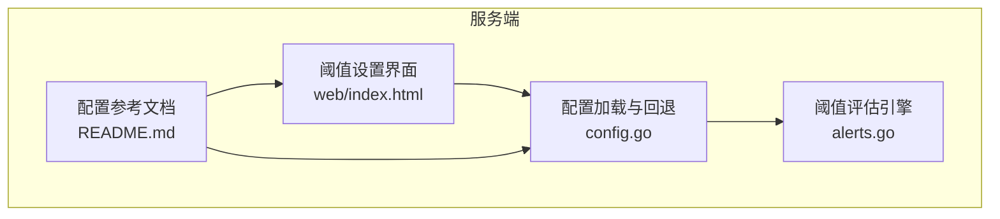
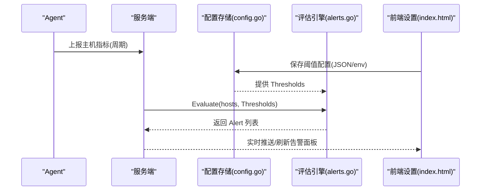
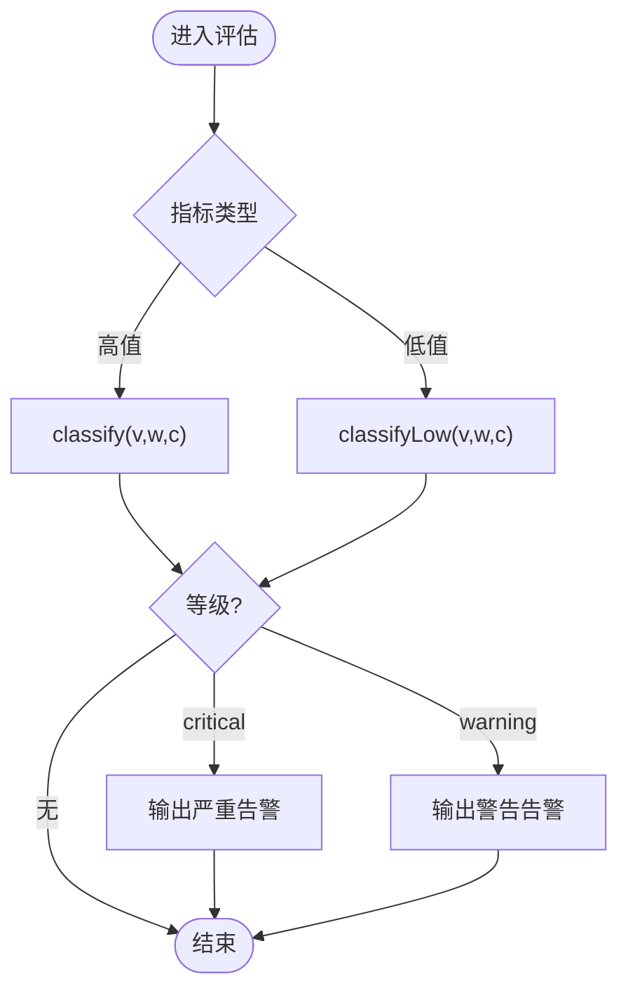
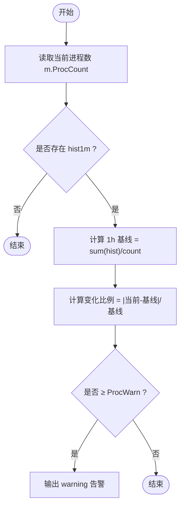
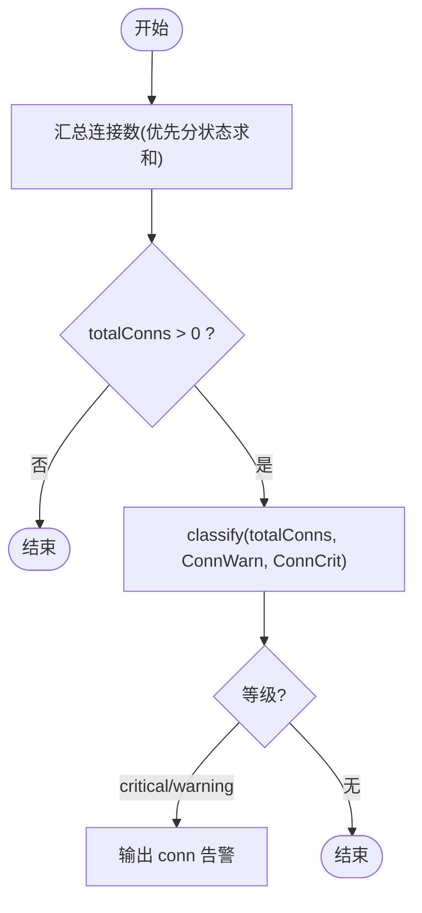
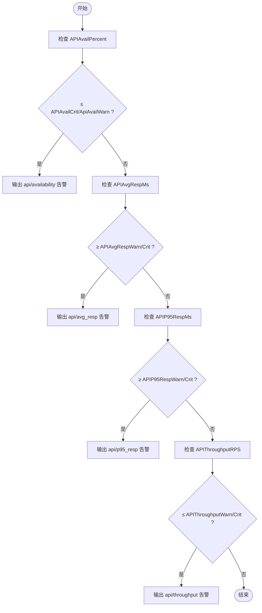
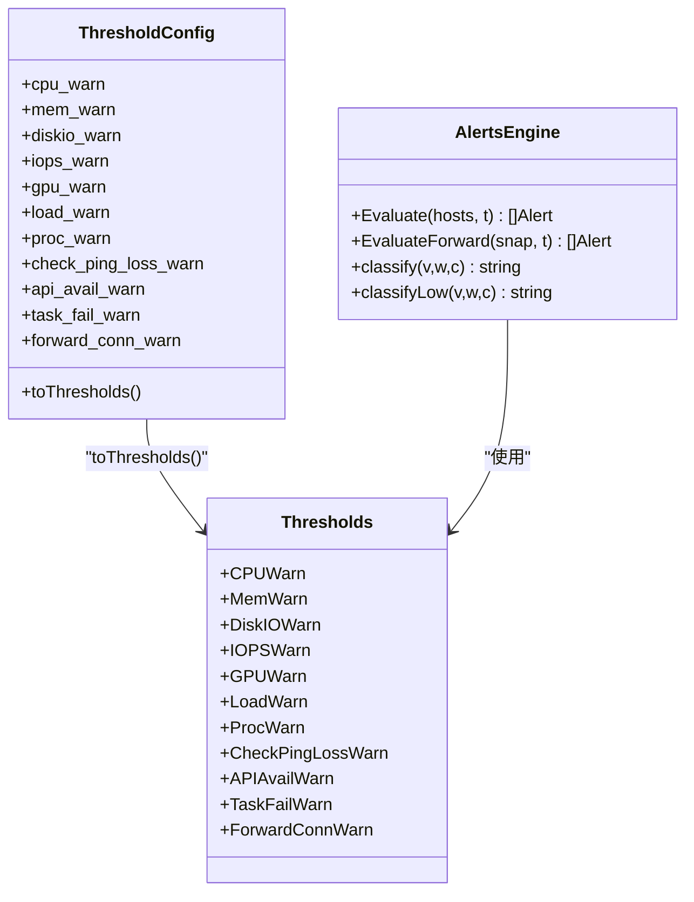

# 告警规则引擎

<cite>
**本文引用的文件**   
- [cmd/server/alerts.go](file://cmd/server/alerts.go)
- [cmd/server/config.go](file://cmd/server/config.go)
- [README.md](file://README.md)
- [cmd/server/web/index.html](file://cmd/server/web/index.html)
</cite>

## 目录
1. [简介](#简介)
2. [项目结构](#项目结构)
3. [核心组件](#核心组件)
4. [架构总览](#架构总览)
5. [详细组件分析](#详细组件分析)
6. [依赖关系分析](#依赖关系分析)
7. [性能与复杂度](#性能与复杂度)
8. [故障排查指南](#故障排查指南)
9. [结论](#结论)
10. [附录：阈值配置参考](#附录阈值配置参考)

## 简介
本文件面向 AIOps Monitor 的“告警规则引擎”，系统性说明其内置 27 组阈值规则的工作原理、三种预设配置（保守/标准/宽松）的差异与适用场景、告警级别分类机制（warning/critical）、低值告警（可用性/吞吐量）的特殊处理逻辑，以及进程异常检测、连接泄漏防护、API 性能监控等高级规则的判定流程。同时提供自定义阈值的完整示例路径与最佳实践建议，帮助读者按业务需求调整告警灵敏度。

## 项目结构
与告警规则引擎直接相关的代码位于服务端模块中：
- 阈值定义与评估逻辑：cmd/server/alerts.go
- 阈值配置模型、默认回退与环境覆盖：cmd/server/config.go
- 前端阈值设置界面入口：cmd/server/web/index.html
- 文档与配置参考：README.md

图表来源
- [cmd/server/config.go:137-172](file://cmd/server/config.go#L137-L172)
- [cmd/server/alerts.go:10-52](file://cmd/server/alerts.go#L10-L52)
- [cmd/server/web/index.html:204-392](file://cmd/server/web/index.html#L204-L392)
- [README.md:436-510](file://README.md#L436-L510)

章节来源
- [cmd/server/alerts.go:10-52](file://cmd/server/alerts.go#L10-L52)
- [cmd/server/config.go:137-172](file://cmd/server/config.go#L137-L172)
- [cmd/server/web/index.html:204-392](file://cmd/server/web/index.html#L204-L392)
- [README.md:436-510](file://README.md#L436-L510)

## 核心组件
- 阈值数据结构与预设
  - Thresholds：运行时阈值集合，包含 CPU/内存/磁盘/IO/IOPS/GPU/负载/进程变化/连接数/离线时长/拨测/API/任务/转发等维度。
  - 三档预设：ConservativeThresholds()、StandardThresholds()、RelaxedThresholds()。
- 配置模型与回退
  - ThresholdConfig：可编辑 JSON 字段映射到 Thresholds。
  - backfillThresholdDefaults()：将未配置或零值字段自动回填为标准默认，避免误报。
  - toThresholds()：将配置对象转换为运行期阈值对象。
- 评估引擎
  - Evaluate(hosts, t)：遍历主机最新指标，逐项比较并生成告警列表。
  - EvaluateForward(snap, t)：端口转发相关指标的阈值评估。
- 告警级别分类
  - classify(v, warn, crit)：高值告警（越大越危险）。
  - classifyLow(v, warn, crit)：低值告警（越小越危险），用于可用率与吞吐。

章节来源
- [cmd/server/alerts.go:10-52](file://cmd/server/alerts.go#L10-L52)
- [cmd/server/alerts.go:180-202](file://cmd/server/alerts.go#L180-L202)
- [cmd/server/config.go:75-135](file://cmd/server/config.go#L75-L135)
- [cmd/server/config.go:137-172](file://cmd/server/config.go#L137-L172)
- [cmd/server/config.go:174-278](file://cmd/server/config.go#L174-L278)
- [cmd/server/config.go:280-315](file://cmd/server/config.go#L280-L315)

## 架构总览
告警规则引擎的工作流如下：
- 配置层：从配置文件/环境变量加载 ThresholdConfig，执行零值回退，转换为 Thresholds。
- 采集层：Agent 上报主机指标（CPU/内存/磁盘/IO/IOPS/GPU/负载/进程/连接等），服务端维护 Latest 快照与短期历史。
- 评估层：Evaluate/EvaluateForward 对各项指标进行阈值判断，产出 Alert 列表。
- 治理层：静默/抑制/路由在通知下发前生效（详见 README 中的“告警治理”）。
- 展示层：前端阈值设置界面允许在线修改阈值并即时生效。

图表来源
- [cmd/server/config.go:577-599](file://cmd/server/config.go#L577-L599)
- [cmd/server/alerts.go:204-464](file://cmd/server/alerts.go#L204-L464)
- [cmd/server/web/index.html:204-392](file://cmd/server/web/index.html#L204-L392)

## 详细组件分析

### 27 组内置阈值规则详解
以下按五大维度列出全部 27 组阈值及其含义与触发方向。所有阈值均支持 warn/crit 两级；部分为“越低越危险”的低值告警。

- 主机资源（10 项）
  - CPU 使用率：warn/crit（越高越危险）
  - 内存使用率：warn/crit（越高越危险）
  - 磁盘使用率：warn/crit（越高越危险）
  - 磁盘 IO 利用率：warn/crit（越高越危险）
  - IOPS（读+写合计）：warn/crit（越高越危险）
  - GPU 算力使用率：warn/crit（越高越危险）
  - GPU 温度：warn/crit（越高越危险）
  - GPU 显存占用率：warn/crit（越高越危险）
  - 系统负载（5min）：按 CPU 核心数倍率×阈值，warn/crit（越高越危险）
  - 进程数异常变化比例：相对 1h 基线的变化百分比，仅 warning（突增/突降）
- 拨测监控（6 项）
  - Ping 丢包率：warn/crit（越高越危险）
  - Ping 平均延迟：warn/crit（越高越危险）
  - TCP 连接超时：warn/crit（越高越危险）
  - HTTP 响应时间：warn/crit（越高越危险）
  - HTTP 非 2xx 次数：warn/crit（越多越危险）
  - 进程存活失败次数：warn/crit（越多越危险）
- API 业务监控（4 项）
  - 接口可用率：warn/crit（越低越危险）
  - 平均响应时间：warn/crit（越高越危险）
  - P95 响应时间：warn/crit（越高越危险）
  - 吞吐量：warn/crit（越低越危险）
- 编排定时任务（2 项）
  - 执行失败次数：warn/crit（越多越危险）
  - 超时时长：warn/crit（越长越危险）
- 端口转发（5 项）
  - 活跃连接数：warn/crit（越多越危险）
  - 带宽使用率：warn/crit（越高越危险）
  - 错误率：warn/crit（越高越危险）
  - 平均延迟：warn/crit（越高越危险）

章节来源
- [cmd/server/alerts.go:10-52](file://cmd/server/alerts.go#L10-L52)
- [cmd/server/alerts.go:204-464](file://cmd/server/alerts.go#L204-L464)
- [cmd/server/alerts.go:466-516](file://cmd/server/alerts.go#L466-L516)
- [README.md:436-510](file://README.md#L436-L510)

### 三种预设配置方案（保守/标准/宽松）
- 保守型（ConservativeThresholds）
  - 特点：更敏感，适合生产关键系统，尽早发现异常，但误报较多。
  - 典型差异：CPU/Mem/Disk/GPU 警告更低；IOPS 阈值更低；负载倍率更低；进程变化比例更小；离线判定更快；拨测/API/任务/转发阈值更严格。
- 标准型（StandardThresholds）
  - 特点：推荐默认，平衡灵敏度与噪音，适用于大多数部署。
  - 典型差异：各项阈值居中，兼顾稳定性与及时性。
- 宽松型（RelaxedThresholds）
  - 特点：低噪，适合开发/测试环境，减少告警疲劳。
  - 典型差异：各项阈值放宽，容忍更高波动。

章节来源
- [cmd/server/alerts.go:60-93](file://cmd/server/alerts.go#L60-L93)
- [cmd/server/alerts.go:95-128](file://cmd/server/alerts.go#L95-L128)
- [cmd/server/alerts.go:130-163](file://cmd/server/alerts.go#L130-L163)
- [README.md:528-546](file://README.md#L528-L546)

### 告警级别分类机制与低值告警特殊处理
- 高值告警（越大越危险）
  - 使用 classify(v, warn, crit)：v ≥ crit → critical；v ≥ warn → warning。
- 低值告警（越小越危险）
  - 使用 classifyLow(v, warn, crit)：v ≤ crit → critical；v ≤ warn → warning。
  - 应用于：API 可用率、API 吞吐量等“低于阈值即告警”的指标。

图表来源
- [cmd/server/alerts.go:180-202](file://cmd/server/alerts.go#L180-L202)
- [cmd/server/alerts.go:374-424](file://cmd/server/alerts.go#L374-L424)

章节来源
- [cmd/server/alerts.go:180-202](file://cmd/server/alerts.go#L180-L202)
- [cmd/server/alerts.go:374-424](file://cmd/server/alerts.go#L374-L424)

### 高级规则深度解析

#### 进程异常检测（proc_anomaly）
- 原理：对比当前进程数与最近 1 小时基线（均值），计算相对变化比例，超过 ProcWarn 则发出 warning。
- 用途：快速发现进程暴涨/骤降，辅助定位异常启动、崩溃、僵尸进程等问题。
- 注意：仅在存在历史样本且阈值非零时生效。

图表来源
- [cmd/server/alerts.go:330-351](file://cmd/server/alerts.go#L330-L351)

章节来源
- [cmd/server/alerts.go:330-351](file://cmd/server/alerts.go#L330-L351)

#### 连接泄漏防护（conn_high）
- 原理：统计主机 TCP+UDP 总连接数（优先分状态计数求和，兼容旧标量 NetConns），超过 ConnWarn/ConnCrit 即告警。
- 用途：捕捉连接泄漏、TIME_WAIT 风暴、fd 耗尽等风险。
- 注意：需开启 ConnWarn 阈值（非零）才生效。

图表来源
- [cmd/server/alerts.go:352-371](file://cmd/server/alerts.go#L352-L371)

章节来源
- [cmd/server/alerts.go:352-371](file://cmd/server/alerts.go#L352-L371)

#### API 性能监控（api_avail_low / api_throughput_low / avg_resp / p95_resp）
- 可用率与吞吐量：低值告警（低于阈值即告警），分别对应 availability 与 throughput。
- 平均响应与 P95 响应：高值告警（高于阈值即告警）。
- 用途：补齐“业务可用性”维度，结合拨测与聚合现算，形成统一告警。

图表来源
- [cmd/server/alerts.go:374-424](file://cmd/server/alerts.go#L374-L424)

章节来源
- [cmd/server/alerts.go:374-424](file://cmd/server/alerts.go#L374-L424)

### 自定义阈值配置示例与最佳实践
- 配置入口
  - 配置文件：server_config.json 的 thresholds.* 字段。
  - 环境变量：AIOPS_* 系列变量覆盖（如 AIOPS_FORWARD_LISTEN 等）。
  - 前端界面：面板「告警设置」可直接修改阈值并即时生效。
- 零值自动兜底
  - 任何未配置或留空的阈值会被自动回填为标准默认，避免持续误报。
- 建议步骤
  - 选择合适预设作为起点（保守/标准/宽松）。
  - 针对业务峰值与 SLA 目标，逐步下调/上调相应阈值。
  - 关注低值告警（可用率/吞吐）与高值告警（CPU/内存/IO/IOPS/GPU/负载）的不同方向。
  - 通过“告警治理”（静默/抑制/路由）降低噪声与夜间打扰。

章节来源
- [cmd/server/config.go:174-278](file://cmd/server/config.go#L174-L278)
- [cmd/server/config.go:616-651](file://cmd/server/config.go#L616-L651)
- [cmd/server/web/index.html:204-392](file://cmd/server/web/index.html#L204-L392)
- [README.md:436-510](file://README.md#L436-L510)

## 依赖关系分析
- 配置到评估的转换
  - ThresholdConfig.toThresholds() 将 JSON 配置映射为运行期 Thresholds。
  - backfillThresholdDefaults() 确保所有阈值均有合理默认值。
- 评估到告警的产出
  - Evaluate/EvaluateForward 基于 Thresholds 与主机快照生成 Alert 列表。
- 前端与配置的交互
  - 前端阈值设置页面提供可视化编辑能力，保存后由配置层回退与校验。

图表来源
- [cmd/server/config.go:75-135](file://cmd/server/config.go#L75-L135)
- [cmd/server/config.go:280-315](file://cmd/server/config.go#L280-L315)
- [cmd/server/alerts.go:10-52](file://cmd/server/alerts.go#L10-L52)
- [cmd/server/alerts.go:180-202](file://cmd/server/alerts.go#L180-L202)
- [cmd/server/alerts.go:204-464](file://cmd/server/alerts.go#L204-L464)
- [cmd/server/alerts.go:466-516](file://cmd/server/alerts.go#L466-L516)

章节来源
- [cmd/server/config.go:75-135](file://cmd/server/config.go#L75-L135)
- [cmd/server/config.go:280-315](file://cmd/server/config.go#L280-L315)
- [cmd/server/alerts.go:10-52](file://cmd/server/alerts.go#L10-L52)
- [cmd/server/alerts.go:180-202](file://cmd/server/alerts.go#L180-L202)
- [cmd/server/alerts.go:204-464](file://cmd/server/alerts.go#L204-L464)
- [cmd/server/alerts.go:466-516](file://cmd/server/alerts.go#L466-L516)

## 性能与复杂度
- 评估复杂度
  - Evaluate：O(H × M)，H 为主机数量，M 为单主机指标项数量（固定常数级）。
  - EvaluateForward：O(1) 每次快照评估。
- 内存与缓存
  - 进程异常检测需要 1h 历史窗口（hist1m），空间随采样频率线性增长。
- 排序与输出
  - 告警列表按级别与主机名稳定排序，便于前端展示与治理。

[本节为通用性能讨论，不直接分析具体文件]

## 故障排查指南
- 阈值全为 0 导致误报
  - 现象：大量持续告警。
  - 原因：未配置或表单留空导致 0 值。
  - 解决：系统会自动回填标准默认；确认配置已保存并生效。
- 低值告警未触发
  - 现象：可用率/吞吐下降但未告警。
  - 原因：阈值方向理解错误或阈值过高。
  - 解决：确认使用的是 classifyLow 的低值告警逻辑，适当下调阈值。
- 进程异常未触发
  - 现象：进程暴涨/骤降未告警。
  - 原因：缺少历史样本或阈值设为 0。
  - 解决：等待至少 1h 积累历史；确保 ProcWarn 非零。
- 连接数告警未触发
  - 现象：连接泄漏未告警。
  - 原因：ConnWarn 为 0 或未启用。
  - 解决：设置合理的 ConnWarn/ConnCrit。

章节来源
- [cmd/server/config.go:174-278](file://cmd/server/config.go#L174-L278)
- [cmd/server/alerts.go:330-351](file://cmd/server/alerts.go#L330-L351)
- [cmd/server/alerts.go:352-371](file://cmd/server/alerts.go#L352-L371)
- [cmd/server/alerts.go:374-424](file://cmd/server/alerts.go#L374-L424)

## 结论
AIOps Monitor 的告警规则引擎以清晰的阈值结构与灵活的配置体系为核心，覆盖主机资源、拨测、API、任务与转发五大维度，提供 27 组细粒度 warn/crit 阈值。通过三档预设与零值自动兜底，用户可快速起步并按业务需求精细化调优。低值告警与高值告警的分类机制确保了不同指标方向的统一表达。进程异常检测、连接泄漏防护与 API 性能监控等高级规则进一步增强了系统的可观测性与排障效率。配合“告警治理”策略，可有效抑制告警风暴，提升运维体验。

[本节为总结性内容，不直接分析具体文件]

## 附录：阈值配置参考
- 配置位置
  - server_config.json 的 thresholds.* 字段。
  - 环境变量 AIOPS_* 覆盖（优先级高于配置文件）。
  - 前端「告警设置」界面在线修改。
- 关键要点
  - 零值自动回退为标准默认，避免误报。
  - 低值告警（可用率/吞吐）使用 classifyLow，高值告警使用 classify。
  - 根据业务 SLA 与噪声容忍度选择保守/标准/宽松预设作为起点。

章节来源
- [cmd/server/config.go:137-172](file://cmd/server/config.go#L137-L172)
- [cmd/server/config.go:174-278](file://cmd/server/config.go#L174-L278)
- [cmd/server/config.go:616-651](file://cmd/server/config.go#L616-L651)
- [cmd/server/web/index.html:204-392](file://cmd/server/web/index.html#L204-L392)
- [README.md:436-510](file://README.md#L436-L510)