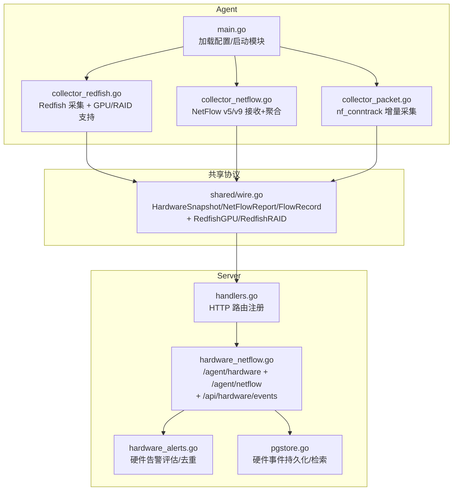
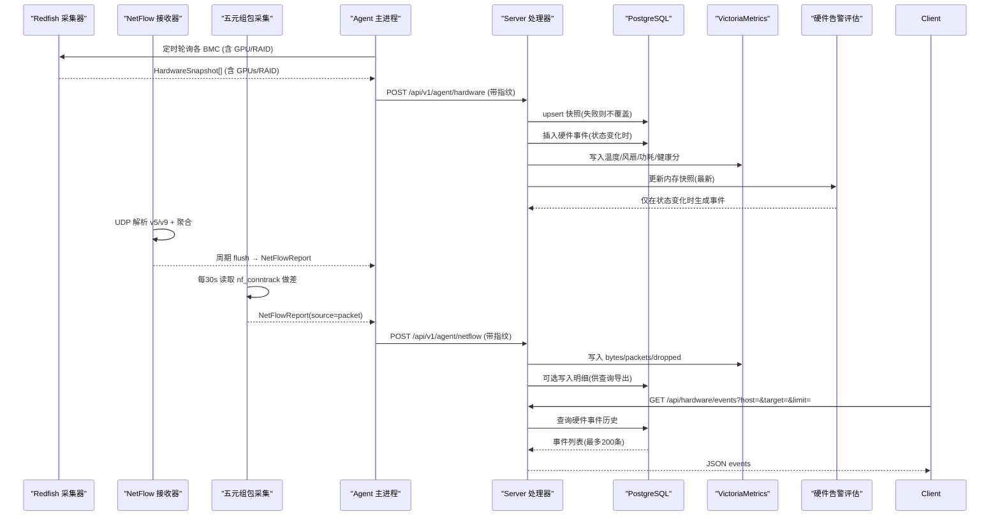
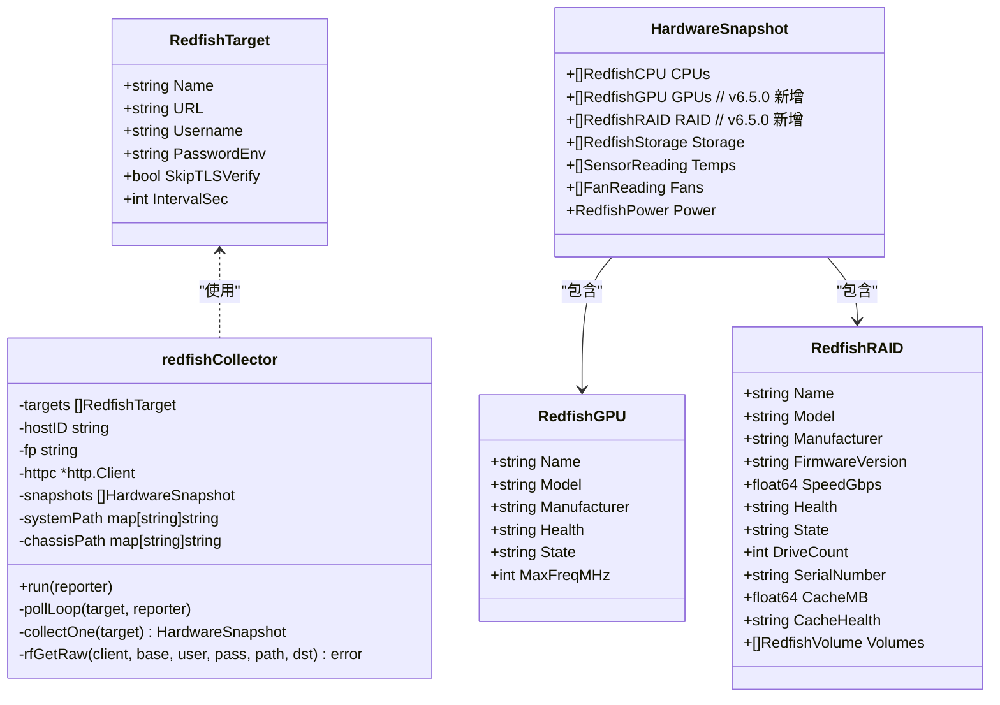
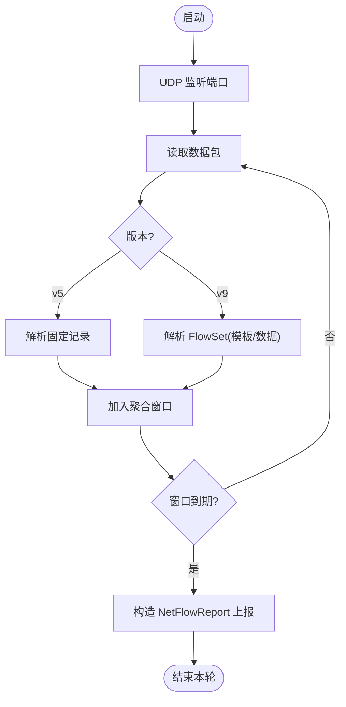
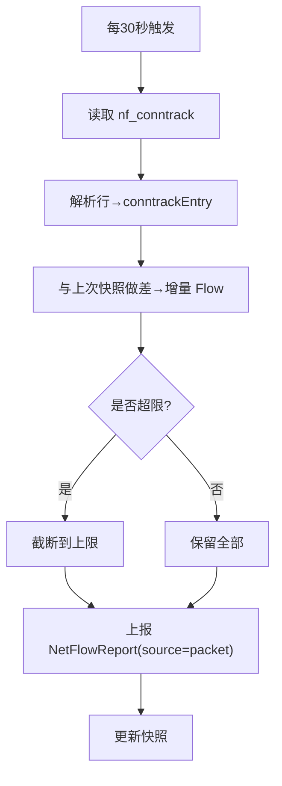
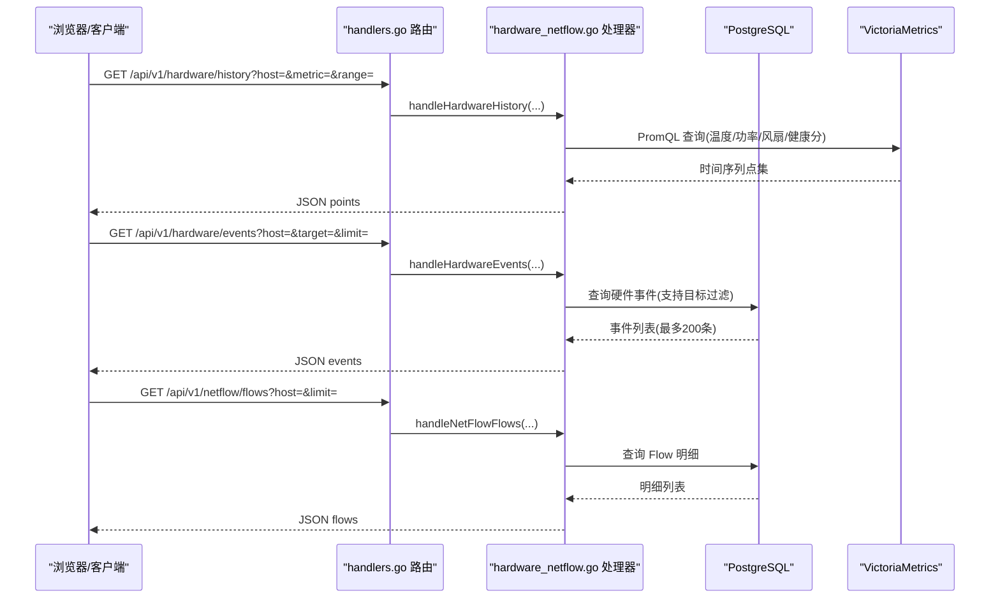
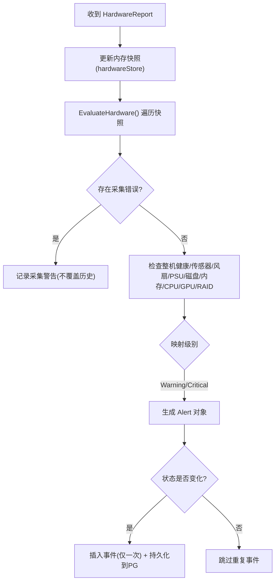
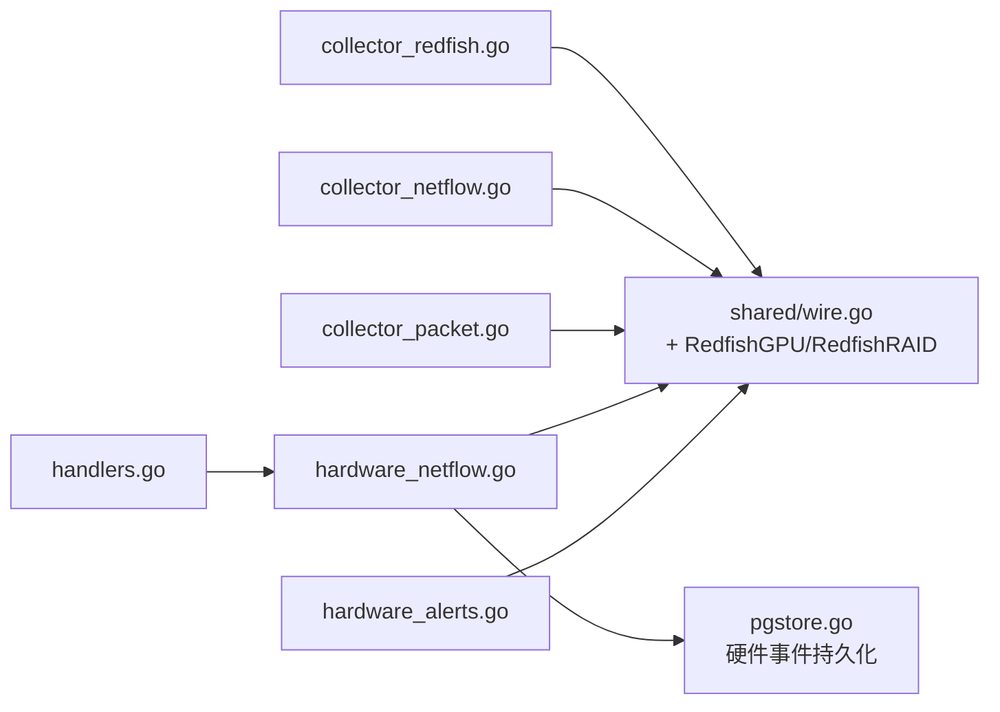

# 硬件告警引擎

<cite>
**本文引用的文件**   
- [cmd/agent/main.go](file://cmd/agent/main.go)
- [cmd/agent/collector_redfish.go](file://cmd/agent/collector_redfish.go)
- [cmd/agent/collector_netflow.go](file://cmd/agent/collector_netflow.go)
- [cmd/agent/collector_packet.go](file://cmd/agent/collector_packet.go)
- [shared/wire.go](file://shared/wire.go)
- [cmd/server/handlers.go](file://cmd/server/handlers.go)
- [cmd/server/hardware_alerts.go](file://cmd/server/hardware_alerts.go)
- [cmd/server/hardware_netflow.go](file://cmd/server/hardware_netflow.go)
- [cmd/server/pgstore.go](file://cmd/server/pgstore.go)
</cite>

## 更新摘要
**变更内容**   
- 新增 GPU/加速器与 RAID/存储控制器告警支持，扩展硬件健康端点处理增强的数据结构
- 新增 /api/hardware/events 端点用于查询记录的硬件状态转换历史
- 数据库存储新增硬件事件持久化和检索功能，支持每台主机最多200个事件及可选目标过滤
- 完善 Redfish 采集器对 GPU、RAID 控制器的解析与上报逻辑

## 目录
1. [简介](#简介)
2. [项目结构](#项目结构)
3. [核心组件](#核心组件)
4. [架构总览](#架构总览)
5. [详细组件分析](#详细组件分析)
6. [依赖关系分析](#依赖关系分析)
7. [性能与容量规划](#性能与容量规划)
8. [故障排查指南](#故障排查指南)
9. [结论](#结论)

## 简介
本文件聚焦"硬件告警引擎"的端到端设计与实现，覆盖三类采集器（Redfish 硬件状态、NetFlow 网络流量、五元组包报文）在 Agent 端的采集与上报，以及 Server 端的接收、持久化、时序写入、内存快照与告警评估。v6.5.0 版本新增了对 GPU/加速器和 RAID/存储控制器的告警支持，并完善了硬件事件的持久化与查询能力。目标是帮助读者快速理解数据流、存储选型、错误处理与可扩展点，并给出可操作的排障建议。

## 项目结构
围绕硬件告警能力，关键代码分布在以下位置：
- Agent 侧
  - Redfish 采集器：cmd/agent/collector_redfish.go
  - NetFlow 接收器：cmd/agent/collector_netflow.go
  - 五元组包采集：cmd/agent/collector_packet.go
  - 配置入口与启动流程：cmd/agent/main.go
- 共享协议定义
  - 统一数据结构（HardwareSnapshot、NetFlowReport、FlowRecord 等）：shared/wire.go
- Server 侧
  - HTTP 路由注册：cmd/server/handlers.go
  - 硬件告警评估与去重：cmd/server/hardware_alerts.go
  - 硬件/NetFlow 接入与查询接口、VM 写入：cmd/server/hardware_netflow.go
  - 数据库存储操作：cmd/server/pgstore.go

**图表来源**
- [cmd/agent/main.go:78-146](file://cmd/agent/main.go#L78-L146)
- [cmd/agent/collector_redfish.go:111-172](file://cmd/agent/collector_redfish.go#L111-L172)
- [cmd/agent/collector_redfish.go:458-467](file://cmd/agent/collector_redfish.go#L458-L467)
- [cmd/agent/collector_redfish.go:574-589](file://cmd/agent/collector_redfish.go#L574-L589)
- [cmd/agent/collector_netflow.go:192-263](file://cmd/agent/collector_netflow.go#L192-L263)
- [cmd/agent/collector_packet.go:58-113](file://cmd/agent/collector_packet.go#L58-L113)
- [shared/wire.go:140-279](file://shared/wire.go#L140-279)
- [cmd/server/handlers.go:292-300](file://cmd/server/handlers.go#L292-L300)
- [cmd/server/handlers.go:297](file://cmd/server/handlers.go#L297)
- [cmd/server/hardware_netflow.go:19-109](file://cmd/server/hardware_netflow.go#L19-L109)
- [cmd/server/hardware_netflow.go:137-158](file://cmd/server/hardware_netflow.go#L137-L158)
- [cmd/server/hardware_alerts.go:101-215](file://cmd/server/hardware_alerts.go#L101-215)
- [cmd/server/pgstore.go:222-232](file://cmd/server/pgstore.go#L222-L232)
- [cmd/server/pgstore.go:1289-1337](file://cmd/server/pgstore.go#L1289-L1337)

**章节来源**
- [cmd/agent/main.go:78-146](file://cmd/agent/main.go#L78-L146)
- [cmd/server/handlers.go:292-300](file://cmd/server/handlers.go#L292-L300)

## 核心组件
- 共享协议层（shared/wire.go）
  - 定义了硬件与网络流量的统一数据结构，确保 Agent 与 Server 契约一致，避免漂移。
  - **v6.5.0 扩展**：新增 RedfishGPU 和 RedfishRAID 结构体，支持 GPU/加速器和 RAID/存储控制器的数据采集。
- Agent 采集器
  - Redfish：面向 BMC/iDRAC/iLO 的 REST API 轮询，兼容旧固件 TLS 套件，按目标独立定时器运行。**v6.5.0 增强**：支持从 Processors 集合中识别 GPU/加速器，从 StorageControllers 中提取 RAID 控制器信息。
  - NetFlow：UDP 监听 v5/v9，模板缓存与滑动窗口聚合，内存上限保护与丢包计数。
  - 五元组包：Linux 下基于 nf_conntrack 增量计算，跨平台无侵入；非 Linux 自动跳过。
- Server 接入与评估
  - 指纹鉴权后入库 PG、写 VM 时序、更新内存快照，仅健康状态变化时记录事件。
  - **v6.5.0 新增**：提供 /api/hardware/events 端点查询硬件事件历史，支持目标过滤和限制数量。
  - 硬件告警评估以 BMC 自身阈值为主，结合传感器临界值，输出标准告警进入统一推送链路。

**章节来源**
- [shared/wire.go:140-279](file://shared/wire.go#L140-279)
- [shared/wire.go:208-243](file://shared/wire.go#L208-L243)
- [cmd/agent/collector_redfish.go:111-172](file://cmd/agent/collector_redfish.go#L111-L172)
- [cmd/agent/collector_redfish.go:458-467](file://cmd/agent/collector_redfish.go#L458-L467)
- [cmd/agent/collector_redfish.go:574-589](file://cmd/agent/collector_redfish.go#L574-L589)
- [cmd/agent/collector_netflow.go:192-263](file://cmd/agent/collector_netflow.go#L192-L263)
- [cmd/agent/collector_packet.go:58-113](file://cmd/agent/collector_packet.go#L58-L113)
- [cmd/server/hardware_netflow.go:19-109](file://cmd/server/hardware_netflow.go#L19-L109)
- [cmd/server/hardware_netflow.go:137-158](file://cmd/server/hardware_netflow.go#L137-L158)
- [cmd/server/hardware_alerts.go:101-215](file://cmd/server/hardware_alerts.go#L101-L215)

## 架构总览
整体采用"Agent 多采集器 + Server 统一接入 + 双后端存储（PG + VM）+ 内存快照评估"的分层架构。v6.5.0 版本增强了硬件事件的持久化能力和查询接口。

**图表来源**
- [cmd/agent/collector_redfish.go:111-172](file://cmd/agent/collector_redfish.go#L111-L172)
- [cmd/agent/collector_redfish.go:458-467](file://cmd/agent/collector_redfish.go#L458-L467)
- [cmd/agent/collector_redfish.go:574-589](file://cmd/agent/collector_redfish.go#L574-L589)
- [cmd/agent/collector_netflow.go:192-263](file://cmd/agent/collector_netflow.go#L192-L263)
- [cmd/agent/collector_packet.go:58-113](file://cmd/agent/collector_packet.go#L58-L113)
- [cmd/server/handlers.go:292-300](file://cmd/server/handlers.go#L292-L300)
- [cmd/server/handlers.go:297](file://cmd/server/handlers.go#L297)
- [cmd/server/hardware_netflow.go:19-109](file://cmd/server/hardware_netflow.go#L19-L109)
- [cmd/server/hardware_netflow.go:137-158](file://cmd/server/hardware_netflow.go#L137-L158)
- [cmd/server/hardware_alerts.go:101-215](file://cmd/server/hardware_alerts.go#L101-L215)
- [cmd/server/pgstore.go:1289-1337](file://cmd/server/pgstore.go#L1289-L1337)

## 详细组件分析

### Redfish 硬件采集器（Agent 端）
- 运行模型
  - 每个 target 独立 goroutine + 独立定时器，最小间隔 30s，连续失败退避至 5 分钟。
- 兼容性
  - 显式启用 TLS 1.0 与部分不安全套件以兼容老旧 BMC；关闭连接复用避免空闲通道残留响应。
- 采集范围
  - System/Processors/Memory/Storage/Thermal/Power/FirmwareInventory，按不同频率采集。
  - **v6.5.0 增强**：从 Processors 集合中识别 GPU/加速器（ProcessorType=GPU/Accelerator），从 StorageControllers 中提取 RAID 控制器信息。
- 错误处理
  - 分类提示（TLS/证书/DNS/超时/认证），失败不中断其他 target。

**图表来源**
- [cmd/agent/collector_redfish.go:54-124](file://cmd/agent/collector_redfish.go#L54-L124)
- [cmd/agent/collector_redfish.go:127-172](file://cmd/agent/collector_redfish.go#L127-L172)
- [cmd/agent/collector_redfish.go:327-603](file://cmd/agent/collector_redfish.go#L327-L603)
- [cmd/agent/collector_redfish.go:458-467](file://cmd/agent/collector_redfish.go#L458-L467)
- [cmd/agent/collector_redfish.go:574-589](file://cmd/agent/collector_redfish.go#L574-L589)
- [shared/wire.go:140-163](file://shared/wire.go#L140-L163)
- [shared/wire.go:208-243](file://shared/wire.go#L208-L243)

**章节来源**
- [cmd/agent/collector_redfish.go:111-172](file://cmd/agent/collector_redfish.go#L111-L172)
- [cmd/agent/collector_redfish.go:327-603](file://cmd/agent/collector_redfish.go#L327-L603)
- [cmd/agent/collector_redfish.go:458-467](file://cmd/agent/collector_redfish.go#L458-L467)
- [cmd/agent/collector_redfish.go:574-589](file://cmd/agent/collector_redfish.go#L574-L589)
- [shared/wire.go:140-163](file://shared/wire.go#L140-L163)
- [shared/wire.go:208-243](file://shared/wire.go#L208-L243)

### NetFlow 接收器（Agent 端）
- 运行模型
  - UDP 监听默认 :2055，支持 v5 固定记录与 v9 模板解码；周期性 flush 聚合结果。
- 聚合器
  - 按五元组 hash 合并字节/包数，维护 first/last seen、TCP flags、AS、接口号等；内存上限保护，超出丢弃最小流量项并计数。
- 背压与限速
  - 固定读缓冲，flush 未完成时新数据涌入会累计 dropped；可按速率采样。

**图表来源**
- [cmd/agent/collector_netflow.go:192-263](file://cmd/agent/collector_netflow.go#L192-L263)
- [cmd/agent/collector_netflow.go:265-484](file://cmd/agent/collector_netflow.go#L265-L484)

**章节来源**
- [cmd/agent/collector_netflow.go:192-263](file://cmd/agent/collector_netflow.go#L192-L263)
- [cmd/agent/collector_netflow.go:265-484](file://cmd/agent/collector_netflow.go#L265-L484)

### 五元组包采集（Agent 端）
- 运行模型
  - Linux 下每 30s 读取 /proc/net/nf_conntrack，解析键值对，与上次快照做差得到增量 Flow。
- 限流
  - 默认每分钟最多输出若干条，超过则截断，避免突发风暴。
- 跨平台
  - 非 Linux 直接跳过，不影响主流程。

**图表来源**
- [cmd/agent/collector_packet.go:58-113](file://cmd/agent/collector_packet.go#L58-L113)
- [cmd/agent/collector_packet.go:115-270](file://cmd/agent/collector_packet.go#L115-L270)

**章节来源**
- [cmd/agent/collector_packet.go:58-113](file://cmd/agent/collector_packet.go#L58-L113)
- [cmd/agent/collector_packet.go:115-270](file://cmd/agent/collector_packet.go#L115-L270)

### Server 接入与查询（Server 端）
- 路由注册
  - 提供 /api/v1/agent/hardware 与 /api/v1/agent/netflow 两个入站端点，以及前端查询端点。
  - **v6.5.0 新增**：/api/v1/hardware/events 端点用于查询硬件事件历史。
- 指纹鉴权
  - 通过 X-Agent-Fingerprint 或 fp 参数校验，防止伪造上报。
- 存储策略
  - 硬件快照：失败时不覆盖历史；成功则 upsert 到 PG，同时写 VM 指标。
  - **v6.5.0 增强**：健康状态变化时插入硬件事件记录，支持目标过滤和数量限制。
  - NetFlow：写 VM 指标，可选写 PG 明细用于查询与导出。
- 前端查询
  - 硬件健康/历史（VM）、NetFlow 汇总（VM）、明细（PG）。

**图表来源**
- [cmd/server/handlers.go:292-300](file://cmd/server/handlers.go#L292-L300)
- [cmd/server/handlers.go:297](file://cmd/server/handlers.go#L297)
- [cmd/server/hardware_netflow.go:137-158](file://cmd/server/hardware_netflow.go#L137-L158)
- [cmd/server/hardware_netflow.go:248-274](file://cmd/server/hardware_netflow.go#L248-L274)
- [cmd/server/pgstore.go:1289-1337](file://cmd/server/pgstore.go#L1289-L1337)

**章节来源**
- [cmd/server/handlers.go:292-300](file://cmd/server/handlers.go#L292-L300)
- [cmd/server/handlers.go:297](file://cmd/server/handlers.go#L297)
- [cmd/server/hardware_netflow.go:19-109](file://cmd/server/hardware_netflow.go#L19-L109)
- [cmd/server/hardware_netflow.go:137-158](file://cmd/server/hardware_netflow.go#L137-L158)
- [cmd/server/hardware_netflow.go:248-274](file://cmd/server/hardware_netflow.go#L248-L274)
- [cmd/server/pgstore.go:1289-1337](file://cmd/server/pgstore.go#L1289-L1337)

### 硬件告警评估（Server 端）
- 评估原则
  - 优先使用 BMC 自身 Health/Status 与传感器 UpperCaution/UpperCritical 阈值；BMC 不可达视为采集异常而非硬件损坏。
- 去重机制
  - 仅当目标健康状态发生变化时记录事件，避免同一 Warning 持续刷屏。
  - **v6.5.0 增强**：事件持久化到 PostgreSQL，支持查询和过滤。
- 告警范围
  - 整机健康、温度传感器、风扇 RPM、电源 PSU、存储 SMART、内存 DIMM、CPU 健康、**GPU/加速器、RAID/存储控制器**。

**图表来源**
- [cmd/server/hardware_alerts.go:101-215](file://cmd/server/hardware_alerts.go#L101-L215)
- [cmd/server/hardware_netflow.go:43-76](file://cmd/server/hardware_netflow.go#L43-L76)
- [cmd/server/pgstore.go:1289-1298](file://cmd/server/pgstore.go#L1289-L1298)

**章节来源**
- [cmd/server/hardware_alerts.go:101-215](file://cmd/server/hardware_alerts.go#L101-L215)
- [cmd/server/hardware_netflow.go:43-76](file://cmd/server/hardware_netflow.go#L43-L76)
- [cmd/server/pgstore.go:1289-1298](file://cmd/server/pgstore.go#L1289-L1298)

## 依赖关系分析
- 耦合与内聚
  - shared/wire.go 作为唯一契约层，降低 Agent/Server 间耦合度；各采集器只依赖共享结构体，职责清晰。
  - **v6.5.0 扩展**：新增的 RedfishGPU 和 RedfishRAID 结构体保持向后兼容，不影响现有功能。
- 外部依赖
  - PostgreSQL：关系型数据（快照、事件、Flow 明细）。
  - VictoriaMetrics：时序数据（温度/风扇/功耗/健康分、NetFlow bytes/packets/dropped）。
- 潜在循环
  - 无循环依赖；Server 内部 hardware_alerts.go 仅依赖 hardware_store 与 shared 结构体。

**图表来源**
- [shared/wire.go:140-279](file://shared/wire.go#L140-279)
- [shared/wire.go:208-243](file://shared/wire.go#L208-L243)
- [cmd/server/handlers.go:292-300](file://cmd/server/handlers.go#L292-L300)
- [cmd/server/handlers.go:297](file://cmd/server/handlers.go#L297)
- [cmd/server/hardware_netflow.go:19-109](file://cmd/server/hardware_netflow.go#L19-L109)
- [cmd/server/hardware_alerts.go:101-215](file://cmd/server/hardware_alerts.go#L101-L215)
- [cmd/server/pgstore.go:1289-1337](file://cmd/server/pgstore.go#L1289-L1337)

**章节来源**
- [shared/wire.go:140-279](file://shared/wire.go#L140-279)
- [shared/wire.go:208-243](file://shared/wire.go#L208-L243)
- [cmd/server/handlers.go:292-300](file://cmd/server/handlers.go#L292-L300)
- [cmd/server/handlers.go:297](file://cmd/server/handlers.go#L297)
- [cmd/server/hardware_netflow.go:19-109](file://cmd/server/hardware_netflow.go#L19-L109)
- [cmd/server/hardware_alerts.go:101-215](file://cmd/server/hardware_alerts.go#L101-L215)
- [cmd/server/pgstore.go:1289-1337](file://cmd/server/pgstore.go#L1289-L1337)

## 性能与容量规划
- Agent 端
  - Redfish：单 target 独立定时器，失败退避 5 分钟，避免雪崩。
  - NetFlow：内存上限保护（默认 100k 条目），窗口 flush 期间拥塞会累计丢包计数；可配置 buffer_size、window_sec、max_flows_per_sec。
  - 五元组包：每 30s 扫描一次，默认限制每分钟输出量，避免瞬时风暴。
- Server 端
  - 指纹鉴权前置，减少无效请求。
  - 硬件快照失败不覆盖历史，保证面板连续性。
  - VM 写入为毫秒级时间戳，避免历史曲线错位。
  - **v6.5.0 优化**：硬件事件查询支持 limit 参数（最大200条），目标过滤减少不必要的数据传输。
- 容量建议
  - 根据网卡流量规模调整 NetFlow 聚合窗口与内存上限；高吞吐场景建议增大 window_sec 与 max_flows_per_sec，并监控 dropped_packets。
  - 若需长期留存 Flow 明细，关注 PG 表增长与清理策略。
  - 硬件事件表按 host_id 索引，建议定期归档历史事件数据。

## 故障排查指南
- Redfish 采集失败
  - 现象：日志出现 TLS/证书/DNS/超时/认证错误提示。
  - 排查要点：确认密码来源（环境变量或字段）、BMC 可达性、证书策略（必要时 skip_tls_verify）、固件版本过旧导致 TLS 套件不兼容。
  - **v6.5.0 新增**：检查 GPU/RAID 控制器是否正常返回数据。
- NetFlow 无数据或大量丢包
  - 现象：dropped_packets 上升、summary 为空。
  - 排查要点：确认 UDP 端口开放、设备侧已推送、buffer_size/window_sec 合理、max_flows_per_sec 未过低导致采样。
- 五元组包采集无数据
  - 现象：source=packet 的 NetFlowReport 为空。
  - 排查要点：当前系统是否为 Linux、/proc/net/nf_conntrack 是否可读、MaxPacketsPerMin 是否过小。
- 历史曲线为空
  - 现象：硬件/NetFlow 历史查询返回空。
  - 排查要点：确认 VM 地址配置、时间戳单位（毫秒）、PromQL 标签匹配是否正确。
- 告警风暴
  - 现象：同一主机频繁产生相同告警。
  - 排查要点：确认 healthChanged 去重逻辑生效，避免将采集失败误判为硬件故障。
- **v6.5.0 新增问题**：硬件事件查询无数据
  - 现象：GET /api/hardware/events 返回空数组。
  - 排查要点：确认 host_id 参数正确、PG 数据库连接正常、事件是否因状态未变化而未记录。

**章节来源**
- [cmd/agent/collector_redfish.go:292-324](file://cmd/agent/collector_redfish.go#L292-L324)
- [cmd/agent/collector_redfish.go:458-467](file://cmd/agent/collector_redfish.go#L458-L467)
- [cmd/agent/collector_redfish.go:574-589](file://cmd/agent/collector_redfish.go#L574-L589)
- [cmd/agent/collector_netflow.go:192-263](file://cmd/agent/collector_netflow.go#L192-L263)
- [cmd/agent/collector_packet.go:58-113](file://cmd/agent/collector_packet.go#L58-L113)
- [cmd/server/hardware_netflow.go:137-158](file://cmd/server/hardware_netflow.go#L137-L158)
- [cmd/server/hardware_alerts.go:101-215](file://cmd/server/hardware_alerts.go#L101-L215)
- [cmd/server/pgstore.go:1289-1337](file://cmd/server/pgstore.go#L1289-L1337)

## 结论
该硬件告警引擎以"采集-上报-接入-评估-推送"为主线，借助共享协议层解耦 Agent/Server，结合 PG 与 VM 双后端满足关系与时序需求。v6.5.0 版本显著增强了硬件监控能力，新增对 GPU/加速器和 RAID/存储控制器的支持，完善了硬件事件的持久化与查询功能。通过 BMC 自身阈值驱动告警、内存快照去重、失败不覆盖历史等设计，提升了稳定性与可用性。后续可在主动采集（SNMP/REST）与更细粒度采样策略上继续演进。