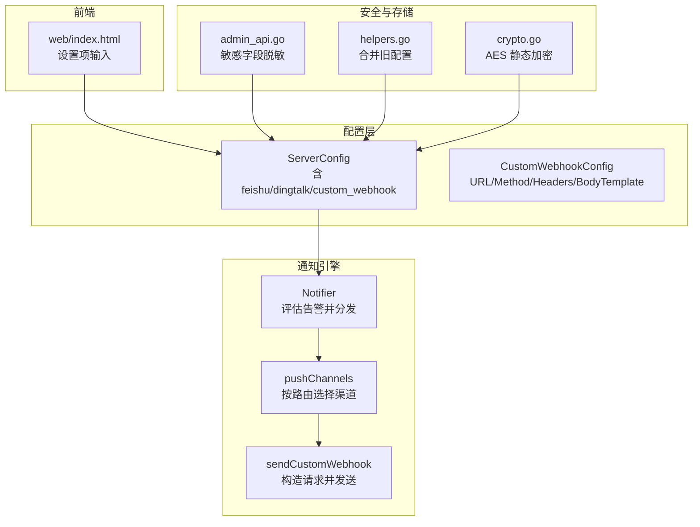
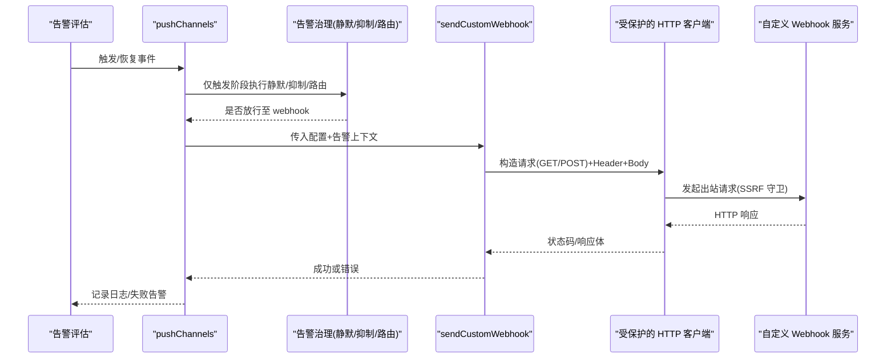
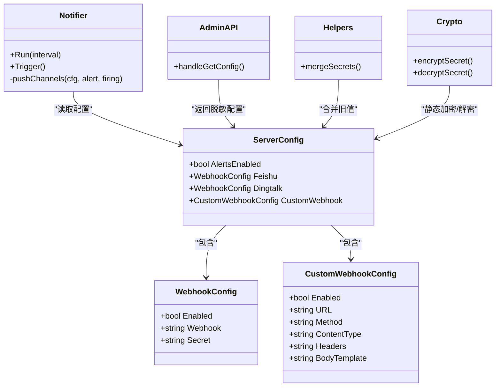

# Webhook 集成

<cite>
**本文引用的文件**   
- [config.go](file://cmd/server/config.go)
- [notify.go](file://cmd/server/notify.go)
- [admin_api.go](file://cmd/server/admin_api.go)
- [helpers.go](file://cmd/server/helpers.go)
- [crypto.go](file://cmd/server/crypto.go)
- [index.html](file://cmd/server/web/index.html)
</cite>

## 目录
1. [简介](#简介)
2. [项目结构](#项目结构)
3. [核心组件](#核心组件)
4. [架构总览](#架构总览)
5. [详细组件分析](#详细组件分析)
6. [依赖关系分析](#依赖关系分析)
7. [性能与可靠性](#性能与可靠性)
8. [故障排查指南](#故障排查指南)
9. [结论](#结论)
10. [附录：第三方平台集成示例](#附录第三方平台集成示例)

## 简介
本文件面向 AIOps Monitor 的 Webhook 集成能力，聚焦以下目标：
- 自定义 Webhook 接口的请求格式（HTTP 方法、请求头、JSON 请求体）
- 签名验证机制与安全考虑（钉钉加签、SSRF 防护、密钥加密）
- 多平台集成要点（飞书、钉钉、企业微信、飞书机器人等）
- 高级特性（重试策略、超时处理、错误码解析）
- API 调用示例与调试方法

## 项目结构
Webhook 相关代码集中在服务端模块中，关键位置如下：
- 配置模型与持久化：cmd/server/config.go
- 通知发送与渠道实现：cmd/server/notify.go
- 管理接口与脱敏返回：cmd/server/admin_api.go
- 配置合并与默认值处理：cmd/server/helpers.go
- 静态加密与解密：cmd/server/crypto.go
- 前端设置面板字段：cmd/server/web/index.html

图表来源
- [config.go:35-44](file://cmd/server/config.go#L35-L44)
- [notify.go:196-276](file://cmd/server/notify.go#L196-L276)
- [notify.go:1134-1216](file://cmd/server/notify.go#L1134-L1216)
- [admin_api.go:10-30](file://cmd/server/admin_api.go#L10-L30)
- [helpers.go:127-140](file://cmd/server/helpers.go#L127-L140)
- [crypto.go:183-198](file://cmd/server/crypto.go#L183-L198)
- [index.html:832-857](file://cmd/server/web/index.html#L832-L857)

章节来源
- [config.go:35-44](file://cmd/server/config.go#L35-L44)
- [notify.go:196-276](file://cmd/server/notify.go#L196-L276)
- [notify.go:1134-1216](file://cmd/server/notify.go#L1134-L1216)
- [admin_api.go:10-30](file://cmd/server/admin_api.go#L10-L30)
- [helpers.go:127-140](file://cmd/server/helpers.go#L127-L140)
- [crypto.go:183-198](file://cmd/server/crypto.go#L183-L198)
- [index.html:832-857](file://cmd/server/web/index.html#L832-L857)

## 核心组件
- CustomWebhookConfig：定义自定义 Webhook 的配置项，包括 URL、HTTP 方法、Content-Type、自定义 Header（JSON 字符串）、Go Template 请求体模板。
- Notifier：定时评估告警，计算触发/恢复状态变化，通过 pushChannels 分发到各渠道（飞书、钉钉、邮件、自定义 Webhook、短信、语音）。
- sendCustomWebhook：根据配置构建 HTTP 请求，支持 GET/POST，支持自定义 Content-Type 和 Headers；当未提供 BodyTemplate 时，使用默认 JSON 结构。
- 安全与存储：
  - admin_api.go 在返回配置时对敏感字段进行脱敏（如 webhook URL、headers）。
  - helpers.go 在更新配置时保留未提供的旧值（避免覆盖已配置的密钥）。
  - crypto.go 对敏感字段（包含 headers）做 AES-256-GCM 静态加密/解密。

章节来源
- [config.go:35-44](file://cmd/server/config.go#L35-L44)
- [notify.go:196-276](file://cmd/server/notify.go#L196-L276)
- [notify.go:1134-1216](file://cmd/server/notify.go#L1134-L1216)
- [admin_api.go:10-30](file://cmd/server/admin_api.go#L10-L30)
- [helpers.go:127-140](file://cmd/server/helpers.go#L127-L140)
- [crypto.go:183-198](file://cmd/server/crypto.go#L183-L198)

## 架构总览
下图展示从告警评估到自定义 Webhook 发送的完整流程，以及安全控制点。

图表来源
- [notify.go:196-276](file://cmd/server/notify.go#L196-L276)
- [notify.go:1134-1216](file://cmd/server/notify.go#L1134-L1216)

## 详细组件分析

### 自定义 Webhook 请求格式
- HTTP 方法
  - 支持 GET 与 POST（默认 POST）
  - 由配置项 method 决定
- 请求头
  - Content-Type：application/json（默认）或 text/plain，由 content_type 指定
  - 自定义 Header：以 JSON 键值对形式在 headers 中配置，例如 {"X-Token":"abc"}
- 请求体
  - 若未提供 body_template，则使用默认 JSON 结构，包含字段：text、level、type、hostname、message、value、timestamp、firing
  - 若提供 body_template，则基于 Go template 渲染，可用占位符包括：Level、Type、Hostname、HostID、IP、Message、Value、Timestamp、Firing、Text

章节来源
- [config.go:35-44](file://cmd/server/config.go#L35-L44)
- [notify.go:1134-1216](file://cmd/server/notify.go#L1134-L1216)
- [index.html:832-857](file://cmd/server/web/index.html#L832-L857)

### 签名验证机制与安全考虑
- 钉钉加签
  - 当配置了 secret 时，会在 Webhook URL 后追加 timestamp 与 sign 参数
  - 签名算法为 HMAC-SHA256：base64(hmac(secret, "timestamp\nsecret"))，并对结果进行 URL 编码
- SSRF 出站防护
  - 所有出站请求均通过受保护的 HTTP 客户端创建，默认拒绝访问云元数据与链路本地地址
- 密钥静态加密
  - 配置中的敏感字段（如 headers）在落库前进行 AES-256-GCM 加密，读取时再解密
- 管理接口脱敏
  - 获取配置时，对 webhook URL、headers 等敏感字段进行脱敏显示

章节来源
- [notify.go:413-436](file://cmd/server/notify.go#L413-L436)
- [notify.go:1204-1205](file://cmd/server/notify.go#L1204-L1205)
- [crypto.go:183-198](file://cmd/server/crypto.go#L183-L198)
- [admin_api.go:10-30](file://cmd/server/admin_api.go#L10-L30)

### 错误码解析与网络错误处理
- 飞书/钉钉
  - 即使 HTTP 200，也可能在响应体中包含 code/errcode 业务错误码，系统会解析并返回错误
- 自定义 Webhook
  - 直接依据 HTTP 状态码判断成功与否（>=300 视为失败），并记录响应体摘要
- 统一日志
  - 各渠道发送失败均记录系统日志，便于定位问题

章节来源
- [notify.go:438-464](file://cmd/server/notify.go#L438-L464)
- [notify.go:1204-1216](file://cmd/server/notify.go#L1204-L1216)

### 高级特性：重试策略与超时处理
- 超时
  - 自定义 Webhook 与飞书/钉钉推送均使用带超时的 HTTP 客户端（默认约 8 秒）
- 重试
  - 当前实现未内置自动重试逻辑；如需重试，可在下游服务侧实现幂等接收与重试友好设计
- 幂等性建议
  - 建议在自定义 Webhook 服务中对同一告警 key 去重，避免重复处理

章节来源
- [notify.go:47](file://cmd/server/notify.go#L47)
- [notify.go:1204-1205](file://cmd/server/notify.go#L1204-L1205)

## 依赖关系分析
- 配置依赖
  - ServerConfig 包含 Feishu/Dingtalk/CustomWebhook 三个渠道配置
  - CustomWebhookConfig 提供通用 HTTP(S) 通道能力
- 运行时依赖
  - Notifier 负责评估与分发，pushChannels 根据告警治理规则选择渠道
  - sendCustomWebhook 使用受保护 HTTP 客户端发出请求
- 安全依赖
  - admin_api.go 对敏感字段脱敏
  - helpers.go 在更新配置时保留旧值
  - crypto.go 对敏感字段做静态加密

图表来源
- [config.go:414-417](file://cmd/server/config.go#L414-L417)
- [config.go:35-44](file://cmd/server/config.go#L35-L44)
- [notify.go:196-276](file://cmd/server/notify.go#L196-L276)
- [admin_api.go:10-30](file://cmd/server/admin_api.go#L10-L30)
- [helpers.go:127-140](file://cmd/server/helpers.go#L127-L140)
- [crypto.go:183-198](file://cmd/server/crypto.go#L183-L198)

## 性能与可靠性
- 并发与锁
  - Notifier 在内存中维护活跃告警集合，使用互斥锁保证并发安全
- 网络 I/O
  - 所有出站请求使用带超时的客户端，避免阻塞
- 资源限制
  - 响应体读取限制大小，防止异常大响应导致内存压力
- 建议
  - 自定义 Webhook 服务应快速返回，避免长耗时
  - 建议实现幂等与去重，配合上游重试（若未来引入）

[本节为通用指导，不直接分析具体文件]

## 故障排查指南
- 常见问题
  - 钉钉签名失败：检查 secret 是否正确、时间戳是否同步
  - 自定义 Webhook 4xx/5xx：检查 URL、Method、Content-Type、Headers 与 BodyTemplate
  - 无法到达目标：检查 SSRF 防护是否拦截内网地址
- 定位步骤
  - 查看系统日志中“自定义 Webhook 发送失败”的记录
  - 使用“发送测试”功能单独验证通道连通性
  - 确认配置保存后是否触发了告警状态补推（ResetState）

章节来源
- [notify.go:247-254](file://cmd/server/notify.go#L247-L254)
- [notify.go:336-340](file://cmd/server/notify.go#L336-L340)
- [notify.go:1204-1216](file://cmd/server/notify.go#L1204-L1216)

## 结论
AIOps Monitor 的 Webhook 集成为用户提供了灵活的自定义通知通道能力，同时内置了必要的签名验证、SSRF 防护与密钥静态加密等安全措施。通过告警治理与统一日志，可快速定位与解决问题。对于企业级场景，建议结合下游服务的幂等设计与重试友好策略，提升整体可靠性。

[本节为总结，不直接分析具体文件]

## 附录：第三方平台集成示例

### 飞书机器人
- 配置项
  - enabled: true
  - webhook: 飞书自定义机器人 Webhook 地址
- 请求格式
  - 方法：POST
  - Content-Type：application/json
  - 请求体：{"msg_type":"text","content":{"text":"...文本..."}}
- 错误码解析
  - 即使 HTTP 200，也需检查响应体中的 code/errcode 字段

章节来源
- [notify.go:405-411](file://cmd/server/notify.go#L405-L411)
- [notify.go:438-464](file://cmd/server/notify.go#L438-L464)

### 钉钉机器人（加签）
- 配置项
  - enabled: true
  - webhook: 钉钉自定义机器人 Webhook 地址
  - secret: 钉钉加签 Secret
- 签名算法
  - 在 URL 追加 timestamp 与 sign 参数
  - sign = base64(hmac(secret, "timestamp\nsecret")) 并进行 URL 编码
- 请求格式
  - 方法：POST
  - Content-Type：application/json
  - 请求体：{"msgtype":"text","text":{"content":"...文本..."}}

章节来源
- [notify.go:413-436](file://cmd/server/notify.go#L413-L436)

### 企业微信机器人
- 说明
  - 本项目未内置企业微信专用实现
  - 可通过“自定义 Webhook”通道对接企业微信群机器人（需遵循其 Webhook 规范）
- 建议
  - 使用自定义 Webhook 的 Headers 注入必要鉴权信息
  - 使用 BodyTemplate 构造企业微信要求的 JSON 结构

章节来源
- [config.go:35-44](file://cmd/server/config.go#L35-L44)
- [notify.go:1134-1216](file://cmd/server/notify.go#L1134-L1216)

### 飞书应用消息（可选扩展）
- 说明
  - 本项目内置的是飞书自定义机器人 Webhook
  - 若需使用飞书开放平台的应用消息能力，可通过自定义 Webhook 转发至对应 API
- 注意
  - 需要自行处理应用 Token 与权限范围

章节来源
- [notify.go:405-411](file://cmd/server/notify.go#L405-L411)
- [notify.go:1134-1216](file://cmd/server/notify.go#L1134-L1216)

### 自定义 Webhook 最佳实践
- 请求体模板
  - 使用 Go template 占位符动态生成结构化 JSON
  - 常用占位符：Level、Type、Hostname、HostID、IP、Message、Value、Timestamp、Firing、Text
- 鉴权
  - 通过 Headers 注入 X-Token 或其他认证头
- 幂等与去重
  - 基于告警 key（主机/类型/范围）进行去重，避免重复处理
- 超时与重试
  - 服务端默认超时约 8 秒；如需重试，建议在下游服务侧实现幂等接收

章节来源
- [notify.go:1134-1216](file://cmd/server/notify.go#L1134-L1216)
- [index.html:832-857](file://cmd/server/web/index.html#L832-L857)