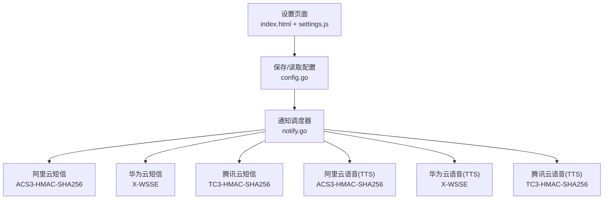
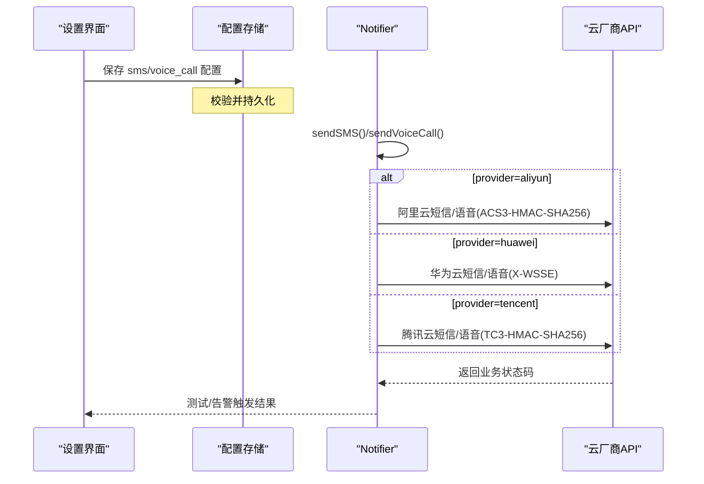
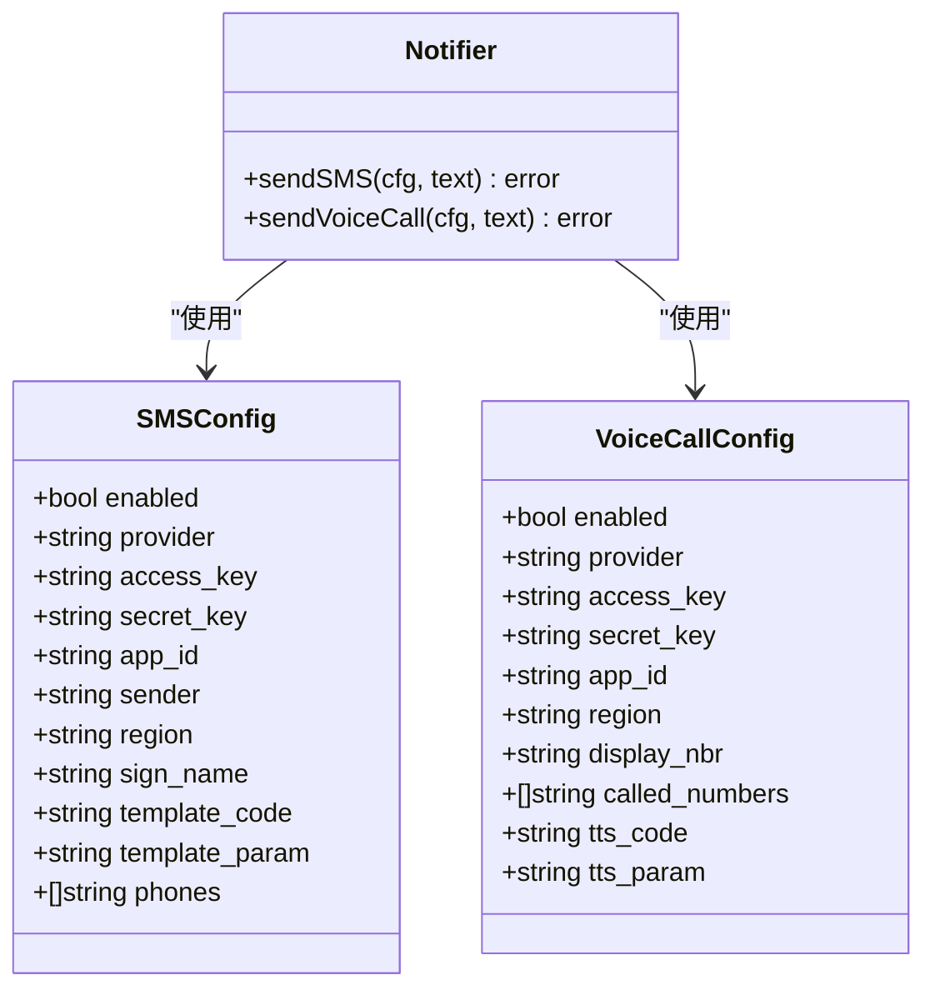

# 短信与语音通知

<cite>
**本文引用的文件**   
- [cmd/server/config.go](file://cmd/server/config.go)
- [cmd/server/notify.go](file://cmd/server/notify.go)
- [cmd/server/helpers_test.go](file://cmd/server/helpers_test.go)
- [cmd/server/web/index.html](file://cmd/server/web/index.html)
- [cmd/server/web/js/settings.js](file://cmd/server/web/js/settings.js)
- [README.md](file://README.md)
</cite>

## 目录
1. [简介](#简介)
2. [项目结构](#项目结构)
3. [核心组件](#核心组件)
4. [架构总览](#架构总览)
5. [详细组件分析](#详细组件分析)
6. [依赖关系分析](#依赖关系分析)
7. [性能与限制](#性能与限制)
8. [故障排查指南](#故障排查指南)
9. [结论](#结论)
10. [附录：配置项速查](#附录配置项速查)

## 简介
本章节面向 AIOps Monitor 的“短信”和“语音（TTS）”通知能力，聚焦以下目标：
- 支持的云服务商：阿里云、华为云、腾讯云
- 认证机制与签名算法
- 短信模板与变量替换规则、消息内容格式化
- 语音通话 TTS 模板设置与参数
- 各云服务商完整配置示例（AccessKey、SecretKey、模板代码等）
- 注意事项：短信签名、号码格式、发送频率限制等

## 项目结构
与短信/语音相关的关键位置：
- 配置结构定义：cmd/server/config.go
- 通知调度与云厂商实现：cmd/server/notify.go
- 前端配置界面与字段映射：cmd/server/web/index.html、cmd/server/web/js/settings.js
- 文档说明与字段字典：README.md

图表来源
- [cmd/server/web/index.html:884-924](file://cmd/server/web/index.html#L884-L924)
- [cmd/server/web/js/settings.js:29-53](file://cmd/server/web/js/settings.js#L29-L53)
- [cmd/server/config.go:46-73](file://cmd/server/config.go#L46-L73)
- [cmd/server/notify.go:554-566](file://cmd/server/notify.go#L554-L566)

章节来源
- [cmd/server/config.go:46-73](file://cmd/server/config.go#L46-L73)
- [cmd/server/notify.go:554-566](file://cmd/server/notify.go#L554-L566)
- [cmd/server/web/index.html:884-924](file://cmd/server/web/index.html#L884-L924)
- [cmd/server/web/js/settings.js:29-53](file://cmd/server/web/js/settings.js#L29-L53)

## 核心组件
- SMSConfig：短信通道配置（开关、提供商、凭证、签名、模板、接收号等）
- VoiceCallConfig：语音通道配置（开关、提供商、凭证、主叫/被叫、TTS 模板与参数等）
- Notifier：统一调度入口，按 provider 分发到具体云厂商实现

关键要点
- Provider 支持 aliyun/huawei/tencent；未显式指定时默认 aliyun
- 华为云短信需 Sender（通道号），腾讯云需 Region（地域）
- 华为/腾讯自动为号码补 +86 前缀；阿里云不自动补前缀
- 模板参数支持 JSON 对象或数组形式，空值时提供默认 message 注入

章节来源
- [cmd/server/config.go:46-73](file://cmd/server/config.go#L46-L73)
- [cmd/server/notify.go:554-566](file://cmd/server/notify.go#L554-L566)

## 架构总览
短信与语音的统一调用路径如下：

图表来源
- [cmd/server/notify.go:554-566](file://cmd/server/notify.go#L554-L566)
- [cmd/server/notify.go:659-671](file://cmd/server/notify.go#L659-L671)

## 详细组件分析

### 配置模型与字段说明
- 短信配置（SMSConfig）
  - enabled/provider/access_key/secret_key/app_id/sender/region/sign_name/template_code/template_param/phones
- 语音配置（VoiceCallConfig）
  - enabled/provider/access_key/secret_key/app_id/region/display_nbr/called_numbers/tts_code/tts_param

差异点
- app_id：华为云=project_id；腾讯云=SmsSdkAppId/VoiceSdkAppId；阿里云留空
- sender：华为云短信必填（通道号 from）
- region：腾讯云必填（如 ap-guangzhou）
- display_nbr：华为云语音必填（主叫号码）

章节来源
- [cmd/server/config.go:46-73](file://cmd/server/config.go#L46-L73)
- [README.md:494-510](file://README.md#L494-L510)

### 认证与签名机制
- 阿里云（短信/语音）
  - 使用 ACS3-HMAC-SHA256 签名，Authorization 头携带 Credential/SignedHeaders/Signature
  - 请求头包含 x-acs-action/x-acs-version/x-acs-date/x-acs-signature-nonce/x-acs-content-sha256
- 华为云（短信/语音）
  - 使用 X-WSSE UsernameToken 鉴权，Header 中附带 Nonce/Created/PasswordDigest
- 腾讯云（短信/语音）
  - 使用 TC3-HMAC-SHA256 签名，Authorization 头携带 Credential/SignedHeaders/Signature
  - 必须设置 X-TC-Region（缺失会失败，默认 ap-guangzhou）

章节来源
- [cmd/server/notify.go:499-533](file://cmd/server/notify.go#L499-L533)
- [cmd/server/notify.go:804-813](file://cmd/server/notify.go#L804-L813)
- [cmd/server/notify.go:1099-1125](file://cmd/server/notify.go#L1099-L1125)

### 短信模板与变量替换
- 阿里云
  - 若 template_param 为空，默认注入 {"message":"清洗后的告警文本"}
  - 若 template_param 包含 ${...} 占位符，则整体替换为实际告警文本（JSON 转义）
  - 否则原样发送静态 JSON
- 华为云/腾讯云
  - 优先解析 template_param 为字符串数组；解析失败或为空时兜底为 [text]
- 文本清洗
  - 阿里云路径会对告警文本进行安全清洗（去除 emoji/换行/特殊符号等），避免 isv.UNSUPPORTED_SMS_CONTENT

章节来源
- [cmd/server/notify.go:570-591](file://cmd/server/notify.go#L570-L591)
- [cmd/server/notify.go:776-785](file://cmd/server/notify.go#L776-L785)
- [cmd/server/notify.go:859-868](file://cmd/server/notify.go#L859-L868)
- [cmd/server/helpers_test.go:7-20](file://cmd/server/helpers_test.go#L7-L20)

### 语音通话（TTS）模板与参数
- 阿里云
  - 与短信一致的变量替换策略：空参默认 {"message":"..."}；含 ${...} 则整体替换为告警文本
- 华为云/腾讯云
  - 优先解析 tts_param 为字符串数组；解析失败或为空时兜底为 [text]
- 华为云额外要求
  - 必须配置 display_nbr（主叫号码），否则拒绝

章节来源
- [cmd/server/notify.go:674-688](file://cmd/server/notify.go#L674-L688)
- [cmd/server/notify.go:940-970](file://cmd/server/notify.go#L940-L970)
- [cmd/server/notify.go:1019-1042](file://cmd/server/notify.go#L1019-L1042)

### 号码格式与前缀处理
- 华为云/腾讯云：若号码不以 + 开头，自动补 +86
- 阿里云：不自动补前缀，需在 phones/called_numbers 中填写完整国际格式

章节来源
- [cmd/server/notify.go:787-798](file://cmd/server/notify.go#L787-L798)
- [cmd/server/notify.go:870-881](file://cmd/server/notify.go#L870-L881)
- [cmd/server/notify.go:955-959](file://cmd/server/notify.go#L955-L959)
- [cmd/server/notify.go:1029-1032](file://cmd/server/notify.go#L1029-L1032)

### 错误处理与日志
- 各云厂商均对响应体进行解析，非成功码将返回带错误码/信息的错误
- 通知失败会记录系统日志，便于定位

章节来源
- [cmd/server/notify.go:649-656](file://cmd/server/notify.go#L649-L656)
- [cmd/server/notify.go:836-843](file://cmd/server/notify.go#L836-L843)
- [cmd/server/notify.go:924-935](file://cmd/server/notify.go#L924-L935)
- [cmd/server/notify.go:1007-1014](file://cmd/server/notify.go#L1007-L1014)
- [cmd/server/notify.go:1085-1096](file://cmd/server/notify.go#L1085-L1096)

## 依赖关系分析
- 配置层（config.go）定义 SMSConfig/VoiceCallConfig 字段及语义
- 调度层（notify.go）根据 provider 路由至具体实现
- 前端（index.html/settings.js）负责收集用户输入并序列化到后端

图表来源
- [cmd/server/config.go:46-73](file://cmd/server/config.go#L46-L73)
- [cmd/server/notify.go:554-566](file://cmd/server/notify.go#L554-L566)
- [cmd/server/notify.go:659-671](file://cmd/server/notify.go#L659-L671)

章节来源
- [cmd/server/config.go:46-73](file://cmd/server/config.go#L46-L73)
- [cmd/server/notify.go:554-566](file://cmd/server/notify.go#L554-L566)
- [cmd/server/notify.go:659-671](file://cmd/server/notify.go#L659-L671)

## 性能与限制
- 并发与限流
  - 代码未内置云厂商侧的速率控制逻辑，建议结合外部网关或队列进行节流
- 超时与重试
  - HTTP 客户端具备基础超时保护，但未实现指数退避重试
- 文本长度
  - 阿里云短信路径会对内容进行清洗与截断，避免超长导致拒收

章节来源
- [cmd/server/notify.go:570-591](file://cmd/server/notify.go#L570-L591)
- [cmd/server/notify.go:438-447](file://cmd/server/notify.go#L438-L447)

## 故障排查指南
- 常见错误码
  - 阿里云：Code != "OK" 即失败，Message 中包含原因
  - 华为云：code != "000000" 即失败，description 包含原因
  - 腾讯云：Response.Error.Code/Message 非空即失败
- 典型问题
  - 缺少必填字段：如华为云缺少 project_id 或 from；腾讯云缺少 SmsSdkAppId/VoiceSdkAppId 或 Region
  - 签名不匹配：检查 AccessKey/SecretKey 是否被脱敏回填错误（见测试用例）
  - 号码格式：华为/腾讯未带 + 前缀会被自动补 +86；阿里云不会自动补
  - 模板参数：确保 JSON 结构与云厂商模板一致；含 ${...} 时注意整体替换行为

章节来源
- [cmd/server/notify.go:649-656](file://cmd/server/notify.go#L649-L656)
- [cmd/server/notify.go:836-843](file://cmd/server/notify.go#L836-L843)
- [cmd/server/notify.go:924-935](file://cmd/server/notify.go#L924-L935)
- [cmd/server/notify.go:1007-1014](file://cmd/server/notify.go#L1007-L1014)
- [cmd/server/notify.go:1085-1096](file://cmd/server/notify.go#L1085-L1096)
- [cmd/server/helpers_test.go:22-30](file://cmd/server/helpers_test.go#L22-L30)

## 结论
AIOps Monitor 在短信与语音通知方面提供了统一的接入面，屏蔽了三大云厂商的差异。通过清晰的配置模型、健壮的签名实现与灵活的模板参数机制，可快速落地生产级告警触达方案。建议在部署时结合外部限流与监控，保障高可用与合规性。

## 附录：配置项速查

- 通用字段
  - enabled：是否启用
  - provider：aliyun/huawei/tencent（短信/语音各自独立配置）
  - access_key/secret_key：云账号凭证
  - app_id：华为云=project_id；腾讯云=SmsSdkAppId/VoiceSdkAppId；阿里云留空
  - region：腾讯云必填（如 ap-guangzhou）

- 短信特有
  - sign_name：短信签名
  - template_code：模板编码
  - template_param：模板参数（JSON 对象或数组）
  - phones：接收手机号列表（华为/腾讯自动补 +86）
  - sender：华为云短信必填（通道号 from）

- 语音特有
  - tts_code：TTS 模板编码
  - tts_param：TTS 模板参数（JSON 数组）
  - called_numbers：被叫号码列表（华为/腾讯自动补 +86）
  - display_nbr：华为云语音必填（主叫号码）

章节来源
- [cmd/server/config.go:46-73](file://cmd/server/config.go#L46-L73)
- [README.md:494-510](file://README.md#L494-L510)