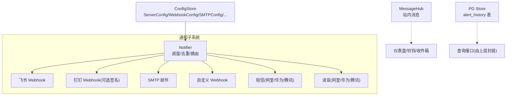
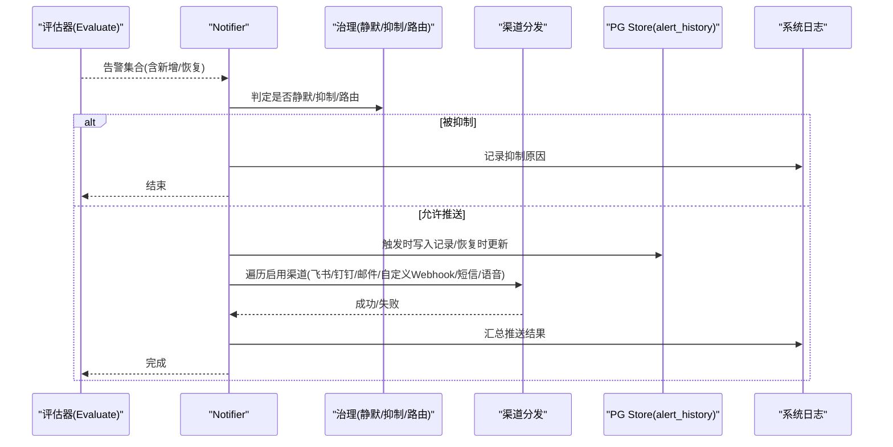
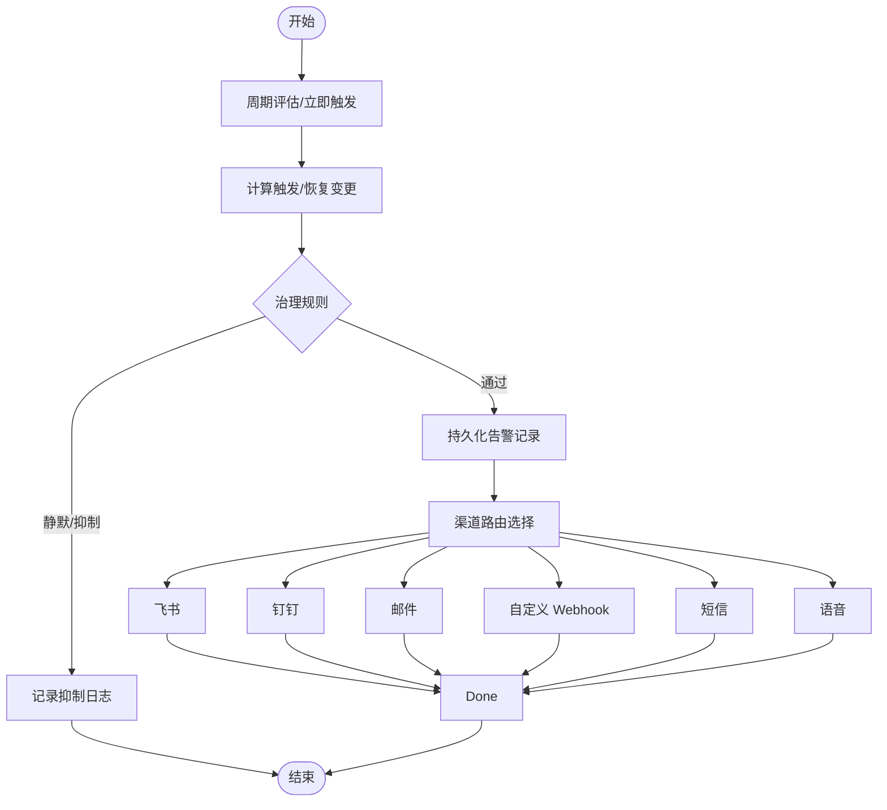
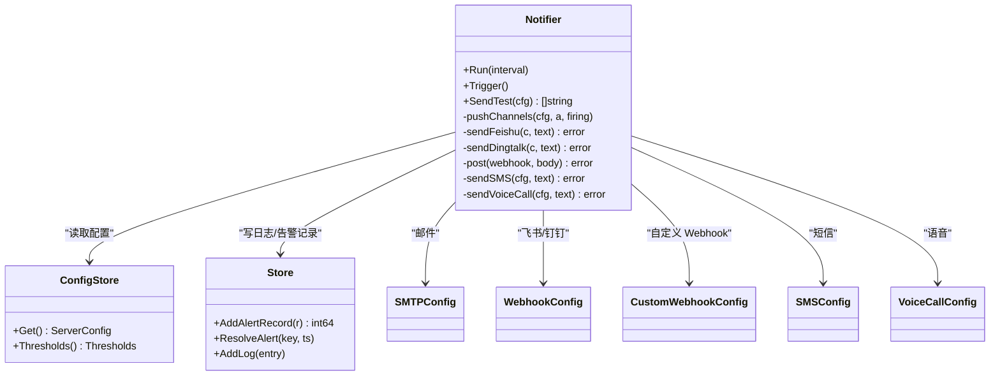

# 通知渠道管理

<cite>
**本文引用的文件**   
- [cmd/server/notify.go](file://cmd/server/notify.go)
- [cmd/server/email.go](file://cmd/server/email.go)
- [cmd/server/config.go](file://cmd/server/config.go)
- [cmd/server/message.go](file://cmd/server/message.go)
- [cmd/server/pgstore.go](file://cmd/server/pgstore.go)
- [cmd/server/web/i18n-dashboard.js](file://cmd/server/web/i18n-dashboard.js)
- [cmd/server/web/i18n-dashboard.en.js](file://cmd/server/web/i18n-dashboard.en.js)
- [cmd/server/i18n/zh-CN.json](file://cmd/server/i18n/zh-CN.json)
- [cmd/server/i18n/en.json](file://cmd/server/i18n/en.json)
</cite>

## 目录
1. [简介](#简介)
2. [项目结构](#项目结构)
3. [核心组件](#核心组件)
4. [架构总览](#架构总览)
5. [详细组件分析](#详细组件分析)
6. [依赖关系分析](#依赖关系分析)
7. [性能与可靠性](#性能与可靠性)
8. [故障排除指南](#故障排除指南)
9. [结论](#结论)
10. [附录：Webhook 接口规范](#附录webhook-接口规范)

## 简介
本文件面向 AIOps Monitor 的通知渠道管理系统，系统性说明已实现的多渠道通知能力、配置方法、消息格式、模板变量、签名验证机制、失败处理与发送记录查询等。当前代码库已支持以下渠道：
- 邮件（SMTP）
- 飞书机器人 Webhook
- 钉钉机器人 Webhook（可选 HMAC-SHA256 签名）
- 自定义 HTTP(S) Webhook（可定制请求体模板与请求头）
- 短信（阿里云、华为云、腾讯云）
- 语音电话（阿里云、华为云、腾讯云）

注意：企业微信通道在现有源码中未直接实现，但可通过“自定义 Webhook”对接企业微信群机器人或自建网关。

## 项目结构
通知相关逻辑主要分布在服务端模块中：
- 通知调度与分发：cmd/server/notify.go
- 邮件发送与验证码/重置令牌：cmd/server/email.go
- 配置模型与校验：cmd/server/config.go
- 站内消息中心（用于 UI 铃铛/收件箱）：cmd/server/message.go
- 告警历史持久化（PostgreSQL）：cmd/server/pgstore.go
- 前端国际化提示（含 Webhook 模板占位符说明）：cmd/server/web/i18n-dashboard*.js
- 后端国际化文案（错误信息、推送结果等）：cmd/server/i18n/*.json

图表来源
- [cmd/server/notify.go:160-276](file://cmd/server/notify.go#L160-L276)
- [cmd/server/config.go:15-73](file://cmd/server/config.go#L15-L73)
- [cmd/server/message.go:23-76](file://cmd/server/message.go#L23-L76)
- [cmd/server/pgstore.go:411-448](file://cmd/server/pgstore.go#L411-L448)

章节来源
- [cmd/server/notify.go:1-1216](file://cmd/server/notify.go#L1-L1216)
- [cmd/server/config.go:15-73](file://cmd/server/config.go#L15-L73)
- [cmd/server/message.go:23-76](file://cmd/server/message.go#L23-L76)
- [cmd/server/pgstore.go:411-448](file://cmd/server/pgstore.go#L411-L448)

## 核心组件
- Notifier：定时评估告警状态变化，仅对“触发/恢复”的变更进行推送；内置静默/抑制/路由治理；统一调用各渠道发送并记录日志。
- ConfigStore：集中管理通知渠道配置（飞书/钉钉/自定义 Webhook/SMTP/短信/语音），提供校验与环境变量覆盖。
- Email：基于标准库实现 SMTP 发送，支持隐式 TLS（465）与 STARTTLS（587）。
- MessageHub：内存环形缓冲 + 持久化桥接，支撑站内消息中心展示。
- PG Store：将告警生命周期事件写入 PostgreSQL alert_history 表，供查询与审计。

章节来源
- [cmd/server/notify.go:26-158](file://cmd/server/notify.go#L26-L158)
- [cmd/server/config.go:407-489](file://cmd/server/config.go#L407-L489)
- [cmd/server/email.go:24-86](file://cmd/server/email.go#L24-L86)
- [cmd/server/message.go:23-76](file://cmd/server/message.go#L23-L76)
- [cmd/server/pgstore.go:411-448](file://cmd/server/pgstore.go#L411-L448)

## 架构总览
下图展示了从告警评估到多渠道分发的关键流程，包括治理规则、渠道选择、重试与失败记录、以及告警记录的持久化。

图表来源
- [cmd/server/notify.go:102-158](file://cmd/server/notify.go#L102-L158)
- [cmd/server/notify.go:160-276](file://cmd/server/notify.go#L160-L276)
- [cmd/server/pgstore.go:411-448](file://cmd/server/pgstore.go#L411-L448)

## 详细组件分析

### 通知调度与分发（Notifier）
- 周期性运行：按固定间隔评估主机指标与转发数据，计算当前活跃告警集合。
- 状态机与去重：维护 active/since/recordIDs，仅在“首次触发”和“恢复”时推送，避免持续条件刷屏。
- 治理策略：
  - 静默：按时间窗口或标签匹配抑制触发通知。
  - 抑制：根据其他活跃告警抑制重复或级联告警。
  - 路由：命中路由则仅向指定渠道推送，否则默认全部启用渠道。
- 渠道分发：依次尝试飞书、钉钉、邮件、自定义 Webhook、短信、语音，任一失败均记录警告日志并继续尝试其他渠道。
- 测试能力：SendTest 可对所有启用渠道发送一条测试消息，便于连通性验证。

图表来源
- [cmd/server/notify.go:102-158](file://cmd/server/notify.go#L102-L158)
- [cmd/server/notify.go:194-276](file://cmd/server/notify.go#L194-L276)

章节来源
- [cmd/server/notify.go:26-158](file://cmd/server/notify.go#L26-L158)
- [cmd/server/notify.go:194-276](file://cmd/server/notify.go#L194-L276)

### 飞书机器人
- 配置项：enabled、webhook、secret（可选，飞书无需签名）。
- 消息体：text 类型，content.text 为格式化后的告警文本。
- 错误处理：HTTP 200 仍可能返回业务错误码，会解析 code/errcode 并报错。

章节来源
- [cmd/server/config.go:15-20](file://cmd/server/config.go#L15-L20)
- [cmd/server/notify.go:405-411](file://cmd/server/notify.go#L405-L411)
- [cmd/server/notify.go:438-464](file://cmd/server/notify.go#L438-L464)

### 钉钉机器人（可选签名）
- 配置项：enabled、webhook、secret（HMAC-SHA256 签名密钥）。
- 签名算法：timestamp + "\n" + secret 经 HMAC-SHA256 后 Base64，再 URL 编码，拼接为 query 参数 sign。
- 消息体：msgtype=text，text.content 为格式化文本。

章节来源
- [cmd/server/config.go:15-20](file://cmd/server/config.go#L15-L20)
- [cmd/server/notify.go:413-436](file://cmd/server/notify.go#L413-L436)

### 邮件通知（SMTP）
- 配置项：smtp_enabled、smtp_host、smtp_port、smtp_username、smtp_password、smtp_from_name、smtp_use_tls。
- 安全与兼容性：
  - 端口 465 使用隐式 TLS；端口 587 使用 STARTTLS。
  - 头部字段防注入校验，非 ASCII 自动 MIME 编码。
- 发送流程：构造 From/To/Subject/MIME 头与 HTML 正文，连接 SMTP 服务器并发送邮件。

章节来源
- [cmd/server/config.go:22-33](file://cmd/server/config.go#L22-L33)
- [cmd/server/email.go:24-86](file://cmd/server/email.go#L24-L86)
- [cmd/server/email.go:88-101](file://cmd/server/email.go#L88-L101)

### 自定义 Webhook
- 配置项：enabled、url、method（POST/GET）、content_type、headers（JSON key-value）、body_template（Go template）。
- 模板变量：Level、Type、Hostname、HostID、IP、Message、Value、Timestamp、Firing、Text。
- 默认请求体：当未设置 body_template 时，发送 JSON，包含 text、level、type、hostname、message、value、timestamp、firing。
- 请求头：支持 Content-Type 与用户自定义 headers。
- 安全性：使用受保护的 HTTP 客户端，限制访问元数据地址与本地链路。

章节来源
- [cmd/server/config.go:35-44](file://cmd/server/config.go#L35-L44)
- [cmd/server/notify.go:1134-1215](file://cmd/server/notify.go#L1134-L1215)
- [cmd/server/web/i18n-dashboard.js:628-629](file://cmd/server/web/i18n-dashboard.js#L628-L629)
- [cmd/server/web/i18n-dashboard.en.js:613-621](file://cmd/server/web/i18n-dashboard.en.js#L613-L621)

### 短信（阿里云/华为云/腾讯云）
- 通用配置：provider、access_key、secret_key、app_id（不同厂商含义不同）、sign_name、template_code、template_param、phones。
- 阿里云：ACS3-HMAC-SHA256 签名 V3，Query String 传参，Authorization 头携带签名。
- 华为云：X-WSSE 鉴权，JSON Body 发送，需 from（通道号）。
- 腾讯云：TC3-HMAC-SHA256 签名，JSON Body 发送，需 SmsSdkAppId 与 Region。
- 模板参数：支持 ${...} 占位符替换为实际告警内容，或纯静态 JSON。

章节来源
- [cmd/server/config.go:46-59](file://cmd/server/config.go#L46-L59)
- [cmd/server/notify.go:554-657](file://cmd/server/notify.go#L554-L657)
- [cmd/server/notify.go:757-844](file://cmd/server/notify.go#L757-L844)
- [cmd/server/notify.go:846-936](file://cmd/server/notify.go#L846-L936)

### 语音电话（阿里云/华为云/腾讯云）
- 通用配置：provider、access_key、secret_key、app_id、region、display_nbr（华为云必填）、called_numbers、tts_code、tts_param。
- 阿里云：SingleCallByTts，ACS3-HMAC-SHA256 签名。
- 华为云：X-WSSE 鉴权，JSON Body 发送。
- 腾讯云：SendTts，TC3-HMAC-SHA256 签名，需 Region。

章节来源
- [cmd/server/config.go:61-73](file://cmd/server/config.go#L61-L73)
- [cmd/server/notify.go:659-755](file://cmd/server/notify.go#L659-L755)
- [cmd/server/notify.go:938-1015](file://cmd/server/notify.go#L938-L1015)
- [cmd/server/notify.go:1017-1097](file://cmd/server/notify.go#L1017-L1097)

### 站内消息中心（MessageHub）
- 用途：聚合 SRE 事件、AI 诊断、SLO 违约、系统操作等，供仪表盘铃铛/收件箱展示。
- 特性：内存环形缓冲、最近 N 条、按 ID 倒序、标记已读、导出/导入持久化。

章节来源
- [cmd/server/message.go:23-76](file://cmd/server/message.go#L23-L76)

## 依赖关系分析
- Notifier 依赖 ConfigStore 获取渠道配置与阈值；依赖 Store 读写告警记录与系统日志；依赖 incident/remediation/forward 管理器（可选钩子）。
- 各渠道发送函数依赖统一的受保护 HTTP 客户端，防止 SSRF。
- 邮件发送依赖标准库 net/smtp 与 crypto/tls。
- 短信/语音依赖各自云厂商 API 签名实现。

图表来源
- [cmd/server/notify.go:26-158](file://cmd/server/notify.go#L26-L158)
- [cmd/server/config.go:15-73](file://cmd/server/config.go#L15-L73)

章节来源
- [cmd/server/notify.go:26-158](file://cmd/server/notify.go#L26-L158)
- [cmd/server/config.go:15-73](file://cmd/server/config.go#L15-L73)

## 性能与可靠性
- 去重与节流：仅对状态变更推送，避免持续条件导致的刷屏。
- 治理策略：静默/抑制/路由减少无效通知量。
- 网络健壮性：
  - 受保护 HTTP 客户端限制 SSRF。
  - 各渠道错误码解析与日志记录，便于定位。
- 重试策略：
  - 通知层未实现指数退避或多轮重试，失败即记录日志并继续后续渠道。
  - Agent 上报层有重试逻辑（与本通知子系统无关），此处不纳入。
- 持久化：告警触发/恢复写入 alert_history，便于回溯与审计。

章节来源
- [cmd/server/notify.go:194-276](file://cmd/server/notify.go#L194-L276)
- [cmd/server/pgstore.go:411-448](file://cmd/server/pgstore.go#L411-L448)

## 故障排除指南
- 飞书推送失败
  - 检查 webhook 是否正确、关键词是否匹配。
  - 查看系统日志中的“飞书推送失败”条目，关注返回的 code/errmsg。
- 钉钉推送失败
  - 确认 Secret 与 timestamp/sign 参数正确。
  - 参考“钉钉签名算法”核对实现。
- 邮件推送失败
  - 检查 Host/Port/Username/Password/TLS 模式。
  - 若 465 端口，UseTLS=true；若 587，UseTLS=false（STARTTLS）。
  - 检查 FromName 与 Subject 是否包含非法字符。
- 自定义 Webhook 失败
  - 检查 URL、Method、Content-Type、Headers 与 BodyTemplate。
  - 确认模板变量名与渲染结果符合下游期望。
- 短信/语音失败
  - 核对 provider、AccessKey/SecretKey、AppID、Region、签名方式。
  - 华为云需配置 from/displayNbr；腾讯云需 Region；阿里云需 ACS3 签名。
  - 模板参数 JSON 是否符合平台要求。

章节来源
- [cmd/server/notify.go:212-276](file://cmd/server/notify.go#L212-L276)
- [cmd/server/email.go:24-86](file://cmd/server/email.go#L24-L86)
- [cmd/server/notify.go:1134-1215](file://cmd/server/notify.go#L1134-L1215)
- [cmd/server/notify.go:554-936](file://cmd/server/notify.go#L554-L936)
- [cmd/server/notify.go:938-1097](file://cmd/server/notify.go#L938-L1097)

## 结论
AIOps Monitor 的通知子系统以 Notifier 为核心，结合治理策略与多通道分发，实现了稳定、可扩展且易用的告警通知能力。通过配置驱动的渠道管理与灵活的 Webhook 模板，既能满足主流平台直连，也能快速对接自研系统。配合告警历史持久化与系统日志，运维人员可高效排查与审计通知问题。

## 附录：Webhook 接口规范

### 请求方法与协议
- 协议：HTTP(S)
- 方法：POST（默认）或 GET（需在配置中指定）
- 超时：受保护客户端默认 8 秒

### 请求头
- Content-Type：application/json（默认）或 text/plain（可配置）
- 自定义 Headers：通过配置中的 headers JSON 键值对注入

### 请求体（默认 JSON）
- 字段列表：
  - text：格式化后的告警文本
  - level：级别（warning/critical）
  - type：类型（cpu/memory/disk/...）
  - hostname：主机名
  - message：详情
  - value：数值
  - timestamp：时间戳
  - firing：是否触发（true/false）

### 请求体（自定义模板）
- 模板引擎：Go template
- 可用变量：
  - Level、Type、Hostname、HostID、IP、Message、Value、Timestamp、Firing、Text

### 响应与错误
- 成功：HTTP 2xx
- 失败：HTTP >= 300 视为错误；自定义 Webhook 不会解析业务码，仅依据 HTTP 状态码判断

章节来源
- [cmd/server/notify.go:1134-1215](file://cmd/server/notify.go#L1134-L1215)
- [cmd/server/web/i18n-dashboard.js:628-629](file://cmd/server/web/i18n-dashboard.js#L628-L629)
- [cmd/server/web/i18n-dashboard.en.js:613-621](file://cmd/server/web/i18n-dashboard.en.js#L613-L621)