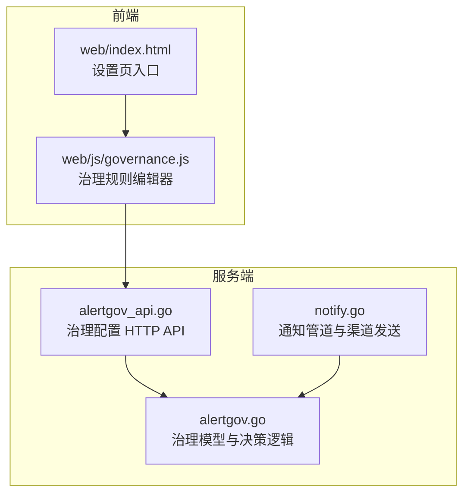
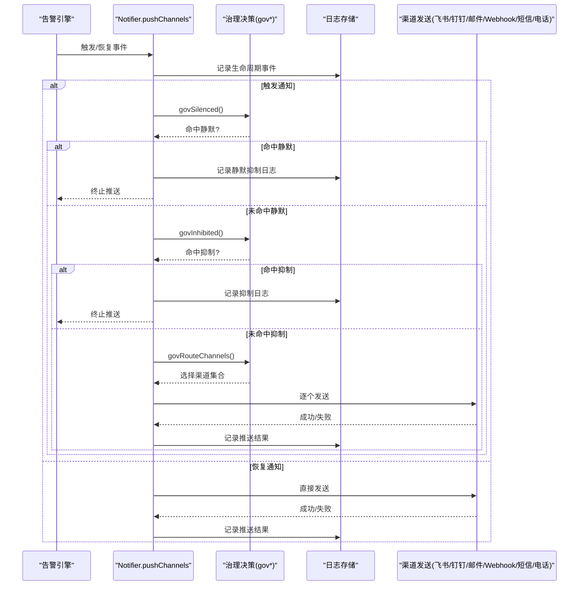
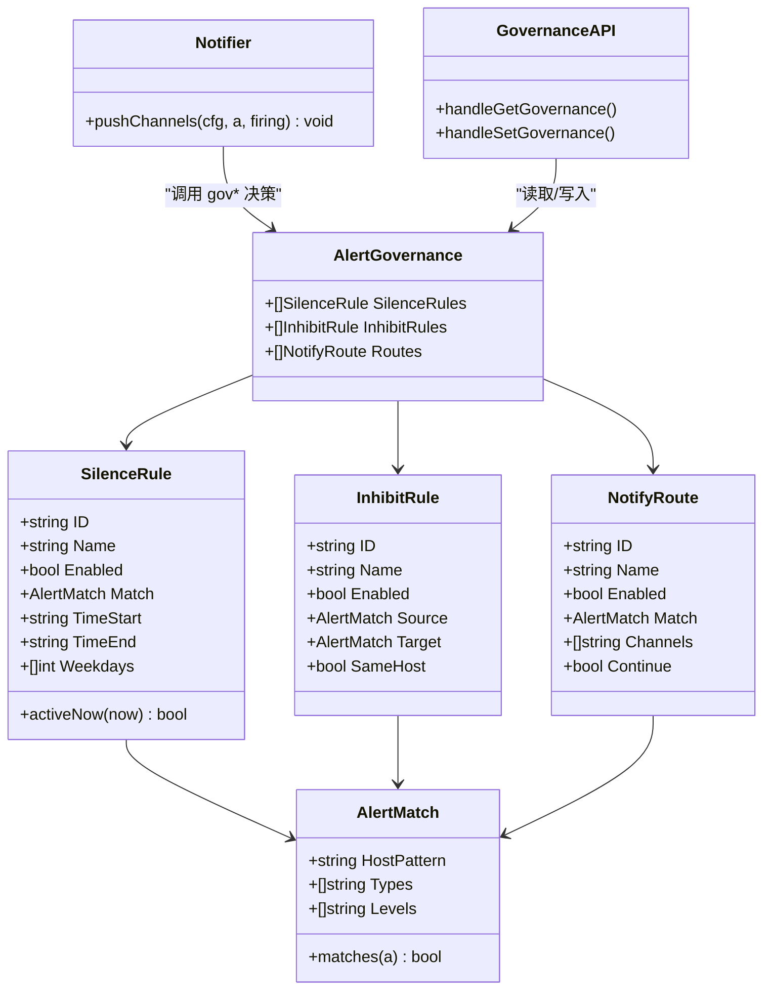

# 通知路由与治理

<cite>
**本文引用的文件**   
- [alertgov.go](file://cmd/server/alertgov.go)
- [alertgov_api.go](file://cmd/server/alertgov_api.go)
- [notify.go](file://cmd/server/notify.go)
- [governance.js](file://cmd/server/web/js/governance.js)
- [index.html](file://cmd/server/web/index.html)
- [README.md](file://README.md)
</cite>

## 目录
1. [简介](#简介)
2. [项目结构](#项目结构)
3. [核心组件](#核心组件)
4. [架构总览](#架构总览)
5. [详细组件分析](#详细组件分析)
6. [依赖关系分析](#依赖关系分析)
7. [性能考量](#性能考量)
8. [故障排查指南](#故障排查指南)
9. [结论](#结论)
10. [附录：配置示例与最佳实践](#附录配置示例与最佳实践)

## 简介
本文件聚焦 AIOps Monitor 的“通知路由与治理”能力，围绕以下目标展开：
- 告警静默规则（Silence）：按主机、类型、级别匹配，支持时间窗口与星期限定，用于临时屏蔽特定告警。
- 抑制规则（Inhibit）：主因告警活跃时抑制衍生告警，避免告警风暴。
- 通知路由（Route）：根据匹配条件将告警分发到指定渠道（飞书、钉钉、邮件、自定义 Webhook、短信、语音电话），并支持继续匹配后续路由。
- 治理优先级与冲突解决：明确静默优先于抑制，抑制优先于路由；恢复通知不受静默影响。
- 实际业务场景示例：维护期间静默、主从节点关联抑制等。

## 项目结构
与通知路由和治理相关的后端实现集中在服务端模块中，前端提供可视化配置入口。

图表来源
- [alertgov.go:1-226](file://cmd/server/alertgov.go#L1-L226)
- [notify.go:196-276](file://cmd/server/notify.go#L196-L276)
- [alertgov_api.go:1-56](file://cmd/server/alertgov_api.go#L1-L56)
- [index.html:804-829](file://cmd/server/web/index.html#L804-L829)
- [governance.js:64-77](file://cmd/server/web/js/governance.js#L64-L77)

章节来源
- [alertgov.go:1-226](file://cmd/server/alertgov.go#L1-L226)
- [notify.go:196-276](file://cmd/server/notify.go#L196-L276)
- [alertgov_api.go:1-56](file://cmd/server/alertgov_api.go#L1-L56)
- [index.html:804-829](file://cmd/server/web/index.html#L804-L829)
- [governance.js:64-77](file://cmd/server/web/js/governance.js#L64-L77)

## 核心组件
- 匹配条件 AlertMatch：统一用于三类规则的匹配，支持主机名/IP 子串匹配、类型集合、级别集合。
- 静默规则 SilenceRule：包含启用开关、匹配条件、生效时段（HH:MM，支持跨天）、星期列表。
- 抑制规则 InhibitRule：包含源匹配 Source、目标匹配 Target、是否要求同主机 SameHost。
- 通知路由 NotifyRoute：包含匹配条件、目标渠道集合、是否继续匹配 Continue。
- 治理配置 AlertGovernance：聚合上述三类规则，持久化在服务器配置中。

关键行为要点
- 仅对触发（firing）通知执行静默与抑制；恢复（resolve）通知一律照发。
- 路由命中后，若未勾选 Continue，则停止后续路由匹配；否则继续累积渠道。
- 无路由命中时，回退为全部已启用渠道。

章节来源
- [alertgov.go:20-89](file://cmd/server/alertgov.go#L20-L89)
- [alertgov.go:147-194](file://cmd/server/alertgov.go#L147-L194)

## 架构总览
通知下发前插入治理决策层，流程如下：

图表来源
- [notify.go:196-276](file://cmd/server/notify.go#L196-L276)
- [alertgov.go:147-194](file://cmd/server/alertgov.go#L147-L194)

## 详细组件分析

### 匹配条件 AlertMatch
- 主机匹配：支持主机名或 IP 的子串匹配，大小写不敏感。
- 类型匹配：支持多类型集合，任一命中即满足。
- 级别匹配：支持 warning/critical 等多级别集合。
- 组合语义：多个条件为“与”关系。

复杂度与优化
- 单次匹配为 O(n) 线性扫描，n 为集合长度；典型规模下开销极低。
- 建议保持集合精简，避免过长列表导致不必要的比较。

章节来源
- [alertgov.go:20-51](file://cmd/server/alertgov.go#L20-L51)

### 静默规则 SilenceRule
- 生效判定：
  - 星期限定：仅在指定星期生效。
  - 时间窗口：支持 HH:MM 格式，支持跨天（如 22:00–08:00）。
  - 无时段=全天生效。
- 匹配流程：先判断星期，再判断时间窗口，最后进行 AlertMatch 匹配。
- 作用范围：仅抑制“触发”通知的推送，不影响 UI 展示与记录。

边界与注意事项
- 右开边界：结束时间不包含在内（例如 08:00 不在窗口内）。
- 无效时段字符串会被忽略，视为全天。

章节来源
- [alertgov.go:53-62](file://cmd/server/alertgov.go#L53-L62)
- [alertgov.go:91-145](file://cmd/server/alertgov.go#L91-L145)
- [alertgov_test.go:33-63](file://cmd/server/alertgov_test.go#L33-L63)

### 抑制规则 InhibitRule
- 源与目标：Source 匹配“主因”告警，Target 匹配“衍生”告警。
- 同主机约束：SameHost=true 时，要求源与目标在同一主机上。
- 自我抑制保护：不会抑制自身（避免 target 匹配到自身活跃项）。
- 常见用法：主机离线 → 抑制该主机的 CPU/内存/磁盘等指标告警。

章节来源
- [alertgov.go:64-72](file://cmd/server/alertgov.go#L64-L72)
- [alertgov.go:157-176](file://cmd/server/alertgov.go#L157-L176)
- [alertgov_test.go:79-108](file://cmd/server/alertgov_test.go#L79-L108)

### 通知路由 NotifyRoute
- 渠道集合：feishu/dingtalk/email/webhook/sms/voicecall。
- 继续匹配：Continue=true 时，可累积多条路由的渠道；默认 false 命中即停。
- 无路由命中：回退为全部已启用渠道（向后兼容）。

章节来源
- [alertgov.go:74-82](file://cmd/server/alertgov.go#L74-L82)
- [alertgov.go:178-194](file://cmd/server/alertgov.go#L178-L194)
- [alertgov_test.go:110-128](file://cmd/server/alertgov_test.go#L110-L128)

### 治理决策集成点 pushChannels
- 顺序：静默 → 抑制 → 路由 → 发送。
- 恢复通知：跳过静默与抑制，直接发送。
- 渠道发送：按 send("channel") 过滤，结合各渠道配置开关与凭证。

章节来源
- [notify.go:196-276](file://cmd/server/notify.go#L196-L276)

### 治理配置 API 与前端
- 获取配置：GET 返回当前治理配置。
- 整体替换：POST 提交完整配置，服务端清洗无名空规则并为缺 ID 的规则生成稳定 ID。
- 前端编辑器：提供规则卡片编辑、渠道勾选、同主机抑制开关、继续匹配开关等。

章节来源
- [alertgov_api.go:11-55](file://cmd/server/alertgov_api.go#L11-L55)
- [governance.js:64-77](file://cmd/server/web/js/governance.js#L64-L77)
- [index.html:804-829](file://cmd/server/web/index.html#L804-L829)

## 依赖关系分析
- notify.go 依赖 alertgov.go 中的决策函数 govSilenced、govInhibited、govRouteChannels。
- alertgov_api.go 通过 ConfigStore 读写 AlertGovernance。
- 前端 governance.js 渲染规则编辑器，并通过 API 提交配置。

图表来源
- [alertgov.go:20-89](file://cmd/server/alertgov.go#L20-L89)
- [alertgov.go:147-194](file://cmd/server/alertgov.go#L147-L194)
- [notify.go:196-276](file://cmd/server/notify.go#L196-L276)
- [alertgov_api.go:11-55](file://cmd/server/alertgov_api.go#L11-L55)

## 性能考量
- 匹配与决策均为轻量级 CPU 操作，主要开销在于外部渠道网络 I/O。
- 建议在路由与匹配条件中尽量使用精确的主机模式与类型集合，减少不必要的比较。
- 对于大规模环境，合理拆分路由规则，避免单条规则过于宽泛导致后续规则失效。

## 故障排查指南
- 静默未生效：检查时间窗口与星期设置是否正确；确认规则已启用且名称非空。
- 抑制未生效：确认源告警处于活跃状态；若开启 SameHost，确保源与目标主机一致。
- 路由未命中：核对渠道集合与 Continue 选项；若无路由命中，系统会回退到全部启用渠道。
- 渠道发送失败：查看系统日志中对应渠道的错误信息，校验 Webhook/SMTP/云厂商凭证与模板参数。

章节来源
- [notify.go:214-276](file://cmd/server/notify.go#L214-L276)

## 结论
AIOps Monitor 的通知路由与治理体系以“静默→抑制→路由”的顺序保障告警质量与送达效率。通过灵活的时间窗口、匹配条件与作用范围控制，以及明确的优先级与冲突解决机制，能够有效抑制告警风暴、降低夜间打扰并按业务分流通知。

## 附录：配置示例与最佳实践

### 静默规则示例
- 维护期间静默：在工作日 22:00–次日 08:00 静默非关键告警。
  - 匹配条件：类型为 cpu/memory/disk/load 等，级别为 warning。
  - 时间窗口：TimeStart="22:00", TimeEnd="08:00"。
  - 星期：Weekdays=[1,2,3,4,5]（周一到周五）。
- 全周夜间静默：TimeStart="23:00", TimeEnd="06:00"，Weekdays 留空表示每天。

章节来源
- [alertgov.go:53-62](file://cmd/server/alertgov.go#L53-L62)
- [alertgov.go:121-145](file://cmd/server/alertgov.go#L121-L145)
- [alertgov_test.go:33-63](file://cmd/server/alertgov_test.go#L33-L63)

### 抑制规则示例
- 主机离线抑制其自身指标告警：
  - Source：Types=["offline"]。
  - Target：Types=["cpu","memory","disk","load"]。
  - SameHost：true。
- 主从节点关联抑制（概念性说明）：
  - 当主库出现严重告警时，抑制从库的只读延迟类告警（需结合实际类型与主机模式设计匹配条件）。

章节来源
- [alertgov.go:64-72](file://cmd/server/alertgov.go#L64-L72)
- [alertgov.go:157-176](file://cmd/server/alertgov.go#L157-L176)
- [alertgov_test.go:79-108](file://cmd/server/alertgov_test.go#L79-L108)

### 通知路由示例
- 严重告警走电话/钉钉，警告仅走飞书：
  - 路由1：Levels=["critical"], Channels=["dingtalk","sms","voicecall"]，Continue=false。
  - 路由2：Levels=["warning"], Channels=["feishu"]，Continue=false。
- 多路由累积：
  - 路由1：Levels=["critical"], Channels=["feishu","dingtalk"]，Continue=true。
  - 路由2：HostPattern="db-*", Channels=["email"]，Continue=false。

章节来源
- [alertgov.go:74-82](file://cmd/server/alertgov.go#L74-L82)
- [alertgov.go:178-194](file://cmd/server/alertgov.go#L178-L194)
- [alertgov_test.go:110-128](file://cmd/server/alertgov_test.go#L110-L128)

### 优先级与冲突解决
- 优先级顺序：静默 > 抑制 > 路由。
- 恢复通知不受静默影响，始终发送。
- 路由命中后，若未勾选 Continue，则停止后续匹配；否则继续累积渠道。
- 无路由命中时，回退为全部已启用渠道。

章节来源
- [notify.go:196-210](file://cmd/server/notify.go#L196-L210)
- [alertgov.go:178-194](file://cmd/server/alertgov.go#L178-L194)

### 配置入口与操作
- 面板入口：设置页包含飞书、钉钉、邮件、短信、语音电话等通道配置；治理规则在“告警治理”页面集中管理。
- 提交方式：一次性提交全部规则，服务端自动清洗无名空规则并补全 ID。

章节来源
- [index.html:804-829](file://cmd/server/web/index.html#L804-L829)
- [alertgov_api.go:17-55](file://cmd/server/alertgov_api.go#L17-L55)
- [README.md:745-754](file://README.md#L745-L754)