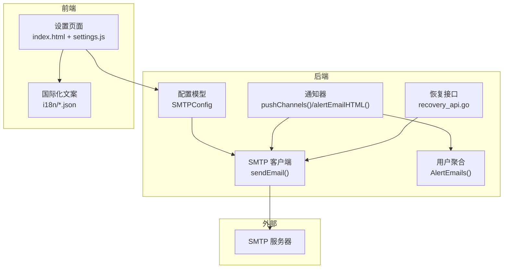
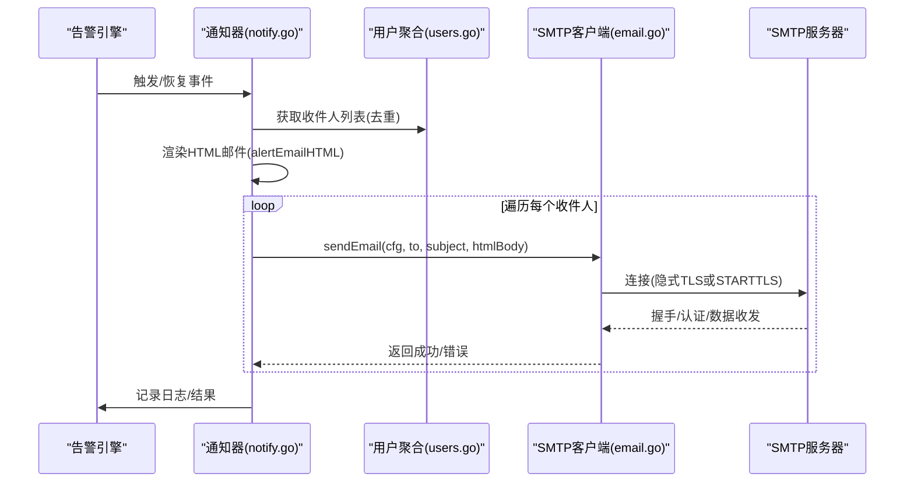
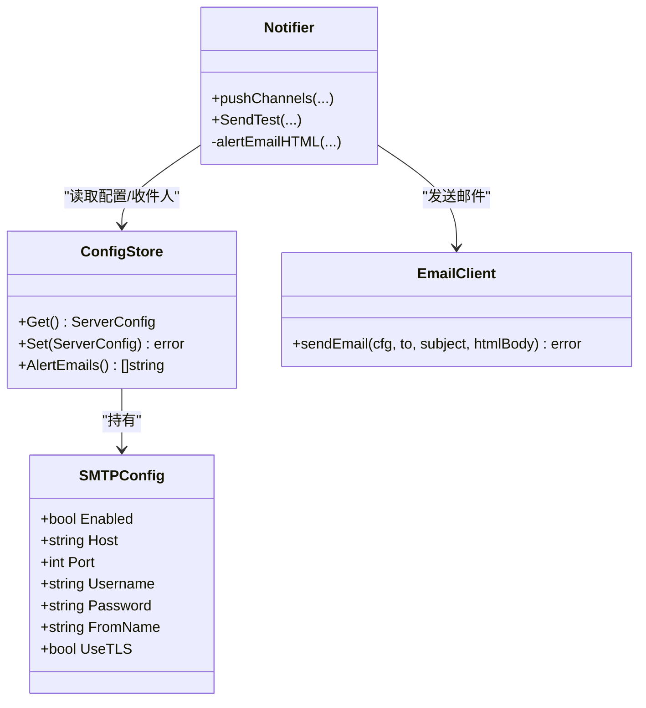

# 邮件通知

<cite>
**本文引用的文件**   
- [cmd/server/email.go](file://cmd/server/email.go)
- [cmd/server/config.go](file://cmd/server/config.go)
- [cmd/server/notify.go](file://cmd/server/notify.go)
- [cmd/server/users.go](file://cmd/server/users.go)
- [cmd/server/recovery_api.go](file://cmd/server/recovery_api.go)
- [cmd/server/web/index.html](file://cmd/server/web/index.html)
- [cmd/server/web/js/settings.js](file://cmd/server/web/js/settings.js)
- [cmd/server/i18n/en.json](file://cmd/server/i18n/en.json)
- [README_EN.md](file://README_EN.md)
</cite>

## 目录
1. [简介](#简介)
2. [项目结构](#项目结构)
3. [核心组件](#核心组件)
4. [架构总览](#架构总览)
5. [详细组件分析](#详细组件分析)
6. [依赖关系分析](#依赖关系分析)
7. [性能与可靠性](#性能与可靠性)
8. [故障排查指南](#故障排查指南)
9. [结论](#结论)
10. [附录：常见邮箱服务商配置示例](#附录常见邮箱服务商配置示例)

## 简介
本章节面向 AIOps Monitor 的“邮件通知”能力，覆盖 SMTP 服务器配置、HTML 邮件模板与样式、多收件人支持、主题定制、告警级别颜色映射、测试发送、错误日志记录等。文档同时给出主流邮箱（QQ、163、企业微信邮箱）的配置要点与注意事项。

## 项目结构
邮件通知功能涉及以下关键位置：
- SMTP 客户端实现与 TLS/STARTTLS 处理
- 配置模型与校验
- 告警触发后的邮件推送流程
- 用户列表聚合为多收件人
- 前端设置页与国际化文案
- 密码重置验证码邮件发送

图表来源
- [cmd/server/config.go:22-33](file://cmd/server/config.go#L22-L33)
- [cmd/server/email.go:24-86](file://cmd/server/email.go#L24-L86)
- [cmd/server/notify.go:230-245](file://cmd/server/notify.go#L230-L245)
- [cmd/server/users.go:418-433](file://cmd/server/users.go#L418-L433)
- [cmd/server/recovery_api.go:50-92](file://cmd/server/recovery_api.go#L50-L92)
- [cmd/server/web/index.html:859-868](file://cmd/server/web/index.html#L859-L868)
- [cmd/server/web/js/settings.js:20-29](file://cmd/server/web/js/settings.js#L20-L29)
- [cmd/server/i18n/en.json:103-107](file://cmd/server/i18n/en.json#L103-L107)

章节来源
- [cmd/server/config.go:22-33](file://cmd/server/config.go#L22-L33)
- [cmd/server/email.go:24-86](file://cmd/server/email.go#L24-L86)
- [cmd/server/notify.go:230-245](file://cmd/server/notify.go#L230-L245)
- [cmd/server/users.go:418-433](file://cmd/server/users.go#L418-L433)
- [cmd/server/recovery_api.go:50-92](file://cmd/server/recovery_api.go#L50-L92)
- [cmd/server/web/index.html:859-868](file://cmd/server/web/index.html#L859-L868)
- [cmd/server/web/js/settings.js:20-29](file://cmd/server/web/js/settings.js#L20-L29)
- [cmd/server/i18n/en.json:103-107](file://cmd/server/i18n/en.json#L103-L107)

## 核心组件
- SMTP 配置模型：包含启用开关、主机、端口、用户名、密码、发件人显示名、是否使用隐式 TLS。
- SMTP 客户端：封装 net/smtp 与 crypto/tls，支持隐式 TLS（默认 465）与 STARTTLS（587）。
- 通知器：在告警触发/恢复时生成 HTML 邮件内容并调用 SMTP 客户端发送。
- 多收件人：从所有用户的邮箱字段去重后作为收件人列表。
- 前端设置：提供 SMTP 配置表单与测试发送入口。
- 国际化：邮件主题、正文占位符、错误提示均通过 i18n 管理。

章节来源
- [cmd/server/config.go:22-33](file://cmd/server/config.go#L22-L33)
- [cmd/server/email.go:24-86](file://cmd/server/email.go#L24-L86)
- [cmd/server/notify.go:230-245](file://cmd/server/notify.go#L230-L245)
- [cmd/server/users.go:418-433](file://cmd/server/users.go#L418-L433)
- [cmd/server/web/index.html:859-868](file://cmd/server/web/index.html#L859-L868)
- [cmd/server/web/js/settings.js:20-29](file://cmd/server/web/js/settings.js#L20-L29)
- [cmd/server/i18n/en.json:103-107](file://cmd/server/i18n/en.json#L103-L107)

## 架构总览
下图展示一次告警触发的端到端邮件通知流程：

图表来源
- [cmd/server/notify.go:230-245](file://cmd/server/notify.go#L230-L245)
- [cmd/server/users.go:418-433](file://cmd/server/users.go#L418-L433)
- [cmd/server/email.go:24-86](file://cmd/server/email.go#L24-L86)

## 详细组件分析

### SMTP 配置模型与校验
- 字段说明
  - smtp_enabled：是否启用邮件通道
  - smtp_host：SMTP 服务器地址
  - smtp_port：端口；未设置时默认 465（隐式 TLS）
  - smtp_username：发件账号
  - smtp_password：授权码/密码
  - smtp_from_name：发件人显示名（默认“AIOps Monitor”）
  - smtp_use_tls：是否启用隐式 TLS（465 端口建议开启）
- 校验规则
  - 启用时端口必须在 1-65535
  - 若设置了密码，长度至少 4 位
- 保存策略
  - 提交空或脱敏值时保留原密码，避免误覆盖

章节来源
- [cmd/server/config.go:22-33](file://cmd/server/config.go#L22-L33)
- [cmd/server/config.go:524-532](file://cmd/server/config.go#L524-L532)
- [cmd/server/config.go:979-986](file://cmd/server/config.go#L979-L986)

### SMTP 客户端实现（隐式 TLS 与 STARTTLS）
- 连接模式
  - 隐式 TLS（port 465）：先建立 TLS 连接，再走 SMTP 协议
  - STARTTLS（port 587）：使用标准库 SendMail 自动协商升级
- 认证方式
  - 使用 PlainAuth 进行用户名+密码（或授权码）认证
- 头部安全
  - 拒绝在 To/Subject/FromName 中包含换行字符，防止头注入
  - 对非 ASCII 字符进行 RFC 2047 编码，确保中文标题正确显示
- 错误信息
  - 统一转换为本地化错误消息，便于前端展示

章节来源
- [cmd/server/email.go:24-86](file://cmd/server/email.go#L24-L86)
- [cmd/server/email.go:88-101](file://cmd/server/email.go#L88-L101)

### 告警邮件内容与样式
- 主题定制
  - 使用国际化键拼接主机名，如 “AIOps Alert: %s”
- HTML 模板
  - 内联 CSS 表格布局，适配多数邮件客户端
  - 根据告警级别与状态动态着色：
    - 严重级别：红色
    - 警告级别：橙色
    - 恢复状态：绿色
- 字段展示
  - 主机名、IP、级别、类型、详情、时间等

章节来源
- [cmd/server/notify.go:357-403](file://cmd/server/notify.go#L357-L403)
- [cmd/server/i18n/en.json:103-107](file://cmd/server/i18n/en.json#L103-L107)

### 多收件人与测试发送
- 多收件人
  - 从所有用户账户中收集邮箱，去重后作为收件人列表
- 测试发送
  - 当 SMTP 已启用且存在收件人时，发送一条测试 HTML 邮件
  - 失败时返回具体错误信息，便于定位

章节来源
- [cmd/server/users.go:418-433](file://cmd/server/users.go#L418-L433)
- [cmd/server/notify.go:309-355](file://cmd/server/notify.go#L309-L355)

### 前端设置与国际化
- 设置项
  - 启用开关、主机、端口、用户名、密码、发件人显示名、TLS 开关
- 行为
  - 打开设置页时拉取当前配置并回填表单
  - 保存时仅覆盖通知相关字段，其他配置不受影响
- 国际化
  - 界面文案与邮件主题/正文占位符由 i18n 管理

章节来源
- [cmd/server/web/index.html:859-868](file://cmd/server/web/index.html#L859-L868)
- [cmd/server/web/js/settings.js:20-29](file://cmd/server/web/js/settings.js#L20-L29)
- [cmd/server/i18n/en.json:103-107](file://cmd/server/i18n/en.json#L103-L107)

### 密码重置验证码邮件
- 触发条件
  - 用户请求重置密码或找回用户名时，系统生成一次性验证码并通过邮件发送
- 内容
  - 简洁 HTML 文本，包含验证码、有效期与免责声明
- 安全性
  - 即使不存在该邮箱也返回相同响应，避免枚举攻击
  - 发送失败不暴露目标邮箱是否存在

章节来源
- [cmd/server/recovery_api.go:50-92](file://cmd/server/recovery_api.go#L50-L92)

## 依赖关系分析
- 模块耦合
  - 通知器依赖配置模型与用户聚合，最终调用 SMTP 客户端
  - 前端设置页依赖配置 API 与国际化资源
- 外部依赖
  - 仅使用 Go 标准库 net/smtp 与 crypto/tls，无第三方依赖

图表来源
- [cmd/server/config.go:22-33](file://cmd/server/config.go#L22-L33)
- [cmd/server/notify.go:230-245](file://cmd/server/notify.go#L230-L245)
- [cmd/server/users.go:418-433](file://cmd/server/users.go#L418-L433)
- [cmd/server/email.go:24-86](file://cmd/server/email.go#L24-L86)

## 性能与可靠性
- 连接与重试
  - 当前实现单次发送，无内置重试机制
  - 建议在网关层或上层调度器增加重试与退避策略
- 并发与限流
  - 邮件发送为网络 I/O，建议限制并发数，避免打爆 SMTP 服务端
  - 验证码发送具备 60 秒频率限制，防止滥用
- 错误处理
  - 发送失败会记录系统日志，便于审计与排障
  - 对外返回统一错误消息，避免泄露敏感细节

章节来源
- [cmd/server/email.go:24-86](file://cmd/server/email.go#L24-L86)
- [cmd/server/notify.go:230-245](file://cmd/server/notify.go#L230-L245)
- [cmd/server/recovery_api.go:50-92](file://cmd/server/recovery_api.go#L50-L92)

## 故障排查指南
- 常见问题
  - 未配置或未启用 SMTP：检查 smtp_enabled、smtp_host、smtp_username
  - 端口与加密不匹配：465 需启用隐式 TLS；587 通常使用 STARTTLS（关闭隐式 TLS）
  - 认证失败：确认用户名与授权码/密码正确，部分邮箱需使用应用专用授权码
  - 证书问题：隐式 TLS 下请确保主机名与证书一致
  - 收件人为空：确保至少一个用户绑定了邮箱
- 日志与诊断
  - 查看系统日志中的邮件发送失败记录
  - 使用“测试发送”功能验证连通性
- 快速自检清单
  - 能 telnet 到 SMTP 端口
  - 使用独立工具（如 curl 或 mailx）以相同凭据发送测试邮件
  - 检查防火墙/代理是否阻断出站 465/587 端口

章节来源
- [cmd/server/notify.go:230-245](file://cmd/server/notify.go#L230-L245)
- [cmd/server/email.go:24-86](file://cmd/server/email.go#L24-L86)

## 结论
AIOps Monitor 的邮件通知基于标准库实现，具备隐式 TLS 与 STARTTLS 双模式、HTML 模板、多收件人、主题与样式可定制、测试发送与完善的错误日志。生产环境建议结合网关重试、并发控制与合规的授权码策略，以获得稳定可靠的告警投递体验。

## 附录：常见邮箱服务商配置示例
以下为常用邮箱的推荐配置要点（请以各厂商最新文档为准）：
- QQ 邮箱
  - 主机：smtp.qq.com
  - 端口：465（启用隐式 TLS）或 587（STARTTLS）
  - 认证：建议使用“授权码”而非登录密码
- 163 邮箱
  - 主机：smtp.163.com
  - 端口：465（启用隐式 TLS）或 587（STARTTLS）
  - 认证：建议使用“授权码”
- 企业微信邮箱（腾讯企业邮）
  - 主机：smtp.exmail.qq.com
  - 端口：465（启用隐式 TLS）或 587（STARTTLS）
  - 认证：管理员可在企业后台开启 SMTP 服务并使用对应账号/授权码

注意：
- 不同厂商对端口与加密策略可能有所差异，请优先遵循其官方文档
- 若出现证书错误，请检查主机名与证书一致性以及系统时间是否正确
- 若被拒收或退回，检查发件域名、SPF/DKIM/DMARC 等反垃圾策略

章节来源
- [README_EN.md:434-440](file://README_EN.md#L434-L440)