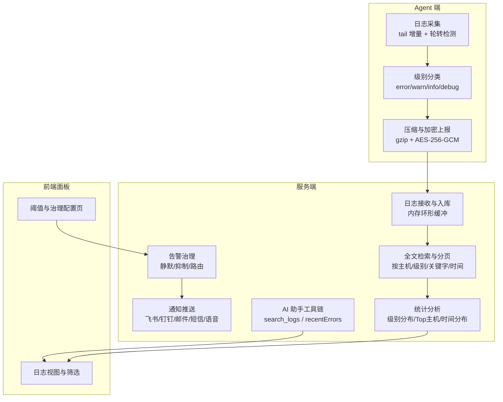
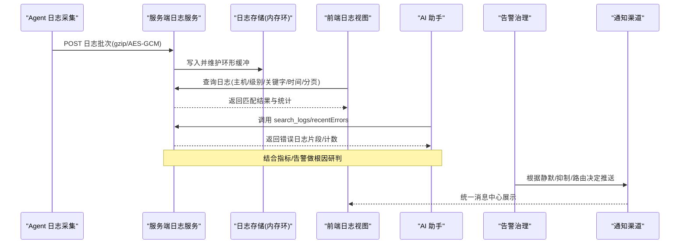
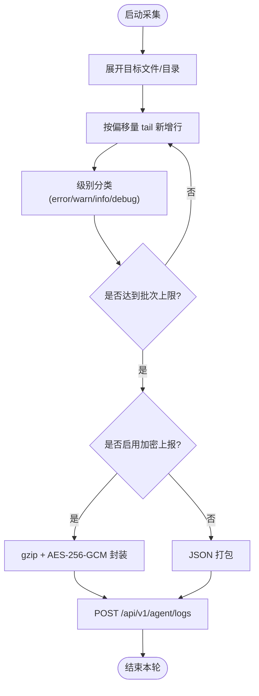
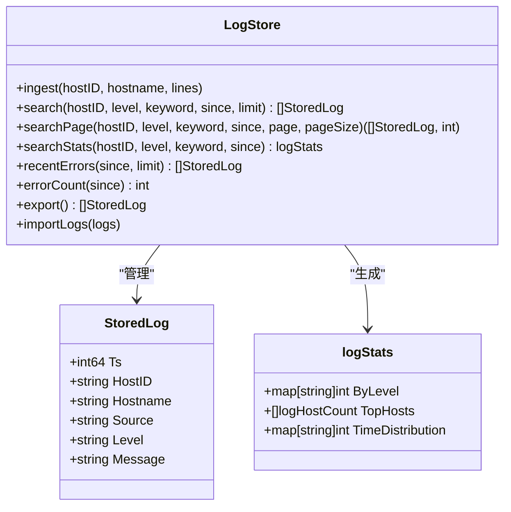
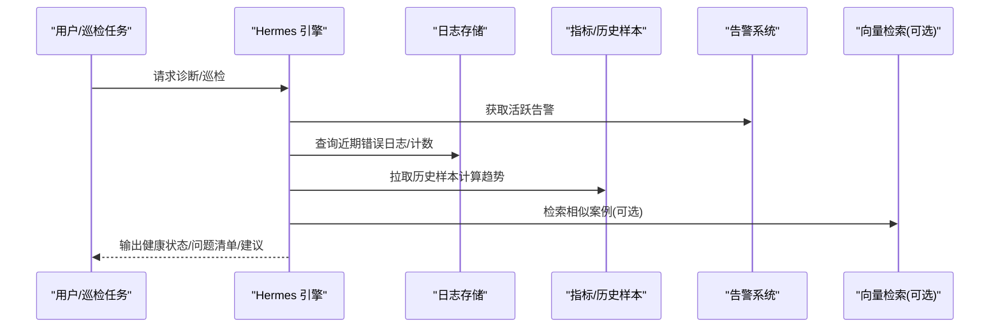
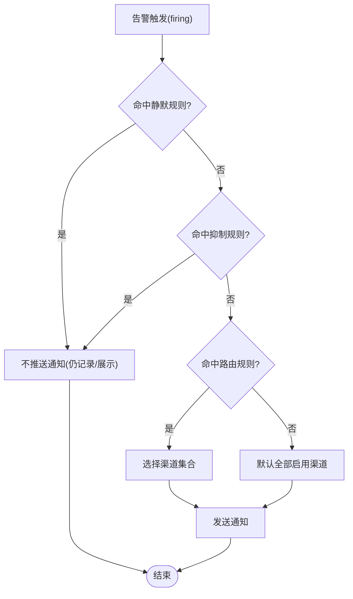
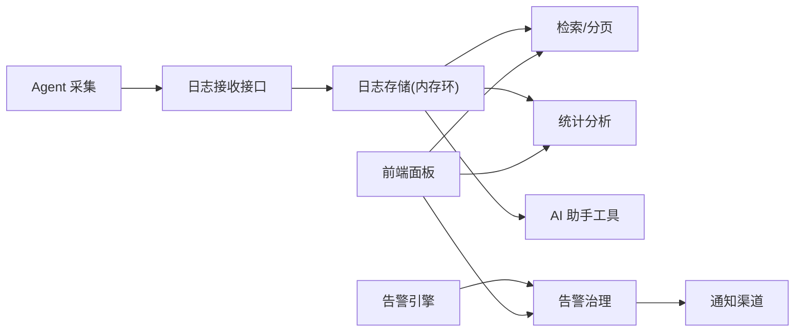

# 日志分析

<cite>
**本文引用的文件**   
- [README.md](file://README.md)
- [logstore.go](file://cmd/server/logstore.go)
- [logcollect.go](file://cmd/agent/logcollect.go)
- [hermes.go](file://cmd/server/hermes.go)
- [hermes_suggest.go](file://cmd/server/hermes_suggest.go)
- [alertgov.go](file://cmd/server/alertgov.go)
- [index.html](file://cmd/server/web/index.html)
- [i18n-dashboard.js](file://cmd/server/web/i18n-dashboard.js)
- [settings.js](file://cmd/server/web/js/settings.js)
</cite>

## 目录
1. [简介](#简介)
2. [项目结构](#项目结构)
3. [核心组件](#核心组件)
4. [架构总览](#架构总览)
5. [详细组件分析](#详细组件分析)
6. [依赖关系分析](#依赖关系分析)
7. [性能与可扩展性](#性能与可扩展性)
8. [故障排查指南](#故障排查指南)
9. [结论](#结论)
10. [附录：配置与最佳实践](#附录配置与最佳实践)

## 简介
本章节聚焦 AIOps Monitor 的“日志分析”能力，覆盖从采集、存储、检索到统计分析与 AI 增强的全链路。重点包括：
- 异常检测与错误模式识别：基于级别归一化、关键词过滤、时间窗口聚合与错误计数，为告警与诊断提供上下文。
- 根因分析技术：结合指标趋势、活跃告警与错误日志，通过内置启发式与可插拔 LLM（可选）进行事件研判与相似案例检索。
- 自动告警触发机制：阈值告警、异常波动检测、趋势预测等策略在通知下发前经治理层（静默/抑制/路由）决策。
- 日志统计分析：错误趋势、热点主机、时间分布、分页检索与导出。
- 自定义分析规则：告警阈值、治理规则、通知渠道与模板的可配置方法。
- 实际案例与最佳实践：面向生产环境的部署与调优建议。

## 项目结构
围绕日志分析的关键路径由 Agent 侧采集与服务端侧存储/检索/分析组成，并与 AI 助手、告警治理、前端面板联动。

图表来源
- [logcollect.go:1-231](file://cmd/agent/logcollect.go#L1-L231)
- [logstore.go:1-318](file://cmd/server/logstore.go#L1-L318)
- [hermes.go:1-800](file://cmd/server/hermes.go#L1-L800)
- [alertgov.go:1-226](file://cmd/server/alertgov.go#L1-L226)
- [index.html:375-552](file://cmd/server/web/index.html#L375-L552)
- [i18n-dashboard.js:503-532](file://cmd/server/web/i18n-dashboard.js#L503-L532)

章节来源
- [README.md:157-176](file://README.md#L157-L176)
- [logcollect.go:1-231](file://cmd/agent/logcollect.go#L1-L231)
- [logstore.go:1-318](file://cmd/server/logstore.go#L1-L318)
- [hermes.go:1-800](file://cmd/server/hermes.go#L1-L800)
- [alertgov.go:1-226](file://cmd/server/alertgov.go#L1-L226)
- [index.html:375-552](file://cmd/server/web/index.html#L375-L552)
- [i18n-dashboard.js:503-532](file://cmd/server/web/i18n-dashboard.js#L503-L532)

## 核心组件
- Agent 日志采集器
  - 支持单文件或目录扫描，自动发现新日志文件；仅追加读取，避免历史风暴。
  - 级别分类：基于常见关键字将行归类为 error/warn/info/debug。
  - 批量打包后 gzip 压缩并可选 AES-256-GCM 加密上报。
- 服务端日志存储与检索
  - 内存环形缓冲，容量上限控制；重启后可从持久化尾段恢复。
  - 全文检索：按主机、级别、关键字、时间范围过滤，支持分页与总数统计。
  - 统计分析：级别分布、Top 主机、近 1h/6h/24h 时间分布。
- AI 助手与诊断
  - 暴露 search_logs、recentErrors 等工具，结合指标与告警进行根因研判。
  - 未启用 LLM 时采用启发式兜底，仍可产出结构化诊断摘要。
- 告警治理与通知
  - 静默（时段/星期）、抑制（主因抑衍生）、路由（按级别/主机/类型分流）。
  - 恢复通知不受静默影响，确保故障解除可知。

章节来源
- [logcollect.go:1-231](file://cmd/agent/logcollect.go#L1-L231)
- [logstore.go:1-318](file://cmd/server/logstore.go#L1-L318)
- [hermes.go:1-800](file://cmd/server/hermes.go#L1-L800)
- [alertgov.go:1-226](file://cmd/server/alertgov.go#L1-L226)

## 架构总览
日志分析端到端流程如下：

图表来源
- [logcollect.go:1-231](file://cmd/agent/logcollect.go#L1-L231)
- [logstore.go:1-318](file://cmd/server/logstore.go#L1-L318)
- [hermes.go:1-800](file://cmd/server/hermes.go#L1-L800)
- [alertgov.go:1-226](file://cmd/server/alertgov.go#L1-L226)

## 详细组件分析

### 组件A：Agent 日志采集与上报
- 功能要点
  - 目标展开：支持文件与目录，目录内按后缀与轮转命名规则识别日志文件。
  - 增量采集：记录偏移量，检测轮转/截断，限制单次最大读取大小。
  - 级别分类：基于关键字快速判定 error/warn/info/debug。
  - 安全上报：gzip 压缩 + AES-256-GCM 加密（可选），附带指纹头用于鉴权。
- 关键实现位置
  - 采集循环与批处理、级别分类、加密封装与 HTTP 上报。

图表来源
- [logcollect.go:1-231](file://cmd/agent/logcollect.go#L1-L231)

章节来源
- [logcollect.go:1-231](file://cmd/agent/logcollect.go#L1-L231)

### 组件B：服务端日志存储、检索与统计
- 数据结构
  - 存储条目包含时间戳、主机标识、主机名、来源、级别、消息体。
  - 内存环形缓冲，容量上限控制；持久化只保留最近一段以加速重启恢复。
- 检索与分页
  - 支持主机、级别、关键字、时间范围过滤；返回最新优先，支持分页与总数。
- 统计分析
  - 级别分布、Top 主机、近 1h/6h/24h 时间分布；统计口径对列表过滤独立。
- 关键实现位置
  - 入队、搜索、分页、统计、错误计数与导出/导入。

图表来源
- [logstore.go:1-318](file://cmd/server/logstore.go#L1-L318)

章节来源
- [logstore.go:1-318](file://cmd/server/logstore.go#L1-L318)

### 组件C：AI 增强的日志分析与根因研判
- 能力概览
  - 工具链：search_logs、recentErrors、list_alerts、check_host_health、list_recent_changes 等。
  - 输入上下文：当前指标、活跃告警、错误日志片段、历史相似案例（RAG，可选）。
  - 输出：健康分级、问题清单、趋势方向、处置建议；未启用 LLM 时走启发式兜底。
- 关键实现位置
  - 工具注册与执行、健康评估逻辑、错误日志聚合、趋势计算。

图表来源
- [hermes.go:1-800](file://cmd/server/hermes.go#L1-L800)
- [hermes_suggest.go:41-73](file://cmd/server/hermes_suggest.go#L41-L73)
- [logstore.go:256-284](file://cmd/server/logstore.go#L256-L284)

章节来源
- [hermes.go:1-800](file://cmd/server/hermes.go#L1-L800)
- [hermes_suggest.go:41-73](file://cmd/server/hermes_suggest.go#L41-L73)
- [logstore.go:256-284](file://cmd/server/logstore.go#L256-L284)

### 组件D：自动告警触发与治理
- 触发机制
  - 阈值告警：CPU/内存/磁盘/负载/GPU/拨测/API/转发等多维度 warn/crit 阈值。
  - 异常波动与趋势：结合指标变化与错误日志计数辅助判断。
- 治理四件套
  - 静默：按主机/类型/级别匹配，支持时段与星期。
  - 抑制：主因告警活跃时抑制衍生告警（如主机离线抑制其资源告警）。
  - 路由：按匹配分流至指定渠道，支持继续匹配后续规则。
  - 恢复通知一律照发。
- 关键实现位置
  - 匹配条件、时段解析、抑制与路由决策、配置存取。

图表来源
- [alertgov.go:1-226](file://cmd/server/alertgov.go#L1-L226)

章节来源
- [alertgov.go:1-226](file://cmd/server/alertgov.go#L1-L226)
- [README.md:721-754](file://README.md#L721-L754)

### 组件E：前端日志视图与交互
- 功能要点
  - 日志视图：支持按级别筛选、时间范围、分页、导出 CSV。
  - 阈值与治理配置：阈值 Tab 与治理页面（静默/抑制/路由）集中管理。
- 关键实现位置
  - 界面文案与筛选控件、阈值加载/保存逻辑。

章节来源
- [i18n-dashboard.js:503-532](file://cmd/server/web/i18n-dashboard.js#L503-L532)
- [index.html:375-552](file://cmd/server/web/index.html#L375-L552)
- [settings.js:95-112](file://cmd/server/web/js/settings.js#L95-L112)

## 依赖关系分析
- 组件耦合
  - Agent 采集器依赖文件系统与网络客户端，向服务端日志接口提交数据。
  - 服务端日志存储被检索 API、统计模块与 AI 助手共同消费。
  - 告警治理位于通知下发前，依赖活跃告警集与配置。
- 外部依赖
  - PostgreSQL（关系数据）、VictoriaMetrics（时序数据）支撑指标与事件持久化。
  - 可选 pgvector 与 LLM 提供商用于 RAG 与智能体增强。
- 潜在风险
  - 内存日志缓冲受容量限制，需关注峰值吞吐与持久化频率。
  - 加密上报依赖密钥分发与一致性，需保障注册阶段下发的 log_key 正确。

图表来源
- [logcollect.go:1-231](file://cmd/agent/logcollect.go#L1-L231)
- [logstore.go:1-318](file://cmd/server/logstore.go#L1-L318)
- [hermes.go:1-800](file://cmd/server/hermes.go#L1-L800)
- [alertgov.go:1-226](file://cmd/server/alertgov.go#L1-L226)

章节来源
- [logcollect.go:1-231](file://cmd/agent/logcollect.go#L1-L231)
- [logstore.go:1-318](file://cmd/server/logstore.go#L1-L318)
- [hermes.go:1-800](file://cmd/server/hermes.go#L1-L800)
- [alertgov.go:1-226](file://cmd/server/alertgov.go#L1-L226)

## 性能与可扩展性
- 采集端
  - 批量合并与限流：每批最多固定行数，避免瞬时风暴。
  - 大文件回退保护：单次读取上限，防止长尾放大。
- 服务端
  - 内存环形缓冲：容量上限与持久化尾段，兼顾检索性能与重启恢复。
  - 统计与检索：两次遍历优化（先计数再分页），避免全表扫描开销。
- 扩展点
  - 插件动作与外部数据源接入，便于扩展日志关联分析。
  - 向量化模型解耦，嵌入端点与维度可配，适配不同厂商与成本模型。

[本节为通用指导，无需特定文件引用]

## 故障排查指南
- 日志未上报
  - 检查 Agent 日志采集开关与路径配置；确认目录扫描周期与新文件发现。
  - 校验加密上报开关与密钥下发；必要时临时关闭加密定位问题。
- 检索无结果
  - 确认时间范围与级别过滤；注意统计口径与列表过滤的差异。
  - 检查关键字大小写与空格；使用分页查看总数是否过大。
- 告警风暴
  - 启用抑制规则（如主机离线抑制其资源告警）；设置夜间静默时段。
  - 调整阈值三档预设或细粒度阈值，减少误报。
- AI 诊断不可用
  - 确认 AI 配置与向量化模型连通性；未启用 LLM 时仍可使用启发式兜底。

章节来源
- [logcollect.go:1-231](file://cmd/agent/logcollect.go#L1-L231)
- [logstore.go:1-318](file://cmd/server/logstore.go#L1-L318)
- [alertgov.go:1-226](file://cmd/server/alertgov.go#L1-L226)
- [hermes.go:1-800](file://cmd/server/hermes.go#L1-L800)

## 结论
AIOps Monitor 的日志分析体系以“轻量采集 + 高效检索 + 统计洞察 + AI 增强”为核心，配合告警治理与多通道通知，形成从数据采集到问题定位与处置的闭环。通过可配置的阈值与治理规则，以及可选的 LLM/RAG 能力，可在保证稳定性的同时持续提升排障效率与准确性。

[本节为总结，无需特定文件引用]

## 附录：配置与最佳实践
- 日志采集配置
  - 在 Agent 配置中设置日志路径（文件或目录），按需开启加密上报。
  - 定期观察采集延迟与批次大小，避免遗漏与拥塞。
- 阈值与治理
  - 使用三档预设起步，逐步细化到 27 组 warn/crit 阈值。
  - 配置静默（夜间）、抑制（主因抑衍生）、路由（按级别/主机分流）。
- AI 与 RAG
  - 配置向量化模型端点与维度，完成连通性自检。
  - 未启用 LLM 时，利用启发式诊断与错误日志计数进行初步研判。
- 前端操作
  - 在日志视图使用级别/时间/关键字组合筛选，结合 Top 主机与时间分布定位热点。
  - 在阈值与治理页面集中管理规则，保存后立即生效。

章节来源
- [README.md:436-576](file://README.md#L436-L576)
- [README.md:721-754](file://README.md#L721-L754)
- [settings.js:95-112](file://cmd/server/web/js/settings.js#L95-L112)
- [index.html:375-552](file://cmd/server/web/index.html#L375-L552)
- [hermes.go:1-800](file://cmd/server/hermes.go#L1-L800)