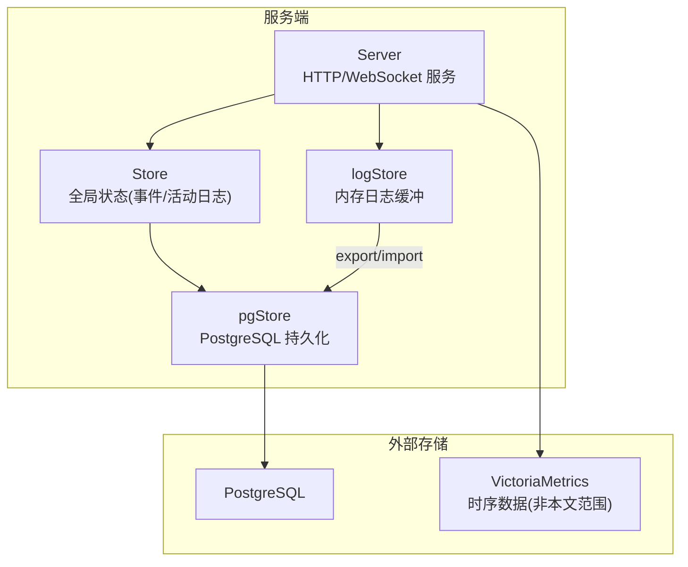
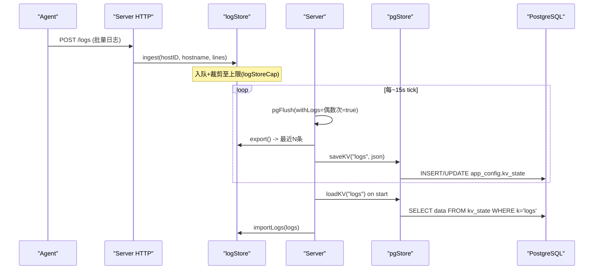
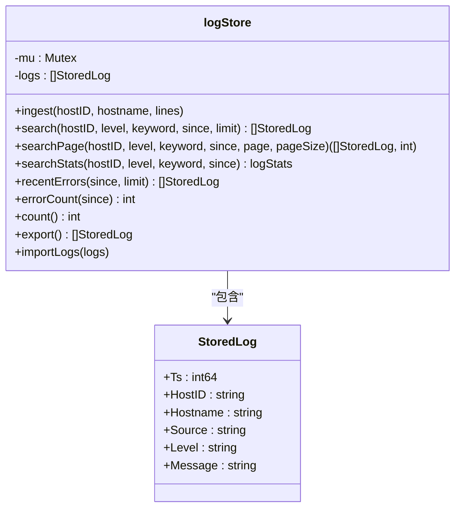
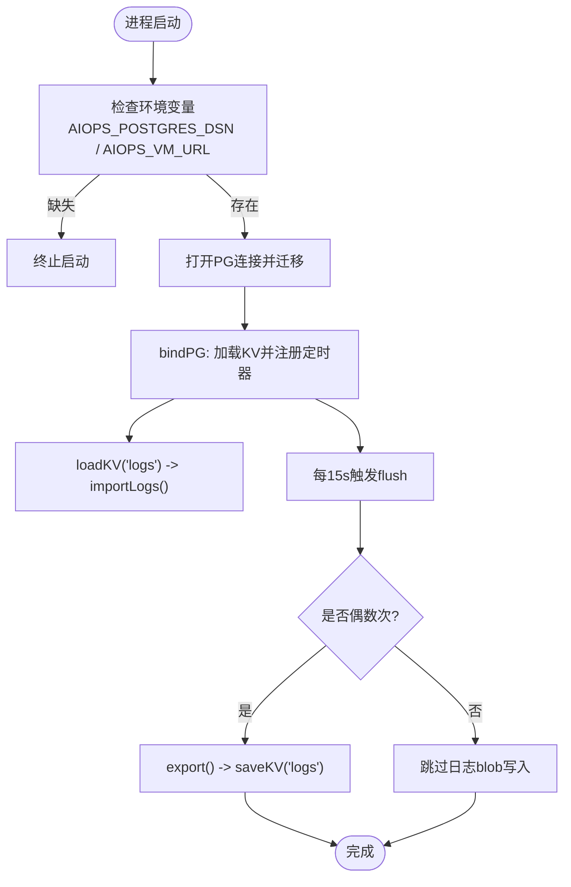
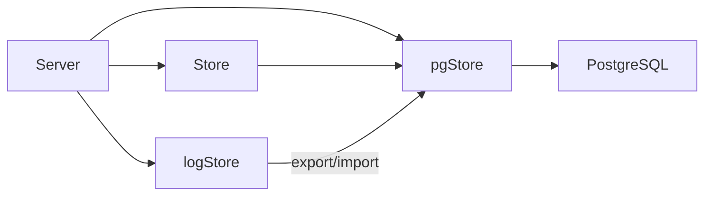

# 日志存储

<cite>
**本文引用的文件**
- [cmd/server/logstore.go](file://cmd/server/logstore.go)
- [cmd/server/pgstore.go](file://cmd/server/pgstore.go)
- [cmd/server/store.go](file://cmd/server/store.go)
- [cmd/server/main.go](file://cmd/server/main.go)
- [cmd/server/handlers.go](file://cmd/server/handlers.go)
- [cmd/server/terminal.go](file://cmd/server/terminal.go)
</cite>

## 目录
1. [简介](#简介)
2. [项目结构](#项目结构)
3. [核心组件](#核心组件)
4. [架构总览](#架构总览)
5. [详细组件分析](#详细组件分析)
6. [依赖关系分析](#依赖关系分析)
7. [性能考虑](#性能考虑)
8. [故障排查指南](#故障排查指南)
9. [结论](#结论)
10. [附录](#附录)

## 简介
本文件面向 AIOps Monitor 的“日志存储系统”，围绕以下目标展开：
- 内存存储层设计：环形缓冲区实现、并发安全机制、内存占用控制
- 持久化策略：PostgreSQL 表结构设计、数据压缩与归档思路、备份恢复方案
- 生命周期管理：保留策略、清理机制、备份恢复流程
- 性能优化：索引设计、查询优化、内存调优参数
- 容量规划建议与故障恢复流程

说明：
- 日志采集为高吞吐、易失性数据，默认仅驻留内存；通过周期性快照落库以支持重启后快速恢复最近窗口。
- 时序指标统一写入 VictoriaMetrics（不在本文范围），但日志与审计等关系型数据统一落 PostgreSQL。

## 项目结构
与日志存储直接相关的后端代码位于 server 模块中，关键文件如下：
- logstore.go：内存日志缓冲、检索、统计、导出/导入接口
- pgstore.go：PostgreSQL 迁移、KV 持久化、向量记忆、定时 flush 逻辑
- store.go：全局 Store 绑定 PG、事件/活动日志异步写 PG
- main.go：启动时强制要求配置 PG 与 VM，并初始化 bindPG 周期任务
- handlers.go：Server 结构体持有 pgStore 引用，支撑 AI 记忆异步写入通道
- terminal.go：终端录制元数据持久化到 PG（与日志体系协同）

图表来源
- [cmd/server/logstore.go:1-318](file://cmd/server/logstore.go#L1-L318)
- [cmd/server/pgstore.go:1112-1232](file://cmd/server/pgstore.go#L1112-L1232)
- [cmd/server/store.go:106-146](file://cmd/server/store.go#L106-L146)
- [cmd/server/main.go:251-292](file://cmd/server/main.go#L251-L292)

章节来源
- [cmd/server/logstore.go:1-318](file://cmd/server/logstore.go#L1-L318)
- [cmd/server/pgstore.go:1112-1232](file://cmd/server/pgstore.go#L1112-L1232)
- [cmd/server/store.go:106-146](file://cmd/server/store.go#L106-L146)
- [cmd/server/main.go:251-292](file://cmd/server/main.go#L251-L292)

## 核心组件
- 内存日志缓冲（logStore）
  - 固定上限切片实现“类环形”缓冲，超过上限自动丢弃最旧条目
  - 单锁保护读写，提供搜索、分页、统计、错误计数、导出/导入
- 持久化桥接（pgStore + Server.bindPG）
  - 启动加载 KV 中的 logs 快照到内存
  - 每约 30 秒将最近 N 条日志作为 JSON 快照写入 PG 的 KV 表
- 全局 Store 集成
  - 事件与活动日志在内存环的同时异步追加到 PG 审计/事件表
- 启动约束
  - 未配置 PG DSN 或 VM URL 时拒绝启动，确保无本地静默落盘

章节来源
- [cmd/server/logstore.go:31-78](file://cmd/server/logstore.go#L31-L78)
- [cmd/server/logstore.go:292-318](file://cmd/server/logstore.go#L292-L318)
- [cmd/server/pgstore.go:1162-1185](file://cmd/server/pgstore.go#L1162-L1185)
- [cmd/server/store.go:687-700](file://cmd/server/store.go#L687-L700)
- [cmd/server/main.go:251-272](file://cmd/server/main.go#L251-L272)

## 架构总览
日志从 Agent 上报至 Server，进入内存缓冲；同时 UI/AI 可检索。周期性将最近窗口导出为 JSON 快照存入 PG 的 KV 表，用于重启恢复。

图表来源
- [cmd/server/logstore.go:59-78](file://cmd/server/logstore.go#L59-L78)
- [cmd/server/logstore.go:292-318](file://cmd/server/logstore.go#L292-L318)
- [cmd/server/pgstore.go:1176-1185](file://cmd/server/pgstore.go#L1176-L1185)
- [cmd/server/pgstore.go:1190-1232](file://cmd/server/pgstore.go#L1190-L1232)

## 详细组件分析

### 内存存储层：logStore
- 数据结构与容量
  - 使用 []StoredLog 切片承载日志，最大长度由常量控制
  - 消息体超长截断，避免单行过大导致内存膨胀
- 并发安全
  - 所有读/写路径均加互斥锁，保证线程安全
- 搜索与分页
  - 按 hostID/level/keyword/since 过滤，倒序扫描满足“最新优先”
  - 分页采用两遍扫描：先计数再取页，限制 pageSize 上限
- 统计能力
  - 级别分布、Top 主机、时间分布（1h/6h/24h）
- 导出/导入
  - export 返回最近 N 条（logPersistCap）供持久化
  - import 启动时从 PG 恢复，再次受 logStoreCap 上限保护

图表来源
- [cmd/server/logstore.go:21-41](file://cmd/server/logstore.go#L21-L41)
- [cmd/server/logstore.go:59-166](file://cmd/server/logstore.go#L59-L166)
- [cmd/server/logstore.go:181-254](file://cmd/server/logstore.go#L181-L254)
- [cmd/server/logstore.go:292-318](file://cmd/server/logstore.go#L292-L318)

章节来源
- [cmd/server/logstore.go:31-78](file://cmd/server/logstore.go#L31-L78)
- [cmd/server/logstore.go:80-166](file://cmd/server/logstore.go#L80-L166)
- [cmd/server/logstore.go:181-254](file://cmd/server/logstore.go#L181-L254)
- [cmd/server/logstore.go:292-318](file://cmd/server/logstore.go#L292-L318)

### 持久化存储层：PostgreSQL
- 启动与连接
  - 必须配置 AIOPS_POSTGRES_DSN，否则拒绝启动
  - 连接池大小、空闲连接数、连接生命周期有明确设置
- 迁移与表结构
  - 使用 JSONB 存储复杂对象，减少列级迁移成本
  - 为高频查询字段建立索引（如时间戳、状态、kind 等）
- KV 表用于日志快照
  - 键名 "logs" 对应内存日志最近窗口的 JSON 序列化
  - 启动时读取该键并调用 importLogs 恢复内存缓冲
- 定期 flush
  - 每 15 秒一次，偶数次才写入大 blob（logs），降低 WAL 压力
  - 其他小 KV（会话、告警状态、AI 巡检报告等）每次写入

图表来源
- [cmd/server/main.go:251-272](file://cmd/server/main.go#L251-L272)
- [cmd/server/pgstore.go:1112-1185](file://cmd/server/pgstore.go#L1112-L1185)
- [cmd/server/pgstore.go:1190-1232](file://cmd/server/pgstore.go#L1190-L1232)

章节来源
- [cmd/server/main.go:251-272](file://cmd/server/main.go#L251-L272)
- [cmd/server/pgstore.go:1112-1185](file://cmd/server/pgstore.go#L1112-L1185)
- [cmd/server/pgstore.go:1190-1232](file://cmd/server/pgstore.go#L1190-L1232)

### 关联组件：全局 Store 与事件/活动日志
- Store.BindPG 会加载近期活动日志、插件事件、主机元数据、告警历史等
- 新增活动日志/插件事件时，若已绑定 PG，则异步追加到 PG 审计/事件表
- 这些内容虽非“业务日志”，但与日志检索和审计密切相关

章节来源
- [cmd/server/store.go:106-146](file://cmd/server/store.go#L106-L146)
- [cmd/server/store.go:687-700](file://cmd/server/store.go#L687-L700)
- [cmd/server/store.go:330-338](file://cmd/server/store.go#L330-L338)

### 关联组件：终端录制与日志体系的协同
- 终端录制的元数据永久留存 PG，内容存本地文件，避免大 blob 撑爆数据库
- 录制结束时会提取输出摘要，作为 AI 记忆入库，便于跨会话 RAG 检索

章节来源
- [cmd/server/terminal.go:130-169](file://cmd/server/terminal.go#L130-L169)
- [cmd/server/terminal.go:330-369](file://cmd/server/terminal.go#L330-L369)
- [cmd/server/pgstore.go:119-151](file://cmd/server/pgstore.go#L119-L151)

## 依赖关系分析
- 组件耦合
  - Server 持有 pgStore 指针，负责调度 flush 与启动恢复
  - logStore 独立于 PG，仅在导出/导入时与 PG 交互
  - Store 在事件/活动日志路径上异步写 PG，不阻塞主路径
- 外部依赖
  - PostgreSQL：关系型数据与 KV 快照
  - VictoriaMetrics：时序数据（不在本文范围）

图表来源
- [cmd/server/main.go:274-292](file://cmd/server/main.go#L274-L292)
- [cmd/server/store.go:106-146](file://cmd/server/store.go#L106-L146)
- [cmd/server/logstore.go:292-318](file://cmd/server/logstore.go#L292-L318)
- [cmd/server/pgstore.go:1112-1185](file://cmd/server/pgstore.go#L1112-L1185)

章节来源
- [cmd/server/main.go:274-292](file://cmd/server/main.go#L274-L292)
- [cmd/server/store.go:106-146](file://cmd/server/store.go#L106-L146)
- [cmd/server/logstore.go:292-318](file://cmd/server/logstore.go#L292-L318)
- [cmd/server/pgstore.go:1112-1185](file://cmd/server/pgstore.go#L1112-L1185)

## 性能考虑
- 内存与并发
  - 日志写入路径加锁，批量 ingests 减少锁竞争次数
  - 消息体截断防止单行过大；分页与 limit 限制避免一次性返回过多
- 持久化频率与体积
  - 日志快照每 30 秒（偶数次 tick）写入一次，降低 WAL 压力
  - 仅持久化最近 N 条，避免大 blob 频繁更新
- 索引与查询
  - 对时间序列、状态、kind 等常用过滤字段建索引
  - 日志检索在内存中进行，无需数据库索引
- 连接池与超时
  - 连接池大小、空闲连接、最大生命周期合理配置，避免资源耗尽

[本节为通用指导，不直接分析具体文件]

## 故障排查指南
- 启动失败
  - 未配置 AIOPS_POSTGRES_DSN 或 AIOPS_VM_URL 会导致启动中止
- 日志丢失
  - 重启后仅恢复最近窗口（logPersistCap），更早日志不可用
- 写入缓慢
  - 检查 PG 连接池与 WAL 压力；确认 flush 频率与日志量
- 检索卡顿
  - 关注 pageSize 与 keyword 匹配范围；避免超大结果集

章节来源
- [cmd/server/main.go:251-272](file://cmd/server/main.go#L251-L272)
- [cmd/server/logstore.go:292-318](file://cmd/server/logstore.go#L292-L318)
- [cmd/server/pgstore.go:1176-1185](file://cmd/server/pgstore.go#L1176-L1185)

## 结论
AIOps Monitor 的日志存储采用“内存为主、轻量持久为辅”的设计：
- 内存层提供低延迟检索与统计，具备严格的容量与并发控制
- 持久层通过 KV 快照与 PG 索引保障重启恢复与审计可追溯
- 结合合理的 flush 频率与限流策略，兼顾性能与可靠性

[本节为总结，不直接分析具体文件]

## 附录

### 内存存储层设计要点
- 环形缓冲实现
  - 使用固定上限切片，超出上限时丢弃最旧元素，近似环形行为
- 并发安全
  - 全路径互斥锁保护，避免竞态
- 内存占用控制
  - 日志条数上限、消息体长度截断、分页上限

章节来源
- [cmd/server/logstore.go:31-78](file://cmd/server/logstore.go#L31-L78)
- [cmd/server/logstore.go:80-166](file://cmd/server/logstore.go#L80-L166)

### 持久化存储策略
- PostgreSQL 表结构与索引
  - 使用 JSONB 存储复杂对象，减少列级迁移
  - 针对 ts/status/kind 等字段建立索引
- 数据压缩与归档
  - 当前以 JSON 快照形式落库；如需进一步压缩，可在应用层进行 gzip 后再写入 KV
  - 归档可通过外部工具对 PG 进行分区/冷热分层
- 备份恢复
  - 使用 pg_dump 对数据库整体备份；恢复后启动即可自动加载 KV 快照

章节来源
- [cmd/server/pgstore.go:77-212](file://cmd/server/pgstore.go#L77-L212)
- [cmd/server/pgstore.go:1190-1232](file://cmd/server/pgstore.go#L1190-L1232)

### 日志生命周期管理
- 数据保留策略
  - 内存保留最近 logStoreCap 条；持久化仅保留最近 logPersistCap 条
- 清理机制
  - 内存层自动裁剪；持久层可通过外部任务清理过期 KV 或归档
- 备份恢复方案
  - 启动时从 KV 恢复最近窗口；完整恢复需依赖数据库备份

章节来源
- [cmd/server/logstore.go:31-36](file://cmd/server/logstore.go#L31-L36)
- [cmd/server/logstore.go:292-318](file://cmd/server/logstore.go#L292-L318)
- [cmd/server/pgstore.go:1162-1185](file://cmd/server/pgstore.go#L1162-L1185)

### 存储性能优化指南
- 索引设计
  - 为时间戳、状态、kind 等高频过滤字段建立索引
- 查询优化
  - 限制 pageSize/limit；避免全表扫描
- 内存调优参数
  - 调整 logStoreCap/logPersistCap 以适应不同负载
  - 调整 PG 连接池与 WAL 相关参数

[本节为通用指导，不直接分析具体文件]

### 存储容量规划建议
- 内存容量
  - 估算单条日志平均大小 × logStoreCap，预留 GC 空间
- 磁盘容量
  - 评估 KV 快照大小与保留天数，结合 PG 表空间与 WAL 增长
- 网络与 I/O
  - 控制 flush 频率与单次写入体积，避免峰值抖动

[本节为通用指导，不直接分析具体文件]

### 故障恢复流程
- 单节点恢复
  - 恢复 PG 备份 → 启动服务 → 自动加载 KV 快照 → 内存缓冲逐步累积
- 多副本/集群
  - 确保 PG 高可用；必要时引入只读副本分担检索压力

[本节为通用指导，不直接分析具体文件]