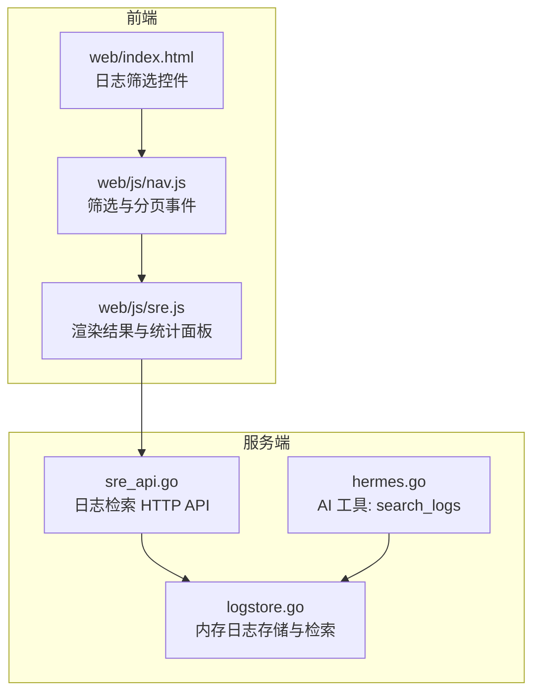
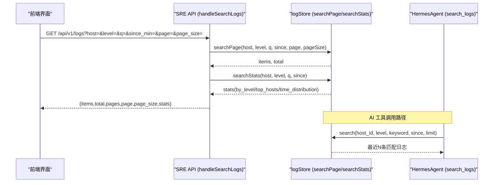
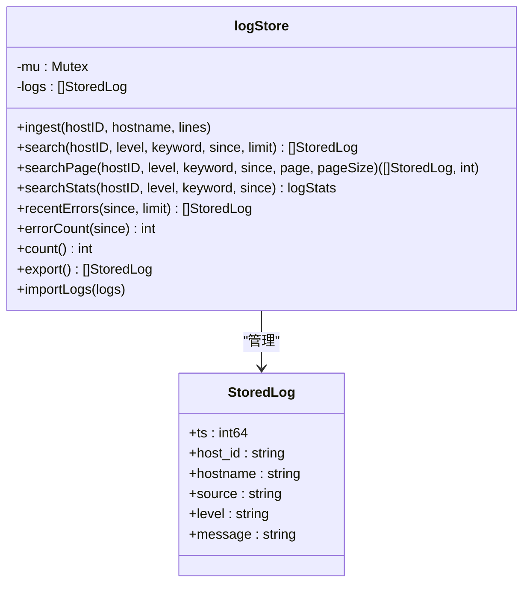
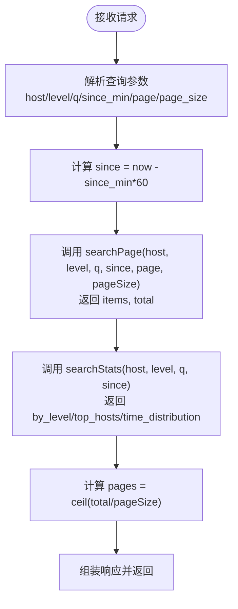
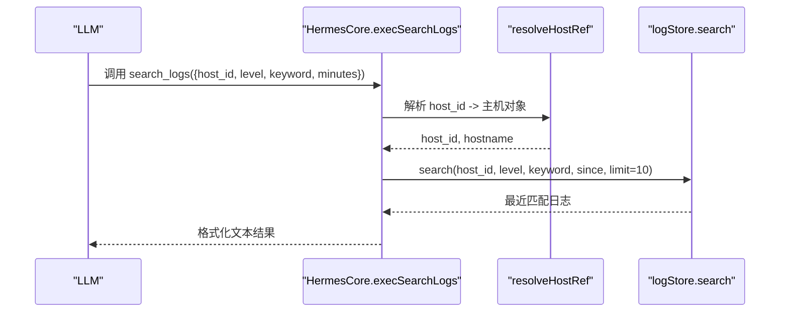
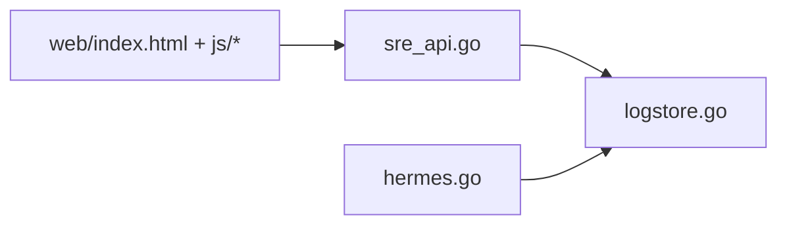

# 日志检索

<cite>
**本文引用的文件**   
- [logstore.go](file://cmd/server/logstore.go)
- [sre_api.go](file://cmd/server/sre_api.go)
- [hermes.go](file://cmd/server/hermes.go)
- [logstore_test.go](file://cmd/server/logstore_test.go)
- [index.html](file://cmd/server/web/index.html)
- [nav.js](file://cmd/server/web/js/nav.js)
- [sre.js](file://cmd/server/web/js/sre.js)
</cite>

## 目录
1. [简介](#简介)
2. [项目结构](#项目结构)
3. [核心组件](#核心组件)
4. [架构总览](#架构总览)
5. [详细组件分析](#详细组件分析)
6. [依赖关系分析](#依赖关系分析)
7. [性能与优化](#性能与优化)
8. [故障排查指南](#故障排查指南)
9. [结论](#结论)
10. [附录：查询语法与示例](#附录查询语法与示例)

## 简介
本文件面向 AIOps Monitor 的“日志检索”能力，聚焦服务端内存日志存储与检索实现、HTTP API 接口、前端交互以及 AI Agent 工具调用链路。文档覆盖以下要点：
- 全文检索引擎的实现原理（关键词匹配、时间过滤、级别过滤、主机过滤）
- 查询语法规范（字段过滤、时间范围、级别筛选、分页）
- 搜索结果排序与统计（按时间分布、主机分布、级别分布）
- 查询性能优化技巧（索引使用、查询限制、缓存策略）
- 常用查询模式示例与调试方法

说明：当前实现为内存环形缓冲 + 顺序扫描的轻量级全文检索，未引入外部搜索引擎或正则表达式支持；模糊搜索以大小写不敏感子串匹配为主。

## 项目结构
日志检索相关代码主要分布在服务端模块中，包含数据存储、API 路由、AI 工具集成与前端页面/脚本。

图表来源
- [logstore.go:38-41](file://cmd/server/logstore.go#L38-L41)
- [sre_api.go:740-775](file://cmd/server/sre_api.go#L740-L775)
- [hermes.go:84-98](file://cmd/server/hermes.go#L84-L98)
- [index.html:408-427](file://cmd/server/web/index.html#L408-L427)
- [nav.js:461-482](file://cmd/server/web/js/nav.js#L461-L482)
- [sre.js:973-1126](file://cmd/server/web/js/sre.js#L973-L1126)

章节来源
- [logstore.go:1-318](file://cmd/server/logstore.go#L1-L318)
- [sre_api.go:740-775](file://cmd/server/sre_api.go#L740-L775)
- [hermes.go:84-98](file://cmd/server/hermes.go#L84-L98)
- [index.html:408-427](file://cmd/server/web/index.html#L408-L427)
- [nav.js:461-482](file://cmd/server/web/js/nav.js#L461-L482)
- [sre.js:973-1126](file://cmd/server/web/js/sre.js#L973-L1126)

## 核心组件
- 内存日志存储与检索（logStore）
  - 数据结构：StoredLog（时间戳、主机ID、主机名、来源、级别、消息）
  - 容量控制：最大保留最近 N 条（环形裁剪），持久化仅导出尾部若干条用于重启恢复
  - 检索能力：按 host_id、level、keyword、since 过滤；返回 newest-first；支持分页与统计
- HTTP 日志检索接口（handleSearchLogs）
  - 参数：host、level、q（关键字）、since_min、page、page_size
  - 响应：items、total、pages、page、page_size、stats（by_level、top_hosts、time_distribution）
- AI 工具集成（HermesTool.search_logs）
  - 通过 Function Calling 暴露 search_logs 工具，供 AI Agent 调用，内部复用 logStore.search

章节来源
- [logstore.go:22-29](file://cmd/server/logstore.go#L22-L29)
- [logstore.go:80-166](file://cmd/server/logstore.go#L80-L166)
- [sre_api.go:740-775](file://cmd/server/sre_api.go#L740-L775)
- [hermes.go:84-98](file://cmd/server/hermes.go#L84-L98)

## 架构总览
从前端到后端的日志检索流程如下：

图表来源
- [sre_api.go:740-775](file://cmd/server/sre_api.go#L740-L775)
- [logstore.go:107-166](file://cmd/server/logstore.go#L107-L166)
- [logstore.go:181-254](file://cmd/server/logstore.go#L181-L254)
- [hermes.go:332-359](file://cmd/server/hermes.go#L332-L359)

## 详细组件分析

### 内存日志存储与检索（logStore）
- 数据模型
  - StoredLog：包含 ts、host_id、hostname、source、level、message
  - 级别归一化：将多种拼写统一为 error/warn/info/debug
- 写入与容量
  - ingest：批量写入，消息长度截断上限，超过容量时裁剪为最新 N 条
  - export/import：周期性导出尾部若干条至持久化存储，启动时导入恢复
- 检索算法
  - search：顺序扫描，按 host_id、level、since、keyword 过滤，返回 newest-first，最多 limit 条
  - searchPage：两遍扫描，第一遍计数 total，第二遍跳过 offset 取 pageSize
  - searchStats：在相同过滤条件下聚合 by_level、top_hosts、time_distribution（1h/6h/24h）
- 复杂度与特性
  - 时间复杂度 O(N)，空间复杂度 O(1) 额外空间（不计输入输出）
  - 无索引、无正则、无分词；keyword 为大小写不敏感子串匹配
  - 统计口径：当列表按 level 过滤时，ByLevel 仍展示所有级别的总数（测试用例验证）

图表来源
- [logstore.go:22-29](file://cmd/server/logstore.go#L22-L29)
- [logstore.go:38-41](file://cmd/server/logstore.go#L38-L41)
- [logstore.go:59-78](file://cmd/server/logstore.go#L59-L78)
- [logstore.go:80-166](file://cmd/server/logstore.go#L80-L166)
- [logstore.go:181-254](file://cmd/server/logstore.go#L181-L254)
- [logstore.go:256-318](file://cmd/server/logstore.go#L256-L318)

章节来源
- [logstore.go:1-318](file://cmd/server/logstore.go#L1-L318)
- [logstore_test.go:14-61](file://cmd/server/logstore_test.go#L14-L61)
- [logstore_test.go:140-166](file://cmd/server/logstore_test.go#L140-L166)

### HTTP 日志检索接口（handleSearchLogs）
- 请求参数
  - host：主机 ID（可选）
  - level：级别（可选）
  - q：关键字（可选）
  - since_min：最近 N 分钟（可选）
  - page：页码（默认 1）
  - page_size：每页条数（默认 50，上限 200）
- 响应结构
  - items：当前页日志条目
  - total：匹配总数
  - pages：总页数
  - page/page_size：当前页与每页大小
  - stats：聚合统计（by_level、top_hosts、time_distribution）
- 行为约束
  - 结果按 newest-first 排序
  - 统计 with 过滤条件一致（但 ByLevel 展示全级别总数）

图表来源
- [sre_api.go:740-775](file://cmd/server/sre_api.go#L740-L775)
- [logstore.go:107-166](file://cmd/server/logstore.go#L107-L166)
- [logstore.go:181-254](file://cmd/server/logstore.go#L181-L254)

章节来源
- [sre_api.go:740-775](file://cmd/server/sre_api.go#L740-L775)

### AI 工具集成（HermesTool.search_logs）
- 工具定义
  - name: search_logs
  - 参数：host_id（必填）、level（可选）、keyword（可选）、minutes（可选）
- 执行流程
  - 解析 host_id，若传入为主机名/IP 则尝试解析为真实 host_id
  - 计算 since = now - minutes*60
  - 调用 logStore.search 获取最近 N 条匹配日志
  - 格式化输出（时间、级别、消息摘要）

图表来源
- [hermes.go:84-98](file://cmd/server/hermes.go#L84-L98)
- [hermes.go:332-359](file://cmd/server/hermes.go#L332-L359)
- [logstore.go:80-106](file://cmd/server/logstore.go#L80-L106)

章节来源
- [hermes.go:84-98](file://cmd/server/hermes.go#L84-L98)
- [hermes.go:332-359](file://cmd/server/hermes.go#L332-L359)

### 前端交互与渲染
- 筛选控件
  - 级别筛选：全部/严重/警告/信息
  - 时间范围：全部/最近1小时/最近6小时/最近24小时
  - 分页大小：10/30/50
- 事件处理
  - 级别/时间变化触发重新渲染
  - 分页按钮点击更新 LOG_PAGE 并重新渲染
- 结果与统计面板
  - 显示 by_level 统计、Top 主机柱状图、时间分布
  - 空态提示数据来源与放宽筛选条件的建议

章节来源
- [index.html:408-427](file://cmd/server/web/index.html#L408-L427)
- [nav.js:461-482](file://cmd/server/web/js/nav.js#L461-L482)
- [sre.js:973-1126](file://cmd/server/web/js/sre.js#L973-L1126)

## 依赖关系分析
- 组件耦合
  - sre_api.go 依赖 logstore.go 提供检索与统计
  - hermes.go 依赖 logstore.go 作为 AI 工具的数据源
  - 前端依赖 sre_api.go 提供的 REST 接口
- 外部依赖
  - 无外部搜索引擎依赖，纯内存实现
  - 持久化通过周期性导出/导入（JSON blob）完成，避免 WAL 抖动

图表来源
- [sre_api.go:740-775](file://cmd/server/sre_api.go#L740-L775)
- [hermes.go:332-359](file://cmd/server/hermes.go#L332-L359)
- [logstore.go:107-166](file://cmd/server/logstore.go#L107-L166)

章节来源
- [sre_api.go:740-775](file://cmd/server/sre_api.go#L740-L775)
- [hermes.go:332-359](file://cmd/server/hermes.go#L332-L359)
- [logstore.go:107-166](file://cmd/server/logstore.go#L107-L166)

## 性能与优化
- 查询限制
  - 单次检索 limit/page_size 有上限（例如 2000/200），防止大结果集导致内存与带宽压力
- 时间窗口
  - 使用 since_min 缩小时间范围可显著降低扫描量
- 主机与级别过滤
  - 优先指定 host 与 level，减少无效匹配
- 统计口径
  - 统计与列表过滤一致，但 ByLevel 展示全级别总数，便于全局观察
- 缓存策略
  - 当前实现无查询缓存；可通过前端节流与去抖减少重复请求
- 持久化影响
  - 仅导出尾部若干条，避免频繁写入造成 WAL 抖动

[本节为通用指导，不涉及具体文件分析]

## 故障排查指南
- 常见问题
  - 无匹配结果：检查 host/level/q/since_min 是否正确；确认采集端已配置 --log-paths
  - 结果不全：确认 page/page_size 设置合理；必要时扩大 time window
  - 统计异常：注意 ByLevel 在全级别统计口径下可能与其他过滤不一致
- 定位方法
  - 使用浏览器开发者工具查看网络请求与响应
  - 通过 AI 工具 search_logs 快速验证最近分钟内的匹配情况
  - 参考单元测试用例验证分页与统计行为

章节来源
- [logstore_test.go:14-61](file://cmd/server/logstore_test.go#L14-L61)
- [logstore_test.go:140-166](file://cmd/server/logstore_test.go#L140-L166)
- [sre.js:1091-1126](file://cmd/server/web/js/sre.js#L1091-L1126)

## 结论
AIOps Monitor 的日志检索采用轻量级内存实现，具备基础的全文检索能力（大小写不敏感子串匹配）、时间/级别/主机过滤、分页与基础统计。该方案适合中小规模、近实时场景；对于大规模历史检索与复杂查询需求，建议引入专用搜索引擎或扩展查询语法与索引机制。

[本节为总结性内容，不涉及具体文件分析]

## 附录：查询语法与示例

### 支持的查询语法
- 字段过滤
  - host：主机 ID（精确匹配）
  - level：级别（error/warn/info/debug，大小写不敏感）
  - q：关键字（大小写不敏感子串匹配）
- 时间范围
  - since_min：最近 N 分钟
- 分页
  - page：页码（>=1）
  - page_size：每页条数（<=200）

### 常用查询模式示例
- 按主机与级别检索
  - 示例：host=web-01&level=error&q=timeout&since_min=30&page=1&page_size=50
- 关键字模糊匹配
  - 示例：q=connection+refused&since_min=60
- 时间范围限定
  - 示例：since_min=1（最近1分钟）
- 分页浏览
  - 示例：page=2&page_size=30

### 调试方法
- 前端
  - 打开“日志”页面，选择级别与时间范围，输入关键字，观察统计面板与分页
- 后端
  - 直接调用 /api/v1/logs 接口，检查 items、total、pages、stats
- AI 工具
  - 通过 chat 对话调用 search_logs，验证最近分钟内的匹配情况

章节来源
- [sre_api.go:740-775](file://cmd/server/sre_api.go#L740-L775)
- [hermes.go:332-359](file://cmd/server/hermes.go#L332-L359)
- [index.html:408-427](file://cmd/server/web/index.html#L408-L427)
- [nav.js:461-482](file://cmd/server/web/js/nav.js#L461-L482)
- [sre.js:973-1126](file://cmd/server/web/js/sre.js#L973-L1126)