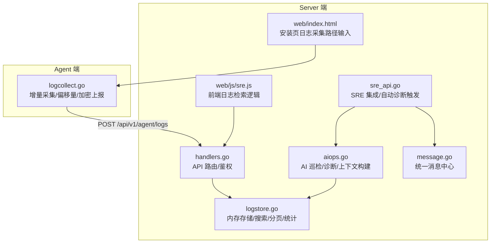
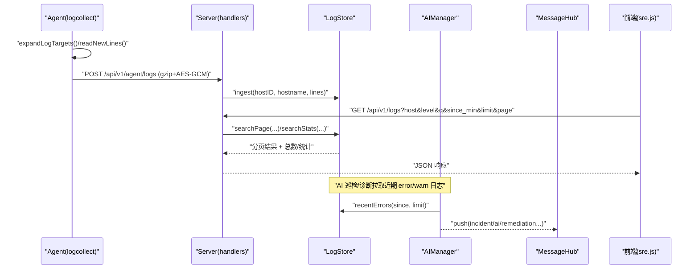
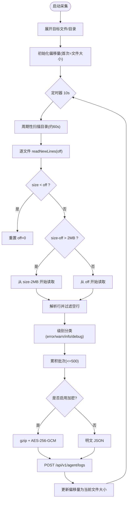
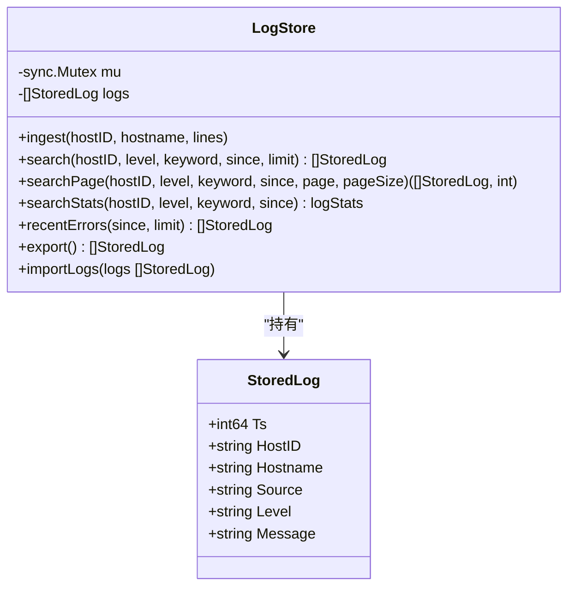
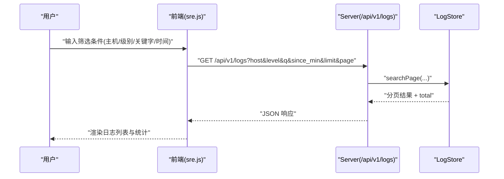
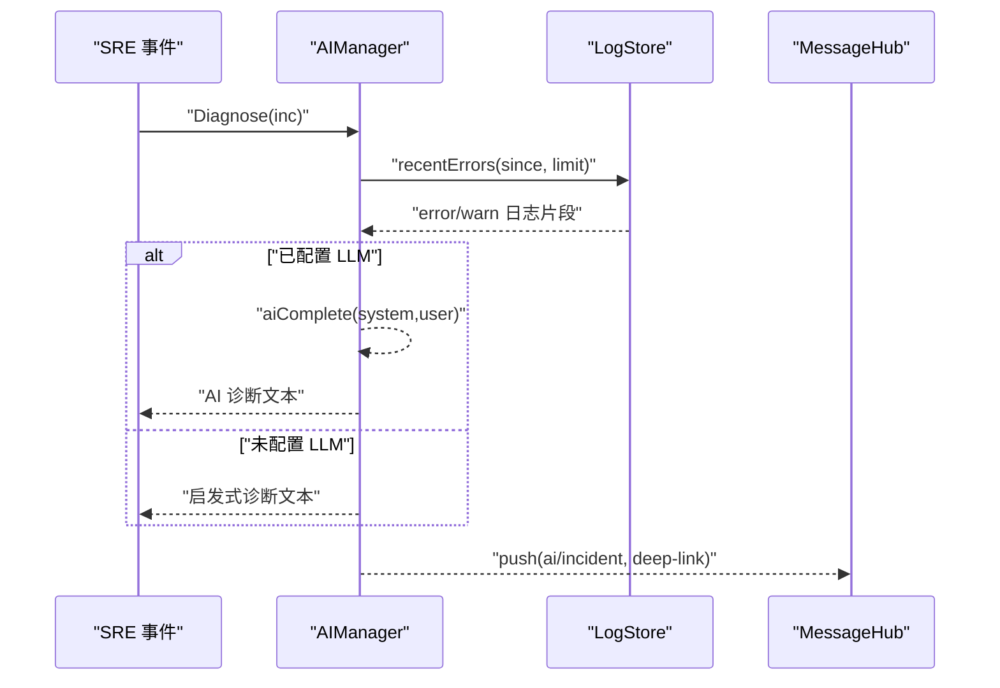
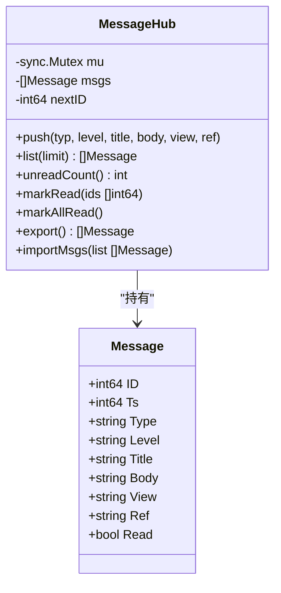
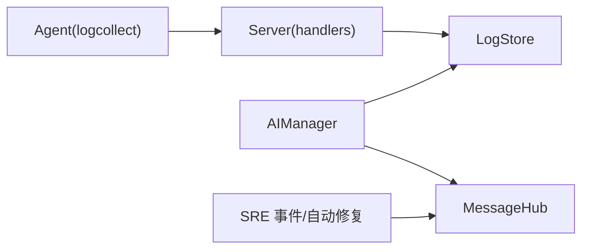

# 日志管理

<cite>
**本文引用的文件**   
- [cmd/agent/logcollect.go](file://cmd/agent/logcollect.go)
- [cmd/server/logstore.go](file://cmd/server/logstore.go)
- [cmd/server/message.go](file://cmd/server/message.go)
- [cmd/server/aiops.go](file://cmd/server/aiops.go)
- [cmd/server/sre_api.go](file://cmd/server/sre_api.go)
- [cmd/server/handlers.go](file://cmd/server/handlers.go)
- [cmd/server/web/js/sre.js](file://cmd/server/web/js/sre.js)
- [cmd/server/web/index.html](file://cmd/server/web/index.html)
- [README.md](file://README.md)
</cite>

## 目录
1. [简介](#简介)
2. [项目结构](#项目结构)
3. [核心组件](#核心组件)
4. [架构总览](#架构总览)
5. [详细组件分析](#详细组件分析)
6. [依赖关系分析](#依赖关系分析)
7. [性能与存储优化](#性能与存储优化)
8. [故障排查指南](#故障排查指南)
9. [结论](#结论)
10. [附录：配置与查询技巧](#附录配置与查询技巧)

## 简介
本章节面向 AIOps Monitor 的“日志管理”能力，围绕以下目标展开：
- 增量日志采集机制：文件监听、偏移量管理、断点续传、轮转处理、批量上报与安全传输。
- 全文检索能力：内存环形缓冲、分页与统计、前端交互与外部数据源扩展（Loki）。
- 错误分析与 AI 辅助诊断：异常检测、模式识别、根因分析（AI 或启发式兜底），以及与事件中心的联动。
- 统一消息中心：告警、AI 诊断结果、系统通知的统一管理与推送。
- 配置示例与查询技巧：Agent 日志采集路径配置、服务端检索参数、性能优化与存储管理建议。

## 项目结构
日志管理涉及 Agent 端采集与服务端聚合、检索、AI 诊断与消息中心协同，关键文件分布如下：
- Agent 侧：增量采集、偏移量维护、加密上报
- Server 侧：日志接收与内存存储、搜索与分页、统计面板、AI 上下文注入、消息中心写入
- 前端：日志检索 UI、安装时可选配置日志采集路径

图表来源
- [cmd/agent/logcollect.go:1-231](file://cmd/agent/logcollect.go#L1-L231)
- [cmd/server/logstore.go:1-318](file://cmd/server/logstore.go#L1-L318)
- [cmd/server/handlers.go:260-275](file://cmd/server/handlers.go#L260-L275)
- [cmd/server/aiops.go:547-787](file://cmd/server/aiops.go#L547-L787)
- [cmd/server/message.go:1-137](file://cmd/server/message.go#L1-L137)
- [cmd/server/sre_api.go:34-61](file://cmd/server/sre_api.go#L34-L61)
- [cmd/server/web/js/sre.js:973-995](file://cmd/server/web/js/sre.js#L973-L995)
- [cmd/server/web/index.html:695-718](file://cmd/server/web/index.html#L695-L718)

章节来源
- [cmd/agent/logcollect.go:1-231](file://cmd/agent/logcollect.go#L1-L231)
- [cmd/server/logstore.go:1-318](file://cmd/server/logstore.go#L1-L318)
- [cmd/server/handlers.go:260-275](file://cmd/server/handlers.go#L260-L275)
- [cmd/server/aiops.go:547-787](file://cmd/server/aiops.go#L547-L787)
- [cmd/server/message.go:1-137](file://cmd/server/message.go#L1-L137)
- [cmd/server/sre_api.go:34-61](file://cmd/server/sre_api.go#L34-L61)
- [cmd/server/web/js/sre.js:973-995](file://cmd/server/web/js/sre.js#L973-L995)
- [cmd/server/web/index.html:695-718](file://cmd/server/web/index.html#L695-L718)

## 核心组件
- 增量采集器（Agent）
  - 支持文件或目录作为采集目标；目录周期性扫描以纳入新文件。
  - 基于文件大小维护偏移量，首次发现即定位到当前末尾，避免历史洪水。
  - 检测轮转/截断（size < last offset）后从 0 重读；单次读取上限限制，避免大跳变导致单周期压力过大。
  - 批量打包、gzip 压缩 + AES-256-GCM 加密上报（注册阶段下发 per-agent log key），明文开关用于调试。
- 日志存储与检索（Server）
  - 内存环形缓冲（固定容量），重启后可通过持久化导入最近窗口恢复。
  - 提供按主机、级别、关键字、时间范围过滤的搜索接口与分页接口，并返回总数。
  - 提供统计信息：级别分布、Top 主机、时间分布（1h/6h/24h）。
- AI 巡检与诊断
  - 定时巡检：汇总在线/离线主机、活跃告警、SLO 未达标、资源高位、近期 error/warn 日志等，生成结构化发现。
  - 事件诊断：对 critical 事件自动触发 AI 或启发式根因分析，结果追加至事件时间线并推送到消息中心。
- 统一消息中心
  - 汇聚事件、告警、SLO、自动修复、AI 巡检/诊断、工单等通知，支持深链跳转与已读状态持久化。

章节来源
- [cmd/agent/logcollect.go:22-84](file://cmd/agent/logcollect.go#L22-L84)
- [cmd/server/logstore.go:12-78](file://cmd/server/logstore.go#L12-L78)
- [cmd/server/aiops.go:547-787](file://cmd/server/aiops.go#L547-L787)
- [cmd/server/message.go:1-137](file://cmd/server/message.go#L1-L137)

## 架构总览
日志管理端到端流程如下：
- Agent 根据配置的路径列表，周期性扫描并 tail 新增行，维护偏移量，批量上报。
- Server 接收日志批次，归一化级别，写入内存环形缓冲，供检索与统计。
- 前端通过 API 进行检索与分页，展示结果与统计概览。
- AI 模块在巡检或事件诊断时，拉取近期错误/警告日志作为上下文，输出研判与建议。
- 统一消息中心将事件、AI 诊断结果等通知集中呈现，并提供深链直达。

图表来源
- [cmd/agent/logcollect.go:37-84](file://cmd/agent/logcollect.go#L37-L84)
- [cmd/server/logstore.go:59-78](file://cmd/server/logstore.go#L59-L78)
- [cmd/server/sre_api.go:760-765](file://cmd/server/sre_api.go#L760-L765)
- [cmd/server/aiops.go:648-687](file://cmd/server/aiops.go#L648-L687)
- [cmd/server/message.go:49-63](file://cmd/server/message.go#L49-L63)
- [cmd/server/web/js/sre.js:988-995](file://cmd/server/web/js/sre.js#L988-L995)

## 详细组件分析

### 增量采集器（Agent）
- 目标展开：支持文件与目录；目录内匹配 .log/.out/.err/.txt 及含 .log 的轮转文件。
- 偏移量管理：首次发现记录文件大小为初始偏移；后续仅读取新增行。
- 轮转/截断处理：当 size < off 视为轮转，重置偏移从头读取；大跳变限制单次最大读取大小。
- 批量与限流：每批最多 500 条，超过则保留最新 500 条，避免瞬时峰值。
- 安全上报：注册阶段获取 per-agent log key，默认启用 gzip + AES-256-GCM 加密；可通过开关关闭用于调试。
- 心跳与周期：10 秒一次循环，约 60 秒重新扫描目录以纳入新文件。

图表来源
- [cmd/agent/logcollect.go:86-167](file://cmd/agent/logcollect.go#L86-L167)
- [cmd/agent/logcollect.go:169-181](file://cmd/agent/logcollect.go#L169-L181)
- [cmd/agent/logcollect.go:183-231](file://cmd/agent/logcollect.go#L183-L231)

章节来源
- [cmd/agent/logcollect.go:22-84](file://cmd/agent/logcollect.go#L22-L84)
- [cmd/agent/logcollect.go:86-167](file://cmd/agent/logcollect.go#L86-L167)
- [cmd/agent/logcollect.go:169-181](file://cmd/agent/logcollect.go#L169-L181)
- [cmd/agent/logcollect.go:183-231](file://cmd/agent/logcollect.go#L183-L231)

### 日志存储与检索（Server）
- 数据结构：StoredLog 包含时间戳、主机 ID/名称、来源、级别、消息体。
- 内存缓冲：固定容量（如 50000），超出裁剪尾部，保证 O(1) 插入与稳定内存占用。
- 级别归一化：error/err/fatal/panic/crit/critical/emerg/alert → error；warn/warning → warn；debug/trace → debug；其余 info。
- 搜索接口：支持 hostID、level、keyword、since 过滤，返回 newest-first 的结果集。
- 分页接口：先计数 total，再跳过 offset 取 pageSize，返回分页结果与总数。
- 统计接口：级别分布、Top 主机、时间分布（1h/6h/24h），便于概览面板。
- 持久化：导出最近 N 条（如 8000）落库，重启时导入恢复热尾，避免 WAL 抖动。

图表来源
- [cmd/server/logstore.go:21-78](file://cmd/server/logstore.go#L21-L78)
- [cmd/server/logstore.go:80-166](file://cmd/server/logstore.go#L80-L166)
- [cmd/server/logstore.go:181-254](file://cmd/server/logstore.go#L181-L254)
- [cmd/server/logstore.go:256-318](file://cmd/server/logstore.go#L256-L318)

章节来源
- [cmd/server/logstore.go:12-78](file://cmd/server/logstore.go#L12-L78)
- [cmd/server/logstore.go:80-166](file://cmd/server/logstore.go#L80-L166)
- [cmd/server/logstore.go:181-254](file://cmd/server/logstore.go#L181-L254)
- [cmd/server/logstore.go:256-318](file://cmd/server/logstore.go#L256-L318)

### 全文检索与前端交互
- 后端 API：/api/v1/logs 支持 host、level、q（关键字）、since_min、limit、page 等参数。
- 前端逻辑：构造 URLSearchParams，调用后端检索；若选择 Loki 数据源则走 LogQL 直查，不走本地聚合分页。
- 结果渲染：按时间戳与级别着色显示，无匹配时提示“无匹配日志”。

图表来源
- [cmd/server/web/js/sre.js:988-995](file://cmd/server/web/js/sre.js#L988-L995)
- [cmd/server/sre_api.go:760-765](file://cmd/server/sre_api.go#L760-L765)

章节来源
- [cmd/server/web/js/sre.js:973-995](file://cmd/server/web/js/sre.js#L973-L995)
- [cmd/server/sre_api.go:760-765](file://cmd/server/sre_api.go#L760-L765)

### 错误分析与 AI 辅助诊断
- 巡检上下文：在线/离线主机、活跃告警、SLO 未达标、资源高位、近期 error/warn 日志数量与节选。
- 启发式诊断：未配置 LLM 时，基于规则给出根因方向与处置建议，并附加上下文摘要。
- AI 诊断：配置 LLM 后，调用对话模型生成结构化研判与建议；结果追加至事件时间线并推送到消息中心。
- 自动触发：critical 事件自动触发诊断，同时写入 AI 记忆库供 RAG 复用。

图表来源
- [cmd/server/aiops.go:648-687](file://cmd/server/aiops.go#L648-L687)
- [cmd/server/aiops.go:761-787](file://cmd/server/aiops.go#L761-L787)
- [cmd/server/sre_api.go:34-61](file://cmd/server/sre_api.go#L34-L61)
- [cmd/server/message.go:49-63](file://cmd/server/message.go#L49-L63)

章节来源
- [cmd/server/aiops.go:547-787](file://cmd/server/aiops.go#L547-L787)
- [cmd/server/sre_api.go:34-61](file://cmd/server/sre_api.go#L34-L61)

### 统一消息中心
- 消息类型：incident/alert/slo/remediation/ai/ticket/system 等。
- 功能：push/list/unreadCount/markRead/markAllRead/export/import，持久化于 kv_state。
- 集成：SRE 事件变更、自动修复状态变化、AI 巡检报告均写入消息中心，提供深链直达。

图表来源
- [cmd/server/message.go:23-137](file://cmd/server/message.go#L23-L137)

章节来源
- [cmd/server/message.go:1-137](file://cmd/server/message.go#L1-L137)
- [cmd/server/sre_api.go:34-61](file://cmd/server/sre_api.go#L34-L61)

## 依赖关系分析
- Agent 与 Server 的日志上报链路：
  - Agent 通过 HTTP POST 上报日志批次，携带指纹与加密头。
  - Server handlers 负责鉴权与路由，调用 logstore 入库。
- AI 与日志存储的耦合：
  - AI 巡检/诊断通过 recentErrors 拉取近期错误/警告日志作为上下文。
- 消息中心与其他模块：
  - SRE 事件变更、自动修复状态变化、AI 巡检报告均 push 到消息中心。

图表来源
- [cmd/agent/logcollect.go:208-231](file://cmd/agent/logcollect.go#L208-L231)
- [cmd/server/handlers.go:260-275](file://cmd/server/handlers.go#L260-L275)
- [cmd/server/aiops.go:648-687](file://cmd/server/aiops.go#L648-L687)
- [cmd/server/message.go:49-63](file://cmd/server/message.go#L49-L63)

章节来源
- [cmd/agent/logcollect.go:208-231](file://cmd/agent/logcollect.go#L208-L231)
- [cmd/server/handlers.go:260-275](file://cmd/server/handlers.go#L260-L275)
- [cmd/server/aiops.go:648-687](file://cmd/server/aiops.go#L648-L687)
- [cmd/server/message.go:49-63](file://cmd/server/message.go#L49-L63)

## 性能与存储优化
- 采集端优化
  - 批量上限 500 条，避免瞬时峰值；单次读取上限 2MB，防止大跳变造成 GC 压力。
  - 目录扫描周期约 60 秒，平衡新文件发现与开销。
  - 加密上报仅在注册阶段有 per-agent log key 时启用，可关闭用于调试。
- 服务端优化
  - 内存环形缓冲固定容量，插入 O(1)，搜索线性扫描但受限于 cap。
  - 分页先计数 total 再取 pageSize，适合中小规模；大规模建议接入外部日志系统（如 Loki）。
  - 持久化只导出最近 N 条（如 8000），降低 WAL 压力。
- 前端优化
  - 支持外部数据源（Loki）直查，绕过本地聚合分页，提升大规模场景体验。

章节来源
- [cmd/agent/logcollect.go:60-84](file://cmd/agent/logcollect.go#L60-L84)
- [cmd/agent/logcollect.go:132-167](file://cmd/agent/logcollect.go#L132-L167)
- [cmd/server/logstore.go:31-78](file://cmd/server/logstore.go#L31-L78)
- [cmd/server/logstore.go:108-166](file://cmd/server/logstore.go#L108-L166)
- [cmd/server/web/js/sre.js:988-995](file://cmd/server/web/js/sre.js#L988-L995)

## 故障排查指南
- 无法上报日志
  - 检查 Agent 是否配置了 log_paths 且具备读取权限。
  - 确认服务端 /api/v1/agent/logs 可达，且指纹鉴权通过。
  - 若启用加密，确认注册阶段下发的 log key 有效。
- 检索不到日志
  - 确认筛选条件（host/level/q/since）是否正确。
  - 检查内存缓冲是否已满（重启后需等待积累）。
  - 如需历史检索，考虑接入外部日志系统（Loki）。
- AI 诊断失败
  - 检查 AI Endpoint、模型名、API Key 配置。
  - 查看 provider 返回的错误码与消息，必要时切换模型或调整网络。

章节来源
- [cmd/agent/logcollect.go:37-84](file://cmd/agent/logcollect.go#L37-L84)
- [cmd/server/logstore.go:80-166](file://cmd/server/logstore.go#L80-L166)
- [cmd/server/aiops.go:180-322](file://cmd/server/aiops.go#L180-L322)

## 结论
AIOps Monitor 的日志管理以轻量、可靠为核心设计原则：
- Agent 端实现高效增量采集与断点续传，兼顾安全性与性能。
- Server 端以内存环形缓冲支撑快速检索与统计，并通过持久化保障重启恢复。
- AI 巡检与诊断无缝融入工作流，结合统一消息中心形成闭环。
- 对于超大规模场景，推荐接入外部日志系统（如 Loki）以获得更强的检索与存储能力。

## 附录：配置与查询技巧
- Agent 日志采集配置
  - 安装页面支持输入日志采集路径（文件或目录），安装后自动加密上报。
  - 命令行参数 --log-paths 支持逗号分隔的多路径。
- 服务端检索参数
  - GET /api/v1/logs：支持 host、level、q（关键字）、since_min、limit、page。
  - 前端支持选择外部数据源（Loki）直查，使用 LogQL。
- 性能优化建议
  - 控制采集路径粒度，避免过宽目录导致大量小文件扫描。
  - 合理设置 limit/pageSize，避免一次性拉取过多数据。
  - 生产环境建议开启加密上报，确保日志传输安全。
- 存储管理建议
  - 内存缓冲容量与持久化窗口需根据部署规模调优。
  - 长期历史与复杂检索建议接入外部日志系统（Loki/Promtail/Vector 等）。

章节来源
- [cmd/server/web/index.html:695-718](file://cmd/server/web/index.html#L695-L718)
- [README.md:1250-1278](file://README.md#L1250-L1278)
- [cmd/server/web/js/sre.js:988-995](file://cmd/server/web/js/sre.js#L988-L995)