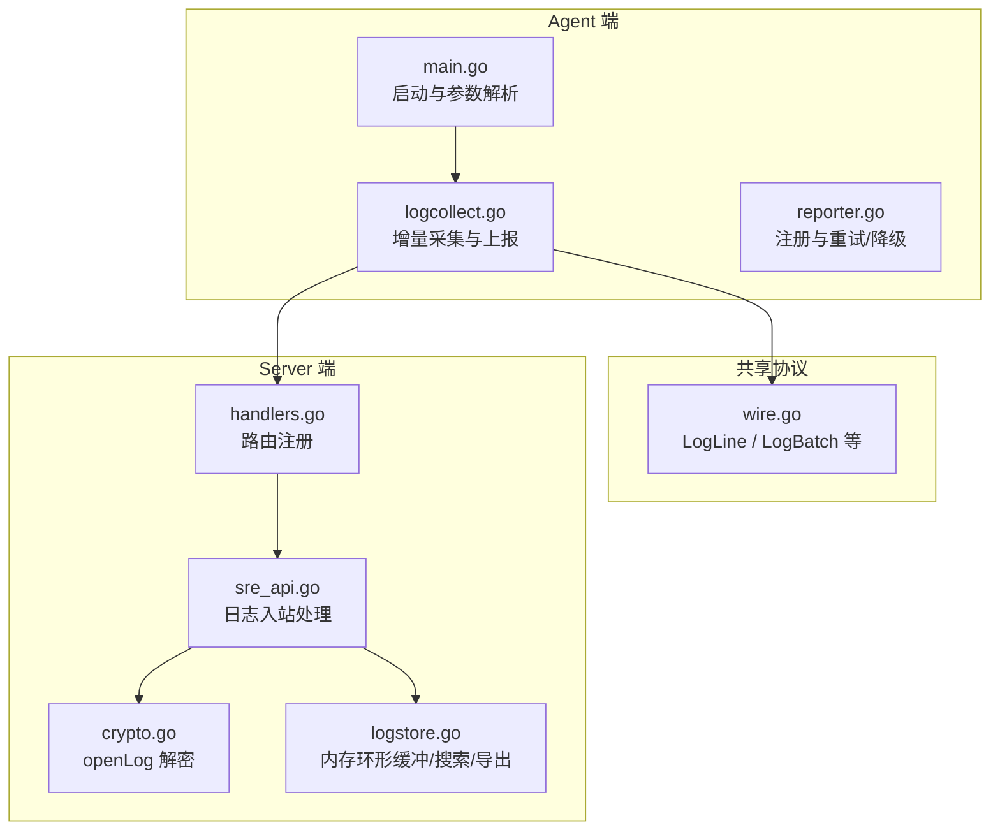
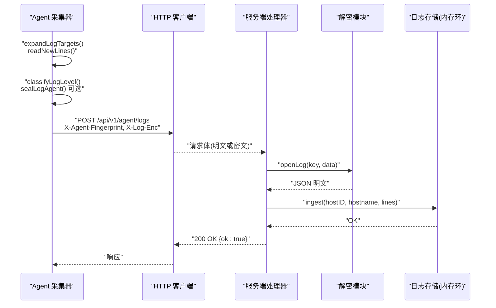
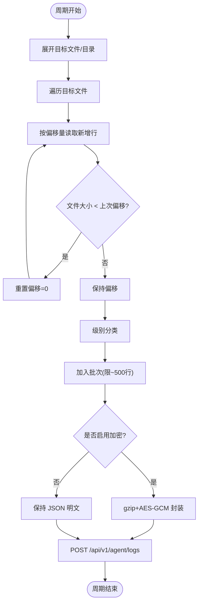
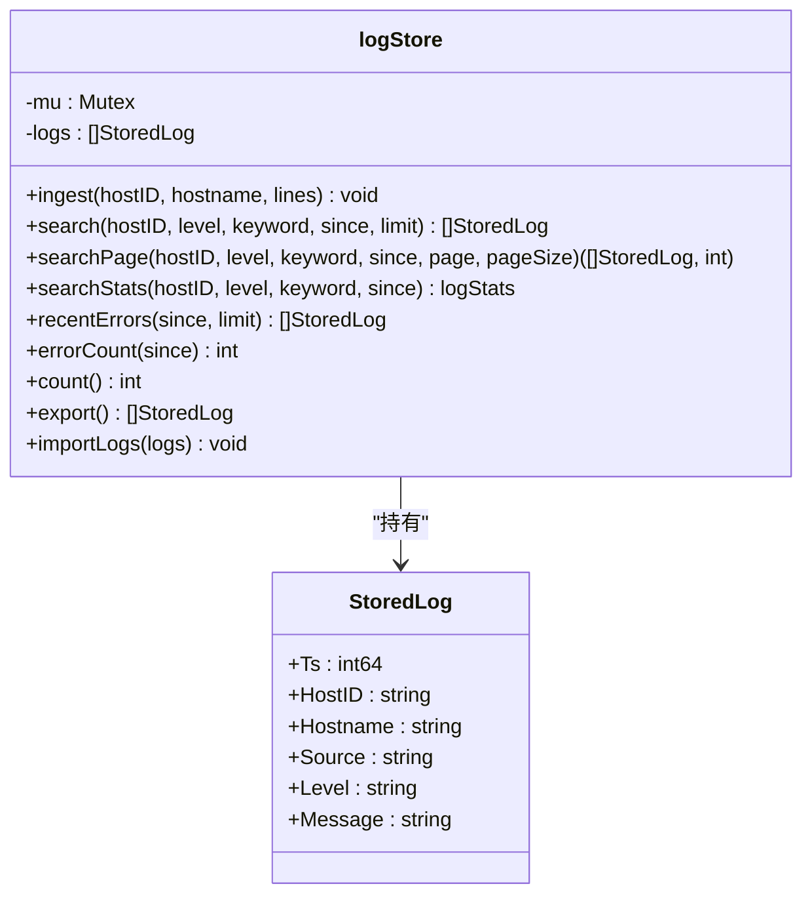
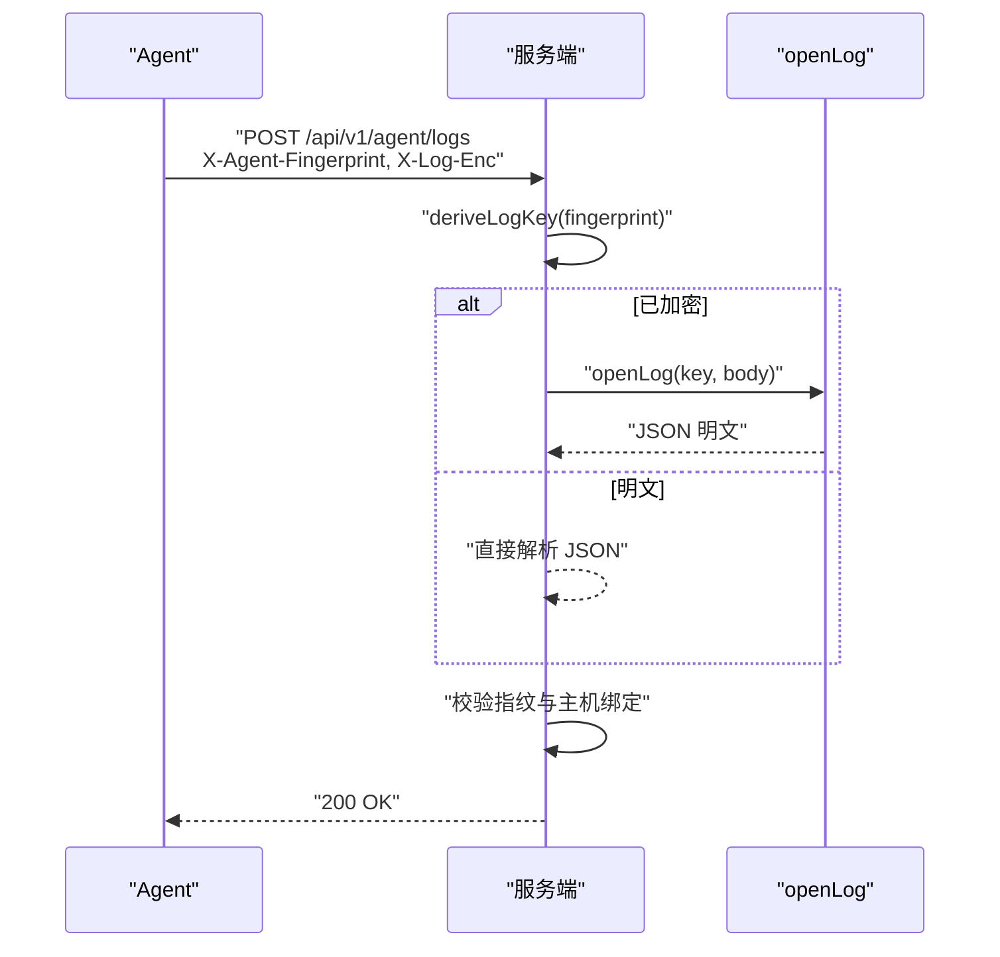
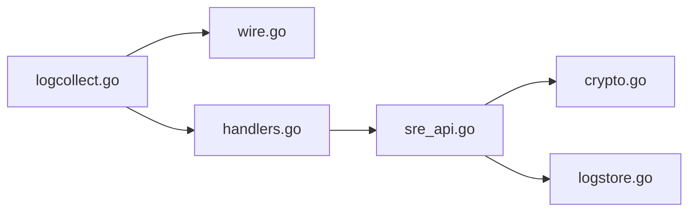

# 日志采集

<cite>
**本文引用的文件**   
- [cmd/agent/logcollect.go](file://cmd/agent/logcollect.go)
- [cmd/agent/reporter.go](file://cmd/agent/reporter.go)
- [cmd/agent/main.go](file://cmd/agent/main.go)
- [shared/wire.go](file://shared/wire.go)
- [cmd/server/handlers.go](file://cmd/server/handlers.go)
- [cmd/server/sre_api.go](file://cmd/server/sre_api.go)
- [cmd/server/crypto.go](file://cmd/server/crypto.go)
- [cmd/server/logstore.go](file://cmd/server/logstore.go)
- [config.example.json](file://config.example.json)
- [server_config.example.json](file://server_config.example.json)
</cite>

## 目录
1. [简介](#简介)
2. [项目结构](#项目结构)
3. [核心组件](#核心组件)
4. [架构总览](#架构总览)
5. [详细组件分析](#详细组件分析)
6. [依赖关系分析](#依赖关系分析)
7. [性能考量](#性能考量)
8. [故障排查指南](#故障排查指南)
9. [结论](#结论)
10. [附录：配置与示例](#附录配置与示例)

## 简介
本章节面向 AIOps Monitor 的日志采集能力，系统性说明 Agent 端增量日志采集与服务端存储、检索、诊断的整体实现。重点覆盖：
- 增量采集机制：文件监听策略、偏移量管理、断点续传（轮转/截断检测）
- Agent 端收集器：批量打包、压缩与加密上报、错误重试与降级
- 服务端存储层：内存环形缓冲区、数据规范化、容量控制与分页查询
- 配置项与最佳实践：支持的日志格式、过滤规则、性能调优参数
- 常见问题排查方法

## 项目结构
日志采集涉及 Agent 与 Server 两端代码以及共享数据结构定义：
- Agent 侧负责发现目标文件、增量读取、批处理、可选加密后上报
- Server 侧负责接收、解密、规范化入库、搜索统计与导出持久化
- shared 包提供双方共享的数据模型（如 LogLine、LogBatch）

图表来源
- [cmd/agent/main.go:106-120](file://cmd/agent/main.go#L106-L120)
- [cmd/agent/logcollect.go:37-84](file://cmd/agent/logcollect.go#L37-L84)
- [cmd/agent/reporter.go:80-121](file://cmd/agent/reporter.go#L80-L121)
- [shared/wire.go:94-108](file://shared/wire.go#L94-L108)
- [cmd/server/handlers.go:204-207](file://cmd/server/handlers.go#L204-L207)
- [cmd/server/sre_api.go:700-738](file://cmd/server/sre_api.go#L700-L738)
- [cmd/server/crypto.go:153-173](file://cmd/server/crypto.go#L153-L173)
- [cmd/server/logstore.go:38-78](file://cmd/server/logstore.go#L38-L78)

章节来源
- [cmd/agent/main.go:106-120](file://cmd/agent/main.go#L106-L120)
- [cmd/agent/logcollect.go:37-84](file://cmd/agent/logcollect.go#L37-L84)
- [cmd/agent/reporter.go:80-121](file://cmd/agent/reporter.go#L80-L121)
- [shared/wire.go:94-108](file://shared/wire.go#L94-L108)
- [cmd/server/handlers.go:204-207](file://cmd/server/handlers.go#L204-L207)
- [cmd/server/sre_api.go:700-738](file://cmd/server/sre_api.go#L700-L738)
- [cmd/server/crypto.go:153-173](file://cmd/server/crypto.go#L153-L173)
- [cmd/server/logstore.go:38-78](file://cmd/server/logstore.go#L38-L78)

## 核心组件
- Agent 日志采集器
  - 目标展开：支持单文件或目录；目录扫描匹配 .log/.out/.err/.txt 及含 .log 的轮转文件
  - 增量读取：维护每个文件的偏移量；首次见文件定位到 EOF；大小回退视为轮转/截断，从头重读
  - 批量打包：每周期聚合最多约 500 行，按主机 ID 打包为 LogBatch
  - 安全上报：默认启用 gzip + AES-256-GCM 加密；通过 X-Agent-Fingerprint 认证
- 服务端日志处理器
  - 路由：POST /api/v1/agent/logs
  - 解密：根据指纹派生密钥，AES-256-GCM 解密并 gzip 解压
  - 规范化：统一级别映射 error|warn|info|debug，消息长度裁剪
  - 存储：内存环形缓冲，容量上限固定；支持分页搜索与统计
- 共享数据模型
  - LogLine：时间戳、来源、级别、消息
  - LogBatch：主机标识与行列表

章节来源
- [cmd/agent/logcollect.go:86-127](file://cmd/agent/logcollect.go#L86-L127)
- [cmd/agent/logcollect.go:129-167](file://cmd/agent/logcollect.go#L129-L167)
- [cmd/agent/logcollect.go:208-231](file://cmd/agent/logcollect.go#L208-L231)
- [cmd/server/sre_api.go:700-738](file://cmd/server/sre_api.go#L700-L738)
- [cmd/server/logstore.go:45-78](file://cmd/server/logstore.go#L45-L78)
- [shared/wire.go:94-108](file://shared/wire.go#L94-L108)

## 架构总览
下图展示从 Agent 端到服务端的完整调用链，包括加密、认证、入库与返回。

图表来源
- [cmd/agent/logcollect.go:37-84](file://cmd/agent/logcollect.go#L37-L84)
- [cmd/agent/logcollect.go:183-206](file://cmd/agent/logcollect.go#L183-L206)
- [cmd/agent/logcollect.go:208-231](file://cmd/agent/logcollect.go#L208-L231)
- [cmd/server/handlers.go:204-207](file://cmd/server/handlers.go#L204-L207)
- [cmd/server/sre_api.go:700-738](file://cmd/server/sre_api.go#L700-L738)
- [cmd/server/crypto.go:153-173](file://cmd/server/crypto.go#L153-L173)
- [cmd/server/logstore.go:59-78](file://cmd/server/logstore.go#L59-L78)

## 详细组件分析

### Agent 端日志采集器
- 文件监控与目标展开
  - 支持直接指定文件路径或目录路径；目录会周期性扫描并去重，仅纳入日志后缀与含 .log 的轮转文件
  - 新出现的日志文件会被自动纳入采集范围
- 增量读取与断点续传
  - 维护 map[文件路径]偏移量；首次见文件时以文件大小作为初始偏移
  - 若文件大小小于上次偏移，视为轮转/截断，重置偏移至 0 重新读取
  - 单次读取限制最大约 2MB，避免大跳跃导致一次拉取过多
- 级别分类与批处理
  - 基于关键字将行归类为 error/warn/info/debug
  - 每周期聚合最多约 500 行，超过则保留最近 500 行
- 加密与上报
  - 默认启用 gzip + AES-256-GCM 加密；服务端下发 32B 密钥后生效
  - 通过 X-Agent-Fingerprint 头进行指纹认证
  - 失败无显式重试逻辑（由上层主循环驱动），但具备幂等性（偏移量保证不重复）

图表来源
- [cmd/agent/logcollect.go:86-127](file://cmd/agent/logcollect.go#L86-L127)
- [cmd/agent/logcollect.go:129-167](file://cmd/agent/logcollect.go#L129-L167)
- [cmd/agent/logcollect.go:169-181](file://cmd/agent/logcollect.go#L169-L181)
- [cmd/agent/logcollect.go:183-206](file://cmd/agent/logcollect.go#L183-L206)
- [cmd/agent/logcollect.go:208-231](file://cmd/agent/logcollect.go#L208-L231)

章节来源
- [cmd/agent/logcollect.go:37-84](file://cmd/agent/logcollect.go#L37-L84)
- [cmd/agent/logcollect.go:86-127](file://cmd/agent/logcollect.go#L86-L127)
- [cmd/agent/logcollect.go:129-167](file://cmd/agent/logcollect.go#L129-L167)
- [cmd/agent/logcollect.go:169-181](file://cmd/agent/logcollect.go#L169-L181)
- [cmd/agent/logcollect.go:183-206](file://cmd/agent/logcollect.go#L183-L206)
- [cmd/agent/logcollect.go:208-231](file://cmd/agent/logcollect.go#L208-L231)

### 服务端日志存储层
- 数据结构
  - StoredLog：包含时间戳、主机标识、主机名、来源、级别、消息
- 入库流程
  - 级别规范化：将多种拼写归一为 error|warn|info|debug
  - 消息长度裁剪：单条消息最大 4000 字节
  - 容量控制：内存环形缓冲上限固定，超出则丢弃最旧数据
- 搜索与统计
  - 支持按主机、级别、关键词、时间范围筛选
  - 分页查询返回总数与页码信息
  - 统计面板：按级别分布、Top 主机、时间分布（1h/6h/24h）
- 持久化接口
  - export/import：周期性导出最近若干条用于数据库落盘，重启后可恢复热尾

图表来源
- [cmd/server/logstore.go:21-41](file://cmd/server/logstore.go#L21-L41)
- [cmd/server/logstore.go:45-78](file://cmd/server/logstore.go#L45-L78)
- [cmd/server/logstore.go:80-166](file://cmd/server/logstore.go#L80-L166)
- [cmd/server/logstore.go:181-254](file://cmd/server/logstore.go#L181-L254)
- [cmd/server/logstore.go:292-317](file://cmd/server/logstore.go#L292-L317)

章节来源
- [cmd/server/logstore.go:21-41](file://cmd/server/logstore.go#L21-L41)
- [cmd/server/logstore.go:45-78](file://cmd/server/logstore.go#L45-L78)
- [cmd/server/logstore.go:80-166](file://cmd/server/logstore.go#L80-L166)
- [cmd/server/logstore.go:181-254](file://cmd/server/logstore.go#L181-L254)
- [cmd/server/logstore.go:292-317](file://cmd/server/logstore.go#L292-L317)

### 安全与认证
- Agent 侧
  - 使用 X-Agent-Fingerprint 头进行身份标识
  - 可选开启 gzip + AES-256-GCM 加密，密文前缀 nonce，便于服务端解密
- 服务端侧
  - 根据指纹派生日志密钥，执行 AES-256-GCM 解密与 gzip 解压
  - 校验指纹与主机绑定关系，未授权返回 403

图表来源
- [cmd/agent/logcollect.go:208-231](file://cmd/agent/logcollect.go#L208-L231)
- [cmd/server/sre_api.go:700-738](file://cmd/server/sre_api.go#L700-L738)
- [cmd/server/crypto.go:153-173](file://cmd/server/crypto.go#L153-L173)

章节来源
- [cmd/agent/logcollect.go:208-231](file://cmd/agent/logcollect.go#L208-L231)
- [cmd/server/sre_api.go:700-738](file://cmd/server/sre_api.go#L700-L738)
- [cmd/server/crypto.go:153-173](file://cmd/server/crypto.go#L153-L173)

### 上报重试与网络降级（Agent 侧通用上报）
- 针对指标上报的通用重试与降级策略可参考 reporter 的实现，有助于理解整体健壮性设计：
  - 同一周期内最多重试 3 次，间隔短延迟
  - 遇到 403 触发重新注册后重试
  - 遇到 400 且携带 gzip 时禁用压缩并重试
- 日志上报本身在采集器中未内置重试，但具备幂等性与偏移量保护，结合上层调度可保障最终一致性

章节来源
- [cmd/agent/reporter.go:139-253](file://cmd/agent/reporter.go#L139-L253)

## 依赖关系分析
- Agent 依赖 shared 包中的 LogLine/LogBatch 结构与 HTTP 客户端
- Server 依赖 handlers 路由分发、sre_api 处理逻辑、crypto 解密、logstore 存储
- 关键耦合点：
  - 协议契约：shared/wire.go 定义的 LogLine/LogBatch
  - 安全契约：指纹认证与日志密钥派生
  - 存储契约：内存环形缓冲容量与导出接口

图表来源
- [cmd/agent/logcollect.go:208-231](file://cmd/agent/logcollect.go#L208-L231)
- [shared/wire.go:94-108](file://shared/wire.go#L94-L108)
- [cmd/server/handlers.go:204-207](file://cmd/server/handlers.go#L204-L207)
- [cmd/server/sre_api.go:700-738](file://cmd/server/sre_api.go#L700-L738)
- [cmd/server/crypto.go:153-173](file://cmd/server/crypto.go#L153-L173)
- [cmd/server/logstore.go:38-78](file://cmd/server/logstore.go#L38-L78)

章节来源
- [cmd/agent/logcollect.go:208-231](file://cmd/agent/logcollect.go#L208-L231)
- [shared/wire.go:94-108](file://shared/wire.go#L94-L108)
- [cmd/server/handlers.go:204-207](file://cmd/server/handlers.go#L204-L207)
- [cmd/server/sre_api.go:700-738](file://cmd/server/sre_api.go#L700-L738)
- [cmd/server/crypto.go:153-173](file://cmd/server/crypto.go#L153-L173)
- [cmd/server/logstore.go:38-78](file://cmd/server/logstore.go#L38-L78)

## 性能考量
- Agent 端
  - 批量大小：每周期最多约 500 行，平衡吞吐与延迟
  - 单次读取上限：约 2MB，防止大跳跃导致一次性拉取过多
  - 加密开销：gzip + AES-GCM 增加 CPU 消耗，生产环境建议开启；调试场景可关闭
- 服务端端
  - 内存容量：日志环形缓冲上限固定，适合短期回溯与在线诊断
  - 持久化窗口：仅导出最近若干条，降低 WAL 压力
  - 搜索复杂度：线性扫描，受限于内存容量，适合中小规模实时检索

[本节为通用指导，不直接分析具体文件]

## 故障排查指南
- 无法采集到新日志
  - 检查 --log-paths 是否正确，目录是否存在，权限是否足够
  - 确认文件是否为日志后缀或被目录扫描规则忽略
  - 查看偏移量是否异常（轮转/截断后应重置）
- 日志未出现在服务端
  - 检查 X-Agent-Fingerprint 是否与主机绑定一致
  - 若启用加密，确认服务端是否配置 AIOPS_SECRET_KEY 以派生日志密钥
  - 观察服务端返回状态码：400 表示解析/解密失败，403 表示未授权
- 性能问题
  - 调整批量大小与读取上限（当前实现为固定值）
  - 评估加密开关对 CPU 的影响
  - 关注服务端内存占用与导出频率

章节来源
- [cmd/agent/logcollect.go:86-127](file://cmd/agent/logcollect.go#L86-L127)
- [cmd/agent/logcollect.go:129-167](file://cmd/agent/logcollect.go#L129-L167)
- [cmd/server/sre_api.go:700-738](file://cmd/server/sre_api.go#L700-L738)
- [cmd/server/crypto.go:153-173](file://cmd/server/crypto.go#L153-L173)

## 结论
AIOps Monitor 的日志采集采用轻量高效的增量方案：Agent 端通过文件偏移量与轮转检测实现断点续传，服务端以内存环形缓冲承载高吞吐写入与快速检索。配合指纹认证与可选加密，兼顾安全性与性能。对于大规模历史归档需求，可通过定期导出接口对接外部存储系统。

[本节为总结性内容，不直接分析具体文件]

## 附录：配置与示例
- Agent 配置项（节选）
  - log_paths：要采集的文件或目录路径，逗号分隔
  - log_encrypt：是否启用 gzip + AES-256-GCM 加密上报（默认开启）
  - tls_skip_verify：跳过服务端 TLS 证书校验（不安全，仅自签/内网临时使用）
  - ca_cert：信任的 CA 证书路径（PEM），用于校验自签名服务端证书
- 服务端配置项（节选）
  - 日志加密相关：AIOPS_SECRET_KEY（用于派生日志密钥）
  - 其他告警、阈值、账号等配置参见示例文件
- 支持的日志格式与过滤
  - 级别分类：基于关键字识别 error/warn/info/debug
  - 文件名匹配：.log/.out/.err/.txt 及含 .log 的轮转文件
  - 过滤规则：空行剔除、消息长度裁剪、级别规范化

章节来源
- [cmd/agent/main.go:24-42](file://cmd/agent/main.go#L24-L42)
- [cmd/agent/main.go:106-120](file://cmd/agent/main.go#L106-L120)
- [config.example.json:1-16](file://config.example.json#L1-L16)
- [server_config.example.json:1-36](file://server_config.example.json#L1-L36)
- [cmd/agent/logcollect.go:119-127](file://cmd/agent/logcollect.go#L119-L127)
- [cmd/agent/logcollect.go:169-181](file://cmd/agent/logcollect.go#L169-L181)
- [cmd/server/logstore.go:45-57](file://cmd/server/logstore.go#L45-L57)