# 核心功能

<cite>
**本文引用的文件**   
- [README.md](file://README.md)
- [config.example.json](file://config.example.json)
- [server_config.example.json](file://server_config.example.json)
- [cmd/agent/main.go](file://cmd/agent/main.go)
- [cmd/server/main.go](file://cmd/server/main.go)
- [cmd/agent/collector.go](file://cmd/agent/collector.go)
- [cmd/server/alerts.go](file://cmd/server/alerts.go)
- [cmd/server/playbook.go](file://cmd/server/playbook.go)
- [cmd/server/remediation.go](file://cmd/server/remediation.go)
- [cmd/server/logstore.go](file://cmd/server/logstore.go)
- [cmd/server/handlers.go](file://cmd/server/handlers.go)
- [cmd/server/web/js/hosts.js](file://cmd/server/web/js/hosts.js)
- [cmd/server/web/js/settings.js](file://cmd/server/web/js/settings.js)
- [cmd/server/web/js/sre.js](file://cmd/server/web/js/sre.js)
</cite>

## 目录
1. [简介](#简介)
2. [项目结构](#项目结构)
3. [核心组件](#核心组件)
4. [架构总览](#架构总览)
5. [详细组件分析](#详细组件分析)
6. [依赖关系分析](#依赖关系分析)
7. [性能与规模](#性能与规模)
8. [故障排查指南](#故障排查指南)
9. [结论](#结论)
10. [附录：配置与使用示例](#附录配置与使用示例)

## 简介
AIOps Monitor 是一个企业级主机监控与 SRE 运维平台，提供跨平台主机采集、实时趋势图、智能告警、自动化剧本、SRE 工作流（事件/自动修复/SLO/工单）、日志采集检索、AI 巡检诊断等能力。其差异化特性包括：零第三方依赖的 Agent、GPU 监控支持、交互式趋势图、远程终端免开端口、多云短信语音通知、统一存储（PostgreSQL + VictoriaMetrics）以及 AES-256-GCM 静态加密与可选 TLS 传输。

## 项目结构
- 服务端（Go 单二进制）：负责 HTTP API、WebSocket 终端、告警评估、编排调度、SRE 中枢、消息中心、日志聚合、AI 巡检、存储适配（PG/VM）。
- Agent（Go 原生采集）：三平台指标采集、插件执行、日志增量上报、反向终端通道、中继模式。
- 前端（内嵌于服务端）：Canvas 图表、PWA、i18n、多模块页面（主机/拨测/转发/终端/自动化/SRE/日志/AI）。
- 插件层（Python SDK）：进程隔离的可插拔扩展，输出自定义指标与事件。

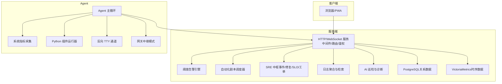

**图示来源**
- [cmd/server/main.go:227-355](file://cmd/server/main.go#L227-L355)
- [cmd/agent/main.go:74-238](file://cmd/agent/main.go#L74-L238)

**章节来源**
- [README.md:138-176](file://README.md#L138-L176)
- [cmd/server/main.go:227-355](file://cmd/server/main.go#L227-L355)
- [cmd/agent/main.go:74-238](file://cmd/agent/main.go#L74-L238)

## 核心组件
- 跨平台主机监控：Linux/Windows/macOS 原生采集，CPU/内存/磁盘/网络/TCP/负载/进程/GPU 等指标；Agent 零第三方依赖。
- 实时数据展示：纯 Canvas 交互式趋势图，悬停十字线、框选放大、双击还原、时间跨度控件。
- 智能告警系统：27 组细粒度阈值（warn/crit），覆盖主机/拨测/API/任务/转发五大维度；触发/恢复去重推送。
- 自动化运维工具：多步骤剧本编排，按全部/分类/系统/主机选择目标，批量并行执行，历史报告可查。
- SRE 工作流：事件汇聚（告警/SLO/手动）+ 时间线；自动修复（护栏 + 审批）；SLO/错误预算；轻量工单。
- 日志管理：Agent 增量采集 → 服务端全文检索；自动分级 error/warn/info；支持分页与统计。
- AI 增强功能：定时健康巡检 + 事件根因研判；RAG 相似案例检索；自主 Agent（Function Calling）；未配置 LLM 时启发式兜底。

**章节来源**
- [README.md:138-176](file://README.md#L138-L176)
- [cmd/server/alerts.go:10-52](file://cmd/server/alerts.go#L10-L52)
- [cmd/server/playbook.go:10-52](file://cmd/server/playbook.go#L10-L52)
- [cmd/server/logstore.go:12-31](file://cmd/server/logstore.go#L12-L31)

## 架构总览
- 存储统一：关系数据落 PostgreSQL，时序数据落 VictoriaMetrics；内置 aiops.db 已停用，二者缺一不可。
- 安全机制：AES-256-GCM 静态加密（MFA/SMTP/AI/webhook/relay 等密钥）；可选 HTTPS/TLS 传输；SSRF 出站防护。
- 部署形态：Docker Compose 一键启动（aiops-server + postgres + victoriametrics）；支持 Docker Hub 镜像加速器与 SWR 镜像。
- 国际化与 PWA：中/英/繁中全链路覆盖；可安装到桌面、离线缓存、独立窗口运行。

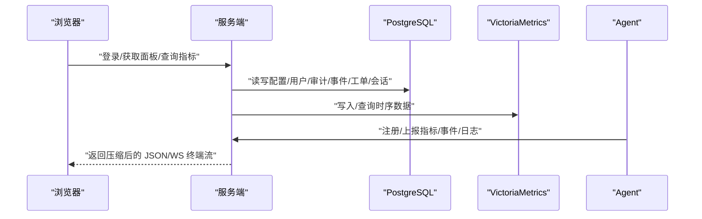

**图示来源**
- [cmd/server/main.go:255-273](file://cmd/server/main.go#L255-L273)
- [cmd/server/main.go:286-292](file://cmd/server/main.go#L286-L292)
- [cmd/agent/main.go:219-236](file://cmd/agent/main.go#L219-L236)

**章节来源**
- [README.md:156-176](file://README.md#L156-L176)
- [cmd/server/main.go:255-273](file://cmd/server/main.go#L255-L273)

## 详细组件分析

### 跨平台主机监控与 GPU 监控
- 设计理念：高频敏感采集用 Go 原生实现，进程边界隔离；GPU 为 best-effort，有厂商工具或 OS 接口则上报并缓存。
- 实现原理：Collector 接口由平台特定实现（Linux procfs/syscall、Windows Win32、macOS sysctl/ioreg），统一上报 Metrics。
- 配置方法：Agent 通过 --interval 控制上报频率；plugins_dir/python 指定插件环境；disk_path 设置主盘路径。
- 使用场景：生产主机资源水位监控、GPU 算力/温度/显存占用监控。

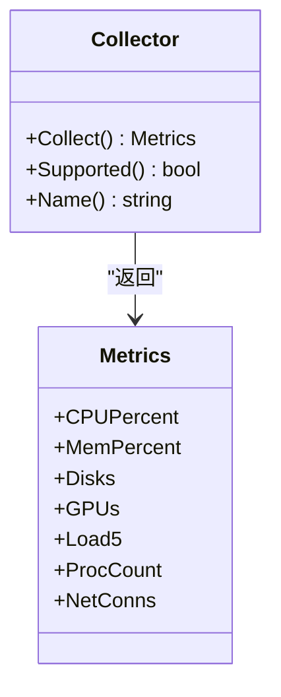

**图示来源**
- [cmd/agent/collector.go:12-16](file://cmd/agent/collector.go#L12-L16)

**章节来源**
- [README.md:142-145](file://README.md#L142-L145)
- [cmd/agent/collector.go:12-16](file://cmd/agent/collector.go#L12-L16)
- [config.example.json:1-16](file://config.example.json#L1-L16)

### 实时数据展示（交互式趋势图）
- 设计理念：纯 Canvas 渲染，避免重型 UI 框架开销；统一时间跨度控件（1h~30天），水平图例与渐变填充。
- 实现原理：前端拉取 /api/v1/hosts/{id}/history，根据 samples 构建多条序列，支持框选放大与双击还原。
- 配置方法：无需额外配置，默认启用；可在详情弹窗切换预设时间范围或自定义绝对区间。
- 使用场景：主机 CPU/内存/磁盘 IO/IOPS/进程数等趋势观察与问题定位。

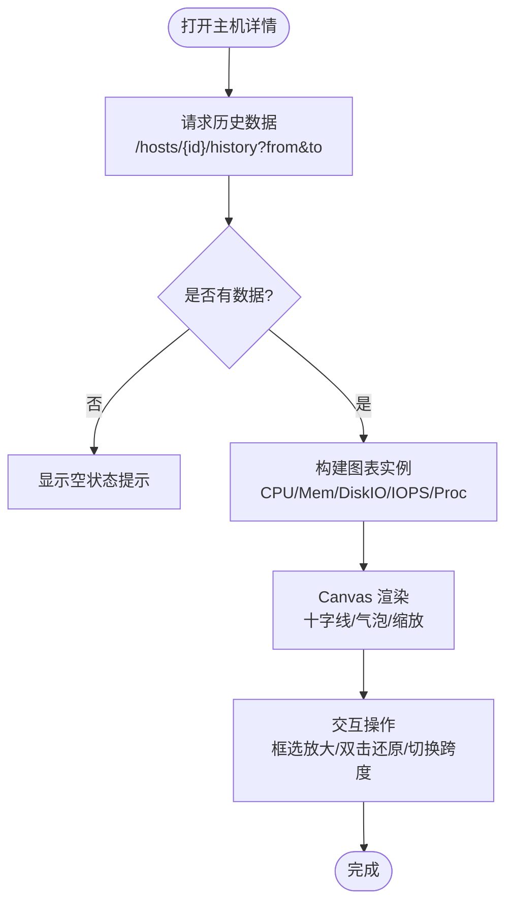

**图示来源**
- [cmd/server/web/js/hosts.js:297-470](file://cmd/server/web/js/hosts.js#L297-L470)

**章节来源**
- [README.md:145-146](file://README.md#L145-L146)
- [cmd/server/web/js/hosts.js:297-470](file://cmd/server/web/js/hosts.js#L297-L470)

### 智能告警系统（阈值与治理）
- 设计理念：27 组细粒度阈值（warn/crit），覆盖主机/拨测/API/任务/转发五大维度；触发/恢复各推一次，持久告警不刷屏。
- 实现原理：Evaluate/EvaluateForward 对主机快照与转发快照进行阈值判定，生成 Alert 列表；结合静默/抑制/路由规则进行治理。
- 配置方法：在「告警设置」可视化配置飞书/钉钉/邮件/短信/语音；阈值可通过 server_config.json 或面板逐项调整。
- 使用场景：CPU/内存/磁盘/GPU/负载异常、拨测失败、API 可用率下降、任务超时、转发带宽/错误率异常等。

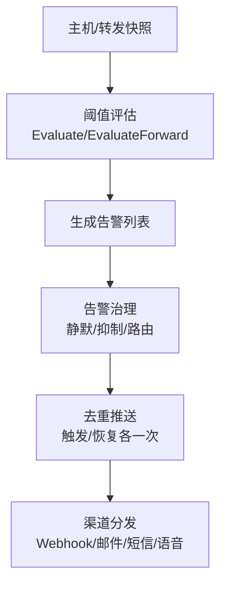

**图示来源**
- [cmd/server/alerts.go:204-464](file://cmd/server/alerts.go#L204-L464)
- [cmd/server/alerts.go:466-516](file://cmd/server/alerts.go#L466-L516)

**章节来源**
- [README.md:149-171](file://README.md#L149-L171)
- [cmd/server/alerts.go:10-52](file://cmd/server/alerts.go#L10-L52)
- [server_config.example.json:12-20](file://server_config.example.json#L12-L20)

### 自动化运维工具（Playbook）
- 设计理念：多步骤编排 + 目标选择（全部/分类/系统/主机）→ 批量并行执行 → 实时输出 + 历史报告。
- 实现原理：playbookManager 维护计划与执行记录；dueSchedules 基于 interval/daily/weekly 触发；ResolveTargets 解析目标主机集合。
- 配置方法：面板「自动化」页创建剧本，定义步骤命令、目标、超时、是否继续、变量注册、条件判断；支持模块（gather_facts/service/package/copy）。
- 使用场景：批量巡检、配置变更、服务重启、日志清理、故障自愈等。

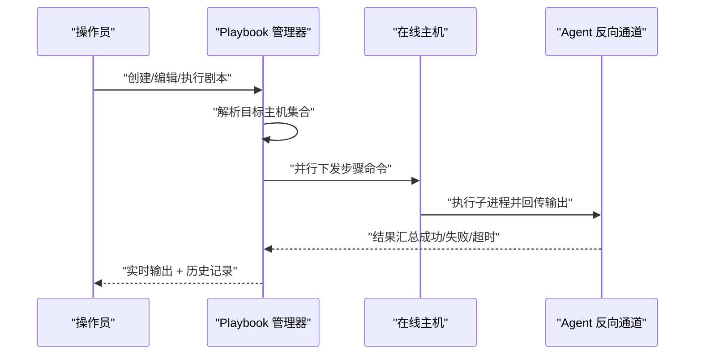

**图示来源**
- [cmd/server/playbook.go:151-198](file://cmd/server/playbook.go#L151-L198)
- [cmd/server/playbook.go:255-304](file://cmd/server/playbook.go#L255-L304)

**章节来源**
- [README.md:612-625](file://README.md#L612-L625)
- [cmd/server/playbook.go:10-52](file://cmd/server/playbook.go#L10-L52)
- [cmd/server/web/js/sre.js:1-30](file://cmd/server/web/js/sre.js#L1-L30)

### SRE 工作流（事件/自动修复/SLO/工单）
- 设计理念：以事件为中心，汇聚告警/SLO/手动事件，形成完整时间线；自动修复闭环（护栏 + 审批）；SLO/错误预算驱动；轻量工单流转。
- 实现原理：incident.go 定义事件与时间线；remediation.go 将告警映射到修复规则，触发 playbook 执行；handlers.go 暴露 RESTful API。
- 配置方法：在「SRE」页新建事件/规则/SLO/工单；自动修复规则匹配告警类型与主机，支持冷却/限频/人工审批。
- 使用场景：重大故障快速响应、SLA 保障、自动化自愈、协作排障与复盘。

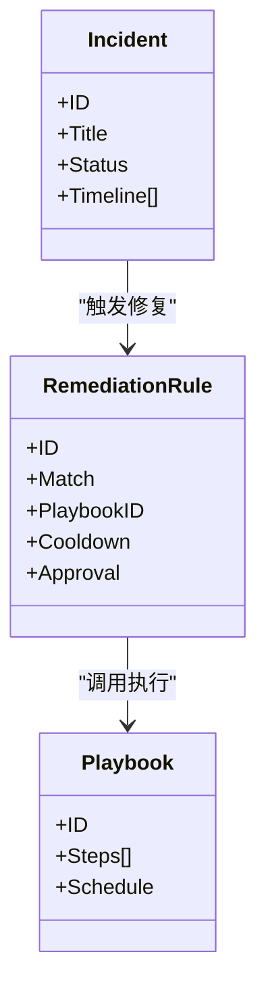

**图示来源**
- [cmd/server/incident.go:1-24](file://cmd/server/incident.go#L1-L24)
- [cmd/server/remediation.go:188-229](file://cmd/server/remediation.go#L188-L229)
- [cmd/server/handlers.go:175-194](file://cmd/server/handlers.go#L175-L194)

**章节来源**
- [README.md:156-157](file://README.md#L156-L157)
- [cmd/server/handlers.go:175-194](file://cmd/server/handlers.go#L175-L194)

### 日志管理与检索
- 设计理念：高吞吐、易用的第二观测支柱；Agent 增量 tail → 服务端内存环形缓冲 + 周期性持久化；支持分页与统计。
- 实现原理：logstore 维护 StoredLog 列表，search/searchPage 支持 host/level/keyword/time 过滤；recentErrors/errorCount 用于概览与 AI 上下文。
- 配置方法：Agent 通过 --log-paths 指定文件或目录；服务端默认开启加密上报（gzip + AES-256-GCM）。
- 使用场景：故障定位、审计追踪、AI 巡检上下文注入。

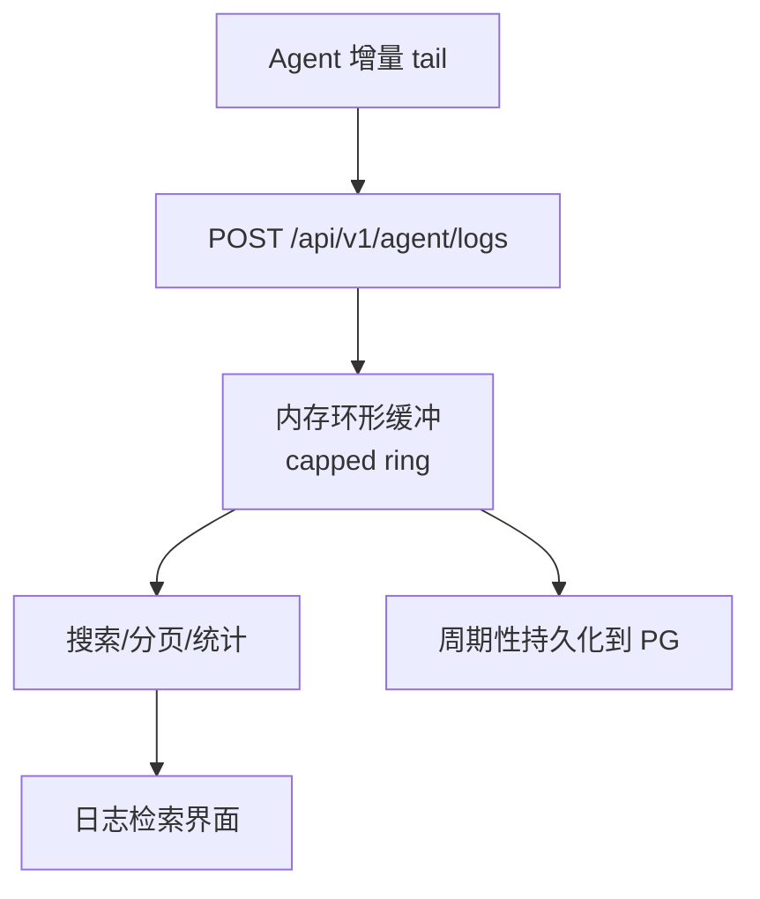

**图示来源**
- [cmd/server/logstore.go:80-166](file://cmd/server/logstore.go#L80-L166)

**章节来源**
- [README.md:157-158](file://README.md#L157-L158)
- [cmd/server/logstore.go:12-31](file://cmd/server/logstore.go#L12-L31)

### AI 增强功能（巡检/诊断/RAG/自主 Agent）
- 设计理念：可插拔 LLM（OpenAI 兼容），未配置时启发式兜底；RAG 嵌入模型与对话模型解耦；错误/告警日志纳入分析上下文。
- 实现原理：aiops.go 定时巡检 + 事件根因研判；pgvector 向量检索相似案例；chat SSE 流式对话 + Function Calling 工具调用。
- 配置方法：在「AI 配置」填写 LLM 端点/模型/密钥（经 AES-256-GCM 加密）；向量化模型端点与维度可配，支持连通性自检。
- 使用场景：健康巡检、根因分析、相似案例检索、自助问答与只读巡检。

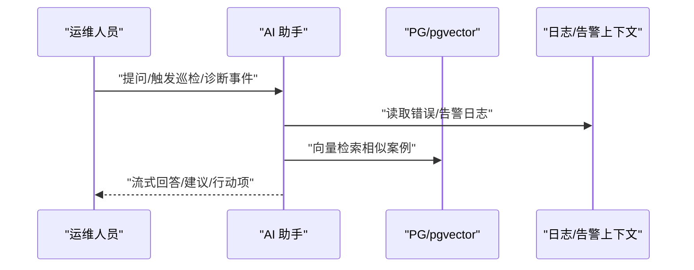

**图示来源**
- [README.md:766-789](file://README.md#L766-L789)

**章节来源**
- [README.md:766-789](file://README.md#L766-L789)

### 远程终端（免开端口）
- 设计理念：浏览器全 TTY，经 Agent 反向连接，被控端无需开放入站端口；支持多标签、录制回放、只读旁观、命令审计、二次认证。
- 实现原理：WebSocket 升级后建立双向流；Agent 侧 ConPTY/openpty 提供 TTY；服务端持久化录制到 PG。
- 配置方法：全局开关 terminal_disabled；跨外网需放行 WebSocket；支持二次密码认证。
- 使用场景：远程排障、协作调试、审计合规。

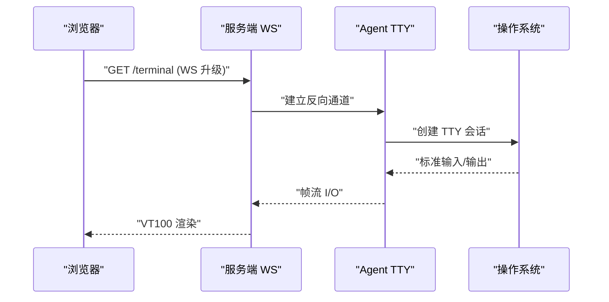

**图示来源**
- [README.md:688-699](file://README.md#L688-L699)

**章节来源**
- [README.md:688-699](file://README.md#L688-L699)

### 端口转发与 HTTP 代理
- 设计理念：经 Agent 隧道将远端主机的 TCP/UDP/HTTP 映射到服务端本地，无需目标主机开放端口；支持端口范围批量转发。
- 实现原理：forward 模块维护活跃会话与统计；HTTP 走无状态代理隧道直通 Web 服务，支持 WebSocket 升级。
- 配置方法：forward_listen/forward_port_range 环境变量或配置文件；Docker 部署需设为 0.0.0.0 并映射端口范围。
- 使用场景：数据库直连、内部 Web 服务访问、游戏/音视频 UDP 服务。

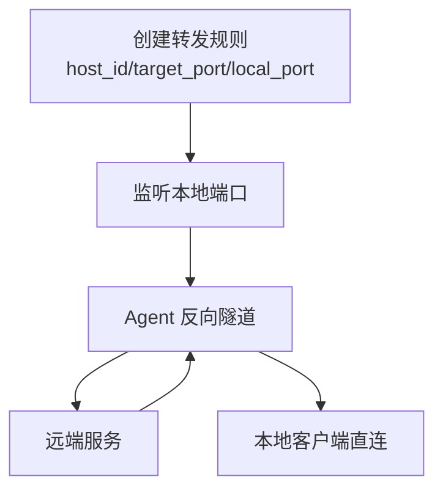

**图示来源**
- [README.md:627-685](file://README.md#L627-L685)

**章节来源**
- [README.md:627-685](file://README.md#L627-L685)

### 自定义拨测与 API 监控
- 设计理念：补齐「业务可用性」维度，批量黑盒拨测 HTTP/TCP/Ping/进程存活；复用高级 HTTP 探测引擎。
- 实现原理：checks 定时探测，结果写入 VM；apimon 按业务系统聚合接口指标（可用率/时延/P95/吞吐）。
- 配置方法：面板「监控」添加检查项；API 监控下挂多个接口（URL/方法/Header/Body/期望状态码/关键字/JSONPath/断言）。
- 使用场景：网站/微服务 SLA 监控、核心链路可用性看板。

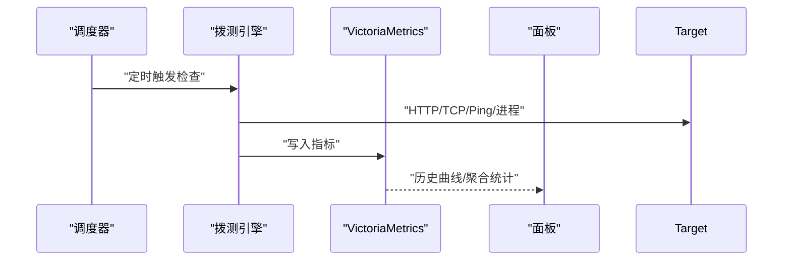

**图示来源**
- [README.md:597-609](file://README.md#L597-L609)
- [README.md:756-765](file://README.md#L756-L765)

**章节来源**
- [README.md:597-609](file://README.md#L597-L609)
- [README.md:756-765](file://README.md#L756-L765)

## 依赖关系分析
- 外部依赖：PostgreSQL（关系数据）、VictoriaMetrics（时序数据）、可选 LLM Provider（OpenAI 兼容）、云服务商（阿里云/华为云/腾讯云）短信与语音。
- 内部耦合：Alerts 依赖 Host 快照与 Thresholds；Playbook 依赖 Host 列表与 Agent 通道；Remediation 依赖 Playbook 与 Incident；LogStore 独立但为 AI 提供上下文。
- 潜在风险：PG/VM 不可用导致服务拒绝启动；LLM 不可用时回退启发式；Agent 安全模块（SELinux/AppArmor/kysec）可能拦截数据采集。

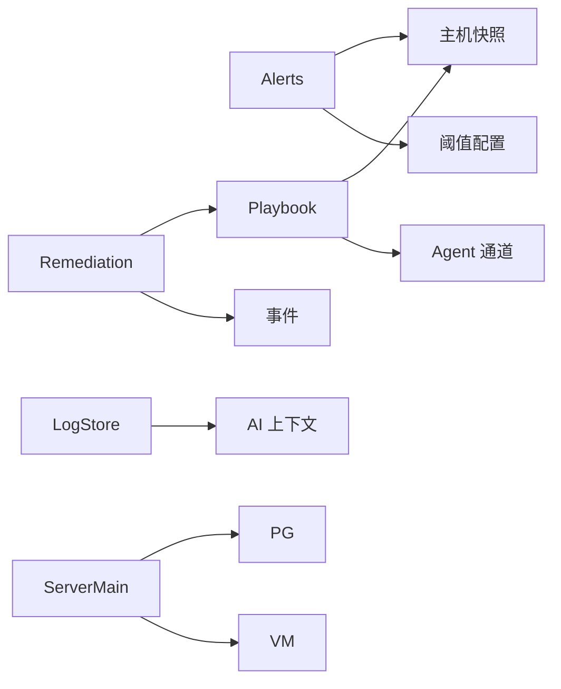

**图示来源**
- [cmd/server/alerts.go:204-464](file://cmd/server/alerts.go#L204-L464)
- [cmd/server/playbook.go:255-304](file://cmd/server/playbook.go#L255-L304)
- [cmd/server/remediation.go:188-229](file://cmd/server/remediation.go#L188-L229)
- [cmd/server/logstore.go:80-166](file://cmd/server/logstore.go#L80-L166)
- [cmd/server/main.go:255-273](file://cmd/server/main.go#L255-L273)

**章节来源**
- [cmd/server/main.go:255-273](file://cmd/server/main.go#L255-L273)
- [cmd/server/alerts.go:204-464](file://cmd/server/alerts.go#L204-L464)
- [cmd/server/playbook.go:255-304](file://cmd/server/playbook.go#L255-L304)
- [cmd/server/remediation.go:188-229](file://cmd/server/remediation.go#L188-L229)
- [cmd/server/logstore.go:80-166](file://cmd/server/logstore.go#L80-L166)

## 性能与规模
- 带宽优化：gzip 压缩 ~8-10 倍，多主机轮询下行从 MB/s 降到百 KB/s 级。
- 上报吞吐：3000 台 × 每 10s ≈ 300 次/s，Upsert 仅短暂持写锁。
- 内存占用：每台三层历史 ~1-2 MB，3000 台约需 4-7 GB（可调保留常量换取更低内存）。
- 渲染优化：主机列表分页（每页 9），DOM 只渲染当前页。
- 调优建议：主机多时增大 --interval（如 10-15s）降低上报/带宽。

**章节来源**
- [README.md:1108-1117](file://README.md#L1108-L1117)

## 故障排查指南
- 启动失败：检查 AIOPS_POSTGRES_DSN 与 AIOPS_VM_URL 是否配置；PG 冷启动重试窗口结束后仍失败会终止服务。
- 告警风暴：启用告警治理（静默/抑制/路由），合理设置阈值与冷却时间。
- 终端无法连接：确认跨外网 Nginx 配置放行 WebSocket；检查 terminal_disabled 与二次认证策略。
- 转发异常：核对 forward_listen/forward_port_range 与 Docker ports 映射；查看转发统计（连接数/带宽/错误率/延迟）。
- 日志缺失：确认 Agent --log-paths 配置正确；检查加密上报开关与服务端接收接口。

**章节来源**
- [cmd/server/main.go:255-273](file://cmd/server/main.go#L255-L273)
- [README.md:688-699](file://README.md#L688-L699)
- [README.md:627-685](file://README.md#L627-L685)
- [cmd/server/logstore.go:80-166](file://cmd/server/logstore.go#L80-L166)

## 结论
AIOps Monitor 以“零第三方依赖 Agent + 统一存储 + 全栈自研”为核心优势，提供从采集、告警、终端、自动化到 SRE 与 AI 的完整闭环。其差异化特性（GPU 监控、交互式趋势图、免开端口终端、多云短信语音通知、AES-256-GCM 静态加密与可选 TLS）使其在小团队与企业环境中均具备高性价比与易用性。建议在生产环境启用 TLS、合理配置阈值与治理规则、并结合 RAG 与自主 Agent 提升排障效率。

## 附录：配置与使用示例
- Agent 配置（config.example.json）：server/servers/report_interval/plugin_interval/disk_path/plugins_dir/python/state_file/category/token。
- 服务端配置（server_config.example.json）：alerts_enabled/feishu/dingtalk/thresholds/categories/install_token/require_token/mfa_required/forward_listen/forward_port_range/account/checks。
- 环境变量覆盖：AIOPS_POSTGRES_DSN/AIOPS_VM_URL/AIOPS_SECRET_KEY/AIOPS_TLS_CERT/AIOPS_TLS_KEY/AIOPS_FORWARD_LISTEN/AIOPS_FORWARD_PORT_RANGE/AIOPS_RELAY_SECRET/AIOPS_FORWARD_DISABLED/AIOPS_TERMINAL_DISABLED/AIOPS_ALLOW_ANONYMOUS_AGENTS/AIOPS_TRUST_PROXY/AIOPS_REQUIRE_TOKEN。
- 使用示例：
  - 一键安装 Agent：面板右上角「安装 Agent」→ 选择目标系统 → 复制命令到被监控主机执行。
  - 创建拨测：面板「监控」→ 添加 HTTP/TCP/Ping/进程检查项。
  - 编排剧本：面板「自动化」→ 创建剧本 → 选择目标 → 执行并查看历史。
  - 配置告警：面板「告警设置」→ 填写 Webhook/SMTP/短信/语音 → 保存并测试。
  - 启用远程终端：面板「主机」→ 点击终端图标 → 多标签/录制/旁观/审计。
  - 接入 AI：面板「AI 配置」→ 填写 LLM 端点/模型/密钥 → 启用巡检与诊断。

**章节来源**
- [config.example.json:1-16](file://config.example.json#L1-L16)
- [server_config.example.json:1-36](file://server_config.example.json#L1-L36)
- [README.md:383-576](file://README.md#L383-L576)
- [README.md:268-379](file://README.md#L268-L379)
- [cmd/server/web/js/settings.js:525-545](file://cmd/server/web/js/settings.js#L525-L545)