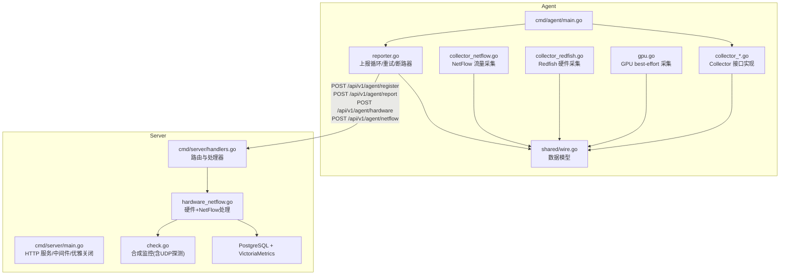
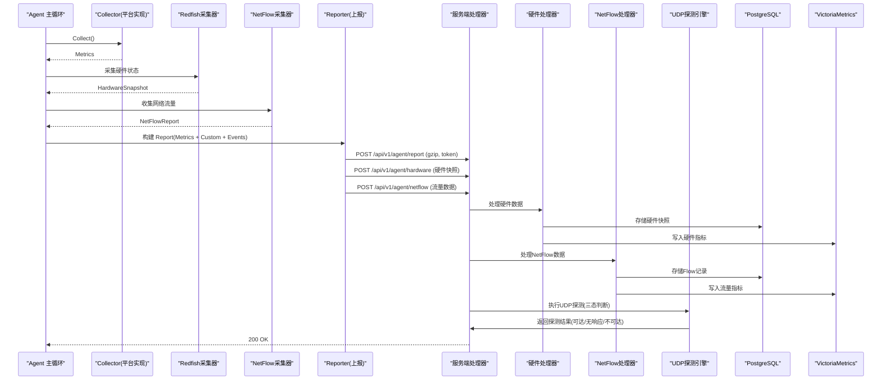
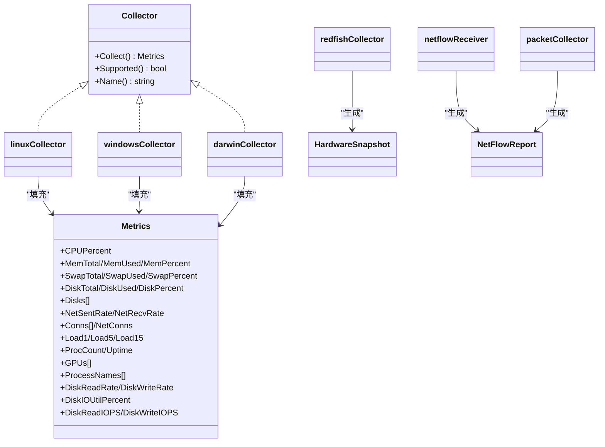
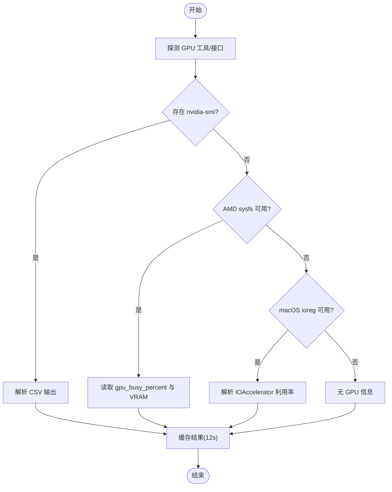
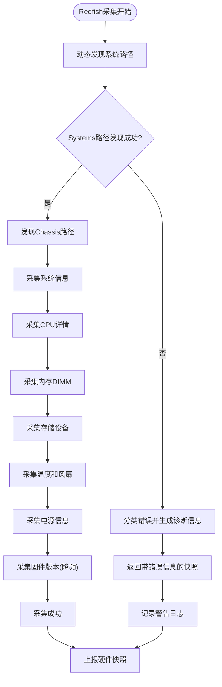
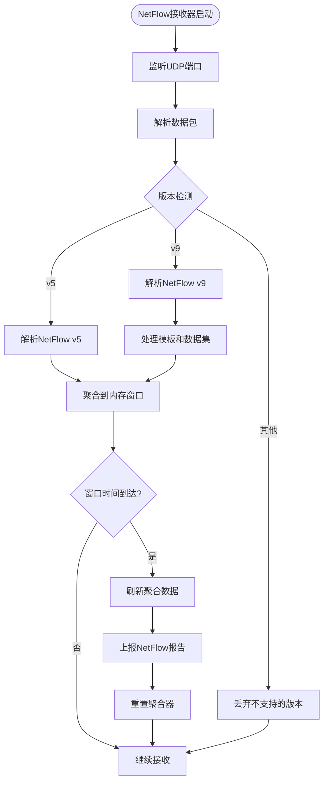
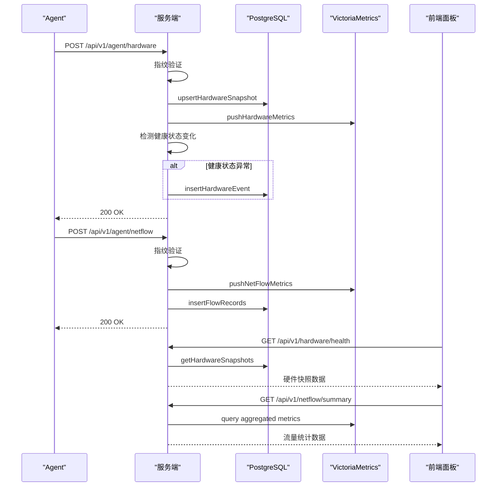
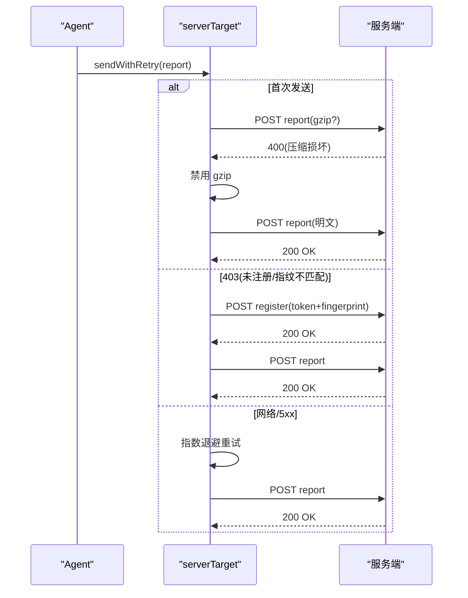
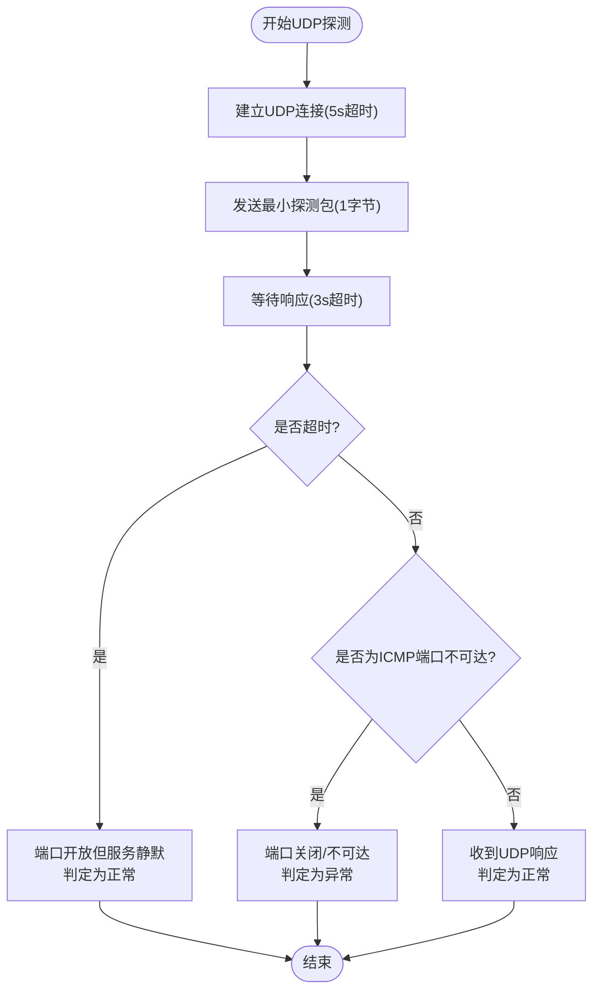
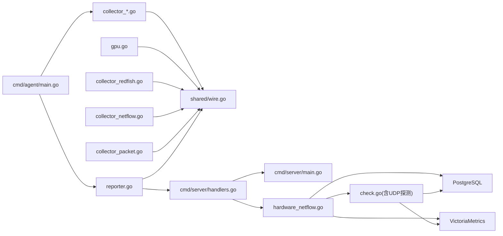

# 监控系统

<cite>
**本文引用的文件**   
- [README.md](file://README.md)
- [cmd/agent/main.go](file://cmd/agent/main.go)
- [cmd/agent/collector.go](file://cmd/agent/collector.go)
- [cmd/agent/collector_linux.go](file://cmd/agent/collector_linux.go)
- [cmd/agent/collector_windows.go](file://cmd/agent/collector_windows.go)
- [cmd/agent/collector_darwin.go](file://cmd/agent/collector_darwin.go)
- [cmd/agent/gpu.go](file://cmd/agent/gpu.go)
- [cmd/agent/reporter.go](file://cmd/agent/reporter.go)
- [cmd/agent/collector_redfish.go](file://cmd/agent/collector_redfish.go)
- [cmd/agent/collector_netflow.go](file://cmd/agent/collector_netflow.go)
- [cmd/agent/collector_packet.go](file://cmd/agent/collector_packet.go)
- [shared/wire.go](file://shared/wire.go)
- [config.example.json](file://config.example.json)
- [server_config.example.json](file://server_config.example.json)
- [cmd/server/main.go](file://cmd/server/main.go)
- [cmd/server/handlers.go](file://cmd/server/handlers.go)
- [cmd/server/check.go](file://cmd/server/check.go)
- [cmd/server/config.go](file://cmd/server/config.go)
- [cmd/server/alerts.go](file://cmd/server/alerts.go)
- [cmd/server/hardware_netflow.go](file://cmd/server/hardware_netflow.go)
- [cmd/server/web/js/hardware.js](file://cmd/server/web/js/hardware.js)
- [cmd/server/web/js/netflow.js](file://cmd/server/web/js/netflow.js)
</cite>

## 更新摘要
**变更内容**   
- v6.2.5: 增强硬件监控系统诊断能力，提供可操作的错误信息到应用日志
- v6.2.6: 修复硬件和NetFlow仪表板数据显示问题的关键bug
- 新增Redfish采集器的智能错误分类和诊断提示功能
- 改进硬件快照存储和查询逻辑，确保数据正确显示
- 优化NetFlow数据处理流程，修复前端展示问题

## 目录
1. [简介](#简介)
2. [项目结构](#项目结构)
3. [核心组件](#核心组件)
4. [架构总览](#架构总览)
5. [详细组件分析](#详细组件分析)
6. [依赖关系分析](#依赖关系分析)
7. [性能与内存优化](#性能与内存优化)
8. [配置与使用示例](#配置与使用示例)
9. [故障排除指南](#故障排除指南)
10. [结论](#结论)

## 简介
本文件系统性地梳理 AIOps Monitor 的跨平台主机监控能力，涵盖 CPU、内存、磁盘、网络、TCP/UDP 连接、负载、进程、运行时长以及 GPU 指标采集；说明 Agent 端在不同操作系统（Linux/Windows/macOS）上的适配策略、数据采集频率控制与内存优化实践；并给出服务端接收、存储与展示的关键流程。文档同时提供阈值自定义、告警治理、API 监控、拨测等扩展能力的概览与参考路径，帮助读者快速上手与深度定制。

**更新** v6.2.5版本增强了硬件监控系统的诊断能力，提供详细的错误信息和操作建议；v6.2.6版本修复了硬件和NetFlow仪表板的数据显示问题。

## 项目结构
仓库采用"单二进制服务端 + 零依赖 Agent"的架构：
- cmd/server：Go 编写的服务端，负责 HTTP API、WebSocket 终端/转发、告警评估、SRE 工作流、AI 巡检、日志聚合、VictoriaMetrics 写入等。
- cmd/agent：Go 编写的 Agent，原生采集系统指标并通过 HTTP 上报至服务端，支持多服务端广播、插件层（Python）、日志采集与加密上报。
- shared：Agent 与服务端共享的数据模型（Metrics、Report、GPUInfo、HardwareSnapshot、NetFlowReport 等）。
- plugins：Python 插件 SDK 与示例，用于扩展自定义指标与事件。
- web：前端资源（嵌入到服务端二进制），提供趋势图、主机卡片、告警治理、远程终端等交互界面。

**图表来源**
- [cmd/agent/main.go:74-238](file://cmd/agent/main.go#L74-L238)
- [cmd/agent/collector.go:1-32](file://cmd/agent/collector.go#L1-L32)
- [cmd/agent/gpu.go:1-126](file://cmd/agent/gpu.go#L1-L126)
- [cmd/agent/reporter.go:255-370](file://cmd/agent/reporter.go#L255-L370)
- [cmd/agent/collector_redfish.go:1-638](file://cmd/agent/collector_redfish.go#L1-L638)
- [cmd/agent/collector_netflow.go:1-484](file://cmd/agent/collector_netflow.go#L1-L484)
- [shared/wire.go:1-279](file://shared/wire.go#L1-L279)
- [cmd/server/main.go:227-355](file://cmd/server/main.go#L227-L355)
- [cmd/server/handlers.go:96-346](file://cmd/server/handlers.go#L96-L346)
- [cmd/server/hardware_netflow.go:1-369](file://cmd/server/hardware_netflow.go#L1-L369)
- [cmd/server/check.go:572-605](file://cmd/server/check.go#L572-L605)

章节来源
- [README.md:1-176](file://README.md#L1-L176)
- [cmd/server/main.go:227-355](file://cmd/server/main.go#L227-L355)
- [cmd/server/handlers.go:96-346](file://cmd/server/handlers.go#L96-L346)

## 核心组件
- Agent 主程序：解析配置与命令行参数，初始化安全环境检测、TLS 信任链、Relay 中继模式、主机身份与指纹，启动采集与上报循环。
- 采集器（Collector）：按平台实现基础指标采集，统一通过 Collector 接口返回 Metrics。
- GPU 采集：best-effort 策略，优先 nvidia-smi，其次 AMD sysfs 或 macOS ioreg，结果缓存约 12s。
- **新增** Redfish 硬件采集器：支持 BMC/iDRAC/iLO 设备监控，包含智能错误分类和诊断提示。
- **新增** NetFlow 流量采集器：支持 NetFlow v5/v9 协议解析，五元组包采集和网络流量分析。
- 上报器（Reporter）：封装 HTTP 传输、gzip 压缩、重试、熔断、注册与日志密钥协商，支持多服务端并发上报。
- 共享数据模型：Metrics、Report、GPUInfo、ConnStat、DiskInfo、HardwareSnapshot、NetFlowReport 等，确保前后端一致。
- 服务端：HTTP 路由、鉴权、告警评估、持久化（PG+VM）、WebSocket 终端/转发、日志聚合、AI 巡检与诊断。
- **新增** 硬件监控处理器：专门处理硬件快照数据和健康状态变化检测。
- **新增** NetFlow 处理器：处理网络流量数据聚合和统计分析。
- **新增** UDP探测引擎：实现三态判断逻辑，支持ICMP端口不可达、UDP响应和超时的精确识别。

章节来源
- [cmd/agent/main.go:74-238](file://cmd/agent/main.go#L74-L238)
- [cmd/agent/collector.go:1-32](file://cmd/agent/collector.go#L1-L32)
- [cmd/agent/gpu.go:1-126](file://cmd/agent/gpu.go#L1-L126)
- [cmd/agent/reporter.go:255-370](file://cmd/agent/reporter.go#L255-L370)
- [cmd/agent/collector_redfish.go:1-638](file://cmd/agent/collector_redfish.go#L1-L638)
- [cmd/agent/collector_netflow.go:1-484](file://cmd/agent/collector_netflow.go#L1-L484)
- [shared/wire.go:1-279](file://shared/wire.go#L1-L279)
- [cmd/server/main.go:227-355](file://cmd/server/main.go#L227-L355)
- [cmd/server/handlers.go:96-346](file://cmd/server/handlers.go#L96-L346)
- [cmd/server/hardware_netflow.go:1-369](file://cmd/server/hardware_netflow.go#L1-L369)
- [cmd/server/check.go:572-605](file://cmd/server/check.go#L572-L605)

## 架构总览
Agent 每 N 秒采集一次系统指标，合并插件产生的自定义指标与事件，构建 Report 并发推送至所有配置的服务端。**新增硬件监控和NetFlow流量采集功能，通过专用处理器进行数据存储和分析**。服务端对每个请求进行限流、CORS、CSP、gzip 压缩与安全头加固，随后将时序数据写入 VictoriaMetrics，关系数据写入 PostgreSQL，并在面板中实时呈现。**新增UDP探测功能作为合成监控的一部分，提供三态判断逻辑和阈值告警。**

**图表来源**
- [cmd/agent/reporter.go:452-567](file://cmd/agent/reporter.go#L452-L567)
- [cmd/server/handlers.go:96-346](file://cmd/server/handlers.go#L96-L346)
- [cmd/server/hardware_netflow.go:19-95](file://cmd/server/hardware_netflow.go#L19-L95)
- [cmd/server/main.go:227-355](file://cmd/server/main.go#L227-L355)
- [cmd/server/check.go:572-605](file://cmd/server/check.go#L572-L605)

## 详细组件分析

### Agent 主程序与生命周期
- 配置加载：从配置文件与命令行参数合并，支持多服务端 servers 数组优先于单 server。
- 安全与环境：检测麒麟 kysec/SELinux/AppArmor/firewalld/Defender/SIP 等模块，输出修复建议或自动切换宽容模式（可配置）。
- TLS 信任：支持跳过校验或指定 CA PEM，统一应用到所有 Agent→Server 的 HTTP 客户端。
- Relay 中继：作为网关代理内网机器访问云端，仅该节点需联网。
- 主循环：注册 → 周期采集 → 并发上报（含重试/熔断/降级）→ 插件执行（独立周期）→ 终端/转发/日志通道。

章节来源
- [cmd/agent/main.go:74-238](file://cmd/agent/main.go#L74-L238)

### 采集器接口与平台实现
- 接口定义：Collector.Collect() 返回 Metrics，Supported()/Name() 用于运行时选择与提示。
- Linux：
  - CPU：/proc/stat 差分计算利用率。
  - 内存/SWAP：/proc/meminfo 解析。
  - 磁盘：/proc/mounts + syscall.Statfs 枚举本地盘，过滤伪文件系统与 /boot。
  - 网络：/proc/net/dev 累计字节差分得速率。
  - TCP/UDP：/proc/net/{tcp,tcp6,udp,udp6} 统计各状态数与总数。
  - 负载：/proc/loadavg。
  - 进程：/proc 枚举计数与名称（兼容权限受限降级为 cmdline）。
  - 运行时长：/proc/uptime。
  - GPU：nvidia-smi 优先，否则 amdgpu sysfs。
  - 优化：磁盘枚举与进程列表缓存（TTL 60s/20s），避免频繁 I/O。
- Windows：
  - CPU：GetSystemTimes。
  - 内存/SWAP：GlobalMemoryStatusEx 推导页文件使用。
  - 磁盘：GetLogicalDrives + GetDiskFreeSpaceExW。
  - 网络：GetIfTable 累计字节差分。
  - 磁盘 IO：IOCTL_DISK_PERFORMANCE 累计差分为速率与 IOPS。
  - TCP/UDP：GetTcpTable/GetUdpTable。
  - 进程：CreateToolhelp32Snapshot 列举名称。
  - 运行时长：GetTickCount64。
  - 负载：基于 CPU%×核数的 EWMA 近似。
  - GPU：nvidia-smi（best-effort）。
- macOS：
  - CPU：top -l 2 解析 idle。
  - 内存/SWAP：sysctl vm.swapusage + vm_stat 页面统计。
  - 磁盘：syscall.Statfs + df -kP 枚举卷。
  - 网络：netstat -ibn 累计字节差分。
  - 磁盘 IO：ioreg 汇总 IOBlockStorageDriver 累计值差分。
  - TCP/UDP：netstat -an -p tcp/udp。
  - 负载：sysctl vm.loadavg。
  - 进程：ps -A 计数与名称。
  - 运行时长：sysctl kern.boottime。
  - GPU：ioreg IOAccelerator 获取利用率。

**图表来源**
- [cmd/agent/collector.go:1-32](file://cmd/agent/collector.go#L1-L32)
- [cmd/agent/collector_linux.go:1-617](file://cmd/agent/collector_linux.go#L1-L617)
- [cmd/agent/collector_windows.go:1-551](file://cmd/agent/collector_windows.go#L1-L551)
- [cmd/agent/collector_darwin.go:1-548](file://cmd/agent/collector_darwin.go#L1-L548)
- [cmd/agent/collector_redfish.go:1-638](file://cmd/agent/collector_redfish.go#L1-L638)
- [cmd/agent/collector_netflow.go:1-484](file://cmd/agent/collector_netflow.go#L1-L484)
- [cmd/agent/collector_packet.go:1-113](file://cmd/agent/collector_packet.go#L1-L113)
- [shared/wire.go:1-279](file://shared/wire.go#L1-L279)

章节来源
- [cmd/agent/collector.go:1-32](file://cmd/agent/collector.go#L1-L32)
- [cmd/agent/collector_linux.go:1-617](file://cmd/agent/collector_linux.go#L1-L617)
- [cmd/agent/collector_windows.go:1-551](file://cmd/agent/collector_windows.go#L1-L551)
- [cmd/agent/collector_darwin.go:1-548](file://cmd/agent/collector_darwin.go#L1-L548)
- [shared/wire.go:1-279](file://shared/wire.go#L1-L279)

### GPU 监控（跨平台 best-effort）
- 策略：优先调用厂商工具（nvidia-smi），失败则回退 OS 接口（AMD sysfs、macOS ioreg）。
- 缓存：结果缓存约 12s，避免高频 fork 外部命令导致阻塞。
- 字段：利用率、显存占用/总量/百分比、温度（若可用）。

**图表来源**
- [cmd/agent/gpu.go:1-126](file://cmd/agent/gpu.go#L1-L126)
- [cmd/agent/collector_linux.go:211-248](file://cmd/agent/collector_linux.go#L211-L248)
- [cmd/agent/collector_darwin.go:149-197](file://cmd/agent/collector_darwin.go#L149-L197)

章节来源
- [cmd/agent/gpu.go:1-126](file://cmd/agent/gpu.go#L1-L126)
- [cmd/agent/collector_linux.go:211-248](file://cmd/agent/collector_linux.go#L211-L248)
- [cmd/agent/collector_darwin.go:149-197](file://cmd/agent/collector_darwin.go#L149-L197)

### Redfish 硬件监控采集器（v6.2.5增强）
**更新** v6.2.5版本大幅增强了硬件监控系统的诊断能力，提供详细的错误信息和操作建议。

#### 智能错误分类与诊断
Redfish采集器实现了智能错误分类系统，能够识别常见的BMC连接问题并提供具体的解决建议：

| 错误类型 | 诊断信息 | 解决建议 |
|---------|----------|----------|
| TLS握手失败 | "TLS 握手失败：已启用 TLS 1.0+ 兼容模式，若仍失败请检查 BMC 固件版本是否过低，或尝试升级 iDRAC/iLO 固件" | 升级BMC固件或调整TLS配置 |
| 证书错误 | "TLS 证书错误：请在配置中设置 skip_tls_verify=true" | 配置证书验证选项 |
| 连接拒绝 | "连接被拒绝：请检查 BMC 地址和端口是否正确，以及防火墙是否放行" | 检查网络连接和防火墙规则 |
| DNS解析失败 | "DNS 解析失败：请检查 BMC 地址是否可达" | 验证DNS配置和网络连通性 |
| 认证失败 | "认证失败：请检查 username 和 password_env 环境变量是否正确" | 确认凭据配置 |

#### 密码管理优化
- 支持环境变量密码（password_env）和直接密码（password）两种方式
- 当环境变量为空时提供详细的诊断信息，包括systemd服务配置建议
- 密码不落盘，提高安全性

#### 硬件数据采集流程
1. 动态发现Systems和Chassis路径（兼容不同厂商）
2. 采集CPU、内存、存储、温度、风扇、电源等硬件信息
3. 降频采集固件版本（每小时一次）
4. 连续失败3次后自动退避5分钟
5. 生成包含错误信息的完整快照

**图表来源**
- [cmd/agent/collector_redfish.go:292-324](file://cmd/agent/collector_redfish.go#L292-L324)
- [cmd/agent/collector_redfish.go:327-600](file://cmd/agent/collector_redfish.go#L327-L600)

章节来源
- [cmd/agent/collector_redfish.go:1-638](file://cmd/agent/collector_redfish.go#L1-L638)
- [shared/wire.go:145-237](file://shared/wire.go#L145-L237)

### NetFlow 网络流量采集器
**更新** v6.2.6版本修复了NetFlow仪表板的数据显示问题，确保流量数据正确展示。

#### 双模式设计
| 模式 | 触发方式 | 数据流 |
|---|---|---|
| **被动接收** | 防火墙/交换机主动推送 Flow 到 Agent UDP 端口 | `net.ListenPacket("udp", ":2055")` → 解析 → 聚合 |
| **主动采集** | Agent 定时轮询设备 API（SNMP / REST）获取 Flow 统计 | HTTP/SNMP GET → 解析 → 聚合 |

#### 协议支持
- **NetFlow v5**：固定格式解析，支持标准五元组信息
- **NetFlow v9**：模板化协议，支持动态字段定义
- **五元组包采集**：基于Linux nf_conntrack的系统级流量监控

#### 内存聚合机制
- 时间窗口聚合（默认300秒）
- 内存容量限制（默认10万条流）
- 低流量条目淘汰策略
- 批量上报减少网络开销

**图表来源**
- [cmd/agent/collector_netflow.go:203-263](file://cmd/agent/collector_netflow.go#L203-L263)
- [cmd/agent/collector_netflow.go:265-484](file://cmd/agent/collector_netflow.go#L265-L484)

章节来源
- [cmd/agent/collector_netflow.go:1-484](file://cmd/agent/collector_netflow.go#L1-L484)
- [cmd/agent/collector_packet.go:59-113](file://cmd/agent/collector_packet.go#L59-L113)
- [shared/wire.go:243-279](file://shared/wire.go#L243-L279)

### 服务端硬件和NetFlow处理
**更新** v6.2.6版本修复了硬件和NetFlow仪表板的数据显示问题。

#### 硬件数据处理
- 指纹验证确保安全接入
- 硬件快照UPSERT存储（按host_id和target_name去重）
- 健康状态变化检测和事件记录
- 数值指标写入VictoriaMetrics用于趋势分析

#### NetFlow数据处理
- 流量记录聚合和统计
- 支持按维度（源IP、目的IP、端口等）的Top-N分析
- 原始Flow记录存储用于详细查询
- 丢包率监控和告警

**图表来源**
- [cmd/server/hardware_netflow.go:19-95](file://cmd/server/hardware_netflow.go#L19-L95)
- [cmd/server/hardware_netflow.go:101-282](file://cmd/server/hardware_netflow.go#L101-L282)

章节来源
- [cmd/server/hardware_netflow.go:1-369](file://cmd/server/hardware_netflow.go#L1-L369)
- [cmd/server/pgstore.go:1277-1288](file://cmd/server/pgstore.go#L1277-L1288)

### 前端仪表板显示修复
**更新** v6.2.6版本修复了硬件和NetFlow仪表板的数据显示问题。

#### 硬件面板改进
- 修复快照数据结构解析问题
- 改进空状态处理和加载反馈
- 优化错误信息显示和用户引导
- 增强数据容错性和兼容性

#### NetFlow面板优化
- 修复流量数据统计逻辑
- 改进筛选和搜索功能
- 优化CSV导出功能
- 增强错误处理和用户反馈

章节来源
- [cmd/server/web/js/hardware.js:1-168](file://cmd/server/web/js/hardware.js#L1-L168)
- [cmd/server/web/js/netflow.js:1-198](file://cmd/server/web/js/netflow.js#L1-L198)

### 上报机制与可靠性
- 传输：HTTP/1.1（禁用 HTTP/2 以改善重启恢复），连接池复用，超时与保活合理设置。
- 压缩：大于阈值时 gzip，遇 400 自动降级（外网代理可能损坏 gzip）。
- 重试：同周期内最多 3 次，间隔 1s；403 触发重新注册；其他错误走指数退避。
- 熔断：连续失败达到阈值打开断路器，冷却后半开试探，降低无效连接开销。
- 多服务端：采集一次，广播到所有目标，互不影响；任一成功即认为事件已投递。

**图表来源**
- [cmd/agent/reporter.go:139-253](file://cmd/agent/reporter.go#L139-L253)
- [cmd/agent/reporter.go:452-567](file://cmd/agent/reporter.go#L452-L567)

章节来源
- [cmd/agent/reporter.go:139-253](file://cmd/agent/reporter.go#L139-L253)
- [cmd/agent/reporter.go:452-567](file://cmd/agent/reporter.go#L452-L567)

### UDP探测引擎（新增功能）
**更新** 新增UDP探测功能，实现三态判断逻辑，支持ICMP端口不可达、UDP响应和超时的精确识别。

#### 三态判断逻辑
UDP探测引擎实现了精确的三态判断：
- **ICMP端口不可达**：立即返回端口关闭/不可达状态
- **UDP响应**：收到任何UDP响应包，判定服务存活
- **超时**：3秒内无响应，判定为端口开放但服务静默（如DNS无有效查询）

**图表来源**
- [cmd/server/check.go:572-605](file://cmd/server/check.go#L572-L605)

#### 阈值配置与预设级别
UDP探测支持三个预设级别的阈值配置：

| 预设级别 | 警告阈值(ms) | 严重阈值(ms) | 适用场景 |
|---------|-------------|-------------|----------|
| ConservativeThresholds | 500 | 2000 | 生产关键系统，敏感预警 |
| StandardThresholds | 1000 | 5000 | 推荐默认，平衡噪音/敏感度 |
| RelaxedThresholds | 3000 | 10000 | 开发/测试环境，低噪音 |

**章节来源**
- [cmd/server/check.go:572-605](file://cmd/server/check.go#L572-L605)
- [cmd/server/alerts.go:83](file://cmd/server/alerts.go#L83)
- [cmd/server/alerts.go:119](file://cmd/server/alerts.go#L119)
- [cmd/server/alerts.go:155](file://cmd/server/alerts.go#L155)

### 服务端处理与存储
- 中间件：CORS、安全头（X-Content-Type-Options、X-Frame-Options、CSP 等）、Body 大小限制、gzip 响应压缩（跳过 WS/代理/终端）。
- 路由：注册、上报、主机/历史/活动、告警、事件、配置、登录、MFA、拨测、API 监控、Playbook、SRE、日志、AI、消息中心、转发、HTTP 代理等。
- 存储：强制依赖 PostgreSQL（关系数据）与 VictoriaMetrics（时序数据），缺失任一拒绝启动。
- 优雅关闭：SIGINT/SIGTERM 下停止接受新连接，等待活跃请求完成，刷新 PG 后退出。

章节来源
- [cmd/server/main.go:227-355](file://cmd/server/main.go#L227-L355)
- [cmd/server/handlers.go:96-346](file://cmd/server/handlers.go#L96-L346)

## 依赖关系分析
- Agent 内部耦合：
  - main.go 依赖 collector_* 与 reporter.go，通过 shared.Metrics/Report 解耦。
  - gpu.go 被各平台 collector 复用，减少重复代码。
  - **新增** redfishCollector 和 netflowReceiver 作为独立的采集模块。
- 平台差异：
  - Linux 通过 procfs/syscall，Windows 通过 Win32 API，macOS 通过 sysctl/ioreg/netstat/top。
- 服务端依赖：
  - handlers.go 集中路由，main.go 注入中间件与生命周期管理。
  - 存储后端强依赖 PG+VM，保证一致性。
  - **新增** hardware_netflow.go 专门处理硬件和NetFlow数据。
  - **新增** check.go 集成UDP探测功能，与告警系统紧密集成。

**图表来源**
- [cmd/agent/main.go:74-238](file://cmd/agent/main.go#L74-L238)
- [cmd/agent/collector.go:1-32](file://cmd/agent/collector.go#L1-L32)
- [cmd/agent/gpu.go:1-126](file://cmd/agent/gpu.go#L1-L126)
- [cmd/agent/reporter.go:255-370](file://cmd/agent/reporter.go#L255-L370)
- [cmd/agent/collector_redfish.go:1-638](file://cmd/agent/collector_redfish.go#L1-L638)
- [cmd/agent/collector_netflow.go:1-484](file://cmd/agent/collector_netflow.go#L1-L484)
- [cmd/agent/collector_packet.go:1-113](file://cmd/agent/collector_packet.go#L1-L113)
- [shared/wire.go:1-279](file://shared/wire.go#L1-L279)
- [cmd/server/handlers.go:96-346](file://cmd/server/handlers.go#L96-L346)
- [cmd/server/main.go:227-355](file://cmd/server/main.go#L227-L355)
- [cmd/server/hardware_netflow.go:1-369](file://cmd/server/hardware_netflow.go#L1-L369)
- [cmd/server/check.go:572-605](file://cmd/server/check.go#L572-L605)

## 性能与内存优化
- 采集侧优化：
  - Linux：磁盘枚举与进程列表缓存（TTL 60s/20s），减少 /proc 扫描次数；rate 函数避免计数器回绕导致的异常尖峰。
  - Windows：复用缓冲池（如 ifTable 缓冲区），避免每次分配大内存；IOCTL 累计差分计算 IO 速率与 IOPS。
  - macOS：命令执行带超时（top/ioreg/netstat），防止系统工具挂起拖垮报告循环。
  - **新增** Redfish采集：动态路径发现缓存，降频采集固件信息，错误退避机制。
  - **新增** NetFlow采集：内存聚合窗口，流量条目淘汰，批量上报优化。
- 传输侧优化：
  - gzip 压缩阈值与自适应降级，减少带宽占用。
  - 连接池复用与 HTTP/1.1 禁用 HTTP/2，提升服务器重启后的恢复速度。
  - 重试与熔断结合，避免雪崩与无效连接。
- 服务端优化：
  - gzip 响应压缩（文本/JSON），WebSocket/代理/终端路径跳过压缩。
  - Body 大小限制，防止恶意或异常请求耗尽内存。
  - 优雅关闭，确保数据落库与连接平滑断开。
  - **新增** UDP探测超时控制（5s连接+3s读取），避免长时间阻塞。
  - **新增** 硬件数据UPSERT存储，避免重复插入。
  - **新增** NetFlow聚合统计，减少数据库写入压力。

## 配置与使用示例

### Agent 配置（config.example.json）
- 关键字段：
  - server/servers：单服务端或多服务端地址与 Token。
  - report_interval/plugin_interval：基础指标与插件执行周期（秒）。
  - disk_path/plugins_dir/python/state_file/category/token：磁盘路径、插件目录、解释器、状态文件、分类与安装 Token。
  - relay/listen/relay_secret/log_paths/log_encrypt/tls_skip_verify/ca_cert：中继模式、日志采集与加密、TLS 信任。
  - **新增** redfish_targets：Redfish硬件监控目标配置。
  - **新增** netflow：NetFlow流量采集配置。

章节来源
- [config.example.json:1-16](file://config.example.json#L1-L16)
- [cmd/agent/main.go:74-124](file://cmd/agent/main.go#L74-L124)

### 服务端配置（server_config.example.json）
- 关键字段：
  - alerts_enabled、飞书/钉钉 Webhook、阈值 thresholds（CPU/内存/磁盘/GPU/负载/离线判定等）、categories、install_token、require_token、forward_listen/forward_port_range、account、checks 等。
  - **新增** UDP探测阈值配置：`check_udp_timeout_warn` 和 `check_udp_timeout_crit`。
- 环境变量覆盖：
  - AIOPS_POSTGRES_DSN/AIOPS_VM_URL/AIOPS_SECRET_KEY/AIOPS_TLS_CERT/AIOPS_TLS_KEY/AIOPS_FORWARD_LISTEN/AIOPS_FORWARD_PORT_RANGE/AIOPS_RELAY_SECRET/AIOPS_FORWARD_DISABLED/AIOPS_TERMINAL_DISABLED/AIOPS_ALLOW_ANONYMOUS_AGENTS/AIOPS_TRUST_PROXY/AIOPS_REQUIRE_TOKEN。

**更新** 新增UDP探测超时阈值配置项。

章节来源
- [server_config.example.json:1-36](file://server_config.example.json#L1-L36)
- [README.md:436-576](file://README.md#L436-L576)
- [cmd/server/config.go:111-113](file://cmd/server/config.go#L111-L113)

### 阈值自定义与告警治理
- 27组细粒度 warn/crit 阈值，覆盖主机资源、拨测、API 业务监控、编排任务、端口转发五大维度。
- **新增** UDP探测超时阈值支持三个预设级别：保守型(500ms/2000ms)、标准型(1000ms/5000ms)、宽松型(3000ms/10000ms)。
- 零值自动兜底默认，避免误报。
- 静默/抑制/路由规则，抑制告警风暴并按渠道分流。

**更新** 新增UDP探测阈值配置和三个预设级别支持。

章节来源
- [README.md:514-547](file://README.md#L514-547)
- [README.md:745-754](file://README.md#L745-754)
- [cmd/server/alerts.go:83](file://cmd/server/alerts.go#L83)
- [cmd/server/alerts.go:119](file://cmd/server/alerts.go#L119)
- [cmd/server/alerts.go:155](file://cmd/server/alerts.go#L155)

### 使用场景与示例
- 一键安装：面板生成带 Token 的命令，自动下载对应架构 Agent 二进制 + 插件、写好配置、注册开机自启。
- 多服务端推送：单 Agent 采集一次，广播到多个服务端，独立鉴权与重试。
- 拨测与 API 监控：HTTP/TCP/Ping/**UDP**/进程存活，历史曲线回看；API 监控批量黑盒拨测，补齐业务可用性维度。
- **新增** UDP端口探测：适用于DNS、游戏、媒体等无连接协议服务的健康检查。
- **新增** 硬件监控：通过Redfish协议监控服务器硬件健康状态，包括温度、风扇、电源、存储等设备。
- **新增** 网络流量分析：通过NetFlow协议分析网络流量模式，识别异常流量和带宽使用情况。
- 远程终端与端口转发：经 Agent 反向通道免开端口访问远端服务，支持 TCP/UDP/HTTP 与范围批量映射。

**更新** 新增硬件监控和NetFlow流量分析的使用场景。

章节来源
- [README.md:268-379](file://README.md#L268-L379)
- [README.md:597-686](file://README.md#L597-L686)
- [README.md:688-700](file://README.md#L688-700)
- [README.md:756-765](file://README.md#L756-765)
- [cmd/server/check.go:572-605](file://cmd/server/check.go#L572-L605)

## 故障排除指南
- 采集权限不足（Linux）：
  - 现象：部分 /proc 路径无法读取，进程名受限。
  - 排查：检查 kysec/SELinux/AppArmor 配置，尝试 root 运行或添加白名单；查看日志中的 blocked_paths 与 fix 建议。
- 上报失败（403/400/网络错误）：
  - 403：Token 失效或指纹不匹配，自动重新注册后重试。
  - 400：疑似 gzip 被外网代理损坏，自动禁用压缩并重试。
  - 网络/5xx：指数退避重试，超过阈值打开断路器，冷却后试探。
- 服务端未启动或存储不可用：
  - 必须配置 AIOPS_POSTGRES_DSN 与 AIOPS_VM_URL，否则拒绝启动。
  - 启动时会重试 PG 连接，失败则终止。
- 终端/转发/代理异常：
  - 确认 WebSocket 升级头与 Nginx 配置；检查 forward_listen 与端口范围映射。
- GPU 不可用：
  - 确认 nvidia-smi 或 AMD sysfs/ioreg 可用；若无 GPU 或工具不可用，GPU 指标为空但不影响其他指标。
- **新增** Redfish硬件监控异常：
  - 现象：硬件数据采集失败或显示错误信息。
  - 排查：检查BMC连接配置、TLS证书设置、网络连通性；查看应用日志中的详细错误分类和诊断建议。
- **新增** NetFlow流量数据异常：
  - 现象：NetFlow仪表板无数据或数据显示不正确。
  - 排查：确认NetFlow配置正确、UDP端口可达、协议版本支持；检查聚合窗口设置和内存限制。
- **新增** UDP探测异常：
  - 现象：UDP探测持续超时或显示端口不可达。
  - 排查：确认目标端口是否监听UDP协议；检查防火墙规则是否允许UDP流量；验证服务是否正确响应UDP数据包。

**更新** 新增硬件监控、NetFlow流量和UDP探测的故障排除指南。

章节来源
- [cmd/agent/collector_linux.go:193-209](file://cmd/agent/collector_linux.go#L193-L209)
- [cmd/agent/reporter.go:139-253](file://cmd/agent/reporter.go#L139-L253)
- [cmd/server/main.go:255-272](file://cmd/server/main.go#L255-272)
- [cmd/server/handlers.go:243-346](file://cmd/server/handlers.go#L243-346)
- [cmd/agent/gpu.go:1-126](file://cmd/agent/gpu.go#L1-L126)
- [cmd/agent/collector_redfish.go:292-324](file://cmd/agent/collector_redfish.go#L292-L324)
- [cmd/agent/collector_netflow.go:203-263](file://cmd/agent/collector_netflow.go#L203-L263)
- [cmd/server/check.go:572-605](file://cmd/server/check.go#L572-L605)

## 结论
AIOps Monitor 通过 Go 原生采集与 Python 插件扩展，实现了跨平台主机监控与丰富的 SRE 能力。Agent 端在 Linux/Windows/macOS 上分别利用系统接口与工具，兼顾准确性与性能；上报链路具备重试、熔断与压缩降级，保障在多网络环境下稳定可靠。服务端以 PG+VM 统一存储，提供实时面板、告警治理、API 监控、远程终端与自动化剧本等能力。**v6.2.5版本增强了硬件监控系统的诊断能力，提供了详细的错误信息和操作建议；v6.2.6版本修复了硬件和NetFlow仪表板的数据显示问题，确保了数据的正确展示。新增的Redfish硬件监控和NetFlow流量分析功能进一步完善了监控体系，通过智能错误分类、内存聚合和批量处理等技术，提供了更全面的系统可观测性。** 通过合理的阈值配置与治理策略，可有效降低告警噪音并提升排障效率。

**更新** 强调v6.2.5和v6.2.6版本的重要改进和对监控体系的增强作用。