# 硬件监控仪表板

<cite>
**本文引用的文件**   
- [README.md](file://README.md)
- [cmd/server/main.go](file://cmd/server/main.go)
- [cmd/agent/main.go](file://cmd/agent/main.go)
- [shared/wire.go](file://shared/wire.go)
- [config.example.json](file://config.example.json)
- [cmd/agent/collector_redfish.go](file://cmd/agent/collector_redfish.go)
- [cmd/agent/collector_netflow.go](file://cmd/agent/collector_netflow.go)
- [cmd/agent/collector_packet.go](file://cmd/agent/collector_packet.go)
- [cmd/server/hardware_netflow.go](file://cmd/server/hardware_netflow.go)
- [cmd/server/ui_api.go](file://cmd/server/ui_api.go)
- [cmd/server/handlers.go](file://cmd/server/handlers.go)
- [cmd/server/pgstore.go](file://cmd/server/pgstore.go)
- [cmd/server/web/js/hardware.js](file://cmd/server/web/js/hardware.js)
- [cmd/server/web/js/netflow.js](file://cmd/server/web/js/netflow.js)
- [cmd/server/web/js/hosts.js](file://cmd/server/web/js/hosts.js)
- [cmd/server/web/js/duplicates.js](file://cmd/server/web/js/duplicates.js)
- [cmd/server/web/i18n-dashboard.js](file://cmd/server/web/i18n-dashboard.js)
- [cmd/server/web/style.css](file://cmd/server/web/style.css)
- [cmd/server/web/index.html](file://cmd/server/web/index.html)
- [cmd/agent/reporter.go](file://cmd/agent/reporter.go)
- [cmd/server/web/js/export.js](file://cmd/server/web/js/export.js)
</cite>

## 更新摘要
**变更内容**   
- **增强搜索过滤功能**：硬件面板支持多字段模糊搜索、状态筛选（在线/离线）、数据新鲜度筛选；NetFlow面板新增主机搜索和聚合维度选择
- **改进状态显示**：优化健康状态映射，增加BMC事件日志展示，完善异常部件识别和提示
- **优化NetFlow聚合维度**：支持按目的IP、源IP、目的端口、源端口、协议多维度聚合分析
- **提升移动端响应式设计**：优化触摸操作体验，适配安全区域，改进小屏幕布局
- **强化国际化支持**：完善中英文翻译键值，支持更多硬件状态枚举的本地化
- **新增重复主机管理界面**：提供重复主机记录检测、查看和清理功能

## 目录
1. [简介](#简介)
2. [项目结构](#项目结构)
3. [核心组件](#核心组件)
4. [架构总览](#架构总览)
5. [详细组件分析](#详细组件分析)
6. [依赖关系分析](#依赖关系分析)
7. [性能与容量规划](#性能与容量规划)
8. [故障排查指南](#故障排查指南)
9. [结论](#结论)
10. [附录：API 参考](#附录api-参考)

## 简介
本方案围绕"三类采集器 + Server 端查询分析"的硬件监控仪表板，覆盖以下能力：
- Redfish 硬件状态采集（BMC/iDRAC/iLO）
- NetFlow v5/v9 网络流量接收与聚合
- Linux nf_conntrack 五元组包报文采集
- 服务端持久化、时序写入与前端可视化
- **增强搜索过滤功能**：支持多条件组合筛选和智能排序
- **重复主机管理**：自动检测并清理Agent重装产生的重复记录
- **移动端优化**：全面适配移动设备触控操作和安全区域

系统采用 Go 单二进制服务端 + Agent 上报模式，统一存储为 PostgreSQL（关系数据）+ VictoriaMetrics（时序数据），前端通过内嵌静态资源提供交互式仪表板。

**最新更新**：v6.7.0 增强了搜索过滤功能，改进了状态显示，优化了NetFlow聚合维度，提升了移动端响应式设计和国际化支持，新增了重复主机管理界面；v6.6.0 对硬件监控界面进行了完全重写，新增了卡片/列表视图自由切换、KPI 摘要条显示整体健康状态、异常部件数、最高温度、总功耗等信息，增强了详情弹窗展示历史曲线和完整硬件信息；v6.5.0 修复了重复代码bug导致的硬件卡片点击功能失效问题，新增了内存和DIMM监控、完整传感器数据显示、交互式展开/收起机制、增强的表格结构和国际化支持等核心功能改进；v6.4.0 修复了跨模块主机列表缓存初始化问题，确保硬件监控面板能正确获取主机数据；v6.3.0 增强了硬件报告失败的诊断日志，提供更详细的错误信息和成功状态跟踪。

## 项目结构
- 服务端（cmd/server）
  - HTTP 路由与中间件、认证、CORS、gzip 压缩、TLS 支持
  - 硬件与 NetFlow 数据接入与查询 API
  - 前端静态资源嵌入与页面模块加载
  - **新增重复主机管理API**：`/api/v1/hosts/duplicates` 和 `/api/v1/hosts/duplicates/cleanup`
- Agent（cmd/agent）
  - 基础指标采集与插件执行
  - 新增三类采集器：Redfish、NetFlow、Packet
  - 配置解析与多服务端上报
- 共享协议（shared）
  - Report/Metrics/HardwareSnapshot/NetFlowReport 等跨进程契约
- 前端（cmd/server/web/js）
  - hardware.js / netflow.js 负责渲染硬件健康与流量面板
  - **enhanced search and filtering**：支持多条件筛选和实时搜索
  - duplicates.js 管理重复主机检测和清理
  - hosts.js 管理主机列表并维护跨模块缓存
  - i18n-dashboard.js 提供完整的国际化支持

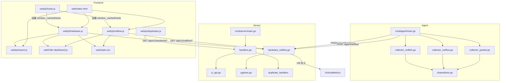

图表来源
- [cmd/agent/main.go:78-244](file://cmd/agent/main.go#L78-L244)
- [cmd/agent/collector_redfish.go:56-101](file://cmd/agent/collector_redfish.go#L56-L101)
- [cmd/agent/collector_netflow.go:203-263](file://cmd/agent/collector_netflow.go#L203-L263)
- [cmd/agent/collector_packet.go:59-113](file://cmd/agent/collector_packet.go#L59-L113)
- [shared/wire.go:144-279](file://shared/wire.go#L144-279)
- [cmd/server/handlers.go:123-124](file://cmd/server/handlers.go#L123-L124)
- [cmd/server/handlers.go:290-298](file://cmd/server/handlers.go#L290-L298)
- [cmd/server/hardware_netflow.go:19-90](file://cmd/server/hardware_netflow.go#L19-L90)
- [cmd/server/ui_api.go:142-220](file://cmd/server/ui_api.go#L142-L220)
- [cmd/server/web/js/hardware.js:12-17](file://cmd/server/web/js/hardware.js#L12-L17)
- [cmd/server/web/js/netflow.js:13-18](file://cmd/server/web/js/netflow.js#L13-18)
- [cmd/server/web/js/hosts.js:125-129](file://cmd/server/web/js/hosts.js#L125-L129)
- [cmd/server/web/js/duplicates.js:15-23](file://cmd/server/web/js/duplicates.js#L15-L23)
- [cmd/server/web/index.html:65-68](file://cmd/server/web/index.html#L65-68)
- [cmd/server/web/js/export.js:1-415](file://cmd/server/web/js/export.js#L1-L415)

章节来源
- [README.md:1-176](file://README.md#L1-L176)
- [cmd/server/main.go:227-354](file://cmd/server/main.go#L227-L354)
- [cmd/agent/main.go:78-244](file://cmd/agent/main.go#L78-L244)
- [cmd/server/handlers.go:102-361](file://cmd/server/handlers.go#L102-L361)

## 核心组件
- Agent 侧
  - Redfish 采集器：按目标独立定时器轮询 BMC REST API，组装 HardwareSnapshot 并上报
  - NetFlow 接收器：UDP 监听，解析 v5/v9，窗口聚合后批量上报
  - Packet 采集器：Linux 下读取 /proc/net/nf_conntrack，差值计算增量 Flow 上报
- Server 侧
  - 硬件/流量接入：校验指纹、落库 PG、写 VM 时序、触发事件
  - 查询接口：最新快照、历史趋势、Top-N 聚合、明细记录
  - 告警合并：活跃告警 + 最近恢复的历史记录
  - **重复主机管理**：检测Agent重装产生的重复记录，提供清理接口
- 前端
  - **增强搜索过滤**：硬件面板支持多字段模糊搜索、状态筛选、数据新鲜度筛选
  - **改进状态显示**：优化健康状态映射，增加BMC事件日志展示
  - **优化NetFlow聚合维度**：支持多维度聚合分析（目的IP、源IP、端口、协议）
  - **重复主机管理界面**：提供重复记录检测、查看和清理功能
  - **移动端优化**：全面适配移动设备触控操作和安全区域
  - **强化国际化支持**：完善中英文翻译键值，支持更多硬件状态枚举

**更新**：v6.7.0 增强了搜索过滤功能，改进了状态显示，优化了NetFlow聚合维度，提升了移动端响应式设计和国际化支持，新增了重复主机管理界面；v6.6.0 对硬件监控界面进行了完全重写，新增了卡片/列表视图自由切换、KPI 摘要条显示整体健康状态、异常部件数、最高温度、总功耗等信息，增强了详情弹窗展示历史曲线和完整硬件信息；v6.5.0 修复了重复代码bug导致的点击功能失效问题，新增了内存和DIMM监控、完整传感器数据显示、交互式展开/收起机制、增强的表格结构和国际化支持；v6.4.0 修复了跨模块缓存初始化问题，确保硬件监控和 NetFlow 面板能正确访问主机列表数据。

章节来源
- [cmd/agent/collector_redfish.go:129-391](file://cmd/agent/collector_redfish.go#L129-L391)
- [cmd/agent/collector_netflow.go:192-263](file://cmd/agent/collector_netflow.go#L192-L263)
- [cmd/agent/collector_packet.go:116-270](file://cmd/agent/collector_packet.go#L116-L270)
- [cmd/server/hardware_netflow.go:19-90](file://cmd/server/hardware_netflow.go#L19-L90)
- [cmd/server/ui_api.go:142-220](file://cmd/server/ui_api.go#L142-L220)
- [cmd/server/web/js/hardware.js:46-152](file://cmd/server/web/js/hardware.js#L46-L152)
- [cmd/server/web/js/netflow.js:79-145](file://cmd/server/web/js/netflow.js#L79-L145)
- [cmd/server/web/js/hosts.js:125-129](file://cmd/server/web/js/hosts.js#L125-L129)
- [cmd/server/web/js/duplicates.js:15-23](file://cmd/server/web/js/duplicates.js#L15-L23)
- [cmd/server/web/i18n-dashboard.js:436-472](file://cmd/server/web/i18n-dashboard.js#L436-L472)
- [cmd/server/web/js/export.js:1-415](file://cmd/server/web/js/export.js#L1-L415)

## 架构总览
整体数据流：
- Agent 定时或事件驱动采集 → 组装结构化报告 → HTTP POST 到 Server
- Server 鉴权 → 持久化 PG → 写入 VM → 可选触发事件/告警
- 前端通过 REST 拉取最新快照与历史趋势，渲染仪表板
- **新增重复主机管理流程**：前端检测重复记录 → 用户确认清理 → 后端删除孤儿记录

**更新**：v6.7.0 新增重复主机管理功能，通过前后端协作实现重复记录的自动检测和清理；v6.6.0 增强了搜索过滤和状态显示功能；v6.5.0 前端架构完全重写，新增了卡片/列表视图切换、KPI 摘要条、交互式详情弹窗等功能；v6.4.0 增加了跨模块主机列表缓存机制，避免重复请求提升性能。

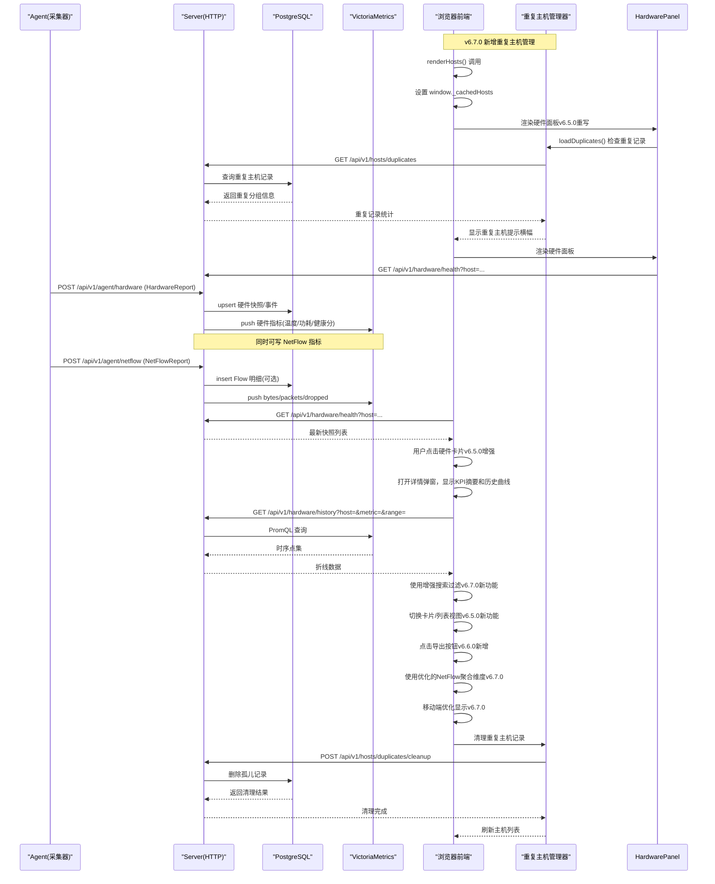

图表来源
- [cmd/server/handlers.go:123-124](file://cmd/server/handlers.go#L123-L124)
- [cmd/server/handlers.go:290-298](file://cmd/server/handlers.go#L290-L298)
- [cmd/server/hardware_netflow.go:19-90](file://cmd/server/hardware_netflow.go#L19-L90)
- [cmd/server/hardware_netflow.go:96-158](file://cmd/server/hardware_netflow.go#L96-L158)
- [cmd/server/hardware_netflow.go:160-227](file://cmd/server/hardware_netflow.go#L160-L227)
- [cmd/server/web/js/hardware.js:24-44](file://cmd/server/web/js/hardware.js#L24-L44)
- [cmd/server/web/js/hardware.js:127-138](file://cmd/server/web/js/hardware.js#L127-L138)
- [cmd/server/web/js/hardware.js:274-280](file://cmd/server/web/js/hardware.js#L274-L280)
- [cmd/server/web/js/hardware.js:633-651](file://cmd/server/web/js/hardware.js#L633-L651)
- [cmd/server/web/js/netflow.js:57-77](file://cmd/server/web/js/netflow.js#L57-77)
- [cmd/server/web/js/hosts.js:125-129](file://cmd/server/web/js/hosts.js#L125-L129)
- [cmd/server/web/js/duplicates.js:15-23](file://cmd/server/web/js/duplicates.js#L15-L23)
- [cmd/server/web/js/export.js:396-415](file://cmd/server/web/js/export.js#L396-L415)

## 详细组件分析

### Redfish 硬件采集器（Agent）
- 运行模型：每个 target 独立 goroutine + 定时器；失败退避
- 采集流程：
  - 从环境变量读取密码（不落盘）
  - 依次请求 Systems/Processors/Memory/Storage/Thermal/Power/FirmwareInventory
  - 填充 HardwareSnapshot 并通过独立 HTTP POST 上报
- 关键结构体：HardwareSnapshot/RedfishCPU/MemoryDIMM/SensorReading/FanReading/PSUReading/FirmwareInfo

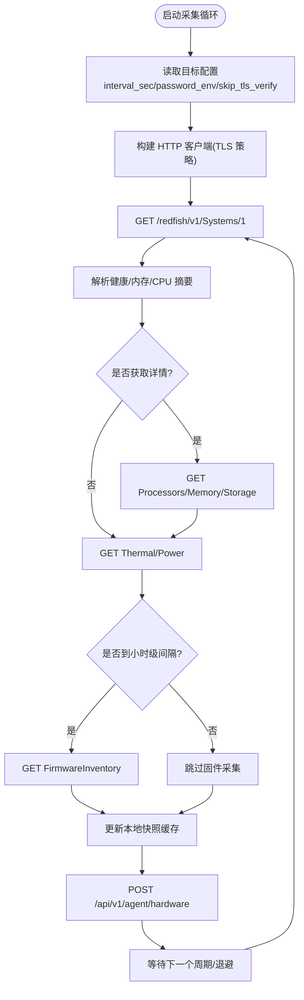

图表来源
- [cmd/agent/collector_redfish.go:56-101](file://cmd/agent/collector_redfish.go#L56-L101)
- [cmd/agent/collector_redfish.go:129-391](file://cmd/agent/collector_redfish.go#L129-L391)
- [shared/wire.go:144-237](file://shared/wire.go#L144-L237)

章节来源
- [cmd/agent/collector_redfish.go:17-53](file://cmd/agent/collector_redfish.go#L17-L53)
- [cmd/agent/collector_redfish.go:129-391](file://cmd/agent/collector_redfish.go#L129-L391)
- [shared/wire.go:144-237](file://shared/wire.go#L144-L237)

### NetFlow 接收器（Agent）
- UDP 监听，支持 v5 固定格式与 v9 模板化
- 窗口聚合：按五元组 key 合并字节/包数/TCP 标志/AS/接口等
- 周期性 flush 上报 NetFlowReport（含统计信息）

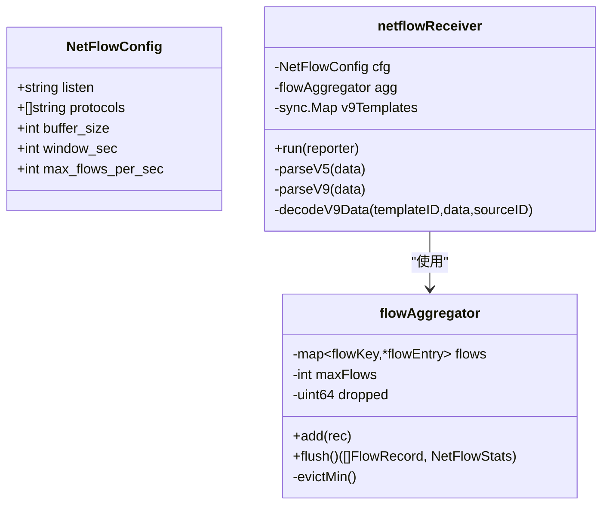

图表来源
- [cmd/agent/collector_netflow.go:14-31](file://cmd/agent/collector_netflow.go#L14-L31)
- [cmd/agent/collector_netflow.go:55-165](file://cmd/agent/collector_netflow.go#L55-L165)
- [cmd/agent/collector_netflow.go:192-263](file://cmd/agent/collector_netflow.go#L192-L263)
- [cmd/agent/collector_netflow.go:342-464](file://cmd/agent/collector_netflow.go#L342-L464)

章节来源
- [cmd/agent/collector_netflow.go:192-263](file://cmd/agent/collector_netflow.go#L192-L263)
- [cmd/agent/collector_netflow.go:281-340](file://cmd/agent/collector_netflow.go#L281-340)
- [cmd/agent/collector_netflow.go:375-464](file://cmd/agent/collector_netflow.go#L375-L464)

### 五元组包采集器（Agent，仅 Linux）
- 每 30s 读取 /proc/net/nf_conntrack
- 与上次快照 diff，生成增量 FlowRecord
- 限速控制（默认每分钟上限）

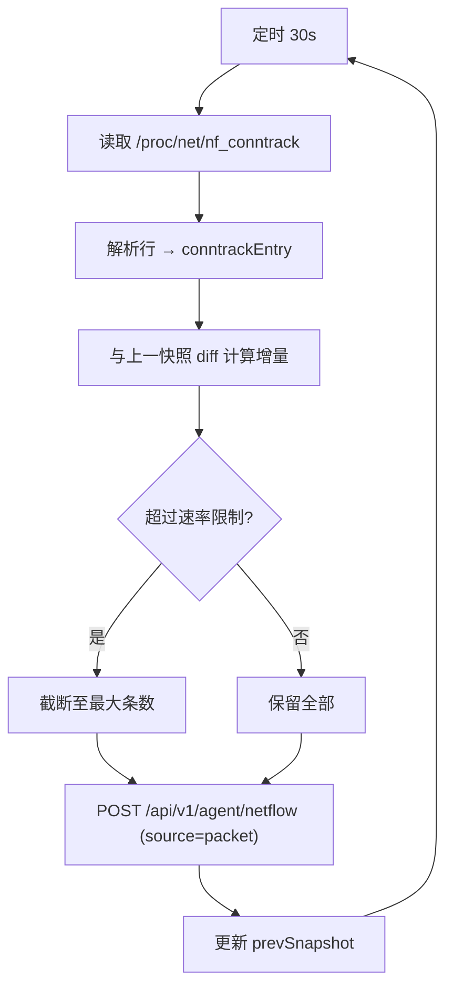

图表来源
- [cmd/agent/collector_packet.go:59-113](file://cmd/agent/collector_packet.go#L59-L113)
- [cmd/agent/collector_packet.go:116-270](file://cmd/agent/collector_packet.go#L116-L270)

章节来源
- [cmd/agent/collector_packet.go:17-56](file://cmd/agent/collector_packet.go#L17-L56)
- [cmd/agent/collector_packet.go:116-270](file://cmd/agent/collector_packet.go#L116-L270)

### Server 端接入与查询
- 接入端点
  - POST /api/v1/agent/hardware：校验指纹 → upsert 快照 → 写 VM → 健康异常写事件
  - POST /api/v1/agent/netflow：校验指纹 → 写 VM → 可选写 PG 明细
- 查询端点
  - GET /api/v1/hardware/health：返回主机最新快照
  - GET /api/v1/hardware/history：按 metric/range/target 查 VM 时序
  - GET /api/v1/netflow/summary：按维度聚合 Top-N
  - GET /api/v1/netflow/flows：PG 明细查询（支持过滤）
  - GET /api/v1/netflow/packets：packet 源 packets 时序
  - **新增重复主机管理**：GET /api/v1/hosts/duplicates 和 POST /api/v1/hosts/duplicates/cleanup

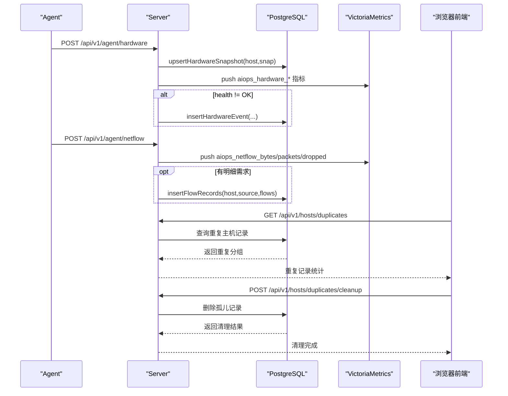

图表来源
- [cmd/server/hardware_netflow.go:19-90](file://cmd/server/hardware_netflow.go#L19-L90)
- [cmd/server/hardware_netflow.go:283-336](file://cmd/server/hardware_netflow.go#L283-L336)
- [cmd/server/handlers.go:123-124](file://cmd/server/handlers.go#L123-L124)

章节来源
- [cmd/server/hardware_netflow.go:19-90](file://cmd/server/hardware_netflow.go#L19-L90)
- [cmd/server/hardware_netflow.go:96-158](file://cmd/server/hardware_netflow.go#L96-L158)
- [cmd/server/hardware_netflow.go:160-227](file://cmd/server/hardware_netflow.go#L160-L227)
- [cmd/server/hardware_netflow.go:229-277](file://cmd/server/hardware_netflow.go#L229-L277)

### 前端仪表板（v6.5.0完全重写 + v6.6.0导出功能 + v6.7.0增强）
- **硬件健康面板（v6.5.0完全重写 + v6.7.0增强）**
  - **卡片/列表视图自由切换**：支持两种视图模式，通过 localStorage 持久化用户偏好
  - **智能排序**：按健康状态（Critical > Warning > OK）优先显示问题设备
  - **增强搜索过滤**：支持多字段模糊搜索（主机名、型号、序列号、BMC地址）、状态筛选（在线/离线）、数据新鲜度筛选（1小时/24小时/7天）
  - **改进状态显示**：优化健康状态映射，增加BMC事件日志展示，完善异常部件识别
  - **KPI 摘要条**：在详情弹窗中显示整机健康、异常部件数、最高温度、总功耗、电源冗余等关键指标
  - **交互式详情弹窗**：点击硬件卡片打开详情弹窗，自动加载历史曲线（温度、风扇转速、功耗、健康分）
  - **异常项置顶**：将需要关注的异常部件（温度超标、风扇故障、磁盘SMART预警等）置顶显示
  - **完整信息显示**：展示 CPU/温度/风扇/电源/固件/内存/DIMM 等所有硬件信息
  - **增强的表格结构**：所有硬件信息均以清晰的表格形式展示，支持排序和筛选
  - **国际化支持**：所有UI文本均支持中/英/繁中三语切换
  - **智能提示**：显示更新时间、错误信息、展开/收起提示等
  - **重复主机管理**：集成重复主机检测、查看和清理功能
- **网络流量面板（v6.7.0优化）**
  - **优化聚合维度**：支持按目的IP、源IP、目的端口、源端口、协议多维度聚合分析
  - **增强搜索功能**：主机搜索框支持多词匹配和防抖处理
  - **离线主机支持**：可选择包含离线主机的流量数据
  - 选择主机与时间范围，拉取 Top-N 与明细
  - 支持筛选与 CSV 导出
  - **国际化支持**：所有UI文本均支持多语言
- **重复主机管理界面（v6.7.0新增）**
  - **自动检测**：前端定期调用API检测重复主机记录
  - **可视化展示**：以横幅形式显示重复记录数量和清理选项
  - **安全清理**：提供详细的待清理记录预览和二次确认
  - **实时更新**：清理完成后自动刷新主机列表
- **跨模块缓存机制（v6.4.0新增）**
  - hosts.js 在 renderHosts() 中设置 `window._cachedHosts`
  - hardware.js 和 netflow.js 直接读取缓存，避免重复请求

**更新**：v6.7.0 增强了搜索过滤功能，改进了状态显示，优化了NetFlow聚合维度，提升了移动端响应式设计和国际化支持，新增了重复主机管理界面；v6.6.0 对硬件监控界面进行了完全重写，新增了卡片/列表视图自由切换、KPI 摘要条显示整体健康状态、异常部件数、最高温度、总功耗等信息，增强了详情弹窗展示历史曲线和完整硬件信息；v6.5.0 修复了重复代码bug导致的点击功能失效问题，新增了内存和DIMM监控、完整传感器数据显示、交互式展开/收起机制、增强的表格结构和国际化支持；v6.4.0 修复了跨模块缓存初始化问题，确保硬件监控面板能正确获取主机列表数据。

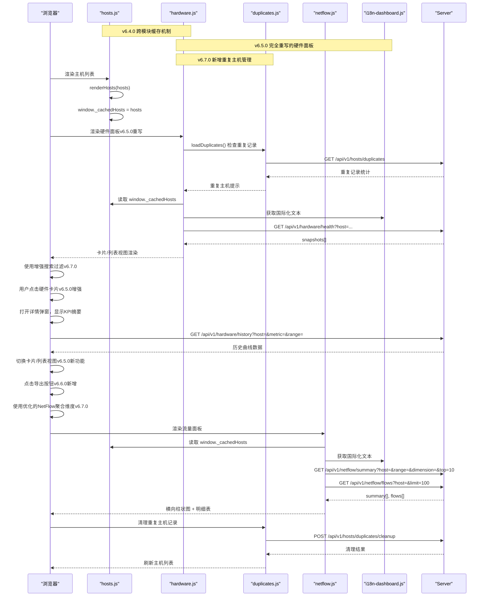

图表来源
- [cmd/server/web/js/hardware.js:24-44](file://cmd/server/web/js/hardware.js#L24-L44)
- [cmd/server/web/js/hardware.js:66-78](file://cmd/server/web/js/hardware.js#L66-L78)
- [cmd/server/web/js/hardware.js:127-138](file://cmd/server/web/js/hardware.js#L127-L138)
- [cmd/server/web/js/hardware.js:274-280](file://cmd/server/web/js/hardware.js#L274-L280)
- [cmd/server/web/js/hardware.js:496-651](file://cmd/server/web/js/hardware.js#L496-L651)
- [cmd/server/web/js/netflow.js:57-77](file://cmd/server/web/js/netflow.js#L57-77)
- [cmd/server/web/js/netflow.js:79-145](file://cmd/server/web/js/netflow.js#L79-L145)
- [cmd/server/web/js/hosts.js:125-129](file://cmd/server/web/js/hosts.js#L125-L129)
- [cmd/server/web/js/duplicates.js:15-23](file://cmd/server/web/js/duplicates.js#L15-L23)
- [cmd/server/web/i18n-dashboard.js:436-472](file://cmd/server/web/i18n-dashboard.js#L436-L472)
- [cmd/server/web/js/export.js:396-415](file://cmd/server/web/js/export.js#L396-L415)

章节来源
- [cmd/server/web/js/hardware.js:1-887](file://cmd/server/web/js/hardware.js#L1-L887)
- [cmd/server/web/js/netflow.js:1-263](file://cmd/server/web/js/netflow.js#L1-L263)
- [cmd/server/web/js/hosts.js:125-129](file://cmd/server/web/js/hosts.js#L125-L129)
- [cmd/server/web/js/duplicates.js:1-77](file://cmd/server/web/js/duplicates.js#L1-L77)
- [cmd/server/web/i18n-dashboard.js:436-472](file://cmd/server/web/i18n-dashboard.js#L436-L472)
- [cmd/server/web/js/export.js:1-415](file://cmd/server/web/js/export.js#L1-L415)

### 通用文档导出引擎（v6.6.0新增）
- **设计原则**：调用方只构造一份中性的「文档模型」，导出引擎负责四种落地格式
- **零依赖实现**：
  - Excel/Word：手写 OOXML + 最小 ZIP 打包器（STORE不压缩）
  - Markdown：纯文本表格格式
  - PDF：通过浏览器打印实现，避免中文字体问题
- **文档模型结构**：
  ```javascript
  {
    title: "标题",
    subtitle: "副标题（可选）", 
    meta: [[键, 值], ...],           // 摘要键值对
    sections: [{ title, columns:[...], rows:[[...]] }, ...]
  }
  ```
- **安全处理**：清洗控制字符、转义XML特殊字符、文件名安全处理
- **用户体验**：自动下载、错误提示、弹出窗口拦截处理

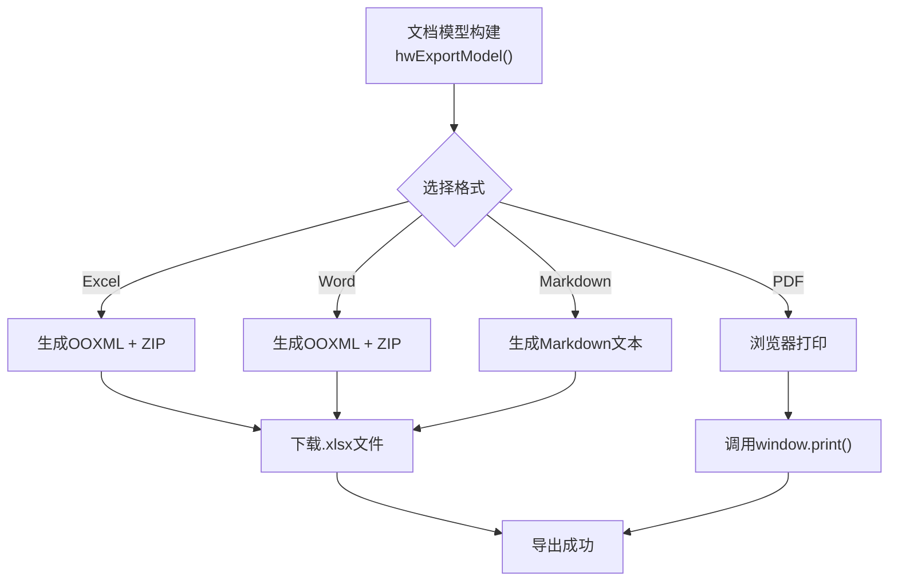

图表来源
- [cmd/server/web/js/export.js:1-415](file://cmd/server/web/js/export.js#L1-L415)
- [cmd/server/web/js/hardware.js:496-651](file://cmd/server/web/js/hardware.js#L496-L651)

章节来源
- [cmd/server/web/js/export.js:1-415](file://cmd/server/web/js/export.js#L1-L415)
- [cmd/server/web/js/hardware.js:496-651](file://cmd/server/web/js/hardware.js#L496-L651)

### 告警历史持久化（与仪表板联动）
- 活跃告警由 Evaluate 实时计算，历史告警来自持久化记录
- handleAlerts 合并活跃与近期恢复的记录，支持 ?history=true 返回完整历史
- 新增 handleAlertHistory 分页查询，支持 status 过滤

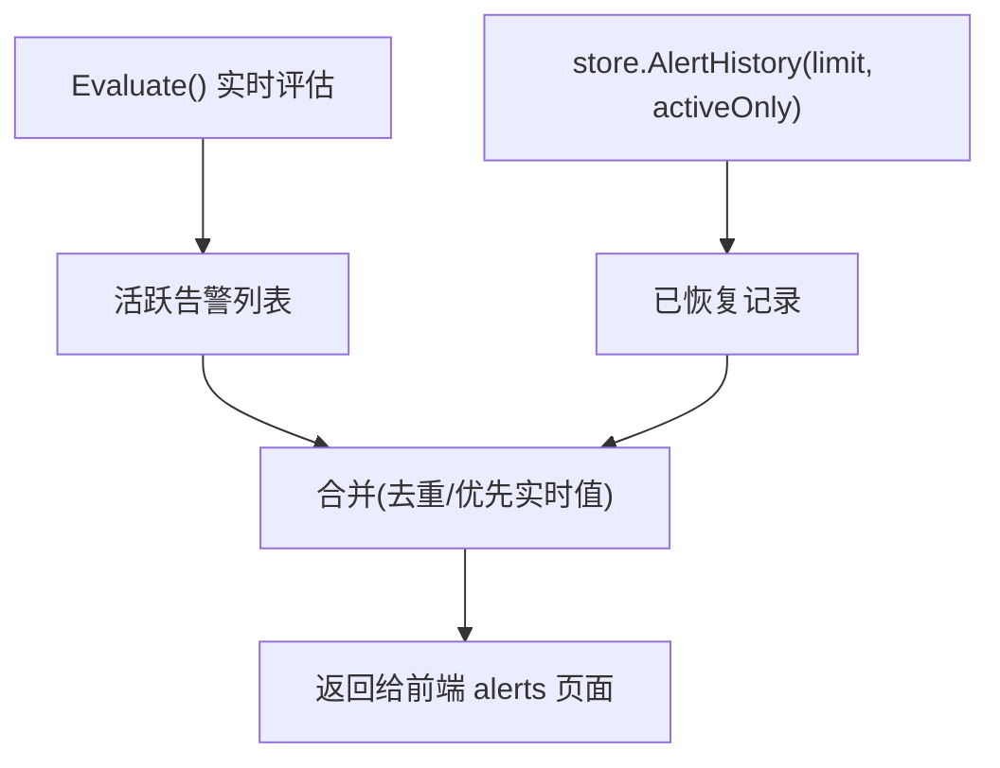

图表来源
- [cmd/server/ui_api.go:142-220](file://cmd/server/ui_api.go#L142-L220)

章节来源
- [cmd/server/ui_api.go:142-220](file://cmd/server/ui_api.go#L142-L220)

### 硬件报告诊断日志增强（v6.2.5）
**更新**：v6.2.5 增强了硬件报告失败的诊断日志功能，提供更详细的错误信息和成功状态跟踪。

- **详细错误信息**：当硬件上报被拒时，记录响应状态码、主机 ID、快照数量以及响应体内容
- **成功状态日志**：每次成功的硬件上报都会记录服务器地址、主机 ID 和快照数量
- **序列化错误处理**：硬件上报序列化失败时会记录具体的错误信息
- **并发上报隔离**：每个目标服务器的上报操作独立进行，互不影响

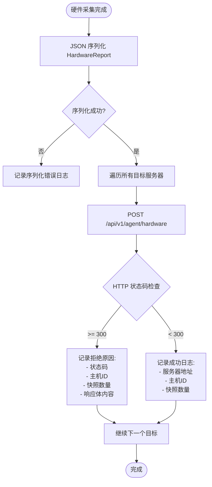

图表来源
- [cmd/agent/reporter.go:609-644](file://cmd/agent/reporter.go#L609-L644)

章节来源
- [cmd/agent/reporter.go:609-644](file://cmd/agent/reporter.go#L609-L644)

## 依赖关系分析
- Agent 与 Server 通过 shared 包定义的数据结构保持契约一致
- Server 对 PG 与 VM 的依赖在 main 中初始化，并在 handlers 中按需调用
- 前端通过 handlers 暴露的路径访问数据
- **跨模块缓存**：hosts.js 作为数据提供者，hardware.js 和 netflow.js 作为消费者
- **重复主机管理**：duplicates.js 提供重复记录检测和管理功能
- **国际化支持**：i18n-dashboard.js 为所有前端模块提供统一的翻译服务
- **导出功能依赖**：hardware.js 构建文档模型，export.js 实现格式转换

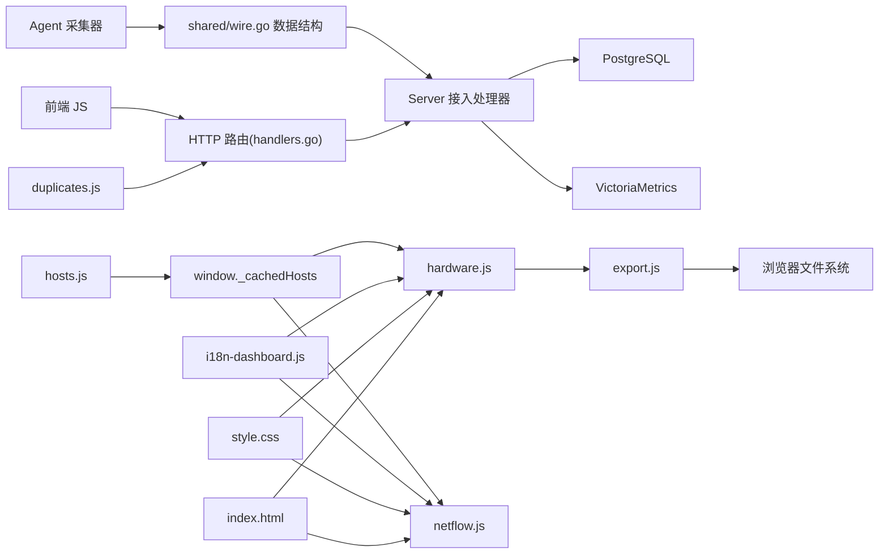

图表来源
- [shared/wire.go:144-279](file://shared/wire.go#L144-L279)
- [cmd/server/handlers.go:123-124](file://cmd/server/handlers.go#L123-L124)
- [cmd/server/handlers.go:290-298](file://cmd/server/handlers.go#L290-L298)
- [cmd/server/main.go:227-354](file://cmd/server/main.go#L227-L354)
- [cmd/server/web/js/hosts.js:125-129](file://cmd/server/web/js/hosts.js#L125-L129)
- [cmd/server/web/js/hardware.js:12-17](file://cmd/server/web/js/hardware.js#L12-L17)
- [cmd/server/web/js/netflow.js:13-18](file://cmd/server/web/js/netflow.js#L13-L18)
- [cmd/server/web/js/duplicates.js:15-23](file://cmd/server/web/js/duplicates.js#L15-L23)
- [cmd/server/web/i18n-dashboard.js:436-472](file://cmd/server/web/i18n-dashboard.js#L436-L472)
- [cmd/server/web/style.css:2810-2834](file://cmd/server/web/style.css#L2810-L2834)
- [cmd/server/web/index.html:65-68](file://cmd/server/web/index.html#L65-L68)
- [cmd/server/web/js/export.js:1-415](file://cmd/server/web/js/export.js#L1-L415)

章节来源
- [shared/wire.go:144-279](file://shared/wire.go#L144-L279)
- [cmd/server/handlers.go:102-361](file://cmd/server/handlers.go#L102-L361)
- [cmd/server/main.go:227-354](file://cmd/server/main.go#L227-L354)

## 性能与容量规划
- Agent 侧
  - Redfish：建议 interval_sec ≥ 30s；固件采集降频（小时级）
  - NetFlow：window_sec 建议 300s；max_flows_per_sec 根据设备规模调优；buffer_size 适当增大
  - Packet：max_packets_per_min 默认 6000，可按连接规模调整
- Server 侧
  - VM 写入：按五元组标签粒度，注意 label 基数；必要时做采样或聚合
  - PG 写入：Flow 明细建议开启清理任务（已有定时清理逻辑）
  - **重复主机管理**：重复记录检测为轻量级查询，清理操作为批量删除，性能影响较小
- 前端
  - 并行拉取硬件快照，避免阻塞；Top-N 限制 top ≤ 100
  - **跨模块缓存优化**：通过 `window._cachedHosts` 避免重复请求，提升页面加载速度
  - **v6.5.0性能优化**：硬件面板完全重写，通过DOM操作而非重新渲染实现视图切换，减少不必要的DOM重建；智能排序算法优化大数据量下的渲染性能
  - **v6.6.0导出性能**：前端直接生成文件，无网络开销；Excel/Word使用STORE压缩，文件大小适中
  - **v6.7.0搜索优化**：防抖处理避免频繁重渲染，智能过滤算法提升大数据量下的响应速度
  - **移动端优化**：触摸操作优化，安全区域适配，小屏幕布局自适应

**更新**：v6.7.0 增强了搜索过滤功能的性能，通过防抖处理和智能过滤算法提升大数据量下的响应速度；v6.6.0 新增的导出功能在前端直接生成文件，避免了额外的网络请求，提升了用户体验；v6.5.0 对硬件面板进行了完全重写，新增了卡片/列表视图切换、KPI 摘要条等功能，同时优化了性能，通过DOM操作而非重新渲染实现视图切换，减少了不必要的DOM重建；v6.4.0 的跨模块缓存机制显著减少了主机列表的重复请求，提升了硬件监控和 NetFlow 面板的加载性能。

[本节为通用指导，不直接分析具体文件]

## 故障排查指南
- Agent 无法连接 BMC
  - 检查 TLS 证书与 skip_tls_verify 配置；确认用户名/密码环境变量存在
  - 观察连续失败退避日志
- NetFlow 无数据
  - 确认交换机/防火墙已推送 v5/v9；核对监听端口与协议白名单
  - 检查 v9 模板是否成功缓存
- Packet 采集为空
  - 确认内核启用 nf_conntrack；检查权限与路径可读性
- Server 查询无结果
  - 确认 VM 可用且时间范围合理；PG 明细需确保未过期清理
- 告警历史缺失
  - 确认持久化层已启用；检查 handleAlerts 合并逻辑与 history 参数
- **硬件监控面板无数据显示**（v6.4.0 修复）
  - 检查 hosts.js 是否正确初始化 `window._cachedHosts`
  - 确认 hardware.js 和 netflow.js 能正确读取缓存数据
  - 验证主机列表是否正常渲染
- **硬件卡片点击功能失效**（v6.3.0 修复）
  - 检查 toggleHwDetail 函数是否正确绑定到硬件卡片
  - 确认 hw-detail 区域的 display 属性切换逻辑正常
  - 验证展开/收起提示文本的国际化更新
- **硬件报告失败诊断**（v6.2.5 增强）
  - 查看 Agent 日志中的详细错误信息，包括状态码、主机 ID、快照数量和响应体内容
  - 关注成功上报的日志记录，确认硬件数据采集和传输链路正常
  - 检查硬件上报序列化错误，确认数据结构完整性
- **国际化显示异常**（v6.3.0 新增）
  - 检查 i18n-dashboard.js 中的翻译键是否存在
  - 确认前端模块是否正确调用 I18N.t() 函数
  - 验证浏览器语言设置和 cookie 中的语言偏好
- **v6.5.0新界面问题**
  - 检查卡片/列表视图切换按钮是否正确绑定事件
  - 确认 KPI 摘要条数据计算逻辑是否正常
  - 验证详情弹窗的历史曲线加载是否成功
  - 检查 localStorage 中视图偏好的读写是否正常
- **v6.6.0导出功能问题**
  - 检查导出下拉菜单是否正确显示和交互
  - 确认文档模型构建逻辑是否正常
  - 验证Excel/Word文件生成是否成功
  - 检查PDF打印功能是否被浏览器拦截
  - 确认国际化文本是否正确显示
- **v6.7.0新增功能问题**
  - **搜索过滤功能**：检查防抖逻辑是否正常，确认过滤条件组合逻辑正确
  - **重复主机管理**：检查API调用是否成功，确认清理操作的权限和安全性
  - **NetFlow聚合维度**：验证维度选择器的数据绑定，确认后端API支持新维度
  - **移动端适配**：检查触摸事件绑定，确认安全区域适配样式生效
  - **国际化支持**：验证新增翻译键的完整性，确认多语言切换功能正常

**更新**：新增了 v6.7.0 增强功能的故障排查步骤，包括搜索过滤、重复主机管理、NetFlow聚合维度、移动端适配和国际化支持等问题排查方法；同时保留了之前版本的故障排查指南。

章节来源
- [cmd/agent/collector_redfish.go:85-101](file://cmd/agent/collector_redfish.go#L85-L101)
- [cmd/agent/collector_netflow.go:203-263](file://cmd/agent/collector_netflow.go#L203-L263)
- [cmd/agent/collector_packet.go:59-113](file://cmd/agent/collector_packet.go#L59-L113)
- [cmd/server/hardware_netflow.go:96-158](file://cmd/server/hardware_netflow.go#L96-L158)
- [cmd/server/ui_api.go:142-220](file://cmd/server/ui_api.go#L142-L220)
- [cmd/server/web/js/hosts.js:125-129](file://cmd/server/web/js/hosts.js#L125-L129)
- [cmd/server/web/js/hardware.js:12-17](file://cmd/server/web/js/hardware.js#L12-L17)
- [cmd/server/web/js/hardware.js:274-280](file://cmd/server/web/js/hardware.js#L274-L280)
- [cmd/server/web/js/hardware.js:625-651](file://cmd/server/web/js/hardware.js#L625-L651)
- [cmd/server/web/js/netflow.js:13-18](file://cmd/server/web/js/netflow.js#L13-L18)
- [cmd/server/web/js/duplicates.js:15-23](file://cmd/server/web/js/duplicates.js#L15-L23)
- [cmd/server/web/i18n-dashboard.js:436-472](file://cmd/server/web/i18n-dashboard.js#L436-L472)
- [cmd/agent/reporter.go:609-644](file://cmd/agent/reporter.go#L609-L644)

## 结论
本方案以三类采集器补齐"硬件健康 + 网络流量 + 五元组包"三大视角，结合 PG 与 VM 的统一存储，形成端到端的硬件监控仪表板。通过清晰的 Agent/Server 契约、稳健的聚合与限流策略、以及友好的前端交互，满足生产环境对基础设施可视化的核心诉求。

**版本演进亮点**：
- **v6.7.0增强功能**：增强搜索过滤功能，改进状态显示，优化NetFlow聚合维度，提升移动端响应式设计和国际化支持，新增重复主机管理界面
- **v6.6.0导出功能**：完整硬件资产导出功能，支持Excel/Word/Markdown/PDF四种格式，采用零依赖设计，集成到硬件详情弹窗下拉菜单
- **v6.5.0完全重写**：硬件监控界面完全重构，支持卡片/列表视图自由切换，新增 KPI 摘要条显示整体健康状态、异常部件数、最高温度、总功耗等信息，增强详情弹窗展示历史曲线和完整硬件信息
- **v6.4.0重大增强**：修复了重复代码bug导致的硬件卡片点击功能失效问题，新增了内存和DIMM监控、完整传感器数据显示、交互式展开/收起机制、增强的表格结构和国际化支持等核心功能改进
- v6.3.0 通过跨模块缓存机制解决了硬件监控数据显示问题，提升了前端性能
- v6.2.5 增强了硬件报告失败的诊断能力，提供了更详细的错误追踪信息
- 持续优化的故障排查指南帮助用户快速定位和解决问题

[本节为总结，不直接分析具体文件]

## 附录：API 参考
- 接入（Agent→Server）
  - POST /api/v1/agent/hardware：提交 HardwareReport
  - POST /api/v1/agent/netflow：提交 NetFlowReport
- 查询（前端→Server）
  - GET /api/v1/hardware/health?host=...
  - GET /api/v1/hardware/history?host=&metric=&range=&target=...
  - GET /api/v1/netflow/summary?host=&range=&dimension=&top=...
  - GET /api/v1/netflow/flows?host=&limit=&filter=...
  - GET /api/v1/netflow/packets?host=&range=...
  - **新增重复主机管理**：GET /api/v1/hosts/duplicates 和 POST /api/v1/hosts/duplicates/cleanup
- 告警
  - GET /api/v1/alerts?history=true
  - GET /api/v1/alerts/history?limit=&status=...
- **导出功能（前端内部）**
  - exportModel(model, format, baseName)：通用导出接口
  - hwExportModel(it)：硬件文档模型构建函数
  - hwDoExport(format)：硬件导出执行函数

章节来源
- [cmd/server/handlers.go:123-124](file://cmd/server/handlers.go#L123-L124)
- [cmd/server/handlers.go:290-298](file://cmd/server/handlers.go#L290-L298)
- [cmd/server/hardware_netflow.go:96-158](file://cmd/server/hardware_netflow.go#L96-L158)
- [cmd/server/hardware_netflow.go:160-227](file://cmd/server/hardware_netflow.go#L160-L227)
- [cmd/server/hardware_netflow.go:229-277](file://cmd/server/hardware_netflow.go#L229-L277)
- [cmd/server/ui_api.go:142-220](file://cmd/server/ui_api.go#L142-L220)
- [cmd/server/web/js/hardware.js:496-651](file://cmd/server/web/js/hardware.js#L496-L651)
- [cmd/server/web/js/export.js:396-415](file://cmd/server/web/js/export.js#L396-L415)