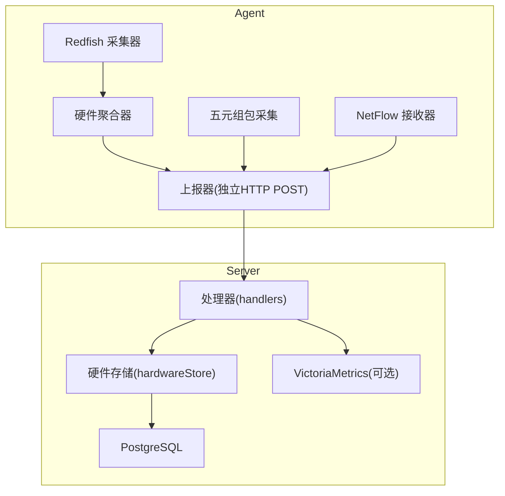
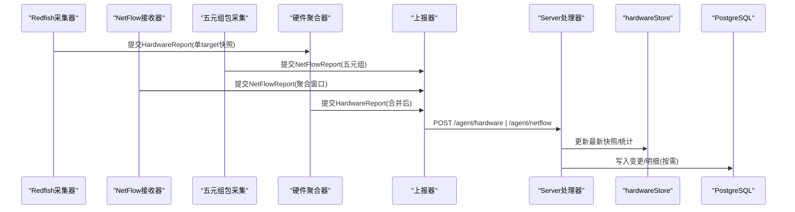
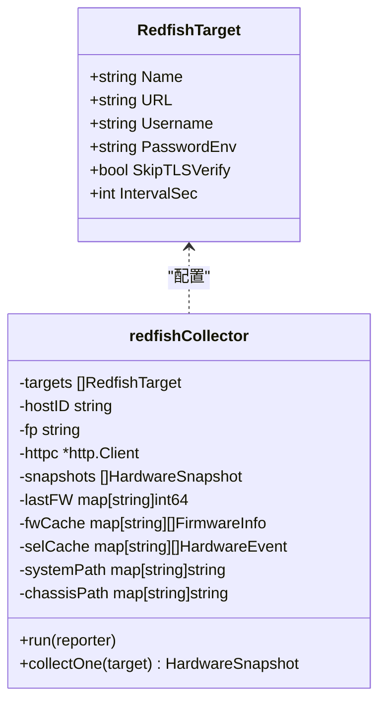
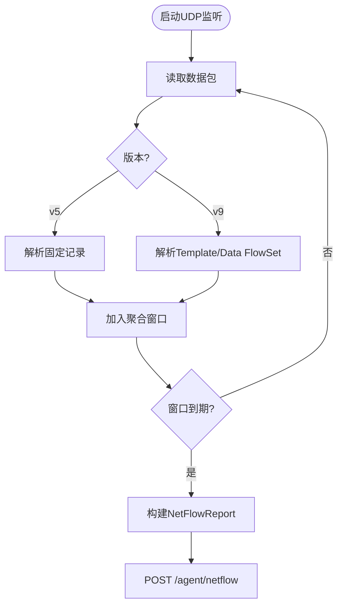
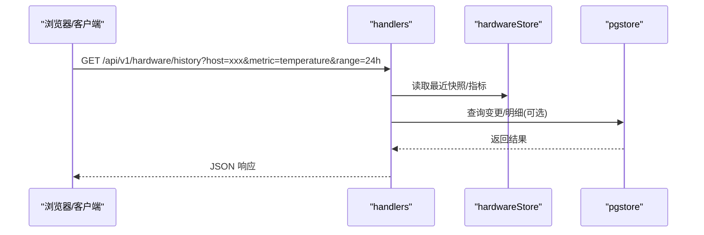
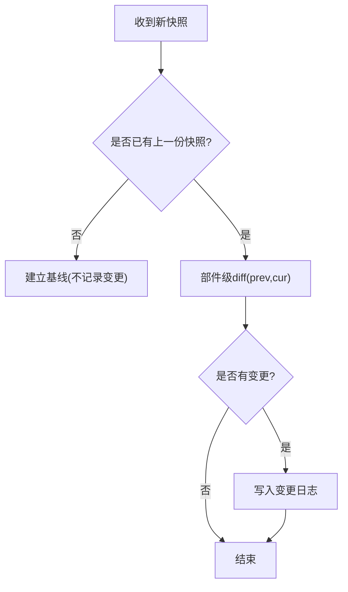
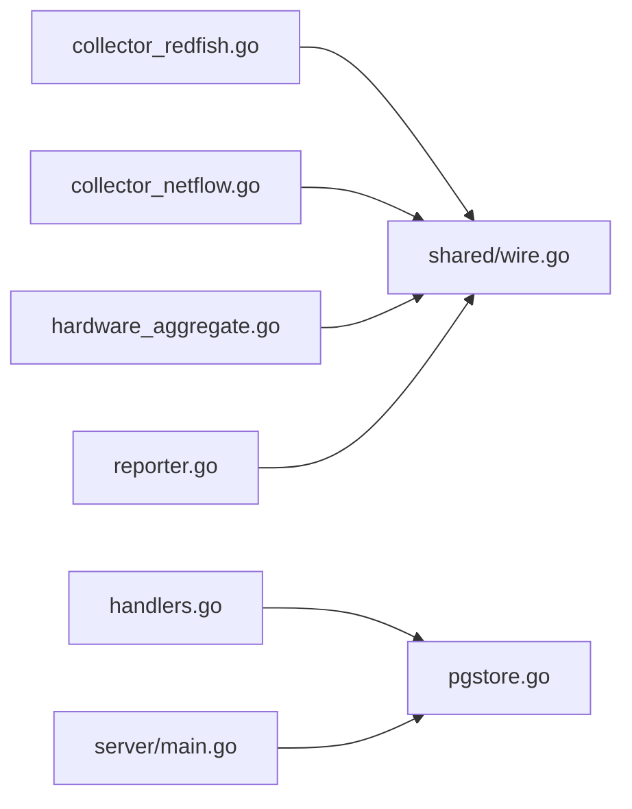

# 硬件资产变更追踪

<cite>
**本文引用的文件**   
- [cmd/agent/main.go](file://cmd/agent/main.go)
- [cmd/agent/reporter.go](file://cmd/agent/reporter.go)
- [cmd/agent/collector_redfish.go](file://cmd/agent/collector_redfish.go)
- [cmd/agent/collector_netflow.go](file://cmd/agent/collector_netflow.go)
- [cmd/agent/hardware_aggregate.go](file://cmd/agent/hardware_aggregate.go)
- [shared/wire.go](file://shared/wire.go)
- [cmd/server/main.go](file://cmd/server/main.go)
- [cmd/server/handlers.go](file://cmd/server/handlers.go)
- [cmd/server/pgstore.go](file://cmd/server/pgstore.go)
- [cmd/server/hardware_changes.go](file://cmd/server/hardware_changes.go)
</cite>

## 目录
1. [简介](#简介)
2. [项目结构](#项目结构)
3. [核心组件](#核心组件)
4. [架构总览](#架构总览)
5. [详细组件分析](#详细组件分析)
6. [依赖关系分析](#依赖关系分析)
7. [性能与容量规划](#性能与容量规划)
8. [故障排查指南](#故障排查指南)
9. [结论](#结论)
10. [附录：API 与数据模型](#附录api-与数据模型)

## 简介
本方案围绕“硬件资产变更追踪”目标，在现有 AIOps 监控平台基础上，新增三类采集器（Redfish 硬件状态、NetFlow 网络流量、五元组包报文）以及 Server 端查询与分析能力。通过 Agent 侧多源采集、Server 侧差异比对与持久化，实现对服务器关键部件（CPU/GPU/内存/磁盘/RAID/电源/风扇/温度/固件等）的变更可追溯，同时提供网络流量聚合指标与明细查询，支撑运维排障与资产管理。

## 项目结构
- Agent 侧新增模块
  - Redfish 采集器：按 target 独立周期轮询 BMC/iDRAC/iBMC，产出 HardwareSnapshot
  - NetFlow 接收器：UDP 监听 v5/v9，内存窗口聚合后上报
  - 五元组包采集：优先 Linux nf_conntrack，必要时 tcpdump 子进程兜底
  - 统一上报通道：独立的 /agent/hardware 与 /agent/netflow 端点
- Server 侧增强
  - 硬件快照存储与变更比对：仅记录真实增删换件
  - 时序指标写入 VictoriaMetrics（可选），关系型数据落 PostgreSQL
  - 前端面板：硬件健康与网络流量概览/明细

图表来源
- [cmd/agent/collector_redfish.go:145-197](file://cmd/agent/collector_redfish.go#L145-L197)
- [cmd/agent/collector_netflow.go:202-263](file://cmd/agent/collector_netflow.go#L202-L263)
- [cmd/agent/hardware_aggregate.go:35-51](file://cmd/agent/hardware_aggregate.go#L35-L51)
- [cmd/agent/reporter.go:657-723](file://cmd/agent/reporter.go#L657-L723)
- [cmd/server/handlers.go:104-200](file://cmd/server/handlers.go#L104-L200)
- [cmd/server/pgstore.go:79-115](file://cmd/server/pgstore.go#L79-L115)

章节来源
- [cmd/agent/main.go:237-241](file://cmd/agent/main.go#L237-L241)
- [cmd/server/main.go:251-272](file://cmd/server/main.go#L251-L272)

## 核心组件
- shared 协议层
  - HardwareSnapshot/Report、FlowRecord/NetFlowReport 等跨端共享结构体，确保前后端契约一致
- Agent 采集与上报
  - Redfish 采集器：兼容多厂商路径发现、TLS 降级、缓存降频（固件/事件/GPU）
  - NetFlow 接收器：v5/v9 解析 + 滑动窗口聚合 + 内存上限保护
  - 五元组包采集：nf_conntrack 增量差值 → FlowRecord
  - 硬件聚合器：按 target_name 合并多采集器快照，避免互相覆盖
  - 上报器：独立 HTTP POST 到 /agent/hardware 与 /agent/netflow，携带指纹认证
- Server 处理与存储
  - handlers 路由注册与请求分发
  - hardwareStore 最新快照驻留内存，供告警/面板使用
  - pgstore 建表迁移、变更记录写入、历史查询
  - 硬件变更追踪：部件级 diff，仅记录 added/removed/replaced/changed

章节来源
- [shared/wire.go:144-390](file://shared/wire.go#L144-L390)
- [cmd/agent/collector_redfish.go:95-143](file://cmd/agent/collector_redfish.go#L95-L143)
- [cmd/agent/collector_netflow.go:55-165](file://cmd/agent/collector_netflow.go#L55-L165)
- [cmd/agent/hardware_aggregate.go:17-33](file://cmd/agent/hardware_aggregate.go#L17-L33)
- [cmd/agent/reporter.go:657-723](file://cmd/agent/reporter.go#L657-L723)
- [cmd/server/handlers.go:104-200](file://cmd/server/handlers.go#L104-L200)
- [cmd/server/pgstore.go:79-115](file://cmd/server/pgstore.go#L79-L115)
- [cmd/server/hardware_changes.go:143-163](file://cmd/server/hardware_changes.go#L143-L163)

## 架构总览
整体采用“Agent 多采集器 + 独立上报通道 + Server 差异化存储”的分层设计：
- Agent 侧：各采集器独立 goroutine，互不影响；硬件快照先本地聚合再上报
- Server 侧：handlers 解耦业务逻辑，hardwareStore 驻留最新快照，pgstore 负责持久化与变更审计
- 存储选型：PostgreSQL 用于结构化/JSONB 数据与变更日志；VictoriaMetrics 用于时序指标（可选）

图表来源
- [cmd/agent/collector_redfish.go:199-222](file://cmd/agent/collector_redfish.go#L199-L222)
- [cmd/agent/collector_netflow.go:202-263](file://cmd/agent/collector_netflow.go#L202-L263)
- [cmd/agent/hardware_aggregate.go:35-51](file://cmd/agent/hardware_aggregate.go#L35-L51)
- [cmd/agent/reporter.go:657-723](file://cmd/agent/reporter.go#L657-L723)
- [cmd/server/handlers.go:104-200](file://cmd/server/handlers.go#L104-L200)

## 详细组件分析

### Redfish 硬件采集器
- 运行模型：每个 target 独立 goroutine + 定时器（最小 30s）
- 关键流程
  - 密码读取：优先环境变量，其次配置字段，空则告警
  - 路径发现：动态发现 Systems/Chassis 链接，避免硬编码
  - 资源采集：System/CPU/Memory/Storage/Thermal/Power/Firmware/Events
  - 错误处理：分类提示（TLS/证书/连接/DNS/超时/认证），连续失败退避
- 优化策略
  - TLS 兼容：允许旧固件 TLS1.0+ 与不安全套件（内网安全边界）
  - 缓存降频：固件/事件/GPU 列表降频采集并缓存，避免整份快照 upsert 导致 UI 闪烁
  - 去重：物理盘从 Storage 与 Chassis 双源合并去重

图表来源
- [cmd/agent/collector_redfish.go:58-93](file://cmd/agent/collector_redfish.go#L58-L93)
- [cmd/agent/collector_redfish.go:95-143](file://cmd/agent/collector_redfish.go#L95-L143)
- [cmd/agent/collector_redfish.go:224-336](file://cmd/agent/collector_redfish.go#L224-L336)
- [cmd/agent/collector_redfish.go:381-776](file://cmd/agent/collector_redfish.go#L381-L776)

章节来源
- [cmd/agent/collector_redfish.go:21-56](file://cmd/agent/collector_redfish.go#L21-L56)
- [cmd/agent/collector_redfish.go:145-197](file://cmd/agent/collector_redfish.go#L145-L197)
- [cmd/agent/collector_redfish.go:347-379](file://cmd/agent/collector_redfish.go#L347-L379)

### NetFlow 接收器与聚合器
- 运行模型：UDP 监听 + 定时 flush 窗口（默认 5min）
- 解析支持：v5 固定记录；v9 模板流式解码
- 聚合策略：五元组 key 聚合 bytes/packets/TCP flags，内存上限保护（默认 100K flows），超限时淘汰最小流量条目并计数 dropped
- 上报格式：NetFlowReport（source="netflow"）

图表来源
- [cmd/agent/collector_netflow.go:202-263](file://cmd/agent/collector_netflow.go#L202-L263)
- [cmd/agent/collector_netflow.go:265-340](file://cmd/agent/collector_netflow.go#L265-L340)
- [cmd/agent/collector_netflow.go:342-464](file://cmd/agent/collector_netflow.go#L342-L464)
- [cmd/agent/collector_netflow.go:125-165](file://cmd/agent/collector_netflow.go#L125-L165)

章节来源
- [cmd/agent/collector_netflow.go:14-31](file://cmd/agent/collector_netflow.go#L14-31)
- [cmd/agent/collector_netflow.go:55-165](file://cmd/agent/collector_netflow.go#L55-L165)

### 五元组包采集
- 首选方案：Linux /proc/net/nf_conntrack 定时读取，与上次快照做差得到增量 FlowRecord
- 备选方案：tcpdump 子进程 + BPF 过滤，stdout 解析五元组与包大小
- 输出：复用 NetFlowReport（source="packet"）

章节来源
- [cmd/agent/reporter.go:432-439](file://cmd/agent/reporter.go#L432-L439)
- [shared/wire.go:354-390](file://shared/wire.go#L354-L390)

### 硬件聚合器
- 目的：将多个采集器（Redfish/OceanStor）产出的快照按 target_name 合并，避免服务端整体替换导致的告警抖动
- 机制：并发安全 map 维护 byTarget，排序稳定后一次性上报

章节来源
- [cmd/agent/hardware_aggregate.go:10-51](file://cmd/agent/hardware_aggregate.go#L10-L51)

### 上报通道
- 独立端点：/agent/hardware 与 /agent/netflow，不混入基础指标上报
- 认证：X-Agent-Fingerprint 头，配合服务端校验
- 重试与降级：针对 403 重新注册、400 gzip 损坏自动禁用压缩

章节来源
- [cmd/agent/reporter.go:657-723](file://cmd/agent/reporter.go#L657-L723)
- [cmd/agent/reporter.go:211-262](file://cmd/agent/reporter.go#L211-L262)

### Server 端处理器与存储
- handlers 路由：注册 /agent/hardware 与 /agent/netflow 等接口
- hardwareStore：内存中维护每台主机最新快照集合，供告警/面板使用
- pgstore：迁移建表、变更记录写入、历史查询
- 硬件变更追踪：部件级 diff，仅记录 added/removed/replaced/changed

图表来源
- [cmd/server/handlers.go:104-200](file://cmd/server/handlers.go#L104-L200)
- [cmd/server/pgstore.go:79-115](file://cmd/server/pgstore.go#L79-L115)

章节来源
- [cmd/server/handlers.go:104-200](file://cmd/server/handlers.go#L104-L200)
- [cmd/server/pgstore.go:79-115](file://cmd/server/pgstore.go#L79-L115)

### 硬件资产变更追踪算法
- 部件扁平化：按 kind/component/identity 三要素表示（槽位不变、序列号变即 replaced）
- 对比策略：prev vs cur，仅记录真实变化；首次入库建立基线不产生变更记录
- 持久化：insertHardwareChange 写入变更日志

图表来源
- [cmd/server/hardware_changes.go:30-82](file://cmd/server/hardware_changes.go#L30-L82)
- [cmd/server/hardware_changes.go:102-141](file://cmd/server/hardware_changes.go#L102-L141)
- [cmd/server/hardware_changes.go:143-163](file://cmd/server/hardware_changes.go#L143-L163)

章节来源
- [cmd/server/hardware_changes.go:143-163](file://cmd/server/hardware_changes.go#L143-L163)

## 依赖关系分析
- Agent 内部
  - collector_redfish → shared.HardwareSnapshot/Report
  - collector_netflow → shared.FlowRecord/NetFlowReport
  - hardware_aggregator → shared.HardwareReport
  - reporter → HTTP 传输层（reportTransport）
- Server 内部
  - handlers → hardwareStore/pgstore
  - pgstore → PostgreSQL（lib/pq）
  - main → 初始化存储后端（PostgreSQL + VictoriaMetrics）

图表来源
- [cmd/agent/collector_redfish.go:1-19](file://cmd/agent/collector_redfish.go#L1-19)
- [cmd/agent/collector_netflow.go:1-12](file://cmd/agent/collector_netflow.go#L1-12)
- [cmd/agent/hardware_aggregate.go:1-8](file://cmd/agent/hardware_aggregate.go#L1-8)
- [cmd/agent/reporter.go:1-20](file://cmd/agent/reporter.go#L1-20)
- [cmd/server/handlers.go:1-10](file://cmd/server/handlers.go#L1-10)
- [cmd/server/pgstore.go:1-17](file://cmd/server/pgstore.go#L1-17)
- [cmd/server/main.go:251-272](file://cmd/server/main.go#L251-L272)

章节来源
- [cmd/server/main.go:251-272](file://cmd/server/main.go#L251-L272)
- [cmd/server/pgstore.go:1-17](file://cmd/server/pgstore.go#L1-17)

## 性能与容量规划
- Agent 侧
  - Redfish：每 target 独立定时器，最小 30s；固件/事件/GPU 降频缓存
  - NetFlow：内存上限 100K flows，超限时淘汰最小流量条目；UDP 读缓冲可配
  - 五元组包：nf_conntrack 增量差值，避免全量扫描
- Server 侧
  - hardwareStore 内存驻留最新快照，减少 DB 压力
  - pgstore 变更日志仅写真实变更，降低写入放大
  - VictoriaMetrics 承载时序指标（温度/功耗/流量），适合范围聚合与高吞吐

[本节为通用指导，无需源码引用]

## 故障排查指南
- Redfish 采集失败
  - 检查 TLS 握手/证书/连接/DNS/超时/认证等分类提示
  - 确认 password_env 环境变量或 password 字段已正确设置
- NetFlow 接收异常
  - 确认 UDP 端口监听成功、协议版本 v5/v9 匹配
  - 观察 dropped_packets 统计，评估是否需要增大 buffer/window 或限制速率
- 五元组包采集无数据
  - 确认 nf_conntrack 可读（权限/内核模块）或 tcpdump 子进程正常
- 硬件变更未记录
  - 确认已有上一份快照（首次入库不产生变更记录）
  - 检查部件标识（槽位/序列号/型号）是否完整

章节来源
- [cmd/agent/collector_redfish.go:347-379](file://cmd/agent/collector_redfish.go#L347-L379)
- [cmd/agent/collector_netflow.go:202-263](file://cmd/agent/collector_netflow.go#L202-L263)
- [cmd/server/hardware_changes.go:143-163](file://cmd/server/hardware_changes.go#L143-L163)

## 结论
通过引入 Redfish/NetFlow/五元组三类采集器与 Server 端差异比对机制，系统实现了对硬件资产的精细化追踪与网络流量的可视化分析。该方案在保证向后兼容与安全的前提下，以低侵入方式扩展了平台的可观测性与可运维性，并为后续告警规则与异常检测打下坚实基础。

[本节为总结性内容，无需源码引用]

## 附录：API 与数据模型

### API 定义（摘要）
- Agent 上报
  - POST /api/v1/agent/hardware — Redfish 硬件快照
  - POST /api/v1/agent/netflow — NetFlow/五元组聚合 Flow
- 前端查询
  - GET /api/v1/hardware/health?host=xxx
  - GET /api/v1/hardware/history?host=xxx&metric=temperature&range=24h
  - GET /api/v1/netflow/summary?host=xxx&range=1h
  - GET /api/v1/netflow/flows?host=xxx&filter=...
  - GET /api/v1/netflow/packets?host=xxx&range=1h

章节来源
- [cmd/server/handlers.go:104-200](file://cmd/server/handlers.go#L104-L200)

### 数据模型（摘要）
- HardwareSnapshot/Report：整机身份、CPU/GPU/内存/存储/RAID/电源/风扇/温度/固件/事件
- FlowRecord/NetFlowReport：五元组 + 字节/包数 + 时间窗 + 统计
- 变更类型：added/removed/replaced/changed（固件升级为 changed）

章节来源
- [shared/wire.go:144-390](file://shared/wire.go#L144-L390)
- [cmd/server/hardware_changes.go:94-141](file://cmd/server/hardware_changes.go#L94-L141)