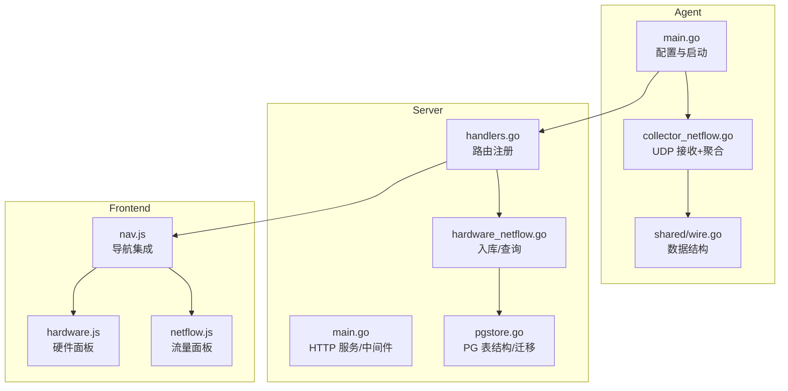
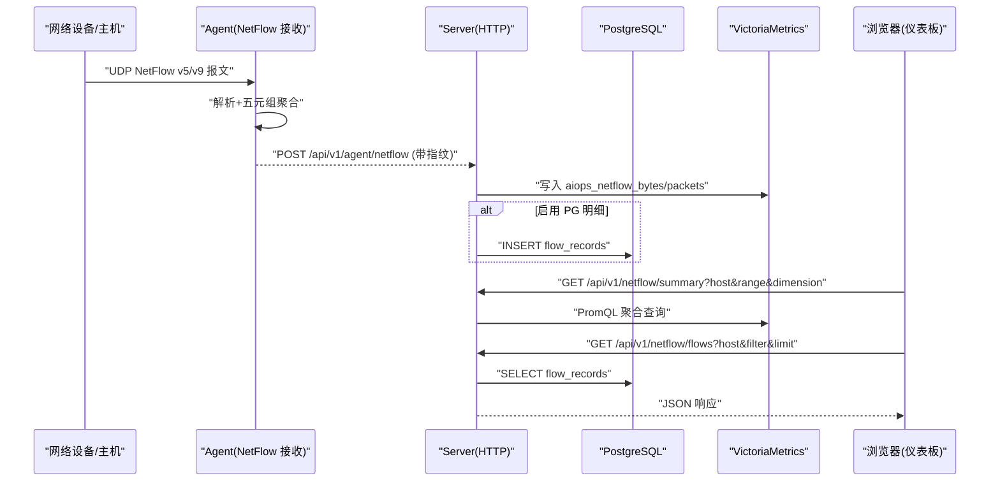
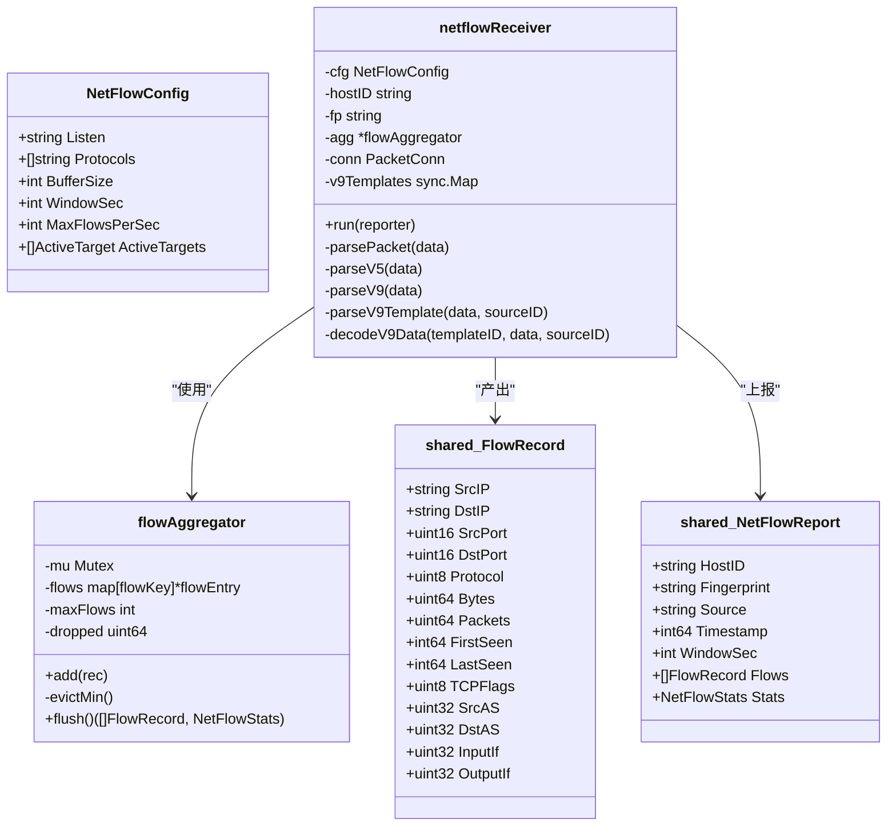
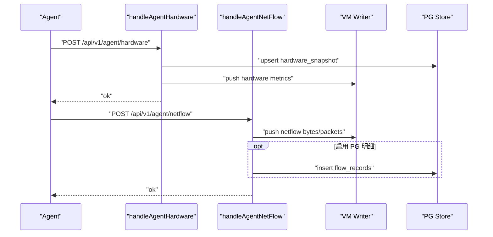
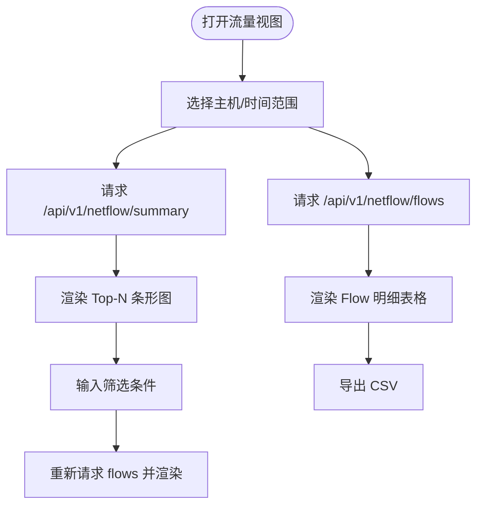
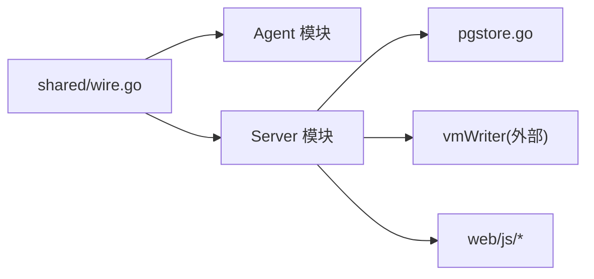

# 网络流量仪表板

<cite>
**本文引用的文件列表**
- [cmd/agent/main.go](file://cmd/agent/main.go)
- [cmd/server/main.go](file://cmd/server/main.go)
- [shared/wire.go](file://shared/wire.go)
- [cmd/agent/collector_netflow.go](file://cmd/agent/collector_netflow.go)
- [cmd/server/handlers.go](file://cmd/server/handlers.go)
- [cmd/server/hardware_netflow.go](file://cmd/server/hardware_netflow.go)
- [cmd/server/pgstore.go](file://cmd/server/pgstore.go)
- [cmd/server/web/js/netflow.js](file://cmd/server/web/js/netflow.js)
- [cmd/server/web/js/hardware.js](file://cmd/server/web/js/hardware.js)
- [cmd/server/web/js/nav.js](file://cmd/server/web/js/nav.js)
</cite>

## 目录
1. [简介](#简介)
2. [项目结构](#项目结构)
3. [核心组件](#核心组件)
4. [架构总览](#架构总览)
5. [详细组件分析](#详细组件分析)
6. [依赖关系分析](#依赖关系分析)
7. [性能与容量规划](#性能与容量规划)
8. [故障排查指南](#故障排查指南)
9. [结论](#结论)
10. [附录：API 参考](#附录api-参考)

## 简介
本文件聚焦于“网络流量仪表板”的端到端实现，涵盖三类采集器中的两类（NetFlow 五元组聚合、Redfish 硬件状态）以及 Server 端的查询与分析能力。系统采用 Agent + Server 的双端架构：Agent 负责在目标主机或网络设备侧采集数据并上报；Server 提供 HTTP API、持久化到 PostgreSQL 与时序存储（VictoriaMetrics），并为前端仪表板提供可视化数据。

## 项目结构
围绕网络流量与硬件健康的关键路径如下：
- Agent 端
  - 配置加载与启动入口：[cmd/agent/main.go](file://cmd/agent/main.go)
  - NetFlow v5/v9 UDP 接收与聚合：[cmd/agent/collector_netflow.go](file://cmd/agent/collector_netflow.go)
  - 共享数据结构定义（Report/HardwareSnapshot/NetFlowReport 等）：[shared/wire.go](file://shared/wire.go)
- Server 端
  - 路由注册与静态资源装配：[cmd/server/handlers.go](file://cmd/server/handlers.go)
  - 硬件与流量处理逻辑（写入 PG/VM、查询接口）：[cmd/server/hardware_netflow.go](file://cmd/server/hardware_netflow.go)
  - 数据库迁移与表结构（含 hardware_snapshot、hardware_events、flow_records 等）：[cmd/server/pgstore.go](file://cmd/server/pgstore.go)
  - 前端页面模块（NetFlow 面板、硬件面板、导航集成）：
    - [cmd/server/web/js/netflow.js](file://cmd/server/web/js/netflow.js)
    - [cmd/server/web/js/hardware.js](file://cmd/server/web/js/hardware.js)
    - [cmd/server/web/js/nav.js](file://cmd/server/web/js/nav.js)

图表来源
- [cmd/agent/main.go:78-140](file://cmd/agent/main.go#L78-L140)
- [cmd/agent/collector_netflow.go:192-263](file://cmd/agent/collector_netflow.go#L192-L263)
- [shared/wire.go:140-279](file://shared/wire.go#L140-L279)
- [cmd/server/handlers.go:290-300](file://cmd/server/handlers.go#L290-L300)
- [cmd/server/hardware_netflow.go:19-90](file://cmd/server/hardware_netflow.go#L19-L90)
- [cmd/server/pgstore.go:212-252](file://cmd/server/pgstore.go#L212-L252)
- [cmd/server/web/js/nav.js:342-388](file://cmd/server/web/js/nav.js#L342-L388)
- [cmd/server/web/js/netflow.js:1-77](file://cmd/server/web/js/netflow.js#L1-L77)
- [cmd/server/web/js/hardware.js:1-44](file://cmd/server/web/js/hardware.js#L1-L44)

章节来源
- [cmd/agent/main.go:78-140](file://cmd/agent/main.go#L78-L140)
- [cmd/server/handlers.go:290-300](file://cmd/server/handlers.go#L290-L300)
- [cmd/server/pgstore.go:212-252](file://cmd/server/pgstore.go#L212-L252)

## 核心组件
- 共享数据结构
  - Report/HardwareSnapshot/NetFlowReport/FlowRecord 等类型统一了 Agent 与 Server 的数据契约，避免协议漂移。
- Agent 端 NetFlow 接收器
  - 监听 UDP 端口，解析 NetFlow v5/v9，按五元组聚合，周期性刷新窗口并上报。
- Server 端处理器
  - 指纹校验后写入 PG（可选明细）与 VM（指标趋势），并提供前端查询 API。
- 前端仪表板
  - 导航集成“流量”视图，渲染 Top-N 排行与 Flow 明细表格，支持筛选与导出 CSV。

章节来源
- [shared/wire.go:140-279](file://shared/wire.go#L140-L279)
- [cmd/agent/collector_netflow.go:192-263](file://cmd/agent/collector_netflow.go#L192-L263)
- [cmd/server/hardware_netflow.go:19-90](file://cmd/server/hardware_netflow.go#L19-L90)
- [cmd/server/web/js/netflow.js:1-77](file://cmd/server/web/js/netflow.js#L1-L77)

## 架构总览
下图展示从设备/主机到仪表板的完整数据流：

图表来源
- [cmd/agent/collector_netflow.go:203-263](file://cmd/agent/collector_netflow.go#L203-L263)
- [cmd/server/handlers.go:290-298](file://cmd/server/handlers.go#L290-L298)
- [cmd/server/hardware_netflow.go:60-90](file://cmd/server/hardware_netflow.go#L60-L90)
- [cmd/server/hardware_netflow.go:160-227](file://cmd/server/hardware_netflow.go#L160-L227)
- [cmd/server/hardware_netflow.go:229-255](file://cmd/server/hardware_netflow.go#L229-L255)
- [cmd/server/web/js/netflow.js:57-77](file://cmd/server/web/js/netflow.js#L57-L77)

## 详细组件分析

### Agent 端：NetFlow 接收与聚合
- 运行模型
  - 独立 goroutine 监听 UDP，周期定时器刷新聚合窗口，将聚合结果以 NetFlowReport 上报。
- 协议支持
  - NetFlow v5：固定头+记录格式解析。
  - NetFlow v9：模板缓存（sourceID+templateID→模板），动态解码字段。
- 内存控制
  - 基于五元组的 map 聚合，达到上限时驱逐最小字节条目，统计 dropped 计数。
- 上报策略
  - 每 WindowSec 刷新一次，生成包含 flows 与 stats 的 NetFlowReport，通过 Reporter 上报至 Server。

图表来源
- [cmd/agent/collector_netflow.go:14-68](file://cmd/agent/collector_netflow.go#L14-L68)
- [cmd/agent/collector_netflow.go:167-200](file://cmd/agent/collector_netflow.go#L167-L200)
- [cmd/agent/collector_netflow.go:203-263](file://cmd/agent/collector_netflow.go#L203-L263)
- [shared/wire.go:243-279](file://shared/wire.go#L243-L279)

章节来源
- [cmd/agent/collector_netflow.go:192-263](file://cmd/agent/collector_netflow.go#L192-L263)
- [cmd/agent/collector_netflow.go:281-340](file://cmd/agent/collector_netflow.go#L281-L340)
- [cmd/agent/collector_netflow.go:342-464](file://cmd/agent/collector_netflow.go#L342-L464)
- [shared/wire.go:243-279](file://shared/wire.go#L243-L279)

### Server 端：硬件与流量处理
- 指纹鉴权
  - 所有 agent 上报接口均要求 X-Agent-Fingerprint 或 fp 参数，确保仅合法主机可上报。
- 硬件快照
  - 接收 HardwareReport，UPSERT 最新快照到 PG，同时写 VM 指标（温度、风扇、功耗、健康分）。
- 流量聚合
  - 接收 NetFlowReport，写 VM 指标（bytes/packets/dropped），可选写入 PG 明细用于检索与导出。
- 查询接口
  - 硬件健康/历史：返回最新快照与 VM 时序点。
  - 流量汇总：按维度（src_ip/dst_ip/port/proto）Top-N 聚合。
  - 流量明细：从 PG 拉取最近记录，支持过滤与分页。

图表来源
- [cmd/server/handlers.go:290-298](file://cmd/server/handlers.go#L290-L298)
- [cmd/server/hardware_netflow.go:19-58](file://cmd/server/hardware_netflow.go#L19-L58)
- [cmd/server/hardware_netflow.go:60-90](file://cmd/server/hardware_netflow.go#L60-L90)

章节来源
- [cmd/server/handlers.go:290-298](file://cmd/server/handlers.go#L290-L298)
- [cmd/server/hardware_netflow.go:19-90](file://cmd/server/hardware_netflow.go#L19-L90)

### 前端仪表板：流量与硬件视图
- 导航集成
  - nav.js 注册“流量”和“硬件”视图，点击后调用对应渲染函数。
- 流量面板
  - 选择主机与时间范围，并行请求 Top-N 汇总与 Flow 明细，渲染条形图与表格，支持筛选与导出 CSV。
- 硬件面板
  - 遍历在线主机，并发获取硬件快照，卡片展示健康状态、CPU/温度/风扇/电源/固件等信息，支持展开详情。

图表来源
- [cmd/server/web/js/nav.js:342-388](file://cmd/server/web/js/nav.js#L342-L388)
- [cmd/server/web/js/netflow.js:10-77](file://cmd/server/web/js/netflow.js#L10-L77)
- [cmd/server/web/js/netflow.js:147-175](file://cmd/server/web/js/netflow.js#L147-L175)
- [cmd/server/web/js/hardware.js:8-44](file://cmd/server/web/js/hardware.js#L8-L44)

章节来源
- [cmd/server/web/js/nav.js:342-388](file://cmd/server/web/js/nav.js#L342-L388)
- [cmd/server/web/js/netflow.js:1-198](file://cmd/server/web/js/netflow.js#L1-L198)
- [cmd/server/web/js/hardware.js:1-168](file://cmd/server/web/js/hardware.js#L1-L168)

## 依赖关系分析
- 模块耦合
  - Agent 与 Server 通过 shared/wire.go 的结构体保持强一致的数据契约。
  - Server 的 handlers 层对 hardware_netflow 进行编排，后者再访问 pgstore 与 vmWriter。
- 外部依赖
  - PostgreSQL：持久化硬件快照、事件、Flow 明细。
  - VictoriaMetrics：时序指标（硬件温度/风扇/功耗、流量 bytes/packets/dropped）。
- 潜在循环依赖
  - 当前未见循环引用；Agent 仅依赖 shared 包，Server 内部分层清晰。

图表来源
- [shared/wire.go:140-279](file://shared/wire.go#L140-L279)
- [cmd/server/handlers.go:290-300](file://cmd/server/handlers.go#L290-L300)
- [cmd/server/pgstore.go:212-252](file://cmd/server/pgstore.go#L212-L252)

章节来源
- [shared/wire.go:140-279](file://shared/wire.go#L140-L279)
- [cmd/server/handlers.go:290-300](file://cmd/server/handlers.go#L290-L300)
- [cmd/server/pgstore.go:212-252](file://cmd/server/pgstore.go#L212-L252)

## 性能与容量规划
- Agent 端
  - 聚合窗口大小 WindowSec 建议 5 分钟，平衡实时性与上报开销。
  - max_flows 默认 100k，可按内存预算调整；注意 evict 策略会丢弃低流量条目。
  - UDP 读缓冲 buffer_size 建议根据吞吐调优。
- Server 端
  - VM 写入为追加型，适合高吞吐；PG 明细可选开启，需评估磁盘与清理策略。
  - 查询接口对 VM 的 PromQL 聚合应限制 topN 与时间范围，避免大结果集。
- 前端
  - 并行请求 summary 与 flows，注意错误重试与空态提示。
  - CSV 导出在客户端完成，避免服务端额外压力。

[本节为通用指导，不直接分析具体文件]

## 故障排查指南
- Agent 无法接收 NetFlow
  - 检查 UDP 监听地址与端口是否被占用；确认防火墙放行。
  - 查看日志中“NetFlow UDP 监听失败/读取错误”。
- 协议版本不支持
  - 确认设备发送的是 v5 或 v9；其他版本将被忽略。
- 聚合丢失/抖动
  - 检查 WindowSec 与 max_flows；在高基数场景下适当增大内存上限或缩短窗口。
- Server 未收到上报
  - 核对 X-Agent-Fingerprint 或 fp 参数是否与主机注册信息一致。
  - 检查 /api/v1/agent/netflow 返回码与错误消息。
- 前端无数据
  - 确认已选择主机与合理时间范围；检查浏览器控制台网络请求是否成功。
  - 若 PG 明细为空，确认是否启用了 PG 写入与索引正常。

章节来源
- [cmd/agent/collector_netflow.go:203-263](file://cmd/agent/collector_netflow.go#L203-L263)
- [cmd/server/hardware_netflow.go:60-90](file://cmd/server/hardware_netflow.go#L60-L90)
- [cmd/server/web/js/netflow.js:57-77](file://cmd/server/web/js/netflow.js#L57-L77)

## 结论
该方案以轻量 Agent 接收 NetFlow 并在本地聚合，降低网络与后端压力；Server 端将关键指标写入时序库用于趋势分析，并将可选明细落库用于检索与导出；前端提供直观的 Top-N 与明细表格，满足日常运维与排障需求。配合 Redfish 硬件健康面板，形成“网络+硬件”的一体化观测体验。

[本节为总结性内容，不直接分析具体文件]

## 附录：API 参考
- Agent 上报
  - POST /api/v1/agent/netflow — 指纹鉴权，提交 NetFlowReport
  - POST /api/v1/agent/hardware — 指纹鉴权，提交 HardwareReport
- 前端查询
  - GET /api/v1/netflow/summary?host=&range=&dimension=&top=
  - GET /api/v1/netflow/flows?host=&filter=&limit=
  - GET /api/v1/hardware/health?host=
  - GET /api/v1/hardware/history?host=&metric=&range=&target=

章节来源
- [cmd/server/handlers.go:290-298](file://cmd/server/handlers.go#L290-L298)
- [cmd/server/hardware_netflow.go:96-158](file://cmd/server/hardware_netflow.go#L96-L158)
- [cmd/server/hardware_netflow.go:160-227](file://cmd/server/hardware_netflow.go#L160-L227)
- [cmd/server/hardware_netflow.go:229-277](file://cmd/server/hardware_netflow.go#L229-L277)