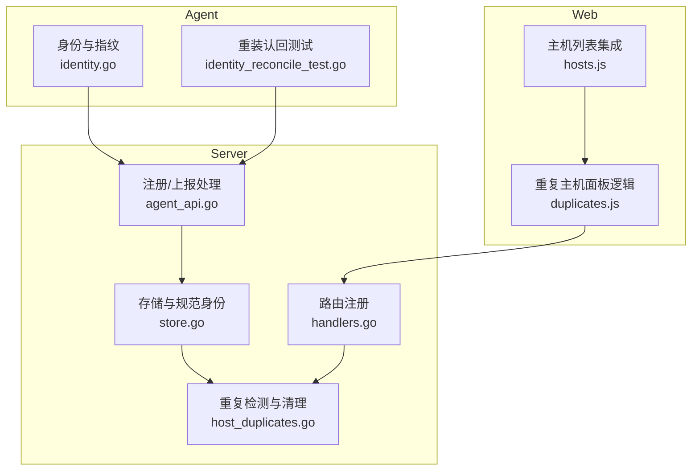
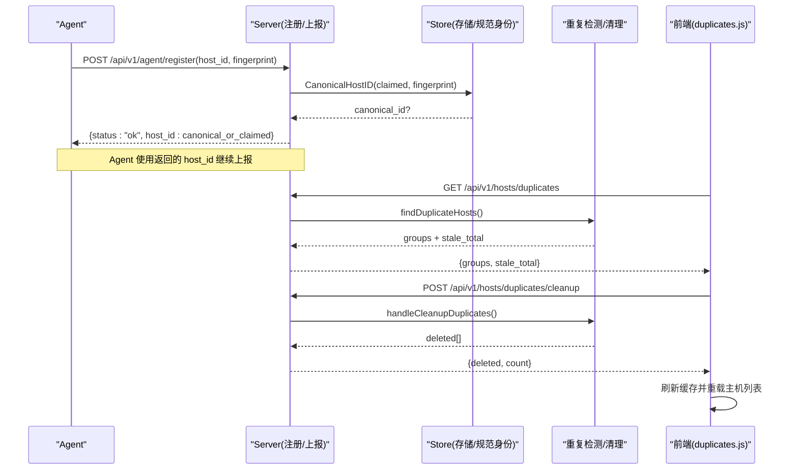
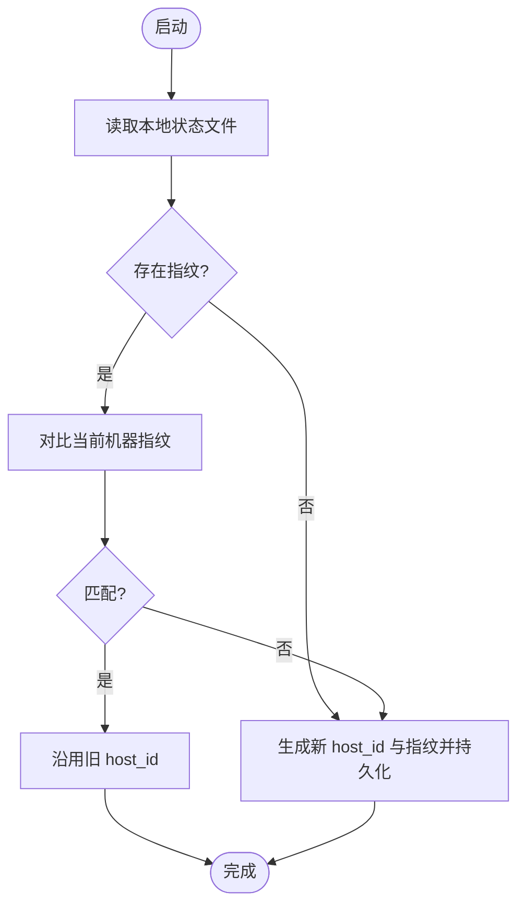
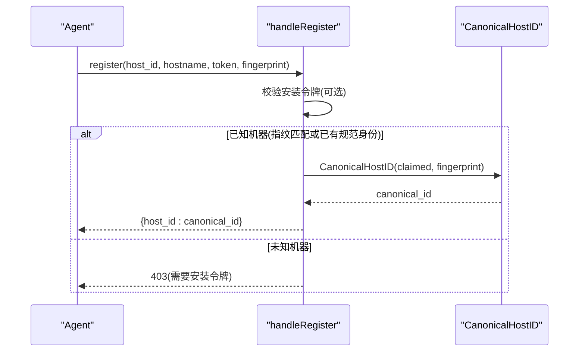
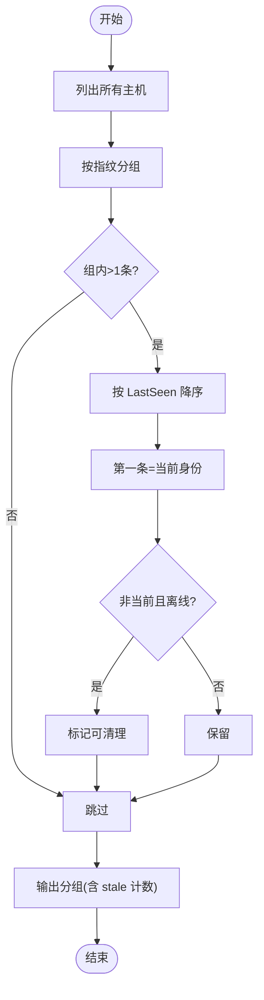
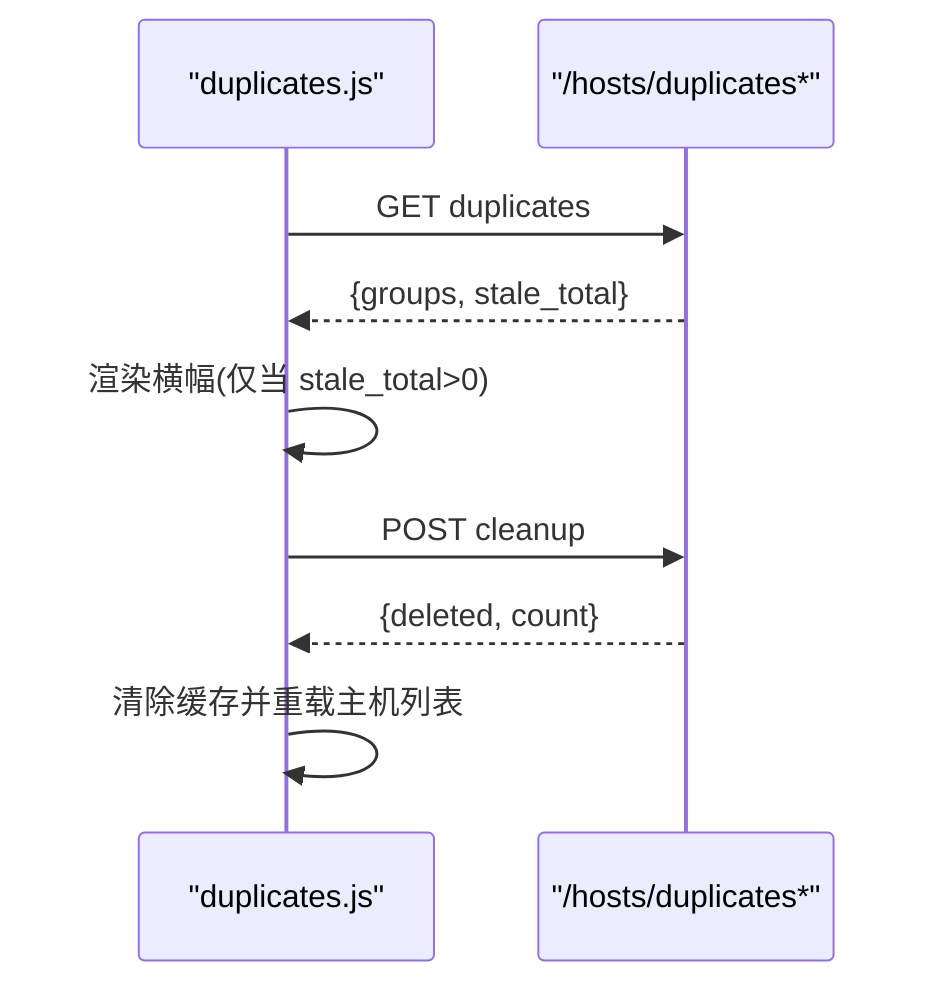
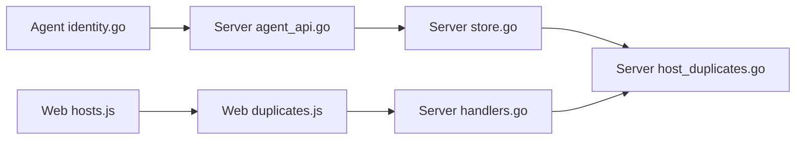

# 重复主机检测与管理

<cite>
**本文引用的文件**   
- [host_duplicates.go](file://cmd/server/host_duplicates.go)
- [host_duplicates_test.go](file://cmd/server/host_duplicates_test.go)
- [handlers.go](file://cmd/server/handlers.go)
- [agent_api.go](file://cmd/server/agent_api.go)
- [store.go](file://cmd/server/store.go)
- [identity.go](file://cmd/agent/identity.go)
- [identity_reconcile_test.go](file://cmd/agent/identity_reconcile_test.go)
- [duplicates.js](file://cmd/server/web/js/duplicates.js)
- [hosts.js](file://cmd/server/web/js/hosts.js)
</cite>

## 目录
1. [简介](#简介)
2. [项目结构](#项目结构)
3. [核心组件](#核心组件)
4. [架构总览](#架构总览)
5. [详细组件分析](#详细组件分析)
6. [依赖关系分析](#依赖关系分析)
7. [性能与一致性考量](#性能与一致性考量)
8. [故障排查指南](#故障排查指南)
9. [结论](#结论)
10. [附录：API 定义](#附录api-定义)

## 简介
本文件聚焦于“重复主机检测与管理”的完整方案，覆盖从 Agent 端身份生成、指纹绑定与重装认回，到 Server 端重复分组识别、安全清理策略，以及前端提示与操作闭环。目标是解决因 Agent 随机 host_id 在卸载重装后变化导致的同一物理机出现多条记录问题，确保历史数据不被劈裂，同时提供安全的存量清理能力。

## 项目结构
围绕重复主机主题，涉及的关键位置如下：
- Agent 端
  - 身份持久化与机器指纹生成：[identity.go](file://cmd/agent/identity.go)
  - 重装认回流程测试（端到端）：[identity_reconcile_test.go](file://cmd/agent/identity_reconcile_test.go)
- Server 端
  - 注册与上报鉴权、规范身份对齐：[agent_api.go](file://cmd/server/agent_api.go)、[store.go](file://cmd/server/store.go)
  - 重复主机发现与清理接口实现：[host_duplicates.go](file://cmd/server/host_duplicates.go)
  - 路由注册（暴露 API）：[handlers.go](file://cmd/server/handlers.go)
- 前端
  - 重复主机横幅、详情弹窗与清理交互：[duplicates.js](file://cmd/server/web/js/duplicates.js)
  - 主机列表页集成横幅入口：[hosts.js](file://cmd/server/web/js/hosts.js)

图表来源
- [identity.go:1-198](file://cmd/agent/identity.go#L1-L198)
- [identity_reconcile_test.go:1-115](file://cmd/agent/identity_reconcile_test.go#L1-L115)
- [agent_api.go:1-150](file://cmd/server/agent_api.go#L1-L150)
- [store.go:200-264](file://cmd/server/store.go#L200-L264)
- [host_duplicates.go:1-140](file://cmd/server/host_duplicates.go#L1-L140)
- [handlers.go:104-130](file://cmd/server/handlers.go#L104-L130)
- [duplicates.js:1-77](file://cmd/server/web/js/duplicates.js#L1-L77)
- [hosts.js:150-160](file://cmd/server/web/js/hosts.js#L150-L160)

章节来源
- [identity.go:1-198](file://cmd/agent/identity.go#L1-L198)
- [identity_reconcile_test.go:1-115](file://cmd/agent/identity_reconcile_test.go#L1-L115)
- [agent_api.go:1-150](file://cmd/server/agent_api.go#L1-L150)
- [store.go:200-264](file://cmd/server/store.go#L200-L264)
- [host_duplicates.go:1-140](file://cmd/server/host_duplicates.go#L1-L140)
- [handlers.go:104-130](file://cmd/server/handlers.go#L104-L130)
- [duplicates.js:1-77](file://cmd/server/web/js/duplicates.js#L1-L77)
- [hosts.js:150-160](file://cmd/server/web/js/hosts.js#L150-L160)

## 核心组件
- 机器指纹与身份持久化
  - 通过 OS machine-id 与主 MAC 组合哈希生成稳定指纹；本地状态文件保存 host_id 与指纹，跨重启保持；当检测到克隆导致指纹不一致时重新生成 host_id，避免多机争用同一记录。
- 注册与规范身份对齐
  - 注册时若配置要求安装令牌，则允许已知机器凭指纹免令牌重注册；按指纹查找最早记录的 host_id 作为“规范身份”，下发给 Agent 以接续历史。
- 重复主机分组与清理
  - 基于指纹将同物理机的多条记录分组，最近一次上报为“当前身份”，其余离线且满足条件者标记为“可清理”；清理仅删除“非当前 + 已离线”的记录，并记录审计日志。
- 前端交互
  - 主机页面顶部横幅提示可清理数量，支持查看明细与一键清理；清理成功后刷新缓存并重新拉取主机列表。

章节来源
- [identity.go:1-198](file://cmd/agent/identity.go#L1-L198)
- [agent_api.go:30-104](file://cmd/server/agent_api.go#L30-L104)
- [store.go:200-264](file://cmd/server/store.go#L200-L264)
- [host_duplicates.go:44-140](file://cmd/server/host_duplicates.go#L44-L140)
- [duplicates.js:1-77](file://cmd/server/web/js/duplicates.js#L1-L77)
- [hosts.js:150-160](file://cmd/server/web/js/hosts.js#L150-L160)

## 架构总览
下图展示从 Agent 身份生成到 Server 端重复检测与清理的全链路，以及前端的参与点。

图表来源
- [agent_api.go:30-104](file://cmd/server/agent_api.go#L30-L104)
- [store.go:230-264](file://cmd/server/store.go#L230-L264)
- [host_duplicates.go:96-140](file://cmd/server/host_duplicates.go#L96-L140)
- [duplicates.js:14-66](file://cmd/server/web/js/duplicates.js#L14-L66)

## 详细组件分析

### Agent 身份与指纹
- 关键职责
  - 生成稳定指纹（machine-id + 主 MAC），持久化 host_id 与指纹到状态文件。
  - 当检测到克隆（指纹不一致）时重新生成 host_id，避免多机冲突。
- 设计要点
  - 原子写入状态文件，降低崩溃导致损坏的风险。
  - 无第三方依赖，纯标准库实现。
- 复杂度与边界
  - 指纹计算 O(1)，状态读写 O(1)。
  - 无指纹场景下跳过克隆检测，保证不误判。

图表来源
- [identity.go:30-67](file://cmd/agent/identity.go#L30-L67)
- [identity.go:69-81](file://cmd/agent/identity.go#L69-L81)

章节来源
- [identity.go:1-198](file://cmd/agent/identity.go#L1-L198)

### 注册与规范身份对齐
- 关键职责
  - 校验安装令牌（可按配置开启），但允许已知机器凭指纹免令牌重注册。
  - 通过指纹查找“规范身份”（最早 FirstSeen 的记录），下发给 Agent 以接续历史。
- 设计要点
  - 认证由指纹保障，后续上报也基于指纹验证，令牌轮换不影响已安装 Agent。
  - 对未知主机仍要求安装令牌，确保安全边界。
- 复杂度与边界
  - 规范身份查找遍历 hosts map，O(n)；n 为已登记主机数。
  - 无指纹时拒绝注册，防止误认领。

图表来源
- [agent_api.go:30-104](file://cmd/server/agent_api.go#L30-L104)
- [store.go:230-264](file://cmd/server/store.go#L230-L264)

章节来源
- [agent_api.go:30-104](file://cmd/server/agent_api.go#L30-L104)
- [store.go:230-264](file://cmd/server/store.go#L230-L264)

### 重复主机分组与清理
- 关键职责
  - 按指纹分组，筛选出包含多条记录的真实重复组。
  - 判定“当前身份”（最近 LastSeen）、“可清理”（非当前且离线）。
  - 清理仅删除“可清理”记录，并记录审计日志。
- 设计要点
  - 严格三条件：同指纹 + 非当前 + 已离线，避免误删仍在上报的主机。
  - 输出排序优先显示可清理项，便于运维快速定位。
- 复杂度与边界
  - 分组与排序 O(n log n)，n 为有指纹的主机数。
  - 空指纹主机不参与重复判定，宁可不报也不误判。

图表来源
- [host_duplicates.go:44-95](file://cmd/server/host_duplicates.go#L44-L95)

章节来源
- [host_duplicates.go:44-95](file://cmd/server/host_duplicates.go#L44-L95)

### 前端交互与集成
- 关键职责
  - 加载重复分组与可清理总数，仅在存在可清理项时显示横幅。
  - 提供“查看”和“清理”按钮，清理前二次确认并展示将被删除的明细。
  - 清理成功后清空缓存并触发主机列表重载。
- 设计要点
  - 失败静默：加载失败不影响页面主体功能。
  - 不可逆操作明确提示，避免误操作。

图表来源
- [duplicates.js:14-66](file://cmd/server/web/js/duplicates.js#L14-L66)
- [hosts.js:155-159](file://cmd/server/web/js/hosts.js#L155-L159)

章节来源
- [duplicates.js:1-77](file://cmd/server/web/js/duplicates.js#L1-L77)
- [hosts.js:150-160](file://cmd/server/web/js/hosts.js#L150-L160)

## 依赖关系分析
- Agent 与 Server 的耦合点
  - 注册接口：Agent 携带 host_id 与 fingerprint；Server 根据指纹进行规范身份对齐。
  - 上报鉴权：基于指纹比对，确保只有已注册且指纹一致的主机可上报。
- Server 内部依赖
  - handlers 注册路由，调用 store 与重复检测逻辑。
  - store 提供 RegisterHost、CanonicalHostID、UpsertAuthenticated 等核心方法。
- 前端依赖
  - 通过 REST API 获取重复分组与执行清理，并在成功时刷新缓存。

图表来源
- [identity.go:1-198](file://cmd/agent/identity.go#L1-L198)
- [agent_api.go:1-150](file://cmd/server/agent_api.go#L1-L150)
- [store.go:200-264](file://cmd/server/store.go#L200-L264)
- [host_duplicates.go:1-140](file://cmd/server/host_duplicates.go#L1-L140)
- [handlers.go:104-130](file://cmd/server/handlers.go#L104-L130)
- [duplicates.js:1-77](file://cmd/server/web/js/duplicates.js#L1-L77)
- [hosts.js:150-160](file://cmd/server/web/js/hosts.js#L150-L160)

章节来源
- [handlers.go:104-130](file://cmd/server/handlers.go#L104-L130)
- [agent_api.go:1-150](file://cmd/server/agent_api.go#L1-L150)
- [store.go:200-264](file://cmd/server/store.go#L200-L264)
- [host_duplicates.go:1-140](file://cmd/server/host_duplicates.go#L1-L140)
- [identity.go:1-198](file://cmd/agent/identity.go#L1-L198)
- [duplicates.js:1-77](file://cmd/server/web/js/duplicates.js#L1-L77)
- [hosts.js:150-160](file://cmd/server/web/js/hosts.js#L150-L160)

## 性能与一致性考量
- 性能
  - 重复分组与排序为 O(n log n)，n 为有指纹主机数，通常规模可控。
  - 规范身份查找为 O(n)，可通过索引优化（如维护指纹→id 映射）进一步降低。
- 一致性
  - 注册与上报路径均基于指纹校验，避免 TOCTOU 竞态；上报路径在单一锁内完成鉴权与更新。
  - 清理操作严格限定“可清理”集合，避免并发误删。
- 可扩展性
  - 未来可在 Store 层增加指纹索引以提升查询效率。
  - 前端可引入增量刷新与分页，减少大数据量下的 DOM 压力。

[本节为通用指导，无需特定文件引用]

## 故障排查指南
- 现象：重装后出现两条同名同 IP 主机记录
  - 检查 Agent 是否具备有效指纹；若无指纹，不会参与重复判定。
  - 确认注册接口是否返回规范身份；若未返回，历史可能被劈裂。
- 现象：清理无效或未删除任何记录
  - 确认被清理记录是否为“非当前 + 已离线”；在线或仍在上报不会被清理。
  - 查看服务端审计日志，确认清理动作是否被执行。
- 现象：前端未显示重复横幅
  - 确认 stale_total 是否为 0；若无可清理项，横幅不会显示。
  - 检查网络请求是否成功，失败会静默降级。

章节来源
- [host_duplicates.go:96-140](file://cmd/server/host_duplicates.go#L96-L140)
- [agent_api.go:30-104](file://cmd/server/agent_api.go#L30-L104)
- [duplicates.js:14-66](file://cmd/server/web/js/duplicates.js#L14-L66)

## 结论
通过“指纹绑定 + 规范身份对齐 + 严格清理策略”的组合，系统能够有效避免 Agent 重装导致的重复主机问题，并对存量孤儿记录提供安全的清理手段。前端交互清晰、操作可追溯，整体方案兼顾安全性与可用性。

[本节为总结性内容，无需特定文件引用]

## 附录：API 定义
- 重复主机查询
  - 方法：GET
  - 路径：/api/v1/hosts/duplicates
  - 响应：{ groups: [{ group, hostname, hosts[], stale }], stale_total: number }
- 清理重复主机
  - 方法：POST
  - 路径：/api/v1/hosts/duplicates/cleanup
  - 响应：{ deleted: string[], count: number }

章节来源
- [handlers.go:123-125](file://cmd/server/handlers.go#L123-L125)
- [host_duplicates.go:96-140](file://cmd/server/host_duplicates.go#L96-L140)