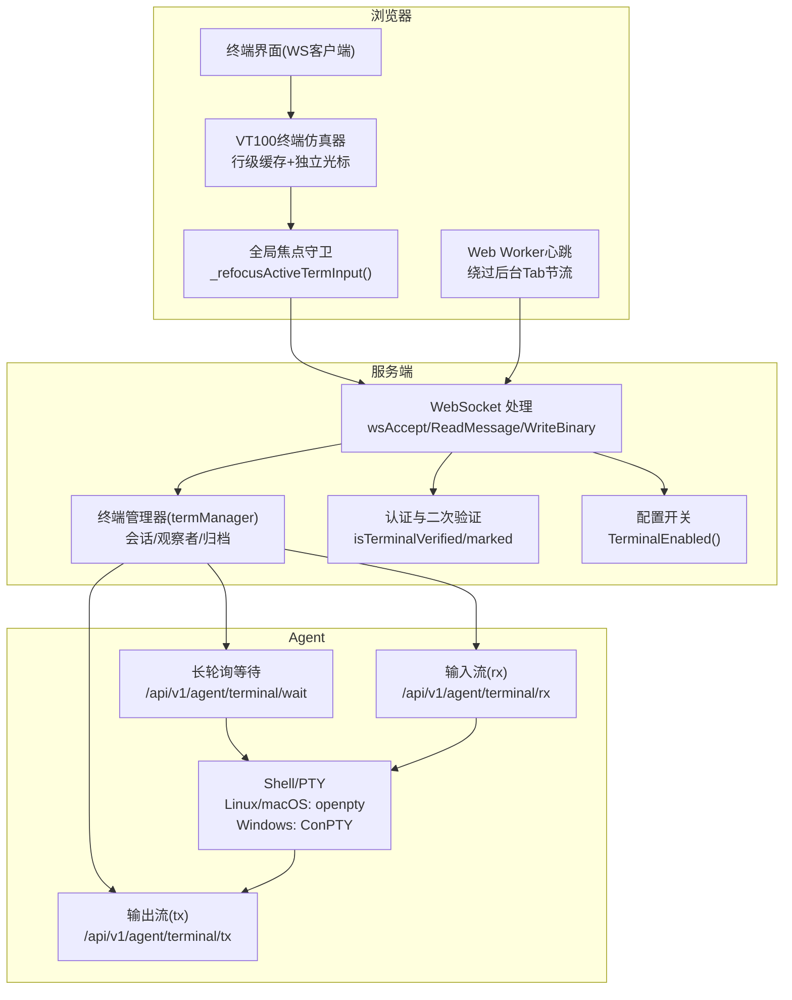
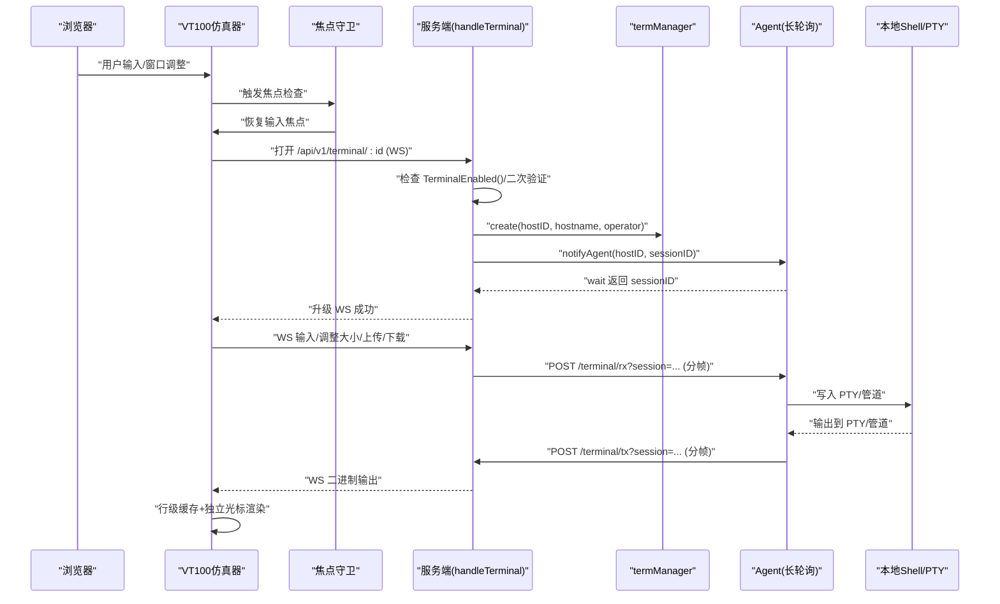
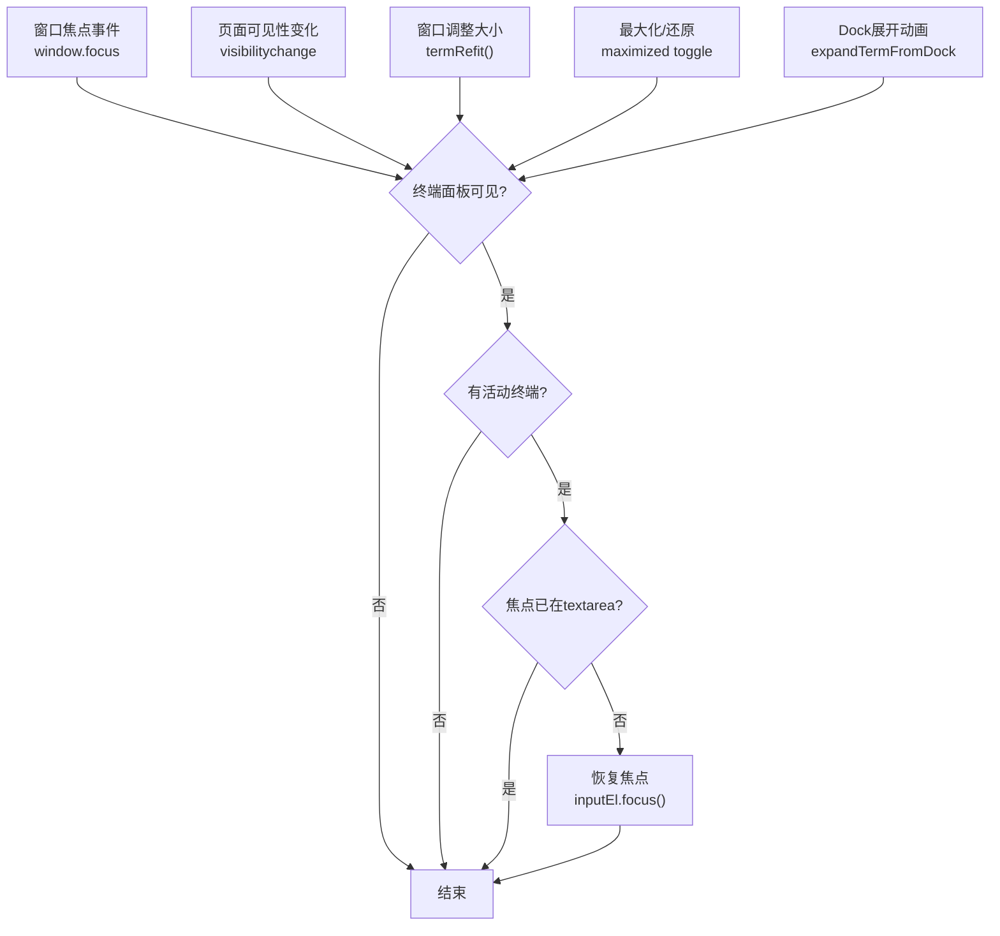
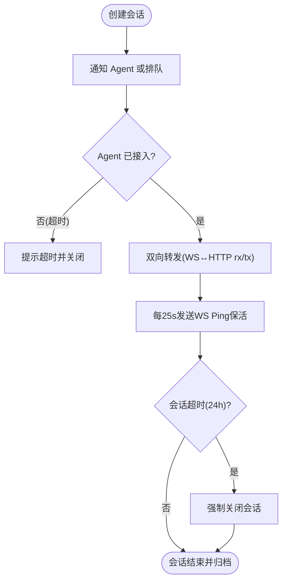
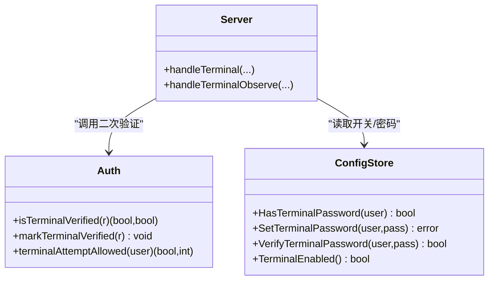
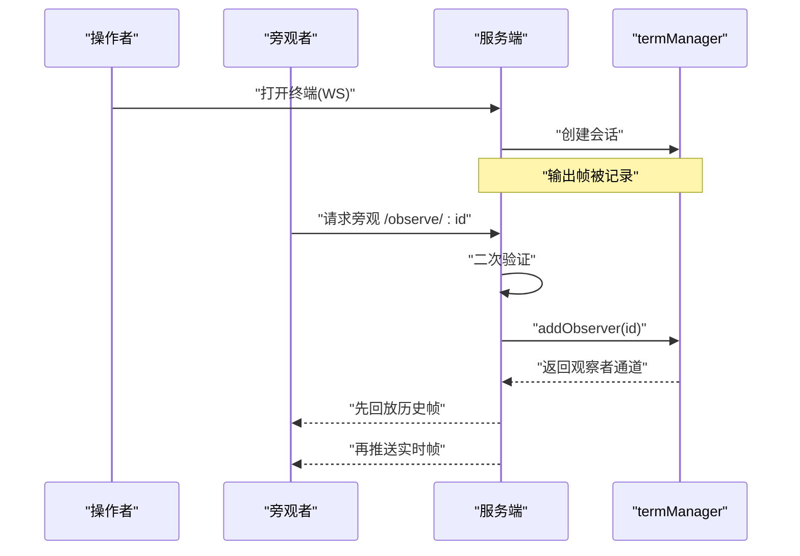
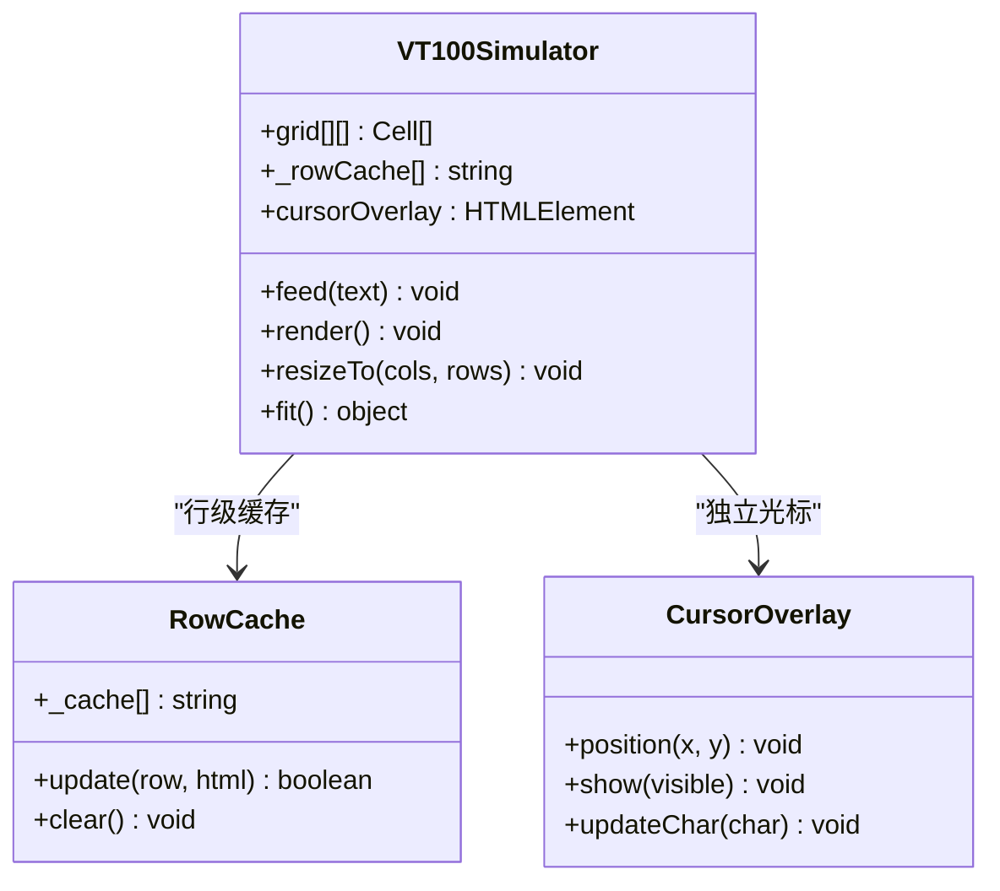
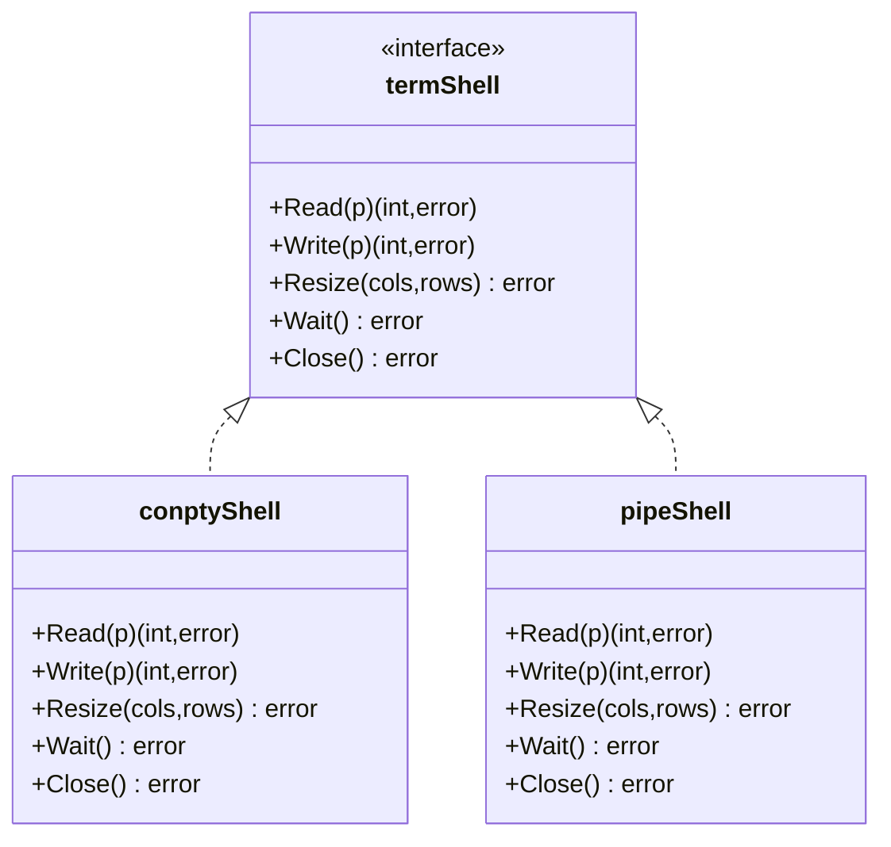
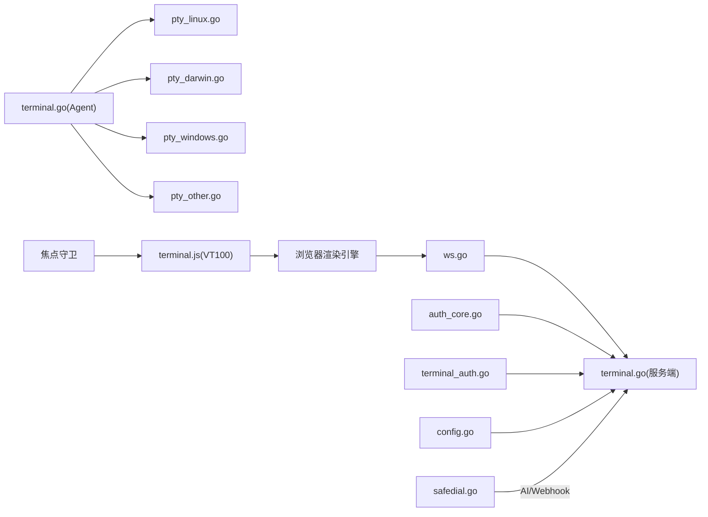

# 终端管理

<cite>
**本文引用的文件**   
- [cmd/server/terminal.go](file://cmd/server/terminal.go)
- [cmd/server/terminal_api.go](file://cmd/server/terminal_api.go)
- [cmd/server/terminal_auth.go](file://cmd/server/terminal_auth.go)
- [cmd/server/ws.go](file://cmd/server/ws.go)
- [cmd/server/auth_core.go](file://cmd/server/auth_core.go)
- [cmd/server/config.go](file://cmd/server/config.go)
- [cmd/server/safedial.go](file://cmd/server/safedial.go)
- [cmd/server/terminal_audit_test.go](file://cmd/server/terminal_audit_test.go)
- [cmd/agent/terminal.go](file://cmd/agent/terminal.go)
- [cmd/agent/pty_linux.go](file://cmd/agent/pty_linux.go)
- [cmd/agent/pty_darwin.go](file://cmd/agent/pty_darwin.go)
- [cmd/agent/pty_windows.go](file://cmd/agent/pty_windows.go)
- [cmd/agent/pty_other.go](file://cmd/agent/pty_other.go)
- [cmd/server/web/js/terminal.js](file://cmd/server/web/js/terminal.js)
- [cmd/server/web/style.css](file://cmd/server/web/style.css)
</cite>

## 更新摘要
**变更内容**   
- **新增**：增强的终端焦点管理功能，实现全局 `_refocusActiveTermInput()` 函数
- **新增**：智能焦点恢复机制，覆盖窗口焦点事件、可见性变化、调整大小、最大化/还原等场景
- **新增**：跨平台兼容性优化，解决 iOS Safari 等浏览器的焦点丢失问题
- **新增**：前端性能优化：行级缓存机制、独立光标渲染、Web Worker 心跳保活
- **新增**：会话超时控制增强：从30分钟提升至24小时，支持长时间运行的终端会话
- **新增**：连接稳定性改进：指数退避重连、自动重连覆盖层、页面可见性检测
- **新增**：渲染性能优化：DOM差量更新、requestAnimationFrame调度、后台标签页兼容

## 目录
1. [简介](#简介)
2. [项目结构](#项目结构)
3. [核心组件](#核心组件)
4. [架构总览](#架构总览)
5. [详细组件分析](#详细组件分析)
6. [依赖关系分析](#依赖关系分析)
7. [性能与并发](#性能与并发)
8. [安全配置指南](#安全配置指南)
9. [使用示例](#使用示例)
10. [故障排查](#故障排查)
11. [结论](#结论)

## 简介
本文件面向 AIOps Monitor 的"远程终端"能力，系统性说明基于 WebSocket 的浏览器端 SSH 终端实现。内容覆盖：
- 会话管理与多用户并发
- 权限控制与安全认证（二次密码、协议确认、速率限制）
- 终端录制与回放、只读旁观模式
- PTY 在 Linux、Windows、macOS 的差异与回退策略
- **新增**：智能焦点管理功能，解决浏览器交互中的光标焦点丢失问题
- **新增**：前端性能优化（行级缓存、独立光标渲染、Web Worker 心跳）
- **新增**：增强的连接稳定性和会话超时控制
- 安全加固（二次验证、SSRF 防护等）
- 实际使用示例与常见问题排查

## 项目结构
远程终端由服务端与 Agent 两端协作完成：
- 服务端负责：WebSocket 接入、鉴权与会话编排、录制与回放、旁观者推送、Agent 反向通道协调
- Agent 负责：长轮询等待任务、拉起本地 Shell/PTY、双向数据流转发、ZMODEM 文件传输、执行模式命令
- **新增**：前端智能焦点管理层：VT100 终端仿真器、行级 DOM 缓存、独立光标渲染、Web Worker 心跳、全局焦点守卫

**图表来源**
- [cmd/server/ws.go:39-70](file://cmd/server/ws.go#L39-L70)
- [cmd/server/terminal.go:440-617](file://cmd/server/terminal.go#L440-L617)
- [cmd/server/terminal_api.go:30-76](file://cmd/server/terminal_api.go#L30-L76)
- [cmd/server/auth_core.go:516-553](file://cmd/server/auth_core.go#L516-L553)
- [cmd/server/config.go:694-700](file://cmd/server/config.go#L694-L700)
- [cmd/agent/terminal.go:206-231](file://cmd/agent/terminal.go#L206-231)
- [cmd/agent/terminal.go:338-423](file://cmd/agent/terminal.go#L338-L423)
- [cmd/server/web/js/terminal.js:80-96](file://cmd/server/web/js/terminal.js#L80-96)

**章节来源**
- [cmd/server/terminal.go:30-128](file://cmd/server/terminal.go#L30-L128)
- [cmd/server/terminal_api.go:1-77](file://cmd/server/terminal_api.go#L1-L77)
- [cmd/server/ws.go:1-184](file://cmd/server/ws.go#L1-L184)
- [cmd/server/auth_core.go:516-553](file://cmd/server/auth_core.go#L516-L553)
- [cmd/server/config.go:694-700](file://cmd/server/config.go#L694-L700)
- [cmd/agent/terminal.go:206-231](file://cmd/agent/terminal.go#L206-231)

## 核心组件
- 终端会话模型 termSession：维护会话 ID、主机信息、操作者、输入/输出通道、观察者集合、录制帧缓冲、审计状态等
- 终端管理器 termManager：创建/删除会话、通知 Agent、归档与持久化录制、加载历史录制、提供观察者订阅
- WebSocket 层 wsConn：最小 RFC 6455 实现，支持文本/二进制帧、Ping/Pong、Close
- **新增**：VT100 终端仿真器：完整的 VT100/xterm 子集支持，包括颜色、光标控制、滚动区域、备用屏幕
- **新增**：前端性能优化：行级 DOM 缓存、独立光标渲染、Web Worker 心跳保活
- **新增**：智能焦点管理系统：全局焦点守卫、跨场景焦点恢复、iOS Safari 兼容性处理
- 认证与二次验证：登录会话 + 终端二次密码校验（可强制），并记录是否已在本会话通过验证
- Agent 侧终端循环：长轮询获取会话、建立 rx/tx 流、启动 Shell/PTY、处理 ZMODEM 与按钮式文件传输

**章节来源**
- [cmd/server/terminal.go:30-128](file://cmd/server/terminal.go#L30-L128)
- [cmd/server/terminal.go:234-285](file://cmd/server/terminal.go#L234-285)
- [cmd/server/ws.go:32-70](file://cmd/server/ws.go#L32-L70)
- [cmd/server/terminal_auth.go:1-40](file://cmd/server/terminal_auth.go#L1-L40)
- [cmd/server/auth_core.go:516-553](file://cmd/server/auth_core.go#L516-L553)
- [cmd/agent/terminal.go:206-231](file://cmd/agent/terminal.go#L206-231)
- [cmd/server/web/js/terminal.js:80-96](file://cmd/server/web/js/terminal.js#L80-96)

## 架构总览
远程终端采用"反向通道"设计：Agent 无入站端口，主动长轮询服务端；服务端将浏览器 WebSocket 与两条 HTTP 流（rx/tx）桥接至 Agent，再由 Agent 桥接到本地 Shell/PTY。

**图表来源**
- [cmd/server/terminal.go:440-617](file://cmd/server/terminal.go#L440-L617)
- [cmd/server/terminal.go:624-696](file://cmd/server/terminal.go#L624-L696)
- [cmd/server/terminal.go:698-735](file://cmd/server/terminal.go#L698-L735)
- [cmd/server/terminal.go:745-800](file://cmd/server/terminal.go#L745-800)
- [cmd/agent/terminal.go:338-423](file://cmd/agent/terminal.go#L338-423)
- [cmd/server/web/js/terminal.js:80-96](file://cmd/server/web/js/terminal.js#L80-96)

## 详细组件分析

### 智能焦点管理系统
**新增**：实现了全局 `_refocusActiveTermInput()` 函数，解决浏览器交互中的光标焦点丢失问题，覆盖多种复杂场景：

- **窗口焦点事件处理**：监听 `window.focus` 事件，当用户从其他应用切换回浏览器时自动恢复终端焦点
- **页面可见性变化处理**：监听 `visibilitychange` 事件，Tab 切换回来后立即恢复活动终端的输入焦点
- **调整大小操作支持**：在 `termRefit()` 函数中调用焦点恢复，确保窗口尺寸调整后焦点不丢失
- **最大化/还原动作支持**：在最大化按钮点击事件中集成焦点恢复，双层 requestAnimationFrame 确保布局稳定
- **Dock展开动画后焦点恢复**：在 `expandTermFromDock()` 中确保动画完成后恢复焦点
- **跨平台兼容性**：通过 `.term-focused` CSS 类为 iOS Safari 等浏览器提供焦点状态兜底

**图表来源**
- [cmd/server/web/js/terminal.js:52-56](file://cmd/server/web/js/terminal.js#L52-56)
- [cmd/server/web/js/terminal.js:58-75](file://cmd/server/web/js/terminal.js#L58-75)
- [cmd/server/web/js/terminal.js:80-96](file://cmd/server/web/js/terminal.js#L80-96)
- [cmd/server/web/js/terminal.js:1220-1240](file://cmd/server/web/js/terminal.js#L1220-1240)
- [cmd/server/web/js/terminal.js:921-924](file://cmd/server/web/js/terminal.js#L921-924)

**章节来源**
- [cmd/server/web/js/terminal.js:52-56](file://cmd/server/web/js/terminal.js#L52-56)
- [cmd/server/web/js/terminal.js:58-75](file://cmd/server/web/js/terminal.js#L58-75)
- [cmd/server/web/js/terminal.js:80-96](file://cmd/server/web/js/terminal.js#L80-96)
- [cmd/server/web/js/terminal.js:1220-1240](file://cmd/server/web/js/terminal.js#L1220-1240)
- [cmd/server/web/js/terminal.js:921-924](file://cmd/server/web/js/terminal.js#L921-924)
- [cmd/server/web/style.css:1181-1184](file://cmd/server/web/style.css#L1181-1184)

### 会话管理与多用户并发
- 会话生命周期：创建 → 通知 Agent → 等待 Agent 接入 → 双向转发 → 关闭并归档
- 并发模型：每个会话独立 goroutine 处理浏览器→Agent 与 Agent→浏览器两个方向；观察者以 map 广播输出，慢消费者丢弃而非阻塞主流程
- 批量执行竞态修复：当 Agent 不在长轮询窗口时，服务端将 sessionID 暂存 pendingSessions，下次轮询立即派发，避免丢失
- **新增**：会话超时保护：从30分钟提升至24小时，支持长时间运行的监控场景
- 超时保护：若 Agent 未在 35s 内接入，向浏览器提示超时并关闭会话

**图表来源**
- [cmd/server/terminal.go:261-285](file://cmd/server/terminal.go#L261-285)
- [cmd/server/terminal.go:371-401](file://cmd/server/terminal.go#L371-401)
- [cmd/server/terminal.go:492-508](file://cmd/server/terminal.go#L492-508)
- [cmd/server/terminal.go:597-615](file://cmd/server/terminal.go#L597-L615)
- [cmd/agent/terminal.go:67-73](file://cmd/agent/terminal.go#L67-L73)

**章节来源**
- [cmd/server/terminal.go:30-128](file://cmd/server/terminal.go#L30-L128)
- [cmd/server/terminal.go:261-285](file://cmd/server/terminal.go#L261-285)
- [cmd/server/terminal.go:371-401](file://cmd/server/terminal.go#L371-401)
- [cmd/server/terminal.go:492-508](file://cmd/server/terminal.go#L492-508)
- [cmd/server/terminal.go:597-615](file://cmd/server/terminal.go#L597-L615)
- [cmd/agent/terminal.go:67-73](file://cmd/agent/terminal.go#L67-L73)

### 权限控制与安全认证机制
- 功能开关：TerminalDisabled 为真则禁用终端
- 二次验证：若用户设置了终端密码，则在打开终端前需通过 isTerminalVerified；首次设置后可自动标记当前会话已验证
- 修改终端密码：若已有密码，变更时需 MFA 或登录密码校验；设置成功后自动标记已验证
- 验证速率限制：失败次数过多会锁定一段时间，防止暴力破解
- 审计日志：打开/关闭终端、旁观、设置/验证终端密码均记录操作日志

**图表来源**
- [cmd/server/config.go:694-700](file://cmd/server/config.go#L694-L700)
- [cmd/server/terminal_auth.go:50-122](file://cmd/server/terminal_auth.go#L50-L122)
- [cmd/server/terminal_auth.go:124-172](file://cmd/server/terminal_auth.go#L124-L172)
- [cmd/server/auth_core.go:516-553](file://cmd/server/auth_core.go#L516-L553)

**章节来源**
- [cmd/server/config.go:694-700](file://cmd/server/config.go#L694-L700)
- [cmd/server/terminal_auth.go:1-40](file://cmd/server/terminal_auth.go#L1-L40)
- [cmd/server/terminal_auth.go:50-122](file://cmd/server/terminal_auth.go#L50-L122)
- [cmd/server/terminal_auth.go:124-172](file://cmd/server/terminal_auth.go#L124-L172)
- [cmd/server/auth_core.go:516-553](file://cmd/server/auth_core.go#L516-L553)

### 终端录制与回放、只读旁观模式
- 录制：对输出帧进行时间戳+base64编码存储，单会话最多保留固定数量帧，避免内存膨胀
- 归档：会话结束时将录制写入磁盘文件（JSON），并在内存中维护最近 N 条索引，重启后可恢复列表
- 回放：按会话 ID 拉取完整录制帧，前端重放
- 旁观：另一登录用户可通过 WebSocket 以只读方式观看实时输出，先回放历史再跟随直播

**图表来源**
- [cmd/server/terminal.go:95-107](file://cmd/server/terminal.go#L95-L107)
- [cmd/server/terminal.go:155-187](file://cmd/server/terminal.go#L155-L187)
- [cmd/server/terminal.go:189-232](file://cmd/server/terminal.go#L189-L232)
- [cmd/server/terminal_api.go:13-28](file://cmd/server/terminal_api.go#L13-L28)
- [cmd/server/terminal_api.go:30-76](file://cmd/server/terminal_api.go#L30-L76)

**章节来源**
- [cmd/server/terminal.go:95-107](file://cmd/server/terminal.go#L95-L107)
- [cmd/server/terminal.go:155-187](file://cmd/server/terminal.go#L155-L187)
- [cmd/server/terminal.go:189-232](file://cmd/server/terminal.go#L189-L232)
- [cmd/server/terminal_api.go:13-28](file://cmd/server/terminal_api.go#L13-L28)
- [cmd/server/terminal_api.go:30-76](file://cmd/server/terminal_api.go#L30-L76)

### 多用户并发访问支持
- 每个终端会话独立 goroutine 处理输入/输出
- 观察者通过 fanOut 非阻塞广播，避免阻塞主会话
- 服务器级 keepalive 定时 Ping，保持空闲连接存活

**章节来源**
- [cmd/server/terminal.go:68-80](file://cmd/server/terminal.go#L68-L80)
- [cmd/server/terminal.go:597-615](file://cmd/server/terminal.go#L597-L615)

### VT100 终端仿真器与性能优化
**新增**：前端实现了完整的 VT100/xterm 终端仿真器，包含以下性能优化特性：

- **行级缓存机制**：维护 `_rowCache` 数组，仅更新内容变化的行 DOM，避免全量 innerHTML 替换
- **独立光标渲染**：使用绝对定位的 `cursorOverlay` 元素，不触发行重建，提升光标移动性能
- **Web Worker 心跳**：绕过浏览器后台 Tab 节流限制，每15秒发送 keepalive 帧保持连接活跃
- **智能渲染调度**：结合 requestAnimationFrame 和 setTimeout 兜底，确保前台流畅、后台可用
- **指数退避重连**：自动重连机制，最大重试50次，超过阈值后降级为手动重连
- **页面可见性检测**：Tab 恢复时自动检查并重连断开的连接

**图表来源**
- [cmd/server/web/js/terminal.js:1648-1930](file://cmd/server/web/js/terminal.js#L1648-1930)
- [cmd/server/web/js/terminal.js:1830-1886](file://cmd/server/web/js/terminal.js#L1830-1886)

**章节来源**
- [cmd/server/web/js/terminal.js:1648-1930](file://cmd/server/web/js/terminal.js#L1648-1930)
- [cmd/server/web/js/terminal.js:1830-1886](file://cmd/server/web/js/terminal.js#L1830-1886)
- [cmd/server/web/js/terminal.js:11-50](file://cmd/server/web/js/terminal.js#L11-50)
- [cmd/server/web/js/terminal.js:585-625](file://cmd/server/web/js/terminal.js#L585-625)

### PTY 在不同操作系统上的实现差异
- Linux/macOS：通过系统 openpty 接口（/dev/ptmx + ioctl）创建伪终端，支持窗口大小调整
- Windows：使用 ConPTY（CreatePseudoConsole）创建伪控制台，绑定进程标准输入输出；若无 ConPTY 则回退到管道 stdio
- 其他平台：newPTY 返回 nil，统一回退到管道模式
- 管道回退：缺少真实 TTY 特性（如颜色、全屏程序），但保证基本交互可用；同时做 CR→LF 转换兼容

**图表来源**
- [cmd/agent/terminal.go:38-45](file://cmd/agent/terminal.go#L38-L45)
- [cmd/agent/pty_windows.go:62-73](file://cmd/agent/pty_windows.go#L62-L73)
- [cmd/agent/terminal.go:853-913](file://cmd/agent/terminal.go#L853-913)

**章节来源**
- [cmd/agent/pty_linux.go:20-36](file://cmd/agent/pty_linux.go#L20-L36)
- [cmd/agent/pty_darwin.go:20-43](file://cmd/agent/pty_darwin.go#L20-L43)
- [cmd/agent/pty_windows.go:75-185](file://cmd/agent/pty_windows.go#L75-L185)
- [cmd/agent/pty_other.go:5-8](file://cmd/agent/pty_other.go#L5-L8)
- [cmd/agent/terminal.go:842-849](file://cmd/agent/terminal.go#L842-L849)

### 文件传输与 ZMODEM
- ZMODEM 检测：从 PTY 输出中识别 ZMODEM 头，进入 rz/sz 模式；根据后续帧区分上传/下载
- 按钮式文件传输：通过 'f'/'u'/'e'/'d' 帧实现上传元数据、数据块、结束与下载请求，服务端/Agent 分别处理
- 限速与边界：上传大小上限、下载大小上限、路径清理与相对路径落盘到临时目录等

**章节来源**
- [cmd/agent/terminal.go:425-598](file://cmd/agent/terminal.go#L425-L598)
- [cmd/agent/terminal.go:600-695](file://cmd/agent/terminal.go#L600-L695)
- [cmd/agent/terminal.go:929-1191](file://cmd/agent/terminal.go#L929-L1191)

### 命令审计与敏感信息脱敏
- 命令提取：从输入行解析出"完整命令"，用于审计日志
- 密码提示抑制：检测到密码提示后，下一行输入不纳入命令审计，避免记录明文密码
- 敏感字段脱敏：对常见参数（如 -p、token、password 等）进行脱敏替换，普通命令不受影响

**章节来源**
- [cmd/server/terminal.go:543-557](file://cmd/server/terminal.go#L543-L557)
- [cmd/server/terminal_audit_test.go:8-49](file://cmd/server/terminal_audit_test.go#L8-L49)

## 依赖关系分析
- 服务端依赖：
  - WebSocket 实现（ws.go）
  - 认证与二次验证（auth_core.go、terminal_auth.go）
  - 配置开关（config.go）
  - SSRF 出站防护（safedial.go，用于 AI/Webhook 等场景）
- Agent 依赖：
  - 平台相关 PTY（pty_linux/darwin/windows/other）
  - 终端会话与文件传输逻辑（terminal.go）
- **新增**：前端依赖：
  - VT100 终端仿真器（terminal.js）
  - Web Worker 心跳机制
  - 行级 DOM 缓存系统
  - 智能焦点管理系统

**图表来源**
- [cmd/server/ws.go:39-70](file://cmd/server/ws.go#L39-L70)
- [cmd/server/terminal.go:440-617](file://cmd/server/terminal.go#L440-L617)
- [cmd/server/auth_core.go:516-553](file://cmd/server/auth_core.go#L516-L553)
- [cmd/server/terminal_auth.go:50-122](file://cmd/server/terminal_auth.go#L50-L122)
- [cmd/server/config.go:694-700](file://cmd/server/config.go#L694-L700)
- [cmd/server/safedial.go:1-27](file://cmd/server/safedial.go#L1-L27)
- [cmd/agent/terminal.go:206-231](file://cmd/agent/terminal.go#L206-231)
- [cmd/agent/pty_linux.go:20-36](file://cmd/agent/pty_linux.go#L20-L36)
- [cmd/agent/pty_darwin.go:20-43](file://cmd/agent/pty_darwin.go#L20-L43)
- [cmd/agent/pty_windows.go:75-185](file://cmd/agent/pty_windows.go#L75-L185)
- [cmd/agent/pty_other.go:5-8](file://cmd/agent/pty_other.go#L5-L8)
- [cmd/server/web/js/terminal.js:80-96](file://cmd/server/web/js/terminal.js#L80-96)

**章节来源**
- [cmd/server/terminal.go:440-617](file://cmd/server/terminal.go#L440-L617)
- [cmd/server/ws.go:39-70](file://cmd/server/ws.go#L39-L70)
- [cmd/server/auth_core.go:516-553](file://cmd/server/auth_core.go#L516-L553)
- [cmd/server/terminal_auth.go:50-122](file://cmd/server/terminal_auth.go#L50-L122)
- [cmd/server/config.go:694-700](file://cmd/server/config.go#L694-L700)
- [cmd/server/safedial.go:1-27](file://cmd/server/safedial.go#L1-L27)
- [cmd/agent/terminal.go:206-231](file://cmd/agent/terminal.go#L206-231)
- [cmd/agent/pty_linux.go:20-36](file://cmd/agent/pty_linux.go#L20-L36)
- [cmd/agent/pty_darwin.go:20-43](file://cmd/agent/pty_darwin.go#L20-L43)
- [cmd/agent/pty_windows.go:75-185](file://cmd/agent/pty_windows.go#L75-L185)
- [cmd/agent/pty_other.go:5-8](file://cmd/agent/pty_other.go#L5-L8)

## 性能与并发
- **新增**：大帧拆分：为避免 2 字节长度字段截断，服务端将 >64KB 的输入/上传数据拆分为多个同类型帧
- **新增**：观察者非阻塞：fanOut 使用默认分支丢弃慢观察者，确保主会话不被拖慢
- **新增**：连接保活：每 25s 发送 WS Ping，避免代理/NAT 空闲断开
- **新增**：资源回收：会话超时、异常 panic 恢复、句柄释放（Windows ConPTY 的 Wait/Close 时序严格）
- **新增**：前端渲染优化：行级 DOM 缓存、独立光标渲染、requestAnimationFrame 调度
- **新增**：Web Worker 心跳：绕过浏览器后台 Tab 节流，每15秒发送 keepalive 帧
- **新增**：指数退避重连：自动重连机制，最大重试50次，超过阈值后降级为手动重连
- **新增**：智能焦点管理：全局焦点守卫避免焦点丢失，提升用户体验

**章节来源**
- [cmd/server/terminal.go:558-577](file://cmd/server/terminal.go#L558-L577)
- [cmd/server/terminal.go:68-80](file://cmd/server/terminal.go#L68-L80)
- [cmd/server/terminal.go:597-615](file://cmd/server/terminal.go#L597-L615)
- [cmd/agent/pty_windows.go:239-274](file://cmd/agent/pty_windows.go#L239-L274)
- [cmd/server/web/js/terminal.js:1648-1930](file://cmd/server/web/js/terminal.js#L1648-1930)
- [cmd/server/web/js/terminal.js:11-50](file://cmd/server/web/js/terminal.js#L11-50)
- [cmd/server/web/js/terminal.js:585-625](file://cmd/server/web/js/terminal.js#L585-625)
- [cmd/server/web/js/terminal.js:80-96](file://cmd/server/web/js/terminal.js#L80-96)

## 安全配置指南
- 启用/禁用终端：通过配置项 TerminalDisabled 控制全局开关
- 二次密码验证：
  - 设置终端密码（强度要求：≥8 位且包含大小写、数字、特殊字符）
  - 修改密码需 MFA 或登录密码校验
  - 验证失败触发速率限制与短时锁定
- 协议确认：二次验证流程包含一次性协议同意（责任声明）
- SSRF 防护：对外部可配置 URL（AI 端点、Webhook）进行出站 IP 白名单/黑名单校验，拦截云元数据与链路本地地址，可选严格模式拒绝私网段
- 审计与脱敏：命令审计日志含操作者、IP、主机；对敏感参数脱敏；密码提示后的输入行不入库

**章节来源**
- [cmd/server/config.go:694-700](file://cmd/server/config.go#L694-L700)
- [cmd/server/terminal_auth.go:17-40](file://cmd/server/terminal_auth.go#L17-L40)
- [cmd/server/terminal_auth.go:66-122](file://cmd/server/terminal_auth.go#L66-L122)
- [cmd/server/terminal_auth.go:124-172](file://cmd/server/terminal_auth.go#L124-L172)
- [cmd/server/safedial.go:1-27](file://cmd/server/safedial.go#L1-L27)
- [cmd/server/terminal_audit_test.go:8-49](file://cmd/server/terminal_audit_test.go#L8-L49)

## 使用示例
- 打开终端
  - 浏览器访问 /api/v1/terminal/:hostId，若未设置终端密码或未完成二次验证，将收到相应错误码
- 旁观模式
  - 浏览器访问 /api/v1/terminal/observe/:sessionId，需二次验证，先回放历史再跟随直播
- 回放历史
  - 调用 /api/v1/terminal/replay/:sessionId，需二次验证，返回 frames 数组
- 文件传输
  - 支持 ZMODEM（rz/sz）与按钮式上传/下载；上传大小上限 100MB，下载同理

**章节来源**
- [cmd/server/terminal.go:440-464](file://cmd/server/terminal.go#L440-L464)
- [cmd/server/terminal_api.go:13-28](file://cmd/server/terminal_api.go#L13-L28)
- [cmd/server/terminal_api.go:30-76](file://cmd/server/terminal_api.go#L30-L76)
- [cmd/agent/terminal.go:425-598](file://cmd/agent/terminal.go#L425-L598)
- [cmd/agent/terminal.go:600-695](file://cmd/agent/terminal.go#L600-L695)

## 故障排查
- 无法连接终端
  - 检查 TerminalEnabled 是否为 true
  - 确认已完成二次验证（has_password/verified 状态）
  - 查看 Agent 是否在线并能长轮询 wait 接口
- 长时间无响应
  - 关注 35s 超时提示；检查网络延迟与代理行为
  - 确认服务端 keepalive Ping 未被中间设备丢弃
  - **新增**：检查 Web Worker 心跳是否正常工作，后台 Tab 可能被节流
- 中文乱码
  - Windows 下确保 chcp 65001 生效；必要时检查 ensureUTF8 转换
  - Linux/macOS 确保 LANG/LC_ALL 设置为 UTF-8
- 文件传输失败
  - 检查文件大小是否超过 100MB 限制
  - 确认目标路径存在且可写（相对路径会被落到临时目录）
- 命令审计缺失或泄露
  - 确认密码提示抑制逻辑正常；检查敏感参数脱敏规则
- **新增**：终端渲染卡顿
  - 检查浏览器性能面板，确认行级缓存是否正常工作
  - 确认独立光标渲染未频繁触发行重建
  - 检查 Web Worker 心跳是否正常发送
- **新增**：自动重连问题
  - 检查指数退避重连逻辑，确认重试次数未超过阈值
  - 确认页面可见性检测功能正常，Tab 切换后能正确重连
- **新增**：焦点丢失问题
  - 检查全局焦点守卫 `_refocusActiveTermInput()` 是否正常触发
  - 确认窗口焦点事件和可见性变化事件监听器已注册
  - 检查 iOS Safari 等浏览器的 `.term-focused` CSS 类是否正确应用
  - 确认终端面板可见性判断逻辑正常

**章节来源**
- [cmd/server/config.go:694-700](file://cmd/server/config.go#L694-L700)
- [cmd/server/terminal.go:492-508](file://cmd/server/terminal.go#L492-L508)
- [cmd/server/terminal.go:597-615](file://cmd/server/terminal.go#L597-L615)
- [cmd/agent/terminal.go:296-336](file://cmd/agent/terminal.go#L296-L336)
- [cmd/agent/terminal.go:816-840](file://cmd/agent/terminal.go#L816-L840)
- [cmd/agent/terminal.go:501-556](file://cmd/agent/terminal.go#L501-L556)
- [cmd/server/terminal_audit_test.go:34-49](file://cmd/server/terminal_audit_test.go#L34-L49)
- [cmd/server/web/js/terminal.js:1648-1930](file://cmd/server/web/js/terminal.js#L1648-L1930)
- [cmd/server/web/js/terminal.js:80-96](file://cmd/server/web/js/terminal.js#L80-L96)
- [cmd/server/web/style.css:1181-1184](file://cmd/server/web/style.css#L1181-L1184)

## 结论
AIOps Monitor 的远程终端以"反向通道 + WebSocket + PTY"为核心，实现了跨平台的交互式终端、录制回放、旁观模式与严格的二次验证与审计。**新增的智能焦点管理系统**通过全局 `_refocusActiveTermInput()` 函数解决了浏览器交互中的光标焦点丢失问题，覆盖了窗口焦点事件、可见性变化、调整大小、最大化/还原等多种复杂场景。**新增的前端性能优化**包括行级缓存机制、独立光标渲染、Web Worker 心跳保活等功能，显著提升了终端渲染性能和连接稳定性。**增强的会话超时控制**从30分钟提升至24小时，支持长时间运行的监控场景。通过细粒度的并发控制、资源回收与安全防护（包括 SSRF 防护），在保证可用性的同时兼顾了安全性与可运维性。建议在生产环境开启二次密码验证与审计留存，并根据部署需求选择合适的 SSRF 防护策略。