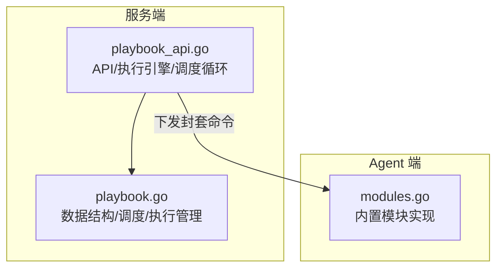
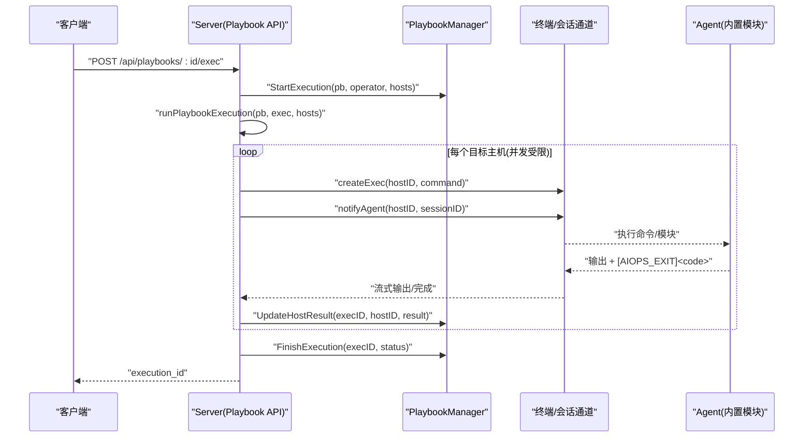
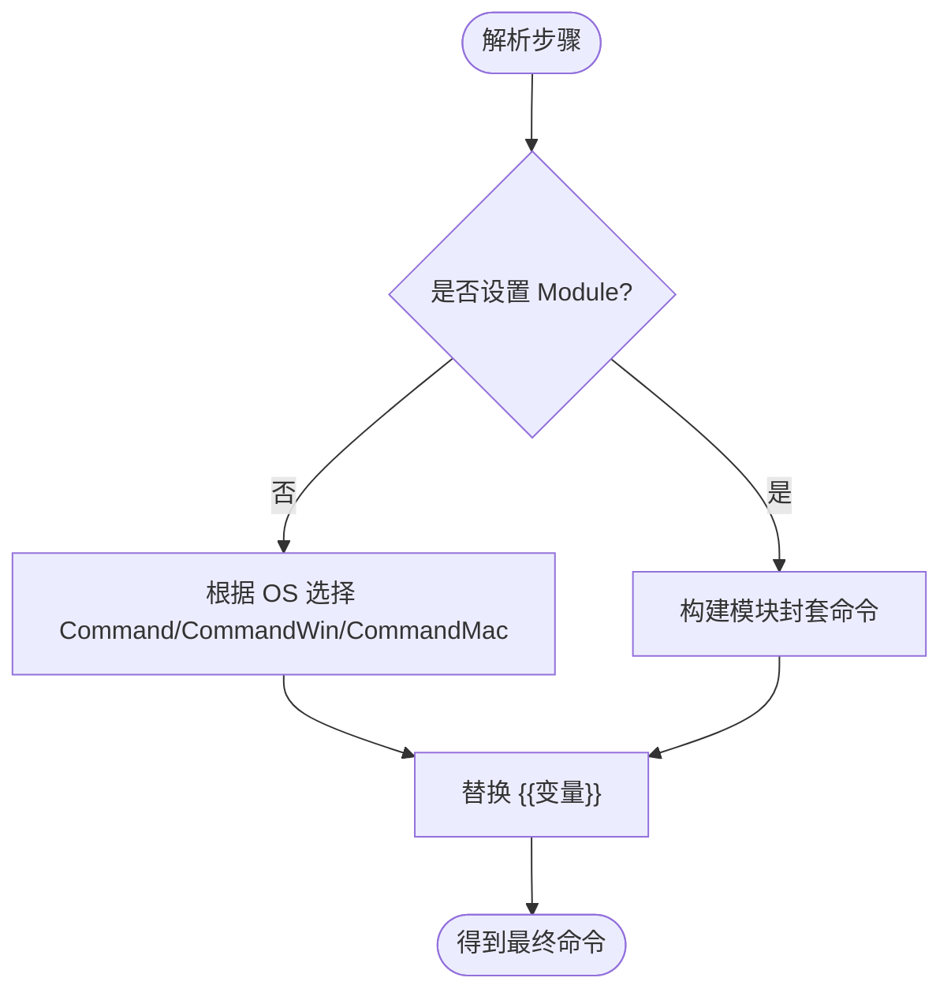
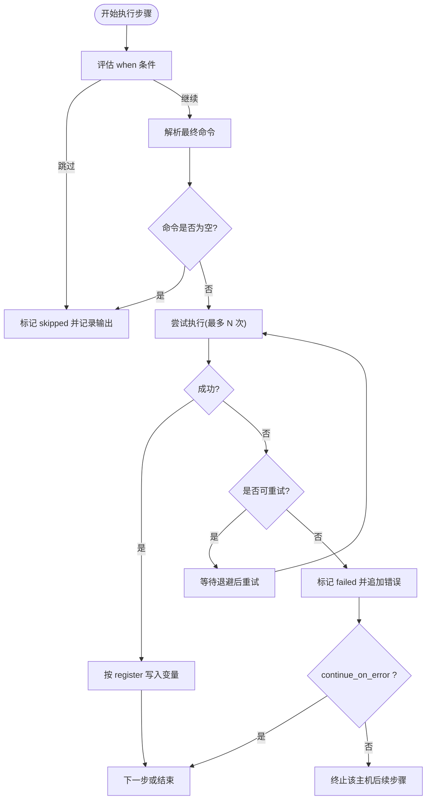
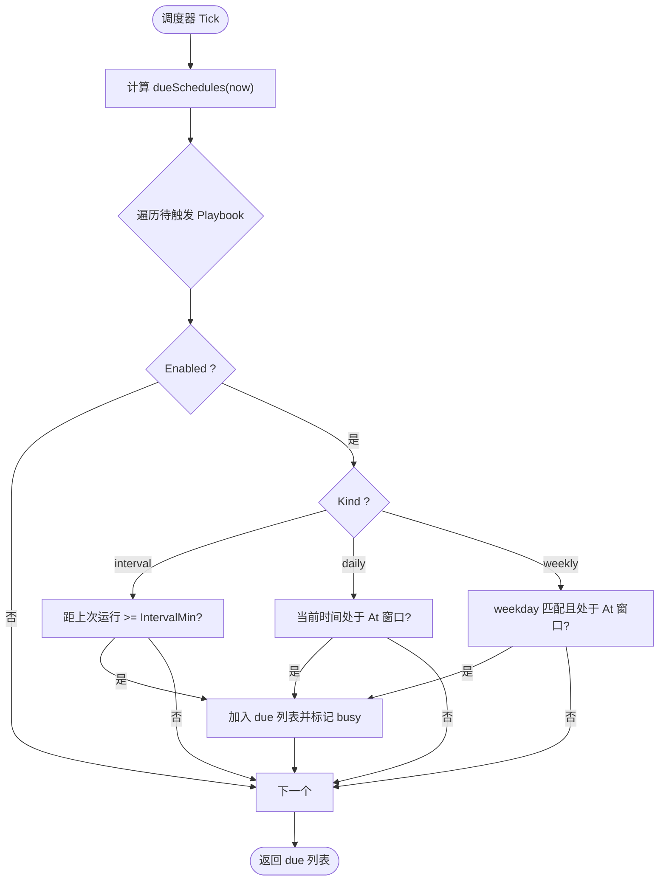
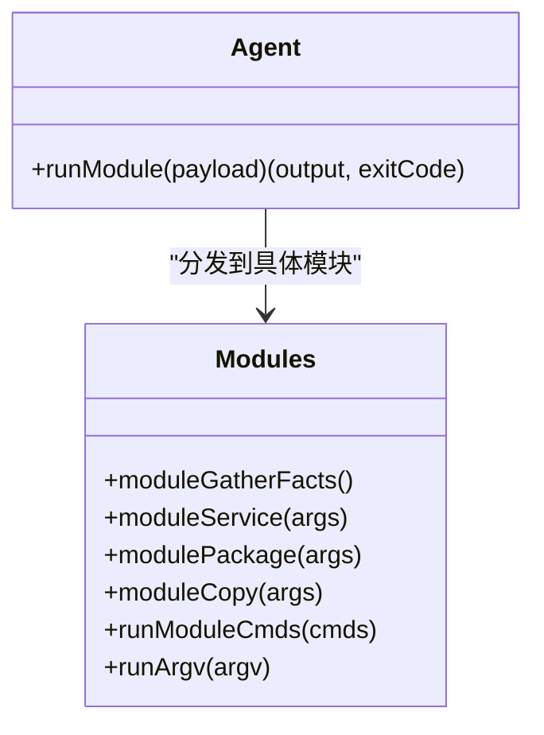
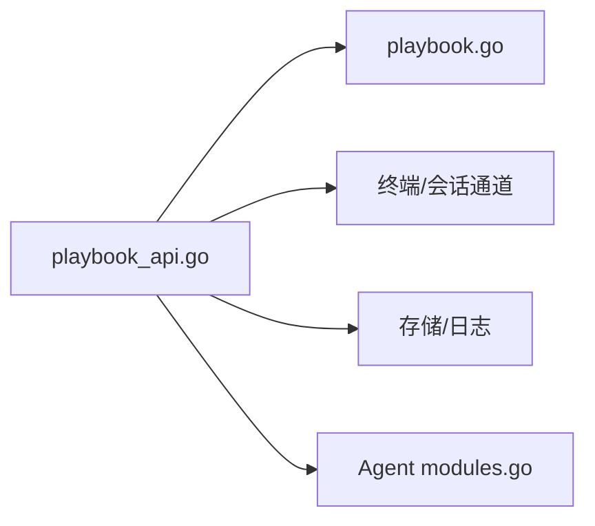

# 剧本编排系统

<cite>
**本文引用的文件**   
- [cmd/server/playbook.go](file://cmd/server/playbook.go)
- [cmd/server/playbook_api.go](file://cmd/server/playbook_api.go)
- [cmd/agent/modules.go](file://cmd/agent/modules.go)
- [cmd/agent/modules_test.go](file://cmd/agent/modules_test.go)
- [cmd/server/playbook_sched_test.go](file://cmd/server/playbook_sched_test.go)
- [cmd/server/playbook_enh_test.go](file://cmd/server/playbook_enh_test.go)
</cite>

## 目录
1. [简介](#简介)
2. [项目结构](#项目结构)
3. [核心组件](#核心组件)
4. [架构总览](#架构总览)
5. [详细组件分析](#详细组件分析)
6. [依赖关系分析](#依赖关系分析)
7. [性能与并发特性](#性能与并发特性)
8. [故障排查指南](#故障排查指南)
9. [结论](#结论)
10. [附录：YAML 编写指南与实战示例](#附录yaml-编写指南与实战示例)

## 简介
本文件面向 AIOps Monitor 的“剧本编排系统”，系统性阐述 Playbook 的数据模型、目标选择器语法、跨平台命令支持、执行引擎（并发、超时、重试、变量注册、条件判断）、内置模块（gather_facts、service、package、copy）以及定时调度（interval、daily、weekly）。文档同时提供 YAML 编写规范与常见运维自动化场景的实战示例，并给出执行历史查询、审计追踪与性能优化建议。

## 项目结构
与剧本编排相关的核心代码位于服务端与 Agent 端：
- 服务端负责定义数据结构、解析与校验、调度、并发执行控制、结果汇总与持久化接口。
- Agent 端负责识别模块封套命令并执行内置模块，返回统一输出与退出码。

图表来源
- [cmd/server/playbook.go:10-52](file://cmd/server/playbook.go#L10-L52)
- [cmd/server/playbook_api.go:117-134](file://cmd/server/playbook_api.go#L117-L134)
- [cmd/agent/modules.go:29-47](file://cmd/agent/modules.go#L29-L47)

章节来源
- [cmd/server/playbook.go:10-52](file://cmd/server/playbook.go#L10-L52)
- [cmd/server/playbook_api.go:117-134](file://cmd/server/playbook_api.go#L117-L134)
- [cmd/agent/modules.go:29-47](file://cmd/agent/modules.go#L29-L47)

## 核心组件
- Playbook 与步骤
  - Playbook：包含 ID、名称、描述、步骤列表、可选调度配置、创建/更新时间。
  - PlaybookStep：单步定义，支持命令、分系统覆盖命令、目标选择器、超时、错误继续、忽略非零退出码、变量注册、when 条件、内置模块及参数。
- 执行记录与结果
  - PlaybookExecution：一次执行的元数据与主机级结果集合。
  - HostExecResult：单台主机的状态、输出与每步结果。
  - StepResult：单步的状态、输出与耗时。
- 调度器
  - PlaybookSchedule：支持 interval/daily/weekly 三种模式，含启用开关、时间或周期等字段。
- 变量与条件
  - 预置主机变量：host_id、hostname、ip、os、category。
  - 变量替换：{{name}} 语法，未知变量替换为空串。
  - when 条件：支持 a==b / a!=b；空/false/0/no/off 视为假。
- 内置模块
  - gather_facts：采集本机基础信息（hostname/os/arch/cpus/ip/ips）。
  - service：管理服务生命周期与开机自启（Linux/systemctl、Windows/sc、macOS/brew services）。
  - package：安装/卸载软件包（自动探测 apt/dnf/yum/apk/zypper/pacman、brew、choco/winget）。
  - copy：将内容写入目标文件，自动创建父目录，支持权限设置。

章节来源
- [cmd/server/playbook.go:10-52](file://cmd/server/playbook.go#L10-L52)
- [cmd/server/playbook.go:54-81](file://cmd/server/playbook.go#L54-L81)
- [cmd/server/playbook.go:22-33](file://cmd/server/playbook.go#L22-L33)
- [cmd/server/playbook_api.go:17-51](file://cmd/server/playbook_api.go#L17-L51)
- [cmd/agent/modules.go:49-97](file://cmd/agent/modules.go#L49-L97)
- [cmd/agent/modules.go:99-160](file://cmd/agent/modules.go#L99-L160)
- [cmd/agent/modules.go:162-239](file://cmd/agent/modules.go#L162-L239)
- [cmd/agent/modules.go:241-262](file://cmd/agent/modules.go#L241-L262)

## 架构总览
服务端通过 HTTP API 接收保存/删除/执行请求，维护 Playbook 与执行历史；调度器按策略触发执行；执行引擎在受控并发下对目标主机逐一执行步骤，收集输出与状态，最终汇总并落盘。Agent 端收到模块封套命令后直接调用 Go 实现的内置模块，保证跨平台一致性与可观测性。

图表来源
- [cmd/server/playbook_api.go:117-134](file://cmd/server/playbook_api.go#L117-L134)
- [cmd/server/playbook_api.go:206-312](file://cmd/server/playbook_api.go#L206-L312)
- [cmd/server/playbook_api.go:339-397](file://cmd/server/playbook_api.go#L339-L397)
- [cmd/agent/modules.go:29-47](file://cmd/agent/modules.go#L29-L47)

## 详细组件分析

### 数据结构与目标选择器
- Playbook/PlaybookStep 字段说明
  - Steps 中的 Target 支持：
    - all：所有在线主机
    - category:xxx：按有效分类匹配（优先使用管理员覆盖的分类）
    - system:os：按运行时 OS 匹配（linux/windows/darwin，macos 映射到 darwin）
    - host:ID：指定主机 ID
- 变量与条件
  - 预置变量：host_id、hostname、ip、os、category
  - 变量替换：{{name}}，未知变量替换为空串
  - when 条件：支持 == 与 !=，否则按真值规则判定
- 跨平台命令
  - CommandWin/CommandMac 用于覆盖默认 Command，未设置则回退到 Command
  - 模块优先于命令：若设置 Module，则走模块封装命令，忽略 Command 系列字段

图表来源
- [cmd/server/playbook_api.go:53-71](file://cmd/server/playbook_api.go#L53-L71)
- [cmd/server/playbook_api.go:72-85](file://cmd/server/playbook_api.go#L72-L85)
- [cmd/server/playbook.go:255-304](file://cmd/server/playbook.go#L255-L304)

章节来源
- [cmd/server/playbook.go:35-52](file://cmd/server/playbook.go#L35-L52)
- [cmd/server/playbook.go:255-304](file://cmd/server/playbook.go#L255-L304)
- [cmd/server/playbook_api.go:17-51](file://cmd/server/playbook_api.go#L17-L51)
- [cmd/server/playbook_api.go:53-85](file://cmd/server/playbook_api.go#L53-L85)

### 执行引擎与并发控制
- 并发上限：playbookMaxParallel 限制同时运行的主机数，避免“惊群”效应
- 重试机制：基础设施类失败（无拾取/超时/异常结束）最多重试 playbookMaxAttempts 次，带线性退避；真实命令非零退出码不重试
- 超时控制：每步有 TimeoutSec，最小 5 秒；实际计时从 Agent 已连接开始
- 错误处理：
  - continue_on_error：允许后续步骤继续
  - ignore_exit：仅当命令正常结束但退出码非零时忽略（基础设施失败不忽略）
- 变量注册：register 将本步输出存入变量，供后续步骤引用
- 条件判断：when 为假则跳过该步骤

图表来源
- [cmd/server/playbook_api.go:206-312](file://cmd/server/playbook_api.go#L206-L312)
- [cmd/server/playbook_api.go:314-333](file://cmd/server/playbook_api.go#L314-L333)
- [cmd/server/playbook_api.go:339-397](file://cmd/server/playbook_api.go#L339-L397)

章节来源
- [cmd/server/playbook_api.go:190-204](file://cmd/server/playbook_api.go#L190-L204)
- [cmd/server/playbook_api.go:206-312](file://cmd/server/playbook_api.go#L206-L312)
- [cmd/server/playbook_api.go:314-333](file://cmd/server/playbook_api.go#L314-L333)
- [cmd/server/playbook_api.go:339-397](file://cmd/server/playbook_api.go#L339-L397)

### 定时调度系统
- 调度模式
  - interval：每隔 IntervalMin 分钟触发一次
  - daily：每天 At（HH:MM）触发一次
  - weekly：每周 Weekday（0=周日..6=周六）At（HH:MM）触发一次
- 防重入与去抖
  - 首次 tick 建立基线，不会回溯触发
  - 同一 playbook 正在执行时（schedBusy），后续 due 会跳过，直到执行完成释放
- 窗口判定
  - daily/weekly 仅在“当前 tick 跨越计划时刻”的窗口内触发一次
- 无目标处理
  - 若无在线目标，本次调度直接跳过并记录日志

图表来源
- [cmd/server/playbook.go:123-149](file://cmd/server/playbook.go#L123-L149)
- [cmd/server/playbook.go:151-198](file://cmd/server/playbook.go#L151-L198)
- [cmd/server/playbook_api.go:161-188](file://cmd/server/playbook_api.go#L161-L188)

章节来源
- [cmd/server/playbook.go:22-33](file://cmd/server/playbook.go#L22-L33)
- [cmd/server/playbook.go:123-198](file://cmd/server/playbook.go#L123-L198)
- [cmd/server/playbook_api.go:161-188](file://cmd/server/playbook_api.go#L161-L188)
- [cmd/server/playbook_sched_test.go:64-138](file://cmd/server/playbook_sched_test.go#L64-L138)

### 内置模块详解
- gather_facts
  - 输出 hostname/os/arch/cpus/ip/ips，便于后续步骤使用
- service
  - 参数：name（必填）、state（started/stopped/restarted/reloaded，默认 started）、enabled（true/false，可选）
  - Linux：systemctl start/stop/restart/reload/enable/disable
  - Windows：sc start/stop/config start=auto/demand（restarted/reloaded 等价 stop+start）
  - macOS：brew services start/stop/restart
- package
  - 参数：name（必填）、state（present/installed/latest 表示安装；absent/removed 表示卸载；默认 present）
  - 自动探测包管理器：apt-get/dnf/yum/apk/zypper/pacman（Linux）、brew（macOS）、choco/winget（Windows）
- copy
  - 参数：dest（必填）、content、mode（八进制，默认 0644）
  - 自动创建父目录，跨平台一致写入

图表来源
- [cmd/agent/modules.go:29-47](file://cmd/agent/modules.go#L29-L47)
- [cmd/agent/modules.go:49-97](file://cmd/agent/modules.go#L49-L97)
- [cmd/agent/modules.go:99-160](file://cmd/agent/modules.go#L99-L160)
- [cmd/agent/modules.go:162-239](file://cmd/agent/modules.go#L162-L239)
- [cmd/agent/modules.go:241-262](file://cmd/agent/modules.go#L241-L262)

章节来源
- [cmd/agent/modules.go:49-97](file://cmd/agent/modules.go#L49-L97)
- [cmd/agent/modules.go:99-160](file://cmd/agent/modules.go#L99-L160)
- [cmd/agent/modules.go:162-239](file://cmd/agent/modules.go#L162-L239)
- [cmd/agent/modules.go:241-262](file://cmd/agent/modules.go#L241-L262)
- [cmd/agent/modules_test.go:10-42](file://cmd/agent/modules_test.go#L10-L42)

## 依赖关系分析
- 服务端内部依赖
  - playbook_api.go 依赖 playbook.go 提供的数据结构与管理方法（列表、获取、更新、删除、执行历史、调度判定等）
  - 执行引擎依赖终端会话通道进行一次性命令执行与输出流式读取
- 服务端与 Agent 的契约
  - 模块封套命令前缀一致（__AIOPS_MODULE__），服务端编码 JSON 载荷，Agent 解码并路由到对应模块
- 测试用例验证
  - 变量替换、when 条件、跨平台命令解析、模块封套格式、调度行为等均通过单元测试覆盖

图表来源
- [cmd/server/playbook_api.go:117-134](file://cmd/server/playbook_api.go#L117-L134)
- [cmd/server/playbook.go:207-253](file://cmd/server/playbook.go#L207-L253)
- [cmd/agent/modules.go:29-47](file://cmd/agent/modules.go#L29-L47)

章节来源
- [cmd/server/playbook_api.go:117-134](file://cmd/server/playbook_api.go#L117-L134)
- [cmd/server/playbook.go:207-253](file://cmd/server/playbook.go#L207-L253)
- [cmd/agent/modules.go:29-47](file://cmd/agent/modules.go#L29-L47)

## 性能与并发特性
- 并发上限：playbookMaxParallel 限制并行主机数，避免大规模集群同时唤醒导致资源争用
- 重试与退避：基础设施类失败最多重试 playbookMaxAttempts 次，每次退避 playbookRetryBackoff * attempt 秒
- 拾取超时：execPickupTimeout 覆盖 Agent 最长轮询周期（≤25s）加网络余量，快速判定“未拾取”以加速重试
- 输出裁剪：单次执行输出最大保留 512KB，防止内存膨胀
- 历史裁剪：执行历史最多保留最近 100 条，降低内存占用

章节来源
- [cmd/server/playbook_api.go:190-204](file://cmd/server/playbook_api.go#L190-L204)
- [cmd/server/playbook_api.go:339-397](file://cmd/server/playbook_api.go#L339-L397)
- [cmd/server/playbook.go:306-342](file://cmd/server/playbook.go#L306-L342)

## 故障排查指南
- 常见问题定位
  - 未拾取（no-pickup）：Agent 未在拾取窗口内连接，通常由网络抖动或 Agent 未启动引起；系统会自动重试
  - 超时（timeout）：命令执行超过 TimeoutSec；检查命令耗时与网络状况
  - 异常结束（abnormal）：会话提前结束，可能因 Agent 侧异常或进程被杀
  - 非零退出码（exit code）：命令本身失败；若需忽略，请设置 ignore_exit=true
- 调试建议
  - 查看执行历史与主机结果，关注 StepResult 的输出与耗时
  - 使用 gather_facts 先采集环境信息，确认 OS、IP、分类等是否符合预期
  - 逐步缩小范围：先用 host:ID 或 category:xxx 限定目标，再扩展至 all
  - 利用 when 与 register 组合，实现条件分支与中间结果复用

章节来源
- [cmd/server/playbook_api.go:314-333](file://cmd/server/playbook_api.go#L314-L333)
- [cmd/server/playbook_api.go:339-397](file://cmd/server/playbook_api.go#L339-L397)
- [cmd/server/playbook.go:306-342](file://cmd/server/playbook.go#L306-L342)

## 结论
本编排系统以简洁的数据模型与明确的执行语义，提供了跨平台一致的自动化能力。通过模块化设计、严格的并发与超时控制、完善的变量与条件机制，以及灵活的调度策略，能够满足常见的运维自动化需求。配合执行历史与审计日志，可实现端到端的可观测与可追溯。

## 附录：YAML 编写指南与实战示例

### 基本结构
- 顶层字段
  - id：唯一标识（留空自动生成）
  - name：名称（必填）
  - description：描述（可选）
  - steps：步骤数组（必填）
  - schedule：调度配置（可选）
  - created_at/updated_at：时间戳（服务端生成）
- 步骤字段
  - name：步骤名
  - module：内置模块名（优先级高于命令）
  - args：模块参数（键值对）
  - command/command_win/command_mac：命令（未设置模块时使用）
  - target：目标选择器（all/category:xxx/system:os/host:ID）
  - timeout_sec：超时秒数（最小 5）
  - continue_on_error：遇到错误是否继续
  - ignore_exit：忽略非零退出码（仅命令正常结束的情况）
  - register：将本步输出注册为变量名
  - when：条件表达式（支持 == / != 与真值规则）

章节来源
- [cmd/server/playbook.go:10-52](file://cmd/server/playbook.go#L10-L52)
- [cmd/server/playbook_api.go:17-51](file://cmd/server/playbook_api.go#L17-L51)

### 内置模块用法
- gather_facts
  - 用途：采集主机基础信息，便于后续步骤使用
  - 典型用法：作为第一步，将输出注册到变量，后续步骤通过 {{变量}} 引用
- service
  - 参数：name、state（started/stopped/restarted/reloaded）、enabled（true/false）
  - 适用场景：服务启停、重启、重载、开机自启配置
- package
  - 参数：name、state（present/installed/latest 安装；absent/removed 卸载）
  - 适用场景：批量安装/卸载软件包
- copy
  - 参数：dest、content、mode（八进制）
  - 适用场景：配置文件分发、脚本部署

章节来源
- [cmd/agent/modules.go:49-97](file://cmd/agent/modules.go#L49-L97)
- [cmd/agent/modules.go:99-160](file://cmd/agent/modules.go#L99-L160)
- [cmd/agent/modules.go:162-239](file://cmd/agent/modules.go#L162-L239)
- [cmd/agent/modules.go:241-262](file://cmd/agent/modules.go#L241-L262)

### 调度配置
- kind="interval"
  - interval_min：间隔分钟数（≥1）
- kind="daily"
  - at："HH:MM"（服务器本地时间）
- kind="weekly"
  - weekday：0=周日..6=周六
  - at："HH:MM"

章节来源
- [cmd/server/playbook.go:22-33](file://cmd/server/playbook.go#L22-L33)
- [cmd/server/playbook.go:123-149](file://cmd/server/playbook.go#L123-L149)

### 实战示例（概念性说明）
- 服务管理
  - 使用 service 模块重启某服务，并在 Windows/macOS 上分别指定不同 state 或 enabled 策略
- 包安装
  - 使用 package 模块在不同发行版上安装相同名称的包，无需关心底层包管理器差异
- 文件分发
  - 使用 copy 模块将配置内容写入目标路径，自动创建父目录并设置权限
- 条件执行
  - 使用 when 与 register 组合，基于 OS 或前置步骤输出决定后续动作

[本节为概念性指导，不直接分析具体文件]