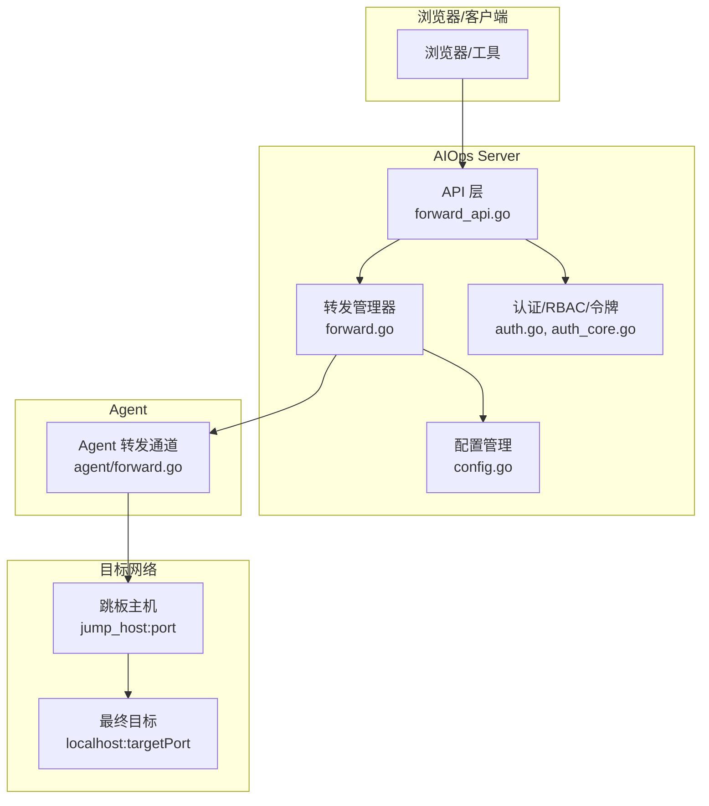
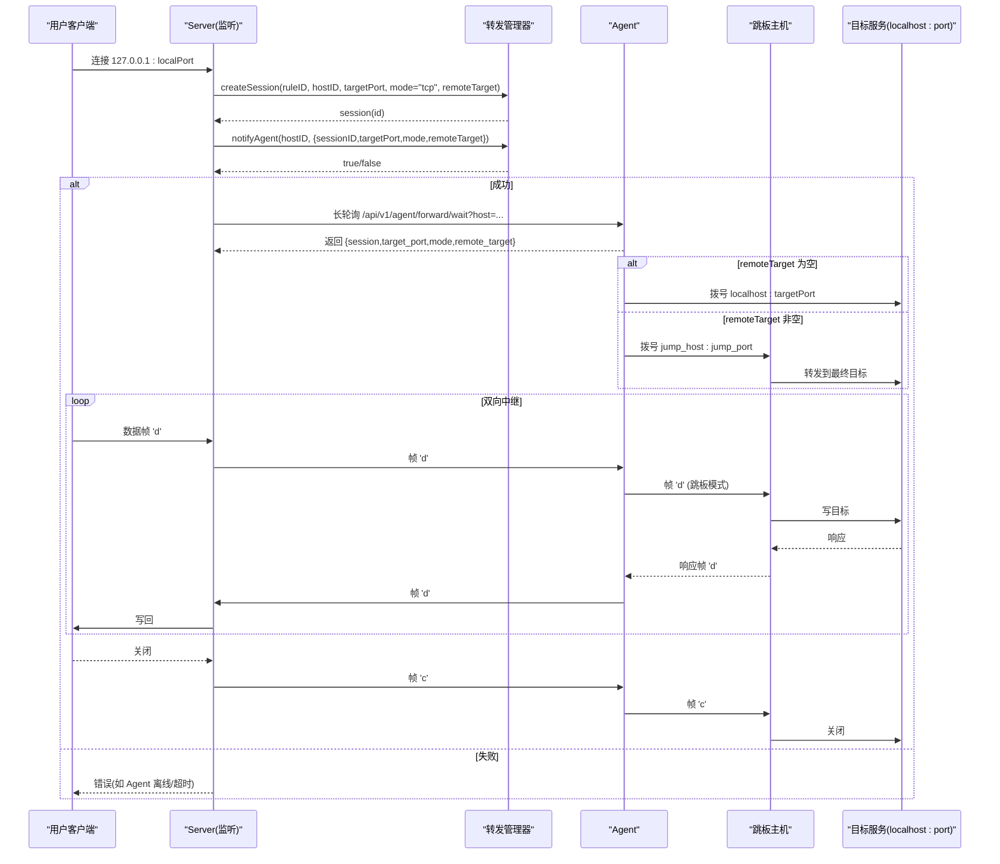
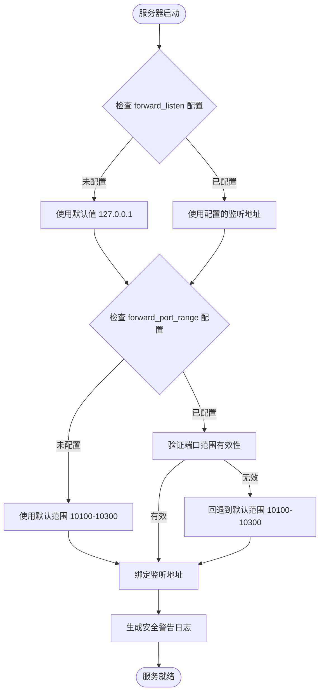
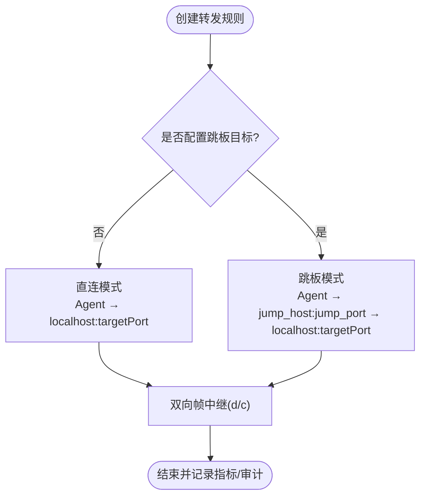
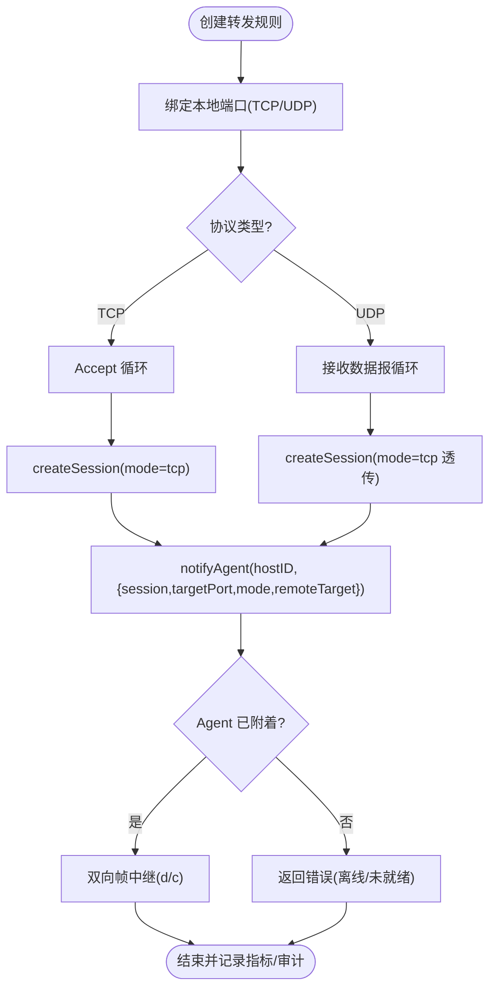
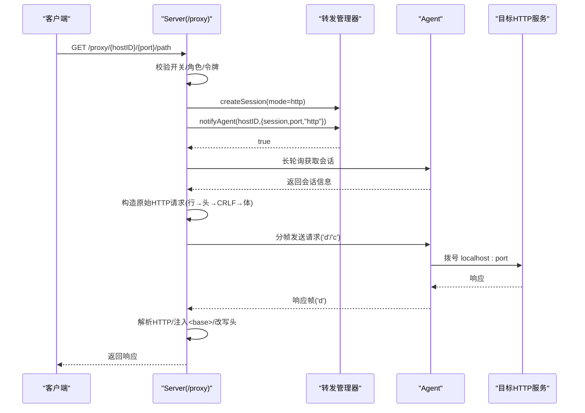
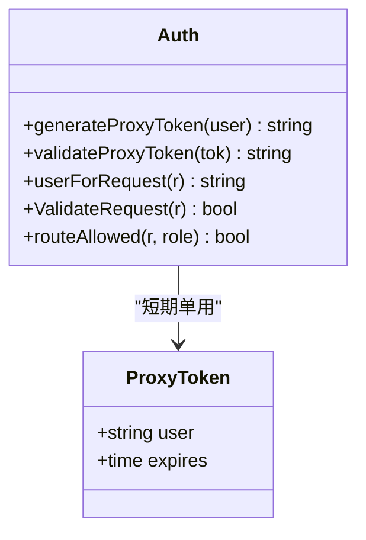
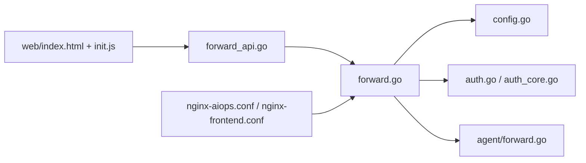

# 端口转发服务

<cite>
**本文引用的文件**   
- [cmd/server/forward.go](file://cmd/server/forward.go)
- [cmd/server/forward_api.go](file://cmd/server/forward_api.go)
- [cmd/agent/forward.go](file://cmd/agent/forward.go)
- [cmd/server/config.go](file://cmd/server/config.go)
- [cmd/server/web/js/init.js](file://cmd/server/web/js/init.js)
- [cmd/server/web/index.html](file://cmd/server/web/index.html)
- [cmd/server/web/i18n-dashboard.js](file://cmd/server/web/i18n-dashboard.js)
- [cmd/server/auth.go](file://cmd/server/auth.go)
- [cmd/server/auth_core.go](file://cmd/server/auth_core.go)
- [FORWARD_GUIDE.md](file://FORWARD_GUIDE.md)
- [README_EN.md](file://README_EN.md)
- [deploy/nginx-aiops.conf](file://deploy/nginx-aiops.conf)
- [docker/nginx/nginx-frontend.conf](file://docker/nginx/nginx-frontend.conf)
- [config.example.json](file://config.example.json)
- [server_config.example.json](file://server_config.example.json)
</cite>

## 更新摘要
**变更内容**   
- **安全配置增强**：将 `forward_listen` 默认监听地址从 `0.0.0.0` 修改为 `127.0.0.1`，防止端口意外暴露到公网
- **端口范围标准化**：将 `forward_port_range` 默认值统一为标准化的 `10100-10300` 范围（201个端口）
- **跳板模式安全加固**：在配置文件和前端界面中添加详细的安全警告和最佳实践指导
- **安全审计增强**：记录跳板模式的连接信息，便于安全审计和问题排查

## 目录
1. [简介](#简介)
2. [项目结构](#项目结构)
3. [核心组件](#核心组件)
4. [架构总览](#架构总览)
5. [详细组件分析](#详细组件分析)
6. [依赖关系分析](#依赖关系分析)
7. [性能与容量规划](#性能与容量规划)
8. [故障排查指南](#故障排查指南)
9. [安全最佳实践](#安全最佳实践)
10. [结论](#结论)
11. [附录：配置与使用示例](#附录配置与使用示例)

## 简介
本文件面向 AIOps Monitor 的"端口转发服务"，系统性阐述以下能力：
- TCP 端口映射（含 UDP）：将服务端本地监听端口通过 Agent 反向隧道，透传到目标主机 localhost:targetPort。
- **跳板机转发**：支持通过中间主机进行端口转发，实现跨网络区域的访问控制。
- HTTP 反向代理：以 /proxy/{hostID}/{port}/... 路径直接代理到目标 HTTP 服务，支持请求头处理、响应体转换、WebSocket 升级。
- 安全令牌验证：一次性 proxy_token 用于 window.open 场景；会话认证 + RBAC 控制访问；Agent 指纹通道鉴权。
- 运维特性：连接状态监控、带宽/延迟指标、空闲超时、错误诊断、健康检查。
- 配置与用例：数据库直连、API 调试、内部服务访问等常见场景。

## 项目结构
与端口转发相关的核心代码位于 server 与 agent 两侧：
- 服务端（Server）
  - forward.go：转发管理器、TCP/UDP 监听、HTTP 反向代理、统计与健康检查。
  - forward_api.go：对外 API（创建/删除/启停规则、批量组操作、HTTP 快捷方式、统计）。
  - config.go：配置持久化，包含跳板机目标的持久化存储和安全配置。
  - auth.go / auth_core.go：会话、RBAC、一次性代理令牌、限流与 MFA。
- 客户端（Agent）
  - forward.go：长轮询等待会话、拨号目标、双向数据流中继（TCP/UDP），支持跳板模式。
- 前端界面
  - index.html：转发对话框，包含跳板机输入框和安全提示。
  - init.js：前端逻辑处理，包括跳板机参数的传递和显示。

**图表来源**
- [cmd/server/forward.go:1-40](file://cmd/server/forward.go#L1-L40)
- [cmd/server/forward_api.go:1-40](file://cmd/server/forward_api.go#L1-L40)
- [cmd/server/config.go:714-728](file://cmd/server/config.go#L714-L728)
- [cmd/agent/forward.go:1-36](file://cmd/agent/forward.go#L1-L36)
- [cmd/server/auth.go:110-172](file://cmd/server/auth.go#L110-L172)
- [cmd/server/auth_core.go:157-176](file://cmd/server/auth_core.go#L157-L176)

## 核心组件
- 转发管理器（forwardManager）
  - 维护规则（forwardRule）、会话（forwardSession）、等待队列（waiters/pendingSessions）、计数器（fwdCounter）、聚合指标（forwardStats）。
  - 提供会话生命周期管理、空闲检测、通知 Agent、按规则/按 host+port 计数。
  - **新增跳板机支持**：规则中包含 remoteTarget 字段，支持指定中间跳转主机。
- TCP/UDP 监听与中继
  - TCP：Accept 后建立会话，双工帧中继（'d' 数据帧、'c' 关闭帧），KeepAlive 保活。
  - UDP：基于 datagram 边界封帧，保持报文语义。
  - **跳板模式**：当 remoteTarget 非空时，Agent 连接到指定的跳板主机而非本机。
- HTTP 反向代理
  - 构造原始 HTTP 请求（正确顺序：行→头→CRLF→体），过滤 hop-by-hop 头，注入 X-Forwarded-*。
  - HTML 内容注入 <base> 修正相对资源路径；对 gzip 解压重写后再压缩返回或透传。
  - WebSocket：识别 Upgrade 头，走 TCP 模式透传。
- 安全与权限
  - 全局开关、RBAC（operator+ 可访问转发相关接口）。
  - 一次性 proxy_token（SameSite=Lax cookie 或查询参数），单用且短 TTL。
  - Agent 侧使用 X-Agent-Fingerprint 进行通道鉴权。
  - **安全配置增强**：默认监听地址限制为 127.0.0.1，防止意外暴露。
- 指标与审计
  - 活跃/累计会话、总字节、错误数、平均延迟、滑动窗口带宽。
  - 关键事件写入系统日志（创建/关闭/错误原因）。
  - **跳板模式审计**：记录跳板连接的源地址、目标地址和时间戳。

**章节来源**
- [cmd/server/forward.go:56-135](file://cmd/server/forward.go#L56-L135)
- [cmd/server/forward.go:137-246](file://cmd/server/forward.go#L137-L246)
- [cmd/server/forward.go:1052-1160](file://cmd/server/forward.go#L1052-L1160)
- [cmd/server/forward.go:1210-1553](file://cmd/server/forward.go#L1210-L1553)
- [cmd/server/forward.go:1555-1640](file://cmd/server/forward.go#L1555-L1640)
- [cmd/server/config.go:714-728](file://cmd/server/config.go#L714-L728)
- [cmd/server/config.go:730-749](file://cmd/server/config.go#L730-L749)
- [cmd/agent/forward.go:18-36](file://cmd/agent/forward.go#L18-L36)
- [cmd/server/auth.go:110-172](file://cmd/server/auth.go#L110-L172)
- [cmd/server/auth_core.go:157-176](file://cmd/server/auth_core.go#L157-L176)

## 架构总览
下图展示一次典型 TCP 转发的端到端流程，包括跳板机模式：用户连接 → Server 监听 → 创建会话 → 通知 Agent → Agent 根据 remoteTarget 决定连接目标 → 双向帧中继。

**图表来源**
- [cmd/server/forward.go:1052-1160](file://cmd/server/forward.go#L1052-L1160)
- [cmd/agent/forward.go:77-95](file://cmd/agent/forward.go#L77-L95)
- [cmd/agent/forward.go:100-185](file://cmd/agent/forward.go#L100-L185)
- [cmd/agent/forward.go:111-116](file://cmd/agent/forward.go#L111-L116)

## 详细组件分析

### 安全配置增强
**重要更新** 增强了端口转发安全配置，防止意外暴露到公网。

- **监听地址安全加固**
  - `forward_listen` 默认值从 `0.0.0.0` 修改为 `127.0.0.1`，仅允许本地访问。
  - 显式设置 `forward_listen: "0.0.0.0"` 才允许外部访问（如 Docker 部署）。
  - 添加详细的安全注释说明潜在风险。

- **端口范围标准化**
  - `forward_port_range` 默认值统一为标准化的 `10100-10300` 范围。
  - 提供 201 个可用端口，适合 Docker 部署的可预测端口暴露。
  - 支持自定义范围配置，但会进行有效性验证。

**图表来源**
- [cmd/server/config.go:714-728](file://cmd/server/config.go#L714-L728)
- [cmd/server/config.go:730-749](file://cmd/server/config.go#L730-L749)

**章节来源**
- [cmd/server/config.go:714-728](file://cmd/server/config.go#L714-L728)
- [cmd/server/config.go:730-749](file://cmd/server/config.go#L730-L749)
- [server_config.example.json:25-26](file://server_config.example.json#L25-L26)

### 跳板机转发功能
**新增功能** 支持通过中间主机进行端口转发，实现跨网络区域的访问控制。

- **数据结构扩展**
  - `PersistedForwardRule` 结构体新增 `RemoteTarget string` 字段，用于存储跳板目标地址。
  - `forwardRule` 结构体新增 `remoteTarget string` 字段，运行时存储跳板信息。
  - `forwardWaitInfo` 结构体新增 `remoteTarget string` 字段，传递给 Agent。

- **API 支持**
  - 创建转发规则时支持 `remote_target` 参数。
  - 编辑转发规则时支持更新 `remote_target` 字段。
  - 复制转发规则时保留 `remote_target` 设置。

- **Agent 端实现**
  - 在 `runForwardSession` 方法中检查 `remoteTarget` 参数。
  - 如果 `remoteTarget` 非空，则连接到指定的跳板主机而非本机 localhost。
  - 添加跳板模式的日志记录，便于问题排查。

- **前端界面**
  - 转发对话框新增"远程目标（跳板模式，可选）"输入框。
  - 转发列表项中显示跳板目标标识，格式为 "⇢ IP:Port"。
  - 支持多语言国际化，包含中文、英文、繁体中文。

**图表来源**
- [cmd/server/config.go:407](file://cmd/server/config.go#L407)
- [cmd/server/forward.go:198](file://cmd/server/forward.go#L198)
- [cmd/server/forward.go:569-641](file://cmd/server/forward.go#L569-L641)
- [cmd/agent/forward.go:111-116](file://cmd/agent/forward.go#L111-L116)
- [cmd/server/web/index.html:1645-1646](file://cmd/server/web/index.html#L1645-L1646)
- [cmd/server/web/js/init.js:188](file://cmd/server/web/js/init.js#L188)

**章节来源**
- [cmd/server/config.go:407](file://cmd/server/config.go#L407)
- [cmd/server/forward.go:198](file://cmd/server/forward.go#L198)
- [cmd/server/forward.go:569-641](file://cmd/server/forward.go#L569-L641)
- [cmd/server/forward.go:776-800](file://cmd/server/forward.go#L776-800)
- [cmd/server/forward_api.go:485-507](file://cmd/server/forward_api.go#L485-L507)
- [cmd/agent/forward.go:111-116](file://cmd/agent/forward.go#L111-L116)
- [cmd/server/web/index.html:1645-1646](file://cmd/server/web/index.html#L1645-L1646)
- [cmd/server/web/js/init.js:188](file://cmd/server/web/js/init.js#L188)
- [cmd/server/web/js/init.js:368-371](file://cmd/server/web/js/init.js#L368-L371)
- [cmd/server/web/i18n-dashboard.js:496-497](file://cmd/server/web/i18n-dashboard.js#L496-L497)

### TCP/UDP 端口映射
- 规则创建
  - 支持指定 local_port（0 自动分配），默认监听地址由配置决定（建议仅 127.0.0.1）。
  - 支持端口范围批量创建（最多 100 个端口），同组共享 groupID，便于整组启停/删除/复制/编辑。
  - **新增跳板支持**：创建时可指定 remote_target 参数。
- 会话与中继
  - 会话上限 maxForwardSessions（默认 300），每会话带 toAgent/toUser 通道与 agentUp/done 信号。
  - 帧格式 [type:1][len:2 BE][payload]，'d' 为数据，'c' 为关闭。
  - TCP KeepAlive 周期可配，空闲超时 30 分钟自动关闭。
- UDP 支持
  - 使用 net.ListenPacket，读/写保持 datagram 边界，上行逐报封帧，下行逐帧写报。
  - **跳板模式**：UDP 转发同样支持跳板目标。

**图表来源**
- [cmd/server/forward.go:567-641](file://cmd/server/forward.go#L567-L641)
- [cmd/server/forward.go:1052-1160](file://cmd/server/forward.go#L1052-L1160)
- [cmd/server/forward.go:840-913](file://cmd/server/forward.go#L840-L913)
- [cmd/agent/forward.go:213-289](file://cmd/agent/forward.go#L213-L289)

**章节来源**
- [cmd/server/forward.go:567-641](file://cmd/server/forward.go#L567-L641)
- [cmd/server/forward.go:1052-1160](file://cmd/server/forward.go#L1052-L1160)
- [cmd/server/forward.go:840-913](file://cmd/server/forward.go#L840-L913)
- [cmd/agent/forward.go:213-289](file://cmd/agent/forward.go#L213-L289)

### HTTP 反向代理
- 路由与鉴权
  - 路径 /proxy/{hostID}/{port}/{path...}，需 operator+ 角色或通过一次性 proxy_token 授权。
  - 若存在对应 HTTP 快捷配置且全部停用，则拒绝访问。
- 请求构建与头部处理
  - 先读取 body（限制大小），再按顺序拼装请求行、头、CRLF、体。
  - 过滤 hop-by-hop 头（Connection、Transfer-Encoding、Upgrade 等），保留 Host 为 localhost:{port}。
  - 注入 X-Forwarded-For、X-Forwarded-Proto、X-Real-IP。
- 响应处理
  - 优先尝试解析 HTTP 响应；HTML 内容注入 <base href="/proxy/{hostID}/{port}/">，必要时解压/重编。
  - 非 HTTP 响应兜底返回原始字节，便于诊断。
- WebSocket 支持
  - 检测到 Upgrade: websocket 时，走 TCP 透传模式，完整转发握手头与后续帧。

**图表来源**
- [cmd/server/forward.go:1210-1553](file://cmd/server/forward.go#L1210-L1553)
- [cmd/server/forward.go:1555-1640](file://cmd/server/forward.go#L1555-L1640)
- [cmd/agent/forward.go:100-185](file://cmd/agent/forward.go#L100-L185)

**章节来源**
- [cmd/server/forward.go:1210-1553](file://cmd/server/forward.go#L1210-L1553)
- [cmd/server/forward.go:1555-1640](file://cmd/server/forward.go#L1555-L1640)
- [cmd/agent/forward.go:100-185](file://cmd/agent/forward.go#L100-L185)

### 安全令牌与权限控制
- 会话与 RBAC
  - 所有非公开路径需有效会话；/proxy/ 与 /api/v1/forward/* 需要 operator+。
  - 支持全局 MFA 策略与受限会话（仅允许 MFA 设置/启用/登出）。
- 一次性代理令牌（proxy_token）
  - 生成短 TTL 令牌，作为 SameSite=Lax cookie 下发，window.open 新标签自动携带。
  - 令牌单次使用，校验后删除；仍会复核当前用户角色是否满足 RBAC。
- Agent 通道鉴权
  - Agent 使用 X-Agent-Fingerprint 在长轮询中传递指纹，服务端据此放行 /api/v1/agent/forward/*。

**图表来源**
- [cmd/server/auth_core.go:157-176](file://cmd/server/auth_core.go#L157-L176)
- [cmd/server/auth.go:110-172](file://cmd/server/auth.go#L110-L172)

**章节来源**
- [cmd/server/auth.go:110-172](file://cmd/server/auth.go#L110-L172)
- [cmd/server/auth_core.go:157-176](file://cmd/server/auth_core.go#L157-L176)

### 连接池管理与负载均衡
- 连接复用
  - 服务端对每个 TCP 转发会话维持一个独立的双向通道，不跨会话复用底层连接，避免协议混淆。
  - HTTP 代理为无状态请求级转发，不维持持久连接至目标（显式 Connection: close）。
- 并发与限流
  - 全局并发会话上限（默认 300），超出即拒绝新建。
  - 请求体上限（默认 100MB），响应读取上限（默认 50MB）防止 OOM。
- 负载均衡
  - 当前实现未内置多后端负载；如需多实例，可在外部网关层做分发，或在应用层设计多目标选择逻辑。

**章节来源**
- [cmd/server/forward.go:34-40](file://cmd/server/forward.go#L34-L40)
- [cmd/server/forward.go:1210-1260](file://cmd/server/forward.go#L1210-L1260)

## 依赖关系分析
- 模块耦合
  - forward_api.go 仅定义 API 契约与处理器，核心逻辑集中在 forward.go。
  - config.go 提供配置持久化，包含跳板机目标的存储和安全配置。
  - auth.go 提供中间件与 RBAC，auth_core.go 提供会话与令牌实现。
  - agent/forward.go 与服务端通过 /api/v1/agent/forward/* 交互，采用帧协议。
- 外部依赖
  - Nginx 反代需开启 Upgrade 头转发与关闭缓冲，确保 WebSocket 与实时流正常。

**图表来源**
- [cmd/server/forward_api.go:1-40](file://cmd/server/forward_api.go#L1-L40)
- [cmd/server/forward.go:1-40](file://cmd/server/forward.go#L1-L40)
- [cmd/server/config.go:714-728](file://cmd/server/config.go#L714-L728)
- [cmd/server/auth.go:110-172](file://cmd/server/auth.go#L110-L172)
- [cmd/server/auth_core.go:157-176](file://cmd/server/auth_core.go#L157-L176)
- [cmd/server/web/index.html:1645-1646](file://cmd/server/web/index.html#L1645-L1646)
- [cmd/server/web/js/init.js:368-371](file://cmd/server/web/js/init.js#L368-L371)
- [deploy/nginx-aiops.conf:30-52](file://deploy/nginx-aiops.conf#L30-L52)
- [docker/nginx/nginx-frontend.conf:86-104](file://docker/nginx/nginx-frontend.conf#L86-L104)

**章节来源**
- [cmd/server/forward_api.go:1-40](file://cmd/server/forward_api.go#L1-L40)
- [cmd/server/forward.go:1-40](file://cmd/server/forward.go#L1-L40)
- [cmd/server/config.go:714-728](file://cmd/server/config.go#L714-L728)
- [cmd/server/auth.go:110-172](file://cmd/server/auth.go#L110-L172)
- [cmd/server/auth_core.go:157-176](file://cmd/server/auth_core.go#L157-L176)
- [cmd/server/web/index.html:1645-1646](file://cmd/server/web/index.html#L1645-L1646)
- [cmd/server/web/js/init.js:368-371](file://cmd/server/web/js/init.js#L368-L371)
- [deploy/nginx-aiops.conf:30-52](file://deploy/nginx-aiops.conf#L30-L52)
- [docker/nginx/nginx-frontend.conf:86-104](file://docker/nginx/nginx-frontend.conf#L86-L104)

## 性能与容量规划
- 缓冲区与超时
  - 读缓冲 32KB，HTTP 响应读取超时 30s，TCP KeepAlive 60s。
  - 空闲会话 30 分钟自动关闭，Agent 侧会话最长 15 分钟强制回收。
- 内存保护
  - 请求体上限 100MB，响应读取上限 50MB，避免恶意大响应导致 OOM。
- 指标观测
  - 活跃/累计会话、总字节、错误数、平均延迟、最近 60 秒平均带宽。
- 调优建议
  - 合理设置最大会话数与端口范围上限（批量最多 100）。
  - 在高并发下关注 Nginx 的 client_max_body_size 与缓冲关闭配置。
  - 针对长连接业务，适当调整 KeepAlive 与空闲超时。
  - **跳板模式优化**：跳板主机的网络延迟会影响整体性能，建议选择网络质量较好的跳板节点。
  - **端口范围规划**：默认 10100-10300 范围提供 201 个端口，适合大多数部署场景。

**章节来源**
- [cmd/server/forward.go:34-40](file://cmd/server/forward.go#L34-L40)
- [cmd/server/forward.go:277-310](file://cmd/server/forward.go#L277-L310)
- [cmd/agent/forward.go:33-36](file://cmd/agent/forward.go#L33-L36)
- [cmd/server/forward.go:1210-1260](file://cmd/server/forward.go#L1210-L1260)
- [deploy/nginx-aiops.conf:26-52](file://deploy/nginx-aiops.conf#L26-L52)
- [cmd/server/config.go:730-749](file://cmd/server/config.go#L730-L749)

## 故障排查指南
- 常见问题定位
  - Agent 离线或未就绪：查看 reason（未知主机/离线/无指纹/通道未就绪）。
  - 解析失败：当上游返回非 HTTP 或异常时，会记录原始前若干字节用于诊断。
  - 意外 EOF：HTTP 响应读取路径已修复竞态，若仍出现，检查 Nginx 缓冲与超时。
  - **跳板连接失败**：检查跳板主机可达性、防火墙规则、端口连通性。
  - **监听地址问题**：确认 forward_listen 配置是否正确，默认应为 127.0.0.1。
- 快速自检
  - 健康检查：GET /api/v1/forward/health 返回 enabled/max_body/max_session。
  - 统计接口：GET /api/v1/forward/stats 查看活跃/累计/错误/带宽。
- 日志与审计
  - 创建/关闭/错误原因均记录系统日志，包含操作者、主机、端口与路径。
  - **跳板模式日志**：Agent 端会记录跳板转发模式的启动信息和目标地址。
  - **安全审计**：记录所有转发操作的详细信息，包括监听地址和端口范围配置。

**章节来源**
- [cmd/server/forward.go:528-547](file://cmd/server/forward.go#L528-L547)
- [cmd/server/forward.go:1412-1432](file://cmd/server/forward.go#L1412-L1432)
- [cmd/server/forward.go:1514-1553](file://cmd/server/forward.go#L1514-L1553)
- [cmd/server/forward_api.go:295-303](file://cmd/server/forward_api.go#L295-L303)
- [cmd/server/forward_api.go:88-98](file://cmd/server/forward_api.go#L88-L98)
- [cmd/agent/forward.go:115](file://cmd/agent/forward.go#L115)
- [cmd/server/config.go:714-728](file://cmd/server/config.go#L714-L728)

## 安全最佳实践
- 监听地址安全
  - **重要**：强烈建议将转发监听绑定到 127.0.0.1 或容器内网，避免暴露到公网。
  - 默认配置已设置为 127.0.0.1，除非明确需要外部访问，否则不要修改为 0.0.0.0。
  - Docker 部署时，建议使用端口映射而非监听 0.0.0.0。
- 最小权限
  - 仅授予 operator+ 访问转发相关接口；必要时结合一次性 proxy_token 打开新标签。
  - 严格控制跳板规则的创建权限，仅管理员可创建。
- 网络隔离
  - 通过防火墙/安全组限制来源 IP；对敏感服务（MySQL/Redis/SSH）严格白名单。
  - **跳板机安全**：跳板主机应具备更强的安全防护，建议部署在内网安全区域。
  - **端口范围管理**：使用标准化的 10100-10300 端口范围，便于防火墙规则管理。
- 代理层加固
  - Nginx 必须转发 Upgrade 头、关闭缓冲，并设置合理的超时与 body 大小限制。
  - 配置适当的速率限制和连接数限制。
- 审计与告警
  - 关注错误率、会话峰值、带宽突增；对频繁 502/超时进行告警。
  - **跳板访问审计**：记录跳板连接的源地址、目标地址和时间戳，便于安全审计。
  - **安全配置审计**：定期检查 forward_listen 和 forward_port_range 配置是否符合安全要求。
- **安全警告**
  - ⚠️ 跳板模式当前无目标 IP 白名单限制，任意 IP:Port 均可被转发。
  - 建议配合防火墙限制 Agent 可访问的网段。
  - 仅授权管理员创建跳板规则。
  - 审计日志会记录每次转发操作（含 remote_target）。

**章节来源**
- [cmd/server/forward.go:615-621](file://cmd/server/forward.go#L615-L621)
- [cmd/server/auth.go:100-108](file://cmd/server/auth.go#L100-L108)
- [cmd/server/auth.go:130-152](file://cmd/server/auth.go#L130-L152)
- [deploy/nginx-aiops.conf:30-52](file://deploy/nginx-aiops.conf#L30-L52)
- [cmd/server/config.go:714-728](file://cmd/server/config.go#L714-L728)
- [config.example.json:40-42](file://config.example.json#L40-L42)

## 结论
AIOps Monitor 的端口转发服务以"Agent 反向通道 + 帧协议"为核心，实现了稳定可靠的 TCP/UDP 透传与功能完备的 HTTP 反向代理。**最新的安全配置增强**进一步提升了系统的安全性，通过将默认监听地址限制为 127.0.0.1 和标准化端口范围为 10100-10300，有效防止了意外的网络暴露。**新增的跳板机转发功能**配合完善的安全警告和最佳实践指导，既增强了网络的灵活性和安全性，又确保了生产环境的安全合规。通过严格的并发与内存保护、完善的指标与审计、以及灵活的一次性令牌机制，既满足日常运维便捷性，又兼顾安全性与可观测性。在生产部署中，建议遵循最小暴露面、最小权限与强审计的原则，并结合 Nginx 的正确配置以获得最佳体验。

## 附录：配置与使用示例
- 创建 TCP 转发（curl）
  - POST /api/v1/forward，参数 host_id/target_port/local_port。
  - **跳板模式**：添加 remote_target 参数，如 "192.168.30.220:3306"。
  - 成功后返回 listen_addr，可直接用任意 TCP 客户端连接。
- 使用 HTTP 反向代理
  - 直接访问 /proxy/{hostID}/{port}/{path}，无需创建规则。
  - 支持所有 HTTP 方法与 WebSocket 升级。
- 前端操作
  - 在转发对话框中选择"远程目标（跳板模式，可选）"填写跳板主机地址。
  - 转发列表中会显示跳板目标标识 "⇢ IP:Port"。
- 健康检查与统计
  - GET /api/v1/forward/health
  - GET /api/v1/forward/stats
- 参考文档
  - FORWARD_GUIDE.md：两种模式的对比、URL 格式、自动添加的转发头、健康检查。
  - README_EN.md：端口范围批量转发与 HTTP 代理说明。

**章节来源**
- [FORWARD_GUIDE.md:1-223](file://FORWARD_GUIDE.md#L1-L223)
- [README_EN.md:575-607](file://README_EN.md#L575-L607)
- [cmd/server/forward_api.go:295-303](file://cmd/server/forward_api.go#L295-L303)
- [cmd/server/forward_api.go:88-98](file://cmd/server/forward_api.go#L88-L98)
- [cmd/server/web/index.html:1645-1646](file://cmd/server/web/index.html#L1645-L1646)
- [cmd/server/web/js/init.js:188](file://cmd/server/web/js/init.js#L188)
- [server_config.example.json:25-26](file://server_config.example.json#L25-L26)
- [config.example.json:37-42](file://config.example.json#L37-L42)