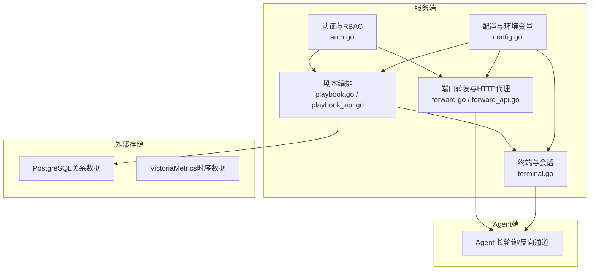
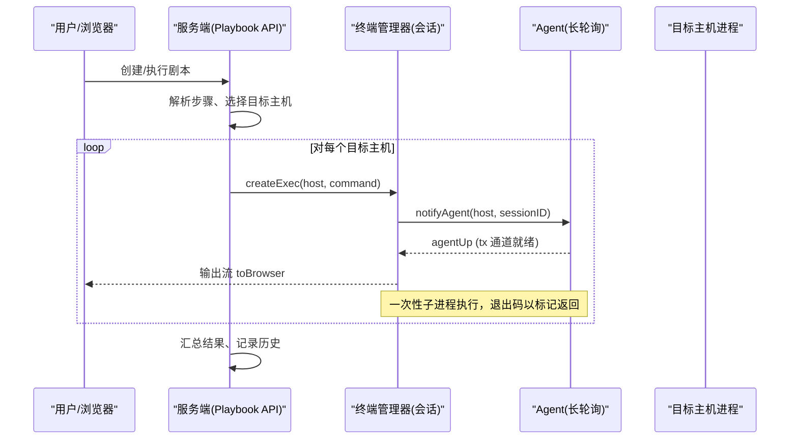
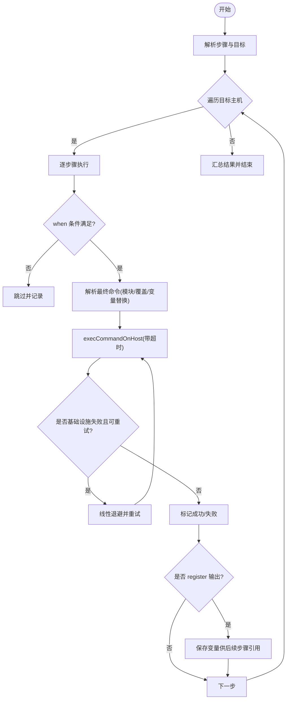
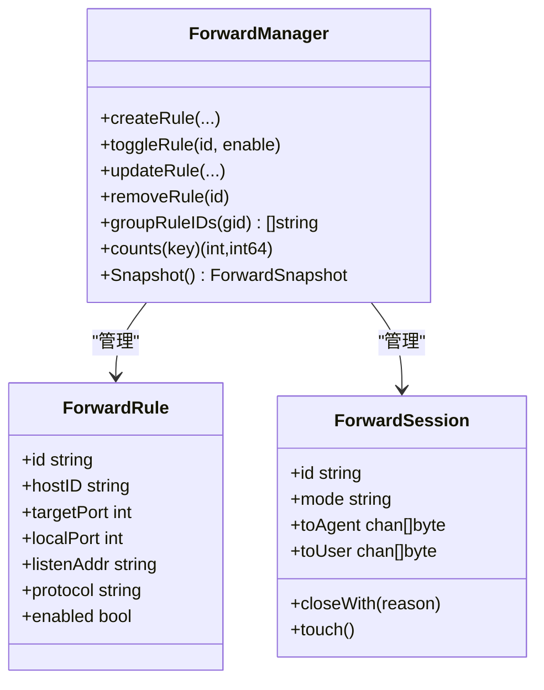
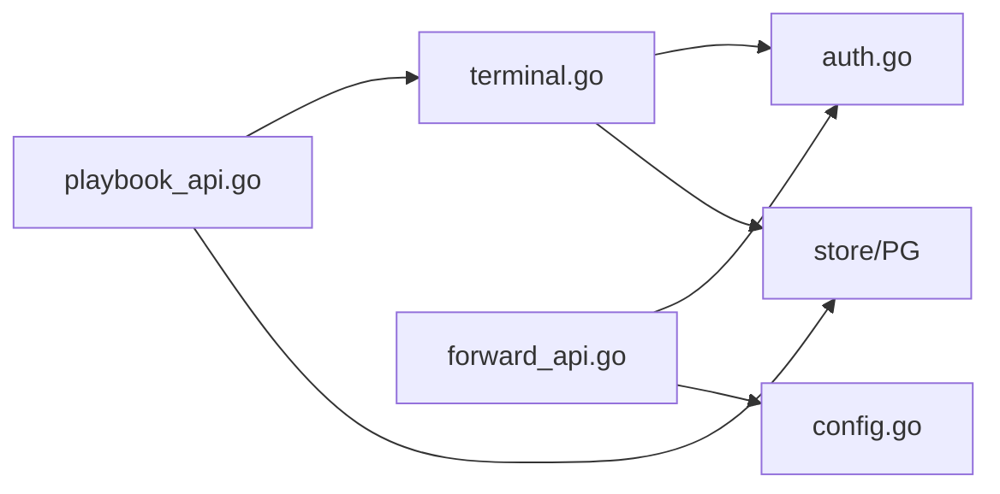

# 自动化运维

<cite>
**本文引用的文件列表**
- [README.md](file://README.md)
- [FORWARD_GUIDE.md](file://FORWARD_GUIDE.md)
- [cmd/server/playbook.go](file://cmd/server/playbook.go)
- [cmd/server/playbook_api.go](file://cmd/server/playbook_api.go)
- [cmd/server/forward.go](file://cmd/server/forward.go)
- [cmd/server/forward_api.go](file://cmd/server/forward_api.go)
- [cmd/server/terminal.go](file://cmd/server/terminal.go)
- [cmd/server/auth.go](file://cmd/server/auth.go)
- [cmd/server/config.go](file://cmd/server/config.go)
- [config.example.json](file://config.example.json)
- [server_config.example.json](file://server_config.example.json)
</cite>

## 目录
1. [简介](#简介)
2. [项目结构](#项目结构)
3. [核心组件](#核心组件)
4. [架构总览](#架构总览)
5. [详细组件分析](#详细组件分析)
6. [依赖关系分析](#依赖关系分析)
7. [性能与安全建议](#性能与安全建议)
8. [故障排查指南](#故障排查指南)
9. [结论](#结论)
10. [附录：剧本编写示例与最佳实践](#附录：剧本编写示例与最佳实践)

## 简介
本文件面向 AIOps Monitor 的“自动化运维”能力，聚焦以下主题：
- 剧本编排系统（Playbook）的架构设计与执行机制
- 命令批量执行、结果审计与执行历史查询
- 端口转发（TCP/UDP 映射）与 HTTP 反向代理的实现原理与安全令牌验证
- 常见运维场景的完整剧本示例（服务重启、日志清理、配置更新等）
- 高级特性：执行历史、错误处理、重试机制、调度触发
- 安全配置与性能优化建议

## 项目结构
与自动化运维相关的核心代码位于服务端 cmd/server 下，主要包含：
- 剧本编排与执行：playbook.go、playbook_api.go
- 端口转发与 HTTP 代理：forward.go、forward_api.go
- 终端与会话管理（复用通道用于一次性命令执行）：terminal.go
- 认证与权限控制：auth.go
- 配置项与环境变量覆盖：config.go
- 用户文档与使用指南：README.md、FORWARD_GUIDE.md
- 示例配置：config.example.json、server_config.example.json

图表来源
- [cmd/server/playbook.go:1-120](file://cmd/server/playbook.go#L1-L120)
- [cmd/server/playbook_api.go:90-210](file://cmd/server/playbook_api.go#L90-L210)
- [cmd/server/forward.go:230-320](file://cmd/server/forward.go#L230-L320)
- [cmd/server/forward_api.go:1-120](file://cmd/server/forward_api.go#L1-L120)
- [cmd/server/terminal.go:1-120](file://cmd/server/terminal.go#L1-L120)
- [cmd/server/auth.go:110-172](file://cmd/server/auth.go#L110-L172)
- [cmd/server/config.go:443-770](file://cmd/server/config.go#L443-L770)

章节来源
- [README.md:612-686](file://README.md#L612-L686)
- [FORWARD_GUIDE.md:1-223](file://FORWARD_GUIDE.md#L1-L223)

## 核心组件
- 剧本编排（Playbook）
  - 数据结构：Playbook、PlaybookStep、PlaybookSchedule、PlaybookExecution、HostExecResult、StepResult
  - 目标选择器：all、category:xxx、system:os、host:ID
  - 条件与变量：when 条件、{{变量}} 替换、register 输出暂存
  - 内置模块：通过封套命令 __AIOPS_MODULE__ 调用 gather_facts/service/package/copy 等
  - 调度：interval/daily/weekly 三种触发方式
- 命令执行与并发
  - 基于 Agent 反向通道的一次性 exec 会话
  - 并行度上限、基础设施失败自动重试、线性退避
- 端口转发（TCP/UDP）
  - 持久化规则、监听地址与端口范围、整组启停/编辑/复制/删除
  - 空闲超时、统计指标（活跃会话、累计字节、平均延迟、带宽滑动窗口）
- HTTP 反向代理
  - 无状态代理 /proxy/{hostID}/{port}/{path}，支持 WebSocket
  - 一次性 proxy_token 鉴权（SameSite=Lax Cookie + 可选 query 参数）
- 终端与会话录制
  - 多标签、旁观者、命令级审计、录制回放
  - 与剧本共用 Agent 反向通道，但独立会话模型

章节来源
- [cmd/server/playbook.go:10-52](file://cmd/server/playbook.go#L10-L52)
- [cmd/server/playbook_api.go:17-85](file://cmd/server/playbook_api.go#L17-L85)
- [cmd/server/playbook_api.go:206-312](file://cmd/server/playbook_api.go#L206-L312)
- [cmd/server/forward.go:137-246](file://cmd/server/forward.go#L137-L246)
- [cmd/server/forward_api.go:20-120](file://cmd/server/forward_api.go#L20-L120)
- [cmd/server/terminal.go:30-128](file://cmd/server/terminal.go#L30-L128)
- [cmd/server/auth.go:130-172](file://cmd/server/auth.go#L130-L172)

## 架构总览
AIOps Monitor 的自动化运维由“服务端 + Agent 反向通道”构成。服务端负责编排、调度、鉴权、持久化；Agent 负责在目标主机上执行命令或建立本地端口连接，并通过双向流将数据回传至服务端。

图表来源
- [cmd/server/playbook_api.go:117-134](file://cmd/server/playbook_api.go#L117-L134)
- [cmd/server/playbook_api.go:339-397](file://cmd/server/playbook_api.go#L339-L397)
- [cmd/server/terminal.go:109-128](file://cmd/server/terminal.go#L109-L128)

## 详细组件分析

### 组件一：剧本编排与执行（Playbook）
- 关键类型与职责
  - Playbook：名称、描述、步骤序列、可选调度、时间戳
  - PlaybookStep：命令、平台覆盖命令、目标选择器、超时、错误策略、变量注册、条件、内置模块
  - PlaybookSchedule：interval/daily/weekly 三种触发
  - PlaybookExecution/HostExecResult/StepResult：执行历史与结果聚合
- 目标解析
  - all/category:xxx/system:os/host:ID，支持有效分类覆盖（避免被不可信 Agent 上报的分类误导）
- 变量与条件
  - {{变量}} 替换；when 条件支持 a==b/a!=b 与真值判断
- 模块机制
  - 通过 __AIOPS_MODULE__ 封套命令，Agent 识别后按系统执行内置模块
- 调度器
  - dueSchedules 计算到期任务，lastRun/schedBusy 去重与防堆积
- 执行流程
  - runPlaybookExecution：并行度限制、每步按顺序执行、基础设施失败自动重试（最多3次，线性退避）、忽略非零退出码选项、register 变量传递
- 执行历史
  - 内存中保留最近 100 条，启动时从持久化恢复

图表来源
- [cmd/server/playbook_api.go:206-312](file://cmd/server/playbook_api.go#L206-L312)
- [cmd/server/playbook_api.go:339-397](file://cmd/server/playbook_api.go#L339-L397)
- [cmd/server/playbook.go:255-304](file://cmd/server/playbook.go#L255-L304)

章节来源
- [cmd/server/playbook.go:10-52](file://cmd/server/playbook.go#L10-L52)
- [cmd/server/playbook.go:155-198](file://cmd/server/playbook.go#L155-L198)
- [cmd/server/playbook_api.go:17-85](file://cmd/server/playbook_api.go#L17-L85)
- [cmd/server/playbook_api.go:206-312](file://cmd/server/playbook_api.go#L206-L312)
- [cmd/server/playbook_api.go:339-423](file://cmd/server/playbook_api.go#L339-L423)

### 组件二：端口转发（TCP/UDP）与 HTTP 反向代理
- TCP/UDP 端口映射
  - 规则持久化、监听地址（默认 127.0.0.1，Docker 需 0.0.0.0）、端口范围（默认 10100-10300）
  - 整组操作：启用/停用、编辑（按最小端口平移）、复制、删除
  - 空闲超时（30 分钟）、最大并发会话（300）、统计指标（活跃/累计/字节/错误/平均延迟/带宽滑动窗口）
- HTTP 反向代理
  - 无状态代理 /proxy/{hostID}/{port}/{path}，支持所有 HTTP 方法与 WebSocket
  - 自动添加 Host/X-Forwarded-* 头，过滤 hop-by-hop 头
  - 一次性 proxy_token 鉴权（SameSite=Lax Cookie），二次校验 RBAC
- 会话生命周期
  - createSession/removeSession、notifyAgent 队列化（避免 Agent 长轮询间隙丢消息）
  - idleChecker 定期关闭空闲会话
- 安全提示
  - 在非回环地址监听会暴露较大面，需配合防火墙/网络隔离

图表来源
- [cmd/server/forward.go:234-258](file://cmd/server/forward.go#L234-L258)
- [cmd/server/forward.go:184-246](file://cmd/server/forward.go#L184-L246)
- [cmd/server/forward.go:449-498](file://cmd/server/forward.go#L449-L498)
- [cmd/server/forward.go:281-310](file://cmd/server/forward.go#L281-L310)

章节来源
- [cmd/server/forward.go:32-135](file://cmd/server/forward.go#L32-L135)
- [cmd/server/forward.go:567-641](file://cmd/server/forward.go#L567-L641)
- [cmd/server/forward_api.go:100-194](file://cmd/server/forward_api.go#L100-L194)
- [cmd/server/forward_api.go:369-392](file://cmd/server/forward_api.go#L369-L392)
- [FORWARD_GUIDE.md:1-223](file://FORWARD_GUIDE.md#L1-L223)

### 组件三：终端与会话录制（复用通道）
- 会话模型 termSession：模式（交互式/一次性 exec）、输入输出通道、观察者（旁观）、录制帧、命令审计缓冲
- 录制与回放：每会话限帧数，持久化到文件目录，重启后可索引回放
- 与剧本的关系：runPlaybookExecution 通过 createExec 复用同一通道完成一次性命令执行

章节来源
- [cmd/server/terminal.go:30-128](file://cmd/server/terminal.go#L30-L128)
- [cmd/server/terminal.go:148-200](file://cmd/server/terminal.go#L148-L200)
- [cmd/server/playbook_api.go:339-397](file://cmd/server/playbook_api.go#L339-L397)

### 组件四：认证与权限控制（RBAC）
- 公开路径白名单（静态资源、登录、Agent 注册/报告、转发健康检查等）
- 路由级权限：viewer 只读、operator+ 可访问终端/转发/代理、admin 管理用户
- 中继共享密钥校验（X-Relay-Secret）
- HTTP 代理一次性 token 鉴权与角色复核

章节来源
- [cmd/server/auth.go:15-49](file://cmd/server/auth.go#L15-L49)
- [cmd/server/auth.go:83-108](file://cmd/server/auth.go#L83-L108)
- [cmd/server/auth.go:110-172](file://cmd/server/auth.go#L110-L172)
- [cmd/server/auth.go:176-200](file://cmd/server/auth.go#L176-L200)

### 组件五：配置与环境变量覆盖
- 转发监听地址与端口范围：forward_listen、forward_port_range
- 全局开关：forward_disabled、terminal_disabled、allow_anonymous_agents、require_token
- 环境变量优先级高于配置文件

章节来源
- [cmd/server/config.go:443-770](file://cmd/server/config.go#L443-L770)
- [server_config.example.json:25-26](file://server_config.example.json#L25-L26)

## 依赖关系分析
- 组件耦合
  - Playbook 依赖 Terminal 的 exec 通道执行命令
  - Forward 与 Auth 强耦合（鉴权、RBAC、代理 token）
  - Config 为各组件提供运行时参数
- 外部依赖
  - PostgreSQL：持久化转发规则、执行历史、配置等
  - VictoriaMetrics：时序数据（与转发/告警阈值相关）
- 潜在循环依赖
  - 当前实现通过接口层分离（API 与核心逻辑解耦），未见直接循环导入

图表来源
- [cmd/server/playbook_api.go:90-134](file://cmd/server/playbook_api.go#L90-L134)
- [cmd/server/forward_api.go:1-120](file://cmd/server/forward_api.go#L1-120)
- [cmd/server/terminal.go:109-128](file://cmd/server/terminal.go#L109-L128)
- [cmd/server/auth.go:110-172](file://cmd/server/auth.go#L110-L172)
- [cmd/server/config.go:443-770](file://cmd/server/config.go#L443-L770)

## 性能与安全建议
- 性能
  - 并发度：剧本执行并行度上限（playbookMaxParallel）避免“惊群”
  - 缓冲区：转发读取缓冲 32KB，降低上下文切换开销
  - 空闲回收：转发会话 30 分钟空闲超时，防止资源泄漏
  - 统计观测：转发统计含平均延迟与带宽滑动窗口，便于容量规划
- 安全
  - 监听地址：默认仅本机（127.0.0.1），生产如需外网访问务必配合防火墙/网络隔离
  - 请求体大小：HTTP 代理最大 100MB，防止 OOM
  - 代理令牌：一次性 proxy_token + SameSite=Lax Cookie，二次 RBAC 校验
  - 中继密钥：X-Relay-Secret 校验，未匹配拒绝
  - 审计：终端命令级审计、转发建立/关闭日志、剧本执行日志

章节来源
- [cmd/server/forward.go:32-40](file://cmd/server/forward.go#L32-L40)
- [cmd/server/forward.go:281-310](file://cmd/server/forward.go#L281-L310)
- [cmd/server/forward_api.go:369-392](file://cmd/server/forward_api.go#L369-L392)
- [cmd/server/auth.go:110-172](file://cmd/server/auth.go#L110-L172)
- [cmd/server/terminal.go:46-54](file://cmd/server/terminal.go#L46-L54)

## 故障排查指南
- 剧本执行常见问题
  - 无在线目标：onlinePlaybookTargets 过滤离线主机，若全部离线则报错
  - 未拾取/超时：execPickupTimeout 内未收到 agentUp 视为 no-pickup，可重试
  - 异常结束：parseExecOutput 无退出标记且未完成视为 abnormal
- 端口转发问题
  - 监听失败：端口占用或范围耗尽，自动尝试范围内随机端口，仍失败则 OS 分配
  - 会话过多：超过 maxForwardSessions 拒绝新会话
  - 空闲超时：长时间无数据传输将被关闭
- 代理访问问题
  - 缺少 proxy_token：通过 /api/v1/proxy-token 获取并设置 Cookie
  - 跨域/浏览器行为：确保 SameSite=Lax 与 Secure（HTTPS）标志正确

章节来源
- [cmd/server/playbook_api.go:139-159](file://cmd/server/playbook_api.go#L139-L159)
- [cmd/server/playbook_api.go:339-397](file://cmd/server/playbook_api.go#L339-L397)
- [cmd/server/forward.go:449-476](file://cmd/server/forward.go#L449-L476)
- [cmd/server/forward.go:281-310](file://cmd/server/forward.go#L281-L310)
- [cmd/server/forward_api.go:369-392](file://cmd/server/forward_api.go#L369-L392)

## 结论
AIOps Monitor 的自动化运维以“轻量编排 + 可靠执行 + 完善审计”为核心：
- 剧本编排支持灵活的目标选择、条件分支、变量传递与内置模块
- 命令执行基于 Agent 反向通道，具备并发控制与基础设施失败自动重试
- 端口转发与 HTTP 代理提供安全的内网访问能力，支持整组管理与丰富统计
- 完善的鉴权与审计保障可管可控，结合配置与环境变量覆盖实现灵活部署

## 附录：剧本编写示例与最佳实践
说明：以下为结构化示例，不直接粘贴代码内容，请根据字段定义在面板或 API 中创建。

- 示例一：服务重启（Linux）
  - 步骤1：停止服务
    - target: category:生产
    - command: systemctl stop myapp
    - timeout_sec: 30
  - 步骤2：清理缓存
    - target: category:生产
    - command: rm -rf /var/cache/myapp/*
    - timeout_sec: 10
  - 步骤3：启动服务
    - target: category:生产
    - command: systemctl start myapp
    - timeout_sec: 30
  - 可选：当条件
    - when: "{{env}}" == "prod"

- 示例二：日志清理（跨平台）
  - 步骤1：Linux/macOS
    - target: system:linux|macos
    - command: find /var/log/myapp -name "*.log" -mtime +7 -delete
    - timeout_sec: 60
  - 步骤2：Windows
    - target: system:windows
    - command_win: powershell -Command "Get-ChildItem 'C:\\logs\\myapp' -Filter '*.log' | Where-Object {$_.LastWriteTime -lt (Get-Date).AddDays(-7)} | Remove-Item -Force"
    - timeout_sec: 60

- 示例三：配置更新（带变量与模块）
  - 步骤1：收集事实
    - module: gather_facts
    - args: {}
    - register: facts
  - 步骤2：生成配置片段
    - command: echo "key={{facts.hostname}}" > /etc/myapp/conf.d/override.conf
    - timeout_sec: 10
  - 步骤3：重载服务
    - module: service
    - args: {"name": "myapp", "state": "reloaded"}

- 示例四：批量端口转发（UDP 5000–5010）
  - 使用 API 创建整段 UDP 转发，共享 group_id，支持整组启停/编辑/复制/删除
  - 参考 FORWARD_GUIDE.md 中的端口范围批量转发说明

- 最佳实践
  - 合理设置超时与 continue_on_error，避免单点失败阻塞整体
  - 使用 register 与 when 组合实现条件执行与动态决策
  - 谨慎使用 ignore_exit，仅对 grep/diff 等过滤类命令开启
  - 对外暴露转发时，务必限定监听地址与防火墙策略
  - 利用执行历史与审计日志进行复盘与合规审查

章节来源
- [cmd/server/playbook.go:35-52](file://cmd/server/playbook.go#L35-L52)
- [cmd/server/playbook_api.go:17-85](file://cmd/server/playbook_api.go#L17-L85)
- [FORWARD_GUIDE.md:1-223](file://FORWARD_GUIDE.md#L1-L223)
- [README.md:612-686](file://README.md#L612-L686)