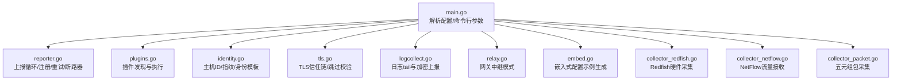
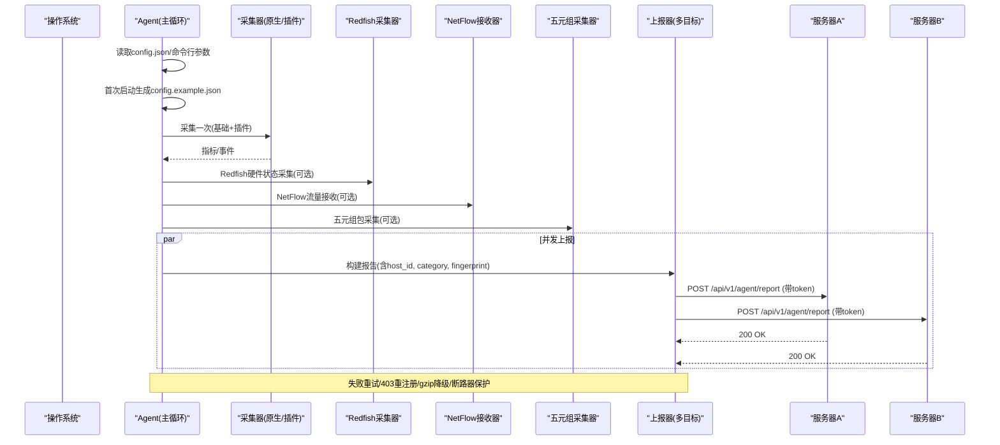
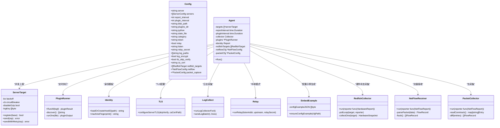

# Agent配置

<cite>
**本文引用的文件**
- [config.example.json](file://config.example.json)
- [cmd/agent/main.go](file://cmd/agent/main.go)
- [cmd/agent/reporter.go](file://cmd/agent/reporter.go)
- [cmd/agent/plugins.go](file://cmd/agent/plugins.go)
- [cmd/agent/identity.go](file://cmd/agent/identity.go)
- [cmd/agent/tls.go](file://cmd/agent/tls.go)
- [cmd/agent/logcollect.go](file://cmd/agent/logcollect.go)
- [cmd/agent/relay.go](file://cmd/agent/relay.go)
- [cmd/agent/embed.go](file://cmd/agent/embed.go)
- [cmd/agent/collector_redfish.go](file://cmd/agent/collector_redfish.go)
- [cmd/agent/collector_netflow.go](file://cmd/agent/collector_netflow.go)
- [cmd/agent/collector_packet.go](file://cmd/agent/collector_packet.go)
- [cmd/server/install.go](file://cmd/server/install.go)
</cite>

## 更新摘要
**变更内容**
- 新增嵌入式配置示例系统功能，Agent首次启动时自动生成config.example.json文件
- 更新安装脚本以自动下载配置示例文件
- 新增Redfish硬件状态采集、NetFlow网络流量接收、五元组包报文采集的配置说明
- 完善配置文件的中文注释和详细说明

## 目录
1. [简介](#简介)
2. [项目结构](#项目结构)
3. [核心组件](#核心组件)
4. [架构总览](#架构总览)
5. [详细组件分析](#详细组件分析)
6. [依赖关系分析](#依赖关系分析)
7. [性能与稳定性](#性能与稳定性)
8. [故障排查指南](#故障排查指南)
9. [结论](#结论)
10. [附录：配置项清单与示例](#附录配置项清单与示例)

## 简介
本文件面向运维与平台工程师，系统化说明 AIOps Agent 的配置文件 config.json 的所有选项、默认值、有效范围与语法；覆盖服务器连接、采集间隔、插件管理、磁盘监控、Python 环境、状态文件、日志采集、TLS 安全、中继模式等。并提供单机部署、多服务器上报、分类标签、安全令牌等使用场景的配置示例，解释优先级机制与动态更新能力，并给出启动参数、环境变量覆盖与故障排查要点。

**更新** 新增嵌入式配置示例系统功能，Agent首次启动时自动生成包含详细中文注释的config.example.json文件，同时支持Redfish硬件状态采集、NetFlow网络流量接收和五元组包报文采集的高级配置。

## 项目结构
Agent 的核心配置在进程启动时加载，随后用于初始化采集器、插件运行器、上报通道、日志采集与 TLS 设置等模块。关键入口与配置解析位于主程序，具体功能由多个子模块实现。

图示来源
- [cmd/agent/main.go:74-136](file://cmd/agent/main.go#L74-L136)
- [cmd/agent/reporter.go:277-370](file://cmd/agent/reporter.go#L277-L370)
- [cmd/agent/plugins.go:53-100](file://cmd/agent/plugins.go#L53-L100)
- [cmd/agent/identity.go:30-57](file://cmd/agent/identity.go#L30-L57)
- [cmd/agent/tls.go:41-73](file://cmd/agent/tls.go#L41-L73)
- [cmd/agent/logcollect.go:37-84](file://cmd/agent/logcollect.go#L37-L84)
- [cmd/agent/relay.go:31-89](file://cmd/agent/relay.go#L31-L89)
- [cmd/agent/embed.go:19-39](file://cmd/agent/embed.go#L19-L39)
- [cmd/agent/collector_redfish.go:27-53](file://cmd/agent/collector_redfish.go#L27-L53)
- [cmd/agent/collector_netflow.go:167-200](file://cmd/agent/collector_netflow.go#L167-L200)
- [cmd/agent/collector_packet.go:29-56](file://cmd/agent/collector_packet.go#L29-L56)

章节来源
- [cmd/agent/main.go:74-136](file://cmd/agent/main.go#L74-L136)

## 核心组件
- 配置模型：定义所有可配置的字段、JSON 键名、默认值与行为（单服务器与多服务器并存）。
- 上报器：负责周期性采集、并发上报、注册、重试、gzip 降级、断路器保护。
- 插件系统：按目录扫描、白名单扩展、并发执行、超时控制、结果合并。
- 身份与状态：持久化 host_id 与机器指纹，避免克隆冲突。
- TLS 与安全：自定义 CA 证书注入、可选跳过校验（仅实验室/临时）。
- 日志采集：按路径 tail、批量压缩与 AES-GCM 加密、服务端下发密钥驱动。
- 中继模式：反向代理安装脚本与全部请求，自动改写 SERVER 地址。
- **嵌入式配置示例**：首次启动自动生成包含详细中文注释的配置示例文件。
- **高级采集器**：支持Redfish硬件状态采集、NetFlow网络流量接收、五元组包报文采集。

章节来源
- [cmd/agent/main.go:24-62](file://cmd/agent/main.go#L24-L62)
- [cmd/agent/reporter.go:259-370](file://cmd/agent/reporter.go#L259-L370)
- [cmd/agent/plugins.go:45-100](file://cmd/agent/plugins.go#L45-L100)
- [cmd/agent/identity.go:30-57](file://cmd/agent/identity.go#L30-L57)
- [cmd/agent/tls.go:19-39](file://cmd/agent/tls.go#L19-39)
- [cmd/agent/logcollect.go:37-84](file://cmd/agent/logcollect.go#L37-L84)
- [cmd/agent/relay.go:31-89](file://cmd/agent/relay.go#L31-L89)
- [cmd/agent/embed.go:19-39](file://cmd/agent/embed.go#L19-L39)
- [cmd/agent/collector_redfish.go:27-53](file://cmd/agent/collector_redfish.go#L27-L53)
- [cmd/agent/collector_netflow.go:167-200](file://cmd/agent/collector_netflow.go#L167-L200)
- [cmd/agent/collector_packet.go:29-56](file://cmd/agent/collector_packet.go#L29-L56)

## 架构总览
Agent 启动后，根据配置选择"普通上报"或"中继模式"。普通模式下，周期性地采集基础指标与插件指标，向一个或多个后端服务器并发上报；同时可按需开启日志采集。中继模式下，Agent 作为本地网关，将安装脚本与所有请求转发到上游云监控中心，内网机器无需直连外网。

图示来源
- [cmd/agent/main.go:210-236](file://cmd/agent/main.go#L210-L236)
- [cmd/agent/reporter.go:452-567](file://cmd/agent/reporter.go#L452-L567)
- [cmd/agent/embed.go:19-39](file://cmd/agent/embed.go#L19-L39)

## 详细组件分析

### 配置模型与优先级
- 配置来源顺序（最终生效）：
  1) 默认值（代码内置）
  2) 配置文件（默认 config.json，可通过 --config 指定）
  3) 命令行参数（覆盖配置与默认值）
- 多服务器优先：当 servers 非空时，忽略 legacy 的 server + token 字段；否则回退到单服务器模式。
- 关键行为：
  - 未配置任何服务端地址会直接退出。
  - 支持 relay 中继模式，启用后不再进行常规上报。
  - **首次启动自动生成 config.example.json 配置示例文件**。

章节来源
- [cmd/agent/main.go:44-62](file://cmd/agent/main.go#L44-L62)
- [cmd/agent/main.go:74-136](file://cmd/agent/main.go#L74-L136)
- [cmd/agent/main.go:210-218](file://cmd/agent/main.go#L210-L218)
- [cmd/agent/embed.go:19-39](file://cmd/agent/embed.go#L19-L39)

### 嵌入式配置示例系统
**新增功能** Agent首次启动时会在配置目录下自动生成 config.example.json 文件，包含详细的中文注释和配置说明。

**工作原理**：
- 使用 Go 的 `//go:embed` 指令将配置示例文件嵌入到二进制中
- 启动时检查配置目录，如果不存在 config.example.json 则自动生成
- 已存在的配置文件不会被覆盖，确保用户自定义配置的安全
- 生成的文件包含完整的配置项说明和使用示例

**配置示例文件特性**：
- 详细的中文注释说明每个配置项的作用
- 提供常见使用场景的配置示例
- 包含Redfish、NetFlow、PacketCapture等高级功能的配置说明
- 标注安全注意事项和最佳实践

章节来源
- [cmd/agent/embed.go:11-39](file://cmd/agent/embed.go#L11-L39)
- [cmd/agent/main.go:95-96](file://cmd/agent/main.go#L95-L96)
- [config.example.json:1-96](file://config.example.json#L1-L96)

### 配置项详解（config.json）
以下为所有支持的 JSON 字段、作用、默认值、有效范围与语法说明。

#### 基础配置
- server
  - 类型：字符串
  - 作用：单服务器模式的上报地址（http/https），如 http://192.168.1.10:8529
  - 默认值：http://localhost:8529
  - 备注：当 servers 存在时不生效
- servers
  - 类型：数组，元素为对象 {server, token?}
  - 作用：多服务器上报列表；每个条目独立 token
  - 默认值：无
  - 备注：非空时优先于 server/token
- report_interval
  - 类型：整数（秒）
  - 作用：基础指标上报周期
  - 默认值：10
- plugin_interval
  - 类型：整数（秒）
  - 作用：插件执行周期
  - 默认值：15
- disk_path
  - 类型：字符串
  - 作用：监控的磁盘根路径
  - 默认值：Linux/macOS 为 "/"；Windows 优先 SystemDrive，否则 "C:\"
- plugins_dir
  - 类型：字符串
  - 作用：Python/Shell 插件目录
  - 默认值："plugins"
- python
  - 类型：字符串
  - 作用：执行 .py 插件的解释器命令
  - 默认值：Linux/macOS 为 "python3"；Windows 为 "python"
- state_file
  - 类型：字符串
  - 作用：主机标识与指纹持久化文件
  - 默认值："agent_state.json"
- category
  - 类型：字符串
  - 作用：主机分类标签（如 生产/测试/DB/办公终端）
  - 默认值：空
- token
  - 类型：字符串
  - 作用：单服务器模式的安装 Token（可选）
  - 默认值：空

#### 中继模式配置
- relay
  - 类型：布尔
  - 作用：是否以网关中继模式运行
  - 默认值：false
- listen
  - 类型：字符串
  - 作用：Relay 监听地址（如 ":8529"）
  - 默认值：":8529"
- relay_secret
  - 类型：字符串
  - 作用：Relay 共享密钥，注入 X-Relay-Secret 头供上游验证
  - 默认值：空

#### 安全配置
- tls_skip_verify
  - 类型：布尔
  - 作用：跳过服务端 TLS 证书校验（不安全，仅自签/内网临时）
  - 默认值：false
- ca_cert
  - 类型：字符串
  - 作用：CA PEM 证书路径，用于校验自签名服务端证书
  - 默认值：空

#### 日志采集配置
- log_paths
  - 类型：字符串数组
  - 作用：要 tail 的日志文件或目录路径
  - 默认值：空
- log_encrypt
  - 类型：布尔
  - 作用：是否对日志上报进行 gzip+AES-256-GCM 加密（有服务端下发密钥时生效）
  - 默认值：true

#### Redfish硬件状态采集配置
**新增功能** 支持从BMC/iDRAC/iLO等设备采集硬件状态信息。

- redfish_targets
  - 类型：数组，元素为对象 {name, url, username, password_env, skip_tls_verify, interval_sec}
  - 作用：配置需要采集的Redfish设备列表
  - 默认值：空数组
  - 字段说明：
    - name: 设备名称标识
    - url: Redfish API地址（如 https://192.168.1.100）
    - username: 认证用户名
    - password_env: 密码所在的环境变量名（密码不落盘）
    - skip_tls_verify: 是否跳过TLS证书验证
    - interval_sec: 采集间隔秒数（最小30秒）

#### NetFlow网络流量接收配置
**新增功能** 支持接收交换机/防火墙推送的NetFlow数据。

- netflow
  - 类型：对象 {listen, protocols, buffer_size, window_sec, max_flows_per_sec, active_targets}
  - 作用：配置NetFlow UDP接收器
  - 默认值：nil（未配置时不启动）
  - 字段说明：
    - listen: UDP监听地址（如 ":2055"）
    - protocols: 支持的协议版本 ["v5", "v9"]
    - buffer_size: UDP接收缓冲区大小（默认65536）
    - window_sec: 聚合窗口秒数（默认300=5分钟）
    - max_flows_per_sec: 流量限速（默认10000）
    - active_targets: 主动轮询的目标设备列表

#### 五元组包报文采集配置
**新增功能** 支持通过Linux nf_conntrack采集五元组连接信息。

- packet_capture
  - 类型：对象 {enabled, interface, bpf_filter, sample_rate, max_packets_per_min}
  - 作用：配置五元组包采集器（仅Linux有效）
  - 默认值：nil（未配置或enabled=false时不启动）
  - 字段说明：
    - enabled: 是否启用采集
    - interface: 网络接口名称
    - bpf_filter: BPF过滤规则
    - sample_rate: 采样率
    - max_packets_per_min: 每分钟最大数据包数（默认6000）

章节来源
- [cmd/agent/main.go:24-42](file://cmd/agent/main.go#L24-L42)
- [cmd/agent/main.go:44-72](file://cmd/agent/main.go#L44-L72)
- [cmd/agent/main.go:91-120](file://cmd/agent/main.go#L91-L120)
- [cmd/agent/reporter.go:277-312](file://cmd/agent/reporter.go#L277-L312)
- [cmd/agent/logcollect.go:37-84](file://cmd/agent/logcollect.go#L37-L84)
- [cmd/agent/tls.go:19-39](file://cmd/agent/tls.go#L19-L39)
- [cmd/agent/collector_redfish.go:17-25](file://cmd/agent/collector_redfish.go#L17-L25)
- [cmd/agent/collector_netflow.go:14-22](file://cmd/agent/collector_netflow.go#L14-L22)
- [cmd/agent/collector_packet.go:17-24](file://cmd/agent/collector_packet.go#L17-L24)
- [config.example.json:54-95](file://config.example.json#L54-L95)

### 插件管理与执行
- 插件发现：扫描 plugins_dir，忽略隐藏文件、SDK 与 requirements.txt；仅允许 .py/.sh 扩展名（白名单）。
- 并发执行：最多 4 个并发子进程，单个插件受超时保护。
- 输出协议：插件通过 stdout 输出 JSON，包含 base/metrics/events 三个可选字段。
- 结果合并：base 仅在原生采集不可用时回退；custom metrics 合并；events 累积并在上报时发送。

章节来源
- [cmd/agent/plugins.go:62-100](file://cmd/agent/plugins.go#L62-L100)
- [cmd/agent/plugins.go:105-147](file://cmd/agent/plugins.go#L105-L147)
- [cmd/agent/reporter.go:423-439](file://cmd/agent/reporter.go#L423-L439)

### 磁盘监控
- 通过 disk_path 指定监控根路径，不同平台采用原生采集器获取磁盘使用率等指标。
- Windows 下默认盘符来自 SystemDrive 环境变量，否则回退到 C:\。

章节来源
- [cmd/agent/main.go:64-72](file://cmd/agent/main.go#L64-L72)
- [cmd/agent/collector.go:5-16](file://cmd/agent/collector.go#L5-L16)

### Python 环境配置
- python 字段决定执行 .py 插件的命令，Windows 默认 "python"，其他平台默认 "python3"。
- 插件目录 plugins_dir 默认 "plugins"，建议保持相对路径以便容器/包分发。

章节来源
- [cmd/agent/main.go:44-62](file://cmd/agent/main.go#L44-L62)
- [cmd/agent/plugins.go:53-55](file://cmd/agent/plugins.go#L53-L55)

### 状态文件与主机标识
- state_file 用于持久化 host_id 与机器指纹（machine-id/MAC 哈希），防止克隆导致 ID 冲突。
- 首次启动若不存在或指纹不一致则生成新 ID 并原子写入。

章节来源
- [cmd/agent/identity.go:30-57](file://cmd/agent/identity.go#L30-L57)

### 日志采集与加密
- 通过 log_paths 指定文件或目录，周期性 tail 新增行，批量上报。
- 若服务端注册返回日志密钥且 log_encrypt=true，则上报前进行 gzip+AES-256-GCM 加密。
- 目录扫描每约 60 秒重新展开，自动纳入新文件；旋转/截断检测后从顶部重读。

章节来源
- [cmd/agent/logcollect.go:37-84](file://cmd/agent/logcollect.go#L37-L84)
- [cmd/agent/logcollect.go:208-230](file://cmd/agent/logcollect.go#L208-L230)
- [cmd/agent/reporter.go:90-121](file://cmd/agent/reporter.go#L90-L121)

### TLS 与证书
- 支持通过 ca_cert 注入自定义 CA 证书，建立可信根链。
- tls_skip_verify 可跳过校验（仅实验室/临时），默认严格校验。
- 该配置在首个 HTTP 客户端创建前全局应用，影响所有出站连接。

章节来源
- [cmd/agent/tls.go:19-39](file://cmd/agent/tls.go#L19-L39)
- [cmd/agent/tls.go:41-73](file://cmd/agent/tls.go#L41-L73)
- [cmd/agent/main.go:122-124](file://cmd/agent/main.go#L122-L124)

### 中继模式（Relay）
- 启用 relay 后，Agent 作为本地网关监听 listen 端口，将所有请求反向代理到 upstream server。
- 拦截安装脚本，自动将 SERVER 改写为 Relay 地址，内网机器无需手动改配置。
- 可选 relay_secret 注入 X-Relay-Secret 头，供上游校验中继来源。

章节来源
- [cmd/agent/relay.go:31-89](file://cmd/agent/relay.go#L31-L89)
- [cmd/agent/relay.go:136-189](file://cmd/agent/relay.go#L136-L189)
- [cmd/agent/main.go:126-136](file://cmd/agent/main.go#L126-L136)

### Redfish硬件状态采集器
**新增功能** 支持从BMC/iDRAC/iLO等硬件管理接口采集服务器硬件状态。

**工作原理**：
- 每个target独立goroutine运行，拥有独立的定时器
- 通过Redfish REST API轮询硬件状态信息
- 支持密码环境变量注入，避免密码明文存储
- 具备错误处理和退避机制，连续失败时自动降低采集频率

**采集内容**：
- 系统健康状态、CPU信息、内存容量
- 温度传感器、风扇转速、电源状态
- 固件版本、存储设备状态

章节来源
- [cmd/agent/collector_redfish.go:27-101](file://cmd/agent/collector_redfish.go#L27-L101)
- [cmd/agent/collector_redfish.go:128-200](file://cmd/agent/collector_redfish.go#L128-L200)

### NetFlow网络流量接收器
**新增功能** 支持接收交换机/防火墙推送的NetFlow v5/v9数据流。

**工作原理**：
- 监听UDP端口接收NetFlow数据包
- 支持v5固定格式和v9模板化格式
- 基于时间窗口的流量聚合统计
- 内存限制和丢包处理机制

**配置特性**：
- 可配置监听地址、协议版本、缓冲区大小
- 支持流量限速和聚合窗口调整
- 可配置主动轮询的网络设备

章节来源
- [cmd/agent/collector_netflow.go:167-254](file://cmd/agent/collector_netflow.go#L167-L254)
- [cmd/agent/collector_netflow.go:202-212](file://cmd/agent/collector_netflow.go#L202-L212)

### 五元组包报文采集器
**新增功能** 支持通过Linux内核nf_conntrack表采集网络连接信息。

**工作原理**：
- 定期读取/proc/net/nf_conntrack文件
- 计算增量连接变化，生成流量记录
- 支持速率限制和内存优化
- 仅Linux平台有效

**采集内容**：
- 源IP、目的IP、源端口、目的端口、协议
- 连接状态、字节数、数据包数
- 时间戳和统计信息

章节来源
- [cmd/agent/collector_packet.go:58-113](file://cmd/agent/collector_packet.go#L58-L113)
- [cmd/agent/collector_packet.go:115-138](file://cmd/agent/collector_packet.go#L115-L138)

## 依赖关系分析
- main.go 负责解析配置与参数，构造 Agent、Collector、PluginRunner，并设置 TLS。
- reporter.go 维护多目标上报、注册、重试、gzip 降级与断路器。
- plugins.go 负责插件发现与执行，输出标准 JSON 协议。
- identity.go 提供稳定的主机标识与指纹，避免克隆冲突。
- tls.go 统一注入 TLS 信任链，影响所有出站 HTTP 客户端。
- logcollect.go 基于服务端下发的日志密钥进行加密上报。
- relay.go 提供反向代理与安装脚本改写能力。
- embed.go 提供嵌入式配置示例生成服务。
- collector_redfish.go 实现Redfish硬件状态采集。
- collector_netflow.go 实现NetFlow网络流量接收。
- collector_packet.go 实现五元组包报文采集。

图示来源
- [cmd/agent/main.go:24-42](file://cmd/agent/main.go#L24-L42)
- [cmd/agent/reporter.go:259-312](file://cmd/agent/reporter.go#L259-L312)
- [cmd/agent/plugins.go:45-100](file://cmd/agent/plugins.go#L45-L100)
- [cmd/agent/identity.go:30-57](file://cmd/agent/identity.go#L30-L57)
- [cmd/agent/tls.go:41-73](file://cmd/agent/tls.go#L41-L73)
- [cmd/agent/logcollect.go:37-84](file://cmd/agent/logcollect.go#L37-L84)
- [cmd/agent/relay.go:31-89](file://cmd/agent/relay.go#L31-L89)
- [cmd/agent/embed.go:19-39](file://cmd/agent/embed.go#L19-L39)
- [cmd/agent/collector_redfish.go:27-53](file://cmd/agent/collector_redfish.go#L27-L53)
- [cmd/agent/collector_netflow.go:167-200](file://cmd/agent/collector_netflow.go#L167-L200)
- [cmd/agent/collector_packet.go:29-56](file://cmd/agent/collector_packet.go#L29-L56)

## 性能与稳定性
- 连接复用：HTTP 传输层禁用 HTTP/2，使用连接池减少握手开销，提升服务重启后的恢复速度。
- 并发上报：每个目标独立 goroutine，互不影响；断路器在连续失败后短暂暂停，降低无效重试。
- 重试策略：单次上报最多 3 次尝试，遇到 403 自动重注册，遇到 400 且已压缩则禁用 gzip 并重试。
- 插件隔离：插件以子进程运行，超时保护与并发上限避免拖垮主进程。
- 日志采集：批量与限流，避免大文件一次性读取造成抖动。
- **Redfish采集**：独立定时器、错误退避、内存限制，避免影响主流程。
- **NetFlow接收**：UDP缓冲、流量聚合、内存清理，支持高并发流量处理。
- **包采集**：增量计算、速率限制、内存优化，减少系统负载。

章节来源
- [cmd/agent/reporter.go:33-49](file://cmd/agent/reporter.go#L33-L49)
- [cmd/agent/reporter.go:213-253](file://cmd/agent/reporter.go#L213-L253)
- [cmd/agent/reporter.go:452-567](file://cmd/agent/reporter.go#L452-L567)
- [cmd/agent/plugins.go:105-147](file://cmd/agent/plugins.go#L105-L147)
- [cmd/agent/logcollect.go:132-167](file://cmd/agent/logcollect.go#L132-L167)
- [cmd/agent/collector_redfish.go:62-101](file://cmd/agent/collector_redfish.go#L62-L101)
- [cmd/agent/collector_netflow.go:70-123](file://cmd/agent/collector_netflow.go#L70-L123)
- [cmd/agent/collector_packet.go:84-92](file://cmd/agent/collector_packet.go#L84-L92)

## 故障排查指南
- 无法连接服务端
  - 检查 server/servers 地址与网络连通性；确认防火墙/代理设置。
  - 查看日志中"注册失败/上报失败"提示，关注 403/400/5xx 状态码。
- 403 被拒
  - 可能 Token 失效或指纹未绑定；Agent 会自动重注册，必要时检查服务端安装流程。
- 400 错误
  - 若之前启用了 gzip，可能是外网代理损坏压缩数据；Agent 会自动禁用 gzip 并重试。
- 插件无输出或报错
  - 确认插件目录与扩展名在白名单内；检查 Python 解释器路径；查看插件执行日志。
- 日志未上报
  - 确认 log_paths 指向的文件/目录存在；检查服务端是否下发日志密钥；必要时关闭加密调试。
- TLS 证书问题
  - 自签证书建议使用 ca_cert 指定 CA；仅在临时环境使用 tls_skip_verify。
- 中继模式异常
  - 检查 listen 地址与端口占用；确认上游可达；核对 relay_secret 是否与上游一致。
- **配置示例文件未生成**
  - 检查配置文件目录权限；查看Agent启动日志中的"已生成配置示例文件"消息。
- **Redfish采集失败**
  - 确认BMC网络可达；检查用户名密码环境变量；验证TLS证书配置；查看连续失败退避日志。
- **NetFlow接收无数据**
  - 检查UDP端口监听状态；确认网络设备配置正确；查看协议版本匹配；检查流量限速设置。
- **五元组采集无数据**
  - 确认Linux内核支持nf_conntrack；检查文件读取权限；查看采集器启动日志。

章节来源
- [cmd/agent/reporter.go:90-121](file://cmd/agent/reporter.go#L90-L121)
- [cmd/agent/reporter.go:213-253](file://cmd/agent/reporter.go#L213-L253)
- [cmd/agent/plugins.go:149-172](file://cmd/agent/plugins.go#L149-L172)
- [cmd/agent/logcollect.go:208-230](file://cmd/agent/logcollect.go#L208-L230)
- [cmd/agent/tls.go:19-39](file://cmd/agent/tls.go#L19-L39)
- [cmd/agent/relay.go:31-89](file://cmd/agent/relay.go#L31-L89)
- [cmd/agent/embed.go:34-38](file://cmd/agent/embed.go#L34-L38)
- [cmd/agent/collector_redfish.go:75-101](file://cmd/agent/collector_redfish.go#L75-L101)
- [cmd/agent/collector_netflow.go:209-212](file://cmd/agent/collector_netflow.go#L209-L212)
- [cmd/agent/collector_packet.go:73-77](file://cmd/agent/collector_packet.go#L73-L77)

## 结论
Agent 配置围绕"连接、周期、插件、日志、安全、中继"六大维度设计，兼顾易用性与健壮性。通过多服务器并发上报、断路器与重试、gzip 降级、TLS 信任链与中继模式，Agent 能在复杂网络与异构环境中稳定工作。新增的嵌入式配置示例系统提供了完善的中文配置指导，而Redfish、NetFlow、PacketCapture等高级采集器进一步增强了硬件监控和网络分析能力。建议在生产环境使用 ca_cert 而非跳过校验，合理设置 report/plugin 间隔，并通过分类标签与多服务器实现分层治理与冗余上报。

## 附录：配置项清单与示例

### 配置项清单（JSON 键名与默认值）
- server: "http://localhost:8529"
- servers: 无（数组为空时回退到 server/token）
- report_interval: 10
- plugin_interval: 15
- disk_path: 平台相关（"/" 或 "C:\"）
- plugins_dir: "plugins"
- python: "python3"（Windows 为 "python"）
- state_file: "agent_state.json"
- category: ""
- token: ""
- relay: false
- listen: ":8529"
- relay_secret: ""
- log_paths: []
- log_encrypt: true
- tls_skip_verify: false
- ca_cert: ""
- redfish_targets: []（新增）
- netflow: nil（新增）
- packet_capture: nil（新增）

章节来源
- [cmd/agent/main.go:44-62](file://cmd/agent/main.go#L44-L62)
- [cmd/agent/main.go:24-42](file://cmd/agent/main.go#L24-L42)
- [cmd/agent/main.go:42-46](file://cmd/agent/main.go#L42-L46)

### 使用场景示例

#### 基础配置场景
- 单机部署（单服务器）
  - 配置要点：设置 server 与可选 token；按需调整 report_interval、disk_path、plugins_dir。
  - 参考示例文件：[config.example.json](file://config.example.json)

- 多服务器上报（冗余/分片）
  - 配置要点：填写 servers 数组，每个条目包含 server 与 token；此时忽略 server/token。
  - 参考示例文件：[config.example.json](file://config.example.json)

- 分类标签
  - 配置要点：category 设置为业务分组，便于服务端聚合与告警。
  - 参考示例文件：[config.example.json](file://config.example.json)

- 安全令牌
  - 配置要点：单服务器用 token；多服务器在每个 servers 条目中分别设置 token。
  - 参考示例文件：[config.example.json](file://config.example.json)

#### 高级功能场景
- 中继模式（内网无外网访问）
  - 配置要点：relay=true，listen 指定监听地址，server 指定上游；可选 relay_secret。
  - 参考示例文件：[config.example.json](file://config.example.json)

- 日志采集与加密
  - 配置要点：log_paths 指定文件或目录；log_encrypt=true（默认）；确保服务端下发日志密钥。
  - 参考示例文件：[config.example.json](file://config.example.json)

- TLS 自签证书
  - 配置要点：ca_cert 指向 CA PEM；不建议使用 tls_skip_verify。
  - 参考示例文件：[config.example.json](file://config.example.json)

- Redfish硬件监控
  - 配置要点：redfish_targets 配置BMC设备信息；password_env设置密码环境变量；interval_sec调整采集频率。
  - 参考示例文件：[config.example.json](file://config.example.json)

- NetFlow流量分析
  - 配置要点：netflow.listen设置UDP监听端口；protocols配置支持的版本；window_sec调整聚合窗口。
  - 参考示例文件：[config.example.json](file://config.example.json)

- 五元组包采集
  - 配置要点：packet_capture.enabled=true；max_packets_per_min设置速率限制；仅Linux平台有效。
  - 参考示例文件：[config.example.json](file://config.example.json)

### 启动参数与环境变量覆盖
- 配置文件路径：--config <path>
- 单服务器地址：--server <url>
- 上报间隔：--interval <秒>
- 插件间隔：--plugin-interval <秒>
- 磁盘路径：--disk-path <path>
- 插件目录：--plugins-dir <path>
- Python 解释器：--python <command>
- 分类标签：--category <tag>
- 安装 Token：--token <token>
- 中继模式开关：--relay
- 中继监听地址：--listen <addr>
- 中继共享密钥：--relay-secret <secret>
- 日志路径（逗号分隔）：--log-paths <p1,p2,...>
- 日志加密开关：--log-encrypt <true|false>
- 跳过 TLS 校验：--tls-skip-verify <true|false>
- CA 证书路径：--ca-cert <path>
- 安全模式：--security-mode auto|permissive|enforcing

注意：命令行参数会覆盖配置文件与默认值；部分行为（如日志路径）通过参数追加到配置数组。

章节来源
- [cmd/agent/main.go:91-120](file://cmd/agent/main.go#L91-L120)

### 动态更新能力
- 当前实现：Agent 在启动时加载配置，未在运行期热重载配置文件。
- 运行时可调：通过命令行参数在启动时确定最终配置；如需变更，应重启 Agent。
- 建议：将常用配置放入 config.json，并以 --config 指定路径，便于版本化管理与灰度切换。
- **配置示例自动生成**：首次启动时自动生成config.example.json，后续启动不会覆盖用户修改。

章节来源
- [cmd/agent/main.go:74-136](file://cmd/agent/main.go#L74-L136)
- [cmd/agent/embed.go:19-39](file://cmd/agent/embed.go#L19-L39)

### 安装脚本集成
**更新** 安装脚本现已支持自动下载配置示例文件，简化部署流程。

**Linux/macOS安装脚本**：
- 自动从服务器下载 config.example.json 到安装目录
- 生成配置文件时包含必要的初始配置
- 支持systemd/launchd自动启动配置

**Windows安装脚本**：
- 通过PowerShell下载配置示例文件
- 自动创建用户级自启动任务
- 支持UTF-8编码和无BOM格式

章节来源
- [cmd/server/install.go:136-137](file://cmd/server/install.go#L136-L137)
- [cmd/server/install.go:257-258](file://cmd/server/install.go#L257-L258)