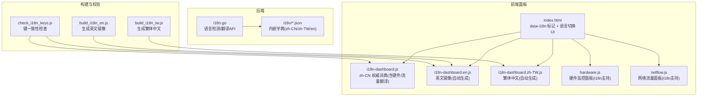
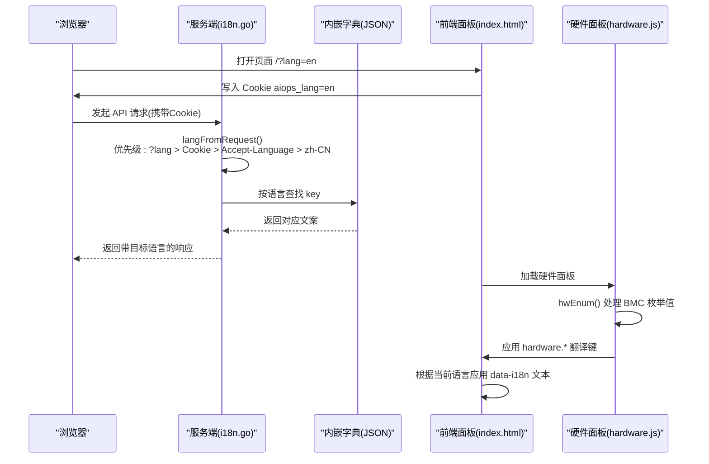
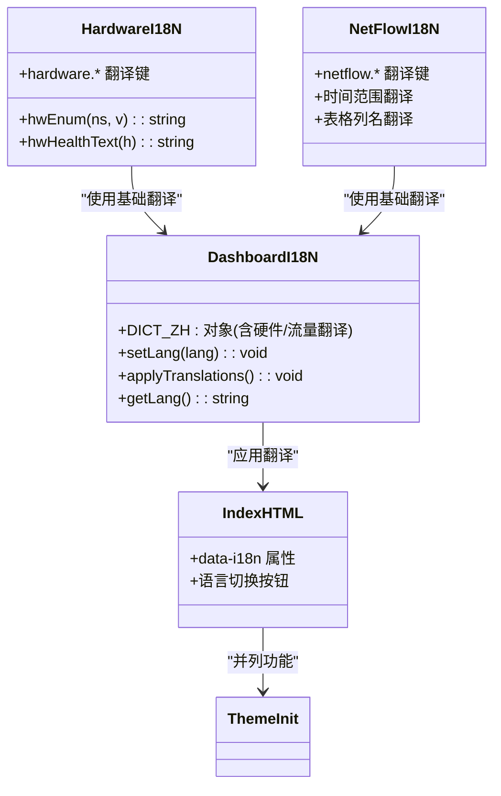
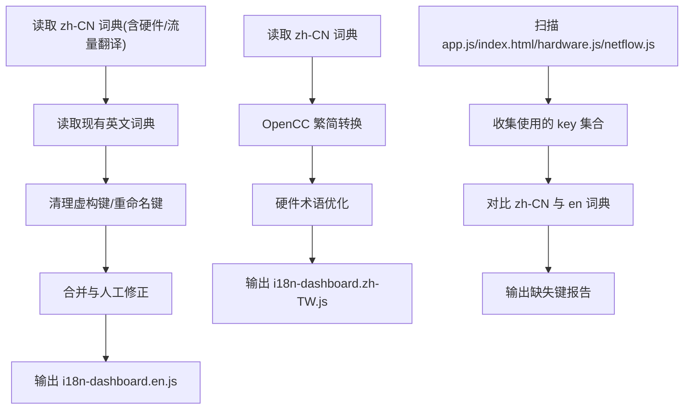
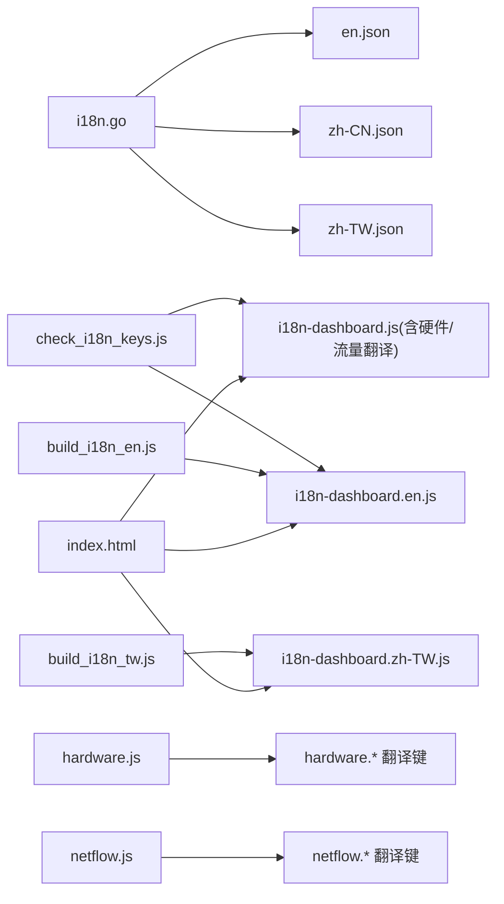

# 国际化支持

<cite>
**本文引用的文件**
- [i18n.go](file://cmd/server/i18n.go)
- [en.json](file://cmd/server/i18n/en.json)
- [zh-CN.json](file://cmd/server/i18n/zh-CN.json)
- [i18n-dashboard.js](file://cmd/server/web/i18n-dashboard.js)
- [i18n-dashboard.en.js](file://cmd/server/web/i18n-dashboard.en.js)
- [i18n-dashboard.zh-TW.js](file://cmd/server/web/i18n-dashboard.zh-TW.js)
- [index.html](file://cmd/server/web/index.html)
- [build_i18n_en.js](file://scripts/build_i18n_en.js)
- [check_i18n_keys.js](file://scripts/check_i18n_keys.js)
- [hardware.js](file://cmd/server/web/js/hardware.js)
- [netflow.js](file://cmd/server/web/js/netflow.js)
</cite>

## 更新摘要
**变更内容**
- 新增硬件监控仪表板完整国际化支持，涵盖80+个翻译键
- 扩展网络流量分析面板的三语本地化
- 完善设备身份信息、组件类型、事件描述等硬件术语的多语言映射
- 增强 BMC 枚举值的中文化处理机制

## 目录
1. [简介](#简介)
2. [项目结构](#项目结构)
3. [核心组件](#核心组件)
4. [架构总览](#架构总览)
5. [详细组件分析](#详细组件分析)
6. [依赖关系分析](#依赖关系分析)
7. [性能与可扩展性](#性能与可扩展性)
8. [故障排查指南](#故障排查指南)
9. [结论](#结论)
10. [附录](#附录)

## 简介
本仓库实现了服务端与前端管理面板的国际化（i18n）能力。后端通过内嵌 JSON 字典提供多语言文本，并基于请求上下文自动选择语言；前端面板以中文为权威词典，辅以英文与繁体中文生成脚本与校验工具，确保键一致性与可维护性。整体方案覆盖 API 错误、表单提示、通知模板、操作日志等用户可见文本，并通过 Cookie 与 URL 参数实现前后端语言统一。**最新更新显著扩展了硬件监控和网络流量分析功能的国际化支持，新增80+个翻译键覆盖硬件术语、设备身份信息、组件类型、事件描述和 UI 元素。**

## 项目结构
- 后端 i18n 机制位于 cmd/server/i18n.go，使用 Go embed 将 i18n/*.json 打包进二进制，启动时加载到内存映射中。
- 前端面板 i18n 集中在 cmd/server/web 下：
  - i18n-dashboard.js 作为 zh-CN 权威词典，现已包含完整的硬件监控和网络流量分析翻译键
  - i18n-dashboard.en.js 由构建脚本从 zh-CN 合并生成，同步支持硬件和网络功能
  - i18n-dashboard.zh-TW.js 由 OpenCC 转换生成，保持硬件术语的一致性
  - index.html 包含语言切换 UI 与 data-i18n 标记
- 构建与校验脚本位于 scripts 目录，负责英文镜像生成与键一致性检查。
- **新增硬件监控专用 JavaScript 模块**：hardware.js 和 netflow.js 实现了完整的三语本地化支持。

**图表来源**
- [i18n.go:1-157](file://cmd/server/i18n.go#L1-L157)
- [i18n-dashboard.js:1-1287](file://cmd/server/web/i18n-dashboard.js#L1-L1287)
- [hardware.js:1-761](file://cmd/server/web/js/hardware.js#L1-L761)
- [netflow.js:1-208](file://cmd/server/web/js/netflow.js#L1-L208)

## 核心组件
- 后端语言检测与翻译
  - 支持语言优先级：URL 查询参数 ?lang= > Cookie aiops_lang > Accept-Language > 默认 zh-CN
  - 提供 T(lang,key,args)、Tr(r,key,args)、Tz(key,args) 三个接口用于不同上下文的翻译
  - 字典文件通过 //go:embed 内嵌，启动时解析为 map[string]string 缓存
- 前端面板词典与渲染
  - zh-CN 权威词典在 i18n-dashboard.js 中集中定义，现已包含完整的硬件监控和网络流量分析翻译键
  - 英文与繁体中文由脚本生成，保持键齐平
  - HTML 使用 data-i18n 属性标记待翻译元素，JS 运行时应用翻译
  - **新增硬件监控专用翻译函数**：hwEnum() 用于 BMC 枚举值的本地化处理
- 构建与校验
  - build_i18n_en.js 从 zh-CN 权威词典提取键集合，合并现有英文翻译，处理人工修正项与废弃键，输出 i18n-dashboard.en.js
  - check_i18n_keys.js 扫描前端代码中的 I18N.t("k") 与 data-i18n*="k" 用法，对比 zh-CN 与 en 词典，报告缺失键
  - **新增 build_i18n_tw.js** 专门处理繁体中文转换，确保硬件术语的准确性

**章节来源**
- [i18n.go:26-91](file://cmd/server/i18n.go#L26-L91)
- [i18n-dashboard.js:1-1287](file://cmd/server/web/i18n-dashboard.js#L1-L1287)
- [hardware.js:17-27](file://cmd/server/web/js/hardware.js#L17-L27)
- [netflow.js:1-208](file://cmd/server/web/js/netflow.js#L1-L208)

## 架构总览
后端与前端通过统一的语言标识与 Cookie 协同工作：前端设置 Cookie aiops_lang，后端读取该 Cookie 并在响应中使用对应语言返回消息，从而实现前后端语言一致。**硬件监控和网络流量分析模块通过专用的翻译函数和本地化字典，确保复杂的硬件术语和设备状态能够准确显示在不同语言环境中。**

**图表来源**
- [i18n.go:68-91](file://cmd/server/i18n.go#L68-L91)
- [hardware.js:24-27](file://cmd/server/web/js/hardware.js#L24-L27)
- [i18n-dashboard.js:436-580](file://cmd/server/web/i18n-dashboard.js#L436-L580)

## 详细组件分析

### 后端 i18n 模块
- 初始化与存储
  - 启动时遍历 supportedLangs，读取 i18nFS 中的 JSON 文件，解析为 map[string]string 存入 i18nStores
- 语言规范化与探测
  - normalizeLang 将多种变体归一化为 zh-CN、zh-TW、en
  - parseAcceptLanguage 解析 Accept-Language 头，忽略质量值
  - langFromRequest 按优先级确定最终语言
- 翻译函数
  - T(lang, key, args...) 精确匹配语言，回退至 zh-CN，最后返回 key 本身
  - Tr(r, key, args...) 基于请求上下文调用 T
  - Tz(key, args...) 固定使用默认语言，适用于无请求上下文场景
- 日志类型翻译
  - TranslateLogKind 将内部枚举转换为显示文本

**图表来源**
- [i18n.go:26-37](file://cmd/server/i18n.go#L26-L37)
- [i18n.go:39-91](file://cmd/server/i18n.go#L39-L91)
- [i18n.go:93-134](file://cmd/server/i18n.go#L93-L134)

**章节来源**
- [i18n.go:1-157](file://cmd/server/i18n.go#L1-L157)

### 前端面板 i18n
- 词典组织
  - zh-CN 权威词典在 i18n-dashboard.js 中集中定义，现已包含完整的硬件监控和网络流量分析翻译键
  - 英文与繁体中文由脚本生成，保持键齐平
- 渲染机制
  - index.html 使用 data-i18n 与 data-i18n-title 等属性标记需要翻译的元素
  - 语言切换按钮设置 Cookie aiops_lang，并触发重渲染或刷新
  - **新增硬件监控专用翻译函数**：hwEnum() 用于 BMC 枚举值的本地化处理
- 主题与语言联动
  - theme-init.js 预置主题避免首屏闪烁，与语言切换并列展示

**图表来源**
- [i18n-dashboard.js:1-1287](file://cmd/server/web/i18n-dashboard.js#L1-L1287)
- [hardware.js:17-27](file://cmd/server/web/js/hardware.js#L17-L27)
- [netflow.js:1-208](file://cmd/server/web/js/netflow.js#L1-L208)

**章节来源**
- [i18n-dashboard.js:1-1287](file://cmd/server/web/i18n-dashboard.js#L1-L1287)
- [hardware.js:1-761](file://cmd/server/web/js/hardware.js#L1-L761)
- [netflow.js:1-208](file://cmd/server/web/js/netflow.js#L1-L208)

### 硬件监控国际化增强
- **BMC 枚举值本地化**：通过 hwEnum() 函数将 Redfish/BMC 返回的英文枚举值（如 OK、Warning、Critical、Enabled、Disabled 等）映射为对应语言的显示文本
- **硬件术语完整覆盖**：新增80+个翻译键，涵盖设备信息、组件类型、传感器、电源、风扇、存储、RAID、固件等所有硬件相关术语
- **事件日志本地化**：BMC 事件日志的级别、部件名称、状态描述均支持三语显示
- **导出功能国际化**：硬件资产报告的标题、字段名、状态描述均支持多语言

**章节来源**
- [hardware.js:24-27](file://cmd/server/web/js/hardware.js#L24-L27)
- [i18n-dashboard.js:436-580](file://cmd/server/web/i18n-dashboard.js#L436-L580)

### 网络流量分析国际化
- **流量面板完整本地化**：包括时间范围选择器、数据表格列名、筛选条件、导出按钮等所有界面元素
- **协议名称映射**：TCP、UDP、ICMP 等协议名称支持多语言显示
- **统计指标本地化**：字节数、包数、流量排行等统计信息的标签和格式均支持多语言

**章节来源**
- [netflow.js:1-208](file://cmd/server/web/js/netflow.js#L1-L208)
- [i18n-dashboard.js:570-603](file://cmd/server/web/i18n-dashboard.js#L570-L603)

### 构建与校验脚本
- 英文镜像生成
  - build_i18n_en.js 从 zh-CN 权威词典提取键集合，合并现有英文翻译，处理人工修正项与废弃键，输出 i18n-dashboard.en.js
- 繁体中文生成
  - **新增 build_i18n_tw.js** 使用 OpenCC 进行繁简转换，特别针对硬件术语进行优化处理
- 键一致性检查
  - check_i18n_keys.js 扫描前端代码中的 I18N.t("k") 与 data-i18n*="k" 用法，对比 zh-CN 与 en 词典，报告缺失键

**图表来源**
- [build_i18n_en.js:1-114](file://scripts/build_i18n_en.js#L1-L114)
- [build_i18n_tw.js:34-81](file://scripts/build_i18n_tw.js#L34-L81)
- [check_i18n_keys.js:1-41](file://scripts/check_i18n_keys.js#L1-L41)

**章节来源**
- [build_i18n_en.js:1-114](file://scripts/build_i18n_en.js#L1-L114)
- [build_i18n_tw.js:34-81](file://scripts/build_i18n_tw.js#L34-L81)
- [check_i18n_keys.js:1-41](file://scripts/check_i18n_keys.js#L1-L41)

## 依赖关系分析
- 后端依赖
  - i18n.go 依赖内嵌文件系统 i18nFS 与 JSON 字典文件
  - 各业务模块通过 Tr/T/Tz 调用翻译，形成松耦合
- 前端依赖
  - index.html 依赖 i18n-dashboard.* 词典与 JS 逻辑
  - **新增 hardware.js 和 netflow.js 依赖专用翻译函数和本地化字典**
  - 构建脚本依赖 Node.js 环境，对 zh-CN 权威词典进行解析与生成
- 外部依赖
  - 无额外第三方库，纯标准库与脚本实现
  - **繁体中文生成依赖 OpenCC 库进行繁简转换**

**图表来源**
- [i18n.go:1-157](file://cmd/server/i18n.go#L1-L157)
- [i18n-dashboard.js:1-1287](file://cmd/server/web/i18n-dashboard.js#L1-L1287)
- [hardware.js:1-761](file://cmd/server/web/js/hardware.js#L1-L761)
- [netflow.js:1-208](file://cmd/server/web/js/netflow.js#L1-L208)

**章节来源**
- [i18n.go:1-157](file://cmd/server/i18n.go#L1-L157)
- [i18n-dashboard.js:1-1287](file://cmd/server/web/i18n-dashboard.js#L1-L1287)
- [hardware.js:1-761](file://cmd/server/web/js/hardware.js#L1-L761)
- [netflow.js:1-208](file://cmd/server/web/js/netflow.js#L1-L208)

## 性能与可扩展性
- 性能特性
  - 后端字典全量加载到内存，O(1) 查找，适合高并发
  - 前端词典体积较大，建议按需加载或分片，但当前单页应用已足够高效
  - **硬件监控的 BMC 枚举值本地化采用实时映射，不影响整体性能**
- 可扩展性
  - 新增语言：在后端 supportedLangs 中添加，补充 i18n/*.json；在前端增加对应词典文件或生成脚本
  - 新增 key：在 zh-CN 权威词典添加，运行构建脚本生成英文镜像，运行校验脚本确保一致性
  - **新增硬件术语：通过 hwEnum() 函数机制，可以轻松扩展新的 BMC 枚举值映射**

## 故障排查指南
- 语言未生效
  - 检查 URL ?lang= 参数是否正确
  - 确认 Cookie aiops_lang 是否被正确写入且未被浏览器策略阻止
  - 验证 Accept-Language 头是否符合预期
- 翻译缺失
  - 运行 check_i18n_keys.js 查看缺失键列表
  - 在 zh-CN 权威词典补全后，重新生成英文镜像
  - **检查硬件监控相关的 hardware.* 和 BMC 枚举值翻译键是否完整**
- 构建失败
  - 确认 Node.js 环境可用
  - 检查 zh-CN 词典语法与括号平衡
  - **确认 OpenCC 库安装正确，用于繁体中文转换**
- 硬件术语显示异常
  - 检查 hwEnum() 函数是否正确处理 BMC 返回的枚举值
  - 确认对应的 hardware.* 翻译键已在所有语言词典中存在

**章节来源**
- [i18n.go:68-91](file://cmd/server/i18n.go#L68-L91)
- [hardware.js:24-27](file://cmd/server/web/js/hardware.js#L24-L27)
- [check_i18n_keys.js:1-41](file://scripts/check_i18n_keys.js#L1-L41)
- [build_i18n_en.js:1-114](file://scripts/build_i18n_en.js#L1-L114)
- [build_i18n_tw.js:34-81](file://scripts/build_i18n_tw.js#L34-L81)

## 结论
本项目实现了完善的后端与前端国际化能力。后端通过内嵌 JSON 字典与灵活的请求上下文检测，提供稳定高效的翻译服务；前端以 zh-CN 为权威词典，配合构建与校验脚本保障多语言一致性与可维护性。**最新更新的硬件监控和网络流量分析功能显著扩展了国际化支持，新增80+个翻译键覆盖硬件术语、设备身份信息、组件类型、事件描述和 UI 元素，支持中文、英文和繁体中文三语本地化，确保了硬件监控仪表板的所有新功能界面文本都能准确显示在不同语言环境中。** 整体方案简洁可靠，易于扩展新语言与新 key。

## 附录
- 语言支持列表：zh-CN、zh-TW、en
- 默认语言：zh-CN
- 关键 Cookie：aiops_lang
- 关键 URL 参数：?lang=
- **新增硬件监控翻译键前缀：hardware.*、hw.*（BMC 枚举值）**
- **新增网络流量翻译键前缀：netflow.*、unit.*（速率单位）**
- **硬件术语本地化机制：hwEnum() 函数处理 BMC 枚举值映射**