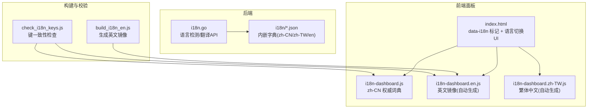
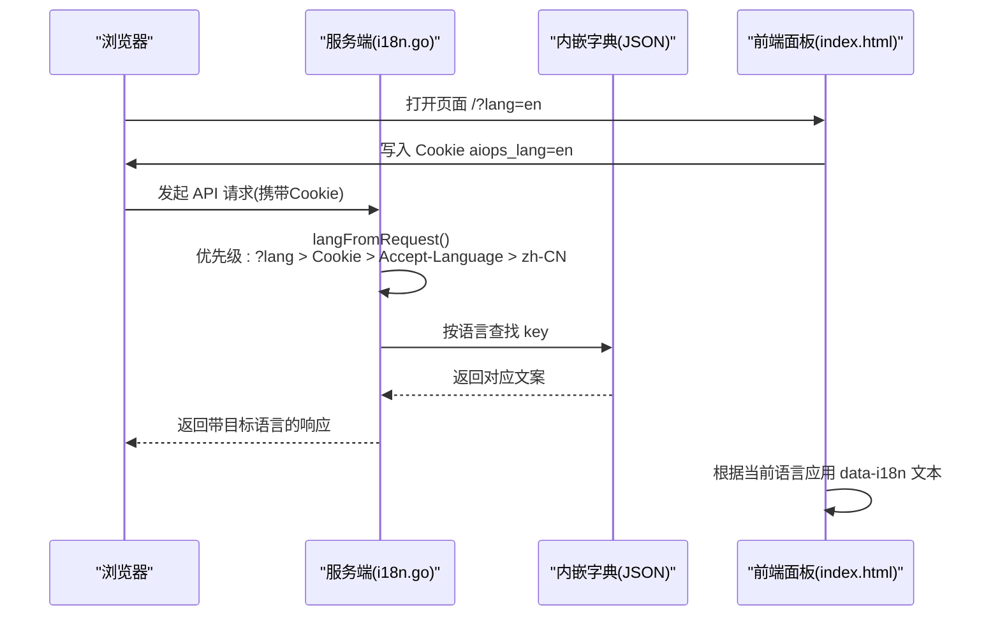
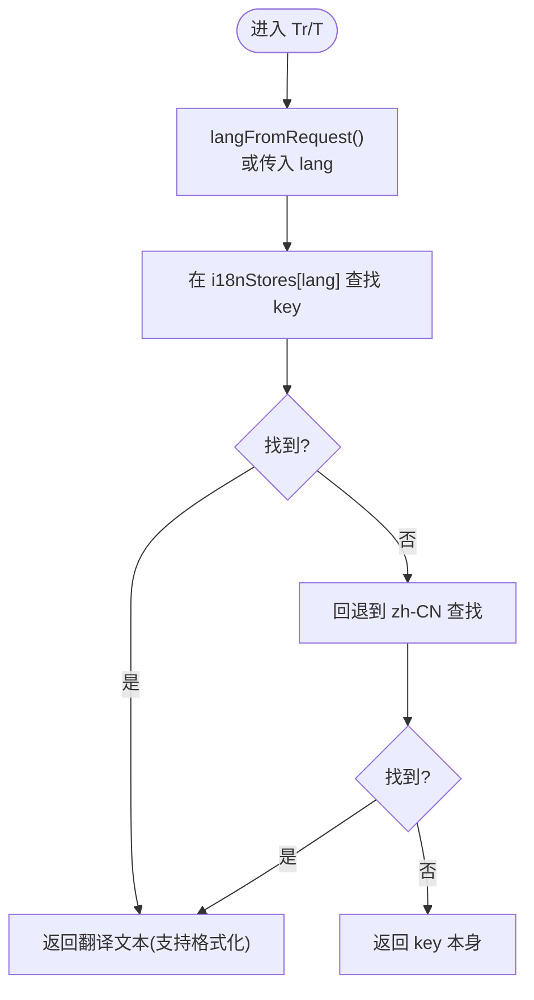
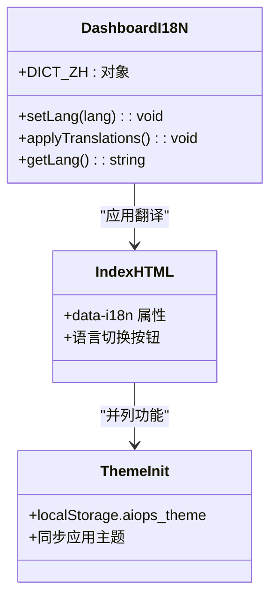
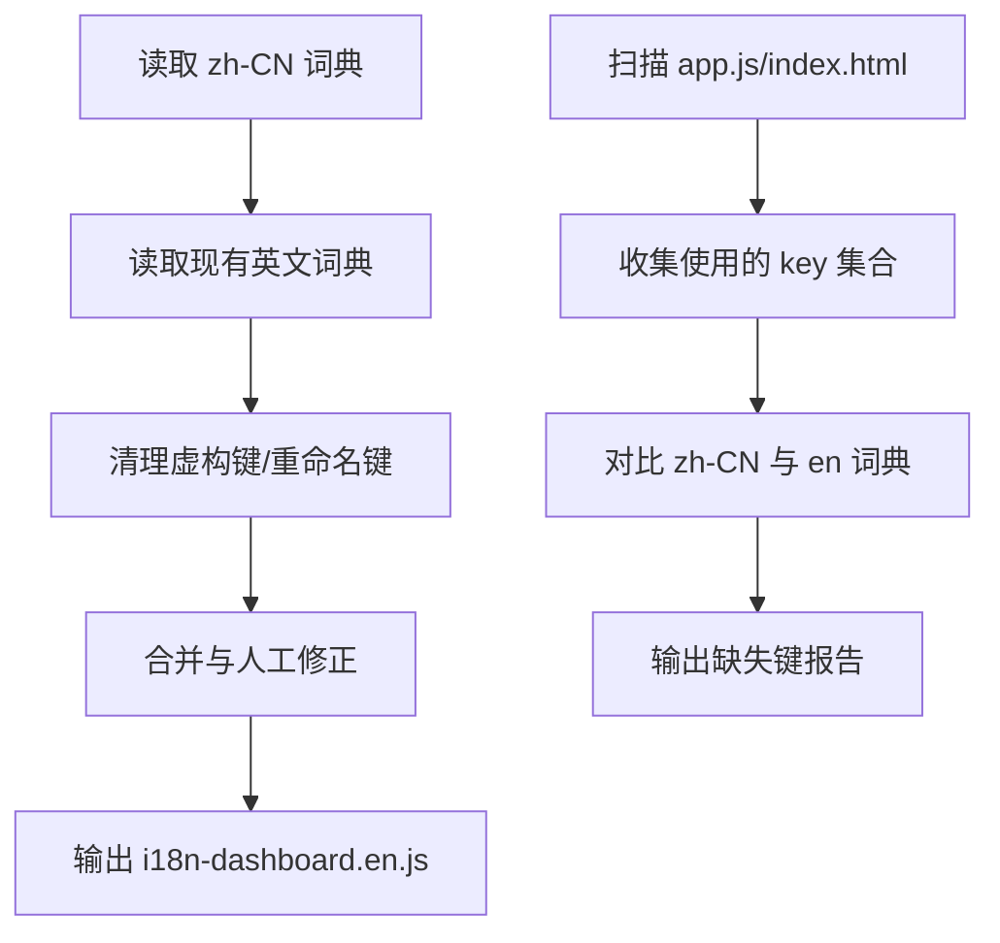
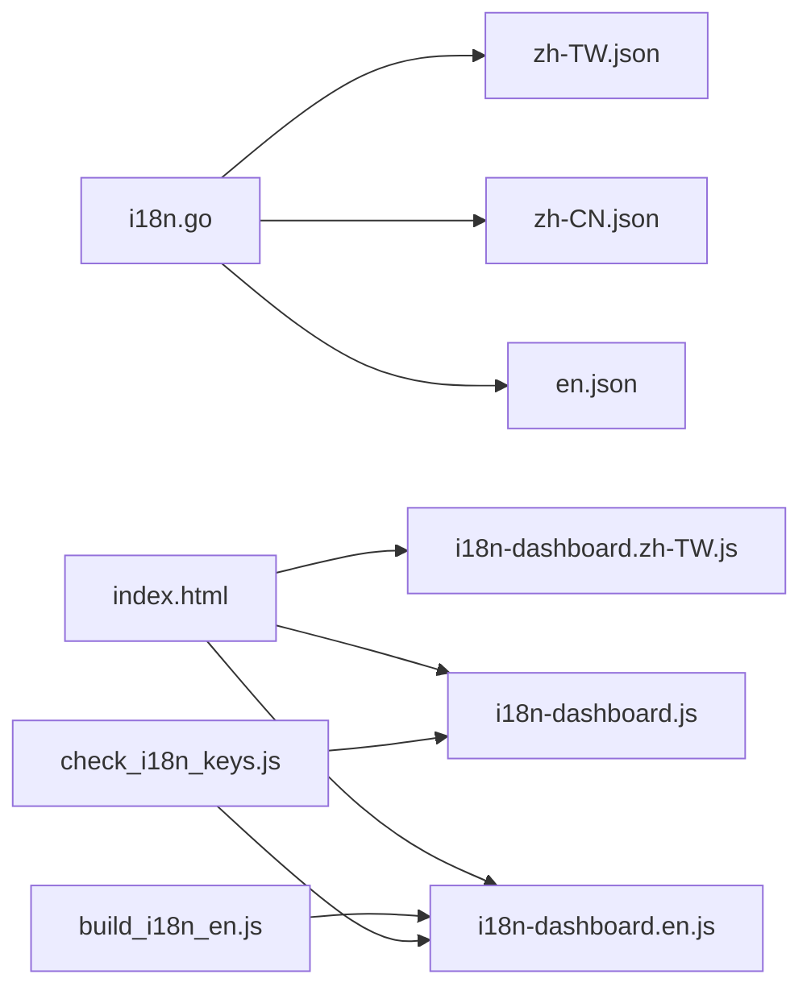

# 国际化支持

<cite>
**本文引用的文件**
- [i18n.go](file://cmd/server/i18n.go)
- [en.json](file://cmd/server/i18n/en.json)
- [zh-CN.json](file://cmd/server/i18n/zh-CN.json)
- [i18n-dashboard.js](file://cmd/server/web/i18n-dashboard.js)
- [i18n-dashboard.en.js](file://cmd/server/web/i18n-dashboard.en.js)
- [i18n-dashboard.zh-TW.js](file://cmd/server/web/i18n-dashboard.zh-TW.js)
- [index.html](file://cmd/server/web/index.html)
- [build_i18n_en.js](file://scripts/build_i18n_en.js)
- [check_i18n_keys.js](file://scripts/check_i18n_keys.js)
</cite>

## 目录
1. [简介](#简介)
2. [项目结构](#项目结构)
3. [核心组件](#核心组件)
4. [架构总览](#架构总览)
5. [详细组件分析](#详细组件分析)
6. [依赖关系分析](#依赖关系分析)
7. [性能与可扩展性](#性能与可扩展性)
8. [故障排查指南](#故障排查指南)
9. [结论](#结论)
10. [附录](#附录)

## 简介
本仓库实现了服务端与前端管理面板的国际化（i18n）能力。后端通过内嵌 JSON 字典提供多语言文本，并基于请求上下文自动选择语言；前端面板以中文为权威词典，辅以英文与繁体中文生成脚本与校验工具，确保键一致性与可维护性。整体方案覆盖 API 错误、表单提示、通知模板、操作日志等用户可见文本，并通过 Cookie 与 URL 参数实现前后端语言统一。

## 项目结构
- 后端 i18n 机制位于 cmd/server/i18n.go，使用 Go embed 将 i18n/*.json 打包进二进制，启动时加载到内存映射中。
- 前端面板 i18n 集中在 cmd/server/web 下：
  - i18n-dashboard.js 作为 zh-CN 权威词典
  - i18n-dashboard.en.js 由构建脚本从 zh-CN 合并生成
  - i18n-dashboard.zh-TW.js 由 OpenCC 转换生成
  - index.html 包含语言切换 UI 与 data-i18n 标记
- 构建与校验脚本位于 scripts 目录，负责英文镜像生成与键一致性检查。

图表来源
- [i18n.go:1-157](file://cmd/server/i18n.go#L1-L157)
- [en.json:1-412](file://cmd/server/i18n/en.json#L1-L412)
- [zh-CN.json:1-417](file://cmd/server/i18n/zh-CN.json#L1-L417)
- [i18n-dashboard.js:1-1043](file://cmd/server/web/i18n-dashboard.js#L1-L1043)
- [i18n-dashboard.en.js:1-800](file://cmd/server/web/i18n-dashboard.en.js#L1-L800)
- [i18n-dashboard.zh-TW.js:1-800](file://cmd/server/web/i18n-dashboard.zh-TW.js#L1-L800)
- [index.html:1-200](file://cmd/server/web/index.html#L1-L200)
- [build_i18n_en.js:1-114](file://scripts/build_i18n_en.js#L1-L114)
- [check_i18n_keys.js:1-41](file://scripts/check_i18n_keys.js#L1-L41)

章节来源
- [i18n.go:1-157](file://cmd/server/i18n.go#L1-L157)
- [i18n-dashboard.js:1-1043](file://cmd/server/web/i18n-dashboard.js#L1-L1043)
- [index.html:1-200](file://cmd/server/web/index.html#L1-L200)
- [build_i18n_en.js:1-114](file://scripts/build_i18n_en.js#L1-L114)
- [check_i18n_keys.js:1-41](file://scripts/check_i18n_keys.js#L1-L41)

## 核心组件
- 后端语言检测与翻译
  - 支持语言优先级：URL 查询参数 ?lang= > Cookie aiops_lang > Accept-Language > 默认 zh-CN
  - 提供 T(lang,key,args)、Tr(r,key,args)、Tz(key,args) 三个接口用于不同上下文的翻译
  - 字典文件通过 //go:embed 内嵌，启动时解析为 map[string]string 缓存
- 前端面板词典与渲染
  - zh-CN 权威词典在 i18n-dashboard.js 中定义
  - 英文与繁体中文由脚本生成，保证键齐平
  - HTML 使用 data-i18n 属性标记待翻译元素，JS 运行时应用翻译
- 构建与校验
  - build_i18n_en.js 从 zh-CN 权威词典合并生成英文镜像，保留人工修正项
  - check_i18n_keys.js 扫描 app.js 与 index.html 中的 I18N.t() 与 data-i18n* 用法，校验缺失键

章节来源
- [i18n.go:26-91](file://cmd/server/i18n.go#L26-L91)
- [i18n.go:93-134](file://cmd/server/i18n.go#L93-L134)
- [i18n-dashboard.js:1-1043](file://cmd/server/web/i18n-dashboard.js#L1-L1043)
- [i18n-dashboard.en.js:1-800](file://cmd/server/web/i18n-dashboard.en.js#L1-L800)
- [i18n-dashboard.zh-TW.js:1-800](file://cmd/server/web/i18n-dashboard.zh-TW.js#L1-L800)
- [build_i18n_en.js:1-114](file://scripts/build_i18n_en.js#L1-L114)
- [check_i18n_keys.js:1-41](file://scripts/check_i18n_keys.js#L1-L41)

## 架构总览
后端与前端通过统一的语言标识与 Cookie 协同工作：前端设置 Cookie aiops_lang，后端读取该 Cookie 并在响应中使用对应语言返回消息，从而实现前后端语言一致。

图表来源
- [i18n.go:68-91](file://cmd/server/i18n.go#L68-L91)
- [i18n.go:93-134](file://cmd/server/i18n.go#L93-L134)
- [index.html:141-145](file://cmd/server/web/index.html#L141-L145)

## 详细组件分析

### 后端 i18n 模块
- 初始化与存储
  - 启动时遍历 supportedLangs，读取 i18nFS 中的 JSON 文件，解析为 map[string]string 存入 i18nStores
- 语言规范化与探测
  - normalizeLang 将多种变体归一化为 zh-CN、zh-TW、en
  - parseAcceptLanguage 解析 Accept-Language 头，忽略质量值
  - langFromRequest 按优先级确定最终语言
- 翻译函数
  - T(lang, key, args...) 精确匹配语言，回退至 zh-CN，最后返回 key 本身
  - Tr(r, key, args...) 基于请求上下文调用 T
  - Tz(key, args...) 固定使用默认语言，适用于无请求上下文场景
- 日志类型翻译
  - TranslateLogKind 将内部枚举转换为显示文本

图表来源
- [i18n.go:26-37](file://cmd/server/i18n.go#L26-L37)
- [i18n.go:39-91](file://cmd/server/i18n.go#L39-L91)
- [i18n.go:93-134](file://cmd/server/i18n.go#L93-L134)

章节来源
- [i18n.go:1-157](file://cmd/server/i18n.go#L1-L157)

### 前端面板 i18n
- 词典组织
  - zh-CN 权威词典在 i18n-dashboard.js 中集中定义
  - 英文与繁体中文由脚本生成，保持键齐平
- 渲染机制
  - index.html 使用 data-i18n 与 data-i18n-title 等属性标记需要翻译的元素
  - 语言切换按钮设置 Cookie aiops_lang，并触发重渲染或刷新
- 主题与语言联动
  - theme-init.js 预置主题避免首屏闪烁，与语言切换并列展示

图表来源
- [i18n-dashboard.js:1-1043](file://cmd/server/web/i18n-dashboard.js#L1-L1043)
- [index.html:141-200](file://cmd/server/web/index.html#L141-L200)
- [theme-init.js:1-12](file://cmd/server/web/theme-init.js#L1-L12)

章节来源
- [i18n-dashboard.js:1-1043](file://cmd/server/web/i18n-dashboard.js#L1-L1043)
- [index.html:1-200](file://cmd/server/web/index.html#L1-L200)
- [i18n-dashboard.en.js:1-800](file://cmd/server/web/i18n-dashboard.en.js#L1-L800)
- [i18n-dashboard.zh-TW.js:1-800](file://cmd/server/web/i18n-dashboard.zh-TW.js#L1-L800)

### 构建与校验脚本
- 英文镜像生成
  - build_i18n_en.js 从 zh-CN 权威词典提取键集合，合并现有英文翻译，处理人工修正项与废弃键，输出 i18n-dashboard.en.js
- 键一致性检查
  - check_i18n_keys.js 扫描前端代码中的 I18N.t("k") 与 data-i18n*="k" 用法，对比 zh-CN 与 en 词典，报告缺失键

图表来源
- [build_i18n_en.js:1-114](file://scripts/build_i18n_en.js#L1-L114)
- [check_i18n_keys.js:1-41](file://scripts/check_i18n_keys.js#L1-L41)

章节来源
- [build_i18n_en.js:1-114](file://scripts/build_i18n_en.js#L1-L114)
- [check_i18n_keys.js:1-41](file://scripts/check_i18n_keys.js#L1-L41)

## 依赖关系分析
- 后端依赖
  - i18n.go 依赖内嵌文件系统 i18nFS 与 JSON 字典文件
  - 各业务模块通过 Tr/T/Tz 调用翻译，形成松耦合
- 前端依赖
  - index.html 依赖 i18n-dashboard.* 词典与 JS 逻辑
  - 构建脚本依赖 Node.js 环境，对 zh-CN 权威词典进行解析与生成
- 外部依赖
  - 无额外第三方库，纯标准库与脚本实现

图表来源
- [i18n.go:1-157](file://cmd/server/i18n.go#L1-L157)
- [en.json:1-412](file://cmd/server/i18n/en.json#L1-L412)
- [zh-CN.json:1-417](file://cmd/server/i18n/zh-CN.json#L1-L417)
- [i18n-dashboard.js:1-1043](file://cmd/server/web/i18n-dashboard.js#L1-L1043)
- [i18n-dashboard.en.js:1-800](file://cmd/server/web/i18n-dashboard.en.js#L1-L800)
- [i18n-dashboard.zh-TW.js:1-800](file://cmd/server/web/i18n-dashboard.zh-TW.js#L1-L800)
- [build_i18n_en.js:1-114](file://scripts/build_i18n_en.js#L1-L114)
- [check_i18n_keys.js:1-41](file://scripts/check_i18n_keys.js#L1-L41)

章节来源
- [i18n.go:1-157](file://cmd/server/i18n.go#L1-L157)
- [i18n-dashboard.js:1-1043](file://cmd/server/web/i18n-dashboard.js#L1-L1043)
- [build_i18n_en.js:1-114](file://scripts/build_i18n_en.js#L1-L114)
- [check_i18n_keys.js:1-41](file://scripts/check_i18n_keys.js#L1-L41)

## 性能与可扩展性
- 性能特性
  - 后端字典全量加载到内存，O(1) 查找，适合高并发
  - 前端词典体积较大，建议按需加载或分片，但当前单页应用已足够高效
- 可扩展性
  - 新增语言：在后端 supportedLangs 中添加，补充 i18n/*.json；在前端增加对应词典文件或生成脚本
  - 新增 key：在 zh-CN 权威词典添加，运行构建脚本生成英文镜像，运行校验脚本确保一致性

## 故障排查指南
- 语言未生效
  - 检查 URL ?lang= 参数是否正确
  - 确认 Cookie aiops_lang 是否被正确写入且未被浏览器策略阻止
  - 验证 Accept-Language 头是否符合预期
- 翻译缺失
  - 运行 check_i18n_keys.js 查看缺失键列表
  - 在 zh-CN 权威词典补全后，重新生成英文镜像
- 构建失败
  - 确认 Node.js 环境可用
  - 检查 zh-CN 词典语法与括号平衡

章节来源
- [i18n.go:68-91](file://cmd/server/i18n.go#L68-L91)
- [check_i18n_keys.js:1-41](file://scripts/check_i18n_keys.js#L1-L41)
- [build_i18n_en.js:1-114](file://scripts/build_i18n_en.js#L1-L114)

## 结论
本项目实现了完善的后端与前端国际化能力。后端通过内嵌 JSON 字典与灵活的请求上下文检测，提供稳定高效的翻译服务；前端以 zh-CN 为权威词典，配合构建与校验脚本保障多语言一致性与可维护性。整体方案简洁可靠，易于扩展新语言与新 key。

## 附录
- 语言支持列表：zh-CN、zh-TW、en
- 默认语言：zh-CN
- 关键 Cookie：aiops_lang
- 关键 URL 参数：?lang=