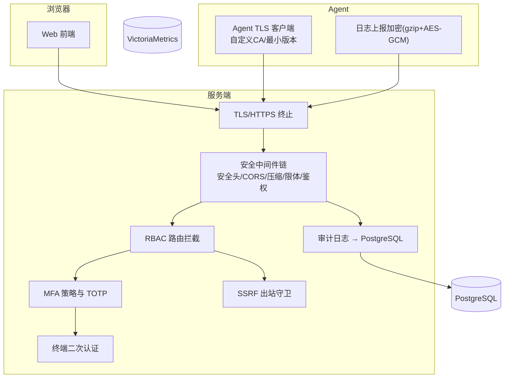
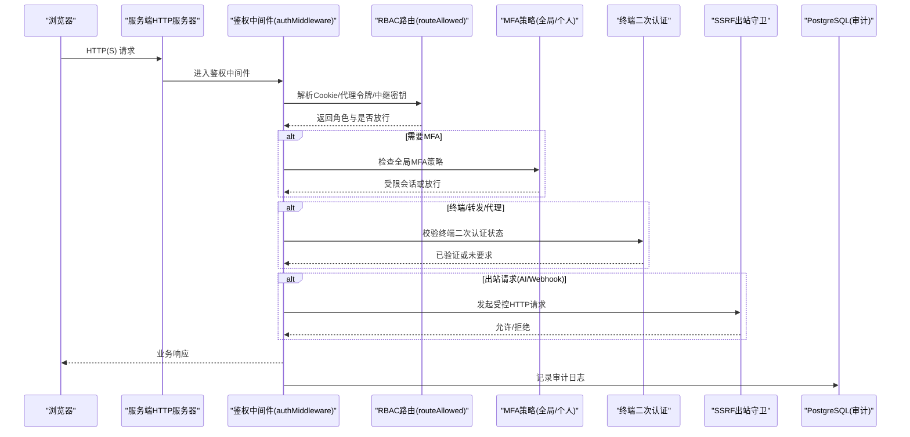
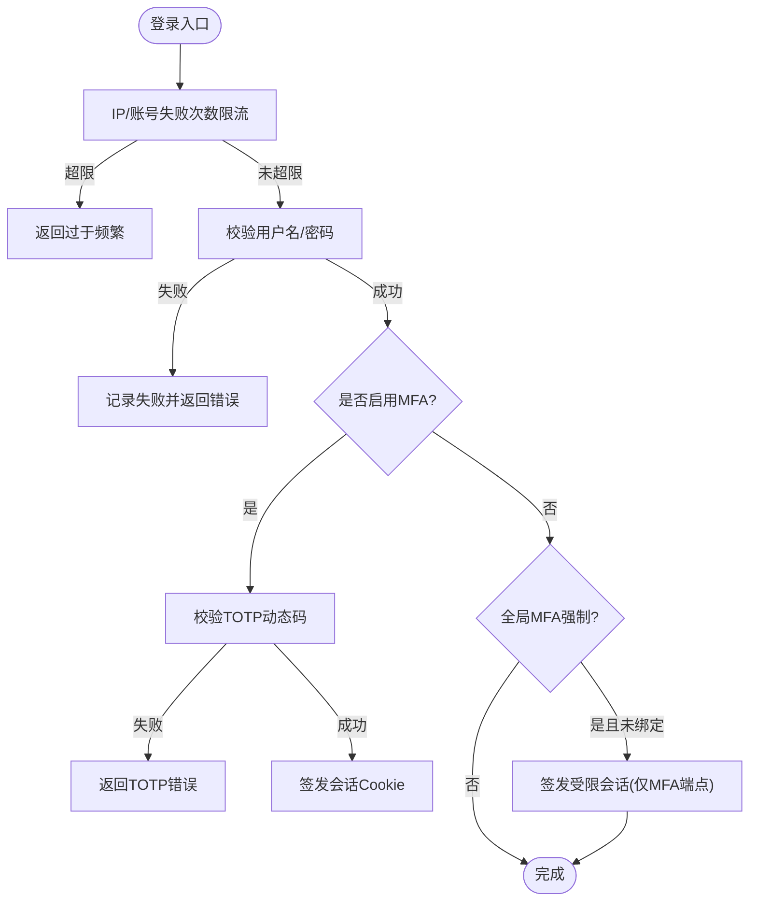
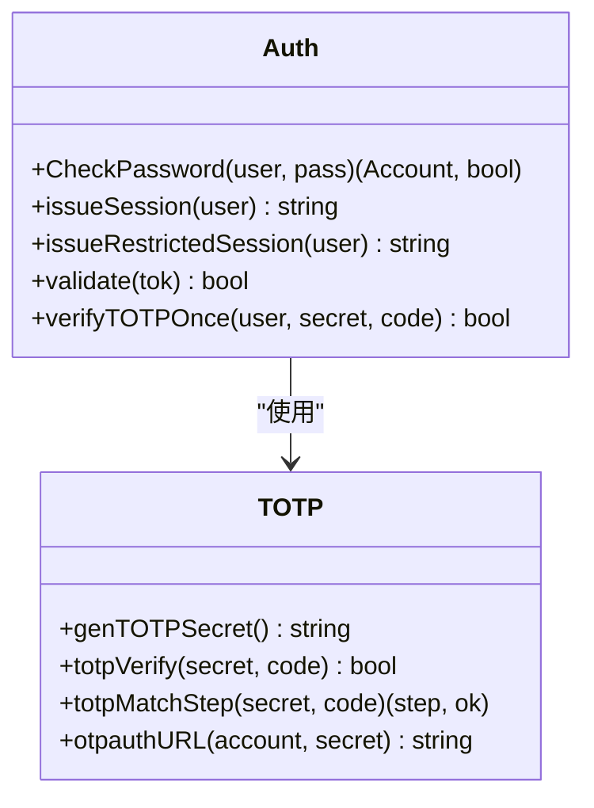
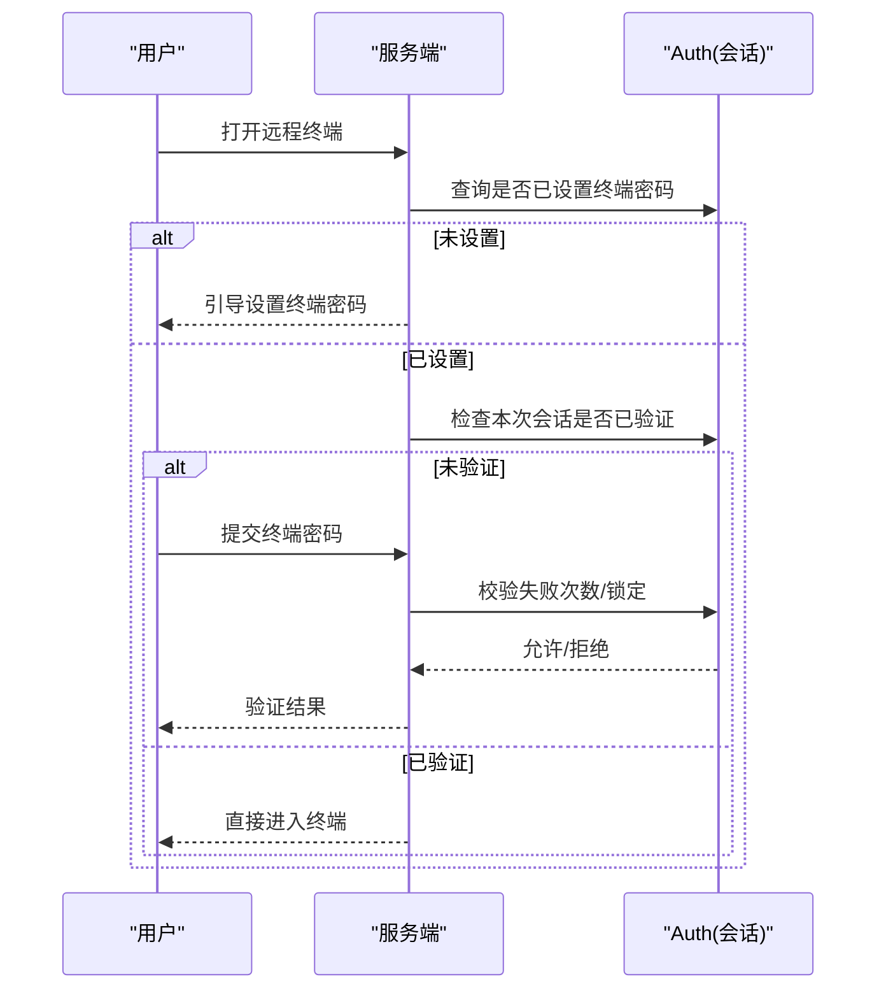
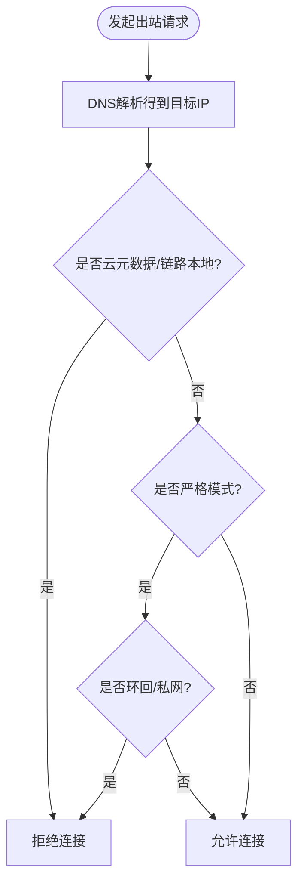
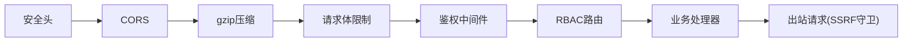

# 安全配置

<cite>
**本文引用的文件**   
- [README.md](file://README.md)
- [cmd/server/main.go](file://cmd/server/main.go)
- [cmd/server/auth.go](file://cmd/server/auth.go)
- [cmd/server/auth_core.go](file://cmd/server/auth_core.go)
- [cmd/server/totp.go](file://cmd/server/totp.go)
- [cmd/server/terminal_auth.go](file://cmd/server/terminal_auth.go)
- [cmd/server/config.go](file://cmd/server/config.go)
- [cmd/server/safedial.go](file://cmd/server/safedial.go)
- [cmd/server/notify.go](file://cmd/server/notify.go)
- [cmd/server/pgstore.go](file://cmd/server/pgstore.go)
- [cmd/agent/tls.go](file://cmd/agent/tls.go)
- [cmd/agent/main.go](file://cmd/agent/main.go)
- [server_config.example.json](file://server_config.example.json)
- [config.example.json](file://config.example.json)
</cite>

## 目录
1. [简介](#简介)
2. [项目结构](#项目结构)
3. [核心组件](#核心组件)
4. [架构总览](#架构总览)
5. [详细组件分析](#详细组件分析)
6. [依赖关系分析](#依赖关系分析)
7. [性能与安全权衡](#性能与安全权衡)
8. [故障排查指南](#故障排查指南)
9. [结论](#结论)
10. [附录：生产环境加固清单](#附录生产环境加固清单)

## 简介
本文件面向生产环境，系统化梳理 AIOps Monitor 的安全能力与配置方法，覆盖认证授权、TLS/HTTPS、CORS、CSRF防护、SSRF防护、RBAC角色权限模型、MFA两步验证、会话安全、Agent侧加密传输与出站守卫等。同时给出审计日志、漏洞扫描与安全合规检查的落地建议，并提供生产环境网络与访问控制的最佳实践示例。

## 项目结构
本项目服务端与 Agent 均提供完善的安全机制：
- 服务端：统一鉴权中间件、RBAC路由拦截、MFA策略、终端二次认证、CORS白名单、安全响应头、SSRF出站守卫、可选TLS终止、审计日志持久化到PostgreSQL。
- Agent：支持自定义CA信任与跳过校验（仅实验室）、强制最小TLS版本、所有出站HTTP客户端统一注入TLS配置；日志上报可开启gzip+AES-256-GCM加密。

图表来源
- [cmd/server/main.go:72-136](file://cmd/server/main.go#L72-L136)
- [cmd/server/auth.go:112-172](file://cmd/server/auth.go#L112-L172)
- [cmd/server/config.go:772-800](file://cmd/server/config.go#L772-L800)
- [cmd/server/safedial.go:14-95](file://cmd/server/safedial.go#L14-L95)
- [cmd/agent/tls.go:13-73](file://cmd/agent/tls.go#L13-L73)
- [cmd/server/pgstore.go:314-353](file://cmd/server/pgstore.go#L314-L353)

章节来源
- [cmd/server/main.go:227-355](file://cmd/server/main.go#L227-L355)
- [cmd/server/auth.go:112-172](file://cmd/server/auth.go#L112-L172)
- [cmd/server/config.go:772-800](file://cmd/server/config.go#L772-L800)
- [cmd/server/safedial.go:14-95](file://cmd/server/safedial.go#L14-L95)
- [cmd/agent/tls.go:13-73](file://cmd/agent/tls.go#L13-L73)
- [cmd/server/pgstore.go:314-353](file://cmd/server/pgstore.go#L314-L353)

## 核心组件
- 认证与会话
  - 登录流程：用户名/密码 + 可选TOTP；失败计数按IP与账号双维度限流；成功签发HttpOnly/SameSite/Lax Cookie，HTTPS下自动Secure。
  - 会话管理：绝对过期+滑动空闲超时；支持受限会话（强制MFA绑定）；改密时清除用户全部会话。
- 多用户与RBAC
  - 三角色：admin/operator/viewer；路由级拦截，读接口viewer+，写接口operator+，终端/转发/代理需operator+，用户管理与全局MFA策略仅admin。
- MFA两步验证
  - TOTP（RFC 6238），扫码绑定；支持全局强制策略；登录成功后若未启用且全局强制则下发受限会话，仅允许MFA相关端点。
- 终端二次认证
  - 协议同意 + 独立“终端访问密码”；首次访问需验证，失败次数限制并短时锁定；会话内一次通过。
- CORS与CSRF防护
  - CORS支持白名单模式（默认兼容*）；安全响应头包含nosniff/DENY/no-referrer与严格CSP（排除代理路径）。
- SSRF出站防护
  - 针对AI/Webhook等用户可控URL，使用Dialer.Control在真实连接前校验目标IP；默认拒绝云元数据与链路本地地址；严格模式额外拒绝环回与私网。
- TLS/HTTPS
  - 服务端可选TLS终止；Agent侧支持自定义CA与最小TLS版本；日志上报可开启加密。
- 审计日志
  - 登录、MFA、终端操作、配置变更等写入审计表；终端录制索引落库，内容本地持久化。

章节来源
- [cmd/server/auth.go:176-307](file://cmd/server/auth.go#L176-L307)
- [cmd/server/auth_core.go:178-432](file://cmd/server/auth_core.go#L178-L432)
- [cmd/server/users.go:1-41](file://cmd/server/users.go#L1-L41)
- [cmd/server/terminal_auth.go:1-172](file://cmd/server/terminal_auth.go#L1-L172)
- [cmd/server/main.go:72-136](file://cmd/server/main.go#L72-L136)
- [cmd/server/safedial.go:14-95](file://cmd/server/safedial.go#L14-L95)
- [cmd/server/pgstore.go:314-353](file://cmd/server/pgstore.go#L314-L353)

## 架构总览
下图展示从浏览器到服务端的请求处理链与安全控制点，以及Agent侧出站与日志上报的安全路径。

图表来源
- [cmd/server/main.go:294-303](file://cmd/server/main.go#L294-L303)
- [cmd/server/auth.go:112-172](file://cmd/server/auth.go#L112-L172)
- [cmd/server/terminal_auth.go:124-172](file://cmd/server/terminal_auth.go#L124-L172)
- [cmd/server/safedial.go:80-95](file://cmd/server/safedial.go#L80-L95)
- [cmd/server/pgstore.go:314-353](file://cmd/server/pgstore.go#L314-L353)

## 详细组件分析

### 认证与授权（登录、会话、RBAC）
- 登录流程
  - 支持用户名/手机号登录；失败计数按IP与账号分别限流；成功后签发会话Cookie。
  - 若账户启用MFA，需在登录时提交TOTP动态码；否则提示mfa_required。
  - 全局MFA策略开启且用户未绑定时，下发受限会话，仅允许MFA设置/启用/登出。
- 会话安全
  - HttpOnly + SameSite=Lax；HTTPS下自动Secure；绝对过期与滑动空闲超时双重保护；改密后清除该用户全部会话。
- RBAC
  - 三角色：admin/operator/viewer；路由级拦截，读接口viewer+，写接口operator+，终端/转发/代理需operator+，用户管理与全局MFA策略仅admin。

图表来源
- [cmd/server/auth.go:176-307](file://cmd/server/auth.go#L176-L307)
- [cmd/server/auth_core.go:178-432](file://cmd/server/auth_core.go#L178-L432)
- [cmd/server/users.go:1-41](file://cmd/server/users.go#L1-L41)

章节来源
- [cmd/server/auth.go:176-307](file://cmd/server/auth.go#L176-L307)
- [cmd/server/auth_core.go:178-432](file://cmd/server/auth_core.go#L178-L432)
- [cmd/server/users.go:1-41](file://cmd/server/users.go#L1-L41)

### MFA两步验证（TOTP）
- 生成随机Base32密钥与otpauth链接，支持二维码导入；校验容忍±1步时钟偏差；支持单步防重放。
- 支持全局强制策略：管理员可开启后，未绑定用户仅能访问MFA相关端点。

图表来源
- [cmd/server/auth_core.go:262-285](file://cmd/server/auth_core.go#L262-L285)
- [cmd/server/totp.go:16-109](file://cmd/server/totp.go#L16-L109)

章节来源
- [cmd/server/totp.go:16-109](file://cmd/server/totp.go#L16-L109)
- [cmd/server/auth_core.go:262-285](file://cmd/server/auth_core.go#L262-L285)

### 终端二次认证
- 首次访问终端前需同意协议并设置独立的“终端访问密码”，每次登录后首次访问需再次验证；失败次数限制并短时锁定；会话内一次通过。

图表来源
- [cmd/server/terminal_auth.go:50-172](file://cmd/server/terminal_auth.go#L50-L172)
- [cmd/server/auth_core.go:515-586](file://cmd/server/auth_core.go#L515-L586)

章节来源
- [cmd/server/terminal_auth.go:50-172](file://cmd/server/terminal_auth.go#L50-L172)
- [cmd/server/auth_core.go:515-586](file://cmd/server/auth_core.go#L515-L586)

### CORS与CSRF防护
- CORS：支持白名单模式；未配置时兼容旧行为返回*；OPTIONS预检直接返回204。
- CSRF防护：通过SameSite=Lax、严格CSP（script-src 'self'等）、X-Frame-Options DENY、X-Content-Type-Options nosniff、Referrer-Policy no-referrer组合降低跨站风险。

章节来源
- [cmd/server/main.go:72-136](file://cmd/server/main.go#L72-L136)

### SSRF出站防护
- 适用场景：AI端点、通知Webhook等用户可影响URL的出站请求。
- 实现方式：Dialer.Control钩子在DNS解析后、connect前对实际IP校验；默认拒绝云元数据与链路本地地址；严格模式额外拒绝环回与私网。

图表来源
- [cmd/server/safedial.go:14-95](file://cmd/server/safedial.go#L14-L95)

章节来源
- [cmd/server/safedial.go:14-95](file://cmd/server/safedial.go#L14-L95)
- [cmd/server/notify.go:1204-1215](file://cmd/server/notify.go#L1204-L1215)

### TLS/HTTPS与Agent侧加密
- 服务端：可通过环境变量配置证书与私钥以启用HTTPS；未配置则以HTTP运行并输出警告。
- Agent：支持自定义CA信任与最小TLS版本；可配置跳过校验（仅实验室）；所有HTTP客户端统一注入TLS配置；日志上报可开启gzip+AES-256-GCM加密。

章节来源
- [cmd/server/main.go:335-355](file://cmd/server/main.go#L335-L355)
- [cmd/agent/tls.go:13-73](file://cmd/agent/tls.go#L13-L73)
- [cmd/agent/main.go:122-125](file://cmd/agent/main.go#L122-L125)
- [README.md:869-885](file://README.md#L869-L885)

### 审计日志与合规
- 登录、MFA、终端操作、配置变更等均写入审计日志；终端录制索引持久化至PostgreSQL，便于审计回溯。
- 建议将审计日志接入SIEM/SOC平台，结合告警治理规则进行异常检测。

章节来源
- [cmd/server/pgstore.go:314-353](file://cmd/server/pgstore.go#L314-L353)

## 依赖关系分析
- 中间件链顺序：安全头 → CORS → gzip压缩 → 请求体限制 → 鉴权中间件 → 路由处理器。
- 鉴权中间件内部：中继密钥校验 → 公共路径放行 → 代理令牌校验 → 会话校验 → 全局MFA限制 → RBAC路由判定。
- 出站请求：AI/Webhook等通过受控HTTP客户端，内置SSRF守卫。

图表来源
- [cmd/server/main.go:294-303](file://cmd/server/main.go#L294-L303)
- [cmd/server/auth.go:112-172](file://cmd/server/auth.go#L112-L172)
- [cmd/server/safedial.go:80-95](file://cmd/server/safedial.go#L80-L95)

章节来源
- [cmd/server/main.go:294-303](file://cmd/server/main.go#L294-L303)
- [cmd/server/auth.go:112-172](file://cmd/server/auth.go#L112-L172)
- [cmd/server/safedial.go:80-95](file://cmd/server/safedial.go#L80-L95)

## 性能与安全权衡
- 压缩与流式：对非流式响应启用gzip以提升带宽效率；WebSocket/终端/转发/代理路径禁用缓冲以保证实时性。
- 会话空闲超时：滑动空闲超时与绝对过期共同作用，兼顾安全性与用户体验。
- 限流策略：IP与账号双维度限流，平衡抗暴力破解与可用性。

章节来源
- [cmd/server/main.go:186-205](file://cmd/server/main.go#L186-L205)
- [cmd/server/auth_core.go:137-150](file://cmd/server/auth_core.go#L137-L150)

## 故障排查指南
- 无法登录或频繁被限流
  - 检查IP与账号失败次数阈值；确认是否触发全局MFA策略导致受限会话。
- 终端无法访问
  - 确认是否已设置终端访问密码；查看会话是否已通过终端二次认证；检查失败次数与锁定时间。
- 出站请求被拒
  - 检查目标是否为云元数据/链路本地/私网地址；必要时调整严格模式开关。
- 证书问题
  - 服务端未配置TLS会输出警告；Agent自签CA需正确配置ca_cert路径，避免tls_skip_verify。

章节来源
- [cmd/server/auth.go:176-307](file://cmd/server/auth.go#L176-L307)
- [cmd/server/terminal_auth.go:124-172](file://cmd/server/terminal_auth.go#L124-L172)
- [cmd/server/safedial.go:45-78](file://cmd/server/safedial.go#L45-L78)
- [cmd/agent/tls.go:13-73](file://cmd/agent/tls.go#L13-L73)
- [cmd/server/main.go:335-355](file://cmd/server/main.go#L335-L355)

## 结论
AIOps Monitor在服务端与Agent侧提供了完整的安全基线：强密码策略、RBAC、MFA、终端二次认证、CORS与CSP、SSRF出站守卫、TLS/HTTPS与Agent侧加密、审计日志持久化。配合生产环境的网络隔离、反向代理与密钥管理，可满足企业级安全与合规需求。

## 附录：生产环境加固清单
- 认证与授权
  - 启用全局MFA策略；为关键账号启用TOTP；定期轮换安装Token并缩短宽限期。
  - 限制管理员账号数量，遵循最小权限原则。
- 传输安全
  - 启用服务端TLS（AIOPS_TLS_CERT/AIOPS_TLS_KEY）；Agent侧配置自定义CA，禁止在生产使用tls_skip_verify。
  - 日志上报开启gzip+AES-256-GCM加密。
- 网络安全
  - 反向代理终止TLS，仅暴露必要端口；关闭不必要的转发与终端功能（forward_disabled/terminal_disabled）。
  - 防火墙/安全组：仅开放8529（或代理映射端口）；转发端口范围限定并仅监听127.0.0.1或通过代理访问。
  - 访问控制列表：限制管理端IP段；对代理令牌与中继密钥进行严格管控。
- 存储与密钥
  - 配置AIOPS_SECRET_KEY启用静态加密；妥善保管PG与VM凭据；数据库最小权限与网络隔离。
- 审计与合规
  - 将审计日志接入SIEM；建立异常登录、MFA绕过尝试、终端越权访问等告警规则。
  - 定期进行漏洞扫描与渗透测试；关注第三方依赖与镜像安全。
- 运维与应急
  - 制定密钥泄露与账号接管应急预案；保留重置管理员密码的本地API通道（仅限本机）。

章节来源
- [cmd/server/config.go:616-651](file://cmd/server/config.go#L616-L651)
- [cmd/server/main.go:335-355](file://cmd/server/main.go#L335-L355)
- [cmd/agent/tls.go:13-73](file://cmd/agent/tls.go#L13-L73)
- [README.md:869-885](file://README.md#L869-L885)
- [server_config.example.json:1-36](file://server_config.example.json#L1-L36)
- [config.example.json:1-16](file://config.example.json#L1-L16)