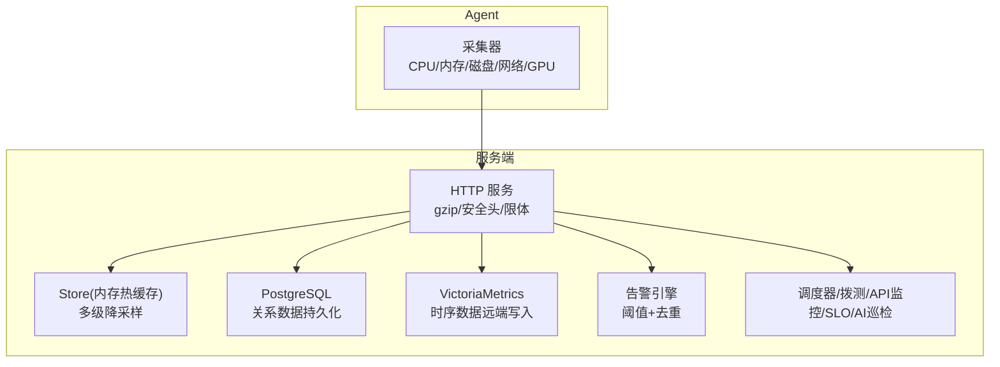
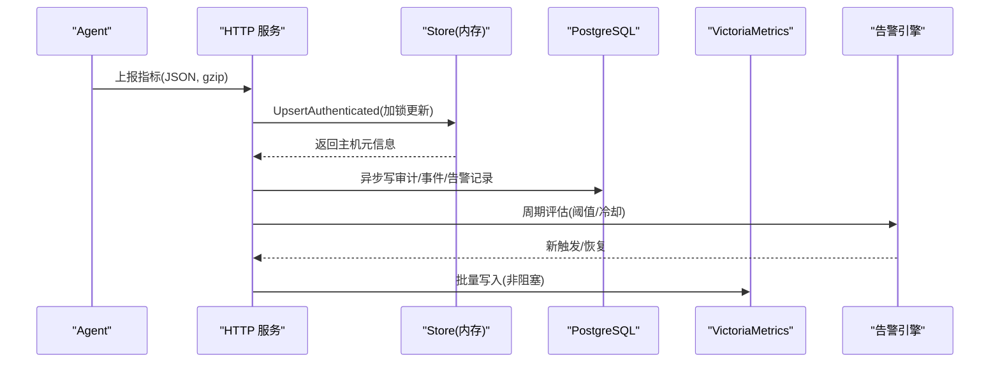
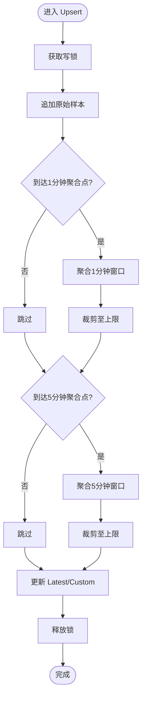
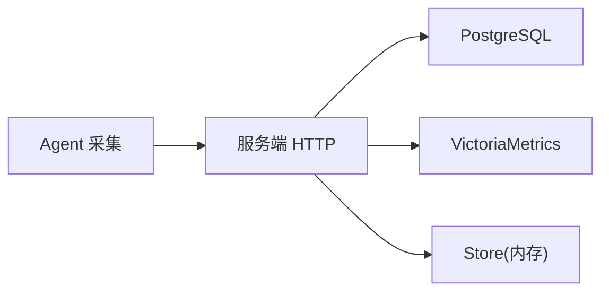

# 性能配置

<cite>
**本文引用的文件**   
- [cmd/server/main.go](file://cmd/server/main.go)
- [cmd/server/store.go](file://cmd/server/store.go)
- [cmd/server/db.go](file://cmd/server/db.go)
- [cmd/server/alerts.go](file://cmd/server/alerts.go)
- [cmd/server/vm.go](file://cmd/server/vm.go)
- [docker-compose.yml](file://docker-compose.yml)
- [config.example.json](file://config.example.json)
- [server_config.example.json](file://server_config.example.json)
- [README.md](file://README.md)
- [shared/wire.go](file://shared/wire.go)
- [cmd/agent/gpu.go](file://cmd/agent/gpu.go)
- [cmd/agent/collector_windows.go](file://cmd/agent/collector_windows.go)
- [cmd/server/web/js/settings.js](file://cmd/server/web/js/settings.js)
</cite>

## 目录
1. [简介](#简介)
2. [项目结构](#项目结构)
3. [核心组件](#核心组件)
4. [架构总览](#架构总览)
5. [详细组件分析](#详细组件分析)
6. [依赖关系分析](#依赖关系分析)
7. [性能考虑与调优](#性能考虑与调优)
8. [故障排查指南](#故障排查指南)
9. [结论](#结论)
10. [附录](#附录)

## 简介
本文件聚焦于 AIOps Monitor 的性能相关配置与优化，覆盖数据库连接、内存分配、并发控制、缓存策略、GC 与 I/O 等关键维度，并结合不同负载场景（高并发监控、大数据量存储、实时告警处理）给出可操作的调优建议。同时提供基准测试方法与监控指标解读，以及内存泄漏检测、CPU 瓶颈分析与 I/O 优化的诊断路径。

## 项目结构
系统由服务端与 Agent 组成：
- 服务端负责 HTTP API、告警评估、SLO 评估、定时任务、AI 巡检、VictoriaMetrics 写入、PostgreSQL 持久化等。
- Agent 负责采集主机指标（含 GPU），并上报到服务端。

图表来源
- [cmd/server/main.go:227-355](file://cmd/server/main.go#L227-L355)
- [cmd/server/store.go:12-27](file://cmd/server/store.go#L12-L27)
- [cmd/server/vm.go:1-40](file://cmd/server/vm.go#L1-L40)
- [docker-compose.yml:57-93](file://docker-compose.yml#L57-L93)

章节来源
- [cmd/server/main.go:227-355](file://cmd/server/main.go#L227-L355)
- [docker-compose.yml:57-93](file://docker-compose.yml#L57-L93)

## 核心组件
- Store 内存热缓存：维护每台主机的三层历史（原始/1分钟聚合/5分钟聚合），并提供最近事件、活动日志、告警状态等。
- PostgreSQL 持久化：统一承载配置、用户、审计、事件、工单、会话等关系数据。
- VictoriaMetrics 远端写入：将指标/趋势以 Prometheus 文本格式批量推送，解耦长期存储与查询。
- 告警引擎：基于阈值与冷却期进行触发与恢复，支持静默/抑制/路由治理。
- 压缩与中间件：gzip 响应体复用池、安全头、请求体大小限制、CORS 等。

章节来源
- [cmd/server/store.go:92-175](file://cmd/server/store.go#L92-L175)
- [cmd/server/db.go:14-24](file://cmd/server/db.go#L14-L24)
- [cmd/server/vm.go:19-40](file://cmd/server/vm.go#L19-L40)
- [cmd/server/alerts.go:10-34](file://cmd/server/alerts.go#L10-L34)
- [cmd/server/main.go:147-205](file://cmd/server/main.go#L147-L205)

## 架构总览
下图展示从 Agent 上报到服务端落盘与远端时序库的关键路径，以及可选的 VM 写入流程。

图表来源
- [cmd/server/main.go:286-292](file://cmd/server/main.go#L286-L292)
- [cmd/server/store.go:230-340](file://cmd/server/store.go#L230-L340)
- [cmd/server/vm.go:19-40](file://cmd/server/vm.go#L19-L40)
- [cmd/server/alerts.go:210-346](file://cmd/server/alerts.go#L210-L346)

## 详细组件分析

### 存储与内存模型（Store + DB + PG + VM）
- 三层历史容量与间隔：
  - 原始样本上限约 1200（约 1.5 小时，5 秒级）
  - 1 分钟聚合上限约 2880（48 小时）
  - 5 分钟聚合上限约 8640（30 天）
- 每主机内存占用约 1-2 MB，3000 台约需 4-7 GB；可通过调整保留常量降低内存。
- 自动快照持久化（aiops.db）已停用，统一使用 PG 与 VM。
- PG 启动时带有限重试，避免冷启动竞争导致失败。
- VM 写入为“fire-and-forget”批处理，不阻塞上报链路。

图表来源
- [cmd/server/store.go:271-300](file://cmd/server/store.go#L271-L300)
- [cmd/server/store.go:355-573](file://cmd/server/store.go#L355-L573)

章节来源
- [cmd/server/store.go:12-27](file://cmd/server/store.go#L12-L27)
- [cmd/server/store.go:230-340](file://cmd/server/store.go#L230-L340)
- [cmd/server/db.go:151-179](file://cmd/server/db.go#L151-L179)
- [cmd/server/main.go:255-272](file://cmd/server/main.go#L255-L272)
- [cmd/server/vm.go:19-40](file://cmd/server/vm.go#L19-L40)
- [README.md:1108-1117](file://README.md#L1108-L1117)

### 并发与锁粒度
- 热路径 Upsert 使用单一写锁保护主机映射与历史切片，避免 TOCTOU 问题，减少双锁开销。
- 列表/读取接口使用读锁，尽量缩短临界区。
- 异步写 PG/VM 避免阻塞上报主循环。

章节来源
- [cmd/server/store.go:230-268](file://cmd/server/store.go#L230-L268)
- [cmd/server/store.go:575-648](file://cmd/server/store.go#L575-L648)
- [cmd/server/main.go:286-292](file://cmd/server/main.go#L286-L292)

### 压缩与网络 I/O
- gzip 响应体通过 sync.Pool 复用 Writer，显著降低 GC 压力与 CPU 消耗。
- 对 WebSocket/代理/转发流式路径禁用缓冲与压缩，保证低延迟。
- 请求体最大限制防止恶意大 JSON 耗尽内存。

章节来源
- [cmd/server/main.go:147-205](file://cmd/server/main.go#L147-L205)
- [cmd/server/main.go:104-145](file://cmd/server/main.go#L104-L145)

### 告警与阈值
- 阈值包含 CPU/内存/磁盘/IO/IOPS/GPU/负载/进程变化/离线判定/拨测/API/任务/转发等多维。
- 零值自动回退默认，避免误报。
- 面板支持动态修改阈值并即时生效。

章节来源
- [cmd/server/alerts.go:10-34](file://cmd/server/alerts.go#L10-L34)
- [cmd/server/alerts.go:210-346](file://cmd/server/alerts.go#L210-L346)
- [cmd/server/web/js/settings.js:140-159](file://cmd/server/web/js/settings.js#L140-L159)
- [server_config.example.json:12-20](file://server_config.example.json#L12-L20)

### 外部依赖与启动约束
- 强制要求 PG 与 VM 环境变量配置，缺失则拒绝启动。
- PG 启动带有限重试，避免容器冷启动竞争。
- VM 地址用于远端时序写入，减轻本地内存压力。

章节来源
- [cmd/server/main.go:255-272](file://cmd/server/main.go#L255-L272)
- [docker-compose.yml:64-78](file://docker-compose.yml#L64-L78)

### Agent 侧性能要点
- GPU 采集 best-effort 且带缓存（约 12 秒），避免频繁 fork 子进程。
- Windows 平台 load average 通过 EWMA 近似计算，降低系统调用成本。

章节来源
- [cmd/agent/gpu.go:14-37](file://cmd/agent/gpu.go#L14-L37)
- [cmd/agent/collector_windows.go:192-207](file://cmd/agent/collector_windows.go#L192-L207)

## 依赖关系分析
- 服务端依赖：
  - PostgreSQL：关系型数据持久化（配置/用户/审计/事件/工单/会话）。
  - VictoriaMetrics：时序数据远端写入（指标/趋势/SLO）。
- Agent 依赖：
  - 操作系统原生接口或厂商工具（如 nvidia-smi），无第三方 Go 依赖。

图表来源
- [cmd/server/main.go:255-272](file://cmd/server/main.go#L255-L272)
- [cmd/server/vm.go:19-40](file://cmd/server/vm.go#L19-L40)
- [shared/wire.go:31-42](file://shared/wire.go#L31-L42)

章节来源
- [shared/wire.go:31-42](file://shared/wire.go#L31-L42)
- [cmd/server/main.go:255-272](file://cmd/server/main.go#L255-L272)

## 性能考虑与调优

### 影响性能的关键配置参数
- 上报与轮询间隔
  - Agent 基础指标上报间隔（秒）：增大可降低带宽与 CPU 压力。
  - 插件执行周期（秒）：按需放宽以减少 Python 子进程开销。
- 历史保留与降采样
  - 原始/1分钟/5分钟上限与聚合间隔：根据规模与内存预算调整。
- 存储后端
  - AIOPS_POSTGRES_DSN：确保 PG 连接串正确，必要时启用 sslmode=require 提升安全性（需证书）。
  - AIOPS_VM_URL：开启后卸载长期存储与查询压力。
- 传输与安全
  - AIOPS_TLS_CERT/AIOPS_TLS_KEY：生产环境启用 HTTPS/TLS。
  - 反向代理信任客户端 IP（trust_proxy）：配合限流策略。
- 转发与终端
  - forward_listen/forward_port_range：Docker 部署需设为 0.0.0.0 并映射端口范围。
  - terminal_disabled/forward_disabled：按需全局关闭以降低资源占用。
- 告警阈值
  - thresholds.*：按保守/标准/宽松三档预设快速起步，再微调。

章节来源
- [config.example.json:1-16](file://config.example.json#L1-16)
- [server_config.example.json:1-36](file://server_config.example.json#L1-L36)
- [cmd/server/main.go:255-272](file://cmd/server/main.go#L255-L272)
- [docker-compose.yml:64-93](file://docker-compose.yml#L64-L93)
- [cmd/server/alerts.go:10-34](file://cmd/server/alerts.go#L10-L34)
- [README.md:436-510](file://README.md#L436-L510)

### 不同负载场景下的优化建议
- 高并发监控（数千台规模）
  - 增大 Agent 上报间隔（如 10-15 秒），降低上行带宽与服务器写入压力。
  - 启用 VictoriaMetrics 远端写入，减轻本地内存与磁盘压力。
  - 适当降低历史保留上限（如 histRawMax/hist1mMax/hist5mMax）换取更低内存。
- 大数据量存储（长周期趋势）
  - 利用 5 分钟聚合层支撑 30 天趋势；如需更长周期，优先依赖 VM。
  - 定期归档与清理 PG 中的审计/事件环缓冲区，避免无限增长。
- 实时告警处理
  - 合理设置阈值与冷却期，避免告警风暴。
  - 启用静默/抑制/路由治理，减少无效通知。
  - 将耗时通知通道（短信/语音）异步化，避免阻塞评估主循环。

章节来源
- [cmd/server/store.go:12-27](file://cmd/server/store.go#L12-L27)
- [cmd/server/vm.go:19-40](file://cmd/server/vm.go#L19-L40)
- [cmd/server/alerts.go:210-346](file://cmd/server/alerts.go#L210-L346)
- [README.md:1108-1117](file://README.md#L1108-L1117)

### 基准测试方法
- 上报吞吐
  - 模拟 N 台 Agent 每 T 秒上报一次，观察服务端写入 QPS、P95 延迟与错误率。
  - 关注 Upsert 写锁持有时间与 PG 写入队列长度。
- 带宽与压缩
  - 对比开启/关闭 gzip 的 /hosts 轮询带宽，验证 8-10 倍压缩效果。
- 内存占用
  - 统计每主机内存占用，结合历史上限估算峰值内存，验证是否满足目标。
- 告警评估
  - 注入阈值越界数据，测量从触发到通知下发的端到端延迟。

章节来源
- [cmd/server/main.go:147-205](file://cmd/server/main.go#L147-L205)
- [cmd/server/store.go:230-340](file://cmd/server/store.go#L230-L340)
- [README.md:1108-1117](file://README.md#L1108-L1117)

### 监控指标解读
- 服务端
  - HTTP 请求 QPS、P95/P99 延迟、错误率、goroutine 数、GC 暂停时间。
  - PG 连接数、慢查询、事务等待；VM 写入成功率与延迟。
- Agent
  - 采集耗时、GPU 探测频率与缓存命中率、Python 插件执行时长。
- 业务
  - API 监控可用率、平均响应、P95、吞吐；拨测丢包率与延迟。

章节来源
- [cmd/server/main.go:286-292](file://cmd/server/main.go#L286-L292)
- [cmd/server/vm.go:19-40](file://cmd/server/vm.go#L19-L40)
- [cmd/agent/gpu.go:14-37](file://cmd/agent/gpu.go#L14-L37)

### GC 与内存管理建议
- 控制历史上限与轮询频率，避免热点对象过大。
- 复用 gzip.Writer 与避免在热路径创建大对象。
- 监控 GC 次数与停顿，必要时调整 GOGC 与环境变量。

章节来源
- [cmd/server/main.go:147-205](file://cmd/server/main.go#L147-L205)
- [cmd/server/store.go:12-27](file://cmd/server/store.go#L12-L27)

### I/O 优化
- 使用 VM 卸载时序数据，减少本地磁盘 I/O。
- 对 PG 写入采用异步与批量方式，避免阻塞上报。
- 合理设置 PG 连接池与超时，避免连接抖动。

章节来源
- [cmd/server/vm.go:19-40](file://cmd/server/vm.go#L19-L40)
- [cmd/server/main.go:255-272](file://cmd/server/main.go#L255-L272)

## 故障排查指南
- 无法启动
  - 检查 AIOPS_POSTGRES_DSN 与 AIOPS_VM_URL 是否配置。
  - 查看 PG 健康检查与重试日志。
- 内存持续增长
  - 核查历史上限是否过大；确认 VM 是否启用；定位是否存在未释放的大对象。
- 告警风暴
  - 调整阈值与冷却期；启用静默/抑制/路由；检查重复事件去重是否生效。
- 带宽过高
  - 确认 gzip 是否生效；适当增大上报间隔；检查是否有异常大量主机轮询。
- GPU 采集缓慢
  - 确认缓存命中；检查 nvidia-smi 或其他工具可用性。

章节来源
- [cmd/server/main.go:255-272](file://cmd/server/main.go#L255-L272)
- [cmd/server/store.go:230-340](file://cmd/server/store.go#L230-L340)
- [cmd/server/alerts.go:210-346](file://cmd/server/alerts.go#L210-L346)
- [cmd/server/main.go:147-205](file://cmd/server/main.go#L147-L205)
- [cmd/agent/gpu.go:14-37](file://cmd/agent/gpu.go#L14-L37)

## 结论
通过合理的上报间隔、历史保留策略、VM 远端写入、阈值治理与压缩优化，AIOps Monitor 可在单机稳定支撑数千台规模的监控需求。生产环境应启用 TLS、严格配置 PG/VM、并根据实际负载持续观测与调优。

## 附录
- 示例配置参考
  - Agent 配置：[config.example.json:1-16](file://config.example.json#L1-16)
  - 服务端配置：[server_config.example.json:1-36](file://server_config.example.json#L1-L36)
  - Docker Compose 示例：[docker-compose.yml:57-93](file://docker-compose.yml#L57-L93)
- 指标定义与说明
  - 共享数据结构：[shared/wire.go:31-42](file://shared/wire.go#L31-L42)
- 文档与性能概览
  - 性能与规模说明：[README.md:1108-1117](file://README.md#L1108-L1117)